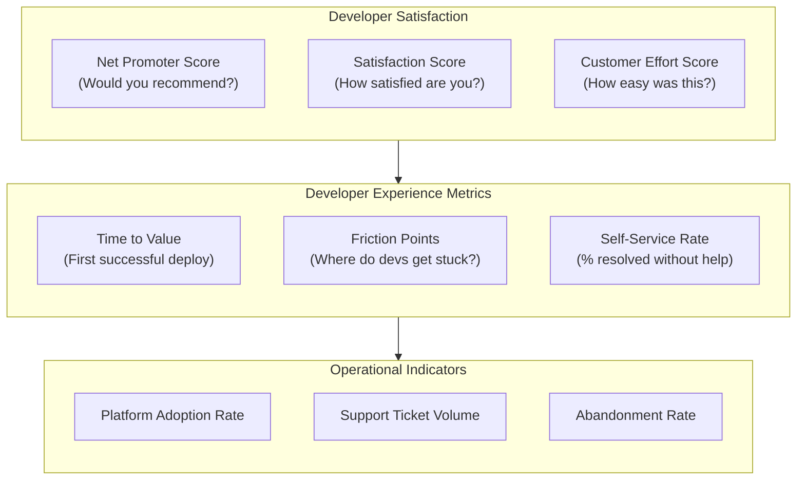
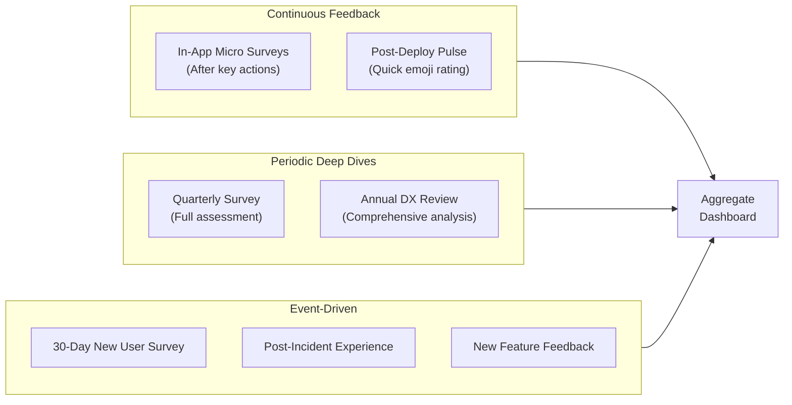
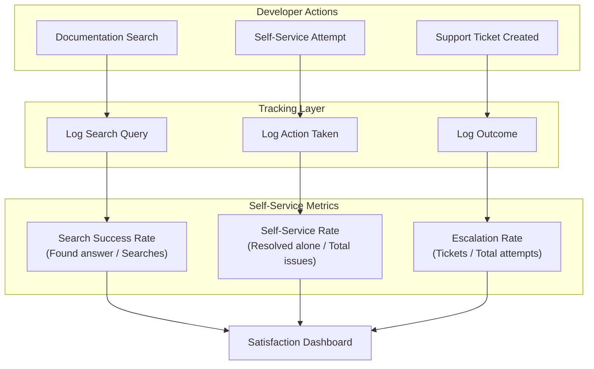
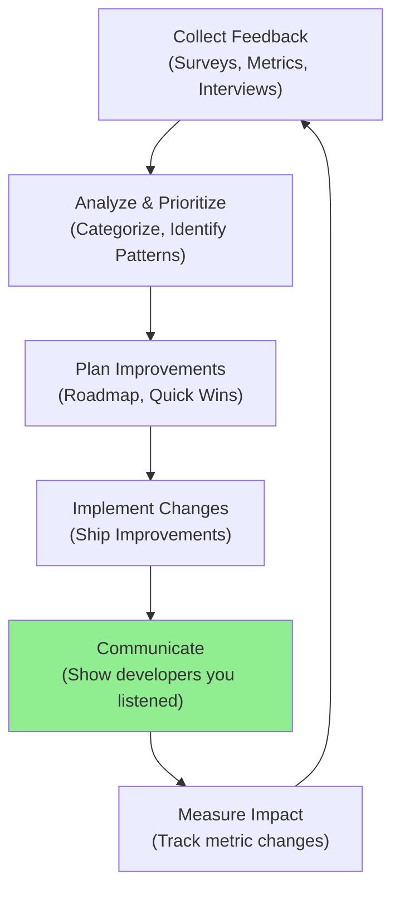

# How to Create Developer Satisfaction Metrics for Platform Engineering

Author: [nawazdhandala](https://github.com/nawazdhandala)

Tags: Platform Engineering, Developer Experience, Metrics, DX

Description: Learn to create developer satisfaction metrics for measuring and improving developer experience.

---

Platform engineering exists to serve developers. Yet many platform teams measure success by infrastructure metrics like uptime, deployment frequency, and resource utilization while completely ignoring the humans they serve. If developers hate using your platform, none of those metrics matter.

This guide walks through how to design, collect, analyze, and act on developer satisfaction metrics that actually drive improvement.

---

## Why Developer Satisfaction Matters

Developer satisfaction directly impacts business outcomes:

| Factor | Impact |
|--------|--------|
| **Retention** | Unhappy developers leave. Replacing them costs 6-9 months salary. |
| **Productivity** | Frustrated developers spend time fighting tools instead of building features. |
| **Adoption** | Developers route around bad platforms. Shadow IT emerges. |
| **Quality** | Rushed, frustrated developers ship bugs. |
| **Innovation** | Satisfied developers experiment and improve processes. |

> "A platform is only as good as the developers' willingness to use it."

---

## The Developer Satisfaction Framework

Developer satisfaction is multidimensional. You cannot capture it with a single metric. Here is a framework that covers the full spectrum:



---

## Survey Design: Getting Honest Feedback

### The Core Survey Questions

Design your survey to be short (under 5 minutes) but comprehensive. Here is a battle-tested template:

```typescript
// survey-schema.ts
// Define the structure of a developer satisfaction survey
// with typed questions and validation rules

interface SurveyQuestion {
  id: string;
  type: 'nps' | 'rating' | 'multiple_choice' | 'text';
  required: boolean;
  question: string;
  options?: string[];
  followUp?: {
    condition: (answer: number | string) => boolean;
    question: SurveyQuestion;
  };
}

interface DeveloperSatisfactionSurvey {
  version: string;
  sections: {
    name: string;
    questions: SurveyQuestion[];
  }[];
}

// The complete survey definition
const developerSatisfactionSurvey: DeveloperSatisfactionSurvey = {
  version: '2.0',
  sections: [
    {
      name: 'Overall Satisfaction',
      questions: [
        {
          id: 'nps',
          type: 'nps',
          required: true,
          question: 'How likely are you to recommend our platform to a colleague? (0-10)',
          // NPS follow-up captures the "why" behind the score
          followUp: {
            condition: (answer: number) => true, // Always ask
            question: {
              id: 'nps_reason',
              type: 'text',
              required: false,
              question: 'What is the primary reason for your score?',
            },
          },
        },
        {
          id: 'overall_satisfaction',
          type: 'rating',
          required: true,
          question: 'Overall, how satisfied are you with the platform? (1-5)',
        },
      ],
    },
    {
      name: 'Specific Areas',
      questions: [
        {
          id: 'documentation_quality',
          type: 'rating',
          required: true,
          question: 'How would you rate the quality of documentation? (1-5)',
        },
        {
          id: 'onboarding_ease',
          type: 'rating',
          required: true,
          question: 'How easy was it to get started with the platform? (1-5)',
        },
        {
          id: 'ci_cd_satisfaction',
          type: 'rating',
          required: true,
          question: 'How satisfied are you with the CI/CD pipeline experience? (1-5)',
        },
        {
          id: 'support_responsiveness',
          type: 'rating',
          required: true,
          question: 'How responsive is the platform team when you need help? (1-5)',
        },
        {
          id: 'biggest_friction',
          type: 'multiple_choice',
          required: true,
          question: 'What causes you the most friction when using the platform?',
          options: [
            'Slow builds/deployments',
            'Confusing configuration',
            'Lack of documentation',
            'Debugging issues',
            'Getting permissions/access',
            'Understanding errors',
            'Other (please specify)',
          ],
        },
      ],
    },
    {
      name: 'Open Feedback',
      questions: [
        {
          id: 'improvement_suggestion',
          type: 'text',
          required: false,
          question: 'If you could change one thing about the platform, what would it be?',
        },
        {
          id: 'positive_highlight',
          type: 'text',
          required: false,
          question: 'What do you like most about the platform?',
        },
      ],
    },
  ],
};

export { developerSatisfactionSurvey, SurveyQuestion, DeveloperSatisfactionSurvey };
```

### Survey Distribution Strategy

Timing and frequency matter. Here is a distribution model:



---

## NPS Tracking System

Net Promoter Score (NPS) is the industry standard for measuring loyalty. Here is how to implement it:

### NPS Calculation

```typescript
// nps-calculator.ts
// Calculate Net Promoter Score from survey responses
// NPS = % Promoters - % Detractors

interface NPSResponse {
  userId: string;
  score: number; // 0-10
  timestamp: Date;
  team?: string;
  reason?: string;
}

interface NPSResult {
  score: number;           // -100 to +100
  promoters: number;       // Count of 9-10 scores
  passives: number;        // Count of 7-8 scores
  detractors: number;      // Count of 0-6 scores
  totalResponses: number;
  breakdown: {
    promoterPercent: number;
    passivePercent: number;
    detractorPercent: number;
  };
}

function calculateNPS(responses: NPSResponse[]): NPSResult {
  // Filter out invalid responses
  const validResponses = responses.filter(
    (r) => r.score >= 0 && r.score <= 10
  );

  const total = validResponses.length;

  if (total === 0) {
    return {
      score: 0,
      promoters: 0,
      passives: 0,
      detractors: 0,
      totalResponses: 0,
      breakdown: {
        promoterPercent: 0,
        passivePercent: 0,
        detractorPercent: 0,
      },
    };
  }

  // Categorize responses
  // Promoters: 9-10 (enthusiastic supporters)
  // Passives: 7-8 (satisfied but not enthusiastic)
  // Detractors: 0-6 (unhappy, may spread negative feedback)
  const promoters = validResponses.filter((r) => r.score >= 9).length;
  const passives = validResponses.filter(
    (r) => r.score >= 7 && r.score <= 8
  ).length;
  const detractors = validResponses.filter((r) => r.score <= 6).length;

  // Calculate percentages
  const promoterPercent = (promoters / total) * 100;
  const passivePercent = (passives / total) * 100;
  const detractorPercent = (detractors / total) * 100;

  // NPS is the difference between promoter and detractor percentages
  const npsScore = Math.round(promoterPercent - detractorPercent);

  return {
    score: npsScore,
    promoters,
    passives,
    detractors,
    totalResponses: total,
    breakdown: {
      promoterPercent: Math.round(promoterPercent * 10) / 10,
      passivePercent: Math.round(passivePercent * 10) / 10,
      detractorPercent: Math.round(detractorPercent * 10) / 10,
    },
  };
}

// Calculate NPS trends over time
function calculateNPSTrend(
  responses: NPSResponse[],
  intervalDays: number = 30
): { date: string; nps: number; responses: number }[] {
  // Sort by timestamp
  const sorted = [...responses].sort(
    (a, b) => a.timestamp.getTime() - b.timestamp.getTime()
  );

  if (sorted.length === 0) return [];

  const startDate = sorted[0].timestamp;
  const endDate = sorted[sorted.length - 1].timestamp;
  const intervals: { date: string; nps: number; responses: number }[] = [];

  let currentStart = new Date(startDate);

  while (currentStart <= endDate) {
    const currentEnd = new Date(currentStart);
    currentEnd.setDate(currentEnd.getDate() + intervalDays);

    // Get responses in this interval
    const intervalResponses = sorted.filter(
      (r) => r.timestamp >= currentStart && r.timestamp < currentEnd
    );

    if (intervalResponses.length > 0) {
      const result = calculateNPS(intervalResponses);
      intervals.push({
        date: currentStart.toISOString().split('T')[0],
        nps: result.score,
        responses: result.totalResponses,
      });
    }

    currentStart = currentEnd;
  }

  return intervals;
}

export { calculateNPS, calculateNPSTrend, NPSResponse, NPSResult };
```

### NPS Interpretation Guide

| NPS Range | Interpretation | Action |
|-----------|----------------|--------|
| 70+ | World class | Maintain and share best practices |
| 50-69 | Excellent | Continue improvements, expand adoption |
| 30-49 | Good | Identify and address friction points |
| 0-29 | Needs improvement | Prioritize developer feedback |
| Below 0 | Critical | Emergency action required |

---

## Building a Real-Time Satisfaction Dashboard

### Data Collection API

```typescript
// satisfaction-api.ts
// API endpoints for collecting and retrieving satisfaction data

import express, { Request, Response, NextFunction } from 'express';

const app = express();
app.use(express.json());

// In-memory store (use a proper database in production)
interface SatisfactionRecord {
  id: string;
  userId: string;
  type: 'nps' | 'csat' | 'ces' | 'pulse';
  score: number;
  context: {
    feature?: string;
    action?: string;
    team?: string;
  };
  feedback?: string;
  timestamp: Date;
}

const satisfactionRecords: SatisfactionRecord[] = [];

// Middleware to validate score ranges
function validateScore(type: string, score: number): boolean {
  const ranges: Record<string, [number, number]> = {
    nps: [0, 10],
    csat: [1, 5],
    ces: [1, 7],
    pulse: [1, 5],
  };

  const range = ranges[type];
  if (!range) return false;

  return score >= range[0] && score <= range[1];
}

// POST /api/satisfaction - Record a satisfaction score
app.post('/api/satisfaction', (req: Request, res: Response) => {
  const { userId, type, score, context, feedback } = req.body;

  // Validate required fields
  if (!userId || !type || score === undefined) {
    return res.status(400).json({
      error: 'Missing required fields: userId, type, score',
    });
  }

  // Validate score range
  if (!validateScore(type, score)) {
    return res.status(400).json({
      error: `Invalid score for type ${type}`,
    });
  }

  const record: SatisfactionRecord = {
    id: `sat_${Date.now()}_${Math.random().toString(36).substr(2, 9)}`,
    userId,
    type,
    score,
    context: context || {},
    feedback,
    timestamp: new Date(),
  };

  satisfactionRecords.push(record);

  // Trigger alerts for low scores
  if (type === 'nps' && score <= 6) {
    triggerDetractorAlert(record);
  }

  res.status(201).json({ id: record.id, message: 'Recorded successfully' });
});

// GET /api/satisfaction/summary - Get aggregated metrics
app.get('/api/satisfaction/summary', (req: Request, res: Response) => {
  const { startDate, endDate, team } = req.query;

  let filtered = satisfactionRecords;

  // Apply date filters
  if (startDate) {
    const start = new Date(startDate as string);
    filtered = filtered.filter((r) => r.timestamp >= start);
  }

  if (endDate) {
    const end = new Date(endDate as string);
    filtered = filtered.filter((r) => r.timestamp <= end);
  }

  // Apply team filter
  if (team) {
    filtered = filtered.filter((r) => r.context.team === team);
  }

  // Calculate metrics for each type
  const npsResponses = filtered
    .filter((r) => r.type === 'nps')
    .map((r) => ({
      userId: r.userId,
      score: r.score,
      timestamp: r.timestamp,
    }));

  const csatResponses = filtered.filter((r) => r.type === 'csat');
  const cesResponses = filtered.filter((r) => r.type === 'ces');

  // Import and use NPS calculator
  const { calculateNPS } = require('./nps-calculator');
  const npsResult = calculateNPS(npsResponses);

  // Calculate CSAT (average of 1-5 scores, expressed as percentage)
  const csatScore =
    csatResponses.length > 0
      ? Math.round(
          (csatResponses.reduce((sum, r) => sum + r.score, 0) /
            csatResponses.length /
            5) *
            100
        )
      : null;

  // Calculate CES (average of 1-7 scores)
  const cesScore =
    cesResponses.length > 0
      ? Math.round(
          (cesResponses.reduce((sum, r) => sum + r.score, 0) /
            cesResponses.length) *
            10
        ) / 10
      : null;

  res.json({
    period: {
      start: startDate || 'all time',
      end: endDate || 'now',
    },
    nps: {
      score: npsResult.score,
      responses: npsResult.totalResponses,
      breakdown: npsResult.breakdown,
    },
    csat: {
      score: csatScore,
      responses: csatResponses.length,
    },
    ces: {
      score: cesScore,
      responses: cesResponses.length,
    },
    totalResponses: filtered.length,
  });
});

// Alert function for detractors
function triggerDetractorAlert(record: SatisfactionRecord): void {
  console.log(`[ALERT] Detractor detected:`, {
    userId: record.userId,
    score: record.score,
    feedback: record.feedback,
    team: record.context.team,
  });

  // In production, send to Slack, PagerDuty, or email
  // notificationService.send({
  //   channel: '#platform-feedback',
  //   message: `Low NPS score (${record.score}) from ${record.userId}`,
  //   details: record.feedback
  // });
}

export { app };
```

### Dashboard Metrics Visualization

```typescript
// dashboard-metrics.ts
// Calculate and format metrics for dashboard display

interface MetricCard {
  title: string;
  value: string | number;
  change: number;        // Percentage change from previous period
  trend: 'up' | 'down' | 'stable';
  status: 'good' | 'warning' | 'critical';
}

interface DashboardData {
  lastUpdated: Date;
  metrics: MetricCard[];
  charts: {
    npsTrend: { date: string; value: number }[];
    satisfactionByTeam: { team: string; nps: number; csat: number }[];
    frictionPoints: { category: string; count: number }[];
  };
}

function determineTrend(current: number, previous: number): 'up' | 'down' | 'stable' {
  const change = current - previous;
  if (Math.abs(change) < 1) return 'stable';
  return change > 0 ? 'up' : 'down';
}

function determineNPSStatus(score: number): 'good' | 'warning' | 'critical' {
  if (score >= 50) return 'good';
  if (score >= 0) return 'warning';
  return 'critical';
}

function determineCSATStatus(score: number): 'good' | 'warning' | 'critical' {
  if (score >= 80) return 'good';
  if (score >= 60) return 'warning';
  return 'critical';
}

function buildDashboardMetrics(
  currentPeriod: {
    nps: number;
    csat: number;
    ces: number;
    responseRate: number;
  },
  previousPeriod: {
    nps: number;
    csat: number;
    ces: number;
    responseRate: number;
  }
): MetricCard[] {
  return [
    {
      title: 'Net Promoter Score',
      value: currentPeriod.nps,
      change: Math.round((currentPeriod.nps - previousPeriod.nps) * 10) / 10,
      trend: determineTrend(currentPeriod.nps, previousPeriod.nps),
      status: determineNPSStatus(currentPeriod.nps),
    },
    {
      title: 'Customer Satisfaction (CSAT)',
      value: `${currentPeriod.csat}%`,
      change:
        Math.round((currentPeriod.csat - previousPeriod.csat) * 10) / 10,
      trend: determineTrend(currentPeriod.csat, previousPeriod.csat),
      status: determineCSATStatus(currentPeriod.csat),
    },
    {
      title: 'Customer Effort Score (CES)',
      value: `${currentPeriod.ces}/7`,
      change: Math.round((currentPeriod.ces - previousPeriod.ces) * 10) / 10,
      trend: determineTrend(currentPeriod.ces, previousPeriod.ces),
      // Lower CES is better (less effort)
      status: currentPeriod.ces <= 3 ? 'good' : currentPeriod.ces <= 5 ? 'warning' : 'critical',
    },
    {
      title: 'Survey Response Rate',
      value: `${currentPeriod.responseRate}%`,
      change:
        Math.round(
          (currentPeriod.responseRate - previousPeriod.responseRate) * 10
        ) / 10,
      trend: determineTrend(
        currentPeriod.responseRate,
        previousPeriod.responseRate
      ),
      status: currentPeriod.responseRate >= 30 ? 'good' : 'warning',
    },
  ];
}

export { buildDashboardMetrics, MetricCard, DashboardData };
```

---

## Tracking Developer Experience Metrics

Beyond surveys, track behavioral metrics that indicate satisfaction:

### Time to First Value (TTFV)

```typescript
// ttfv-tracker.ts
// Track how long it takes new developers to achieve their first success

interface OnboardingEvent {
  userId: string;
  event: string;
  timestamp: Date;
  metadata?: Record<string, any>;
}

interface TTFVResult {
  userId: string;
  startTime: Date;
  firstValueTime: Date | null;
  durationMinutes: number | null;
  milestones: {
    event: string;
    timestamp: Date;
    durationFromStart: number; // minutes
  }[];
}

// Define the milestones that indicate progress
const ONBOARDING_MILESTONES = [
  'account_created',
  'first_login',
  'documentation_viewed',
  'first_project_created',
  'first_build_triggered',
  'first_build_success',  // This is "first value"
  'first_deployment',
];

function calculateTTFV(events: OnboardingEvent[]): TTFVResult[] {
  // Group events by user
  const byUser = new Map<string, OnboardingEvent[]>();

  for (const event of events) {
    const userEvents = byUser.get(event.userId) || [];
    userEvents.push(event);
    byUser.set(event.userId, userEvents);
  }

  const results: TTFVResult[] = [];

  for (const [userId, userEvents] of byUser) {
    // Sort by timestamp
    const sorted = userEvents.sort(
      (a, b) => a.timestamp.getTime() - b.timestamp.getTime()
    );

    // Find start (account created) and first value (first successful build)
    const startEvent = sorted.find((e) => e.event === 'account_created');
    const firstValueEvent = sorted.find((e) => e.event === 'first_build_success');

    if (!startEvent) continue;

    const startTime = startEvent.timestamp;

    // Calculate milestone durations
    const milestones = sorted
      .filter((e) => ONBOARDING_MILESTONES.includes(e.event))
      .map((e) => ({
        event: e.event,
        timestamp: e.timestamp,
        durationFromStart: Math.round(
          (e.timestamp.getTime() - startTime.getTime()) / 60000
        ),
      }));

    results.push({
      userId,
      startTime,
      firstValueTime: firstValueEvent?.timestamp || null,
      durationMinutes: firstValueEvent
        ? Math.round(
            (firstValueEvent.timestamp.getTime() - startTime.getTime()) / 60000
          )
        : null,
      milestones,
    });
  }

  return results;
}

// Calculate aggregate TTFV statistics
function getTTFVStats(results: TTFVResult[]): {
  median: number;
  p75: number;
  p90: number;
  completionRate: number;
  dropoffPoints: { milestone: string; dropoffPercent: number }[];
} {
  // Filter to users who achieved first value
  const completed = results.filter((r) => r.durationMinutes !== null);
  const durations = completed
    .map((r) => r.durationMinutes!)
    .sort((a, b) => a - b);

  // Calculate percentiles
  const median = durations[Math.floor(durations.length * 0.5)] || 0;
  const p75 = durations[Math.floor(durations.length * 0.75)] || 0;
  const p90 = durations[Math.floor(durations.length * 0.9)] || 0;

  // Calculate completion rate
  const completionRate =
    results.length > 0
      ? Math.round((completed.length / results.length) * 100)
      : 0;

  // Find dropoff points
  const milestoneCounts = new Map<string, number>();
  for (const result of results) {
    for (const milestone of result.milestones) {
      milestoneCounts.set(
        milestone.event,
        (milestoneCounts.get(milestone.event) || 0) + 1
      );
    }
  }

  const dropoffPoints = ONBOARDING_MILESTONES.slice(1).map(
    (milestone, index) => {
      const previousMilestone = ONBOARDING_MILESTONES[index];
      const previousCount = milestoneCounts.get(previousMilestone) || 0;
      const currentCount = milestoneCounts.get(milestone) || 0;

      const dropoff =
        previousCount > 0
          ? Math.round(((previousCount - currentCount) / previousCount) * 100)
          : 0;

      return {
        milestone,
        dropoffPercent: dropoff,
      };
    }
  );

  return {
    median,
    p75,
    p90,
    completionRate,
    dropoffPoints,
  };
}

export { calculateTTFV, getTTFVStats, OnboardingEvent, TTFVResult };
```

### Self-Service Success Rate



---

## Analyzing Qualitative Feedback

Numbers tell you what is happening. Qualitative feedback tells you why.

### Feedback Categorization System

```typescript
// feedback-analyzer.ts
// Categorize and analyze open-ended feedback

interface FeedbackItem {
  id: string;
  userId: string;
  text: string;
  timestamp: Date;
  source: 'survey' | 'support_ticket' | 'slack' | 'interview';
  sentiment?: 'positive' | 'negative' | 'neutral';
  categories?: string[];
}

// Categories for platform engineering feedback
const FEEDBACK_CATEGORIES = {
  DOCUMENTATION: ['docs', 'documentation', 'guide', 'tutorial', 'example', 'readme'],
  PERFORMANCE: ['slow', 'fast', 'speed', 'latency', 'timeout', 'performance'],
  RELIABILITY: ['crash', 'down', 'outage', 'fail', 'error', 'bug', 'broken'],
  USABILITY: ['confusing', 'unclear', 'intuitive', 'easy', 'hard', 'complicated'],
  FEATURES: ['feature', 'request', 'want', 'need', 'missing', 'add'],
  SUPPORT: ['support', 'help', 'response', 'ticket', 'slack'],
  ONBOARDING: ['onboard', 'start', 'setup', 'first', 'new', 'begin'],
  CI_CD: ['build', 'deploy', 'pipeline', 'ci', 'cd', 'release'],
};

function categorizeFeedback(feedback: FeedbackItem): string[] {
  const text = feedback.text.toLowerCase();
  const categories: string[] = [];

  for (const [category, keywords] of Object.entries(FEEDBACK_CATEGORIES)) {
    if (keywords.some((keyword) => text.includes(keyword))) {
      categories.push(category);
    }
  }

  return categories.length > 0 ? categories : ['UNCATEGORIZED'];
}

function analyzeSentiment(text: string): 'positive' | 'negative' | 'neutral' {
  const positiveWords = [
    'love', 'great', 'awesome', 'excellent', 'amazing', 'helpful',
    'easy', 'fast', 'reliable', 'intuitive', 'best', 'thank',
  ];

  const negativeWords = [
    'hate', 'terrible', 'awful', 'horrible', 'frustrating', 'annoying',
    'slow', 'broken', 'confusing', 'worst', 'bad', 'difficult',
  ];

  const lowerText = text.toLowerCase();

  const positiveCount = positiveWords.filter((w) =>
    lowerText.includes(w)
  ).length;
  const negativeCount = negativeWords.filter((w) =>
    lowerText.includes(w)
  ).length;

  if (positiveCount > negativeCount) return 'positive';
  if (negativeCount > positiveCount) return 'negative';
  return 'neutral';
}

function generateFeedbackReport(
  feedback: FeedbackItem[]
): {
  totalFeedback: number;
  sentimentBreakdown: Record<string, number>;
  categoryBreakdown: Record<string, number>;
  topIssues: { category: string; count: number; examples: string[] }[];
  actionItems: string[];
} {
  // Process all feedback
  const processed = feedback.map((f) => ({
    ...f,
    sentiment: f.sentiment || analyzeSentiment(f.text),
    categories: f.categories || categorizeFeedback(f),
  }));

  // Sentiment breakdown
  const sentimentBreakdown = {
    positive: processed.filter((f) => f.sentiment === 'positive').length,
    negative: processed.filter((f) => f.sentiment === 'negative').length,
    neutral: processed.filter((f) => f.sentiment === 'neutral').length,
  };

  // Category breakdown
  const categoryBreakdown: Record<string, number> = {};
  for (const item of processed) {
    for (const category of item.categories!) {
      categoryBreakdown[category] = (categoryBreakdown[category] || 0) + 1;
    }
  }

  // Top issues (negative feedback by category)
  const negativeFeedback = processed.filter((f) => f.sentiment === 'negative');
  const issuesByCategory = new Map<string, FeedbackItem[]>();

  for (const item of negativeFeedback) {
    for (const category of item.categories!) {
      const items = issuesByCategory.get(category) || [];
      items.push(item);
      issuesByCategory.set(category, items);
    }
  }

  const topIssues = Array.from(issuesByCategory.entries())
    .map(([category, items]) => ({
      category,
      count: items.length,
      examples: items.slice(0, 3).map((i) => i.text),
    }))
    .sort((a, b) => b.count - a.count)
    .slice(0, 5);

  // Generate action items based on top issues
  const actionItems = topIssues.map((issue) => {
    switch (issue.category) {
      case 'DOCUMENTATION':
        return 'Review and update documentation based on common questions';
      case 'PERFORMANCE':
        return 'Investigate performance bottlenecks reported by developers';
      case 'RELIABILITY':
        return 'Prioritize stability fixes for reported issues';
      case 'USABILITY':
        return 'Conduct UX review of confusing workflows';
      case 'ONBOARDING':
        return 'Improve onboarding experience based on new user feedback';
      default:
        return `Address ${issue.category.toLowerCase()} concerns (${issue.count} reports)`;
    }
  });

  return {
    totalFeedback: feedback.length,
    sentimentBreakdown,
    categoryBreakdown,
    topIssues,
    actionItems,
  };
}

export { categorizeFeedback, analyzeSentiment, generateFeedbackReport, FeedbackItem };
```

---

## Improvement Strategies: Closing the Loop

Collecting metrics is pointless without action. Here is a framework for systematic improvement:

### The Feedback Loop



### Prioritization Framework

```typescript
// improvement-prioritizer.ts
// Prioritize improvements based on impact and effort

interface ImprovementItem {
  id: string;
  title: string;
  description: string;
  category: string;
  // Impact scoring (1-5)
  developerImpact: number;      // How many developers affected
  satisfactionImpact: number;   // Expected NPS/CSAT improvement
  frequencyOfPain: number;      // How often developers hit this issue
  // Effort scoring (1-5, lower is easier)
  implementationEffort: number;
  maintenanceEffort: number;
  riskLevel: number;
}

interface PrioritizedItem extends ImprovementItem {
  impactScore: number;
  effortScore: number;
  priorityScore: number;
  priority: 'critical' | 'high' | 'medium' | 'low';
}

function prioritizeImprovements(items: ImprovementItem[]): PrioritizedItem[] {
  return items
    .map((item) => {
      // Calculate impact score (weighted average)
      const impactScore =
        item.developerImpact * 0.4 +
        item.satisfactionImpact * 0.35 +
        item.frequencyOfPain * 0.25;

      // Calculate effort score (lower is better)
      const effortScore =
        item.implementationEffort * 0.5 +
        item.maintenanceEffort * 0.3 +
        item.riskLevel * 0.2;

      // Priority score = impact / effort (higher is better)
      const priorityScore = impactScore / effortScore;

      // Categorize priority
      let priority: 'critical' | 'high' | 'medium' | 'low';
      if (priorityScore >= 2) priority = 'critical';
      else if (priorityScore >= 1.5) priority = 'high';
      else if (priorityScore >= 1) priority = 'medium';
      else priority = 'low';

      return {
        ...item,
        impactScore: Math.round(impactScore * 100) / 100,
        effortScore: Math.round(effortScore * 100) / 100,
        priorityScore: Math.round(priorityScore * 100) / 100,
        priority,
      };
    })
    .sort((a, b) => b.priorityScore - a.priorityScore);
}

// Generate an improvement roadmap
function generateRoadmap(
  prioritized: PrioritizedItem[]
): {
  quickWins: PrioritizedItem[];
  shortTerm: PrioritizedItem[];
  longTerm: PrioritizedItem[];
  backlog: PrioritizedItem[];
} {
  return {
    // Quick wins: High impact, low effort
    quickWins: prioritized.filter(
      (i) => i.impactScore >= 3 && i.effortScore <= 2
    ),
    // Short term: High priority items (1-2 sprints)
    shortTerm: prioritized.filter(
      (i) => i.priority === 'critical' || i.priority === 'high'
    ).slice(0, 5),
    // Long term: Medium priority (next quarter)
    longTerm: prioritized.filter((i) => i.priority === 'medium').slice(0, 10),
    // Backlog: Everything else
    backlog: prioritized.filter((i) => i.priority === 'low'),
  };
}

export { prioritizeImprovements, generateRoadmap, ImprovementItem, PrioritizedItem };
```

### Communication Template

When you make improvements based on feedback, tell developers:

```markdown
## Platform Update: You Asked, We Delivered

Based on your feedback from our Q4 developer survey, we have made the following improvements:

### What We Heard
- "Builds are too slow" (mentioned by 45% of respondents)
- "Documentation is outdated" (mentioned by 32% of respondents)
- "Hard to debug deployment failures" (mentioned by 28% of respondents)

### What We Did
1. **Build Performance**: Implemented caching layer, reducing average build time from 8 minutes to 3 minutes
2. **Documentation**: Launched new docs site with updated guides and interactive examples
3. **Debugging**: Added detailed deployment logs and failure analysis tools

### Impact
- Build satisfaction score improved from 2.8 to 4.1 (out of 5)
- Documentation NPS increased by 25 points
- Support tickets related to deployments decreased by 40%

### What is Next
We are now focusing on:
- Improving local development experience
- Adding more self-service capabilities
- Reducing onboarding time for new developers

Thank you for your feedback. Keep it coming: [feedback form link]
```

---

## Benchmarking Your Metrics

How do you know if your metrics are good? Here are industry benchmarks:

| Metric | Poor | Average | Good | Excellent |
|--------|------|---------|------|-----------|
| **Developer NPS** | < 0 | 0-30 | 30-50 | > 50 |
| **CSAT (Platform)** | < 60% | 60-70% | 70-85% | > 85% |
| **Time to First Value** | > 1 week | 1-3 days | < 1 day | < 4 hours |
| **Self-Service Rate** | < 50% | 50-70% | 70-85% | > 85% |
| **Survey Response Rate** | < 10% | 10-20% | 20-40% | > 40% |
| **Support Ticket Resolution** | > 48 hours | 24-48 hours | 4-24 hours | < 4 hours |

---

## Common Pitfalls to Avoid

1. **Survey Fatigue**: Do not over-survey. Quarterly deep dives plus micro-feedback is enough.

2. **Vanity Metrics**: A high NPS means nothing if only happy developers respond.

3. **Ignoring Detractors**: Low scores are the most valuable feedback. Follow up personally.

4. **No Action**: Collecting feedback without acting on it destroys trust.

5. **Aggregate Only**: Segment by team, tenure, and role to find hidden problems.

6. **Delayed Response**: Feedback has a shelf life. Act within weeks, not months.

7. **Leading Questions**: "How great is our platform?" will not give you honest data.

---

## Summary

| Metric Type | What It Measures | Collection Method | Frequency |
|-------------|------------------|-------------------|-----------|
| **NPS** | Loyalty/Advocacy | Survey | Quarterly |
| **CSAT** | Satisfaction | Survey, In-app | Continuous |
| **CES** | Ease of use | Post-action survey | Per interaction |
| **TTFV** | Onboarding success | Event tracking | Continuous |
| **Self-Service Rate** | Independence | Analytics | Weekly |
| **Friction Points** | Pain areas | Survey, Tickets | Monthly |

Developer satisfaction is not a feel-good metric. It is a leading indicator of platform success, developer retention, and organizational velocity. Measure it systematically, act on it consistently, and communicate your improvements clearly.

Your developers will thank you. Your business will too.

---

**About OneUptime:** We build observability tools that help platform teams understand how their systems and developers are doing. From incident management to service catalogs, we help you keep your platform running and your developers happy. Learn more at [OneUptime.com](https://oneuptime.com).

**Related Reading:**

- [18 SRE Metrics Worth Tracking (And Why)](https://oneuptime.com/blog/post/2025-11-28-sre-metrics-to-track/view)
- [The Five Stages of SRE Maturity](https://oneuptime.com/blog/post/2025-09-01-the-five-stages-of-sre-maturity/view)
- [What is Toil and How to Eliminate It](https://oneuptime.com/blog/post/2025-10-01-what-is-toil-and-how-to-eliminate-it/view)
