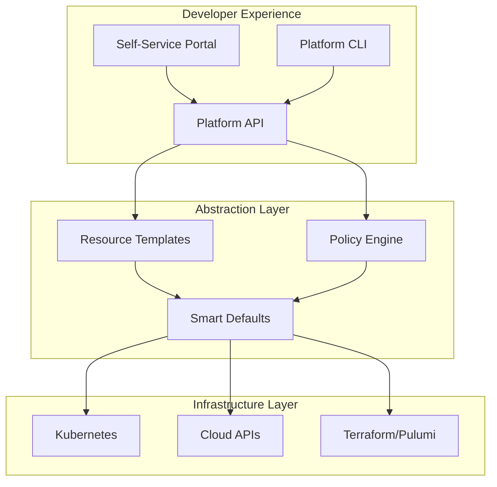
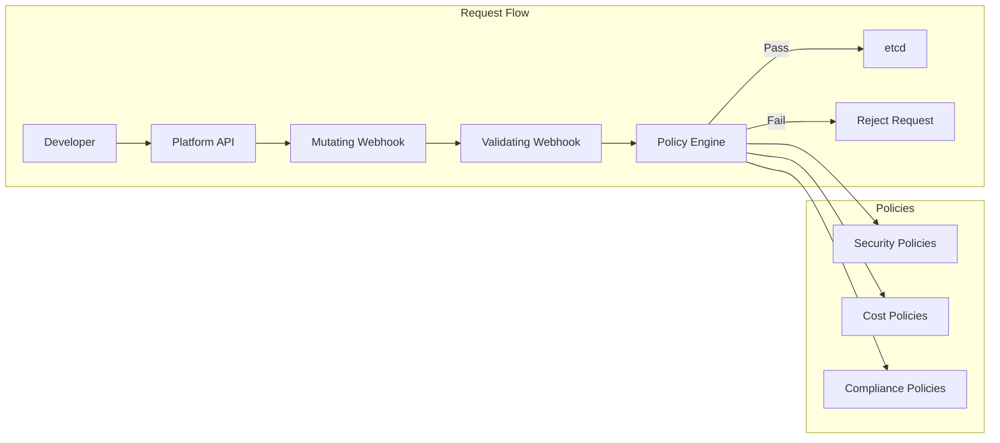
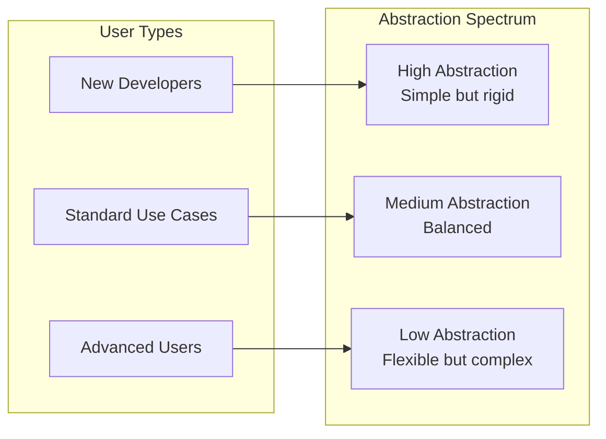
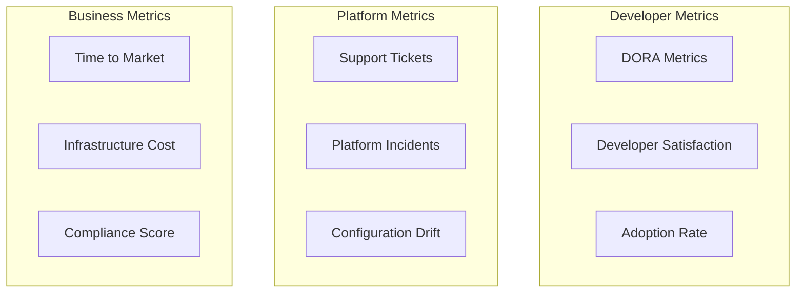

# How to Create Infrastructure Abstraction

Author: [nawazdhandala](https://github.com/nawazdhandala)

Tags: Platform Engineering, Infrastructure, Abstraction, Self-Service

Description: Learn to create infrastructure abstraction for hiding complexity from developers while maintaining control.

---

Platform engineering exists to solve a fundamental tension: developers need infrastructure to ship products, but they should not need to understand every detail of that infrastructure. Infrastructure abstraction is the practice of hiding complexity behind simple, well-designed interfaces that empower developers to self-serve while platform teams maintain control, security, and consistency.

## The Case for Infrastructure Abstraction

Without abstraction, every developer becomes a part-time infrastructure engineer. They copy Terraform modules, tweak YAML files they do not fully understand, and create snowflake configurations that drift over time. This leads to:

- Inconsistent deployments across teams
- Security vulnerabilities from misconfiguration
- Slow onboarding for new developers
- Platform teams drowning in support tickets

Abstraction solves these problems by providing guardrails and golden paths that make the right thing the easy thing.

## The Abstraction Pyramid



The pyramid has three layers:

| Layer | Purpose | Users |
|-------|---------|-------|
| Developer Experience | Simple interfaces for common tasks | Application developers |
| Abstraction Layer | Translation and policy enforcement | Platform API |
| Infrastructure Layer | Actual resource provisioning | Platform engineers |

## Designing Your Abstraction API

The key to good abstraction is finding the right level of detail. Too abstract and developers cannot express what they need. Too detailed and you have not abstracted anything.

### Start with Developer Intentions

Instead of exposing infrastructure primitives, expose what developers actually want to accomplish:

```yaml
# Bad: Too much infrastructure detail exposed
apiVersion: apps/v1
kind: Deployment
metadata:
  name: my-service
  labels:
    app: my-service
    team: payments
    env: production
spec:
  replicas: 3
  strategy:
    type: RollingUpdate
    rollingUpdate:
      maxSurge: 1
      maxUnavailable: 0
  selector:
    matchLabels:
      app: my-service
  template:
    metadata:
      labels:
        app: my-service
      annotations:
        prometheus.io/scrape: "true"
        prometheus.io/port: "8080"
    spec:
      serviceAccountName: my-service
      containers:
        - name: my-service
          image: registry.example.com/my-service:v1.2.3
          ports:
            - containerPort: 8080
          resources:
            requests:
              memory: "256Mi"
              cpu: "100m"
            limits:
              memory: "512Mi"
              cpu: "500m"
          livenessProbe:
            httpGet:
              path: /health
              port: 8080
            initialDelaySeconds: 10
            periodSeconds: 10
          readinessProbe:
            httpGet:
              path: /ready
              port: 8080
            initialDelaySeconds: 5
            periodSeconds: 5
          env:
            - name: DATABASE_URL
              valueFrom:
                secretKeyRef:
                  name: my-service-secrets
                  key: database-url
```

```yaml
# Good: Developer intent with smart defaults
apiVersion: platform.example.com/v1
kind: Service
metadata:
  name: my-service
spec:
  # What the developer actually cares about
  image: my-service:v1.2.3
  team: payments
  tier: production

  # Optional overrides for special cases
  scaling:
    min: 3
    max: 10
```

### The Platform Service Custom Resource

Here is a complete example of a platform abstraction implemented as a Kubernetes Custom Resource Definition:

```go
// api/v1/platformservice_types.go
package v1

import (
    metav1 "k8s.io/apimachinery/pkg/apis/meta/v1"
)

// PlatformServiceSpec defines what developers need to specify.
// All other details are handled by the platform.
type PlatformServiceSpec struct {
    // Image is the container image to deploy.
    // The registry prefix is added automatically based on environment.
    // +kubebuilder:validation:Required
    Image string `json:"image"`

    // Team identifies the owning team for billing, alerts, and access control.
    // +kubebuilder:validation:Required
    Team string `json:"team"`

    // Tier determines the SLA, resources, and redundancy level.
    // Options: development, staging, production
    // +kubebuilder:validation:Enum=development;staging;production
    // +kubebuilder:default=development
    Tier string `json:"tier,omitempty"`

    // Port is the main service port. Defaults to 8080.
    // +kubebuilder:validation:Minimum=1
    // +kubebuilder:validation:Maximum=65535
    // +kubebuilder:default=8080
    Port int32 `json:"port,omitempty"`

    // Public exposes the service externally via ingress.
    // Requires security review for production tier.
    // +kubebuilder:default=false
    Public bool `json:"public,omitempty"`

    // Config references a ConfigMap with application configuration.
    // The platform injects this as environment variables.
    Config string `json:"config,omitempty"`

    // Secrets references secrets to inject.
    // Follows naming convention: {service}-secrets
    Secrets []string `json:"secrets,omitempty"`

    // Dependencies lists other PlatformServices this service needs.
    // The platform ensures network policies allow communication.
    Dependencies []string `json:"dependencies,omitempty"`

    // Scaling overrides automatic scaling behavior.
    // If not specified, the platform chooses based on tier.
    Scaling *ScalingSpec `json:"scaling,omitempty"`

    // Resources overrides automatic resource allocation.
    // If not specified, the platform chooses based on tier.
    Resources *ResourceSpec `json:"resources,omitempty"`
}

// ScalingSpec allows developers to override automatic scaling.
type ScalingSpec struct {
    // Min replicas. Platform enforces minimums based on tier.
    // +kubebuilder:validation:Minimum=1
    Min int32 `json:"min,omitempty"`

    // Max replicas. Platform enforces maximums based on tier.
    // +kubebuilder:validation:Maximum=100
    Max int32 `json:"max,omitempty"`

    // TargetCPU is the CPU utilization target for HPA.
    // +kubebuilder:validation:Minimum=10
    // +kubebuilder:validation:Maximum=90
    // +kubebuilder:default=70
    TargetCPU int32 `json:"targetCPU,omitempty"`
}

// ResourceSpec allows developers to override automatic resource allocation.
type ResourceSpec struct {
    // Size is a t-shirt size for resources.
    // Options: small, medium, large, xlarge
    // +kubebuilder:validation:Enum=small;medium;large;xlarge
    Size string `json:"size,omitempty"`

    // CPU override in millicores (e.g., "500m").
    CPU string `json:"cpu,omitempty"`

    // Memory override (e.g., "512Mi").
    Memory string `json:"memory,omitempty"`
}

// PlatformServiceStatus reflects the current state of the service.
type PlatformServiceStatus struct {
    // Phase indicates the current lifecycle phase.
    // +kubebuilder:validation:Enum=Pending;Deploying;Running;Failed;Degraded
    Phase string `json:"phase,omitempty"`

    // Replicas shows current replica count.
    Replicas int32 `json:"replicas,omitempty"`

    // AvailableReplicas shows ready replicas.
    AvailableReplicas int32 `json:"availableReplicas,omitempty"`

    // Endpoint is the internal service URL.
    Endpoint string `json:"endpoint,omitempty"`

    // ExternalEndpoint is the public URL if exposed.
    ExternalEndpoint string `json:"externalEndpoint,omitempty"`

    // Conditions provide detailed status information.
    Conditions []metav1.Condition `json:"conditions,omitempty"`

    // LastDeployment tracks the most recent deployment.
    LastDeployment *DeploymentInfo `json:"lastDeployment,omitempty"`
}

// DeploymentInfo captures deployment metadata.
type DeploymentInfo struct {
    // Image that was deployed.
    Image string `json:"image,omitempty"`

    // Timestamp of the deployment.
    Timestamp metav1.Time `json:"timestamp,omitempty"`

    // Duration of the rollout.
    Duration string `json:"duration,omitempty"`

    // Status of the deployment.
    Status string `json:"status,omitempty"`
}

// +kubebuilder:object:root=true
// +kubebuilder:subresource:status
// +kubebuilder:printcolumn:name="Team",type="string",JSONPath=".spec.team"
// +kubebuilder:printcolumn:name="Tier",type="string",JSONPath=".spec.tier"
// +kubebuilder:printcolumn:name="Phase",type="string",JSONPath=".status.phase"
// +kubebuilder:printcolumn:name="Replicas",type="integer",JSONPath=".status.availableReplicas"
// +kubebuilder:printcolumn:name="Endpoint",type="string",JSONPath=".status.endpoint"
// +kubebuilder:printcolumn:name="Age",type="date",JSONPath=".metadata.creationTimestamp"

// PlatformService is the developer-facing abstraction for deploying services.
type PlatformService struct {
    metav1.TypeMeta   `json:",inline"`
    metav1.ObjectMeta `json:"metadata,omitempty"`

    Spec   PlatformServiceSpec   `json:"spec,omitempty"`
    Status PlatformServiceStatus `json:"status,omitempty"`
}
```

## Implementing Smart Defaults

Smart defaults are the heart of good abstraction. They encode organizational best practices and reduce the decisions developers need to make.

```go
// internal/defaults/defaults.go
package defaults

import (
    platformv1 "github.com/example/platform-operator/api/v1"
)

// TierConfig defines platform defaults for each service tier.
type TierConfig struct {
    // Scaling defaults
    MinReplicas int32
    MaxReplicas int32
    TargetCPU   int32

    // Resource defaults
    CPURequest    string
    CPULimit      string
    MemoryRequest string
    MemoryLimit   string

    // Reliability defaults
    PodDisruptionBudgetMinAvailable string
    TerminationGracePeriod          int64

    // Network defaults
    NetworkPolicyEnabled bool
    RateLimitRPS         int32
}

// TierDefaults maps tier names to their configurations.
// These values encode your organization's best practices.
var TierDefaults = map[string]TierConfig{
    "development": {
        MinReplicas:                     1,
        MaxReplicas:                     3,
        TargetCPU:                       80,
        CPURequest:                      "50m",
        CPULimit:                        "200m",
        MemoryRequest:                   "64Mi",
        MemoryLimit:                     "256Mi",
        PodDisruptionBudgetMinAvailable: "0",
        TerminationGracePeriod:          10,
        NetworkPolicyEnabled:            false,
        RateLimitRPS:                    100,
    },
    "staging": {
        MinReplicas:                     2,
        MaxReplicas:                     5,
        TargetCPU:                       70,
        CPURequest:                      "100m",
        CPULimit:                        "500m",
        MemoryRequest:                   "128Mi",
        MemoryLimit:                     "512Mi",
        PodDisruptionBudgetMinAvailable: "1",
        TerminationGracePeriod:          30,
        NetworkPolicyEnabled:            true,
        RateLimitRPS:                    500,
    },
    "production": {
        MinReplicas:                     3,
        MaxReplicas:                     20,
        TargetCPU:                       60,
        CPURequest:                      "200m",
        CPULimit:                        "1000m",
        MemoryRequest:                   "256Mi",
        MemoryLimit:                     "1Gi",
        PodDisruptionBudgetMinAvailable: "50%",
        TerminationGracePeriod:          60,
        NetworkPolicyEnabled:            true,
        RateLimitRPS:                    2000,
    },
}

// SizeToResources maps t-shirt sizes to resource specifications.
var SizeToResources = map[string]struct {
    CPURequest    string
    CPULimit      string
    MemoryRequest string
    MemoryLimit   string
}{
    "small": {
        CPURequest:    "100m",
        CPULimit:      "500m",
        MemoryRequest: "128Mi",
        MemoryLimit:   "512Mi",
    },
    "medium": {
        CPURequest:    "250m",
        CPULimit:      "1000m",
        MemoryRequest: "256Mi",
        MemoryLimit:   "1Gi",
    },
    "large": {
        CPURequest:    "500m",
        CPULimit:      "2000m",
        MemoryRequest: "512Mi",
        MemoryLimit:   "2Gi",
    },
    "xlarge": {
        CPURequest:    "1000m",
        CPULimit:      "4000m",
        MemoryRequest: "1Gi",
        MemoryLimit:   "4Gi",
    },
}

// ApplyDefaults fills in missing values with tier-appropriate defaults.
// This function is called by the mutating webhook before validation.
func ApplyDefaults(svc *platformv1.PlatformService) {
    tier := svc.Spec.Tier
    if tier == "" {
        tier = "development"
        svc.Spec.Tier = tier
    }

    config := TierDefaults[tier]

    // Apply port default
    if svc.Spec.Port == 0 {
        svc.Spec.Port = 8080
    }

    // Apply scaling defaults
    if svc.Spec.Scaling == nil {
        svc.Spec.Scaling = &platformv1.ScalingSpec{}
    }
    if svc.Spec.Scaling.Min == 0 {
        svc.Spec.Scaling.Min = config.MinReplicas
    }
    if svc.Spec.Scaling.Max == 0 {
        svc.Spec.Scaling.Max = config.MaxReplicas
    }
    if svc.Spec.Scaling.TargetCPU == 0 {
        svc.Spec.Scaling.TargetCPU = config.TargetCPU
    }

    // Apply resource defaults based on size or tier
    if svc.Spec.Resources == nil {
        svc.Spec.Resources = &platformv1.ResourceSpec{}
    }
    if svc.Spec.Resources.Size != "" {
        // Use t-shirt size if specified
        size := SizeToResources[svc.Spec.Resources.Size]
        if svc.Spec.Resources.CPU == "" {
            svc.Spec.Resources.CPU = size.CPURequest
        }
        if svc.Spec.Resources.Memory == "" {
            svc.Spec.Resources.Memory = size.MemoryRequest
        }
    } else {
        // Use tier defaults
        if svc.Spec.Resources.CPU == "" {
            svc.Spec.Resources.CPU = config.CPURequest
        }
        if svc.Spec.Resources.Memory == "" {
            svc.Spec.Resources.Memory = config.MemoryRequest
        }
    }
}
```

## Policy Enforcement

Abstraction is not just about convenience. It is also about control. A policy engine ensures that all services meet organizational requirements.



### Implementing Policy Checks

```go
// internal/policy/policy.go
package policy

import (
    "context"
    "fmt"
    "strings"

    platformv1 "github.com/example/platform-operator/api/v1"
)

// Violation represents a policy violation.
type Violation struct {
    Policy  string
    Message string
    Severe  bool
}

// Engine evaluates policies against platform resources.
type Engine struct {
    policies []Policy
}

// Policy is the interface all policies must implement.
type Policy interface {
    Name() string
    Evaluate(ctx context.Context, svc *platformv1.PlatformService) []Violation
}

// NewEngine creates a policy engine with all registered policies.
func NewEngine() *Engine {
    return &Engine{
        policies: []Policy{
            &ProductionMinReplicasPolicy{},
            &PublicEndpointPolicy{},
            &ResourceLimitsPolicy{},
            &ImageRegistryPolicy{},
            &TeamLabelPolicy{},
            &DependencyCyclePolicy{},
        },
    }
}

// Evaluate runs all policies and returns violations.
func (e *Engine) Evaluate(ctx context.Context, svc *platformv1.PlatformService) []Violation {
    var violations []Violation
    for _, policy := range e.policies {
        violations = append(violations, policy.Evaluate(ctx, svc)...)
    }
    return violations
}

// ProductionMinReplicasPolicy ensures production services have enough replicas.
type ProductionMinReplicasPolicy struct{}

func (p *ProductionMinReplicasPolicy) Name() string {
    return "production-min-replicas"
}

func (p *ProductionMinReplicasPolicy) Evaluate(ctx context.Context, svc *platformv1.PlatformService) []Violation {
    if svc.Spec.Tier != "production" {
        return nil
    }

    minRequired := int32(3)
    if svc.Spec.Scaling != nil && svc.Spec.Scaling.Min < minRequired {
        return []Violation{{
            Policy: p.Name(),
            Message: fmt.Sprintf(
                "Production services require at least %d replicas, got %d",
                minRequired,
                svc.Spec.Scaling.Min,
            ),
            Severe: true,
        }}
    }
    return nil
}

// PublicEndpointPolicy requires security review for public production endpoints.
type PublicEndpointPolicy struct{}

func (p *PublicEndpointPolicy) Name() string {
    return "public-endpoint-review"
}

func (p *PublicEndpointPolicy) Evaluate(ctx context.Context, svc *platformv1.PlatformService) []Violation {
    if !svc.Spec.Public || svc.Spec.Tier != "production" {
        return nil
    }

    // Check for security review annotation
    if svc.Annotations == nil || svc.Annotations["platform.example.com/security-review"] == "" {
        return []Violation{{
            Policy: p.Name(),
            Message: "Public production endpoints require security review. " +
                "Add annotation platform.example.com/security-review with the review ticket ID",
            Severe: true,
        }}
    }
    return nil
}

// ImageRegistryPolicy ensures images come from approved registries.
type ImageRegistryPolicy struct{}

func (p *ImageRegistryPolicy) Name() string {
    return "approved-registry"
}

func (p *ImageRegistryPolicy) Evaluate(ctx context.Context, svc *platformv1.PlatformService) []Violation {
    allowedPrefixes := []string{
        "registry.example.com/",
        "gcr.io/example-project/",
    }

    for _, prefix := range allowedPrefixes {
        if strings.HasPrefix(svc.Spec.Image, prefix) {
            return nil
        }
    }

    // Allow short names (we will prefix them)
    if !strings.Contains(svc.Spec.Image, "/") {
        return nil
    }

    return []Violation{{
        Policy: p.Name(),
        Message: fmt.Sprintf(
            "Image %s is not from an approved registry. Allowed: %v",
            svc.Spec.Image,
            allowedPrefixes,
        ),
        Severe: true,
    }}
}

// ResourceLimitsPolicy prevents runaway resource consumption.
type ResourceLimitsPolicy struct{}

func (p *ResourceLimitsPolicy) Name() string {
    return "resource-limits"
}

func (p *ResourceLimitsPolicy) Evaluate(ctx context.Context, svc *platformv1.PlatformService) []Violation {
    var violations []Violation

    if svc.Spec.Resources != nil && svc.Spec.Resources.Size == "xlarge" && svc.Spec.Tier != "production" {
        violations = append(violations, Violation{
            Policy:  p.Name(),
            Message: "XLarge resource size is only available for production tier services",
            Severe:  true,
        })
    }

    if svc.Spec.Scaling != nil && svc.Spec.Scaling.Max > 50 && svc.Spec.Tier != "production" {
        violations = append(violations, Violation{
            Policy:  p.Name(),
            Message: "Scaling beyond 50 replicas requires production tier",
            Severe:  true,
        })
    }

    return violations
}

// TeamLabelPolicy ensures team ownership is specified.
type TeamLabelPolicy struct{}

func (p *TeamLabelPolicy) Name() string {
    return "team-ownership"
}

func (p *TeamLabelPolicy) Evaluate(ctx context.Context, svc *platformv1.PlatformService) []Violation {
    if svc.Spec.Team == "" {
        return []Violation{{
            Policy:  p.Name(),
            Message: "Team ownership is required for all services",
            Severe:  true,
        }}
    }

    // Could validate against a list of known teams
    validTeams := map[string]bool{
        "payments": true,
        "orders":   true,
        "users":    true,
        "platform": true,
    }

    if !validTeams[svc.Spec.Team] {
        return []Violation{{
            Policy:  p.Name(),
            Message: fmt.Sprintf("Unknown team %q. Contact platform team to register your team", svc.Spec.Team),
            Severe:  true,
        }}
    }

    return nil
}

// DependencyCyclePolicy prevents circular dependencies.
type DependencyCyclePolicy struct{}

func (p *DependencyCyclePolicy) Name() string {
    return "dependency-cycle"
}

func (p *DependencyCyclePolicy) Evaluate(ctx context.Context, svc *platformv1.PlatformService) []Violation {
    // In a real implementation, this would query existing services
    // and build a dependency graph to detect cycles.
    // For now, just check for self-reference.
    for _, dep := range svc.Spec.Dependencies {
        if dep == svc.Name {
            return []Violation{{
                Policy:  p.Name(),
                Message: "Service cannot depend on itself",
                Severe:  true,
            }}
        }
    }
    return nil
}
```

## The Controller: Translating Abstraction to Infrastructure

The controller is where abstraction meets reality. It translates the simple PlatformService specification into the many Kubernetes resources needed to run a production service.

```go
// internal/controller/platformservice_controller.go
package controller

import (
    "context"
    "fmt"
    "time"

    appsv1 "k8s.io/api/apps/v1"
    autoscalingv2 "k8s.io/api/autoscaling/v2"
    corev1 "k8s.io/api/core/v1"
    networkingv1 "k8s.io/api/networking/v1"
    policyv1 "k8s.io/api/policy/v1"
    "k8s.io/apimachinery/pkg/api/errors"
    "k8s.io/apimachinery/pkg/api/resource"
    metav1 "k8s.io/apimachinery/pkg/apis/meta/v1"
    "k8s.io/apimachinery/pkg/runtime"
    "k8s.io/apimachinery/pkg/types"
    "k8s.io/apimachinery/pkg/util/intstr"
    ctrl "sigs.k8s.io/controller-runtime"
    "sigs.k8s.io/controller-runtime/pkg/client"
    "sigs.k8s.io/controller-runtime/pkg/controller/controllerutil"
    "sigs.k8s.io/controller-runtime/pkg/log"

    platformv1 "github.com/example/platform-operator/api/v1"
    "github.com/example/platform-operator/internal/defaults"
)

// PlatformServiceReconciler reconciles PlatformService objects.
type PlatformServiceReconciler struct {
    client.Client
    Scheme *runtime.Scheme
}

// Reconcile is the main control loop for PlatformService resources.
// It creates and updates all child resources to match the desired state.
func (r *PlatformServiceReconciler) Reconcile(ctx context.Context, req ctrl.Request) (ctrl.Result, error) {
    logger := log.FromContext(ctx)
    logger.Info("Reconciling PlatformService", "name", req.Name)

    // Fetch the PlatformService
    svc := &platformv1.PlatformService{}
    if err := r.Get(ctx, req.NamespacedName, svc); err != nil {
        if errors.IsNotFound(err) {
            return ctrl.Result{}, nil
        }
        return ctrl.Result{}, err
    }

    // Handle deletion
    if !svc.DeletionTimestamp.IsZero() {
        return r.handleDeletion(ctx, svc)
    }

    // Add finalizer
    if !controllerutil.ContainsFinalizer(svc, "platform.example.com/finalizer") {
        controllerutil.AddFinalizer(svc, "platform.example.com/finalizer")
        if err := r.Update(ctx, svc); err != nil {
            return ctrl.Result{}, err
        }
    }

    // Update status to Deploying
    svc.Status.Phase = "Deploying"
    if err := r.Status().Update(ctx, svc); err != nil {
        return ctrl.Result{}, err
    }

    // Reconcile all child resources
    // Each function creates or updates one type of resource
    reconcilers := []func(context.Context, *platformv1.PlatformService) error{
        r.reconcileDeployment,
        r.reconcileService,
        r.reconcileHPA,
        r.reconcilePDB,
        r.reconcileNetworkPolicy,
        r.reconcileIngress,
    }

    for _, reconcile := range reconcilers {
        if err := reconcile(ctx, svc); err != nil {
            svc.Status.Phase = "Failed"
            r.Status().Update(ctx, svc)
            return ctrl.Result{}, err
        }
    }

    // Update final status
    if err := r.updateStatus(ctx, svc); err != nil {
        return ctrl.Result{}, err
    }

    return ctrl.Result{RequeueAfter: 30 * time.Second}, nil
}

// reconcileDeployment creates or updates the Deployment for the service.
func (r *PlatformServiceReconciler) reconcileDeployment(ctx context.Context, svc *platformv1.PlatformService) error {
    logger := log.FromContext(ctx)

    deployment := &appsv1.Deployment{}
    err := r.Get(ctx, types.NamespacedName{Name: svc.Name, Namespace: svc.Namespace}, deployment)
    needsCreate := errors.IsNotFound(err)

    if err != nil && !needsCreate {
        return err
    }

    desired := r.buildDeployment(svc)
    if err := controllerutil.SetControllerReference(svc, desired, r.Scheme); err != nil {
        return err
    }

    if needsCreate {
        logger.Info("Creating Deployment", "name", desired.Name)
        return r.Create(ctx, desired)
    }

    // Update existing deployment
    deployment.Spec = desired.Spec
    logger.Info("Updating Deployment", "name", deployment.Name)
    return r.Update(ctx, deployment)
}

// buildDeployment constructs the Deployment specification.
// This is where all the platform best practices are encoded.
func (r *PlatformServiceReconciler) buildDeployment(svc *platformv1.PlatformService) *appsv1.Deployment {
    tierConfig := defaults.TierDefaults[svc.Spec.Tier]

    labels := map[string]string{
        "app":                          svc.Name,
        "platform.example.com/team":    svc.Spec.Team,
        "platform.example.com/tier":    svc.Spec.Tier,
        "platform.example.com/managed": "true",
    }

    // Build container environment from config and secrets
    var envVars []corev1.EnvVar
    var envFrom []corev1.EnvFromSource

    if svc.Spec.Config != "" {
        envFrom = append(envFrom, corev1.EnvFromSource{
            ConfigMapRef: &corev1.ConfigMapEnvSource{
                LocalObjectReference: corev1.LocalObjectReference{
                    Name: svc.Spec.Config,
                },
            },
        })
    }

    for _, secret := range svc.Spec.Secrets {
        envFrom = append(envFrom, corev1.EnvFromSource{
            SecretRef: &corev1.SecretEnvSource{
                LocalObjectReference: corev1.LocalObjectReference{
                    Name: secret,
                },
            },
        })
    }

    // Standard environment variables injected by platform
    envVars = append(envVars,
        corev1.EnvVar{Name: "SERVICE_NAME", Value: svc.Name},
        corev1.EnvVar{Name: "SERVICE_TIER", Value: svc.Spec.Tier},
        corev1.EnvVar{Name: "TEAM", Value: svc.Spec.Team},
        corev1.EnvVar{
            Name: "POD_NAME",
            ValueFrom: &corev1.EnvVarSource{
                FieldRef: &corev1.ObjectFieldSelector{FieldPath: "metadata.name"},
            },
        },
        corev1.EnvVar{
            Name: "POD_IP",
            ValueFrom: &corev1.EnvVarSource{
                FieldRef: &corev1.ObjectFieldSelector{FieldPath: "status.podIP"},
            },
        },
    )

    // Build resource requirements
    resources := corev1.ResourceRequirements{
        Requests: corev1.ResourceList{
            corev1.ResourceCPU:    resource.MustParse(svc.Spec.Resources.CPU),
            corev1.ResourceMemory: resource.MustParse(svc.Spec.Resources.Memory),
        },
        Limits: corev1.ResourceList{
            corev1.ResourceCPU:    resource.MustParse(tierConfig.CPULimit),
            corev1.ResourceMemory: resource.MustParse(tierConfig.MemoryLimit),
        },
    }

    // Build probes based on tier
    livenessProbe := &corev1.Probe{
        ProbeHandler: corev1.ProbeHandler{
            HTTPGet: &corev1.HTTPGetAction{
                Path: "/health",
                Port: intstr.FromInt(int(svc.Spec.Port)),
            },
        },
        InitialDelaySeconds: 10,
        PeriodSeconds:       10,
        TimeoutSeconds:      5,
        FailureThreshold:    3,
    }

    readinessProbe := &corev1.Probe{
        ProbeHandler: corev1.ProbeHandler{
            HTTPGet: &corev1.HTTPGetAction{
                Path: "/ready",
                Port: intstr.FromInt(int(svc.Spec.Port)),
            },
        },
        InitialDelaySeconds: 5,
        PeriodSeconds:       5,
        TimeoutSeconds:      3,
        FailureThreshold:    3,
    }

    replicas := svc.Spec.Scaling.Min

    return &appsv1.Deployment{
        ObjectMeta: metav1.ObjectMeta{
            Name:      svc.Name,
            Namespace: svc.Namespace,
            Labels:    labels,
        },
        Spec: appsv1.DeploymentSpec{
            Replicas: &replicas,
            Selector: &metav1.LabelSelector{MatchLabels: labels},
            Strategy: appsv1.DeploymentStrategy{
                Type: appsv1.RollingUpdateDeploymentStrategyType,
                RollingUpdate: &appsv1.RollingUpdateDeployment{
                    MaxSurge:       &intstr.IntOrString{Type: intstr.Int, IntVal: 1},
                    MaxUnavailable: &intstr.IntOrString{Type: intstr.Int, IntVal: 0},
                },
            },
            Template: corev1.PodTemplateSpec{
                ObjectMeta: metav1.ObjectMeta{
                    Labels: labels,
                    Annotations: map[string]string{
                        "prometheus.io/scrape": "true",
                        "prometheus.io/port":   fmt.Sprintf("%d", svc.Spec.Port),
                    },
                },
                Spec: corev1.PodSpec{
                    ServiceAccountName:            svc.Name,
                    TerminationGracePeriodSeconds: &tierConfig.TerminationGracePeriod,
                    Containers: []corev1.Container{{
                        Name:           "app",
                        Image:          r.resolveImage(svc),
                        Ports:          []corev1.ContainerPort{{ContainerPort: svc.Spec.Port}},
                        Env:            envVars,
                        EnvFrom:        envFrom,
                        Resources:      resources,
                        LivenessProbe:  livenessProbe,
                        ReadinessProbe: readinessProbe,
                        SecurityContext: &corev1.SecurityContext{
                            RunAsNonRoot:             boolPtr(true),
                            ReadOnlyRootFilesystem:   boolPtr(true),
                            AllowPrivilegeEscalation: boolPtr(false),
                        },
                    }},
                    Affinity: r.buildAffinity(svc),
                },
            },
        },
    }
}

// resolveImage adds the registry prefix if needed.
func (r *PlatformServiceReconciler) resolveImage(svc *platformv1.PlatformService) string {
    if strings.Contains(svc.Spec.Image, "/") {
        return svc.Spec.Image
    }
    return fmt.Sprintf("registry.example.com/%s/%s", svc.Spec.Team, svc.Spec.Image)
}

// buildAffinity creates pod anti-affinity for high availability.
func (r *PlatformServiceReconciler) buildAffinity(svc *platformv1.PlatformService) *corev1.Affinity {
    if svc.Spec.Tier == "development" {
        return nil
    }

    return &corev1.Affinity{
        PodAntiAffinity: &corev1.PodAntiAffinity{
            PreferredDuringSchedulingIgnoredDuringExecution: []corev1.WeightedPodAffinityTerm{{
                Weight: 100,
                PodAffinityTerm: corev1.PodAffinityTerm{
                    LabelSelector: &metav1.LabelSelector{
                        MatchLabels: map[string]string{"app": svc.Name},
                    },
                    TopologyKey: "topology.kubernetes.io/zone",
                },
            }},
        },
    }
}

// reconcileHPA creates or updates the HorizontalPodAutoscaler.
func (r *PlatformServiceReconciler) reconcileHPA(ctx context.Context, svc *platformv1.PlatformService) error {
    // Skip HPA for development tier
    if svc.Spec.Tier == "development" {
        return nil
    }

    hpa := &autoscalingv2.HorizontalPodAutoscaler{
        ObjectMeta: metav1.ObjectMeta{
            Name:      svc.Name,
            Namespace: svc.Namespace,
        },
        Spec: autoscalingv2.HorizontalPodAutoscalerSpec{
            ScaleTargetRef: autoscalingv2.CrossVersionObjectReference{
                APIVersion: "apps/v1",
                Kind:       "Deployment",
                Name:       svc.Name,
            },
            MinReplicas: &svc.Spec.Scaling.Min,
            MaxReplicas: svc.Spec.Scaling.Max,
            Metrics: []autoscalingv2.MetricSpec{{
                Type: autoscalingv2.ResourceMetricSourceType,
                Resource: &autoscalingv2.ResourceMetricSource{
                    Name: corev1.ResourceCPU,
                    Target: autoscalingv2.MetricTarget{
                        Type:               autoscalingv2.UtilizationMetricTargetType,
                        AverageUtilization: &svc.Spec.Scaling.TargetCPU,
                    },
                },
            }},
        },
    }

    if err := controllerutil.SetControllerReference(svc, hpa, r.Scheme); err != nil {
        return err
    }

    return r.createOrUpdate(ctx, hpa)
}

// reconcilePDB creates or updates the PodDisruptionBudget.
func (r *PlatformServiceReconciler) reconcilePDB(ctx context.Context, svc *platformv1.PlatformService) error {
    tierConfig := defaults.TierDefaults[svc.Spec.Tier]

    if tierConfig.PodDisruptionBudgetMinAvailable == "0" {
        return nil
    }

    pdb := &policyv1.PodDisruptionBudget{
        ObjectMeta: metav1.ObjectMeta{
            Name:      svc.Name,
            Namespace: svc.Namespace,
        },
        Spec: policyv1.PodDisruptionBudgetSpec{
            MinAvailable: &intstr.IntOrString{
                Type:   intstr.String,
                StrVal: tierConfig.PodDisruptionBudgetMinAvailable,
            },
            Selector: &metav1.LabelSelector{
                MatchLabels: map[string]string{"app": svc.Name},
            },
        },
    }

    if err := controllerutil.SetControllerReference(svc, pdb, r.Scheme); err != nil {
        return err
    }

    return r.createOrUpdate(ctx, pdb)
}

// reconcileNetworkPolicy creates network policies based on dependencies.
func (r *PlatformServiceReconciler) reconcileNetworkPolicy(ctx context.Context, svc *platformv1.PlatformService) error {
    tierConfig := defaults.TierDefaults[svc.Spec.Tier]

    if !tierConfig.NetworkPolicyEnabled {
        return nil
    }

    // Build ingress rules allowing traffic from dependencies
    var ingressRules []networkingv1.NetworkPolicyIngressRule

    // Allow traffic from services that depend on this one
    // In a real implementation, you would query for services that list this one as a dependency
    ingressRules = append(ingressRules, networkingv1.NetworkPolicyIngressRule{
        From: []networkingv1.NetworkPolicyPeer{{
            PodSelector: &metav1.LabelSelector{
                MatchLabels: map[string]string{
                    "platform.example.com/managed": "true",
                },
            },
        }},
        Ports: []networkingv1.NetworkPolicyPort{{
            Port: &intstr.IntOrString{Type: intstr.Int, IntVal: svc.Spec.Port},
        }},
    })

    // Allow traffic from ingress controller if public
    if svc.Spec.Public {
        ingressRules = append(ingressRules, networkingv1.NetworkPolicyIngressRule{
            From: []networkingv1.NetworkPolicyPeer{{
                NamespaceSelector: &metav1.LabelSelector{
                    MatchLabels: map[string]string{
                        "name": "ingress-nginx",
                    },
                },
            }},
        })
    }

    np := &networkingv1.NetworkPolicy{
        ObjectMeta: metav1.ObjectMeta{
            Name:      svc.Name,
            Namespace: svc.Namespace,
        },
        Spec: networkingv1.NetworkPolicySpec{
            PodSelector: metav1.LabelSelector{
                MatchLabels: map[string]string{"app": svc.Name},
            },
            PolicyTypes: []networkingv1.PolicyType{
                networkingv1.PolicyTypeIngress,
            },
            Ingress: ingressRules,
        },
    }

    if err := controllerutil.SetControllerReference(svc, np, r.Scheme); err != nil {
        return err
    }

    return r.createOrUpdate(ctx, np)
}

// reconcileIngress creates or updates the Ingress if the service is public.
func (r *PlatformServiceReconciler) reconcileIngress(ctx context.Context, svc *platformv1.PlatformService) error {
    if !svc.Spec.Public {
        return nil
    }

    pathType := networkingv1.PathTypePrefix
    ingress := &networkingv1.Ingress{
        ObjectMeta: metav1.ObjectMeta{
            Name:      svc.Name,
            Namespace: svc.Namespace,
            Annotations: map[string]string{
                "kubernetes.io/ingress.class":                "nginx",
                "cert-manager.io/cluster-issuer":             "letsencrypt-prod",
                "nginx.ingress.kubernetes.io/ssl-redirect":   "true",
                "nginx.ingress.kubernetes.io/proxy-body-size": "10m",
            },
        },
        Spec: networkingv1.IngressSpec{
            TLS: []networkingv1.IngressTLS{{
                Hosts:      []string{fmt.Sprintf("%s.example.com", svc.Name)},
                SecretName: fmt.Sprintf("%s-tls", svc.Name),
            }},
            Rules: []networkingv1.IngressRule{{
                Host: fmt.Sprintf("%s.example.com", svc.Name),
                IngressRuleValue: networkingv1.IngressRuleValue{
                    HTTP: &networkingv1.HTTPIngressRuleValue{
                        Paths: []networkingv1.HTTPIngressPath{{
                            Path:     "/",
                            PathType: &pathType,
                            Backend: networkingv1.IngressBackend{
                                Service: &networkingv1.IngressServiceBackend{
                                    Name: svc.Name,
                                    Port: networkingv1.ServiceBackendPort{
                                        Number: svc.Spec.Port,
                                    },
                                },
                            },
                        }},
                    },
                },
            }},
        },
    }

    if err := controllerutil.SetControllerReference(svc, ingress, r.Scheme); err != nil {
        return err
    }

    return r.createOrUpdate(ctx, ingress)
}

// Helper functions

func (r *PlatformServiceReconciler) createOrUpdate(ctx context.Context, obj client.Object) error {
    existing := obj.DeepCopyObject().(client.Object)
    err := r.Get(ctx, types.NamespacedName{Name: obj.GetName(), Namespace: obj.GetNamespace()}, existing)

    if errors.IsNotFound(err) {
        return r.Create(ctx, obj)
    }
    if err != nil {
        return err
    }

    return r.Update(ctx, obj)
}

func boolPtr(b bool) *bool {
    return &b
}
```

## Building a Self-Service CLI

A CLI gives developers a familiar interface for interacting with the platform.

```go
// cmd/platform/main.go
package main

import (
    "context"
    "fmt"
    "os"

    "github.com/spf13/cobra"
    "k8s.io/client-go/kubernetes/scheme"
    "sigs.k8s.io/controller-runtime/pkg/client"
    "sigs.k8s.io/controller-runtime/pkg/client/config"

    platformv1 "github.com/example/platform-operator/api/v1"
)

var rootCmd = &cobra.Command{
    Use:   "platform",
    Short: "Platform CLI for managing services",
}

var deployCmd = &cobra.Command{
    Use:   "deploy [service-name]",
    Short: "Deploy a service to the platform",
    Args:  cobra.ExactArgs(1),
    RunE:  runDeploy,
}

var statusCmd = &cobra.Command{
    Use:   "status [service-name]",
    Short: "Get the status of a service",
    Args:  cobra.ExactArgs(1),
    RunE:  runStatus,
}

var logsCmd = &cobra.Command{
    Use:   "logs [service-name]",
    Short: "Stream logs from a service",
    Args:  cobra.ExactArgs(1),
    RunE:  runLogs,
}

// Command flags
var (
    image     string
    team      string
    tier      string
    public    bool
    namespace string
)

func init() {
    // Register platform types with the scheme
    platformv1.AddToScheme(scheme.Scheme)

    // Add commands
    rootCmd.AddCommand(deployCmd)
    rootCmd.AddCommand(statusCmd)
    rootCmd.AddCommand(logsCmd)

    // Add flags
    deployCmd.Flags().StringVarP(&image, "image", "i", "", "Container image to deploy (required)")
    deployCmd.Flags().StringVarP(&team, "team", "t", "", "Team that owns this service (required)")
    deployCmd.Flags().StringVar(&tier, "tier", "development", "Service tier (development, staging, production)")
    deployCmd.Flags().BoolVar(&public, "public", false, "Expose service publicly")
    deployCmd.Flags().StringVarP(&namespace, "namespace", "n", "default", "Kubernetes namespace")

    deployCmd.MarkFlagRequired("image")
    deployCmd.MarkFlagRequired("team")
}

func main() {
    if err := rootCmd.Execute(); err != nil {
        fmt.Fprintln(os.Stderr, err)
        os.Exit(1)
    }
}

func getClient() (client.Client, error) {
    cfg, err := config.GetConfig()
    if err != nil {
        return nil, fmt.Errorf("failed to get kubeconfig: %w", err)
    }

    return client.New(cfg, client.Options{Scheme: scheme.Scheme})
}

func runDeploy(cmd *cobra.Command, args []string) error {
    serviceName := args[0]
    ctx := context.Background()

    k8sClient, err := getClient()
    if err != nil {
        return err
    }

    // Create or update the PlatformService
    svc := &platformv1.PlatformService{
        ObjectMeta: metav1.ObjectMeta{
            Name:      serviceName,
            Namespace: namespace,
        },
        Spec: platformv1.PlatformServiceSpec{
            Image:  image,
            Team:   team,
            Tier:   tier,
            Public: public,
        },
    }

    existing := &platformv1.PlatformService{}
    err = k8sClient.Get(ctx, client.ObjectKeyFromObject(svc), existing)

    if err != nil && !errors.IsNotFound(err) {
        return fmt.Errorf("failed to check existing service: %w", err)
    }

    if errors.IsNotFound(err) {
        fmt.Printf("Creating service %s...\n", serviceName)
        if err := k8sClient.Create(ctx, svc); err != nil {
            return fmt.Errorf("failed to create service: %w", err)
        }
    } else {
        fmt.Printf("Updating service %s...\n", serviceName)
        existing.Spec = svc.Spec
        if err := k8sClient.Update(ctx, existing); err != nil {
            return fmt.Errorf("failed to update service: %w", err)
        }
    }

    // Wait for deployment
    fmt.Println("Waiting for deployment to complete...")
    if err := waitForDeployment(ctx, k8sClient, serviceName, namespace); err != nil {
        return err
    }

    fmt.Printf("Service %s deployed successfully!\n", serviceName)
    return nil
}

func runStatus(cmd *cobra.Command, args []string) error {
    serviceName := args[0]
    ctx := context.Background()

    k8sClient, err := getClient()
    if err != nil {
        return err
    }

    svc := &platformv1.PlatformService{}
    if err := k8sClient.Get(ctx, client.ObjectKey{Name: serviceName, Namespace: namespace}, svc); err != nil {
        return fmt.Errorf("failed to get service: %w", err)
    }

    // Print status in a nice format
    fmt.Printf("Service: %s\n", svc.Name)
    fmt.Printf("Team: %s\n", svc.Spec.Team)
    fmt.Printf("Tier: %s\n", svc.Spec.Tier)
    fmt.Printf("Phase: %s\n", svc.Status.Phase)
    fmt.Printf("Replicas: %d/%d\n", svc.Status.AvailableReplicas, svc.Spec.Scaling.Min)
    fmt.Printf("Endpoint: %s\n", svc.Status.Endpoint)

    if svc.Status.ExternalEndpoint != "" {
        fmt.Printf("External URL: %s\n", svc.Status.ExternalEndpoint)
    }

    return nil
}

func runLogs(cmd *cobra.Command, args []string) error {
    // Implementation would use the Kubernetes logs API
    // to stream logs from the service pods
    fmt.Println("Streaming logs... (Ctrl+C to stop)")
    return nil
}

func waitForDeployment(ctx context.Context, k8sClient client.Client, name, ns string) error {
    // Poll until deployment is ready or timeout
    for i := 0; i < 60; i++ {
        svc := &platformv1.PlatformService{}
        if err := k8sClient.Get(ctx, client.ObjectKey{Name: name, Namespace: ns}, svc); err != nil {
            return err
        }

        if svc.Status.Phase == "Running" {
            return nil
        }

        if svc.Status.Phase == "Failed" {
            return fmt.Errorf("deployment failed")
        }

        time.Sleep(2 * time.Second)
    }

    return fmt.Errorf("deployment timed out")
}
```

## Example Usage

With all the pieces in place, developers can deploy services with minimal configuration:

```bash
# Deploy a simple service
platform deploy my-api \
  --image my-api:v1.2.3 \
  --team payments \
  --tier production \
  --public
```

Or using YAML:

```yaml
# my-service.yaml
apiVersion: platform.example.com/v1
kind: PlatformService
metadata:
  name: payment-processor
  namespace: payments
spec:
  image: payment-processor:v2.1.0
  team: payments
  tier: production
  port: 8080
  public: false

  # Optionally override defaults
  scaling:
    min: 5
    max: 20

  # Declare dependencies for network policy
  dependencies:
    - database-proxy
    - redis-cache

  # Reference configuration
  config: payment-processor-config
  secrets:
    - payment-processor-secrets
    - stripe-api-key
```

```bash
kubectl apply -f my-service.yaml
```

The platform handles everything else: creating the Deployment with proper probes and security contexts, setting up the Service and Ingress, configuring autoscaling and pod disruption budgets, creating network policies, and wiring up monitoring.

## Balancing Abstraction and Customization



The right level of abstraction depends on your users:

| User Type | Abstraction Level | Customization |
|-----------|-------------------|---------------|
| New developers | High | Minimal, rely on defaults |
| Standard use cases | Medium | Override common settings |
| Advanced users | Low | Full control when needed |

### Escape Hatches

Always provide escape hatches for advanced use cases:

```yaml
apiVersion: platform.example.com/v1
kind: PlatformService
metadata:
  name: special-service
  annotations:
    # Skip certain platform features
    platform.example.com/skip-network-policy: "true"
    platform.example.com/skip-hpa: "true"
spec:
  image: special-service:v1.0.0
  team: platform
  tier: production

  # Raw Kubernetes overrides for edge cases
  overrides:
    deployment:
      spec:
        template:
          spec:
            nodeSelector:
              dedicated: gpu
            tolerations:
              - key: gpu
                operator: Equal
                value: "true"
                effect: NoSchedule
```

## Measuring Abstraction Success

Track these metrics to evaluate your abstraction:



| Metric | Target | Why It Matters |
|--------|--------|----------------|
| Deployment frequency | Daily | Indicates developer autonomy |
| Lead time for changes | Less than 1 hour | Shows friction in the system |
| Support tickets per developer | Less than 1 per month | Measures abstraction completeness |
| Platform adoption rate | Greater than 80% | Shows value delivery |
| Configuration drift | Near zero | Validates policy enforcement |

## Common Pitfalls

### 1. Abstracting Too Early

Do not build abstractions before you understand the problems. Start with direct Kubernetes access, observe patterns, then abstract.

### 2. Leaky Abstractions

When errors from underlying systems bubble up unchanged, developers face complexity you meant to hide. Wrap errors with context:

```go
if err != nil {
    // Bad: leaky abstraction
    return err

    // Good: meaningful error
    return fmt.Errorf("failed to create service %s: check image name and registry access", svc.Name)
}
```

### 3. No Escape Hatch

When developers cannot do something with your abstraction, they will work around it entirely. Provide controlled escape hatches.

### 4. Ignoring Observability

Developers need to understand what the platform is doing. Expose status, events, and logs clearly.

---

Infrastructure abstraction is not about removing control from developers. It is about removing unnecessary decisions. When done well, developers spend less time on infrastructure plumbing and more time building features. Platform teams spend less time on tickets and more time improving the platform. The organization moves faster with better consistency and security.

Start small. Abstract one painful workflow. Measure the impact. Iterate. Your platform will evolve alongside your organization's needs.
