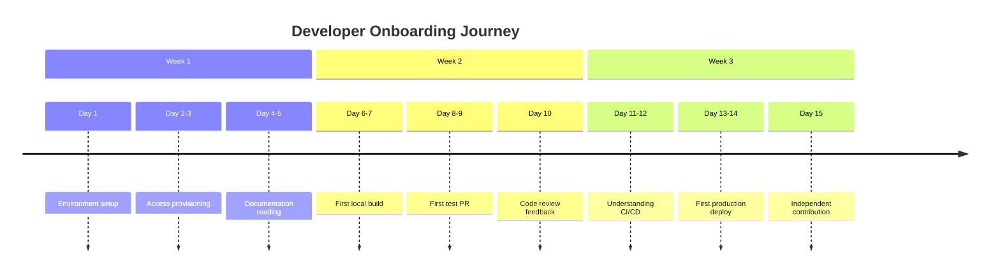
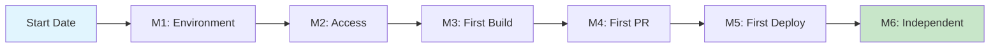
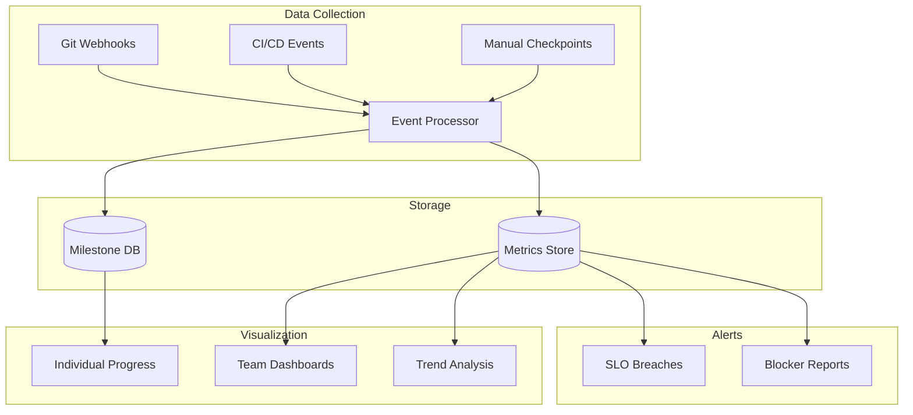
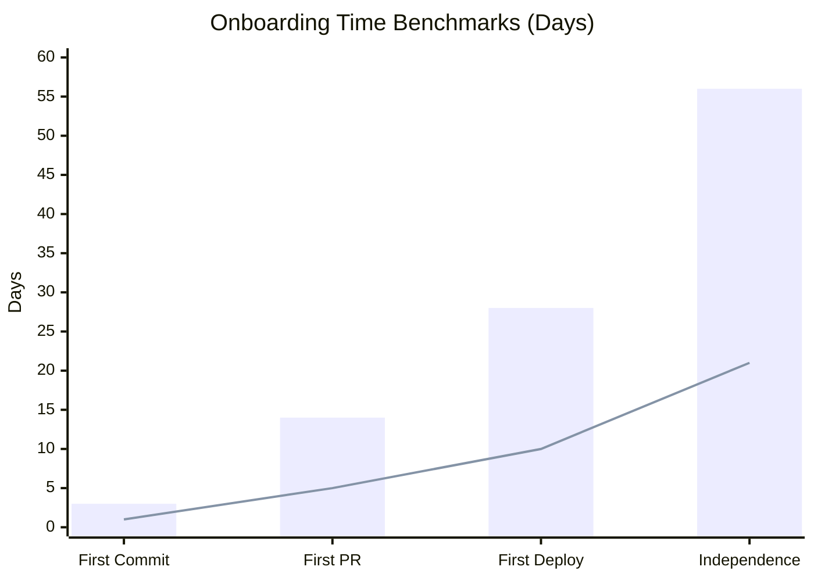
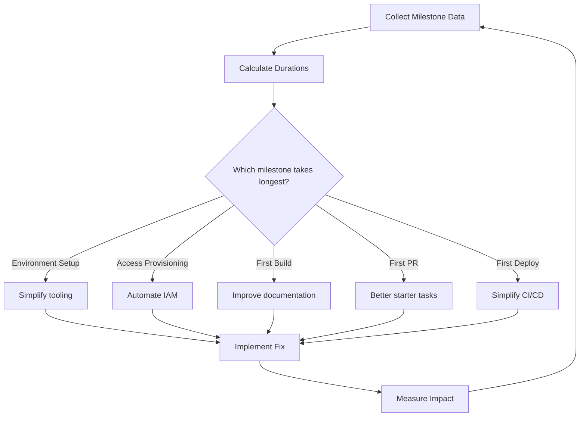

# How to Build Onboarding Time Tracking for Platform Engineering

Author: [nawazdhandala](https://github.com/nawazdhandala)

Tags: Platform Engineering, Onboarding, Developer Experience, Metrics

Description: Learn to build onboarding time tracking for measuring and reducing developer ramp-up time.

---

## Why Track Onboarding Time?

Developer onboarding time is one of the most overlooked metrics in platform engineering. When a new engineer joins your team, how long does it take them to ship their first meaningful contribution? Days? Weeks? Months?

This metric matters because:

- **Cost**: Every week a developer spends onboarding instead of shipping is lost productivity
- **Retention**: Frustrating onboarding experiences lead to early attrition
- **Platform quality**: Long onboarding times signal platform complexity and missing documentation
- **Scaling**: You cannot scale engineering without predictable onboarding

> "The best platforms make new developers productive on day one. The worst make them question their career choices."

---

## What is Onboarding Time?

Onboarding time is the duration from a developer's start date to their first independent, production-ready contribution. This is not about their first commit or their first PR. It is about when they can operate autonomously within your platform.



---

## Defining Onboarding Milestones

Before you can track onboarding time, you need to define what "onboarded" means. Break the journey into measurable milestones.

### Core Milestones

| Milestone | Description | Target Time |
|-----------|-------------|-------------|
| M1: Environment Ready | Local dev environment running | < 4 hours |
| M2: Access Complete | All required systems accessible | < 1 day |
| M3: First Build | Successfully build and run the application | < 1 day |
| M4: First PR Merged | Non-trivial PR merged to main | < 1 week |
| M5: First Deploy | Code deployed to production | < 2 weeks |
| M6: Independent Work | Assigned work without pairing | < 3 weeks |



---

## Building the Tracking System

Here is a practical implementation for tracking onboarding milestones. We will use a combination of automated events and manual checkpoints.

### Data Model

```typescript
// onboarding-tracker/src/types.ts

/**
 * Represents a single onboarding milestone event.
 * Each milestone is recorded when a developer reaches
 * a specific point in their onboarding journey.
 */
interface OnboardingMilestone {
  id: string;
  developerId: string;
  developerName: string;
  milestoneType: MilestoneType;
  timestamp: Date;
  metadata: Record<string, unknown>;
  // Optional: who verified this milestone was complete
  verifiedBy?: string;
}

/**
 * Enumeration of all trackable milestones.
 * Add new milestones here as your onboarding process evolves.
 */
enum MilestoneType {
  START_DATE = 'START_DATE',
  ENVIRONMENT_READY = 'ENVIRONMENT_READY',
  ACCESS_COMPLETE = 'ACCESS_COMPLETE',
  FIRST_BUILD = 'FIRST_BUILD',
  FIRST_PR_OPENED = 'FIRST_PR_OPENED',
  FIRST_PR_MERGED = 'FIRST_PR_MERGED',
  FIRST_DEPLOY = 'FIRST_DEPLOY',
  INDEPENDENT_WORK = 'INDEPENDENT_WORK',
}

/**
 * Aggregated onboarding metrics for a single developer.
 * Used for dashboard displays and reporting.
 */
interface OnboardingMetrics {
  developerId: string;
  startDate: Date;
  currentMilestone: MilestoneType;
  milestoneTimestamps: Map<MilestoneType, Date>;
  // Time in hours between each milestone
  milestoneDurations: Map<string, number>;
  // Total onboarding time in hours (null if not complete)
  totalOnboardingHours: number | null;
  // Blockers encountered during onboarding
  blockers: OnboardingBlocker[];
}

/**
 * Tracks issues that slow down onboarding.
 * Essential for identifying systemic problems.
 */
interface OnboardingBlocker {
  id: string;
  developerId: string;
  description: string;
  category: BlockerCategory;
  reportedAt: Date;
  resolvedAt: Date | null;
  resolutionNotes: string | null;
}

enum BlockerCategory {
  ACCESS = 'ACCESS',
  DOCUMENTATION = 'DOCUMENTATION',
  TOOLING = 'TOOLING',
  ENVIRONMENT = 'ENVIRONMENT',
  DEPENDENCIES = 'DEPENDENCIES',
  OTHER = 'OTHER',
}
```

### Event Collection Service

```typescript
// onboarding-tracker/src/services/milestone-service.ts

import { OnboardingMilestone, MilestoneType, OnboardingMetrics } from '../types';

/**
 * Service for recording and querying onboarding milestones.
 * This is the core of your onboarding tracking system.
 */
class MilestoneService {
  private repository: MilestoneRepository;
  private notificationService: NotificationService;

  constructor(
    repository: MilestoneRepository,
    notificationService: NotificationService
  ) {
    this.repository = repository;
    this.notificationService = notificationService;
  }

  /**
   * Records a milestone completion for a developer.
   * Automatically calculates duration from previous milestone.
   *
   * @param developerId - Unique identifier for the developer
   * @param milestoneType - The milestone being recorded
   * @param metadata - Additional context (e.g., PR URL, deploy ID)
   */
  async recordMilestone(
    developerId: string,
    milestoneType: MilestoneType,
    metadata: Record<string, unknown> = {}
  ): Promise<OnboardingMilestone> {
    // Check if milestone already recorded (idempotency)
    const existing = await this.repository.findMilestone(
      developerId,
      milestoneType
    );

    if (existing) {
      console.log(
        `Milestone ${milestoneType} already recorded for ${developerId}`
      );
      return existing;
    }

    // Create the milestone record
    const milestone: OnboardingMilestone = {
      id: generateUUID(),
      developerId,
      developerName: await this.getDeveloperName(developerId),
      milestoneType,
      timestamp: new Date(),
      metadata,
    };

    // Persist to database
    await this.repository.saveMilestone(milestone);

    // Calculate time since previous milestone
    const previousMilestone = await this.getPreviousMilestone(
      developerId,
      milestoneType
    );

    if (previousMilestone) {
      const durationHours = this.calculateDurationHours(
        previousMilestone.timestamp,
        milestone.timestamp
      );

      // Log for observability
      console.log(
        `Developer ${developerId} reached ${milestoneType} ` +
        `in ${durationHours.toFixed(1)} hours from ${previousMilestone.milestoneType}`
      );
    }

    // Notify relevant parties (manager, platform team)
    await this.notificationService.notifyMilestoneReached(milestone);

    return milestone;
  }

  /**
   * Calculates comprehensive onboarding metrics for a developer.
   * Use this for individual progress tracking.
   */
  async getMetrics(developerId: string): Promise<OnboardingMetrics> {
    const milestones = await this.repository.findAllMilestones(developerId);
    const blockers = await this.repository.findBlockers(developerId);

    // Build timestamp map
    const milestoneTimestamps = new Map<MilestoneType, Date>();
    for (const m of milestones) {
      milestoneTimestamps.set(m.milestoneType, m.timestamp);
    }

    // Calculate durations between consecutive milestones
    const milestoneDurations = this.calculateMilestoneDurations(milestones);

    // Determine current milestone (most recent)
    const currentMilestone = milestones.length > 0
      ? milestones[milestones.length - 1].milestoneType
      : MilestoneType.START_DATE;

    // Calculate total time if onboarding is complete
    const startDate = milestoneTimestamps.get(MilestoneType.START_DATE);
    const independentDate = milestoneTimestamps.get(
      MilestoneType.INDEPENDENT_WORK
    );

    const totalOnboardingHours = (startDate && independentDate)
      ? this.calculateDurationHours(startDate, independentDate)
      : null;

    return {
      developerId,
      startDate: startDate || new Date(),
      currentMilestone,
      milestoneTimestamps,
      milestoneDurations,
      totalOnboardingHours,
      blockers,
    };
  }

  /**
   * Calculates duration in hours between two timestamps.
   * Excludes weekends for more accurate business-time tracking.
   */
  private calculateDurationHours(start: Date, end: Date): number {
    // Simple implementation: total hours
    // For production: exclude weekends and holidays
    const milliseconds = end.getTime() - start.getTime();
    return milliseconds / (1000 * 60 * 60);
  }

  /**
   * Maps each milestone transition to its duration.
   * Returns a map like: "START_DATE->ENVIRONMENT_READY" => 4.5
   */
  private calculateMilestoneDurations(
    milestones: OnboardingMilestone[]
  ): Map<string, number> {
    const durations = new Map<string, number>();

    // Sort by timestamp
    const sorted = [...milestones].sort(
      (a, b) => a.timestamp.getTime() - b.timestamp.getTime()
    );

    for (let i = 1; i < sorted.length; i++) {
      const prev = sorted[i - 1];
      const curr = sorted[i];
      const key = `${prev.milestoneType}->${curr.milestoneType}`;
      const hours = this.calculateDurationHours(prev.timestamp, curr.timestamp);
      durations.set(key, hours);
    }

    return durations;
  }
}
```

---

## Automating Milestone Detection

Manual tracking is error-prone and adds friction. Automate milestone detection where possible.

### Git-Based Automation

```typescript
// onboarding-tracker/src/automation/git-hooks.ts

import { MilestoneService, MilestoneType } from '../services/milestone-service';

/**
 * Webhook handler for GitHub/GitLab events.
 * Automatically records milestones based on git activity.
 */
class GitWebhookHandler {
  private milestoneService: MilestoneService;
  private developerRegistry: DeveloperRegistry;

  constructor(
    milestoneService: MilestoneService,
    developerRegistry: DeveloperRegistry
  ) {
    this.milestoneService = milestoneService;
    this.developerRegistry = developerRegistry;
  }

  /**
   * Handles pull request events from GitHub/GitLab.
   * Records FIRST_PR_OPENED and FIRST_PR_MERGED milestones.
   */
  async handlePullRequestEvent(event: PullRequestEvent): Promise<void> {
    const developer = await this.developerRegistry.findByGitUsername(
      event.author
    );

    // Skip if not a tracked developer (not in onboarding)
    if (!developer || !developer.isOnboarding) {
      return;
    }

    // Check if this is their first PR
    const prCount = await this.countPullRequests(developer.id);

    if (event.action === 'opened' && prCount === 1) {
      // First PR opened
      await this.milestoneService.recordMilestone(
        developer.id,
        MilestoneType.FIRST_PR_OPENED,
        {
          prUrl: event.pullRequest.url,
          prTitle: event.pullRequest.title,
          repository: event.repository,
        }
      );
    }

    if (event.action === 'merged' && prCount === 1) {
      // First PR merged
      await this.milestoneService.recordMilestone(
        developer.id,
        MilestoneType.FIRST_PR_MERGED,
        {
          prUrl: event.pullRequest.url,
          prTitle: event.pullRequest.title,
          repository: event.repository,
          reviewers: event.pullRequest.reviewers,
          mergedBy: event.pullRequest.mergedBy,
        }
      );
    }
  }

  /**
   * Handles deployment events from CI/CD system.
   * Records FIRST_DEPLOY milestone when code reaches production.
   */
  async handleDeploymentEvent(event: DeploymentEvent): Promise<void> {
    // Only track production deployments
    if (event.environment !== 'production') {
      return;
    }

    // Find all developers who authored commits in this deployment
    const authors = await this.getDeploymentAuthors(event.commitShas);

    for (const author of authors) {
      const developer = await this.developerRegistry.findByGitUsername(author);

      if (!developer || !developer.isOnboarding) {
        continue;
      }

      // Check if this is their first production deploy
      const deployCount = await this.countProductionDeploys(developer.id);

      if (deployCount === 1) {
        await this.milestoneService.recordMilestone(
          developer.id,
          MilestoneType.FIRST_DEPLOY,
          {
            deploymentId: event.deploymentId,
            environment: event.environment,
            commitShas: event.commitShas,
            deployedAt: event.timestamp,
          }
        );
      }
    }
  }
}
```

### Environment Setup Automation

```yaml
# onboarding-tracker/scripts/setup-environment.yaml
#
# This script runs during developer environment setup.
# It reports progress to the onboarding tracker automatically.

name: Developer Environment Setup

steps:
  - name: Clone repositories
    run: |
      git clone $MAIN_REPO
      git clone $SHARED_LIBS_REPO
    on_complete:
      report_progress:
        milestone: ENVIRONMENT_SETUP_CLONE
        percentage: 20

  - name: Install dependencies
    run: |
      npm install
      pip install -r requirements.txt
    on_complete:
      report_progress:
        milestone: ENVIRONMENT_SETUP_DEPS
        percentage: 50

  - name: Configure local services
    run: |
      docker-compose up -d
      ./scripts/setup-local-db.sh
    on_complete:
      report_progress:
        milestone: ENVIRONMENT_SETUP_SERVICES
        percentage: 80

  - name: Run verification tests
    run: |
      npm run test:smoke
      ./scripts/verify-setup.sh
    on_complete:
      report_progress:
        milestone: ENVIRONMENT_READY
        percentage: 100
      record_milestone:
        type: ENVIRONMENT_READY
        metadata:
          setup_script_version: "2.1.0"
          duration_minutes: $ELAPSED_TIME
```

---

## Building the Dashboard

Visualize onboarding metrics to identify bottlenecks and track improvements.



### Dashboard Metrics

```typescript
// onboarding-tracker/src/dashboard/metrics.ts

/**
 * Aggregates onboarding metrics across the organization.
 * Use these for executive dashboards and trend analysis.
 */
class OnboardingDashboard {
  private repository: MilestoneRepository;

  /**
   * Calculates key onboarding metrics for a time period.
   * Returns data suitable for dashboard visualization.
   */
  async getOrganizationMetrics(
    startDate: Date,
    endDate: Date
  ): Promise<OrganizationOnboardingMetrics> {
    // Get all developers who started in the period
    const developers = await this.repository.findDevelopersStartedBetween(
      startDate,
      endDate
    );

    // Calculate metrics for completed onboardings
    const completedOnboardings = developers.filter(
      (d) => d.totalOnboardingHours !== null
    );

    // Average time to each milestone
    const milestoneAverages = await this.calculateMilestoneAverages(developers);

    // Identify common blockers
    const blockerAnalysis = await this.analyzeBlockers(developers);

    return {
      // Total developers who started onboarding
      totalStarted: developers.length,

      // Developers who completed onboarding
      totalCompleted: completedOnboardings.length,

      // Completion rate (useful for tracking dropoff)
      completionRate: completedOnboardings.length / developers.length,

      // Average total onboarding time in hours
      averageOnboardingHours: this.calculateAverage(
        completedOnboardings.map((d) => d.totalOnboardingHours!)
      ),

      // Median onboarding time (less affected by outliers)
      medianOnboardingHours: this.calculateMedian(
        completedOnboardings.map((d) => d.totalOnboardingHours!)
      ),

      // 90th percentile (worst case scenario)
      p90OnboardingHours: this.calculatePercentile(
        completedOnboardings.map((d) => d.totalOnboardingHours!),
        90
      ),

      // Average time to reach each milestone
      milestoneAverages,

      // Most common blockers and their frequency
      topBlockers: blockerAnalysis.topBlockers,

      // Average time lost to blockers
      averageBlockerHours: blockerAnalysis.averageHoursLost,
    };
  }

  /**
   * Compares onboarding metrics between two periods.
   * Essential for measuring improvement over time.
   */
  async comparePeriodsMetrics(
    period1Start: Date,
    period1End: Date,
    period2Start: Date,
    period2End: Date
  ): Promise<OnboardingComparison> {
    const metrics1 = await this.getOrganizationMetrics(period1Start, period1End);
    const metrics2 = await this.getOrganizationMetrics(period2Start, period2End);

    return {
      period1: metrics1,
      period2: metrics2,

      // Percentage improvement (negative means regression)
      onboardingTimeChange: this.calculatePercentageChange(
        metrics1.averageOnboardingHours,
        metrics2.averageOnboardingHours
      ),

      completionRateChange: this.calculatePercentageChange(
        metrics1.completionRate,
        metrics2.completionRate
      ),

      // Highlight which milestones improved/regressed most
      milestoneChanges: this.compareMilestoneAverages(
        metrics1.milestoneAverages,
        metrics2.milestoneAverages
      ),
    };
  }
}
```

---

## Benchmarking Your Platform

How do you know if your onboarding time is good or bad? Here are industry benchmarks.

### Industry Benchmarks

| Metric | Poor | Average | Good | Excellent |
|--------|------|---------|------|-----------|
| Time to first commit | > 3 days | 1-3 days | < 1 day | < 4 hours |
| Time to first PR merged | > 2 weeks | 1-2 weeks | 3-5 days | < 3 days |
| Time to first deploy | > 4 weeks | 2-4 weeks | 1-2 weeks | < 1 week |
| Time to independence | > 8 weeks | 4-8 weeks | 2-4 weeks | < 2 weeks |



### Setting Your Own Targets

```typescript
// onboarding-tracker/src/config/targets.ts

/**
 * Define onboarding targets for your organization.
 * These should be reviewed and updated quarterly.
 */
const OnboardingTargets = {
  // Maximum acceptable time for each milestone (in hours)
  milestoneTargets: {
    [MilestoneType.ENVIRONMENT_READY]: 4,      // 4 hours
    [MilestoneType.ACCESS_COMPLETE]: 8,        // 1 business day
    [MilestoneType.FIRST_BUILD]: 16,           // 2 business days
    [MilestoneType.FIRST_PR_OPENED]: 40,       // 1 week
    [MilestoneType.FIRST_PR_MERGED]: 80,       // 2 weeks
    [MilestoneType.FIRST_DEPLOY]: 120,         // 3 weeks
    [MilestoneType.INDEPENDENT_WORK]: 160,     // 4 weeks
  },

  // Alert thresholds (percentage over target)
  alertThresholds: {
    warning: 1.25,   // 25% over target
    critical: 1.5,   // 50% over target
  },

  // SLO: percentage of developers meeting targets
  slo: {
    target: 0.80,    // 80% of developers should meet targets
    window: 90,      // Measured over 90-day rolling window
  },
};

/**
 * Checks if a developer is on track for their onboarding.
 * Returns warnings if they are falling behind.
 */
function checkOnboardingProgress(
  metrics: OnboardingMetrics
): OnboardingStatus {
  const warnings: string[] = [];
  const criticals: string[] = [];

  for (const [milestone, targetHours] of Object.entries(
    OnboardingTargets.milestoneTargets
  )) {
    const actualHours = metrics.milestoneDurations.get(
      `START_DATE->${milestone}`
    );

    if (!actualHours) {
      continue; // Milestone not yet reached
    }

    const ratio = actualHours / targetHours;

    if (ratio > OnboardingTargets.alertThresholds.critical) {
      criticals.push(
        `${milestone} took ${actualHours.toFixed(0)}h ` +
        `(target: ${targetHours}h, ${((ratio - 1) * 100).toFixed(0)}% over)`
      );
    } else if (ratio > OnboardingTargets.alertThresholds.warning) {
      warnings.push(
        `${milestone} took ${actualHours.toFixed(0)}h ` +
        `(target: ${targetHours}h, ${((ratio - 1) * 100).toFixed(0)}% over)`
      );
    }
  }

  return {
    status: criticals.length > 0 ? 'critical' :
            warnings.length > 0 ? 'warning' : 'on_track',
    warnings,
    criticals,
  };
}
```

---

## Automation Opportunities

Reduce onboarding time by automating common friction points.

### Environment Setup

```bash
#!/bin/bash
# onboarding-tracker/scripts/one-click-setup.sh
#
# One-click developer environment setup.
# This script should get a developer from zero to running code.

set -e

echo "=== Developer Environment Setup ==="
echo "This script will set up your development environment."
echo ""

# Track start time for milestone reporting
START_TIME=$(date +%s)

# Step 1: Verify prerequisites
echo "[1/6] Checking prerequisites..."
check_prerequisite() {
    if ! command -v $1 &> /dev/null; then
        echo "ERROR: $1 is required but not installed."
        echo "Install with: $2"
        exit 1
    fi
    echo "  ✓ $1 found"
}

check_prerequisite "git" "https://git-scm.com/downloads"
check_prerequisite "docker" "https://docs.docker.com/get-docker/"
check_prerequisite "node" "https://nodejs.org/"

# Step 2: Clone repositories
echo "[2/6] Cloning repositories..."
if [ ! -d "$HOME/workspace" ]; then
    mkdir -p "$HOME/workspace"
fi

cd "$HOME/workspace"

clone_if_missing() {
    if [ ! -d "$1" ]; then
        git clone "$2" "$1"
        echo "  ✓ Cloned $1"
    else
        echo "  ✓ $1 already exists"
    fi
}

clone_if_missing "main-app" "git@github.com:company/main-app.git"
clone_if_missing "shared-libs" "git@github.com:company/shared-libs.git"
clone_if_missing "platform-tools" "git@github.com:company/platform-tools.git"

# Step 3: Install dependencies
echo "[3/6] Installing dependencies..."
cd "$HOME/workspace/main-app"
npm ci --silent
echo "  ✓ npm dependencies installed"

# Step 4: Start local services
echo "[4/6] Starting local services..."
docker-compose up -d
echo "  ✓ Docker services started"

# Wait for services to be healthy
echo "  Waiting for services to be ready..."
./scripts/wait-for-services.sh

# Step 5: Seed development data
echo "[5/6] Seeding development database..."
npm run db:seed
echo "  ✓ Development data seeded"

# Step 6: Run verification
echo "[6/6] Running verification tests..."
npm run test:smoke

# Calculate duration and report milestone
END_TIME=$(date +%s)
DURATION=$((END_TIME - START_TIME))
DURATION_MINUTES=$((DURATION / 60))

echo ""
echo "=== Setup Complete ==="
echo "Duration: ${DURATION_MINUTES} minutes"
echo ""
echo "Next steps:"
echo "  1. Run 'npm run dev' to start the development server"
echo "  2. Open http://localhost:3000 in your browser"
echo "  3. Read the getting started guide: docs/GETTING_STARTED.md"

# Report milestone to onboarding tracker
curl -X POST "$ONBOARDING_API/milestones" \
    -H "Content-Type: application/json" \
    -d "{
        \"developerId\": \"$USER\",
        \"milestoneType\": \"ENVIRONMENT_READY\",
        \"metadata\": {
            \"setupDurationMinutes\": $DURATION_MINUTES,
            \"scriptVersion\": \"2.1.0\"
        }
    }"
```

### Access Provisioning

```typescript
// onboarding-tracker/src/automation/access-provisioner.ts

/**
 * Automates access provisioning for new developers.
 * Integrates with identity providers and tracks completion.
 */
class AccessProvisioner {
  private identityProvider: IdentityProvider;
  private milestoneService: MilestoneService;

  /**
   * Provisions all required access for a new developer.
   * Returns a report of what was provisioned and any failures.
   */
  async provisionAccess(
    developerId: string,
    team: string,
    role: DeveloperRole
  ): Promise<AccessProvisioningReport> {
    const results: AccessResult[] = [];

    // Define what access is needed based on team and role
    const requiredAccess = this.getRequiredAccess(team, role);

    for (const accessItem of requiredAccess) {
      try {
        await this.provisionSingleAccess(developerId, accessItem);
        results.push({
          system: accessItem.system,
          status: 'success',
          grantedAt: new Date(),
        });
      } catch (error) {
        results.push({
          system: accessItem.system,
          status: 'failed',
          error: error.message,
        });
      }
    }

    // Check if all critical access was provisioned
    const criticalFailures = results.filter(
      (r) => r.status === 'failed' &&
             requiredAccess.find((a) => a.system === r.system)?.critical
    );

    if (criticalFailures.length === 0) {
      // All critical access provisioned, record milestone
      await this.milestoneService.recordMilestone(
        developerId,
        MilestoneType.ACCESS_COMPLETE,
        {
          accessGranted: results.filter((r) => r.status === 'success')
                                .map((r) => r.system),
          accessFailed: results.filter((r) => r.status === 'failed')
                               .map((r) => r.system),
        }
      );
    }

    return {
      developerId,
      results,
      allCriticalAccessGranted: criticalFailures.length === 0,
      requiresManualIntervention: criticalFailures.length > 0,
    };
  }

  /**
   * Defines required access based on team and role.
   * Customize this for your organization.
   */
  private getRequiredAccess(
    team: string,
    role: DeveloperRole
  ): AccessRequirement[] {
    // Base access everyone needs
    const baseAccess: AccessRequirement[] = [
      { system: 'github', critical: true, permissions: ['read', 'write'] },
      { system: 'slack', critical: true, permissions: ['member'] },
      { system: 'jira', critical: false, permissions: ['developer'] },
      { system: 'confluence', critical: false, permissions: ['read', 'write'] },
      { system: 'aws', critical: true, permissions: ['developer-role'] },
      { system: 'kubernetes', critical: true, permissions: ['developer'] },
      { system: 'datadog', critical: false, permissions: ['read'] },
      { system: 'pagerduty', critical: false, permissions: ['responder'] },
    ];

    // Team-specific access
    const teamAccess = this.getTeamSpecificAccess(team);

    // Role-specific access
    const roleAccess = this.getRoleSpecificAccess(role);

    return [...baseAccess, ...teamAccess, ...roleAccess];
  }
}
```

---

## Analyzing and Improving

Once you have data, use it to continuously improve your onboarding process.

### Identifying Bottlenecks



### Blocker Analysis

```typescript
// onboarding-tracker/src/analysis/blocker-analyzer.ts

/**
 * Analyzes onboarding blockers to identify systemic issues.
 * Use this to prioritize platform improvements.
 */
class BlockerAnalyzer {
  /**
   * Generates a report of the most impactful blockers.
   * Prioritizes by frequency and time lost.
   */
  async analyzeBlockers(
    startDate: Date,
    endDate: Date
  ): Promise<BlockerAnalysisReport> {
    const blockers = await this.repository.findBlockersBetween(
      startDate,
      endDate
    );

    // Group by category
    const byCategory = this.groupBy(blockers, 'category');

    // Calculate impact for each category
    const categoryImpact = Object.entries(byCategory).map(
      ([category, categoryBlockers]) => {
        const totalHoursLost = categoryBlockers.reduce(
          (sum, b) => sum + this.calculateHoursLost(b),
          0
        );

        return {
          category,
          count: categoryBlockers.length,
          totalHoursLost,
          averageHoursLost: totalHoursLost / categoryBlockers.length,
          // Prioritization score: frequency * impact
          priorityScore: categoryBlockers.length * (totalHoursLost / categoryBlockers.length),
          // Most common specific issues
          topIssues: this.getTopIssues(categoryBlockers, 5),
        };
      }
    );

    // Sort by priority score
    categoryImpact.sort((a, b) => b.priorityScore - a.priorityScore);

    return {
      period: { startDate, endDate },
      totalBlockers: blockers.length,
      totalHoursLost: blockers.reduce(
        (sum, b) => sum + this.calculateHoursLost(b),
        0
      ),
      categoryBreakdown: categoryImpact,
      recommendations: this.generateRecommendations(categoryImpact),
    };
  }

  /**
   * Generates actionable recommendations based on blocker analysis.
   */
  private generateRecommendations(
    categoryImpact: CategoryImpact[]
  ): Recommendation[] {
    const recommendations: Recommendation[] = [];

    for (const category of categoryImpact.slice(0, 3)) {
      switch (category.category) {
        case BlockerCategory.ACCESS:
          recommendations.push({
            priority: 'high',
            category: 'ACCESS',
            title: 'Automate access provisioning',
            description:
              `Access issues caused ${category.totalHoursLost.toFixed(0)} hours ` +
              `of delays. Implement automated provisioning with Okta/Azure AD ` +
              `integration to reduce this by 80%.`,
            estimatedImpact: category.totalHoursLost * 0.8,
          });
          break;

        case BlockerCategory.DOCUMENTATION:
          recommendations.push({
            priority: 'high',
            category: 'DOCUMENTATION',
            title: 'Create interactive onboarding guide',
            description:
              `Documentation gaps caused ${category.totalHoursLost.toFixed(0)} hours ` +
              `of delays. Create a step-by-step interactive guide with ` +
              `verification checkpoints.`,
            estimatedImpact: category.totalHoursLost * 0.6,
          });
          break;

        case BlockerCategory.TOOLING:
          recommendations.push({
            priority: 'medium',
            category: 'TOOLING',
            title: 'Standardize development environment',
            description:
              `Tooling issues caused ${category.totalHoursLost.toFixed(0)} hours ` +
              `of delays. Adopt devcontainers or Gitpod for consistent ` +
              `development environments.`,
            estimatedImpact: category.totalHoursLost * 0.7,
          });
          break;

        case BlockerCategory.ENVIRONMENT:
          recommendations.push({
            priority: 'high',
            category: 'ENVIRONMENT',
            title: 'Implement one-click setup',
            description:
              `Environment setup caused ${category.totalHoursLost.toFixed(0)} hours ` +
              `of delays. Create a single script that provisions the entire ` +
              `development environment.`,
            estimatedImpact: category.totalHoursLost * 0.9,
          });
          break;
      }
    }

    return recommendations;
  }
}
```

---

## Real-World Implementation Checklist

Use this checklist to implement onboarding time tracking in your organization.

### Week 1: Foundation

- [ ] Define your onboarding milestones (start with 5-7)
- [ ] Create a simple database schema for milestone tracking
- [ ] Build a manual entry form for recording milestones
- [ ] Identify 2-3 milestones that can be automated

### Week 2: Automation

- [ ] Set up Git webhooks for PR and deploy tracking
- [ ] Integrate with your CI/CD system
- [ ] Create an environment setup script that reports completion
- [ ] Test automation with a real onboarding

### Week 3: Visualization

- [ ] Build a simple dashboard showing current onboardings
- [ ] Add historical trend charts
- [ ] Create a blocker reporting mechanism
- [ ] Set up alerts for SLO breaches

### Week 4: Iteration

- [ ] Review first month of data
- [ ] Identify top 3 bottlenecks
- [ ] Implement one improvement
- [ ] Set targets for next quarter

---

## Summary

Onboarding time is a critical metric for platform engineering teams. By tracking it systematically, you can:

1. **Measure** how long it takes developers to become productive
2. **Identify** bottlenecks in your platform and processes
3. **Automate** repetitive onboarding tasks
4. **Benchmark** against industry standards
5. **Improve** continuously based on data

Start simple. Track a few milestones manually. Then automate. Then analyze. The goal is not perfect tracking but actionable insights that help you build a better developer experience.

> "The best time to start tracking onboarding time was when you hired your first developer. The second best time is today."

---

## Related Reading

- [The Five Stages of SRE Maturity](https://oneuptime.com/blog/post/2025-09-01-the-five-stages-of-sre-maturity/view)
- [Eliminating Toil: A Practical SRE Playbook](https://oneuptime.com/blog/post/2025-10-01-what-is-toil-and-how-to-eliminate-it/view)
- [SRE Metrics to Track](https://oneuptime.com/blog/post/2025-11-28-sre-metrics-to-track/view)

**About OneUptime:** We help platform engineering teams build better developer experiences through comprehensive observability. Track your platform metrics, monitor developer workflows, and identify bottlenecks before they impact productivity. Learn more at [OneUptime.com](https://oneuptime.com).
