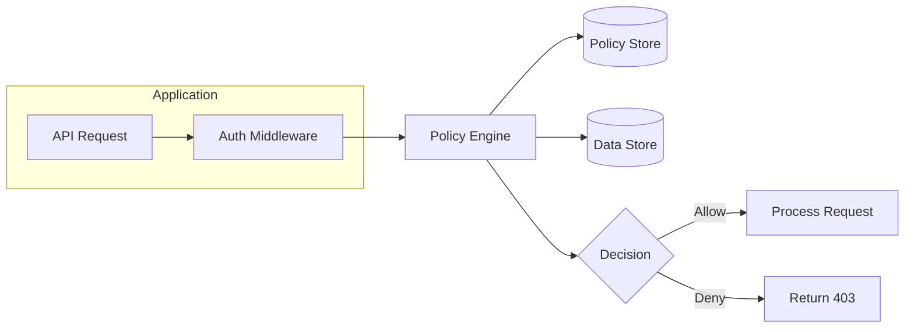

# How to Create Policy-Based Access Control

Author: [nawazdhandala](https://github.com/nawazdhandala)

Tags: Security, PBAC, OPA, Authorization

Description: Learn to create policy-based access control using Open Policy Agent and declarative policies.

---

Traditional role-based access control (RBAC) works well for simple permission models, but it struggles when authorization logic depends on resource attributes, time of day, user department, or relationships between entities. Policy-based access control (PBAC) addresses this by externalizing authorization decisions to a dedicated policy engine. Instead of scattering permission checks throughout your code, you write declarative policies that a policy engine evaluates at runtime.

This guide walks through implementing PBAC using Open Policy Agent (OPA), the most widely adopted policy engine in cloud-native environments.

---

## Why Policy-Based Access Control

RBAC assigns permissions to roles, and roles to users. This works until you need rules like "users can only access documents from their own department" or "read access is allowed during business hours only." Such rules require attribute evaluation that RBAC cannot express.

PBAC shifts authorization logic from application code into policies. The benefits include:

| Aspect | RBAC | PBAC |
|--------|------|------|
| Permission granularity | Role-level | Attribute-level |
| Policy changes | Code deployment | Policy reload |
| Auditability | Scattered logic | Centralized policies |
| Context awareness | Limited | Full (time, location, attributes) |
| Separation of concerns | Mixed with code | Decoupled |

The following diagram shows how a PBAC system fits into your application architecture.



---

## Understanding Open Policy Agent

OPA is a general-purpose policy engine that decouples policy decisions from your application. You write policies in Rego, a declarative query language designed for expressing authorization logic.

OPA runs as a sidecar or standalone service. Your application sends an authorization query with context (user, resource, action), and OPA returns a decision based on loaded policies and data.

The core components of an OPA deployment are:

- **Policies**: Rego files defining authorization rules
- **Data**: JSON documents providing context (user attributes, resource metadata)
- **Input**: The authorization query from your application
- **Decision**: The output (allow/deny plus optional metadata)

---

## Writing Your First Policy

Rego policies follow a straightforward structure. Each policy defines rules that evaluate to true or false. Here is a basic policy that controls document access.

```rego
# policy.rego
# This policy controls access to documents based on user department

package documents.authz

# Default deny - if no rule allows, access is denied
default allow := false

# Allow users to read documents from their own department
allow {
    input.action == "read"
    input.resource.type == "document"
    input.user.department == input.resource.department
}

# Allow managers to read all documents in their division
allow {
    input.action == "read"
    input.resource.type == "document"
    input.user.role == "manager"
    input.user.division == input.resource.division
}

# Allow admins full access
allow {
    input.user.role == "admin"
}
```

The input to this policy would look like this:

```json
{
  "user": {
    "id": "user-123",
    "department": "engineering",
    "division": "product",
    "role": "developer"
  },
  "action": "read",
  "resource": {
    "type": "document",
    "id": "doc-456",
    "department": "engineering",
    "division": "product"
  }
}
```

---

## Deploying OPA as a Sidecar

The most common pattern runs OPA as a sidecar container alongside your application. This minimizes latency and keeps authorization local to each service instance.

The following Kubernetes deployment shows the sidecar pattern.

```yaml
# deployment.yaml
apiVersion: apps/v1
kind: Deployment
metadata:
  name: api-service
spec:
  replicas: 3
  selector:
    matchLabels:
      app: api-service
  template:
    metadata:
      labels:
        app: api-service
    spec:
      containers:
        # Your application container
        - name: api
          image: myapp/api:latest
          ports:
            - containerPort: 8080
          env:
            - name: OPA_URL
              value: "http://localhost:8181"

        # OPA sidecar container
        - name: opa
          image: openpolicyagent/opa:latest
          ports:
            - containerPort: 8181
          args:
            - "run"
            - "--server"
            - "--addr=0.0.0.0:8181"
            - "/policies"
          volumeMounts:
            - name: policies
              mountPath: /policies
              readOnly: true

      volumes:
        - name: policies
          configMap:
            name: opa-policies
```

Store your policies in a ConfigMap for easy updates.

```yaml
# configmap.yaml
apiVersion: v1
kind: ConfigMap
metadata:
  name: opa-policies
data:
  policy.rego: |
    package documents.authz

    default allow := false

    allow {
        input.action == "read"
        input.user.department == input.resource.department
    }
```

---

## Integrating OPA with Your Application

Your application queries OPA before processing requests. Here is a Node.js middleware that enforces OPA policies.

```javascript
// authMiddleware.js
// Middleware that queries OPA for authorization decisions

const axios = require('axios');

const OPA_URL = process.env.OPA_URL || 'http://localhost:8181';

async function authorize(req, res, next) {
    // Build the input for OPA
    const input = {
        user: {
            id: req.user.id,
            department: req.user.department,
            division: req.user.division,
            role: req.user.role
        },
        action: mapHttpMethodToAction(req.method),
        resource: {
            type: extractResourceType(req.path),
            id: req.params.id,
            department: req.resource?.department,
            division: req.resource?.division
        }
    };

    try {
        // Query OPA for a decision
        const response = await axios.post(
            `${OPA_URL}/v1/data/documents/authz/allow`,
            { input }
        );

        if (response.data.result === true) {
            // Policy allows the request
            next();
        } else {
            // Policy denies the request
            res.status(403).json({
                error: 'Access denied by policy'
            });
        }
    } catch (error) {
        // Fail closed - deny on error
        console.error('OPA query failed:', error.message);
        res.status(500).json({
            error: 'Authorization service unavailable'
        });
    }
}

function mapHttpMethodToAction(method) {
    const mapping = {
        GET: 'read',
        POST: 'create',
        PUT: 'update',
        PATCH: 'update',
        DELETE: 'delete'
    };
    return mapping[method] || 'unknown';
}

function extractResourceType(path) {
    // Extract resource type from path like /api/documents/123
    const parts = path.split('/').filter(Boolean);
    return parts[1] || 'unknown';
}

module.exports = { authorize };
```

Use the middleware in your Express routes.

```javascript
// routes.js
const express = require('express');
const { authorize } = require('./authMiddleware');

const router = express.Router();

// Apply authorization to all document routes
router.use('/documents', authorize);

router.get('/documents/:id', async (req, res) => {
    // Authorization already passed - fetch the document
    const doc = await Document.findById(req.params.id);
    res.json(doc);
});
```

---

## Advanced Policy Patterns

Real applications need more sophisticated policies. Here are patterns for common requirements.

### Time-Based Access

Restrict access to business hours only.

```rego
# time_policy.rego
package api.authz

import future.keywords.if

default allow := false

# Allow access during business hours (9 AM to 6 PM UTC)
allow if {
    input.action == "read"
    current_hour := time.clock(time.now_ns())[0]
    current_hour >= 9
    current_hour < 18
}
```

### Resource Ownership

Users can modify only resources they created.

```rego
# ownership_policy.rego
package resources.authz

default allow := false

# Users can read any resource in their department
allow {
    input.action == "read"
    input.user.department == input.resource.department
}

# Users can modify only their own resources
allow {
    input.action == "update"
    input.user.id == input.resource.owner_id
}

# Users can delete only their own resources
allow {
    input.action == "delete"
    input.user.id == input.resource.owner_id
}
```

### Hierarchical Permissions

Managers inherit permissions from their reports.

```rego
# hierarchy_policy.rego
package org.authz

# External data: org hierarchy loaded into OPA
# data.org.reports_to = {"user-456": "user-123", ...}

default allow := false

# Direct access
allow {
    input.user.id == input.resource.owner_id
}

# Manager access - can access resources of direct reports
allow {
    data.org.reports_to[input.resource.owner_id] == input.user.id
}
```

---

## Testing Policies

Test policies before deployment using OPA's built-in test framework. Write tests alongside your policies.

```rego
# policy_test.rego
package documents.authz

# Test: users can read documents from their department
test_same_department_read {
    allow with input as {
        "user": {"department": "engineering", "role": "developer"},
        "action": "read",
        "resource": {"type": "document", "department": "engineering"}
    }
}

# Test: users cannot read documents from other departments
test_different_department_denied {
    not allow with input as {
        "user": {"department": "engineering", "role": "developer"},
        "action": "read",
        "resource": {"type": "document", "department": "marketing"}
    }
}

# Test: admins can access everything
test_admin_full_access {
    allow with input as {
        "user": {"role": "admin"},
        "action": "delete",
        "resource": {"type": "document", "department": "finance"}
    }
}
```

Run tests with the OPA CLI.

```bash
# Run all policy tests
opa test ./policies -v

# Output:
# PASS: 3/3
# data.documents.authz.test_same_department_read: PASS
# data.documents.authz.test_different_department_denied: PASS
# data.documents.authz.test_admin_full_access: PASS
```

---

## Monitoring and Debugging

OPA provides decision logs for auditing and debugging. Enable logging in your OPA configuration.

```yaml
# opa-config.yaml
decision_logs:
  console: true
  reporting:
    min_delay_seconds: 10
    max_delay_seconds: 60

bundles:
  policies:
    service: policy-service
    resource: /policies/bundle.tar.gz
    polling:
      min_delay_seconds: 30
      max_delay_seconds: 60
```

Decision logs capture every authorization decision with full context.

```json
{
  "decision_id": "abc-123",
  "timestamp": "2026-01-30T10:15:30Z",
  "input": {
    "user": {"id": "user-123", "department": "engineering"},
    "action": "read",
    "resource": {"type": "document", "id": "doc-456"}
  },
  "result": true,
  "metrics": {
    "timer_rego_query_eval_ns": 125000
  }
}
```

---

## Rollout Checklist

1. **Start with shadow mode**: Log decisions without enforcing them to understand policy impact
2. **Write comprehensive tests**: Cover edge cases before production deployment
3. **Monitor decision latency**: OPA should add less than 1ms to request latency
4. **Set up alerting**: Alert on policy errors and high denial rates
5. **Version your policies**: Treat policies as code with proper version control
6. **Plan for failure**: Decide whether to fail open or closed when OPA is unavailable

Policy-based access control separates authorization logic from application code, making it easier to audit, test, and modify permissions without deploying new code. OPA provides a battle-tested policy engine that scales from single applications to platform-wide enforcement.
