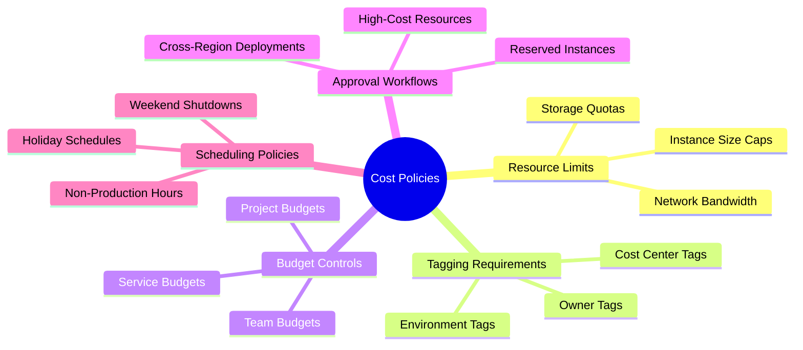
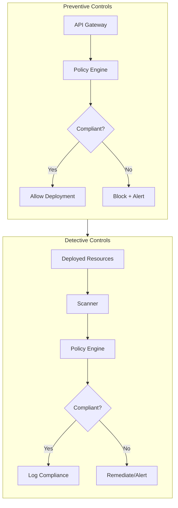
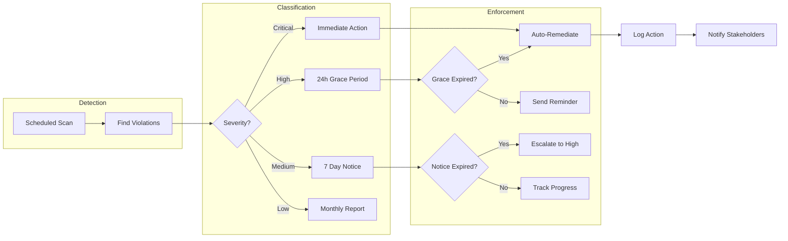
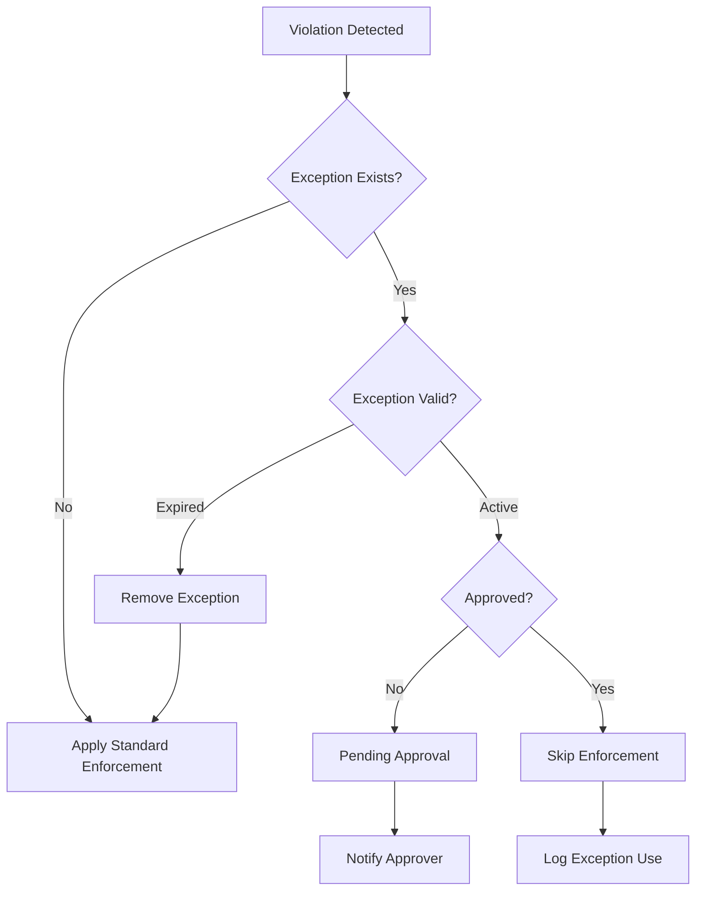
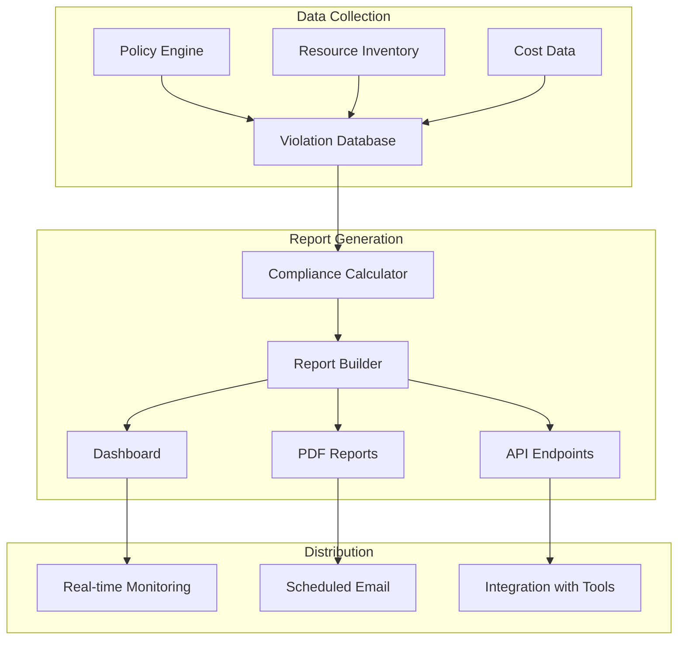
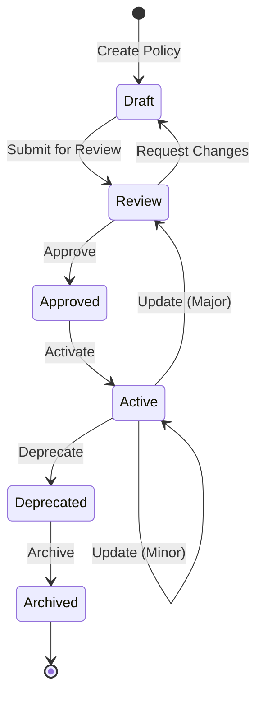
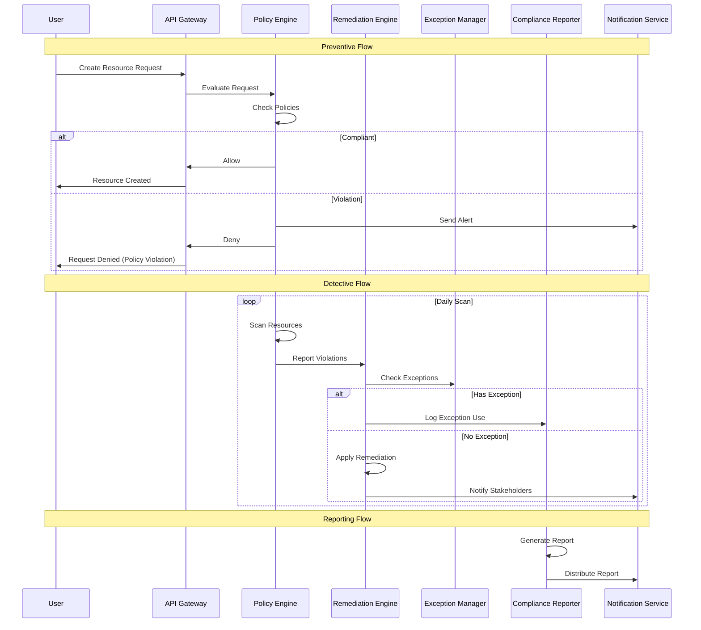

# How to Build Policy Enforcement

Author: [nawazdhandala](https://github.com/nawazdhandala)

Tags: FinOps, Governance, Cloud, Policy

Description: Learn how to enforce cost policies automatically in cloud environments.

---

Cloud costs spiral out of control when teams deploy without guardrails. Policy enforcement is your automated safety net that prevents overspending before it happens and detects violations after the fact. This guide shows you how to build a comprehensive policy enforcement system for cost governance.

## Understanding Policy Types and Categories

Cost governance policies fall into several categories, each serving a distinct purpose in your financial control framework.



### Resource Limit Policies

These policies cap what resources teams can provision:

```yaml
# resource-limits-policy.yaml
apiVersion: policy.oneuptime.com/v1
kind: CostPolicy
metadata:
  name: resource-limits
  namespace: production
spec:
  type: ResourceLimit
  rules:
    - name: max-instance-size
      resource: compute/instance
      constraint:
        maxVCPUs: 16
        maxMemoryGB: 64
        allowedInstanceFamilies:
          - general-purpose
          - compute-optimized
        deniedInstanceFamilies:
          - gpu
          - high-memory

    - name: max-storage-size
      resource: storage/volume
      constraint:
        maxSizeGB: 1000
        allowedTypes:
          - standard
          - ssd
        deniedTypes:
          - provisioned-iops

    - name: max-database-size
      resource: database/instance
      constraint:
        maxVCPUs: 8
        maxStorageGB: 500
```

### Tagging Policies

Ensure all resources have proper cost attribution:

```yaml
# tagging-policy.yaml
apiVersion: policy.oneuptime.com/v1
kind: CostPolicy
metadata:
  name: mandatory-tags
spec:
  type: TagRequirement
  rules:
    - name: cost-center-required
      requiredTags:
        - key: cost-center
          pattern: "^CC-[0-9]{6}$"
          description: "Cost center in format CC-XXXXXX"

        - key: environment
          allowedValues:
            - production
            - staging
            - development
            - sandbox

        - key: owner
          pattern: "^[a-z]+@company\\.com$"
          description: "Owner email address"

        - key: project
          minLength: 3
          maxLength: 50

      scope:
        - compute/*
        - storage/*
        - database/*
        - network/*

      enforcement: deny  # Block creation without tags
```

### Budget Policies

Set spending limits at various levels:

```yaml
# budget-policy.yaml
apiVersion: policy.oneuptime.com/v1
kind: CostPolicy
metadata:
  name: team-budgets
spec:
  type: BudgetLimit
  rules:
    - name: engineering-team-budget
      selector:
        tags:
          cost-center: CC-001234
      budget:
        monthly: 50000
        alertThresholds:
          - percent: 50
            action: notify
          - percent: 80
            action: notify
          - percent: 100
            action: block-new-resources

    - name: project-alpha-budget
      selector:
        tags:
          project: alpha
      budget:
        monthly: 10000
        quarterly: 28000
        alertThresholds:
          - percent: 90
            action: notify
            channels:
              - slack:#project-alpha
              - email:alpha-leads@company.com
```

## Preventive vs Detective Controls

A robust policy enforcement system needs both preventive controls (block violations before they happen) and detective controls (identify violations after deployment).



### Building Preventive Controls

Preventive controls intercept resource creation requests before they execute:

```python
# preventive_policy_engine.py
from dataclasses import dataclass
from typing import List, Dict, Any, Optional
from enum import Enum
import re

class PolicyAction(Enum):
    ALLOW = "allow"
    DENY = "deny"
    WARN = "warn"

@dataclass
class PolicyViolation:
    policy_name: str
    rule_name: str
    message: str
    severity: str
    resource_type: str
    resource_id: Optional[str] = None

@dataclass
class PolicyResult:
    action: PolicyAction
    violations: List[PolicyViolation]
    warnings: List[str]

class PreventivePolicyEngine:
    def __init__(self, policies: List[Dict[str, Any]]):
        self.policies = policies
        self.tag_patterns = {}
        self._compile_patterns()

    def _compile_patterns(self):
        """Pre-compile regex patterns for performance."""
        for policy in self.policies:
            if policy.get('type') == 'TagRequirement':
                for rule in policy.get('rules', []):
                    for tag in rule.get('requiredTags', []):
                        if 'pattern' in tag:
                            key = f"{policy['metadata']['name']}:{tag['key']}"
                            self.tag_patterns[key] = re.compile(tag['pattern'])

    def evaluate(self, resource_request: Dict[str, Any]) -> PolicyResult:
        """Evaluate a resource creation request against all policies."""
        violations = []
        warnings = []

        resource_type = resource_request.get('type')
        requested_tags = resource_request.get('tags', {})
        requested_specs = resource_request.get('specs', {})

        for policy in self.policies:
            policy_violations = self._evaluate_policy(
                policy, resource_type, requested_tags, requested_specs
            )
            violations.extend(policy_violations)

        # Determine action based on violations
        if any(v.severity == 'critical' for v in violations):
            action = PolicyAction.DENY
        elif violations:
            action = PolicyAction.WARN
        else:
            action = PolicyAction.ALLOW

        return PolicyResult(action=action, violations=violations, warnings=warnings)

    def _evaluate_policy(
        self,
        policy: Dict[str, Any],
        resource_type: str,
        tags: Dict[str, str],
        specs: Dict[str, Any]
    ) -> List[PolicyViolation]:
        """Evaluate a single policy against the resource request."""
        violations = []
        policy_type = policy.get('type')

        if policy_type == 'ResourceLimit':
            violations.extend(
                self._check_resource_limits(policy, resource_type, specs)
            )
        elif policy_type == 'TagRequirement':
            violations.extend(
                self._check_tag_requirements(policy, resource_type, tags)
            )
        elif policy_type == 'BudgetLimit':
            violations.extend(
                self._check_budget_limits(policy, tags, specs)
            )

        return violations

    def _check_resource_limits(
        self,
        policy: Dict[str, Any],
        resource_type: str,
        specs: Dict[str, Any]
    ) -> List[PolicyViolation]:
        """Check if resource specs exceed defined limits."""
        violations = []

        for rule in policy.get('rules', []):
            if not self._matches_resource_type(rule.get('resource'), resource_type):
                continue

            constraint = rule.get('constraint', {})

            # Check vCPU limit
            if 'maxVCPUs' in constraint:
                requested_vcpus = specs.get('vcpus', 0)
                if requested_vcpus > constraint['maxVCPUs']:
                    violations.append(PolicyViolation(
                        policy_name=policy['metadata']['name'],
                        rule_name=rule['name'],
                        message=f"Requested {requested_vcpus} vCPUs exceeds limit of {constraint['maxVCPUs']}",
                        severity='critical',
                        resource_type=resource_type
                    ))

            # Check memory limit
            if 'maxMemoryGB' in constraint:
                requested_memory = specs.get('memory_gb', 0)
                if requested_memory > constraint['maxMemoryGB']:
                    violations.append(PolicyViolation(
                        policy_name=policy['metadata']['name'],
                        rule_name=rule['name'],
                        message=f"Requested {requested_memory}GB memory exceeds limit of {constraint['maxMemoryGB']}GB",
                        severity='critical',
                        resource_type=resource_type
                    ))

            # Check instance family
            if 'deniedInstanceFamilies' in constraint:
                instance_family = specs.get('instance_family')
                if instance_family in constraint['deniedInstanceFamilies']:
                    violations.append(PolicyViolation(
                        policy_name=policy['metadata']['name'],
                        rule_name=rule['name'],
                        message=f"Instance family '{instance_family}' is not allowed",
                        severity='critical',
                        resource_type=resource_type
                    ))

        return violations

    def _check_tag_requirements(
        self,
        policy: Dict[str, Any],
        resource_type: str,
        tags: Dict[str, str]
    ) -> List[PolicyViolation]:
        """Check if required tags are present and valid."""
        violations = []

        for rule in policy.get('rules', []):
            # Check if this rule applies to the resource type
            if not self._matches_scope(rule.get('scope', ['*']), resource_type):
                continue

            for required_tag in rule.get('requiredTags', []):
                tag_key = required_tag['key']
                tag_value = tags.get(tag_key)

                # Check if tag exists
                if tag_value is None:
                    violations.append(PolicyViolation(
                        policy_name=policy['metadata']['name'],
                        rule_name=rule['name'],
                        message=f"Required tag '{tag_key}' is missing",
                        severity='critical',
                        resource_type=resource_type
                    ))
                    continue

                # Check pattern match
                if 'pattern' in required_tag:
                    pattern_key = f"{policy['metadata']['name']}:{tag_key}"
                    pattern = self.tag_patterns.get(pattern_key)
                    if pattern and not pattern.match(tag_value):
                        violations.append(PolicyViolation(
                            policy_name=policy['metadata']['name'],
                            rule_name=rule['name'],
                            message=f"Tag '{tag_key}' value '{tag_value}' does not match required pattern",
                            severity='critical',
                            resource_type=resource_type
                        ))

                # Check allowed values
                if 'allowedValues' in required_tag:
                    if tag_value not in required_tag['allowedValues']:
                        violations.append(PolicyViolation(
                            policy_name=policy['metadata']['name'],
                            rule_name=rule['name'],
                            message=f"Tag '{tag_key}' value '{tag_value}' is not in allowed values: {required_tag['allowedValues']}",
                            severity='critical',
                            resource_type=resource_type
                        ))

        return violations

    def _check_budget_limits(
        self,
        policy: Dict[str, Any],
        tags: Dict[str, str],
        specs: Dict[str, Any]
    ) -> List[PolicyViolation]:
        """Check if resource would exceed budget limits."""
        violations = []
        # Budget checking would integrate with cost estimation service
        # This is a simplified example
        return violations

    def _matches_resource_type(self, pattern: str, resource_type: str) -> bool:
        """Check if resource type matches the pattern."""
        if pattern == '*':
            return True
        if pattern.endswith('/*'):
            prefix = pattern[:-2]
            return resource_type.startswith(prefix)
        return pattern == resource_type

    def _matches_scope(self, scopes: List[str], resource_type: str) -> bool:
        """Check if resource type is in scope."""
        for scope in scopes:
            if self._matches_resource_type(scope, resource_type):
                return True
        return False


# Example usage
if __name__ == "__main__":
    policies = [
        {
            "metadata": {"name": "resource-limits"},
            "type": "ResourceLimit",
            "rules": [{
                "name": "max-instance-size",
                "resource": "compute/instance",
                "constraint": {
                    "maxVCPUs": 16,
                    "maxMemoryGB": 64,
                    "deniedInstanceFamilies": ["gpu", "high-memory"]
                }
            }]
        },
        {
            "metadata": {"name": "mandatory-tags"},
            "type": "TagRequirement",
            "rules": [{
                "name": "cost-center-required",
                "requiredTags": [
                    {"key": "cost-center", "pattern": "^CC-[0-9]{6}$"},
                    {"key": "environment", "allowedValues": ["production", "staging", "development"]}
                ],
                "scope": ["compute/*", "storage/*"]
            }]
        }
    ]

    engine = PreventivePolicyEngine(policies)

    # Test compliant request
    compliant_request = {
        "type": "compute/instance",
        "tags": {
            "cost-center": "CC-001234",
            "environment": "production"
        },
        "specs": {
            "vcpus": 8,
            "memory_gb": 32,
            "instance_family": "general-purpose"
        }
    }

    result = engine.evaluate(compliant_request)
    print(f"Compliant request: {result.action.value}")

    # Test non-compliant request
    non_compliant_request = {
        "type": "compute/instance",
        "tags": {
            "cost-center": "INVALID",
            "environment": "test"
        },
        "specs": {
            "vcpus": 32,
            "memory_gb": 128,
            "instance_family": "gpu"
        }
    }

    result = engine.evaluate(non_compliant_request)
    print(f"Non-compliant request: {result.action.value}")
    for violation in result.violations:
        print(f"  - {violation.message}")
```

### Building Detective Controls

Detective controls scan existing resources to find violations:

```python
# detective_policy_scanner.py
from dataclasses import dataclass
from typing import List, Dict, Any, Optional
from datetime import datetime, timedelta
import asyncio
from enum import Enum

class RemediationAction(Enum):
    NOTIFY = "notify"
    TAG = "tag"
    STOP = "stop"
    TERMINATE = "terminate"
    RESIZE = "resize"

@dataclass
class DetectedViolation:
    resource_id: str
    resource_type: str
    resource_name: str
    policy_name: str
    rule_name: str
    message: str
    severity: str
    detected_at: datetime
    recommended_action: RemediationAction
    estimated_savings: Optional[float] = None

class DetectivePolicyScanner:
    def __init__(self, cloud_client, policies: List[Dict[str, Any]]):
        self.cloud_client = cloud_client
        self.policies = policies

    async def scan_all_resources(self) -> List[DetectedViolation]:
        """Scan all resources for policy violations."""
        violations = []

        # Scan different resource types in parallel
        scan_tasks = [
            self._scan_compute_instances(),
            self._scan_storage_volumes(),
            self._scan_databases(),
            self._scan_untagged_resources(),
            self._scan_idle_resources(),
        ]

        results = await asyncio.gather(*scan_tasks)
        for result in results:
            violations.extend(result)

        return violations

    async def _scan_compute_instances(self) -> List[DetectedViolation]:
        """Scan compute instances for violations."""
        violations = []
        instances = await self.cloud_client.list_instances()

        for instance in instances:
            # Check for oversized instances
            for policy in self._get_policies_by_type('ResourceLimit'):
                for rule in policy.get('rules', []):
                    if rule.get('resource') != 'compute/instance':
                        continue

                    constraint = rule.get('constraint', {})

                    if instance['vcpus'] > constraint.get('maxVCPUs', float('inf')):
                        violations.append(DetectedViolation(
                            resource_id=instance['id'],
                            resource_type='compute/instance',
                            resource_name=instance['name'],
                            policy_name=policy['metadata']['name'],
                            rule_name=rule['name'],
                            message=f"Instance has {instance['vcpus']} vCPUs, exceeds limit of {constraint['maxVCPUs']}",
                            severity='high',
                            detected_at=datetime.utcnow(),
                            recommended_action=RemediationAction.RESIZE,
                            estimated_savings=self._calculate_resize_savings(instance, constraint['maxVCPUs'])
                        ))

        return violations

    async def _scan_untagged_resources(self) -> List[DetectedViolation]:
        """Find resources missing required tags."""
        violations = []
        resources = await self.cloud_client.list_all_resources()

        for policy in self._get_policies_by_type('TagRequirement'):
            for rule in policy.get('rules', []):
                required_tags = rule.get('requiredTags', [])

                for resource in resources:
                    if not self._matches_scope(rule.get('scope', ['*']), resource['type']):
                        continue

                    missing_tags = []
                    for tag_def in required_tags:
                        tag_key = tag_def['key']
                        if tag_key not in resource.get('tags', {}):
                            missing_tags.append(tag_key)

                    if missing_tags:
                        violations.append(DetectedViolation(
                            resource_id=resource['id'],
                            resource_type=resource['type'],
                            resource_name=resource['name'],
                            policy_name=policy['metadata']['name'],
                            rule_name=rule['name'],
                            message=f"Missing required tags: {', '.join(missing_tags)}",
                            severity='medium',
                            detected_at=datetime.utcnow(),
                            recommended_action=RemediationAction.TAG
                        ))

        return violations

    async def _scan_idle_resources(self) -> List[DetectedViolation]:
        """Find resources that appear to be idle."""
        violations = []
        instances = await self.cloud_client.list_instances()

        for instance in instances:
            metrics = await self.cloud_client.get_instance_metrics(
                instance['id'],
                period=timedelta(days=7)
            )

            avg_cpu = metrics.get('avg_cpu_percent', 0)
            avg_network = metrics.get('avg_network_bytes', 0)

            # Instance is idle if CPU < 5% and network < 1MB/day average
            if avg_cpu < 5 and avg_network < 1_000_000:
                hourly_cost = instance.get('hourly_cost', 0)
                monthly_savings = hourly_cost * 24 * 30

                violations.append(DetectedViolation(
                    resource_id=instance['id'],
                    resource_type='compute/instance',
                    resource_name=instance['name'],
                    policy_name='idle-resource-detection',
                    rule_name='low-utilization',
                    message=f"Instance appears idle (CPU: {avg_cpu:.1f}%, Network: {avg_network/1000:.0f}KB/day avg over 7 days)",
                    severity='medium',
                    detected_at=datetime.utcnow(),
                    recommended_action=RemediationAction.STOP,
                    estimated_savings=monthly_savings
                ))

        return violations

    async def _scan_storage_volumes(self) -> List[DetectedViolation]:
        """Scan storage volumes for violations."""
        violations = []
        volumes = await self.cloud_client.list_volumes()

        for volume in volumes:
            # Check for unattached volumes
            if not volume.get('attached_to'):
                days_unattached = (datetime.utcnow() - volume.get('detached_at', datetime.utcnow())).days
                if days_unattached > 7:
                    monthly_cost = volume.get('monthly_cost', 0)
                    violations.append(DetectedViolation(
                        resource_id=volume['id'],
                        resource_type='storage/volume',
                        resource_name=volume['name'],
                        policy_name='orphaned-resource-detection',
                        rule_name='unattached-volume',
                        message=f"Volume has been unattached for {days_unattached} days",
                        severity='medium',
                        detected_at=datetime.utcnow(),
                        recommended_action=RemediationAction.TERMINATE,
                        estimated_savings=monthly_cost
                    ))

        return violations

    async def _scan_databases(self) -> List[DetectedViolation]:
        """Scan databases for violations."""
        violations = []
        # Similar implementation for databases
        return violations

    def _get_policies_by_type(self, policy_type: str) -> List[Dict[str, Any]]:
        """Filter policies by type."""
        return [p for p in self.policies if p.get('type') == policy_type]

    def _matches_scope(self, scopes: List[str], resource_type: str) -> bool:
        """Check if resource type is in scope."""
        for scope in scopes:
            if scope == '*':
                return True
            if scope.endswith('/*'):
                prefix = scope[:-2]
                if resource_type.startswith(prefix):
                    return True
            elif scope == resource_type:
                return True
        return False

    def _calculate_resize_savings(self, instance: Dict[str, Any], target_vcpus: int) -> float:
        """Calculate potential savings from resizing an instance."""
        current_cost = instance.get('hourly_cost', 0)
        # Simplified: assume cost scales linearly with vCPUs
        target_cost = current_cost * (target_vcpus / instance['vcpus'])
        monthly_savings = (current_cost - target_cost) * 24 * 30
        return monthly_savings
```

## Automated Enforcement

Automated enforcement takes action without human intervention based on policy rules.



### Automated Remediation Engine

```python
# auto_remediation_engine.py
from dataclasses import dataclass
from typing import List, Dict, Any, Optional, Callable
from datetime import datetime, timedelta
from enum import Enum
import asyncio
import logging

logger = logging.getLogger(__name__)

class RemediationStatus(Enum):
    PENDING = "pending"
    IN_PROGRESS = "in_progress"
    COMPLETED = "completed"
    FAILED = "failed"
    SKIPPED = "skipped"

@dataclass
class RemediationTask:
    violation_id: str
    resource_id: str
    resource_type: str
    action: str
    parameters: Dict[str, Any]
    scheduled_at: datetime
    grace_period_ends: Optional[datetime]
    status: RemediationStatus
    result_message: Optional[str] = None
    completed_at: Optional[datetime] = None

class AutoRemediationEngine:
    def __init__(self, cloud_client, notification_service, config: Dict[str, Any]):
        self.cloud_client = cloud_client
        self.notification_service = notification_service
        self.config = config
        self.remediation_handlers: Dict[str, Callable] = {}
        self._register_handlers()

    def _register_handlers(self):
        """Register remediation action handlers."""
        self.remediation_handlers = {
            'stop_instance': self._stop_instance,
            'terminate_instance': self._terminate_instance,
            'resize_instance': self._resize_instance,
            'delete_volume': self._delete_volume,
            'add_tags': self._add_tags,
            'send_notification': self._send_notification,
        }

    async def process_violations(self, violations: List[Dict[str, Any]]) -> List[RemediationTask]:
        """Process violations and create remediation tasks."""
        tasks = []

        for violation in violations:
            task = await self._create_remediation_task(violation)
            if task:
                tasks.append(task)

        return tasks

    async def _create_remediation_task(self, violation: Dict[str, Any]) -> Optional[RemediationTask]:
        """Create a remediation task based on violation severity and type."""
        severity = violation.get('severity', 'low')
        action = violation.get('recommended_action')
        resource_id = violation['resource_id']

        # Determine grace period based on severity
        grace_periods = {
            'critical': timedelta(hours=0),
            'high': timedelta(hours=24),
            'medium': timedelta(days=7),
            'low': timedelta(days=30),
        }

        grace_period = grace_periods.get(severity, timedelta(days=30))
        grace_period_ends = datetime.utcnow() + grace_period

        # Check if resource has an exception
        if await self._has_exception(resource_id):
            logger.info(f"Resource {resource_id} has active exception, skipping")
            return None

        # Map violation to remediation action
        action_mapping = {
            'STOP': 'stop_instance',
            'TERMINATE': 'terminate_instance',
            'RESIZE': 'resize_instance',
            'TAG': 'add_tags',
            'NOTIFY': 'send_notification',
        }

        remediation_action = action_mapping.get(action, 'send_notification')

        task = RemediationTask(
            violation_id=violation.get('id', f"{resource_id}-{datetime.utcnow().isoformat()}"),
            resource_id=resource_id,
            resource_type=violation['resource_type'],
            action=remediation_action,
            parameters=self._get_action_parameters(violation),
            scheduled_at=datetime.utcnow(),
            grace_period_ends=grace_period_ends if grace_period.total_seconds() > 0 else None,
            status=RemediationStatus.PENDING
        )

        return task

    async def execute_tasks(self, tasks: List[RemediationTask]) -> List[RemediationTask]:
        """Execute remediation tasks that are ready."""
        now = datetime.utcnow()
        results = []

        for task in tasks:
            # Skip if still in grace period
            if task.grace_period_ends and task.grace_period_ends > now:
                # Send warning notification instead
                await self._send_grace_period_warning(task)
                results.append(task)
                continue

            # Execute the remediation
            try:
                task.status = RemediationStatus.IN_PROGRESS
                handler = self.remediation_handlers.get(task.action)

                if handler:
                    success, message = await handler(task)
                    task.status = RemediationStatus.COMPLETED if success else RemediationStatus.FAILED
                    task.result_message = message
                else:
                    task.status = RemediationStatus.SKIPPED
                    task.result_message = f"No handler for action: {task.action}"

                task.completed_at = datetime.utcnow()

            except Exception as e:
                logger.error(f"Remediation failed for {task.resource_id}: {str(e)}")
                task.status = RemediationStatus.FAILED
                task.result_message = str(e)
                task.completed_at = datetime.utcnow()

            results.append(task)

            # Send notification about completed remediation
            await self._notify_remediation_complete(task)

        return results

    async def _stop_instance(self, task: RemediationTask) -> tuple[bool, str]:
        """Stop a compute instance."""
        try:
            # Create snapshot before stopping (safety measure)
            if self.config.get('create_snapshot_before_stop', True):
                await self.cloud_client.create_snapshot(
                    task.resource_id,
                    name=f"pre-remediation-{task.violation_id}"
                )

            await self.cloud_client.stop_instance(task.resource_id)
            return True, f"Instance {task.resource_id} stopped successfully"
        except Exception as e:
            return False, str(e)

    async def _terminate_instance(self, task: RemediationTask) -> tuple[bool, str]:
        """Terminate a compute instance."""
        # Require additional confirmation for termination
        if not self.config.get('allow_auto_terminate', False):
            return False, "Auto-termination disabled, manual action required"

        try:
            await self.cloud_client.terminate_instance(task.resource_id)
            return True, f"Instance {task.resource_id} terminated"
        except Exception as e:
            return False, str(e)

    async def _resize_instance(self, task: RemediationTask) -> tuple[bool, str]:
        """Resize an instance to a smaller size."""
        target_size = task.parameters.get('target_size')
        if not target_size:
            return False, "No target size specified"

        try:
            # Stop instance first
            await self.cloud_client.stop_instance(task.resource_id)

            # Resize
            await self.cloud_client.resize_instance(task.resource_id, target_size)

            # Start instance
            await self.cloud_client.start_instance(task.resource_id)

            return True, f"Instance resized to {target_size}"
        except Exception as e:
            return False, str(e)

    async def _delete_volume(self, task: RemediationTask) -> tuple[bool, str]:
        """Delete an orphaned storage volume."""
        if not self.config.get('allow_auto_delete_volumes', False):
            return False, "Auto-deletion of volumes disabled"

        try:
            # Create snapshot first
            await self.cloud_client.create_volume_snapshot(
                task.resource_id,
                name=f"pre-deletion-{task.violation_id}"
            )

            await self.cloud_client.delete_volume(task.resource_id)
            return True, f"Volume {task.resource_id} deleted (snapshot created)"
        except Exception as e:
            return False, str(e)

    async def _add_tags(self, task: RemediationTask) -> tuple[bool, str]:
        """Add missing tags to a resource."""
        tags_to_add = task.parameters.get('tags', {})

        # Add default tags for untagged resources
        default_tags = {
            'managed-by': 'cost-governance',
            'compliance-status': 'needs-review',
            'auto-tagged-at': datetime.utcnow().isoformat(),
        }

        tags_to_add.update(default_tags)

        try:
            await self.cloud_client.add_tags(task.resource_id, tags_to_add)
            return True, f"Added tags: {list(tags_to_add.keys())}"
        except Exception as e:
            return False, str(e)

    async def _send_notification(self, task: RemediationTask) -> tuple[bool, str]:
        """Send notification about the violation."""
        try:
            await self.notification_service.send(
                channel='slack',
                message=f"Policy violation detected: {task.parameters.get('message', 'Unknown violation')}",
                resource_id=task.resource_id,
                severity=task.parameters.get('severity', 'medium')
            )
            return True, "Notification sent"
        except Exception as e:
            return False, str(e)

    async def _has_exception(self, resource_id: str) -> bool:
        """Check if resource has an active policy exception."""
        # Would query exception database
        return False

    def _get_action_parameters(self, violation: Dict[str, Any]) -> Dict[str, Any]:
        """Extract parameters needed for remediation action."""
        return {
            'message': violation.get('message'),
            'severity': violation.get('severity'),
            'target_size': violation.get('recommended_size'),
            'tags': violation.get('missing_tags', {}),
        }

    async def _send_grace_period_warning(self, task: RemediationTask):
        """Send warning about upcoming remediation."""
        time_remaining = task.grace_period_ends - datetime.utcnow()
        hours_remaining = time_remaining.total_seconds() / 3600

        await self.notification_service.send(
            channel='slack',
            message=f"Warning: Resource {task.resource_id} will be {task.action} in {hours_remaining:.0f} hours due to policy violation",
            resource_id=task.resource_id,
            severity='warning'
        )

    async def _notify_remediation_complete(self, task: RemediationTask):
        """Notify stakeholders about completed remediation."""
        status_emoji = {
            RemediationStatus.COMPLETED: 'check',
            RemediationStatus.FAILED: 'x',
            RemediationStatus.SKIPPED: 'skip',
        }

        await self.notification_service.send(
            channel='slack',
            message=f"Remediation {task.status.value}: {task.action} on {task.resource_id}. {task.result_message}",
            resource_id=task.resource_id,
            severity='info'
        )
```

## Exception Handling

Not every policy violation should be automatically remediated. Build an exception system for legitimate cases.



### Exception Management System

```python
# exception_manager.py
from dataclasses import dataclass, field
from typing import List, Dict, Any, Optional
from datetime import datetime, timedelta
from enum import Enum
import uuid

class ExceptionStatus(Enum):
    PENDING = "pending"
    APPROVED = "approved"
    REJECTED = "rejected"
    EXPIRED = "expired"
    REVOKED = "revoked"

class ExceptionType(Enum):
    TEMPORARY = "temporary"  # Time-limited exception
    PERMANENT = "permanent"  # Requires periodic review
    CONDITIONAL = "conditional"  # Exception with conditions

@dataclass
class PolicyException:
    id: str
    resource_id: str
    resource_type: str
    policy_name: str
    rule_name: str
    exception_type: ExceptionType
    justification: str
    requested_by: str
    requested_at: datetime
    status: ExceptionStatus
    approved_by: Optional[str] = None
    approved_at: Optional[datetime] = None
    expires_at: Optional[datetime] = None
    conditions: Dict[str, Any] = field(default_factory=dict)
    review_interval_days: int = 90
    last_reviewed_at: Optional[datetime] = None
    tags: Dict[str, str] = field(default_factory=dict)

class ExceptionManager:
    def __init__(self, storage, notification_service, approval_service):
        self.storage = storage
        self.notification_service = notification_service
        self.approval_service = approval_service

    async def request_exception(
        self,
        resource_id: str,
        resource_type: str,
        policy_name: str,
        rule_name: str,
        justification: str,
        requested_by: str,
        exception_type: ExceptionType = ExceptionType.TEMPORARY,
        duration_days: Optional[int] = None,
        conditions: Optional[Dict[str, Any]] = None
    ) -> PolicyException:
        """Request a new policy exception."""

        exception = PolicyException(
            id=str(uuid.uuid4()),
            resource_id=resource_id,
            resource_type=resource_type,
            policy_name=policy_name,
            rule_name=rule_name,
            exception_type=exception_type,
            justification=justification,
            requested_by=requested_by,
            requested_at=datetime.utcnow(),
            status=ExceptionStatus.PENDING,
            expires_at=datetime.utcnow() + timedelta(days=duration_days) if duration_days else None,
            conditions=conditions or {}
        )

        # Store the exception request
        await self.storage.save_exception(exception)

        # Determine approvers based on policy and cost impact
        approvers = await self._get_approvers(exception)

        # Create approval request
        await self.approval_service.create_approval_request(
            exception_id=exception.id,
            approvers=approvers,
            details={
                'resource_id': resource_id,
                'policy': policy_name,
                'rule': rule_name,
                'justification': justification,
                'duration': f"{duration_days} days" if duration_days else "Permanent",
            }
        )

        # Notify approvers
        await self.notification_service.send(
            channel='slack',
            message=f"Policy exception requested for {resource_id} by {requested_by}. Justification: {justification}",
            mention=approvers
        )

        return exception

    async def approve_exception(
        self,
        exception_id: str,
        approved_by: str,
        comments: Optional[str] = None
    ) -> PolicyException:
        """Approve a pending exception."""
        exception = await self.storage.get_exception(exception_id)

        if exception.status != ExceptionStatus.PENDING:
            raise ValueError(f"Exception is not pending: {exception.status}")

        # Verify approver has authority
        if not await self._can_approve(approved_by, exception):
            raise PermissionError(f"User {approved_by} cannot approve this exception")

        exception.status = ExceptionStatus.APPROVED
        exception.approved_by = approved_by
        exception.approved_at = datetime.utcnow()
        exception.last_reviewed_at = datetime.utcnow()

        await self.storage.save_exception(exception)

        # Notify requester
        await self.notification_service.send(
            channel='slack',
            message=f"Exception approved for {exception.resource_id} by {approved_by}",
            mention=[exception.requested_by]
        )

        # Schedule review reminder for permanent exceptions
        if exception.exception_type == ExceptionType.PERMANENT:
            await self._schedule_review_reminder(exception)

        return exception

    async def reject_exception(
        self,
        exception_id: str,
        rejected_by: str,
        reason: str
    ) -> PolicyException:
        """Reject a pending exception."""
        exception = await self.storage.get_exception(exception_id)

        exception.status = ExceptionStatus.REJECTED
        exception.tags['rejection_reason'] = reason
        exception.tags['rejected_by'] = rejected_by
        exception.tags['rejected_at'] = datetime.utcnow().isoformat()

        await self.storage.save_exception(exception)

        await self.notification_service.send(
            channel='slack',
            message=f"Exception rejected for {exception.resource_id}. Reason: {reason}",
            mention=[exception.requested_by]
        )

        return exception

    async def check_exception(
        self,
        resource_id: str,
        policy_name: str,
        rule_name: str
    ) -> Optional[PolicyException]:
        """Check if a valid exception exists for a resource."""
        exceptions = await self.storage.get_exceptions_for_resource(resource_id)

        for exception in exceptions:
            if exception.policy_name != policy_name:
                continue
            if exception.rule_name != rule_name:
                continue

            # Check status
            if exception.status != ExceptionStatus.APPROVED:
                continue

            # Check expiration
            if exception.expires_at and exception.expires_at < datetime.utcnow():
                exception.status = ExceptionStatus.EXPIRED
                await self.storage.save_exception(exception)
                continue

            # Check if review is overdue
            if exception.exception_type == ExceptionType.PERMANENT:
                review_due = exception.last_reviewed_at + timedelta(days=exception.review_interval_days)
                if review_due < datetime.utcnow():
                    await self._request_review(exception)

            return exception

        return None

    async def get_exceptions_report(
        self,
        filters: Optional[Dict[str, Any]] = None
    ) -> Dict[str, Any]:
        """Generate a report of all exceptions."""
        all_exceptions = await self.storage.get_all_exceptions()

        # Apply filters
        if filters:
            all_exceptions = self._apply_filters(all_exceptions, filters)

        # Calculate statistics
        by_status = {}
        by_policy = {}
        by_type = {}
        total_cost_excepted = 0

        for exc in all_exceptions:
            # Count by status
            status = exc.status.value
            by_status[status] = by_status.get(status, 0) + 1

            # Count by policy
            policy = exc.policy_name
            by_policy[policy] = by_policy.get(policy, 0) + 1

            # Count by type
            exc_type = exc.exception_type.value
            by_type[exc_type] = by_type.get(exc_type, 0) + 1

        # Find expiring soon
        expiring_soon = [
            exc for exc in all_exceptions
            if exc.expires_at and exc.status == ExceptionStatus.APPROVED
            and exc.expires_at < datetime.utcnow() + timedelta(days=7)
        ]

        # Find needing review
        needing_review = [
            exc for exc in all_exceptions
            if exc.exception_type == ExceptionType.PERMANENT
            and exc.status == ExceptionStatus.APPROVED
            and exc.last_reviewed_at
            and exc.last_reviewed_at + timedelta(days=exc.review_interval_days) < datetime.utcnow()
        ]

        return {
            'total_exceptions': len(all_exceptions),
            'by_status': by_status,
            'by_policy': by_policy,
            'by_type': by_type,
            'expiring_soon': [self._exception_to_dict(e) for e in expiring_soon],
            'needing_review': [self._exception_to_dict(e) for e in needing_review],
            'generated_at': datetime.utcnow().isoformat()
        }

    async def _get_approvers(self, exception: PolicyException) -> List[str]:
        """Determine who can approve this exception."""
        # Based on policy type and estimated cost impact
        approvers = []

        # Get resource owner's manager
        owner_manager = await self.approval_service.get_manager(exception.requested_by)
        if owner_manager:
            approvers.append(owner_manager)

        # Add FinOps team for budget-related exceptions
        if exception.policy_name in ['team-budgets', 'project-budgets']:
            approvers.extend(await self.approval_service.get_finops_team())

        # Add security team for security-related exceptions
        if exception.policy_name in ['mandatory-tags', 'resource-limits']:
            approvers.extend(await self.approval_service.get_security_team())

        return list(set(approvers))

    async def _can_approve(self, user: str, exception: PolicyException) -> bool:
        """Check if user has authority to approve the exception."""
        approvers = await self._get_approvers(exception)
        return user in approvers

    async def _schedule_review_reminder(self, exception: PolicyException):
        """Schedule a reminder to review permanent exception."""
        review_date = datetime.utcnow() + timedelta(days=exception.review_interval_days)
        await self.notification_service.schedule(
            channel='slack',
            message=f"Exception review due for {exception.resource_id}",
            send_at=review_date,
            mention=[exception.approved_by]
        )

    async def _request_review(self, exception: PolicyException):
        """Request review for an overdue exception."""
        await self.notification_service.send(
            channel='slack',
            message=f"Exception review overdue for {exception.resource_id}. Please review and renew or revoke.",
            mention=[exception.approved_by, exception.requested_by]
        )

    def _apply_filters(
        self,
        exceptions: List[PolicyException],
        filters: Dict[str, Any]
    ) -> List[PolicyException]:
        """Apply filters to exception list."""
        result = exceptions

        if 'status' in filters:
            result = [e for e in result if e.status.value == filters['status']]

        if 'policy_name' in filters:
            result = [e for e in result if e.policy_name == filters['policy_name']]

        if 'requested_by' in filters:
            result = [e for e in result if e.requested_by == filters['requested_by']]

        return result

    def _exception_to_dict(self, exception: PolicyException) -> Dict[str, Any]:
        """Convert exception to dictionary for reporting."""
        return {
            'id': exception.id,
            'resource_id': exception.resource_id,
            'policy_name': exception.policy_name,
            'rule_name': exception.rule_name,
            'status': exception.status.value,
            'expires_at': exception.expires_at.isoformat() if exception.expires_at else None,
            'requested_by': exception.requested_by,
            'approved_by': exception.approved_by,
        }
```

## Compliance Reporting

Track policy compliance across your organization with comprehensive reporting.



### Compliance Reporting System

```python
# compliance_reporter.py
from dataclasses import dataclass
from typing import List, Dict, Any, Optional
from datetime import datetime, timedelta
from enum import Enum
import json

class ComplianceLevel(Enum):
    COMPLIANT = "compliant"
    PARTIAL = "partial"
    NON_COMPLIANT = "non_compliant"

@dataclass
class ComplianceScore:
    total_resources: int
    compliant_resources: int
    non_compliant_resources: int
    exceptions: int
    score_percentage: float
    level: ComplianceLevel
    trend: str  # up, down, stable

@dataclass
class PolicyComplianceDetail:
    policy_name: str
    total_applicable: int
    compliant: int
    non_compliant: int
    excepted: int
    compliance_rate: float
    violations: List[Dict[str, Any]]

class ComplianceReporter:
    def __init__(self, violation_store, resource_store, exception_store, cost_store):
        self.violation_store = violation_store
        self.resource_store = resource_store
        self.exception_store = exception_store
        self.cost_store = cost_store

    async def generate_compliance_report(
        self,
        scope: Optional[Dict[str, Any]] = None,
        period_days: int = 30
    ) -> Dict[str, Any]:
        """Generate comprehensive compliance report."""

        end_date = datetime.utcnow()
        start_date = end_date - timedelta(days=period_days)

        # Get all data
        resources = await self.resource_store.get_resources(scope)
        violations = await self.violation_store.get_violations(
            start_date=start_date,
            end_date=end_date,
            scope=scope
        )
        exceptions = await self.exception_store.get_active_exceptions(scope)

        # Calculate overall compliance
        overall_score = self._calculate_overall_score(resources, violations, exceptions)

        # Calculate per-policy compliance
        policy_details = await self._calculate_policy_details(resources, violations, exceptions)

        # Calculate per-team compliance
        team_scores = await self._calculate_team_scores(resources, violations, exceptions)

        # Calculate cost impact
        cost_impact = await self._calculate_cost_impact(violations)

        # Calculate trends
        previous_violations = await self.violation_store.get_violations(
            start_date=start_date - timedelta(days=period_days),
            end_date=start_date,
            scope=scope
        )
        trend_data = self._calculate_trends(violations, previous_violations)

        # Top violators
        top_violators = self._get_top_violators(violations)

        return {
            'report_metadata': {
                'generated_at': datetime.utcnow().isoformat(),
                'period_start': start_date.isoformat(),
                'period_end': end_date.isoformat(),
                'scope': scope or 'all'
            },
            'overall_compliance': {
                'score': overall_score.score_percentage,
                'level': overall_score.level.value,
                'trend': overall_score.trend,
                'total_resources': overall_score.total_resources,
                'compliant': overall_score.compliant_resources,
                'non_compliant': overall_score.non_compliant_resources,
                'exceptions': overall_score.exceptions
            },
            'by_policy': [self._policy_detail_to_dict(p) for p in policy_details],
            'by_team': team_scores,
            'cost_impact': cost_impact,
            'trends': trend_data,
            'top_violators': top_violators,
            'recommendations': self._generate_recommendations(policy_details, cost_impact)
        }

    def _calculate_overall_score(
        self,
        resources: List[Dict[str, Any]],
        violations: List[Dict[str, Any]],
        exceptions: List[Dict[str, Any]]
    ) -> ComplianceScore:
        """Calculate overall compliance score."""
        total = len(resources)

        # Resources with active violations
        violating_resource_ids = set(v['resource_id'] for v in violations if v['status'] == 'open')

        # Resources with exceptions
        excepted_resource_ids = set(e['resource_id'] for e in exceptions)

        # Non-compliant = violating minus excepted
        non_compliant_ids = violating_resource_ids - excepted_resource_ids

        compliant = total - len(non_compliant_ids)
        non_compliant = len(non_compliant_ids)
        excepted = len(excepted_resource_ids & violating_resource_ids)

        score = (compliant / total * 100) if total > 0 else 100

        # Determine compliance level
        if score >= 95:
            level = ComplianceLevel.COMPLIANT
        elif score >= 80:
            level = ComplianceLevel.PARTIAL
        else:
            level = ComplianceLevel.NON_COMPLIANT

        return ComplianceScore(
            total_resources=total,
            compliant_resources=compliant,
            non_compliant_resources=non_compliant,
            exceptions=excepted,
            score_percentage=round(score, 2),
            level=level,
            trend='stable'  # Will be updated with trend calculation
        )

    async def _calculate_policy_details(
        self,
        resources: List[Dict[str, Any]],
        violations: List[Dict[str, Any]],
        exceptions: List[Dict[str, Any]]
    ) -> List[PolicyComplianceDetail]:
        """Calculate compliance details per policy."""
        policy_details = []

        # Group violations by policy
        violations_by_policy = {}
        for v in violations:
            policy = v['policy_name']
            if policy not in violations_by_policy:
                violations_by_policy[policy] = []
            violations_by_policy[policy].append(v)

        # Group exceptions by policy
        exceptions_by_policy = {}
        for e in exceptions:
            policy = e['policy_name']
            if policy not in exceptions_by_policy:
                exceptions_by_policy[policy] = []
            exceptions_by_policy[policy].append(e)

        # Calculate details for each policy
        policies = set(violations_by_policy.keys()) | set(exceptions_by_policy.keys())

        for policy_name in policies:
            policy_violations = violations_by_policy.get(policy_name, [])
            policy_exceptions = exceptions_by_policy.get(policy_name, [])

            # Count unique resources
            violating_ids = set(v['resource_id'] for v in policy_violations if v['status'] == 'open')
            excepted_ids = set(e['resource_id'] for e in policy_exceptions)

            non_compliant = len(violating_ids - excepted_ids)
            excepted = len(violating_ids & excepted_ids)
            total = len(resources)  # Simplified - would filter by policy scope
            compliant = total - non_compliant

            compliance_rate = (compliant / total * 100) if total > 0 else 100

            policy_details.append(PolicyComplianceDetail(
                policy_name=policy_name,
                total_applicable=total,
                compliant=compliant,
                non_compliant=non_compliant,
                excepted=excepted,
                compliance_rate=round(compliance_rate, 2),
                violations=[self._violation_summary(v) for v in policy_violations[:10]]
            ))

        # Sort by compliance rate (worst first)
        policy_details.sort(key=lambda p: p.compliance_rate)

        return policy_details

    async def _calculate_team_scores(
        self,
        resources: List[Dict[str, Any]],
        violations: List[Dict[str, Any]],
        exceptions: List[Dict[str, Any]]
    ) -> List[Dict[str, Any]]:
        """Calculate compliance scores per team."""
        team_data = {}

        # Group resources by team (using cost-center tag)
        for resource in resources:
            team = resource.get('tags', {}).get('cost-center', 'untagged')
            if team not in team_data:
                team_data[team] = {'resources': [], 'violations': [], 'exceptions': []}
            team_data[team]['resources'].append(resource)

        # Associate violations with teams
        for violation in violations:
            resource = next(
                (r for r in resources if r['id'] == violation['resource_id']),
                None
            )
            if resource:
                team = resource.get('tags', {}).get('cost-center', 'untagged')
                team_data[team]['violations'].append(violation)

        # Calculate scores
        team_scores = []
        for team, data in team_data.items():
            total = len(data['resources'])
            violating = len(set(v['resource_id'] for v in data['violations'] if v['status'] == 'open'))
            score = ((total - violating) / total * 100) if total > 0 else 100

            team_scores.append({
                'team': team,
                'total_resources': total,
                'violations': violating,
                'compliance_score': round(score, 2)
            })

        # Sort by score (worst first)
        team_scores.sort(key=lambda t: t['compliance_score'])

        return team_scores

    async def _calculate_cost_impact(
        self,
        violations: List[Dict[str, Any]]
    ) -> Dict[str, Any]:
        """Calculate the cost impact of violations."""
        total_waste = 0
        potential_savings = 0

        for violation in violations:
            if violation['status'] != 'open':
                continue

            # Get estimated savings from violation
            savings = violation.get('estimated_savings', 0)
            potential_savings += savings

            # Calculate actual waste (time since detection * hourly cost)
            detected_at = datetime.fromisoformat(violation['detected_at'])
            hours_open = (datetime.utcnow() - detected_at).total_seconds() / 3600
            hourly_waste = violation.get('hourly_cost', 0)
            total_waste += hours_open * hourly_waste

        return {
            'total_waste_to_date': round(total_waste, 2),
            'potential_monthly_savings': round(potential_savings, 2),
            'potential_annual_savings': round(potential_savings * 12, 2),
            'violation_count': len([v for v in violations if v['status'] == 'open'])
        }

    def _calculate_trends(
        self,
        current_violations: List[Dict[str, Any]],
        previous_violations: List[Dict[str, Any]]
    ) -> Dict[str, Any]:
        """Calculate compliance trends."""
        current_count = len(current_violations)
        previous_count = len(previous_violations)

        if previous_count == 0:
            change_percent = 0 if current_count == 0 else 100
        else:
            change_percent = ((current_count - previous_count) / previous_count) * 100

        if change_percent < -5:
            direction = 'improving'
        elif change_percent > 5:
            direction = 'declining'
        else:
            direction = 'stable'

        return {
            'current_period_violations': current_count,
            'previous_period_violations': previous_count,
            'change_percent': round(change_percent, 2),
            'direction': direction
        }

    def _get_top_violators(self, violations: List[Dict[str, Any]]) -> List[Dict[str, Any]]:
        """Get resources with most violations."""
        resource_violations = {}

        for v in violations:
            if v['status'] != 'open':
                continue
            resource_id = v['resource_id']
            if resource_id not in resource_violations:
                resource_violations[resource_id] = {
                    'resource_id': resource_id,
                    'resource_name': v.get('resource_name', 'Unknown'),
                    'violation_count': 0,
                    'policies': set(),
                    'total_cost_impact': 0
                }
            resource_violations[resource_id]['violation_count'] += 1
            resource_violations[resource_id]['policies'].add(v['policy_name'])
            resource_violations[resource_id]['total_cost_impact'] += v.get('estimated_savings', 0)

        # Convert to list and sort
        top_list = list(resource_violations.values())
        for item in top_list:
            item['policies'] = list(item['policies'])

        top_list.sort(key=lambda x: x['violation_count'], reverse=True)

        return top_list[:10]

    def _generate_recommendations(
        self,
        policy_details: List[PolicyComplianceDetail],
        cost_impact: Dict[str, Any]
    ) -> List[Dict[str, Any]]:
        """Generate actionable recommendations."""
        recommendations = []

        # Recommend focusing on worst-performing policies
        for policy in policy_details[:3]:
            if policy.compliance_rate < 80:
                recommendations.append({
                    'priority': 'high',
                    'category': 'policy_compliance',
                    'title': f'Address {policy.policy_name} violations',
                    'description': f'Policy {policy.policy_name} has {policy.non_compliant} non-compliant resources ({policy.compliance_rate}% compliance)',
                    'action': f'Review and remediate violations for policy {policy.policy_name}'
                })

        # Recommend cost savings opportunities
        if cost_impact['potential_monthly_savings'] > 1000:
            recommendations.append({
                'priority': 'high',
                'category': 'cost_optimization',
                'title': 'Realize cost savings from compliance',
                'description': f'Addressing current violations could save ${cost_impact["potential_monthly_savings"]:,.0f}/month',
                'action': 'Prioritize remediation of cost-impacting violations'
            })

        return recommendations

    def _policy_detail_to_dict(self, detail: PolicyComplianceDetail) -> Dict[str, Any]:
        """Convert PolicyComplianceDetail to dictionary."""
        return {
            'policy_name': detail.policy_name,
            'total_applicable': detail.total_applicable,
            'compliant': detail.compliant,
            'non_compliant': detail.non_compliant,
            'excepted': detail.excepted,
            'compliance_rate': detail.compliance_rate,
            'violations': detail.violations
        }

    def _violation_summary(self, violation: Dict[str, Any]) -> Dict[str, Any]:
        """Create summary of a violation for reporting."""
        return {
            'resource_id': violation['resource_id'],
            'resource_name': violation.get('resource_name', 'Unknown'),
            'rule_name': violation['rule_name'],
            'message': violation['message'],
            'severity': violation['severity'],
            'detected_at': violation['detected_at']
        }
```

## Policy Lifecycle Management

Policies need to evolve with your organization. Implement proper lifecycle management.



### Policy Lifecycle Manager

```python
# policy_lifecycle_manager.py
from dataclasses import dataclass, field
from typing import List, Dict, Any, Optional
from datetime import datetime
from enum import Enum
import hashlib
import json

class PolicyStatus(Enum):
    DRAFT = "draft"
    REVIEW = "review"
    APPROVED = "approved"
    ACTIVE = "active"
    DEPRECATED = "deprecated"
    ARCHIVED = "archived"

class ChangeType(Enum):
    MINOR = "minor"  # No re-approval needed
    MAJOR = "major"  # Requires re-approval

@dataclass
class PolicyVersion:
    version: str
    content: Dict[str, Any]
    created_at: datetime
    created_by: str
    change_type: ChangeType
    change_summary: str
    content_hash: str

@dataclass
class Policy:
    id: str
    name: str
    description: str
    status: PolicyStatus
    current_version: str
    versions: List[PolicyVersion]
    created_at: datetime
    created_by: str
    updated_at: datetime
    updated_by: str
    reviewers: List[str]
    approvals: List[Dict[str, Any]]
    effective_date: Optional[datetime] = None
    deprecation_date: Optional[datetime] = None
    tags: Dict[str, str] = field(default_factory=dict)

class PolicyLifecycleManager:
    def __init__(self, storage, notification_service, approval_service):
        self.storage = storage
        self.notification_service = notification_service
        self.approval_service = approval_service

    async def create_policy(
        self,
        name: str,
        description: str,
        content: Dict[str, Any],
        created_by: str,
        tags: Optional[Dict[str, str]] = None
    ) -> Policy:
        """Create a new policy in draft status."""

        policy_id = self._generate_policy_id(name)
        content_hash = self._hash_content(content)

        initial_version = PolicyVersion(
            version="0.1.0",
            content=content,
            created_at=datetime.utcnow(),
            created_by=created_by,
            change_type=ChangeType.MAJOR,
            change_summary="Initial draft",
            content_hash=content_hash
        )

        policy = Policy(
            id=policy_id,
            name=name,
            description=description,
            status=PolicyStatus.DRAFT,
            current_version="0.1.0",
            versions=[initial_version],
            created_at=datetime.utcnow(),
            created_by=created_by,
            updated_at=datetime.utcnow(),
            updated_by=created_by,
            reviewers=[],
            approvals=[],
            tags=tags or {}
        )

        await self.storage.save_policy(policy)

        return policy

    async def update_policy(
        self,
        policy_id: str,
        content: Dict[str, Any],
        updated_by: str,
        change_summary: str,
        change_type: ChangeType = ChangeType.MINOR
    ) -> Policy:
        """Update a policy with new content."""

        policy = await self.storage.get_policy(policy_id)

        if policy.status == PolicyStatus.ARCHIVED:
            raise ValueError("Cannot update archived policy")

        # Calculate new version
        current = policy.current_version.split('.')
        if change_type == ChangeType.MAJOR:
            new_version = f"{int(current[0]) + 1}.0.0"
        else:
            new_version = f"{current[0]}.{int(current[1]) + 1}.0"

        content_hash = self._hash_content(content)

        # Check if content actually changed
        if content_hash == policy.versions[-1].content_hash:
            raise ValueError("No changes detected in policy content")

        new_version_obj = PolicyVersion(
            version=new_version,
            content=content,
            created_at=datetime.utcnow(),
            created_by=updated_by,
            change_type=change_type,
            change_summary=change_summary,
            content_hash=content_hash
        )

        policy.versions.append(new_version_obj)
        policy.current_version = new_version
        policy.updated_at = datetime.utcnow()
        policy.updated_by = updated_by

        # Major changes require re-approval
        if change_type == ChangeType.MAJOR and policy.status == PolicyStatus.ACTIVE:
            policy.status = PolicyStatus.REVIEW
            policy.approvals = []  # Clear previous approvals

        await self.storage.save_policy(policy)

        # Notify stakeholders of changes
        await self._notify_policy_change(policy, change_summary)

        return policy

    async def submit_for_review(
        self,
        policy_id: str,
        submitted_by: str,
        reviewers: List[str]
    ) -> Policy:
        """Submit a draft policy for review."""

        policy = await self.storage.get_policy(policy_id)

        if policy.status != PolicyStatus.DRAFT:
            raise ValueError(f"Policy must be in draft status, current: {policy.status}")

        policy.status = PolicyStatus.REVIEW
        policy.reviewers = reviewers
        policy.updated_at = datetime.utcnow()
        policy.updated_by = submitted_by

        await self.storage.save_policy(policy)

        # Create approval request
        await self.approval_service.create_approval_request(
            item_id=policy_id,
            item_type='policy',
            approvers=reviewers,
            details={
                'policy_name': policy.name,
                'version': policy.current_version,
                'description': policy.description,
                'submitted_by': submitted_by
            }
        )

        # Notify reviewers
        await self.notification_service.send(
            channel='slack',
            message=f"Policy '{policy.name}' submitted for review by {submitted_by}",
            mention=reviewers
        )

        return policy

    async def approve_policy(
        self,
        policy_id: str,
        approved_by: str,
        comments: Optional[str] = None
    ) -> Policy:
        """Approve a policy under review."""

        policy = await self.storage.get_policy(policy_id)

        if policy.status != PolicyStatus.REVIEW:
            raise ValueError(f"Policy must be in review status, current: {policy.status}")

        if approved_by not in policy.reviewers:
            raise PermissionError(f"User {approved_by} is not a reviewer for this policy")

        # Record approval
        policy.approvals.append({
            'approved_by': approved_by,
            'approved_at': datetime.utcnow().isoformat(),
            'comments': comments
        })

        # Check if all reviewers have approved
        approved_users = set(a['approved_by'] for a in policy.approvals)
        if approved_users >= set(policy.reviewers):
            policy.status = PolicyStatus.APPROVED

        policy.updated_at = datetime.utcnow()
        policy.updated_by = approved_by

        await self.storage.save_policy(policy)

        if policy.status == PolicyStatus.APPROVED:
            await self.notification_service.send(
                channel='slack',
                message=f"Policy '{policy.name}' has been approved and is ready for activation",
                mention=[policy.created_by]
            )

        return policy

    async def activate_policy(
        self,
        policy_id: str,
        activated_by: str,
        effective_date: Optional[datetime] = None
    ) -> Policy:
        """Activate an approved policy."""

        policy = await self.storage.get_policy(policy_id)

        if policy.status != PolicyStatus.APPROVED:
            raise ValueError(f"Policy must be approved before activation, current: {policy.status}")

        policy.status = PolicyStatus.ACTIVE
        policy.effective_date = effective_date or datetime.utcnow()
        policy.updated_at = datetime.utcnow()
        policy.updated_by = activated_by

        await self.storage.save_policy(policy)

        # Register with policy engine
        await self._register_with_engine(policy)

        await self.notification_service.send(
            channel='slack',
            message=f"Policy '{policy.name}' is now active. Effective date: {policy.effective_date.isoformat()}",
            channel_broadcast=True
        )

        return policy

    async def deprecate_policy(
        self,
        policy_id: str,
        deprecated_by: str,
        deprecation_date: datetime,
        replacement_policy_id: Optional[str] = None,
        reason: str = ""
    ) -> Policy:
        """Deprecate an active policy."""

        policy = await self.storage.get_policy(policy_id)

        if policy.status != PolicyStatus.ACTIVE:
            raise ValueError(f"Can only deprecate active policies, current: {policy.status}")

        policy.status = PolicyStatus.DEPRECATED
        policy.deprecation_date = deprecation_date
        policy.tags['deprecation_reason'] = reason
        if replacement_policy_id:
            policy.tags['replacement_policy'] = replacement_policy_id
        policy.updated_at = datetime.utcnow()
        policy.updated_by = deprecated_by

        await self.storage.save_policy(policy)

        # Notify affected teams
        await self.notification_service.send(
            channel='slack',
            message=f"Policy '{policy.name}' has been deprecated. Effective: {deprecation_date.isoformat()}. Reason: {reason}",
            channel_broadcast=True
        )

        return policy

    async def archive_policy(
        self,
        policy_id: str,
        archived_by: str
    ) -> Policy:
        """Archive a deprecated policy."""

        policy = await self.storage.get_policy(policy_id)

        if policy.status != PolicyStatus.DEPRECATED:
            raise ValueError(f"Can only archive deprecated policies, current: {policy.status}")

        # Check deprecation date has passed
        if policy.deprecation_date and policy.deprecation_date > datetime.utcnow():
            raise ValueError("Cannot archive before deprecation date")

        policy.status = PolicyStatus.ARCHIVED
        policy.updated_at = datetime.utcnow()
        policy.updated_by = archived_by

        await self.storage.save_policy(policy)

        # Unregister from policy engine
        await self._unregister_from_engine(policy)

        return policy

    async def get_policy_history(self, policy_id: str) -> List[Dict[str, Any]]:
        """Get the version history of a policy."""

        policy = await self.storage.get_policy(policy_id)

        history = []
        for version in policy.versions:
            history.append({
                'version': version.version,
                'created_at': version.created_at.isoformat(),
                'created_by': version.created_by,
                'change_type': version.change_type.value,
                'change_summary': version.change_summary
            })

        return history

    async def compare_versions(
        self,
        policy_id: str,
        version_a: str,
        version_b: str
    ) -> Dict[str, Any]:
        """Compare two versions of a policy."""

        policy = await self.storage.get_policy(policy_id)

        content_a = None
        content_b = None

        for version in policy.versions:
            if version.version == version_a:
                content_a = version.content
            if version.version == version_b:
                content_b = version.content

        if not content_a or not content_b:
            raise ValueError("Version not found")

        # Simple diff - in production, use a proper diff library
        return {
            'version_a': version_a,
            'version_b': version_b,
            'content_a': content_a,
            'content_b': content_b,
            # Would include actual diff here
        }

    def _generate_policy_id(self, name: str) -> str:
        """Generate a unique policy ID."""
        slug = name.lower().replace(' ', '-')
        timestamp = datetime.utcnow().strftime('%Y%m%d')
        return f"policy-{slug}-{timestamp}"

    def _hash_content(self, content: Dict[str, Any]) -> str:
        """Create a hash of policy content for change detection."""
        content_str = json.dumps(content, sort_keys=True)
        return hashlib.sha256(content_str.encode()).hexdigest()[:16]

    async def _notify_policy_change(self, policy: Policy, change_summary: str):
        """Notify stakeholders of policy changes."""
        await self.notification_service.send(
            channel='slack',
            message=f"Policy '{policy.name}' updated to version {policy.current_version}: {change_summary}",
            mention=policy.reviewers + [policy.created_by]
        )

    async def _register_with_engine(self, policy: Policy):
        """Register active policy with the enforcement engine."""
        # Would integrate with policy engine
        pass

    async def _unregister_from_engine(self, policy: Policy):
        """Remove policy from enforcement engine."""
        # Would integrate with policy engine
        pass
```

## Putting It All Together

Here is a complete workflow that ties all the components together:



### Orchestration Service

```python
# policy_orchestrator.py
from typing import Dict, Any, List
from datetime import datetime
import asyncio
import logging

logger = logging.getLogger(__name__)

class PolicyOrchestrator:
    """Orchestrates all policy enforcement components."""

    def __init__(
        self,
        preventive_engine,
        detective_scanner,
        remediation_engine,
        exception_manager,
        compliance_reporter,
        lifecycle_manager,
        notification_service
    ):
        self.preventive_engine = preventive_engine
        self.detective_scanner = detective_scanner
        self.remediation_engine = remediation_engine
        self.exception_manager = exception_manager
        self.compliance_reporter = compliance_reporter
        self.lifecycle_manager = lifecycle_manager
        self.notification_service = notification_service

    async def evaluate_resource_request(
        self,
        request: Dict[str, Any],
        requester: str
    ) -> Dict[str, Any]:
        """Evaluate a resource creation request against policies."""

        # Run preventive policy evaluation
        result = self.preventive_engine.evaluate(request)

        if result.action.value == 'deny':
            # Log the denial
            logger.info(
                f"Resource request denied for {requester}: "
                f"{len(result.violations)} violations"
            )

            # Notify requester
            await self.notification_service.send(
                channel='slack',
                message=f"Resource request denied due to policy violations",
                mention=[requester],
                details={'violations': [v.__dict__ for v in result.violations]}
            )

            return {
                'allowed': False,
                'violations': [v.__dict__ for v in result.violations],
                'message': 'Request denied due to policy violations'
            }

        elif result.action.value == 'warn':
            # Allow but warn
            logger.warning(
                f"Resource request allowed with warnings for {requester}: "
                f"{len(result.violations)} warnings"
            )

            return {
                'allowed': True,
                'warnings': [v.__dict__ for v in result.violations],
                'message': 'Request allowed with warnings'
            }

        return {
            'allowed': True,
            'message': 'Request compliant with all policies'
        }

    async def run_compliance_scan(
        self,
        scope: Dict[str, Any] = None
    ) -> Dict[str, Any]:
        """Run a full compliance scan and remediation cycle."""

        scan_start = datetime.utcnow()
        logger.info(f"Starting compliance scan at {scan_start.isoformat()}")

        # Step 1: Scan for violations
        violations = await self.detective_scanner.scan_all_resources()
        logger.info(f"Found {len(violations)} violations")

        # Step 2: Filter out excepted resources
        actionable_violations = []
        for violation in violations:
            exception = await self.exception_manager.check_exception(
                violation.resource_id,
                violation.policy_name,
                violation.rule_name
            )
            if not exception:
                actionable_violations.append(violation.__dict__)

        logger.info(f"{len(actionable_violations)} violations after exception filtering")

        # Step 3: Create and execute remediation tasks
        tasks = await self.remediation_engine.process_violations(actionable_violations)
        results = await self.remediation_engine.execute_tasks(tasks)

        # Step 4: Generate compliance report
        report = await self.compliance_reporter.generate_compliance_report(scope)

        # Step 5: Send summary notification
        await self._send_scan_summary(
            violations=len(violations),
            actionable=len(actionable_violations),
            remediated=len([r for r in results if r.status.value == 'completed']),
            failed=len([r for r in results if r.status.value == 'failed']),
            compliance_score=report['overall_compliance']['score']
        )

        scan_end = datetime.utcnow()
        duration = (scan_end - scan_start).total_seconds()

        return {
            'scan_start': scan_start.isoformat(),
            'scan_end': scan_end.isoformat(),
            'duration_seconds': duration,
            'violations_found': len(violations),
            'violations_actionable': len(actionable_violations),
            'remediations_completed': len([r for r in results if r.status.value == 'completed']),
            'remediations_failed': len([r for r in results if r.status.value == 'failed']),
            'compliance_score': report['overall_compliance']['score'],
            'report': report
        }

    async def generate_executive_report(
        self,
        period_days: int = 30
    ) -> Dict[str, Any]:
        """Generate an executive-level compliance report."""

        # Get compliance report
        report = await self.compliance_reporter.generate_compliance_report(
            period_days=period_days
        )

        # Get exception report
        exception_report = await self.exception_manager.get_exceptions_report()

        # Combine into executive summary
        executive_report = {
            'generated_at': datetime.utcnow().isoformat(),
            'period_days': period_days,
            'summary': {
                'compliance_score': report['overall_compliance']['score'],
                'compliance_trend': report['overall_compliance']['trend'],
                'total_resources': report['overall_compliance']['total_resources'],
                'non_compliant_resources': report['overall_compliance']['non_compliant'],
                'active_exceptions': exception_report['by_status'].get('approved', 0),
            },
            'financial_impact': report['cost_impact'],
            'top_issues': [
                {
                    'policy': p['policy_name'],
                    'compliance_rate': p['compliance_rate'],
                    'non_compliant_count': p['non_compliant']
                }
                for p in report['by_policy'][:5]
            ],
            'team_performance': report['by_team'][:10],
            'recommendations': report['recommendations'],
            'trends': report['trends']
        }

        return executive_report

    async def _send_scan_summary(
        self,
        violations: int,
        actionable: int,
        remediated: int,
        failed: int,
        compliance_score: float
    ):
        """Send scan summary notification."""

        status = 'good' if compliance_score >= 95 else 'warning' if compliance_score >= 80 else 'critical'

        message = f"""
Compliance Scan Complete

Score: {compliance_score}%
Violations Found: {violations}
Actionable: {actionable}
Remediated: {remediated}
Failed: {failed}
        """.strip()

        await self.notification_service.send(
            channel='slack',
            message=message,
            severity=status
        )


# Example: Running the orchestrator
async def main():
    # Initialize components (simplified)
    orchestrator = PolicyOrchestrator(
        preventive_engine=PreventivePolicyEngine([]),
        detective_scanner=DetectivePolicyScanner(None, []),
        remediation_engine=AutoRemediationEngine(None, None, {}),
        exception_manager=ExceptionManager(None, None, None),
        compliance_reporter=ComplianceReporter(None, None, None, None),
        lifecycle_manager=PolicyLifecycleManager(None, None, None),
        notification_service=None
    )

    # Run daily compliance scan
    results = await orchestrator.run_compliance_scan()
    print(f"Compliance Score: {results['compliance_score']}%")

    # Generate weekly executive report
    exec_report = await orchestrator.generate_executive_report(period_days=7)
    print(f"Executive Summary: {exec_report['summary']}")


if __name__ == "__main__":
    asyncio.run(main())
```

---

Policy enforcement is the backbone of cloud cost governance. Without it, you are relying on humans to remember rules and follow best practices - a strategy that inevitably fails at scale. Build automated guardrails that prevent overspending before it happens, detect violations that slip through, and remediate issues without manual intervention. Your finance team will thank you when cloud bills become predictable and controllable.
