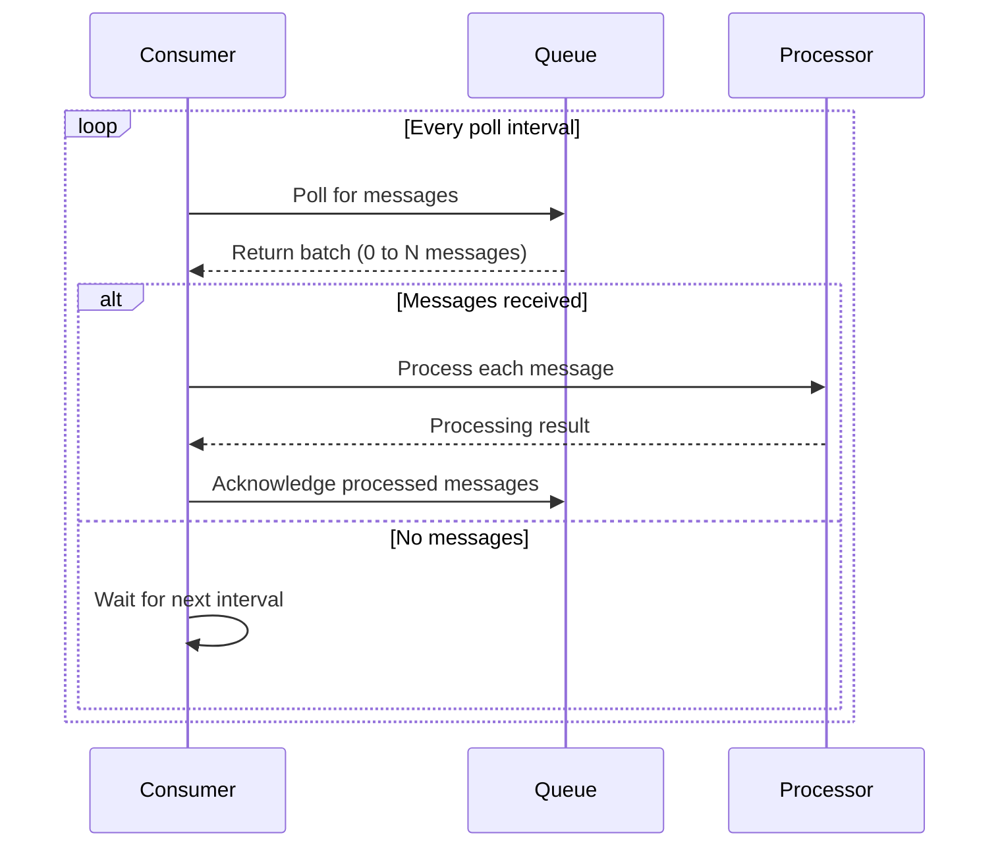
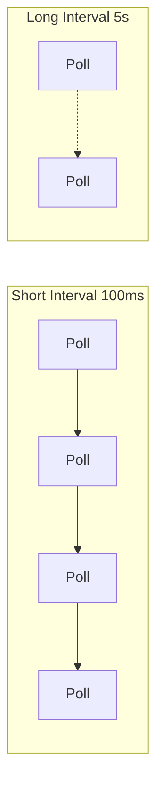
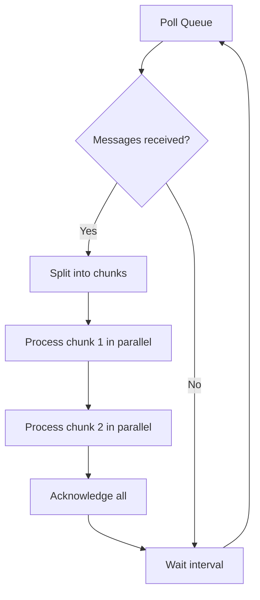
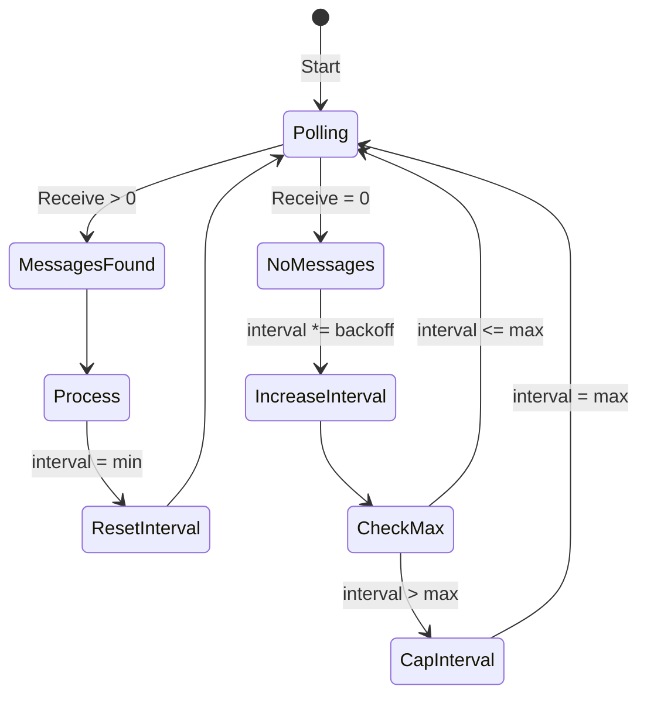

# How to Build a Polling Consumer

Author: [nawazdhandala](https://github.com/nawazdhandala)

Tags: Messaging, Patterns, Consumer, EIP

Description: A practical guide to implementing the Polling Consumer pattern for reliable message retrieval from queues and channels.

---

The Polling Consumer is one of the foundational messaging patterns from the Enterprise Integration Patterns (EIP) catalog. Unlike event-driven consumers that react to push notifications, a polling consumer actively requests messages from a channel at intervals it controls. This gives you explicit control over when and how messages are processed.

This post covers the core mechanics, implementation strategies, and production considerations for building polling consumers that scale reliably.

---

## Table of Contents

1. What is a Polling Consumer?
2. When to Use Polling vs Push
3. Basic Polling Consumer Flow
4. Implementation in TypeScript
5. Configuring Poll Intervals
6. Batch Polling for Throughput
7. Adaptive Polling Strategies
8. Error Handling and Retries
9. Observability and Metrics
10. Common Pitfalls
11. Production Checklist

---

## 1. What is a Polling Consumer?

A Polling Consumer is a message endpoint that explicitly requests messages from a channel rather than having messages pushed to it. The consumer controls the timing and rate of message retrieval.

| Characteristic | Description |
|---------------|-------------|
| Pull-based | Consumer initiates the request for messages |
| Controlled pace | Consumer decides when to fetch next batch |
| Resource aware | Can pause polling under load or backpressure |
| Stateless channel | Queue does not need to track consumer connections |

The pattern fits naturally with message queues like SQS, RabbitMQ (basic.get), Redis lists, and database-backed job tables.

---

## 2. When to Use Polling vs Push

| Use Polling When | Use Push When |
|-----------------|---------------|
| You need rate limiting at the consumer | Low latency is critical |
| Consumer resources are constrained | Messages are sparse and unpredictable |
| Processing is CPU/memory intensive | You want simpler consumer code |
| You want explicit batch control | Broker supports efficient push (AMQP, Kafka) |
| Network is unreliable (poll and ack) | You have persistent connections available |

Polling adds latency (up to one poll interval) but gives you fine-grained control over throughput and resource usage.

---

## 3. Basic Polling Consumer Flow



The consumer runs a continuous loop:

1. Request messages from the queue
2. Process received messages
3. Acknowledge successful processing
4. Wait for the next poll cycle

---

## 4. Implementation in TypeScript

Here is a basic polling consumer structure:

```typescript
// polling-consumer.ts
interface Message<T> {
  id: string;
  body: T;
  receiptHandle: string;
  receivedAt: Date;
}

interface QueueClient<T> {
  receiveMessages(maxCount: number): Promise<Message<T>[]>;
  deleteMessage(receiptHandle: string): Promise<void>;
}

interface PollingConsumerConfig {
  pollIntervalMs: number;
  batchSize: number;
  maxRetries: number;
}

export class PollingConsumer<T> {
  private running = false;
  private currentTimeout: NodeJS.Timeout | null = null;

  constructor(
    private queue: QueueClient<T>,
    private processor: (message: Message<T>) => Promise<void>,
    private config: PollingConsumerConfig
  ) {}

  async start(): Promise<void> {
    this.running = true;
    console.log('Polling consumer started');
    await this.poll();
  }

  stop(): void {
    this.running = false;
    if (this.currentTimeout) {
      clearTimeout(this.currentTimeout);
      this.currentTimeout = null;
    }
    console.log('Polling consumer stopped');
  }

  private async poll(): Promise<void> {
    if (!this.running) return;

    try {
      const messages = await this.queue.receiveMessages(this.config.batchSize);

      if (messages.length > 0) {
        await this.processBatch(messages);
      }
    } catch (err) {
      console.error('Poll cycle failed:', err);
    }

    // Schedule next poll
    this.currentTimeout = setTimeout(
      () => this.poll(),
      this.config.pollIntervalMs
    );
  }

  private async processBatch(messages: Message<T>[]): Promise<void> {
    for (const message of messages) {
      try {
        await this.processor(message);
        await this.queue.deleteMessage(message.receiptHandle);
      } catch (err) {
        console.error(`Failed to process message ${message.id}:`, err);
        // Message will become visible again after visibility timeout
      }
    }
  }
}
```

Usage example:

```typescript
// main.ts
import { PollingConsumer } from './polling-consumer';
import { SQSQueueClient } from './sqs-client';

const queue = new SQSQueueClient({
  queueUrl: process.env.SQS_QUEUE_URL!,
  region: 'us-east-1'
});

const consumer = new PollingConsumer(
  queue,
  async (message) => {
    console.log('Processing:', message.body);
    // Your business logic here
  },
  {
    pollIntervalMs: 1000,
    batchSize: 10,
    maxRetries: 3
  }
);

consumer.start();

// Graceful shutdown
process.on('SIGTERM', () => consumer.stop());
```

---

## 5. Configuring Poll Intervals

The poll interval is a tradeoff between latency and resource usage.

| Interval | Latency | CPU/Network Cost | Use Case |
|----------|---------|------------------|----------|
| 100ms | Very low | High | Near real-time processing |
| 1s | Low | Moderate | Standard job queues |
| 5-10s | Medium | Low | Background tasks |
| 30s+ | High | Minimal | Batch processing, reports |



**Guidelines:**

- Start with 1 second for general workloads
- Use shorter intervals (100-500ms) when SLAs require sub-second latency
- Use longer intervals (5-30s) for batch jobs or when queue traffic is sparse
- Consider the cost model of your queue (SQS charges per request)

---

## 6. Batch Polling for Throughput

Fetching multiple messages per poll reduces overhead and improves throughput.

```typescript
// batch-processor.ts
interface BatchConfig {
  batchSize: number;
  concurrency: number;
  pollIntervalMs: number;
}

export class BatchPollingConsumer<T> {
  constructor(
    private queue: QueueClient<T>,
    private processor: (message: Message<T>) => Promise<void>,
    private config: BatchConfig
  ) {}

  private async processBatch(messages: Message<T>[]): Promise<void> {
    // Process messages with controlled concurrency
    const chunks = this.chunk(messages, this.config.concurrency);

    for (const chunk of chunks) {
      await Promise.all(
        chunk.map(async (msg) => {
          try {
            await this.processor(msg);
            await this.queue.deleteMessage(msg.receiptHandle);
          } catch (err) {
            console.error(`Message ${msg.id} failed:`, err);
          }
        })
      );
    }
  }

  private chunk<U>(array: U[], size: number): U[][] {
    const result: U[][] = [];
    for (let i = 0; i < array.length; i += size) {
      result.push(array.slice(i, i + size));
    }
    return result;
  }
}
```



**Batch sizing considerations:**

| Factor | Recommendation |
|--------|----------------|
| Memory per message | Keep total batch memory under 256MB |
| Processing time | Batch should complete before visibility timeout |
| Queue depth | Larger batches when queue is deep |
| Concurrency limit | Match to available CPU cores |

---

## 7. Adaptive Polling Strategies

Static poll intervals waste resources when the queue is empty and add latency when it is full. Adaptive polling adjusts the interval based on queue activity.

### Exponential Backoff on Empty Polls

```typescript
// adaptive-consumer.ts
interface AdaptiveConfig {
  minIntervalMs: number;
  maxIntervalMs: number;
  backoffMultiplier: number;
  batchSize: number;
}

export class AdaptivePollingConsumer<T> {
  private currentIntervalMs: number;
  private running = false;

  constructor(
    private queue: QueueClient<T>,
    private processor: (message: Message<T>) => Promise<void>,
    private config: AdaptiveConfig
  ) {
    this.currentIntervalMs = config.minIntervalMs;
  }

  private async poll(): Promise<void> {
    if (!this.running) return;

    const messages = await this.queue.receiveMessages(this.config.batchSize);

    if (messages.length > 0) {
      // Reset to minimum interval when messages found
      this.currentIntervalMs = this.config.minIntervalMs;
      await this.processBatch(messages);
    } else {
      // Back off when queue is empty
      this.currentIntervalMs = Math.min(
        this.currentIntervalMs * this.config.backoffMultiplier,
        this.config.maxIntervalMs
      );
    }

    setTimeout(() => this.poll(), this.currentIntervalMs);
  }

  private async processBatch(messages: Message<T>[]): Promise<void> {
    for (const msg of messages) {
      await this.processor(msg);
      await this.queue.deleteMessage(msg.receiptHandle);
    }
  }

  start(): void {
    this.running = true;
    this.poll();
  }

  stop(): void {
    this.running = false;
  }
}
```



### Queue Depth Aware Polling

For queues that expose depth metrics (like SQS ApproximateNumberOfMessages), you can adjust polling aggressiveness:

```typescript
// depth-aware-consumer.ts
interface DepthAwareConfig {
  lowDepthIntervalMs: number;   // Use when queue < 100 messages
  highDepthIntervalMs: number;  // Use when queue > 1000 messages
  depthThresholdLow: number;
  depthThresholdHigh: number;
}

async function getAdaptiveInterval(
  queueDepth: number,
  config: DepthAwareConfig
): Promise<number> {
  if (queueDepth < config.depthThresholdLow) {
    return config.lowDepthIntervalMs;
  }
  if (queueDepth > config.depthThresholdHigh) {
    return config.highDepthIntervalMs;
  }
  // Linear interpolation between thresholds
  const ratio = (queueDepth - config.depthThresholdLow) /
                (config.depthThresholdHigh - config.depthThresholdLow);
  return config.lowDepthIntervalMs +
         ratio * (config.highDepthIntervalMs - config.lowDepthIntervalMs);
}
```

---

## 8. Error Handling and Retries

Robust error handling prevents message loss and avoids poison messages blocking the queue.

```typescript
// error-handling.ts
interface RetryConfig {
  maxRetries: number;
  retryDelayMs: number;
  deadLetterQueue: QueueClient<unknown>;
}

async function processWithRetry<T>(
  message: Message<T>,
  processor: (msg: Message<T>) => Promise<void>,
  config: RetryConfig,
  attempt = 1
): Promise<boolean> {
  try {
    await processor(message);
    return true;
  } catch (err) {
    console.error(`Attempt ${attempt} failed for ${message.id}:`, err);

    if (attempt >= config.maxRetries) {
      // Move to dead letter queue
      await config.deadLetterQueue.sendMessage({
        originalMessage: message,
        error: String(err),
        failedAt: new Date().toISOString(),
        attempts: attempt
      });
      console.warn(`Message ${message.id} moved to DLQ after ${attempt} attempts`);
      return false;
    }

    // Wait before retry
    await sleep(config.retryDelayMs * attempt);
    return processWithRetry(message, processor, config, attempt + 1);
  }
}

function sleep(ms: number): Promise<void> {
  return new Promise(resolve => setTimeout(resolve, ms));
}
```

**Error categories and handling:**

| Error Type | Action | Example |
|-----------|--------|---------|
| Transient | Retry with backoff | Network timeout, rate limit |
| Permanent | Send to DLQ immediately | Invalid message format |
| Poison | DLQ after max retries | Bug in processor logic |
| Resource exhaustion | Pause polling | Out of memory, disk full |

---

## 9. Observability and Metrics

Track these metrics to monitor polling consumer health:

```typescript
// metrics.ts
interface ConsumerMetrics {
  pollCount: number;
  messagesReceived: number;
  messagesProcessed: number;
  messagesFailed: number;
  emptyPolls: number;
  processingTimeMs: number[];
  currentInterval: number;
}

class InstrumentedConsumer<T> {
  private metrics: ConsumerMetrics = {
    pollCount: 0,
    messagesReceived: 0,
    messagesProcessed: 0,
    messagesFailed: 0,
    emptyPolls: 0,
    processingTimeMs: [],
    currentInterval: 0
  };

  private async poll(): Promise<void> {
    this.metrics.pollCount++;
    const pollStart = Date.now();

    const messages = await this.queue.receiveMessages(this.config.batchSize);
    this.metrics.messagesReceived += messages.length;

    if (messages.length === 0) {
      this.metrics.emptyPolls++;
    }

    for (const msg of messages) {
      const processStart = Date.now();
      try {
        await this.processor(msg);
        await this.queue.deleteMessage(msg.receiptHandle);
        this.metrics.messagesProcessed++;
      } catch {
        this.metrics.messagesFailed++;
      }
      this.metrics.processingTimeMs.push(Date.now() - processStart);
    }

    // Emit metrics to your observability backend
    this.emitMetrics();
  }

  private emitMetrics(): void {
    // Send to OneUptime, Prometheus, StatsD, etc.
    console.log('Consumer metrics:', {
      pollsPerMinute: this.metrics.pollCount,
      throughput: this.metrics.messagesProcessed,
      errorRate: this.metrics.messagesFailed /
                 (this.metrics.messagesProcessed + this.metrics.messagesFailed),
      emptyPollRatio: this.metrics.emptyPolls / this.metrics.pollCount,
      avgProcessingMs: this.average(this.metrics.processingTimeMs)
    });
  }

  private average(arr: number[]): number {
    return arr.length ? arr.reduce((a, b) => a + b, 0) / arr.length : 0;
  }
}
```

**Key metrics to track:**

| Metric | What It Tells You |
|--------|-------------------|
| Messages processed/sec | Throughput |
| Empty poll ratio | Polling efficiency |
| Processing time p99 | Latency distribution |
| Error rate | Processing reliability |
| Queue age of oldest message | Consumer lag |
| Current poll interval | Adaptive behavior |

---

## 10. Common Pitfalls

### 1. Polling Too Aggressively

Tight loops without delays burn CPU and rack up API costs.

```typescript
// Bad: No delay between polls
while (true) {
  const messages = await queue.receive();
  // Process...
}

// Good: Always include a minimum delay
while (true) {
  const messages = await queue.receive();
  // Process...
  await sleep(100); // Minimum breathing room
}
```

### 2. Not Handling Visibility Timeout

Messages reappear if processing takes longer than the visibility timeout.

```typescript
// Extend visibility for long-running tasks
async function processLongRunning(message: Message): Promise<void> {
  const extender = setInterval(async () => {
    await queue.extendVisibility(message.receiptHandle, 30);
  }, 20000); // Extend every 20s for 30s timeout

  try {
    await doExpensiveWork(message);
  } finally {
    clearInterval(extender);
  }
}
```

### 3. Blocking the Event Loop

Synchronous processing blocks other messages.

```typescript
// Bad: Blocking
for (const msg of messages) {
  heavySyncOperation(msg); // Blocks everything
}

// Good: Async with controlled concurrency
await Promise.all(
  messages.map(msg => processAsync(msg))
);
```

### 4. Ignoring Graceful Shutdown

Stopping mid-batch loses work.

```typescript
// Handle shutdown properly
process.on('SIGTERM', async () => {
  consumer.stop(); // Stop accepting new polls
  await consumer.waitForCurrentBatch(); // Finish in-flight work
  process.exit(0);
});
```

---

## 11. Production Checklist

Before deploying a polling consumer to production:

- [ ] Configure appropriate poll interval for your latency requirements
- [ ] Set batch size based on message processing time and memory
- [ ] Implement exponential backoff for empty polls
- [ ] Set up dead letter queue for failed messages
- [ ] Add visibility timeout extension for long tasks
- [ ] Implement graceful shutdown handling
- [ ] Add metrics for throughput, latency, and error rate
- [ ] Set up alerts for high error rate and consumer lag
- [ ] Test behavior under queue backlog
- [ ] Document retry policy and DLQ handling procedures

---

## Summary

| Concept | Key Point |
|---------|-----------|
| Poll interval | Balance latency vs resource cost |
| Batch polling | Amortize overhead, increase throughput |
| Adaptive polling | Back off when empty, speed up when full |
| Error handling | Retry transient, DLQ permanent failures |
| Observability | Track throughput, latency, errors, empty polls |

The Polling Consumer pattern gives you explicit control over message consumption at the cost of added latency. Use it when you need to manage resource usage, implement backpressure, or work with queues that do not support push semantics.

---

## Related Reading

- [Enterprise Integration Patterns: Polling Consumer](https://www.enterpriseintegrationpatterns.com/patterns/messaging/PollingConsumer.html)
- [What are Traces and Spans in OpenTelemetry](/blog/post/2025-08-27-traces-and-spans-in-opentelemetry)
- [Node.js Graceful Shutdown Handler](/blog/post/2026-01-06-nodejs-graceful-shutdown-handler)

---

Building reliable message consumers? **OneUptime** provides observability for your queues and workers with traces, metrics, and logs in one platform.
