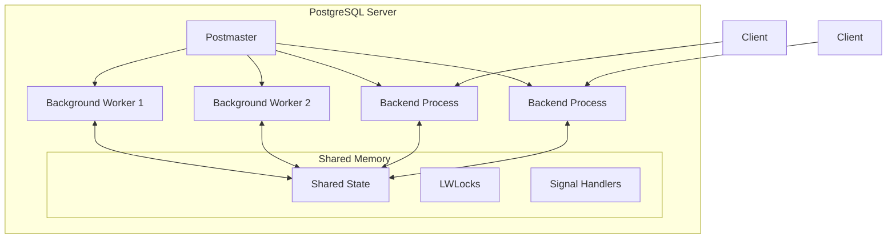
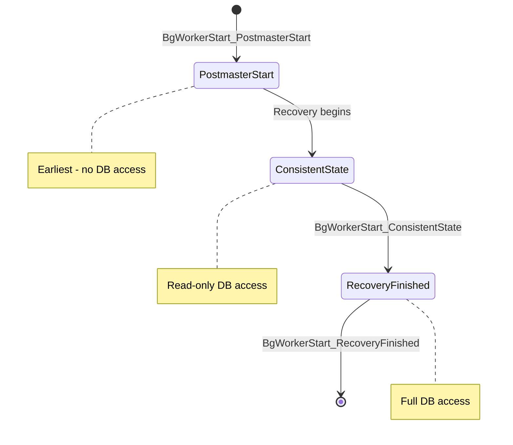
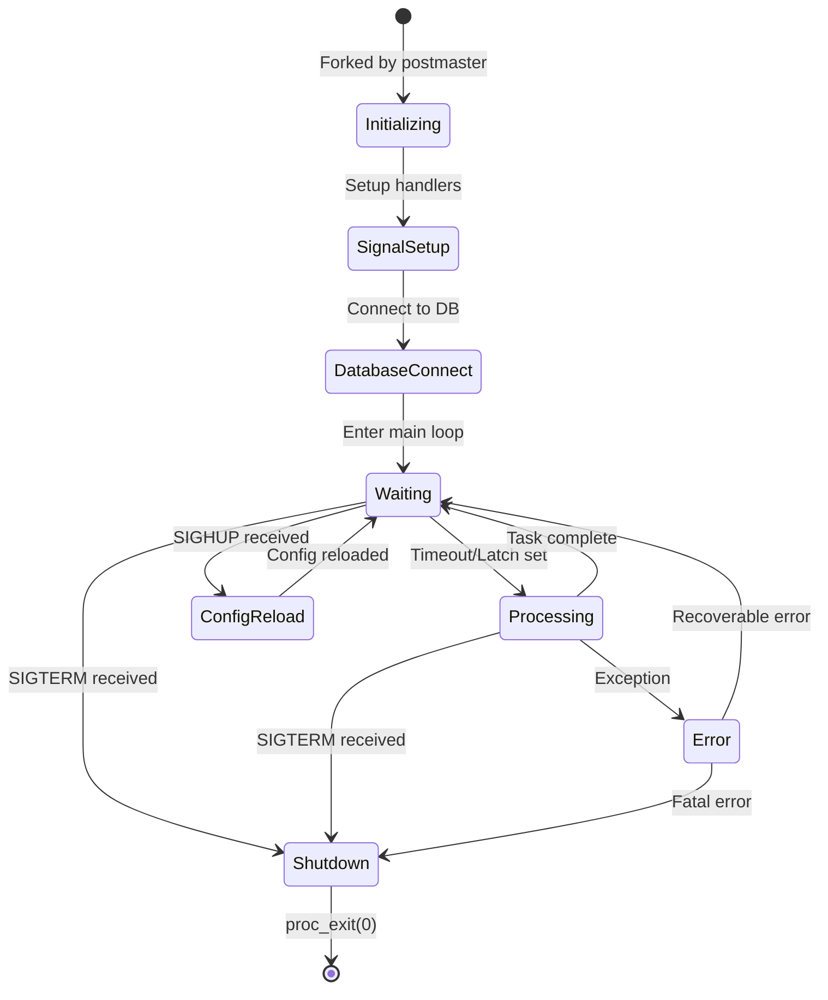
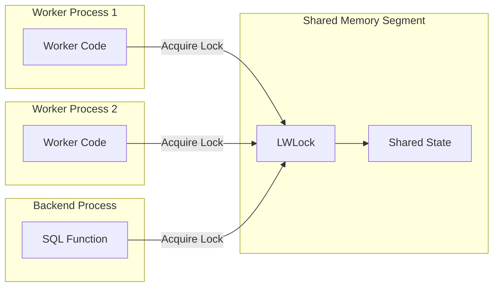
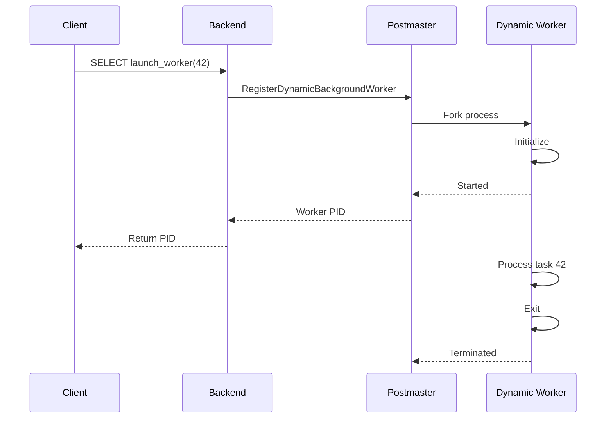

# How to Build PostgreSQL Custom Background Workers

Author: [nawazdhandala](https://github.com/nawazdhandala)

Tags: PostgreSQL, Background Workers, Extensions, C Programming

Description: Learn to implement custom background workers for PostgreSQL with process management, shared memory, and database connections for scheduled tasks.

---

## Introduction

PostgreSQL background workers are auxiliary processes that run alongside the main server and can perform custom tasks without blocking client connections. They are powerful building blocks for implementing features like:

- Scheduled maintenance tasks
- Asynchronous job processing
- Real-time data aggregation
- Custom replication solutions
- Monitoring and alerting systems

This guide covers the complete lifecycle of building production-ready background workers, from registration to graceful shutdown.

## Architecture Overview

Background workers in PostgreSQL run as separate processes forked from the postmaster. They have their own memory context but can communicate with backend processes through shared memory.



## Worker Registration

The first step is registering your worker with PostgreSQL. This happens during the shared library load phase, typically in the `_PG_init` function.

### Basic Worker Structure

```c
#include "postgres.h"
#include "postmaster/bgworker.h"
#include "storage/ipc.h"
#include "storage/latch.h"
#include "storage/proc.h"
#include "fmgr.h"

PG_MODULE_MAGIC;

void _PG_init(void);
PGDLLEXPORT void my_worker_main(Datum main_arg);

void
_PG_init(void)
{
    BackgroundWorker worker;

    /* Initialize worker struct to zeros */
    memset(&worker, 0, sizeof(BackgroundWorker));

    /* Set worker properties */
    snprintf(worker.bgw_name, BGW_MAXLEN, "my_custom_worker");
    snprintf(worker.bgw_type, BGW_MAXLEN, "my_custom_worker");
    snprintf(worker.bgw_library_name, BGW_MAXLEN, "my_extension");
    snprintf(worker.bgw_function_name, BGW_MAXLEN, "my_worker_main");

    /* Worker flags */
    worker.bgw_flags = BGWORKER_SHMEM_ACCESS |
                       BGWORKER_BACKEND_DATABASE_CONNECTION;

    /* Start time - when should this worker be started */
    worker.bgw_start_time = BgWorkerStart_RecoveryFinished;

    /* Restart policy - restart after 10 seconds on crash */
    worker.bgw_restart_time = 10;

    /* Main argument passed to worker function */
    worker.bgw_main_arg = (Datum) 0;

    /* Notification PID (0 = none) */
    worker.bgw_notify_pid = 0;

    /* Register the worker */
    RegisterBackgroundWorker(&worker);
}
```

### Worker Flags Explained

| Flag | Description |
|------|-------------|
| `BGWORKER_SHMEM_ACCESS` | Worker can access shared memory |
| `BGWORKER_BACKEND_DATABASE_CONNECTION` | Worker can establish database connections |

### Start Time Options



## Worker Lifecycle Management

The worker main function controls the entire lifecycle of your background process.

### Complete Worker Implementation

```c
#include "postgres.h"
#include "postmaster/bgworker.h"
#include "storage/ipc.h"
#include "storage/latch.h"
#include "storage/lwlock.h"
#include "storage/proc.h"
#include "storage/shmem.h"
#include "access/xact.h"
#include "executor/spi.h"
#include "fmgr.h"
#include "lib/stringinfo.h"
#include "pgstat.h"
#include "utils/builtins.h"
#include "utils/snapmgr.h"
#include "tcop/utility.h"
#include "miscadmin.h"

/* GUC variables */
static int worker_naptime = 10;  /* seconds */
static char *worker_database = "postgres";

/* Signal handling flags */
static volatile sig_atomic_t got_sighup = false;
static volatile sig_atomic_t got_sigterm = false;

/* Signal handler for SIGHUP - configuration reload */
static void
worker_sighup(SIGNAL_ARGS)
{
    int save_errno = errno;
    got_sighup = true;
    SetLatch(MyLatch);
    errno = save_errno;
}

/* Signal handler for SIGTERM - shutdown request */
static void
worker_sigterm(SIGNAL_ARGS)
{
    int save_errno = errno;
    got_sigterm = true;
    SetLatch(MyLatch);
    errno = save_errno;
}

void
my_worker_main(Datum main_arg)
{
    /* Establish signal handlers */
    pqsignal(SIGHUP, worker_sighup);
    pqsignal(SIGTERM, worker_sigterm);

    /* Unblock signals (blocked during startup) */
    BackgroundWorkerUnblockSignals();

    /* Connect to the database */
    BackgroundWorkerInitializeConnection(worker_database, NULL, 0);

    ereport(LOG,
            (errmsg("background worker \"%s\" started",
                    MyBgworkerEntry->bgw_name)));

    /* Main loop */
    while (!got_sigterm)
    {
        int rc;

        /* Wait for latch or timeout */
        rc = WaitLatch(MyLatch,
                       WL_LATCH_SET | WL_TIMEOUT | WL_EXIT_ON_PM_DEATH,
                       worker_naptime * 1000L,
                       PG_WAIT_EXTENSION);

        /* Reset the latch */
        ResetLatch(MyLatch);

        /* Check for shutdown */
        if (got_sigterm)
            break;

        /* Reload configuration if requested */
        if (got_sighup)
        {
            got_sighup = false;
            ProcessConfigFile(PGC_SIGHUP);
            ereport(LOG,
                    (errmsg("background worker reloaded configuration")));
        }

        /* Do the actual work */
        if (rc & WL_TIMEOUT)
        {
            perform_scheduled_task();
        }
    }

    ereport(LOG,
            (errmsg("background worker \"%s\" shutting down",
                    MyBgworkerEntry->bgw_name)));

    proc_exit(0);
}
```

### Worker State Machine



## Database Access Patterns

Background workers can execute SQL queries using the Server Programming Interface (SPI).

### Executing Queries

```c
static void
perform_scheduled_task(void)
{
    int ret;
    bool isnull;
    int64 count;

    /* Start a transaction */
    SetCurrentStatementStartTimestamp();
    StartTransactionCommand();
    SPI_connect();
    PushActiveSnapshot(GetTransactionSnapshot());

    /* Set statement timeout for safety */
    pgstat_report_activity(STATE_RUNNING, "processing scheduled task");

    /* Execute a query */
    ret = SPI_execute("SELECT count(*) FROM my_queue WHERE status = 'pending'",
                      true,  /* read-only */
                      0);    /* no limit */

    if (ret != SPI_OK_SELECT)
        ereport(ERROR,
                (errcode(ERRCODE_INTERNAL_ERROR),
                 errmsg("SPI_execute failed: error code %d", ret)));

    /* Process results */
    if (SPI_processed > 0)
    {
        count = DatumGetInt64(SPI_getbinval(SPI_tuptable->vals[0],
                                            SPI_tuptable->tupdesc,
                                            1,
                                            &isnull));
        if (!isnull && count > 0)
        {
            ereport(LOG,
                    (errmsg("found %ld pending items to process", count)));
            process_pending_items();
        }
    }

    /* Clean up */
    SPI_finish();
    PopActiveSnapshot();
    CommitTransactionCommand();
    pgstat_report_activity(STATE_IDLE, NULL);
}
```

### Processing Queue Items

```c
static void
process_pending_items(void)
{
    int ret;
    uint64 i;

    /* Fetch pending items */
    ret = SPI_execute(
        "UPDATE my_queue "
        "SET status = 'processing', started_at = now() "
        "WHERE id IN ("
        "    SELECT id FROM my_queue "
        "    WHERE status = 'pending' "
        "    ORDER BY created_at "
        "    LIMIT 100 "
        "    FOR UPDATE SKIP LOCKED"
        ") "
        "RETURNING id, payload",
        false,  /* not read-only */
        0);

    if (ret != SPI_OK_UPDATE_RETURNING)
        ereport(ERROR,
                (errcode(ERRCODE_INTERNAL_ERROR),
                 errmsg("failed to fetch queue items")));

    /* Process each item */
    for (i = 0; i < SPI_processed; i++)
    {
        HeapTuple tuple = SPI_tuptable->vals[i];
        TupleDesc tupdesc = SPI_tuptable->tupdesc;
        bool isnull;

        int64 id = DatumGetInt64(
            SPI_getbinval(tuple, tupdesc, 1, &isnull));

        text *payload = DatumGetTextPP(
            SPI_getbinval(tuple, tupdesc, 2, &isnull));

        /* Process this item */
        process_single_item(id, text_to_cstring(payload));
    }
}
```

## Shared Memory Communication

For inter-process communication, background workers can use shared memory segments.

### Defining Shared State

```c
/* Shared memory state structure */
typedef struct MyWorkerSharedState
{
    LWLock     *lock;           /* Protects the shared state */
    int         worker_count;   /* Number of active workers */
    int64       items_processed;/* Total items processed */
    TimestampTz last_run;       /* Last execution time */
    bool        shutdown_requested;
    char        status[256];    /* Current status message */
} MyWorkerSharedState;

static MyWorkerSharedState *shared_state = NULL;
static shmem_startup_hook_type prev_shmem_startup_hook = NULL;
```

### Shared Memory Initialization

```c
/* Calculate shared memory size needed */
static Size
my_worker_shmem_size(void)
{
    Size size = 0;
    size = add_size(size, sizeof(MyWorkerSharedState));
    return size;
}

/* Request shared memory allocation */
static void
my_worker_shmem_request(void)
{
    if (prev_shmem_request_hook)
        prev_shmem_request_hook();

    RequestAddinShmemSpace(my_worker_shmem_size());
    RequestNamedLWLockTranche("my_worker", 1);
}

/* Initialize shared memory */
static void
my_worker_shmem_startup(void)
{
    bool found;

    if (prev_shmem_startup_hook)
        prev_shmem_startup_hook();

    /* Reset in case of restart */
    shared_state = NULL;

    LWLockAcquire(AddinShmemInitLock, LW_EXCLUSIVE);

    shared_state = ShmemInitStruct("my_worker",
                                   sizeof(MyWorkerSharedState),
                                   &found);

    if (!found)
    {
        /* First time - initialize the structure */
        memset(shared_state, 0, sizeof(MyWorkerSharedState));
        shared_state->lock = &(GetNamedLWLockTranche("my_worker"))->lock;
        shared_state->items_processed = 0;
        shared_state->last_run = 0;
        shared_state->shutdown_requested = false;
        snprintf(shared_state->status, sizeof(shared_state->status),
                 "initialized");
    }

    LWLockRelease(AddinShmemInitLock);
}

/* Hook setup in _PG_init */
void
_PG_init(void)
{
    if (!process_shared_preload_libraries_in_progress)
        return;

    /* Request shared memory */
    prev_shmem_request_hook = shmem_request_hook;
    shmem_request_hook = my_worker_shmem_request;

    prev_shmem_startup_hook = shmem_startup_hook;
    shmem_startup_hook = my_worker_shmem_startup;

    /* Register worker... */
}
```

### Using Shared Memory Safely

```c
static void
update_shared_state(int64 items_processed)
{
    LWLockAcquire(shared_state->lock, LW_EXCLUSIVE);

    shared_state->items_processed += items_processed;
    shared_state->last_run = GetCurrentTimestamp();
    snprintf(shared_state->status, sizeof(shared_state->status),
             "processed %ld items", items_processed);

    LWLockRelease(shared_state->lock);
}

static int64
get_total_processed(void)
{
    int64 result;

    LWLockAcquire(shared_state->lock, LW_SHARED);
    result = shared_state->items_processed;
    LWLockRelease(shared_state->lock);

    return result;
}
```

### Shared Memory Architecture



## Error Handling and Recovery

Robust error handling is critical for production background workers.

### Using PG_TRY/PG_CATCH

```c
static void
perform_task_with_error_handling(void)
{
    MemoryContext oldcontext;
    MemoryContext taskcontext;

    /* Create a memory context for this task */
    taskcontext = AllocSetContextCreate(TopMemoryContext,
                                        "TaskContext",
                                        ALLOCSET_DEFAULT_SIZES);
    oldcontext = MemoryContextSwitchTo(taskcontext);

    PG_TRY();
    {
        /* Start transaction */
        SetCurrentStatementStartTimestamp();
        StartTransactionCommand();
        SPI_connect();
        PushActiveSnapshot(GetTransactionSnapshot());

        /* Do the actual work */
        execute_task();

        /* Commit on success */
        SPI_finish();
        PopActiveSnapshot();
        CommitTransactionCommand();

        ereport(LOG,
                (errmsg("task completed successfully")));
    }
    PG_CATCH();
    {
        /* Switch to error context for cleanup */
        MemoryContextSwitchTo(oldcontext);

        /* Rollback the transaction */
        SPI_finish();
        PopActiveSnapshot();
        AbortCurrentTransaction();

        /* Log the error but continue running */
        EmitErrorReport();
        FlushErrorState();

        ereport(WARNING,
                (errmsg("task failed, will retry on next cycle")));
    }
    PG_END_TRY();

    /* Clean up memory context */
    MemoryContextSwitchTo(oldcontext);
    MemoryContextDelete(taskcontext);
}
```

### Handling Different Error Severities

```c
static void
execute_task(void)
{
    int ret;

    ret = SPI_execute("SELECT process_item()", false, 0);

    switch (ret)
    {
        case SPI_OK_SELECT:
            /* Success */
            break;

        case SPI_ERROR_ARGUMENT:
            ereport(ERROR,
                    (errcode(ERRCODE_INVALID_PARAMETER_VALUE),
                     errmsg("invalid argument passed to SPI")));
            break;

        case SPI_ERROR_TRANSACTION:
            ereport(ERROR,
                    (errcode(ERRCODE_TRANSACTION_ROLLBACK),
                     errmsg("transaction aborted during SPI execution")));
            break;

        default:
            ereport(ERROR,
                    (errcode(ERRCODE_INTERNAL_ERROR),
                     errmsg("unexpected SPI return code: %d", ret)));
    }
}
```

## Dynamic Worker Management

PostgreSQL allows dynamic registration of workers at runtime.

### Launching Workers Dynamically

```c
/* SQL-callable function to launch a worker */
PG_FUNCTION_INFO_V1(launch_dynamic_worker);

Datum
launch_dynamic_worker(PG_FUNCTION_ARGS)
{
    int32 task_id = PG_GETARG_INT32(0);
    BackgroundWorker worker;
    BackgroundWorkerHandle *handle;
    BgwHandleStatus status;
    pid_t pid;

    memset(&worker, 0, sizeof(BackgroundWorker));

    snprintf(worker.bgw_name, BGW_MAXLEN,
             "dynamic_worker_%d", task_id);
    snprintf(worker.bgw_type, BGW_MAXLEN, "dynamic_worker");
    snprintf(worker.bgw_library_name, BGW_MAXLEN, "my_extension");
    snprintf(worker.bgw_function_name, BGW_MAXLEN,
             "dynamic_worker_main");

    worker.bgw_flags = BGWORKER_SHMEM_ACCESS |
                       BGWORKER_BACKEND_DATABASE_CONNECTION;
    worker.bgw_start_time = BgWorkerStart_RecoveryFinished;

    /* Do not restart on crash - this is a one-shot worker */
    worker.bgw_restart_time = BGW_NEVER_RESTART;

    /* Pass the task ID as the main argument */
    worker.bgw_main_arg = Int32GetDatum(task_id);

    /* Get notified when worker starts */
    worker.bgw_notify_pid = MyProcPid;

    /* Register and start the worker */
    if (!RegisterDynamicBackgroundWorker(&worker, &handle))
        ereport(ERROR,
                (errcode(ERRCODE_INSUFFICIENT_RESOURCES),
                 errmsg("could not register background worker")));

    /* Wait for the worker to start */
    status = WaitForBackgroundWorkerStartup(handle, &pid);

    if (status == BGWH_STARTED)
    {
        ereport(NOTICE,
                (errmsg("dynamic worker started with PID %d", pid)));
        PG_RETURN_INT32(pid);
    }
    else if (status == BGWH_STOPPED)
        ereport(ERROR,
                (errcode(ERRCODE_INSUFFICIENT_RESOURCES),
                 errmsg("could not start background worker")));
    else
        ereport(ERROR,
                (errcode(ERRCODE_INSUFFICIENT_RESOURCES),
                 errmsg("unexpected background worker status")));

    PG_RETURN_NULL();  /* Keep compiler happy */
}
```

### Dynamic Worker Flow



## Configuration with GUC Variables

Define custom configuration parameters for your worker.

```c
/* Define GUC variables */
static int worker_naptime = 10;
static int max_items_per_run = 100;
static char *target_database = "postgres";
static bool worker_enabled = true;

void
_PG_init(void)
{
    /* Define worker_naptime parameter */
    DefineCustomIntVariable(
        "my_worker.naptime",
        "Time between worker runs in seconds.",
        NULL,
        &worker_naptime,
        10,      /* default */
        1,       /* min */
        3600,    /* max */
        PGC_SIGHUP,
        GUC_UNIT_S,
        NULL,
        NULL,
        NULL);

    /* Define max_items_per_run parameter */
    DefineCustomIntVariable(
        "my_worker.max_items",
        "Maximum items to process per run.",
        NULL,
        &max_items_per_run,
        100,
        1,
        10000,
        PGC_SIGHUP,
        0,
        NULL,
        NULL,
        NULL);

    /* Define target database parameter */
    DefineCustomStringVariable(
        "my_worker.database",
        "Database to connect to.",
        NULL,
        &target_database,
        "postgres",
        PGC_POSTMASTER,
        0,
        NULL,
        NULL,
        NULL);

    /* Define enabled flag */
    DefineCustomBoolVariable(
        "my_worker.enabled",
        "Enable the background worker.",
        NULL,
        &worker_enabled,
        true,
        PGC_SIGHUP,
        0,
        NULL,
        NULL,
        NULL);

    MarkGUCPrefixReserved("my_worker");

    /* Only register if enabled */
    if (worker_enabled)
        register_worker();
}
```

## Building and Installing

### Makefile

```makefile
MODULES = my_worker
EXTENSION = my_worker
DATA = my_worker--1.0.sql
PGFILEDESC = "my_worker - custom background worker"

PG_CONFIG = pg_config
PGXS := $(shell $(PG_CONFIG) --pgxs)
include $(PGXS)
```

### Extension SQL File

```sql
-- my_worker--1.0.sql

-- Complain if script is sourced in psql
\echo Use "CREATE EXTENSION my_worker" to load this file. \quit

-- Function to launch dynamic worker
CREATE FUNCTION launch_dynamic_worker(task_id integer)
RETURNS integer
AS 'MODULE_PATHNAME', 'launch_dynamic_worker'
LANGUAGE C STRICT;

-- Function to get worker statistics
CREATE FUNCTION get_worker_stats()
RETURNS TABLE (
    items_processed bigint,
    last_run timestamptz,
    status text
)
AS 'MODULE_PATHNAME', 'get_worker_stats'
LANGUAGE C STRICT;

-- View for monitoring
CREATE VIEW my_worker_status AS
SELECT * FROM get_worker_stats();
```

### Installation Steps

```bash
# Build the extension
make

# Install (requires superuser)
sudo make install

# Configure PostgreSQL
echo "shared_preload_libraries = 'my_worker'" >> postgresql.conf
echo "my_worker.naptime = 30" >> postgresql.conf
echo "my_worker.database = 'mydb'" >> postgresql.conf

# Restart PostgreSQL
pg_ctl restart -D /path/to/data

# Create extension in database
psql -d mydb -c "CREATE EXTENSION my_worker;"
```

## Monitoring and Debugging

### Exposing Statistics via SQL

```c
PG_FUNCTION_INFO_V1(get_worker_stats);

Datum
get_worker_stats(PG_FUNCTION_ARGS)
{
    TupleDesc tupdesc;
    Datum values[3];
    bool nulls[3] = {false, false, false};
    HeapTuple tuple;

    /* Build tuple descriptor */
    tupdesc = CreateTemplateTupleDesc(3);
    TupleDescInitEntry(tupdesc, 1, "items_processed", INT8OID, -1, 0);
    TupleDescInitEntry(tupdesc, 2, "last_run", TIMESTAMPTZOID, -1, 0);
    TupleDescInitEntry(tupdesc, 3, "status", TEXTOID, -1, 0);
    tupdesc = BlessTupleDesc(tupdesc);

    /* Get values from shared memory */
    LWLockAcquire(shared_state->lock, LW_SHARED);

    values[0] = Int64GetDatum(shared_state->items_processed);

    if (shared_state->last_run == 0)
        nulls[1] = true;
    else
        values[1] = TimestampTzGetDatum(shared_state->last_run);

    values[2] = CStringGetTextDatum(shared_state->status);

    LWLockRelease(shared_state->lock);

    /* Build and return the tuple */
    tuple = heap_form_tuple(tupdesc, values, nulls);

    PG_RETURN_DATUM(HeapTupleGetDatum(tuple));
}
```

### Checking Worker Status

```sql
-- Check if worker is running
SELECT * FROM pg_stat_activity
WHERE backend_type = 'my_custom_worker';

-- Get worker statistics
SELECT * FROM my_worker_status;

-- Check logs
SELECT * FROM pg_catalog.pg_file_settings
WHERE name LIKE 'my_worker%';
```

## Best Practices Summary

1. **Always handle signals properly** - Set up SIGHUP for config reload and SIGTERM for shutdown.

2. **Use WaitLatch instead of sleep** - It responds to signals and postmaster death.

3. **Protect shared memory with locks** - Always use LWLock for concurrent access.

4. **Clean up transactions** - Use PG_TRY/PG_CATCH to handle errors and rollback properly.

5. **Set restart policy wisely** - Use BGW_NEVER_RESTART for one-shot workers.

6. **Report activity** - Use pgstat_report_activity for visibility in pg_stat_activity.

7. **Use memory contexts** - Create task-specific contexts to prevent memory leaks.

8. **Define GUC variables** - Make your worker configurable without code changes.

9. **Log appropriately** - Use ereport with proper log levels for debugging.

10. **Test crash recovery** - Verify your worker handles restarts gracefully.

## Conclusion

PostgreSQL background workers provide a robust framework for running auxiliary processes alongside your database server. By following the patterns outlined in this guide - proper signal handling, safe shared memory access, transaction management, and error recovery - you can build reliable workers for scheduled tasks, job queues, monitoring, and more.

The key to success is understanding the PostgreSQL process model and respecting its conventions. Workers that integrate cleanly with the server's lifecycle, configuration system, and monitoring infrastructure will be easier to operate and debug in production environments.

## Further Reading

- [PostgreSQL Documentation: Background Worker Processes](https://www.postgresql.org/docs/current/bgworker.html)
- [PostgreSQL Source: src/backend/postmaster/bgworker.c](https://github.com/postgres/postgres/blob/master/src/backend/postmaster/bgworker.c)
- [Server Programming Interface (SPI)](https://www.postgresql.org/docs/current/spi.html)
- [Shared Memory and LWLocks](https://www.postgresql.org/docs/current/xfunc-c.html)
