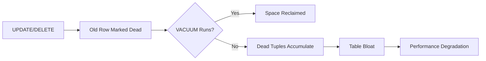
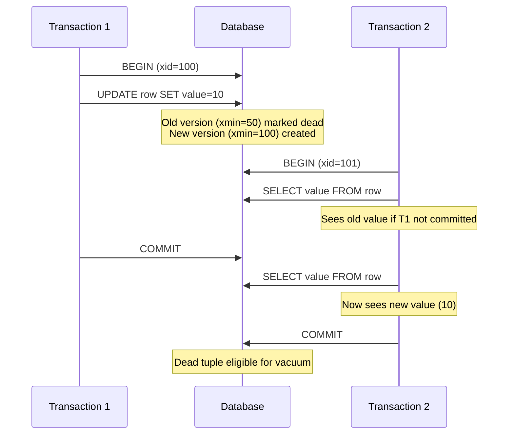
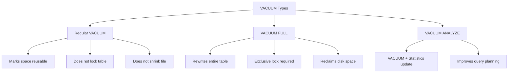
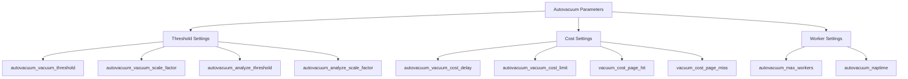
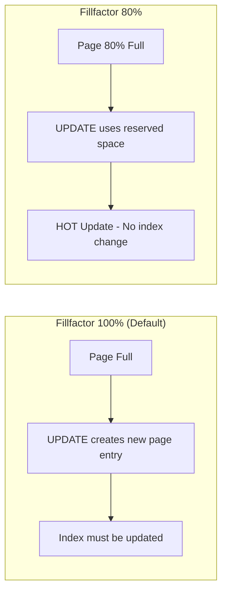
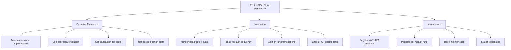

# How to Implement PostgreSQL Bloat Prevention

Author: [nawazdhandala](https://github.com/nawazdhandala)

Tags: PostgreSQL, Bloat Prevention, Vacuum, Performance

Description: Learn to implement bloat prevention strategies with vacuum tuning, fillfactor optimization, and monitoring for healthy database maintenance.

---

PostgreSQL bloat is one of the most common performance issues that database administrators encounter. When tables and indexes accumulate dead tuples over time, query performance degrades and storage costs increase. This guide covers practical strategies to prevent, detect, and remediate bloat in your PostgreSQL databases.

## Understanding PostgreSQL Bloat

### What Causes Bloat?

PostgreSQL uses Multi-Version Concurrency Control (MVCC) to handle concurrent transactions. When a row is updated or deleted, PostgreSQL does not immediately remove the old version. Instead, it marks it as "dead" and keeps it around until no active transaction needs it anymore.



The main causes of bloat include:

1. **High UPDATE/DELETE workloads** - Tables with frequent modifications accumulate dead tuples faster
2. **Long-running transactions** - Hold back the visibility horizon, preventing cleanup
3. **Disabled or slow autovacuum** - Dead tuples are not cleaned up in time
4. **Replication slots** - Unused slots can prevent tuple cleanup
5. **Prepared transactions** - Abandoned prepared transactions block vacuum

### The MVCC Visibility Model



## Detecting Bloat

### Table Bloat Detection Query

This query estimates bloat by comparing the actual table size to the expected size based on live tuples:

```sql
-- Estimate table bloat percentage
WITH constants AS (
    SELECT current_setting('block_size')::numeric AS bs,
           23 AS hdr,  -- heap tuple header size
           4 AS ma     -- alignment
),
table_stats AS (
    SELECT
        schemaname,
        tablename,
        reltuples::bigint AS row_count,
        relpages::bigint AS total_pages,
        pg_relation_size(schemaname || '.' || tablename) AS table_bytes
    FROM pg_stat_user_tables
    JOIN pg_class ON relname = tablename
    WHERE schemaname NOT IN ('pg_catalog', 'information_schema')
)
SELECT
    schemaname,
    tablename,
    row_count,
    total_pages,
    pg_size_pretty(table_bytes) AS table_size,
    CASE
        WHEN row_count = 0 THEN 0
        ELSE round(100.0 * (total_pages - (row_count * 0.1 / 8192))::numeric /
             NULLIF(total_pages, 0), 2)
    END AS estimated_bloat_pct
FROM table_stats
WHERE total_pages > 0
ORDER BY table_bytes DESC;
```

### Using pgstattuple Extension

For more accurate bloat detection, use the `pgstattuple` extension:

```sql
-- Enable the extension
CREATE EXTENSION IF NOT EXISTS pgstattuple;

-- Check bloat for a specific table
SELECT
    table_len,
    tuple_count,
    tuple_len,
    tuple_percent,
    dead_tuple_count,
    dead_tuple_len,
    dead_tuple_percent,
    free_space,
    free_percent
FROM pgstattuple('your_table_name');
```

### Index Bloat Detection

```sql
-- Estimate index bloat using pgstatindex
SELECT
    indexrelname AS index_name,
    pg_size_pretty(pg_relation_size(indexrelid)) AS index_size,
    idx_scan AS index_scans,
    idx_tup_read AS tuples_read,
    idx_tup_fetch AS tuples_fetched
FROM pg_stat_user_indexes
WHERE schemaname = 'public'
ORDER BY pg_relation_size(indexrelid) DESC;

-- Detailed index bloat with pgstattuple
SELECT * FROM pgstatindex('your_index_name');
```

### Automated Bloat Monitoring Query

Create a monitoring view for continuous bloat tracking:

```sql
CREATE OR REPLACE VIEW bloat_monitor AS
WITH table_bloat AS (
    SELECT
        schemaname,
        relname AS tablename,
        n_dead_tup,
        n_live_tup,
        CASE
            WHEN n_live_tup > 0
            THEN round(100.0 * n_dead_tup / n_live_tup, 2)
            ELSE 0
        END AS dead_tuple_ratio,
        last_vacuum,
        last_autovacuum,
        last_analyze,
        pg_size_pretty(pg_relation_size(relid)) AS table_size
    FROM pg_stat_user_tables
)
SELECT
    schemaname,
    tablename,
    n_dead_tup,
    n_live_tup,
    dead_tuple_ratio,
    last_vacuum,
    last_autovacuum,
    table_size,
    CASE
        WHEN dead_tuple_ratio > 20 THEN 'CRITICAL'
        WHEN dead_tuple_ratio > 10 THEN 'WARNING'
        ELSE 'OK'
    END AS bloat_status
FROM table_bloat
ORDER BY dead_tuple_ratio DESC;

-- Query the view
SELECT * FROM bloat_monitor WHERE bloat_status != 'OK';
```

## Vacuum Configuration

### Understanding VACUUM Operations



### Manual VACUUM Commands

```sql
-- Basic vacuum - marks dead tuples as reusable
VACUUM your_table_name;

-- Vacuum with statistics update
VACUUM ANALYZE your_table_name;

-- Verbose vacuum for debugging
VACUUM VERBOSE your_table_name;

-- Full vacuum - rewrites table and reclaims space (locks table)
-- Use with caution in production
VACUUM FULL your_table_name;

-- Vacuum entire database
VACUUM;
```

### Vacuum Progress Monitoring

```sql
-- Monitor vacuum progress in real-time
SELECT
    p.pid,
    p.datname,
    p.relid::regclass AS table_name,
    p.phase,
    p.heap_blks_total,
    p.heap_blks_scanned,
    p.heap_blks_vacuumed,
    round(100.0 * p.heap_blks_vacuumed / NULLIF(p.heap_blks_total, 0), 2) AS pct_complete,
    p.index_vacuum_count,
    p.max_dead_tuples,
    p.num_dead_tuples
FROM pg_stat_progress_vacuum p;
```

## Autovacuum Tuning

### Key Autovacuum Parameters



### Recommended Configuration

Add these settings to your `postgresql.conf`:

```ini
# Enable autovacuum (should be on by default)
autovacuum = on

# Number of autovacuum worker processes
# Increase for large databases with many tables
autovacuum_max_workers = 4

# Time between autovacuum runs (seconds)
autovacuum_naptime = 30

# Vacuum triggers: threshold + scale_factor * num_rows
# Default: vacuum when dead_tuples > 50 + 0.2 * row_count
autovacuum_vacuum_threshold = 50
autovacuum_vacuum_scale_factor = 0.1  # Reduced from default 0.2

# Analyze triggers
autovacuum_analyze_threshold = 50
autovacuum_analyze_scale_factor = 0.05  # Reduced from default 0.1

# Cost-based vacuum delay settings
# Lower delay = more aggressive vacuuming
autovacuum_vacuum_cost_delay = 2ms  # Reduced from default 20ms
autovacuum_vacuum_cost_limit = 1000  # Increased from default 200

# Memory for vacuum operations
maintenance_work_mem = 1GB  # Adjust based on available RAM
```

### Per-Table Autovacuum Settings

For high-traffic tables, configure more aggressive settings:

```sql
-- Configure autovacuum for a high-churn table
ALTER TABLE high_traffic_table SET (
    autovacuum_vacuum_threshold = 100,
    autovacuum_vacuum_scale_factor = 0.05,
    autovacuum_analyze_threshold = 100,
    autovacuum_analyze_scale_factor = 0.02,
    autovacuum_vacuum_cost_delay = 0,
    autovacuum_vacuum_cost_limit = 2000
);

-- Disable autovacuum for a table (use manual vacuum instead)
ALTER TABLE archive_table SET (autovacuum_enabled = false);

-- Check current table storage parameters
SELECT relname, reloptions
FROM pg_class
WHERE relname = 'high_traffic_table';
```

### Autovacuum Activity Monitoring

```sql
-- Check autovacuum activity
SELECT
    schemaname,
    relname,
    n_dead_tup,
    n_live_tup,
    last_autovacuum,
    last_autoanalyze,
    autovacuum_count,
    autoanalyze_count
FROM pg_stat_user_tables
ORDER BY n_dead_tup DESC
LIMIT 20;

-- Check if autovacuum is running
SELECT
    pid,
    state,
    query,
    wait_event_type,
    wait_event,
    now() - query_start AS duration
FROM pg_stat_activity
WHERE query LIKE 'autovacuum:%';
```

## Fillfactor Optimization

### Understanding Fillfactor

Fillfactor determines how full PostgreSQL will fill each data page during inserts. Leaving some space allows for HOT (Heap-Only Tuple) updates, which are much faster because they do not require index updates.



### Setting Fillfactor

```sql
-- Create table with fillfactor
CREATE TABLE orders (
    id SERIAL PRIMARY KEY,
    status VARCHAR(20),
    updated_at TIMESTAMP
) WITH (fillfactor = 80);

-- Alter existing table fillfactor
ALTER TABLE orders SET (fillfactor = 80);

-- After changing fillfactor, rewrite table to apply
-- Option 1: VACUUM FULL (locks table)
VACUUM FULL orders;

-- Option 2: Use pg_repack (online, no locks)
-- pg_repack -t orders -d your_database

-- Set fillfactor for an index
CREATE INDEX idx_orders_status ON orders(status) WITH (fillfactor = 90);
```

### Fillfactor Guidelines

| Table Type | Recommended Fillfactor | Reason |
|------------|----------------------|--------|
| Mostly INSERTs | 100 (default) | No need for update space |
| Frequent UPDATEs | 70-80 | Allow HOT updates |
| Heavy UPDATEs on indexed columns | 70 | More space for tuple versions |
| Read-only/Archive | 100 | Maximize storage efficiency |

### Monitoring HOT Updates

```sql
-- Check HOT update ratio
SELECT
    schemaname,
    relname,
    n_tup_upd AS total_updates,
    n_tup_hot_upd AS hot_updates,
    CASE
        WHEN n_tup_upd > 0
        THEN round(100.0 * n_tup_hot_upd / n_tup_upd, 2)
        ELSE 0
    END AS hot_update_ratio
FROM pg_stat_user_tables
WHERE n_tup_upd > 0
ORDER BY n_tup_upd DESC;
```

A hot_update_ratio below 90% on tables with frequent updates indicates you may benefit from reducing fillfactor.

## Bloat Prevention Strategy

### Complete Monitoring Setup

```sql
-- Create a function to check overall database health
CREATE OR REPLACE FUNCTION check_database_bloat()
RETURNS TABLE (
    check_name TEXT,
    status TEXT,
    details TEXT
) AS $$
BEGIN
    -- Check for tables with high dead tuple ratio
    RETURN QUERY
    SELECT
        'High Dead Tuple Tables'::TEXT,
        CASE WHEN COUNT(*) > 0 THEN 'WARNING' ELSE 'OK' END,
        COALESCE(string_agg(relname || ' (' || n_dead_tup || ' dead)', ', '), 'None')
    FROM pg_stat_user_tables
    WHERE n_dead_tup > 10000;

    -- Check for tables not vacuumed recently
    RETURN QUERY
    SELECT
        'Tables Not Vacuumed (7 days)'::TEXT,
        CASE WHEN COUNT(*) > 0 THEN 'WARNING' ELSE 'OK' END,
        COALESCE(string_agg(relname, ', '), 'None')
    FROM pg_stat_user_tables
    WHERE (last_vacuum IS NULL AND last_autovacuum IS NULL)
       OR GREATEST(last_vacuum, last_autovacuum) < now() - interval '7 days';

    -- Check for long-running transactions
    RETURN QUERY
    SELECT
        'Long Running Transactions (1 hour)'::TEXT,
        CASE WHEN COUNT(*) > 0 THEN 'CRITICAL' ELSE 'OK' END,
        COALESCE(string_agg(pid::text || ' (' ||
            extract(epoch from (now() - xact_start))::int || 's)', ', '), 'None')
    FROM pg_stat_activity
    WHERE state != 'idle'
      AND xact_start < now() - interval '1 hour';

    -- Check autovacuum worker availability
    RETURN QUERY
    SELECT
        'Autovacuum Workers'::TEXT,
        CASE
            WHEN (SELECT count(*) FROM pg_stat_activity
                  WHERE query LIKE 'autovacuum:%') >=
                 (SELECT setting::int FROM pg_settings
                  WHERE name = 'autovacuum_max_workers')
            THEN 'WARNING'
            ELSE 'OK'
        END,
        (SELECT count(*) || ' of ' ||
            (SELECT setting FROM pg_settings WHERE name = 'autovacuum_max_workers') ||
            ' workers active'
         FROM pg_stat_activity WHERE query LIKE 'autovacuum:%')::TEXT;
END;
$$ LANGUAGE plpgsql;

-- Run the health check
SELECT * FROM check_database_bloat();
```

### Preventing Long-Running Transactions

```sql
-- Find and investigate long-running transactions
SELECT
    pid,
    usename,
    application_name,
    client_addr,
    xact_start,
    now() - xact_start AS transaction_duration,
    state,
    query
FROM pg_stat_activity
WHERE xact_start IS NOT NULL
  AND now() - xact_start > interval '5 minutes'
ORDER BY xact_start;

-- Set statement timeout to prevent runaway queries
ALTER DATABASE your_database SET statement_timeout = '30min';

-- Set idle transaction timeout (PostgreSQL 14+)
ALTER DATABASE your_database SET idle_in_transaction_session_timeout = '10min';
```

### Replication Slot Management

```sql
-- Check replication slots
SELECT
    slot_name,
    slot_type,
    database,
    active,
    restart_lsn,
    pg_size_pretty(
        pg_wal_lsn_diff(pg_current_wal_lsn(), restart_lsn)
    ) AS retained_wal
FROM pg_replication_slots;

-- Drop unused replication slots
-- WARNING: Ensure the slot is truly unused before dropping
SELECT pg_drop_replication_slot('unused_slot_name');
```

## Emergency Bloat Remediation

### Using pg_repack for Online Reorganization

```bash
# Install pg_repack
# Ubuntu/Debian
sudo apt-get install postgresql-15-repack

# Run pg_repack on a specific table (online, no locks)
pg_repack -h localhost -d your_database -t bloated_table

# Repack all tables in a schema
pg_repack -h localhost -d your_database -s public

# Repack indexes only
pg_repack -h localhost -d your_database -t bloated_table --only-indexes
```

### Alternative: CLUSTER Command

```sql
-- Reorder table based on an index (locks table)
CLUSTER orders USING idx_orders_created_at;

-- Re-cluster all previously clustered tables
CLUSTER;
```

## Best Practices Summary



### Key Takeaways

1. **Tune autovacuum aggressively** - The defaults are conservative. Reduce scale factors and cost delays for busy databases.

2. **Use fillfactor wisely** - Set fillfactor to 70-80% for tables with frequent updates to enable HOT updates.

3. **Monitor continuously** - Set up alerts for dead tuple counts, vacuum frequency, and long-running transactions.

4. **Prevent transaction buildup** - Configure statement and transaction timeouts to prevent queries from blocking vacuum.

5. **Use pg_repack for emergencies** - When bloat becomes severe, use pg_repack for online table reorganization without locking.

6. **Per-table tuning** - High-traffic tables need custom autovacuum settings more aggressive than global defaults.

By implementing these strategies, you can maintain healthy PostgreSQL databases with minimal bloat, ensuring consistent query performance and efficient storage utilization.

## Additional Resources

- [PostgreSQL Documentation: Routine Vacuuming](https://www.postgresql.org/docs/current/routine-vacuuming.html)
- [PostgreSQL Documentation: VACUUM](https://www.postgresql.org/docs/current/sql-vacuum.html)
- [pg_repack Extension](https://github.com/reorg/pg_repack)
- [pgstattuple Module](https://www.postgresql.org/docs/current/pgstattuple.html)
