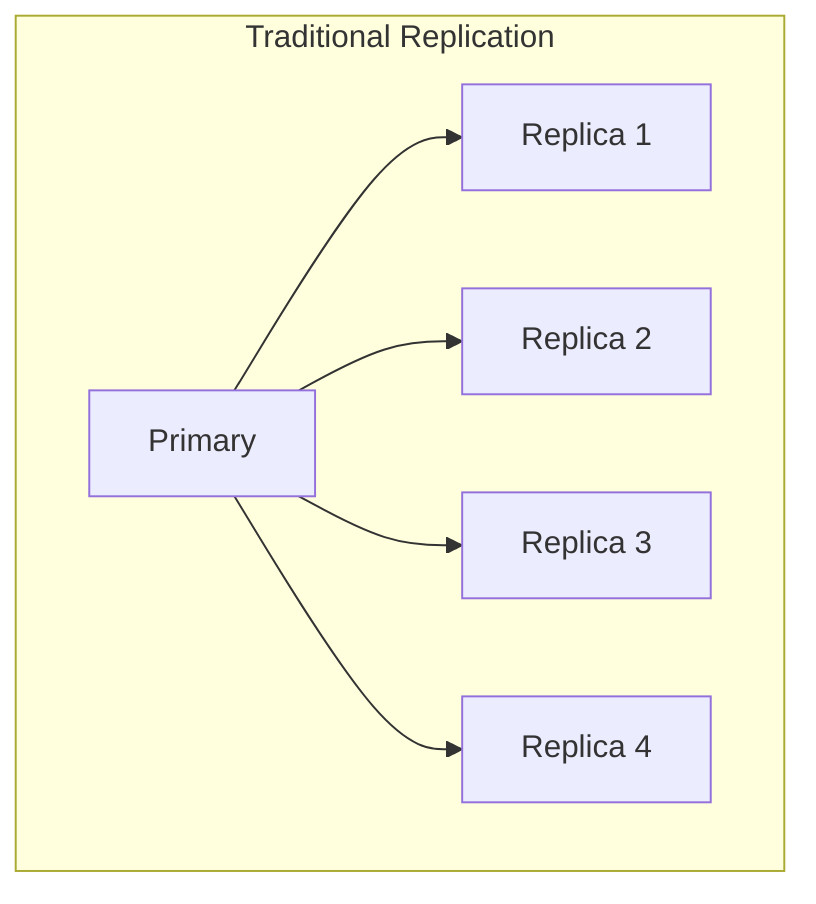
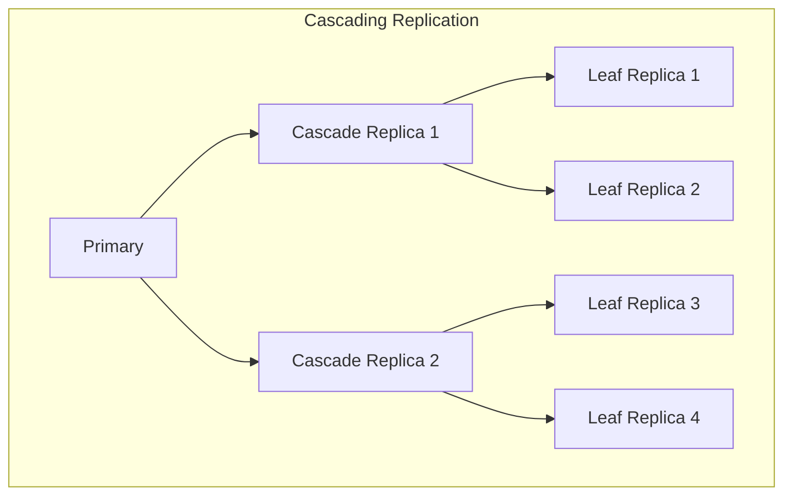
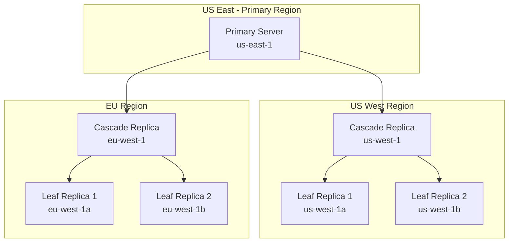
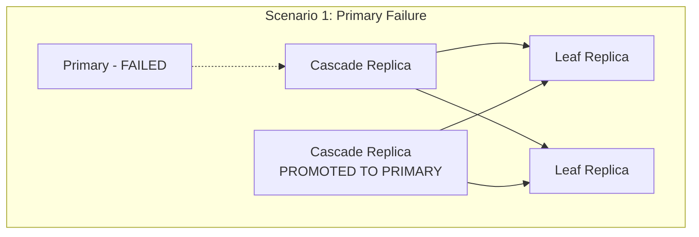
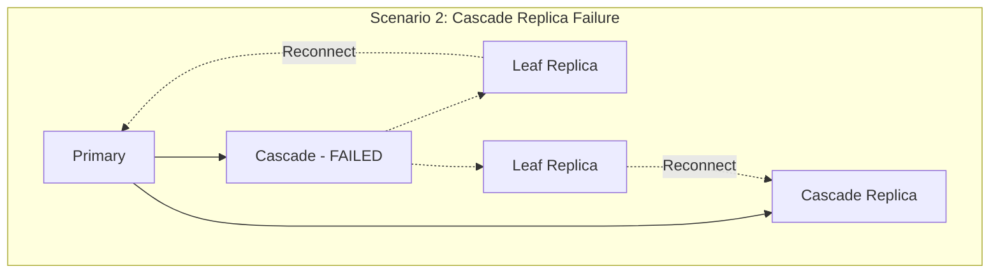
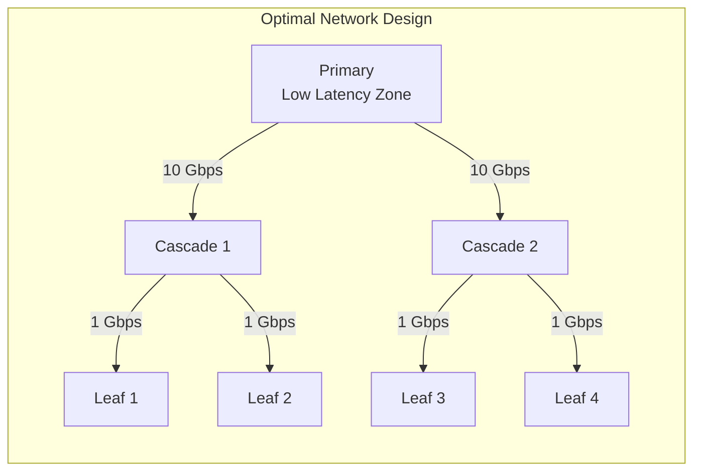

# How to Create PostgreSQL Cascading Replication

Author: [nawazdhandala](https://github.com/nawazdhandala)

Tags: PostgreSQL, Cascading Replication, High Availability, Streaming

Description: Learn to implement cascading replication for hierarchical replica topologies with reduced primary load and geographic distribution.

---

PostgreSQL streaming replication is a powerful feature that allows you to create read replicas for high availability and load distribution. Cascading replication takes this a step further by allowing replicas to serve as upstream servers for other replicas, creating a hierarchical topology that reduces load on the primary server and enables geographic distribution strategies.

## What is Cascading Replication?

In traditional streaming replication, all replicas connect directly to the primary server. With cascading replication, a standby server can act as a replication source for downstream standbys. This creates a tree-like hierarchy where WAL (Write-Ahead Log) records flow from the primary through intermediate standbys to leaf standbys.

### Traditional vs Cascading Replication





## Benefits of Cascading Replication

1. **Reduced Primary Load** - The primary server only needs to send WAL to a few cascading replicas instead of all replicas
2. **Geographic Distribution** - Place cascading replicas in different regions to reduce latency for downstream replicas
3. **Bandwidth Optimization** - WAL data is transmitted once per region rather than to each individual replica
4. **Scalability** - Easier to add new replicas without impacting primary performance
5. **Network Isolation** - Downstream replicas can be isolated in different network segments

## Architecture Design

Let us design a cascading replication topology for a multi-region deployment:



## Prerequisites

Before setting up cascading replication, ensure you have:

- PostgreSQL 9.2 or later (cascading replication was introduced in 9.2)
- Network connectivity between all servers
- Sufficient disk space for WAL files
- Synchronized system clocks (use NTP)

## Step-by-Step Implementation

### Step 1: Configure the Primary Server

First, configure the primary server to support streaming replication.

Edit `postgresql.conf` on the primary:

```ini
# Enable WAL archiving and replication
wal_level = replica
max_wal_senders = 10
max_replication_slots = 10
wal_keep_size = 1GB

# Archive settings (recommended for production)
archive_mode = on
archive_command = 'cp %p /var/lib/postgresql/archive/%f'

# Listen on all interfaces
listen_addresses = '*'

# Hot standby feedback for better WAL retention
hot_standby_feedback = on
```

Create a replication user:

```sql
-- Connect to the primary server
CREATE ROLE replicator WITH REPLICATION LOGIN PASSWORD 'secure_password_here';
```

Edit `pg_hba.conf` to allow replication connections:

```ini
# Allow replication connections from cascade replicas
host    replication     replicator      10.0.1.0/24     scram-sha-256
host    replication     replicator      10.0.2.0/24     scram-sha-256
host    replication     replicator      10.0.3.0/24     scram-sha-256
```

Create replication slots for cascade replicas:

```sql
-- Create slots for cascade replicas (not leaf replicas)
SELECT pg_create_physical_replication_slot('cascade_west_slot');
SELECT pg_create_physical_replication_slot('cascade_eu_slot');
```

Restart the primary server:

```bash
sudo systemctl restart postgresql
```

### Step 2: Set Up Cascade Replicas

Cascade replicas are special because they both receive WAL from upstream and send it downstream. They need additional configuration.

#### Create Base Backup

On each cascade replica server, create a base backup from the primary:

```bash
# Stop PostgreSQL if running
sudo systemctl stop postgresql

# Remove existing data directory
sudo rm -rf /var/lib/postgresql/16/main/*

# Create base backup using pg_basebackup
pg_basebackup -h primary.example.com \
    -U replicator \
    -D /var/lib/postgresql/16/main \
    -P -Xs -R \
    -S cascade_west_slot
```

The `-R` flag automatically creates the `standby.signal` file and configures basic replication settings.

#### Configure Cascade Replica

Edit `postgresql.conf` on the cascade replica:

```ini
# Enable hot standby for read queries
hot_standby = on

# IMPORTANT: Enable WAL sending from this standby
max_wal_senders = 10
max_replication_slots = 10

# Keep WAL for downstream replicas
wal_keep_size = 1GB

# Listen for downstream connections
listen_addresses = '*'

# Provide feedback to upstream
hot_standby_feedback = on
```

Edit `postgresql.auto.conf` (created by pg_basebackup with -R flag):

```ini
primary_conninfo = 'host=primary.example.com port=5432 user=replicator password=secure_password_here application_name=cascade_west'
primary_slot_name = 'cascade_west_slot'
```

Configure `pg_hba.conf` to allow downstream replicas:

```ini
# Allow replication from leaf replicas in the same region
host    replication     replicator      10.0.1.0/24     scram-sha-256
```

Create replication slots for leaf replicas:

```sql
-- Connect to cascade replica and create slots for leaf replicas
SELECT pg_create_physical_replication_slot('leaf_west1_slot');
SELECT pg_create_physical_replication_slot('leaf_west2_slot');
```

Start the cascade replica:

```bash
sudo systemctl start postgresql
```

### Step 3: Set Up Leaf Replicas

Leaf replicas are the endpoints of the replication chain. They connect to cascade replicas instead of the primary.

#### Create Base Backup from Cascade Replica

```bash
# Stop PostgreSQL if running
sudo systemctl stop postgresql

# Remove existing data directory
sudo rm -rf /var/lib/postgresql/16/main/*

# Create base backup from the cascade replica (not primary!)
pg_basebackup -h cascade-west.example.com \
    -U replicator \
    -D /var/lib/postgresql/16/main \
    -P -Xs -R \
    -S leaf_west1_slot
```

#### Configure Leaf Replica

Edit `postgresql.conf`:

```ini
# Enable hot standby for read queries
hot_standby = on

# Leaf replicas typically do not need to send WAL further
max_wal_senders = 0
max_replication_slots = 0

# Provide feedback to upstream cascade replica
hot_standby_feedback = on
```

The `postgresql.auto.conf` should point to the cascade replica:

```ini
primary_conninfo = 'host=cascade-west.example.com port=5432 user=replicator password=secure_password_here application_name=leaf_west1'
primary_slot_name = 'leaf_west1_slot'
```

Start the leaf replica:

```bash
sudo systemctl start postgresql
```

## Verifying the Replication Topology

### Check Replication Status on Primary

```sql
-- View all replication connections
SELECT
    client_addr,
    application_name,
    state,
    sync_state,
    sent_lsn,
    write_lsn,
    flush_lsn,
    replay_lsn,
    pg_wal_lsn_diff(sent_lsn, replay_lsn) AS replication_lag_bytes
FROM pg_stat_replication
ORDER BY application_name;
```

Expected output shows only cascade replicas:

```
 client_addr  | application_name |   state   | sync_state |   sent_lsn   | replication_lag_bytes
--------------+------------------+-----------+------------+--------------+-----------------------
 10.0.2.10    | cascade_west     | streaming | async      | 0/5000000    | 0
 10.0.3.10    | cascade_eu       | streaming | async      | 0/5000000    | 0
```

### Check Replication Status on Cascade Replica

```sql
-- View downstream replication connections
SELECT
    client_addr,
    application_name,
    state,
    sent_lsn,
    replay_lsn,
    pg_wal_lsn_diff(sent_lsn, replay_lsn) AS replication_lag_bytes
FROM pg_stat_replication;
```

Expected output shows leaf replicas:

```
 client_addr  | application_name |   state   |   sent_lsn   | replication_lag_bytes
--------------+------------------+-----------+--------------+-----------------------
 10.0.2.20    | leaf_west1       | streaming | 0/5000000    | 0
 10.0.2.21    | leaf_west2       | streaming | 0/5000000    | 0
```

### Check Replication Slot Status

```sql
-- On primary - check cascade slots
SELECT
    slot_name,
    slot_type,
    active,
    restart_lsn,
    pg_wal_lsn_diff(pg_current_wal_lsn(), restart_lsn) AS retained_bytes
FROM pg_replication_slots;
```

### Verify Recovery Status on Replicas

```sql
-- On any replica - check if in recovery mode
SELECT pg_is_in_recovery();

-- Check upstream connection info
SELECT
    status,
    conninfo,
    slot_name,
    sender_host
FROM pg_stat_wal_receiver;
```

## Monitoring Replication Lag

### Create a Monitoring Query

Run this on the primary to get a complete view of the replication topology:

```sql
-- Comprehensive replication monitoring view
WITH RECURSIVE replication_tree AS (
    -- Base case: primary server
    SELECT
        NULL::inet AS upstream_addr,
        'primary'::text AS server_role,
        NULL::text AS application_name,
        pg_current_wal_lsn() AS current_lsn,
        0 AS level

    UNION ALL

    -- Recursive case: connected replicas
    SELECT
        r.client_addr,
        'replica',
        r.application_name,
        r.sent_lsn,
        t.level + 1
    FROM pg_stat_replication r
    JOIN replication_tree t ON t.level < 2
)
SELECT
    server_role,
    application_name,
    upstream_addr,
    current_lsn,
    level AS cascade_depth
FROM replication_tree;
```

### Monitor Replication Lag Over Time

Create a monitoring table to track lag:

```sql
-- Create lag monitoring table
CREATE TABLE IF NOT EXISTS replication_lag_history (
    recorded_at TIMESTAMP WITH TIME ZONE DEFAULT NOW(),
    application_name TEXT,
    client_addr INET,
    lag_bytes BIGINT,
    lag_seconds NUMERIC
);

-- Insert current lag (run periodically)
INSERT INTO replication_lag_history (application_name, client_addr, lag_bytes, lag_seconds)
SELECT
    application_name,
    client_addr,
    pg_wal_lsn_diff(sent_lsn, replay_lsn),
    EXTRACT(EPOCH FROM (now() - pg_last_xact_replay_timestamp()))
FROM pg_stat_replication;
```

### Set Up Alerting with pg_stat_replication

```sql
-- Alert query: find replicas with lag > 100MB or > 60 seconds
SELECT
    application_name,
    client_addr,
    pg_wal_lsn_diff(sent_lsn, replay_lsn) AS lag_bytes,
    pg_size_pretty(pg_wal_lsn_diff(sent_lsn, replay_lsn)) AS lag_pretty
FROM pg_stat_replication
WHERE pg_wal_lsn_diff(sent_lsn, replay_lsn) > 100 * 1024 * 1024;
```

## Failover Considerations

Failover in cascading replication requires careful planning because the topology creates dependencies between servers.

### Failover Scenarios





### Handling Primary Failure

When the primary fails, you need to promote a cascade replica:

```bash
# On the cascade replica to be promoted
sudo -u postgres pg_ctl promote -D /var/lib/postgresql/16/main

# Or using pg_promote() function (PostgreSQL 12+)
psql -c "SELECT pg_promote();"
```

After promotion, reconfigure other cascade replicas to point to the new primary:

```sql
-- On other cascade replicas, update the primary_conninfo
ALTER SYSTEM SET primary_conninfo = 'host=new-primary.example.com port=5432 user=replicator password=secure_password_here';
SELECT pg_reload_conf();
```

### Handling Cascade Replica Failure

When a cascade replica fails, leaf replicas lose their upstream connection. You have two options:

**Option 1: Reconnect to Primary**

```sql
-- On leaf replica, point directly to primary
ALTER SYSTEM SET primary_conninfo = 'host=primary.example.com port=5432 user=replicator password=secure_password_here application_name=leaf_west1_direct';
SELECT pg_reload_conf();
```

**Option 2: Reconnect to Another Cascade Replica**

```sql
-- On leaf replica, point to another cascade replica
ALTER SYSTEM SET primary_conninfo = 'host=cascade-eu.example.com port=5432 user=replicator password=secure_password_here application_name=leaf_west1_rerouted';
SELECT pg_reload_conf();
```

### Automated Failover Script

```bash
#!/bin/bash
# failover_cascade.sh - Automated failover for cascade replica failure

FAILED_CASCADE="cascade-west.example.com"
NEW_UPSTREAM="cascade-eu.example.com"
LEAF_REPLICAS=("leaf-west1.example.com" "leaf-west2.example.com")
REPLICATOR_PASSWORD="secure_password_here"

for replica in "${LEAF_REPLICAS[@]}"; do
    echo "Reconfiguring $replica to use $NEW_UPSTREAM as upstream..."

    psql -h "$replica" -U postgres -c "
        ALTER SYSTEM SET primary_conninfo =
            'host=$NEW_UPSTREAM port=5432 user=replicator password=$REPLICATOR_PASSWORD application_name=${replica%%.*}';
        SELECT pg_reload_conf();
    "

    echo "Verifying replication status on $replica..."
    psql -h "$replica" -U postgres -c "SELECT * FROM pg_stat_wal_receiver;"
done

echo "Failover complete. All leaf replicas now connected to $NEW_UPSTREAM"
```

## Best Practices

### 1. Replication Slot Management

Always use replication slots to prevent WAL removal before replicas have consumed it:

```sql
-- Monitor slot lag to prevent disk space issues
SELECT
    slot_name,
    pg_size_pretty(pg_wal_lsn_diff(pg_current_wal_lsn(), restart_lsn)) AS slot_lag
FROM pg_replication_slots
WHERE NOT active;

-- Drop inactive slots that are too far behind
SELECT pg_drop_replication_slot('abandoned_slot_name');
```

### 2. Synchronous Replication for Cascade Replicas

For critical data, consider making cascade replicas synchronous:

```ini
# On primary postgresql.conf
synchronous_standby_names = 'FIRST 1 (cascade_west, cascade_eu)'
synchronous_commit = on
```

### 3. Connection Pooling

Use PgBouncer or similar for managing connections to leaf replicas:

```ini
# pgbouncer.ini example for read replica pool
[databases]
mydb_read = host=leaf-west1.example.com,leaf-west2.example.com port=5432 dbname=mydb

[pgbouncer]
pool_mode = transaction
max_client_conn = 1000
default_pool_size = 50
```

### 4. Backup Strategy

Implement backups at multiple levels:

```bash
# Full backup from primary (weekly)
pg_basebackup -h primary.example.com -U replicator \
    -D /backups/full/$(date +%Y%m%d) -Ft -z -P

# Incremental WAL archiving (continuous)
# Configure archive_command on all cascade replicas
archive_command = 'rsync -a %p backup-server:/archive/%f'
```

### 5. Network Considerations



- Place cascade replicas on high-bandwidth connections to the primary
- Leaf replicas can use lower bandwidth connections
- Use dedicated replication networks when possible

## Troubleshooting Common Issues

### Issue 1: Cascade Replica Not Forwarding WAL

**Symptom**: Leaf replicas show no activity, cascade replica is receiving WAL but not sending.

**Solution**: Ensure `max_wal_senders > 0` on the cascade replica:

```sql
-- Check current setting
SHOW max_wal_senders;

-- If 0, update and restart
ALTER SYSTEM SET max_wal_senders = 10;
-- Requires restart
```

### Issue 2: Replication Lag Accumulating

**Symptom**: Increasing lag on leaf replicas.

**Diagnosis**:

```sql
-- Check if cascade replica is keeping up
SELECT
    application_name,
    state,
    pg_wal_lsn_diff(pg_current_wal_lsn(), replay_lsn) AS bytes_behind
FROM pg_stat_replication;

-- Check for long-running queries blocking replay
SELECT pid, query, state, wait_event_type
FROM pg_stat_activity
WHERE backend_type = 'walreceiver';
```

### Issue 3: Slot Bloat on Cascade Replica

**Symptom**: Disk space filling up on cascade replica.

**Solution**:

```sql
-- Find bloated slots
SELECT slot_name,
    pg_size_pretty(pg_wal_lsn_diff(pg_current_wal_lsn(), restart_lsn)) AS lag
FROM pg_replication_slots;

-- If a leaf replica is permanently down, drop its slot
SELECT pg_drop_replication_slot('defunct_leaf_slot');
```

## Conclusion

Cascading replication in PostgreSQL provides a flexible and scalable approach to building distributed database topologies. By creating hierarchical replica structures, you can reduce load on your primary server, optimize cross-region bandwidth usage, and create resilient architectures that can handle various failure scenarios.

Key takeaways:

- Cascade replicas must have `max_wal_senders > 0` to forward WAL to downstream replicas
- Use replication slots at each level to prevent WAL removal
- Plan your failover strategy before you need it
- Monitor replication lag at all levels of the hierarchy
- Consider synchronous replication for cascade replicas in critical deployments

With proper planning and monitoring, cascading replication can be a powerful tool in your PostgreSQL high availability strategy.
