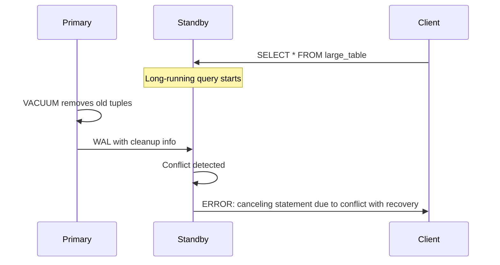
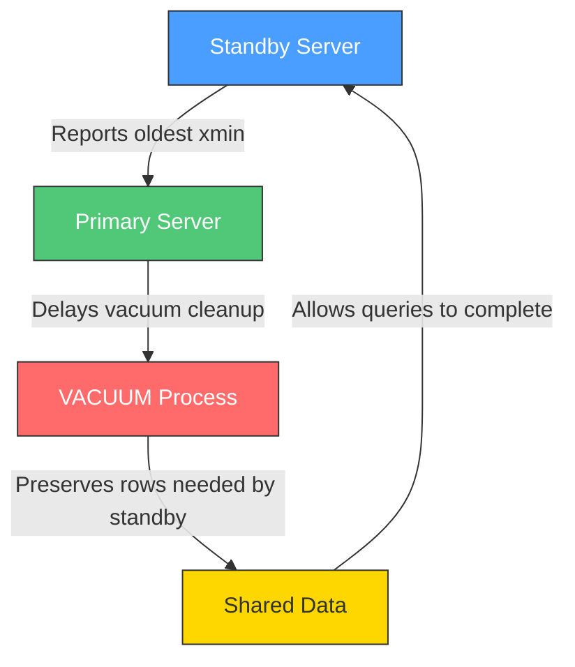
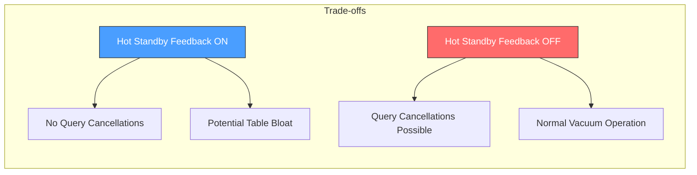
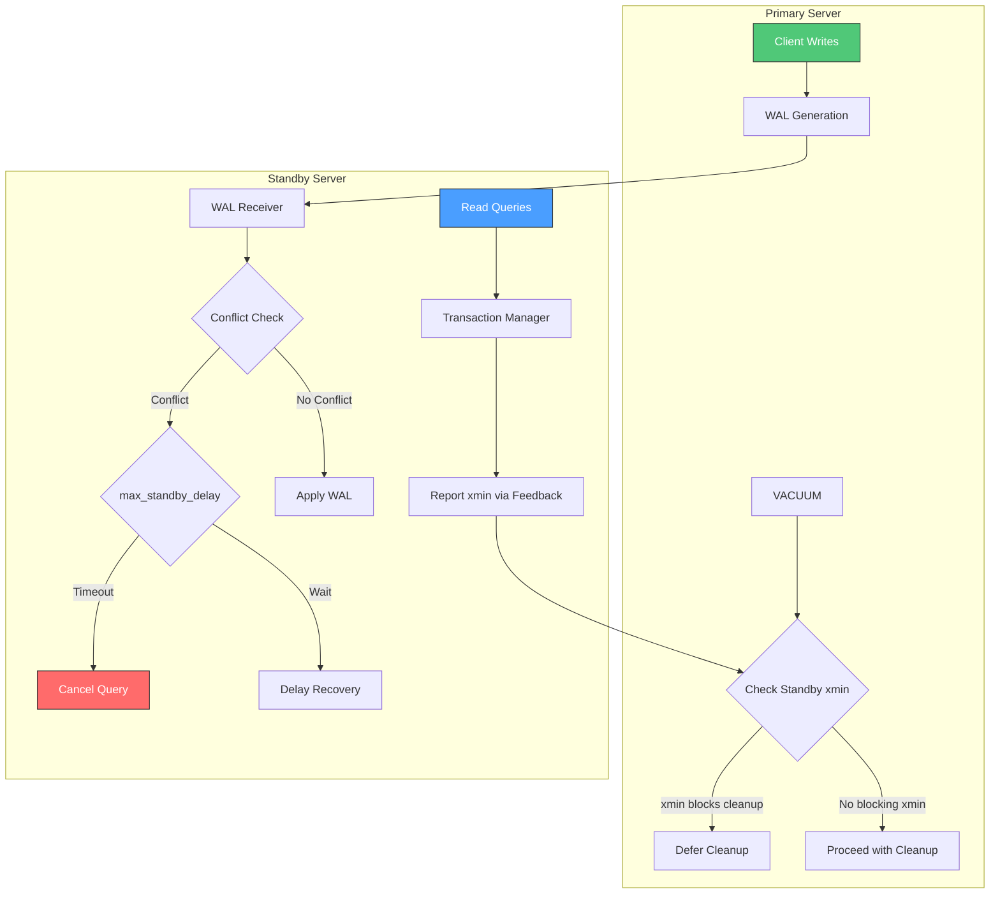

# How to Implement PostgreSQL Hot Standby Feedback

Author: [nawazdhandala](https://github.com/nawazdhandala)

Tags: PostgreSQL, Hot Standby, Replication, Feedback

Description: Learn to implement hot standby feedback for preventing query conflicts with proper configuration and monitoring for read replica performance.

---

PostgreSQL streaming replication allows you to create read replicas that can serve read queries while the primary handles writes. However, one common challenge with hot standby replicas is query cancellation due to conflicts with vacuum operations on the primary. Hot standby feedback is a mechanism that helps prevent these conflicts by informing the primary about queries running on standbys.

## Understanding the Problem

When a standby server runs queries, it may need to access data that the primary server wants to clean up through vacuum operations. Without feedback, the primary has no knowledge of what the standby needs, leading to query cancellations.



## How Hot Standby Feedback Works

Hot standby feedback creates a communication channel where the standby informs the primary about the oldest transaction it needs to preserve data for.



## Configuration on the Standby Server

### Enabling Hot Standby Feedback

The primary configuration parameter is `hot_standby_feedback`. This must be set on the standby server.

```sql
-- Check current setting
SHOW hot_standby_feedback;

-- Enable hot standby feedback (requires restart or reload)
ALTER SYSTEM SET hot_standby_feedback = on;
SELECT pg_reload_conf();
```

Alternatively, add to `postgresql.conf` on the standby:

```ini
# postgresql.conf on standby
hot_standby_feedback = on
```

### Verifying the Configuration

After enabling, verify that feedback is being sent:

```sql
-- On the primary server, check replication slots or pg_stat_replication
SELECT
    client_addr,
    state,
    sent_lsn,
    write_lsn,
    flush_lsn,
    replay_lsn,
    backend_xmin
FROM pg_stat_replication;
```

The `backend_xmin` column shows the oldest transaction ID the standby needs - this indicates feedback is working.

## Configuration on the Primary Server

### Setting Up Replication Slots

Replication slots ensure WAL segments are retained until all standbys have received them:

```sql
-- Create a physical replication slot on the primary
SELECT pg_create_physical_replication_slot('standby1_slot');

-- View existing slots
SELECT
    slot_name,
    slot_type,
    active,
    xmin,
    catalog_xmin,
    restart_lsn
FROM pg_replication_slots;
```

### Configuring the Standby to Use the Slot

In `postgresql.conf` or `recovery.conf` (PostgreSQL < 12) on the standby:

```ini
# postgresql.conf on standby (PostgreSQL 12+)
primary_conninfo = 'host=primary_host port=5432 user=replicator password=secret'
primary_slot_name = 'standby1_slot'
hot_standby_feedback = on
```

## Handling Vacuum Delays

### Understanding the Trade-off

Hot standby feedback prevents query cancellations but can cause table bloat on the primary. Long-running queries on standbys will delay vacuum cleanup.



### Configuring Vacuum Delay Settings

To mitigate bloat while using hot standby feedback:

```sql
-- On the primary, set maximum standby delay
-- This limits how long vacuum will wait for standbys
ALTER SYSTEM SET vacuum_defer_cleanup_age = 0;

-- On the standby, configure conflict handling
ALTER SYSTEM SET max_standby_streaming_delay = '30s';
ALTER SYSTEM SET max_standby_archive_delay = '30s';
```

### Understanding max_standby_streaming_delay

This parameter controls how long the standby waits before canceling conflicting queries:

```ini
# postgresql.conf on standby

# Wait up to 30 seconds before canceling queries
max_standby_streaming_delay = 30s

# Set to -1 to wait indefinitely (use with caution)
# max_standby_streaming_delay = -1
```

## Practical Implementation Example

### Step-by-Step Setup

Here is a complete example of setting up hot standby feedback:

**Step 1: Configure the Primary**

```sql
-- Create replication user
CREATE USER replicator WITH REPLICATION ENCRYPTED PASSWORD 'secure_password';

-- Create replication slot
SELECT pg_create_physical_replication_slot('replica1');

-- Verify slot creation
SELECT * FROM pg_replication_slots;
```

**Step 2: Configure pg_hba.conf on Primary**

```ini
# pg_hba.conf
# Allow replication connections from standby
host    replication     replicator      standby_ip/32       scram-sha-256
```

**Step 3: Configure the Standby**

```ini
# postgresql.conf on standby
hot_standby = on
hot_standby_feedback = on
primary_conninfo = 'host=primary_host port=5432 user=replicator password=secure_password application_name=replica1'
primary_slot_name = 'replica1'
max_standby_streaming_delay = 30s
```

**Step 4: Create standby.signal File**

```bash
# On the standby server (PostgreSQL 12+)
touch $PGDATA/standby.signal
```

**Step 5: Start the Standby and Verify**

```sql
-- On the standby
SELECT pg_is_in_recovery();
-- Should return true

-- On the primary, verify feedback is working
SELECT
    application_name,
    client_addr,
    backend_xmin,
    state
FROM pg_stat_replication
WHERE application_name = 'replica1';
```

## Monitoring Hot Standby Feedback

### Creating a Monitoring Query

```sql
-- Comprehensive replication monitoring query
SELECT
    r.application_name,
    r.client_addr,
    r.state,
    r.backend_xmin,
    pg_wal_lsn_diff(pg_current_wal_lsn(), r.flush_lsn) AS replication_lag_bytes,
    CASE
        WHEN r.backend_xmin IS NOT NULL THEN 'Feedback Active'
        ELSE 'No Feedback'
    END AS feedback_status,
    age(r.backend_xmin) AS xmin_age
FROM pg_stat_replication r;
```

### Monitoring Table Bloat

Since hot standby feedback can cause bloat, monitor your tables:

```sql
-- Check for bloat indicators
SELECT
    schemaname,
    relname,
    n_live_tup,
    n_dead_tup,
    ROUND(100.0 * n_dead_tup / NULLIF(n_live_tup + n_dead_tup, 0), 2) AS dead_tuple_percent,
    last_vacuum,
    last_autovacuum
FROM pg_stat_user_tables
WHERE n_dead_tup > 1000
ORDER BY n_dead_tup DESC;
```

### Setting Up Alerts

Create a function to check for problematic replication states:

```sql
-- Function to check replication health
CREATE OR REPLACE FUNCTION check_replication_health()
RETURNS TABLE (
    replica_name TEXT,
    issue TEXT,
    severity TEXT
) AS $$
BEGIN
    -- Check for standbys without feedback
    RETURN QUERY
    SELECT
        r.application_name::TEXT,
        'Hot standby feedback not active'::TEXT,
        'WARNING'::TEXT
    FROM pg_stat_replication r
    WHERE r.backend_xmin IS NULL;

    -- Check for old xmin values (potential bloat)
    RETURN QUERY
    SELECT
        r.application_name::TEXT,
        format('Old xmin age: %s transactions', age(r.backend_xmin))::TEXT,
        CASE
            WHEN age(r.backend_xmin) > 1000000 THEN 'CRITICAL'
            WHEN age(r.backend_xmin) > 100000 THEN 'WARNING'
            ELSE 'INFO'
        END::TEXT
    FROM pg_stat_replication r
    WHERE r.backend_xmin IS NOT NULL
    AND age(r.backend_xmin) > 100000;
END;
$$ LANGUAGE plpgsql;

-- Use the function
SELECT * FROM check_replication_health();
```

## Conflict Resolution Architecture



## Best Practices

### 1. Query Timeout on Standbys

Set statement timeouts on standbys to prevent indefinite feedback holds:

```sql
-- Set a default statement timeout for standby connections
ALTER SYSTEM SET statement_timeout = '5min';
SELECT pg_reload_conf();

-- Or per-session for specific applications
SET statement_timeout = '2min';
```

### 2. Application-Level Connection Management

Configure your application to handle replica timeouts gracefully:

```python
import psycopg2
from psycopg2 import OperationalError

def query_replica(sql, params=None, timeout_seconds=30):
    """Execute a query on the replica with timeout handling."""
    conn = None
    try:
        conn = psycopg2.connect(
            host="replica_host",
            database="mydb",
            user="app_user",
            password="password",
            options=f"-c statement_timeout={timeout_seconds * 1000}"
        )
        with conn.cursor() as cur:
            cur.execute(sql, params)
            return cur.fetchall()
    except OperationalError as e:
        if "conflict with recovery" in str(e):
            # Retry on primary or handle gracefully
            print("Query canceled due to recovery conflict")
            return None
        raise
    finally:
        if conn:
            conn.close()
```

### 3. Monitoring Dashboard Query

```sql
-- Complete monitoring view
CREATE VIEW replication_monitoring AS
SELECT
    r.application_name AS replica,
    r.client_addr AS ip_address,
    r.state,
    CASE WHEN r.backend_xmin IS NOT NULL THEN 'Active' ELSE 'Inactive' END AS feedback,
    age(r.backend_xmin) AS xmin_age,
    pg_size_pretty(pg_wal_lsn_diff(pg_current_wal_lsn(), r.sent_lsn)) AS send_lag,
    pg_size_pretty(pg_wal_lsn_diff(pg_current_wal_lsn(), r.flush_lsn)) AS flush_lag,
    pg_size_pretty(pg_wal_lsn_diff(pg_current_wal_lsn(), r.replay_lsn)) AS replay_lag,
    r.sync_state
FROM pg_stat_replication r;

-- Query the view
SELECT * FROM replication_monitoring;
```

## Troubleshooting Common Issues

### Issue 1: Feedback Not Appearing

If `backend_xmin` is NULL in `pg_stat_replication`:

```sql
-- On standby, verify setting
SHOW hot_standby_feedback;

-- Check if standby is running queries
SELECT count(*) FROM pg_stat_activity WHERE state = 'active';

-- Ensure WAL receiver is connected
SELECT * FROM pg_stat_wal_receiver;
```

### Issue 2: Excessive Table Bloat

If you notice growing bloat despite regular vacuums:

```sql
-- Identify which replica is causing the issue
SELECT
    application_name,
    backend_xmin,
    age(backend_xmin) AS xmin_age
FROM pg_stat_replication
ORDER BY age(backend_xmin) DESC NULLS LAST;

-- Consider reducing max_standby_streaming_delay on problematic standbys
```

### Issue 3: Replication Slot Bloat

If WAL accumulates due to inactive slots:

```sql
-- Check slot status
SELECT
    slot_name,
    active,
    pg_size_pretty(pg_wal_lsn_diff(pg_current_wal_lsn(), restart_lsn)) AS retained_wal
FROM pg_replication_slots;

-- Drop inactive slots if necessary
SELECT pg_drop_replication_slot('unused_slot');
```

## Conclusion

Hot standby feedback is a powerful feature for maintaining query stability on read replicas. The key points to remember are:

1. Enable `hot_standby_feedback = on` on standby servers to prevent query cancellations
2. Use replication slots to ensure WAL retention for standbys
3. Configure `max_standby_streaming_delay` to balance between query completion and recovery speed
4. Monitor `backend_xmin` age to prevent excessive table bloat
5. Set appropriate statement timeouts to avoid indefinitely blocking vacuum operations

By properly configuring and monitoring hot standby feedback, you can build a reliable read replica infrastructure that serves queries without unexpected cancellations while maintaining healthy table sizes on the primary.

## Further Reading

- [PostgreSQL Documentation: Hot Standby](https://www.postgresql.org/docs/current/hot-standby.html)
- [PostgreSQL Documentation: Replication Slots](https://www.postgresql.org/docs/current/warm-standby.html#STREAMING-REPLICATION-SLOTS)
- [PostgreSQL Documentation: WAL Configuration](https://www.postgresql.org/docs/current/wal-configuration.html)
