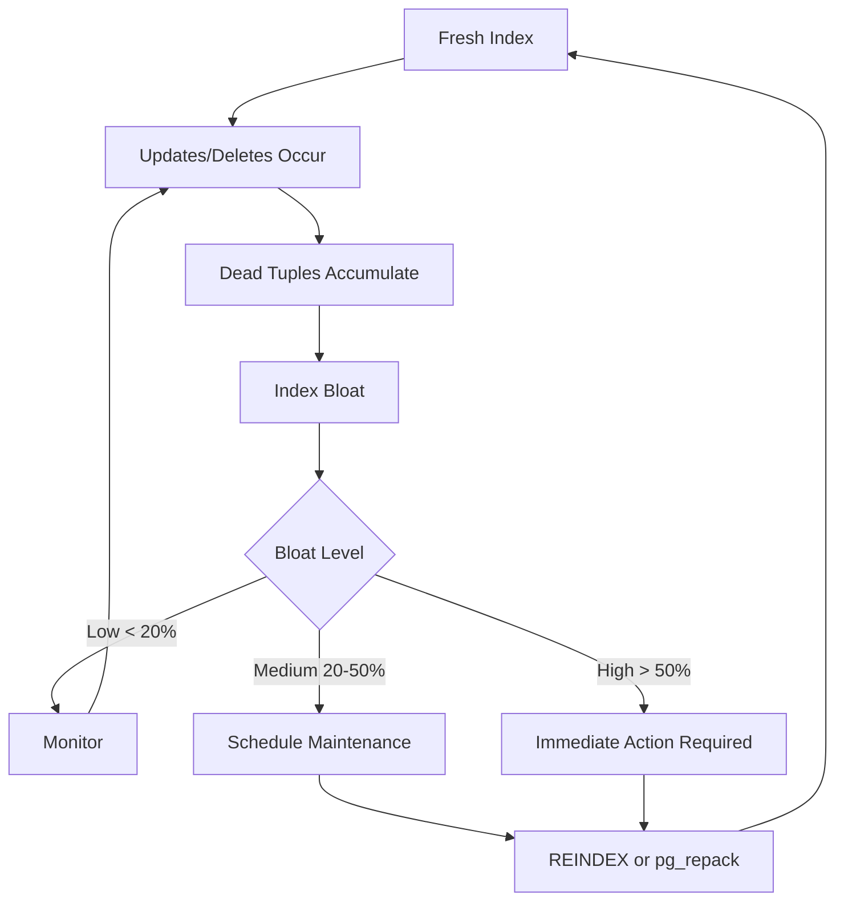
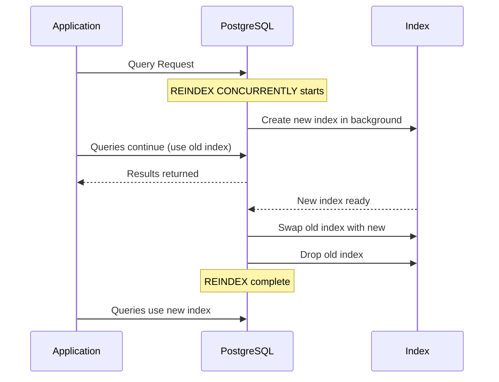
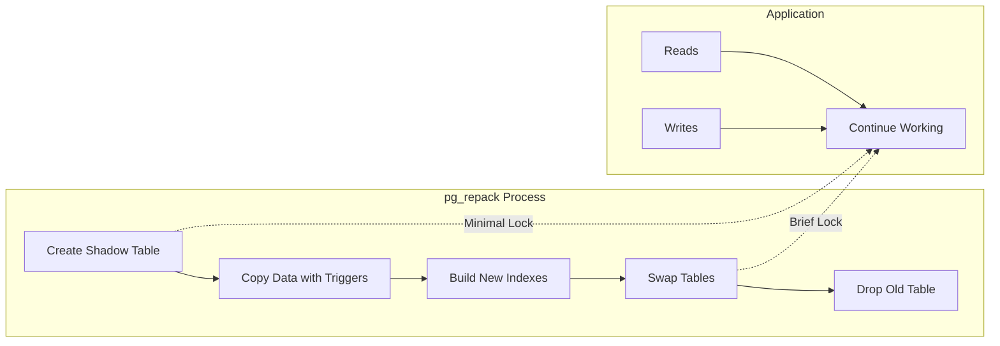
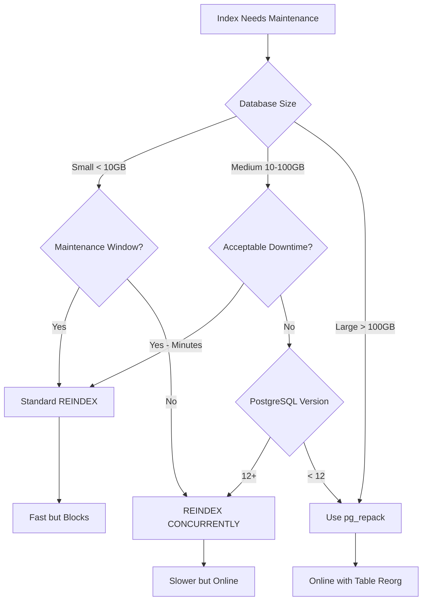

# How to Build PostgreSQL Index Maintenance Strategy

Author: [nawazdhandala](https://github.com/nawazdhandala)

Tags: PostgreSQL, Index Maintenance, Performance, REINDEX

Description: Learn to implement index maintenance strategies with REINDEX, pg_repack, and monitoring for optimal query performance and storage efficiency.

---

PostgreSQL indexes are essential for query performance, but they degrade over time due to updates, deletes, and inserts. This phenomenon, known as index bloat, can significantly impact your database performance. In this guide, we will explore how to build a comprehensive index maintenance strategy that keeps your PostgreSQL database running efficiently.

## Understanding Index Bloat

Index bloat occurs when dead tuples accumulate in your indexes. When rows are updated or deleted, PostgreSQL does not immediately remove the old index entries. Instead, they are marked as dead and occupy space until cleaned up. Over time, this leads to:

- Increased storage consumption
- Slower query performance
- Higher I/O operations
- Inefficient buffer cache usage



## Detecting Index Bloat

Before implementing maintenance strategies, you need to measure bloat levels. Here is a query to detect index bloat in your database:

```sql
-- Index bloat detection query
WITH index_stats AS (
    SELECT
        schemaname,
        tablename,
        indexname,
        pg_relation_size(indexrelid) AS index_size,
        idx_scan AS index_scans,
        idx_tup_read AS tuples_read,
        idx_tup_fetch AS tuples_fetched
    FROM pg_stat_user_indexes
    JOIN pg_index USING (indexrelid)
    WHERE NOT indisunique
),
bloat_estimate AS (
    SELECT
        schemaname,
        tablename,
        indexname,
        index_size,
        index_scans,
        pg_size_pretty(index_size) AS index_size_pretty,
        CASE
            WHEN index_scans = 0 THEN 'Unused Index'
            ELSE 'Active Index'
        END AS usage_status
    FROM index_stats
)
SELECT
    schemaname || '.' || tablename AS table_name,
    indexname,
    index_size_pretty,
    index_scans,
    usage_status
FROM bloat_estimate
ORDER BY index_size DESC
LIMIT 20;
```

This query identifies the largest indexes and their usage patterns. Unused indexes are prime candidates for removal rather than maintenance.

### Using pgstattuple Extension

For more accurate bloat measurements, enable the `pgstattuple` extension:

```sql
-- Enable the extension
CREATE EXTENSION IF NOT EXISTS pgstattuple;

-- Check specific index bloat
SELECT
    indexrelname,
    pg_size_pretty(pg_relation_size(indexrelid)) AS index_size,
    idx_scan AS scans,
    round(100.0 * avg_leaf_density, 2) AS leaf_density_pct,
    round(100.0 - avg_leaf_density, 2) AS bloat_pct
FROM pg_stat_user_indexes
JOIN pgstatindex(indexrelid::regclass::text) ON true
WHERE schemaname = 'public'
ORDER BY pg_relation_size(indexrelid) DESC;
```

The `avg_leaf_density` metric shows how efficiently space is used in the index. A value below 70% typically indicates significant bloat.

## REINDEX Strategies

PostgreSQL provides several approaches to rebuild indexes. Each has different trade-offs between downtime and resource usage.

### Standard REINDEX

The basic REINDEX command rebuilds an index from scratch:

```sql
-- Reindex a single index
REINDEX INDEX idx_users_email;

-- Reindex all indexes on a table
REINDEX TABLE users;

-- Reindex all indexes in a schema
REINDEX SCHEMA public;

-- Reindex entire database
REINDEX DATABASE myapp;
```

**Important:** Standard REINDEX acquires an exclusive lock on the table, blocking all reads and writes until complete.

### Concurrent REINDEX (PostgreSQL 12+)

For production systems, use `REINDEX CONCURRENTLY` to minimize downtime:

```sql
-- Concurrent reindex of a single index
REINDEX INDEX CONCURRENTLY idx_users_email;

-- Concurrent reindex of all indexes on a table
REINDEX TABLE CONCURRENTLY users;

-- Concurrent reindex of a schema
REINDEX SCHEMA CONCURRENTLY public;
```



**Advantages of concurrent reindex:**
- No exclusive table lock
- Queries continue to run
- Minimal application impact

**Considerations:**
- Takes longer than standard REINDEX
- Requires more disk space temporarily
- Cannot run inside a transaction block

## Using pg_repack for Zero-Downtime Maintenance

pg_repack is a powerful extension that reorganizes tables and indexes with minimal locking. It is particularly useful for large tables where even concurrent reindex might be too slow.

### Installing pg_repack

```bash
# On Debian/Ubuntu
sudo apt-get install postgresql-16-repack

# On RHEL/CentOS
sudo yum install pg_repack_16

# Create extension in database
psql -d myapp -c "CREATE EXTENSION pg_repack;"
```

### Using pg_repack

```bash
# Repack a specific table and its indexes
pg_repack -d myapp -t users

# Repack only indexes of a table
pg_repack -d myapp -t users --only-indexes

# Repack a specific index
pg_repack -d myapp -i idx_users_email

# Repack all tables in a schema
pg_repack -d myapp -s public

# Run with parallel jobs for faster processing
pg_repack -d myapp -t large_table -j 4
```



### pg_repack vs REINDEX Comparison

| Feature | REINDEX | REINDEX CONCURRENTLY | pg_repack |
|---------|---------|---------------------|-----------|
| Lock Type | Exclusive | Share Update Exclusive | Brief Access Exclusive |
| Downtime | Yes | Minimal | Minimal |
| Disk Space | 1x index size | 2x index size | 2x table + indexes |
| Speed | Fast | Medium | Medium |
| Table Reorganization | No | No | Yes |

## Building an Automated Maintenance Schedule

A well-designed maintenance strategy runs automatically based on bloat thresholds and system load.

### Monitoring Function

Create a function to identify indexes needing maintenance:

```sql
CREATE OR REPLACE FUNCTION get_bloated_indexes(
    bloat_threshold numeric DEFAULT 30.0,
    min_size_mb integer DEFAULT 10
)
RETURNS TABLE (
    schema_name text,
    table_name text,
    index_name text,
    index_size text,
    bloat_percent numeric,
    recommendation text
) AS $$
BEGIN
    RETURN QUERY
    WITH index_bloat AS (
        SELECT
            schemaname::text,
            tablename::text,
            indexrelname::text,
            pg_relation_size(indexrelid) AS idx_size,
            CASE
                WHEN idx_scan > 0 THEN
                    round((100.0 - avg_leaf_density)::numeric, 2)
                ELSE
                    0
            END AS bloat_pct
        FROM pg_stat_user_indexes psi
        JOIN pgstatindex(psi.indexrelid::regclass::text) ON true
        WHERE pg_relation_size(indexrelid) > min_size_mb * 1024 * 1024
    )
    SELECT
        ib.schemaname,
        ib.tablename,
        ib.indexrelname,
        pg_size_pretty(ib.idx_size),
        ib.bloat_pct,
        CASE
            WHEN ib.bloat_pct > 50 THEN 'Immediate reindex recommended'
            WHEN ib.bloat_pct > bloat_threshold THEN 'Schedule reindex'
            ELSE 'Monitor'
        END
    FROM index_bloat ib
    WHERE ib.bloat_pct > bloat_threshold
    ORDER BY ib.bloat_pct DESC;
END;
$$ LANGUAGE plpgsql;

-- Usage
SELECT * FROM get_bloated_indexes(25.0, 50);
```

### Automated Maintenance Script

Create a shell script for scheduled maintenance:

```bash
#!/bin/bash
# postgresql_index_maintenance.sh
# Automated index maintenance script

set -e

# Configuration
DB_NAME="myapp"
DB_USER="postgres"
BLOAT_THRESHOLD=30
MIN_SIZE_MB=10
LOG_FILE="/var/log/pg_index_maintenance.log"
LOCK_FILE="/tmp/pg_index_maintenance.lock"

# Logging function
log() {
    echo "[$(date '+%Y-%m-%d %H:%M:%S')] $1" | tee -a "$LOG_FILE"
}

# Check for existing lock
if [ -f "$LOCK_FILE" ]; then
    log "ERROR: Maintenance already running. Exiting."
    exit 1
fi

trap "rm -f $LOCK_FILE" EXIT
touch "$LOCK_FILE"

log "Starting index maintenance for database: $DB_NAME"

# Get list of bloated indexes
BLOATED_INDEXES=$(psql -U "$DB_USER" -d "$DB_NAME" -t -A -F'|' <<EOF
SELECT indexrelname, schemaname, tablename
FROM pg_stat_user_indexes psi
JOIN pgstatindex(psi.indexrelid::regclass::text) ON true
WHERE pg_relation_size(indexrelid) > ${MIN_SIZE_MB} * 1024 * 1024
  AND (100.0 - avg_leaf_density) > ${BLOAT_THRESHOLD}
ORDER BY pg_relation_size(indexrelid) DESC
LIMIT 10;
EOF
)

if [ -z "$BLOATED_INDEXES" ]; then
    log "No indexes require maintenance"
    exit 0
fi

# Process each bloated index
echo "$BLOATED_INDEXES" | while IFS='|' read -r index_name schema_name table_name; do
    log "Reindexing: $schema_name.$index_name"

    # Use REINDEX CONCURRENTLY to minimize downtime
    if psql -U "$DB_USER" -d "$DB_NAME" -c \
        "REINDEX INDEX CONCURRENTLY ${schema_name}.${index_name};" 2>&1; then
        log "Successfully reindexed: $index_name"
    else
        log "ERROR: Failed to reindex: $index_name"
    fi

    # Small delay between indexes to reduce load
    sleep 5
done

log "Index maintenance completed"
```

### Scheduling with Cron

Add the maintenance script to cron for regular execution:

```bash
# Edit crontab
crontab -e

# Run maintenance every Sunday at 2 AM
0 2 * * 0 /usr/local/bin/postgresql_index_maintenance.sh

# For high-write databases, run more frequently
# Every day at 3 AM
0 3 * * * /usr/local/bin/postgresql_index_maintenance.sh
```

## Maintenance Strategy Decision Framework

Use this decision framework to choose the right approach for your situation:



## Best Practices Summary

1. **Monitor Regularly**: Set up automated bloat detection and alerting
2. **Define Thresholds**: Establish bloat percentage thresholds for action (typically 20-30%)
3. **Use Concurrent Operations**: Always prefer REINDEX CONCURRENTLY in production
4. **Schedule During Low Traffic**: Even concurrent operations consume resources
5. **Test First**: Always test maintenance procedures in staging environments
6. **Track Metrics**: Log maintenance operations and measure improvement
7. **Remove Unused Indexes**: Delete indexes with zero scans rather than maintaining them
8. **Consider pg_repack**: For large tables or when table reorganization is also needed

## Monitoring Queries Dashboard

Create these views for ongoing monitoring:

```sql
-- View for index health overview
CREATE OR REPLACE VIEW index_health_dashboard AS
SELECT
    schemaname || '.' || tablename AS table_name,
    indexrelname AS index_name,
    pg_size_pretty(pg_relation_size(indexrelid)) AS size,
    idx_scan AS scans_total,
    idx_tup_read AS tuples_read,
    idx_tup_fetch AS tuples_fetched,
    CASE
        WHEN idx_scan = 0 THEN 'UNUSED'
        WHEN idx_scan < 100 THEN 'LOW_USAGE'
        ELSE 'ACTIVE'
    END AS usage_category
FROM pg_stat_user_indexes
ORDER BY pg_relation_size(indexrelid) DESC;

-- View for maintenance candidates
CREATE OR REPLACE VIEW maintenance_candidates AS
SELECT
    schemaname || '.' || tablename AS table_name,
    indexrelname AS index_name,
    pg_size_pretty(pg_relation_size(indexrelid)) AS current_size,
    idx_scan AS total_scans,
    round(100.0 - avg_leaf_density, 2) AS estimated_bloat_pct,
    CASE
        WHEN idx_scan = 0 THEN 'Consider dropping'
        WHEN (100.0 - avg_leaf_density) > 50 THEN 'Reindex urgently'
        WHEN (100.0 - avg_leaf_density) > 30 THEN 'Schedule reindex'
        ELSE 'Healthy'
    END AS recommendation
FROM pg_stat_user_indexes psi
JOIN pgstatindex(psi.indexrelid::regclass::text) ON true
WHERE pg_relation_size(indexrelid) > 1024 * 1024  -- > 1MB
ORDER BY (100.0 - avg_leaf_density) DESC;
```

## Conclusion

A robust PostgreSQL index maintenance strategy combines automated monitoring, appropriate maintenance methods, and regular scheduling. By detecting bloat early and using the right tools for your environment, you can maintain optimal query performance without significant downtime.

Key takeaways:
- Use `pgstattuple` extension for accurate bloat measurement
- Prefer `REINDEX CONCURRENTLY` for production databases
- Consider `pg_repack` for large tables or when you need table reorganization
- Automate monitoring and maintenance scheduling
- Always test your maintenance procedures in non-production environments first

With these strategies in place, your PostgreSQL indexes will remain efficient, your queries will stay fast, and your storage costs will be optimized.
