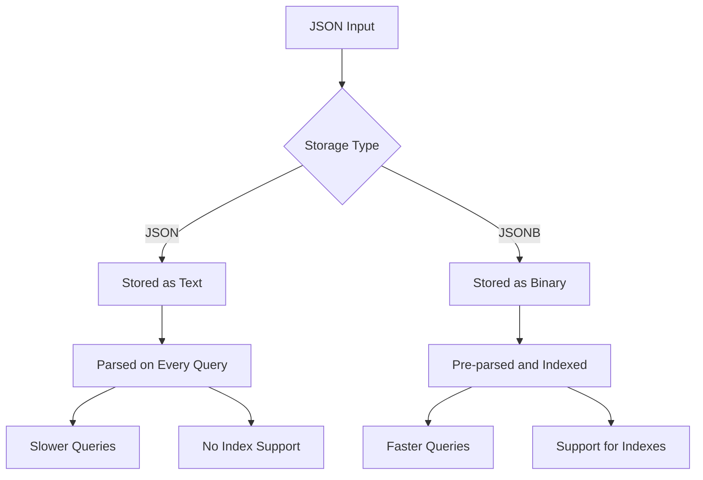
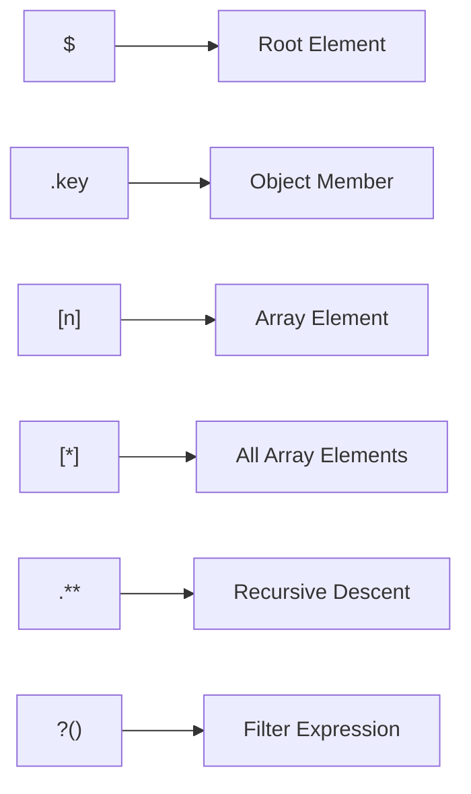
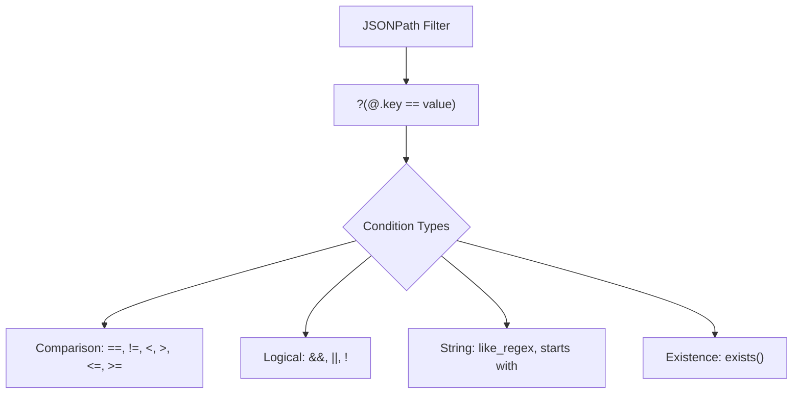
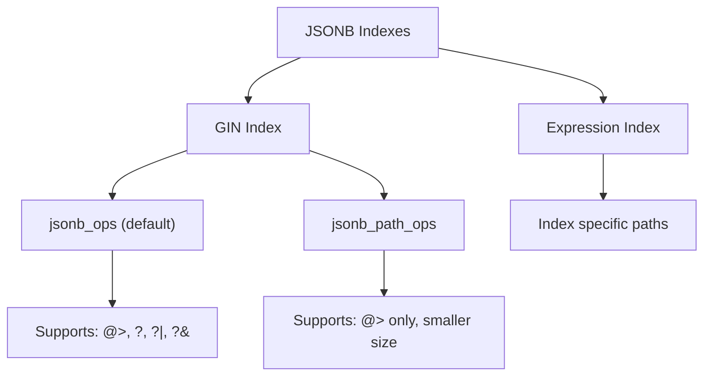

# How to Implement PostgreSQL JSONB Path Queries

Author: [nawazdhandala](https://github.com/nawazdhandala)

Tags: PostgreSQL, JSONB, JSON, Database

Description: Learn how to query JSONB data efficiently with SQL/JSON path expressions.

---

## Introduction

PostgreSQL's JSONB data type provides a powerful way to store and query JSON documents directly in your database. One of the most powerful features for working with JSONB is the SQL/JSON path language, introduced in PostgreSQL 12. This guide walks you through implementing efficient JSONB path queries, from basic syntax to advanced optimization techniques.

## Understanding JSONB vs JSON

Before diving into path queries, it is important to understand why JSONB is preferred over JSON for querying.



| Feature | JSON | JSONB |
|---------|------|-------|
| Storage | Text | Binary |
| Duplicate Keys | Preserved | Last value wins |
| Key Order | Preserved | Not guaranteed |
| Indexing | Not supported | GIN, GiST supported |
| Query Speed | Slower | Faster |

## Setting Up Sample Data

Let us create a sample table to work with throughout this tutorial.

```sql
-- Create a products table with JSONB metadata
CREATE TABLE products (
    id SERIAL PRIMARY KEY,
    name VARCHAR(255) NOT NULL,
    metadata JSONB NOT NULL
);

-- Insert sample product data with nested JSON structures
INSERT INTO products (name, metadata) VALUES
(
    'Laptop Pro X1',
    '{
        "category": "electronics",
        "price": 1299.99,
        "specs": {
            "cpu": "Intel i7",
            "ram": 16,
            "storage": {"type": "SSD", "capacity": 512}
        },
        "tags": ["portable", "business", "high-performance"],
        "inventory": [
            {"warehouse": "NYC", "quantity": 50},
            {"warehouse": "LA", "quantity": 30}
        ],
        "reviews": [
            {"rating": 5, "comment": "Excellent laptop!"},
            {"rating": 4, "comment": "Great value"}
        ]
    }'
),
(
    'Wireless Mouse',
    '{
        "category": "accessories",
        "price": 49.99,
        "specs": {
            "connectivity": "Bluetooth",
            "battery": "AA",
            "dpi": 1600
        },
        "tags": ["wireless", "ergonomic"],
        "inventory": [
            {"warehouse": "NYC", "quantity": 200},
            {"warehouse": "CHI", "quantity": 150}
        ],
        "reviews": [
            {"rating": 4, "comment": "Works well"},
            {"rating": 3, "comment": "Battery drains quickly"}
        ]
    }'
),
(
    'USB-C Hub',
    '{
        "category": "accessories",
        "price": 79.99,
        "specs": {
            "ports": 7,
            "power_delivery": true,
            "supported_devices": ["laptop", "tablet", "phone"]
        },
        "tags": ["connectivity", "portable"],
        "inventory": [
            {"warehouse": "LA", "quantity": 75}
        ],
        "reviews": [
            {"rating": 5, "comment": "Must have accessory"}
        ]
    }'
);
```

## JSONPath Syntax Fundamentals

The SQL/JSON path language uses a syntax similar to JavaScript property access. Here are the core elements.



### Basic Path Navigation

```sql
-- Access the root object
-- The $ symbol represents the entire JSON document
SELECT metadata FROM products WHERE id = 1;

-- Access a top-level key using arrow operator
-- Returns the value as JSONB
SELECT metadata -> 'category' AS category FROM products;

-- Access a top-level key and return as text
-- The ->> operator extracts the value as plain text
SELECT metadata ->> 'category' AS category FROM products;

-- Access nested keys using chained operators
-- Navigate through multiple levels of nesting
SELECT
    metadata -> 'specs' -> 'cpu' AS cpu_jsonb,
    metadata -> 'specs' ->> 'cpu' AS cpu_text
FROM products
WHERE name = 'Laptop Pro X1';

-- Access array elements by index (0-based)
-- Get the first tag from the tags array
SELECT metadata -> 'tags' -> 0 AS first_tag FROM products;

-- Access nested object within array
-- Get quantity from first inventory location
SELECT metadata -> 'inventory' -> 0 -> 'quantity' AS first_warehouse_qty
FROM products;
```

### Using jsonb_path_query Functions

PostgreSQL provides several functions for path queries.

```sql
-- jsonb_path_query: Returns all matching elements as a set
-- Find all warehouse names across all products
SELECT
    name,
    jsonb_path_query(metadata, '$.inventory[*].warehouse') AS warehouse
FROM products;

-- jsonb_path_query_array: Returns matches as a JSONB array
-- Get all tags as a single array
SELECT
    name,
    jsonb_path_query_array(metadata, '$.tags[*]') AS all_tags
FROM products;

-- jsonb_path_query_first: Returns only the first match
-- Useful when you only need one result
SELECT
    name,
    jsonb_path_query_first(metadata, '$.reviews[*].rating') AS first_rating
FROM products;

-- jsonb_path_exists: Check if a path exists (returns boolean)
-- Find products that have power_delivery spec
SELECT name
FROM products
WHERE jsonb_path_exists(metadata, '$.specs.power_delivery');
```

## Filter Expressions

Filter expressions allow you to query based on conditions within the JSON structure.



### Comparison Filters

```sql
-- Find products with price greater than 100
-- The @ symbol refers to the current element being evaluated
SELECT name, metadata ->> 'price' AS price
FROM products
WHERE jsonb_path_exists(
    metadata,
    '$.price ? (@ > 100)'
);

-- Find inventory locations with quantity over 100
-- Returns each matching inventory object
SELECT
    name,
    jsonb_path_query(
        metadata,
        '$.inventory[*] ? (@.quantity > 100)'
    ) AS high_stock_locations
FROM products;

-- Find products with reviews rated 5 stars
-- Filter within nested array
SELECT
    name,
    jsonb_path_query(
        metadata,
        '$.reviews[*] ? (@.rating == 5)'
    ) AS five_star_reviews
FROM products;

-- Combine multiple conditions with logical AND
-- Find inventory in NYC with quantity over 40
SELECT
    name,
    jsonb_path_query(
        metadata,
        '$.inventory[*] ? (@.warehouse == "NYC" && @.quantity > 40)'
    ) AS nyc_high_stock
FROM products;
```

### String Pattern Matching

```sql
-- Find products with tags starting with "port"
-- Uses the starts with operator
SELECT name
FROM products
WHERE jsonb_path_exists(
    metadata,
    '$.tags[*] ? (@ starts with "port")'
);

-- Use regular expressions for complex pattern matching
-- Find reviews mentioning specific words
SELECT
    name,
    jsonb_path_query(
        metadata,
        '$.reviews[*] ? (@.comment like_regex "great|excellent" flag "i")'
    ) AS positive_reviews
FROM products;

-- The flag "i" makes the regex case-insensitive
-- Other flags: "s" (dot matches newline), "m" (multiline mode)
```

## Containment Queries

Containment operators check if one JSONB value contains another.

```mermaid
graph TD
    A["JSONB Containment"] --> B["@> Contains"]
    A --> C["<@ Contained By"]
    B --> D["Left contains right"]
    C --> E["Left is contained by right"]

    F["Example: metadata @> '{\"category\": \"electronics\"}'"]
    F --> G["Checks if metadata contains the specified key-value pair"]
```

### Using Containment Operators

```sql
-- Find products in the electronics category
-- The @> operator checks if left side contains right side
SELECT name
FROM products
WHERE metadata @> '{"category": "electronics"}';

-- Find products with specific tag in array
-- Containment works with arrays too
SELECT name
FROM products
WHERE metadata @> '{"tags": ["portable"]}';

-- Check for nested value containment
-- Find products with SSD storage type
SELECT name
FROM products
WHERE metadata @> '{"specs": {"storage": {"type": "SSD"}}}';

-- Find products with specific inventory location
-- Match objects within arrays
SELECT name
FROM products
WHERE metadata @> '{"inventory": [{"warehouse": "NYC"}]}';

-- Reverse containment: check if value is contained by another
-- Useful for checking if a value matches one of several options
SELECT name
FROM products
WHERE metadata -> 'category' <@ '["electronics", "accessories"]'::jsonb;
```

### Existence Operators

```sql
-- Check if a single key exists
-- The ? operator tests for key existence
SELECT name
FROM products
WHERE metadata ? 'category';

-- Check if any of the specified keys exist
-- The ?| operator is the OR version
SELECT name
FROM products
WHERE metadata -> 'specs' ?| array['cpu', 'ports'];

-- Check if all specified keys exist
-- The ?& operator is the AND version
SELECT name
FROM products
WHERE metadata -> 'specs' ?& array['connectivity', 'battery'];
```

## Indexing for Performance

Proper indexing is crucial for JSONB query performance.



### GIN Index Types

```sql
-- Create a GIN index with default operator class
-- Supports all containment and existence operators
CREATE INDEX idx_products_metadata_gin
ON products USING GIN (metadata);

-- Create a GIN index with jsonb_path_ops
-- More efficient for @> queries, uses less space
-- But only supports the @> containment operator
CREATE INDEX idx_products_metadata_path
ON products USING GIN (metadata jsonb_path_ops);

-- Query that uses the GIN index
-- The @> operator leverages the GIN index
EXPLAIN ANALYZE
SELECT name
FROM products
WHERE metadata @> '{"category": "electronics"}';
```

### Expression Indexes

```sql
-- Create an index on a specific JSON path
-- Useful when you frequently query a particular field
CREATE INDEX idx_products_category
ON products ((metadata ->> 'category'));

-- This index supports equality and comparison queries
SELECT name
FROM products
WHERE metadata ->> 'category' = 'electronics';

-- Create an index for numeric comparisons
-- Cast the extracted value to the appropriate type
CREATE INDEX idx_products_price
ON products (((metadata ->> 'price')::numeric));

-- Query that benefits from the numeric expression index
SELECT name, metadata ->> 'price' AS price
FROM products
WHERE (metadata ->> 'price')::numeric > 100
ORDER BY (metadata ->> 'price')::numeric;

-- Create a GIN index on a nested array
-- Useful for searching within specific array fields
CREATE INDEX idx_products_tags
ON products USING GIN ((metadata -> 'tags'));

-- Query using the tags index
SELECT name
FROM products
WHERE metadata -> 'tags' ? 'portable';
```

## Query Optimization Techniques

### Avoiding Full Table Scans

```sql
-- INEFFICIENT: Using jsonb_path_query in WHERE clause
-- This requires evaluating the path for every row
SELECT name
FROM products
WHERE jsonb_path_query_first(metadata, '$.category') = '"electronics"';

-- EFFICIENT: Use containment operator instead
-- This can use a GIN index
SELECT name
FROM products
WHERE metadata @> '{"category": "electronics"}';

-- INEFFICIENT: Extracting and comparing text
-- Cannot use GIN index effectively
SELECT name
FROM products
WHERE metadata ->> 'category' = 'electronics';

-- When you need text comparison, create an expression index
-- Then the query becomes efficient
CREATE INDEX idx_cat_text ON products ((metadata ->> 'category'));
SELECT name
FROM products
WHERE metadata ->> 'category' = 'electronics';
```

### Optimizing Complex Queries

```sql
-- Break complex conditions into index-friendly parts
-- First filter using indexed containment, then apply path filter
SELECT
    name,
    jsonb_path_query(metadata, '$.reviews[*] ? (@.rating >= 4)') AS good_reviews
FROM products
WHERE metadata @> '{"category": "electronics"}'
  AND jsonb_path_exists(metadata, '$.reviews[*] ? (@.rating >= 4)');

-- Use EXISTS for checking array conditions
-- More efficient than counting results
SELECT name
FROM products
WHERE EXISTS (
    SELECT 1
    FROM jsonb_array_elements(metadata -> 'inventory') AS inv
    WHERE (inv ->> 'quantity')::int > 100
);

-- Materialize frequently accessed paths in computed columns
-- PostgreSQL 12+ supports generated columns
ALTER TABLE products
ADD COLUMN category VARCHAR(100)
GENERATED ALWAYS AS (metadata ->> 'category') STORED;

-- Now you can create a regular B-tree index
CREATE INDEX idx_products_category_btree ON products (category);
```

### Analyzing Query Performance

```sql
-- Always check your query plan
EXPLAIN (ANALYZE, BUFFERS, FORMAT TEXT)
SELECT name
FROM products
WHERE metadata @> '{"category": "electronics"}';

-- Look for these indicators in the output:
-- "Index Scan" or "Bitmap Index Scan" = Good, using index
-- "Seq Scan" = May need index optimization
-- "Filter" = Rows filtered after index scan, consider better index

-- Compare different query approaches
EXPLAIN ANALYZE
SELECT name FROM products
WHERE metadata @> '{"tags": ["portable"]}';

EXPLAIN ANALYZE
SELECT name FROM products
WHERE metadata -> 'tags' ? 'portable';
```

## Advanced Path Query Patterns

### Aggregating JSONB Array Data

```sql
-- Calculate total inventory across all warehouses
SELECT
    name,
    (
        SELECT SUM((elem ->> 'quantity')::int)
        FROM jsonb_array_elements(metadata -> 'inventory') AS elem
    ) AS total_inventory
FROM products;

-- Calculate average review rating
SELECT
    name,
    (
        SELECT ROUND(AVG((elem ->> 'rating')::numeric), 2)
        FROM jsonb_array_elements(metadata -> 'reviews') AS elem
    ) AS avg_rating
FROM products;

-- Find products with above-average inventory
WITH inventory_stats AS (
    SELECT
        id,
        name,
        (
            SELECT SUM((elem ->> 'quantity')::int)
            FROM jsonb_array_elements(metadata -> 'inventory') AS elem
        ) AS total_inventory
    FROM products
)
SELECT name, total_inventory
FROM inventory_stats
WHERE total_inventory > (SELECT AVG(total_inventory) FROM inventory_stats);
```

### Modifying JSONB Data

```sql
-- Update a top-level key
UPDATE products
SET metadata = jsonb_set(metadata, '{price}', '1199.99')
WHERE name = 'Laptop Pro X1';

-- Update a nested key
UPDATE products
SET metadata = jsonb_set(metadata, '{specs,ram}', '32')
WHERE name = 'Laptop Pro X1';

-- Add a new key to nested object
UPDATE products
SET metadata = jsonb_set(metadata, '{specs,gpu}', '"RTX 3060"')
WHERE name = 'Laptop Pro X1';

-- Append to an array
UPDATE products
SET metadata = jsonb_set(
    metadata,
    '{tags}',
    metadata -> 'tags' || '["on-sale"]'::jsonb
)
WHERE name = 'Laptop Pro X1';

-- Remove a key using the minus operator
UPDATE products
SET metadata = metadata - 'tags'
WHERE name = 'Laptop Pro X1';

-- Remove a nested key using #- operator
UPDATE products
SET metadata = metadata #- '{specs,gpu}'
WHERE name = 'Laptop Pro X1';
```

### Working with Dynamic Paths

```sql
-- Use variables in path expressions
-- Pass variables using the vars parameter
SELECT
    name,
    jsonb_path_query(
        metadata,
        '$.inventory[*] ? (@.warehouse == $w)',
        '{"w": "NYC"}'
    ) AS nyc_inventory
FROM products;

-- Use dynamic threshold values
SELECT
    name,
    jsonb_path_query(
        metadata,
        '$.reviews[*] ? (@.rating >= $min_rating)',
        '{"min_rating": 4}'
    ) AS high_ratings
FROM products;

-- Combine multiple variables
SELECT
    name,
    jsonb_path_exists(
        metadata,
        '$.inventory[*] ? (@.warehouse == $w && @.quantity >= $qty)',
        '{"w": "NYC", "qty": 40}'
    ) AS meets_criteria
FROM products;
```

## Real World Example: E-commerce Product Search

Here is a complete example combining multiple techniques for a product search feature.

```sql
-- Create optimized indexes for common search patterns
CREATE INDEX idx_prod_category ON products USING GIN (metadata jsonb_path_ops);
CREATE INDEX idx_prod_price ON products (((metadata ->> 'price')::numeric));
CREATE INDEX idx_prod_tags ON products USING GIN ((metadata -> 'tags'));

-- Product search function with multiple filters
CREATE OR REPLACE FUNCTION search_products(
    p_category TEXT DEFAULT NULL,
    p_min_price NUMERIC DEFAULT NULL,
    p_max_price NUMERIC DEFAULT NULL,
    p_tags TEXT[] DEFAULT NULL,
    p_min_rating INT DEFAULT NULL,
    p_in_stock_warehouse TEXT DEFAULT NULL
)
RETURNS TABLE (
    product_id INT,
    product_name VARCHAR,
    category TEXT,
    price NUMERIC,
    avg_rating NUMERIC,
    total_inventory INT
) AS $$
BEGIN
    RETURN QUERY
    SELECT
        p.id,
        p.name,
        p.metadata ->> 'category',
        (p.metadata ->> 'price')::numeric,
        (
            SELECT ROUND(AVG((r ->> 'rating')::numeric), 2)
            FROM jsonb_array_elements(p.metadata -> 'reviews') r
        ),
        (
            SELECT COALESCE(SUM((i ->> 'quantity')::int), 0)::int
            FROM jsonb_array_elements(p.metadata -> 'inventory') i
        )
    FROM products p
    WHERE
        -- Category filter using containment (uses GIN index)
        (p_category IS NULL OR p.metadata @> jsonb_build_object('category', p_category))
        -- Price range filter (uses expression index)
        AND (p_min_price IS NULL OR (p.metadata ->> 'price')::numeric >= p_min_price)
        AND (p_max_price IS NULL OR (p.metadata ->> 'price')::numeric <= p_max_price)
        -- Tags filter using containment
        AND (p_tags IS NULL OR p.metadata -> 'tags' ?| p_tags)
        -- Rating filter using path exists
        AND (p_min_rating IS NULL OR jsonb_path_exists(
            p.metadata,
            '$.reviews[*] ? (@.rating >= $mr)',
            jsonb_build_object('mr', p_min_rating)
        ))
        -- Warehouse stock filter
        AND (p_in_stock_warehouse IS NULL OR jsonb_path_exists(
            p.metadata,
            '$.inventory[*] ? (@.warehouse == $w && @.quantity > 0)',
            jsonb_build_object('w', p_in_stock_warehouse)
        ));
END;
$$ LANGUAGE plpgsql;

-- Example usage of the search function
SELECT * FROM search_products(
    p_category := 'electronics',
    p_min_price := 100,
    p_max_price := 2000,
    p_min_rating := 4
);

-- Search for portable accessories in stock at NYC
SELECT * FROM search_products(
    p_category := 'accessories',
    p_tags := ARRAY['portable'],
    p_in_stock_warehouse := 'NYC'
);
```

## Summary

PostgreSQL JSONB path queries provide a powerful and flexible way to work with JSON data. Key takeaways:

1. **Use JSONB over JSON** for queryable data due to indexing support and faster access
2. **Learn JSONPath syntax** including filters, comparisons, and logical operators
3. **Create appropriate indexes** using GIN for containment queries and expression indexes for specific paths
4. **Prefer containment operators** (@>, ?) over path extraction when possible for better index utilization
5. **Analyze query plans** to ensure indexes are being used effectively
6. **Use variables in path expressions** for dynamic queries

With these techniques, you can build efficient and maintainable applications that leverage the flexibility of JSON with the power of relational databases.

## Further Reading

- [PostgreSQL JSON Functions and Operators](https://www.postgresql.org/docs/current/functions-json.html)
- [PostgreSQL JSON Types](https://www.postgresql.org/docs/current/datatype-json.html)
- [GIN Indexes](https://www.postgresql.org/docs/current/gin-intro.html)
