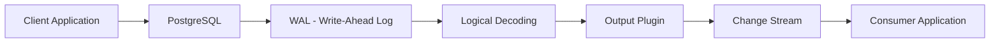
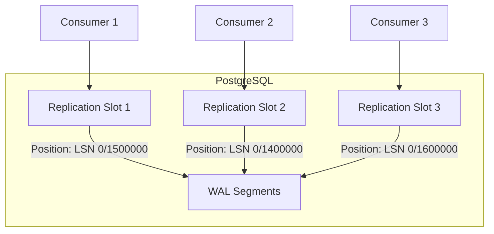
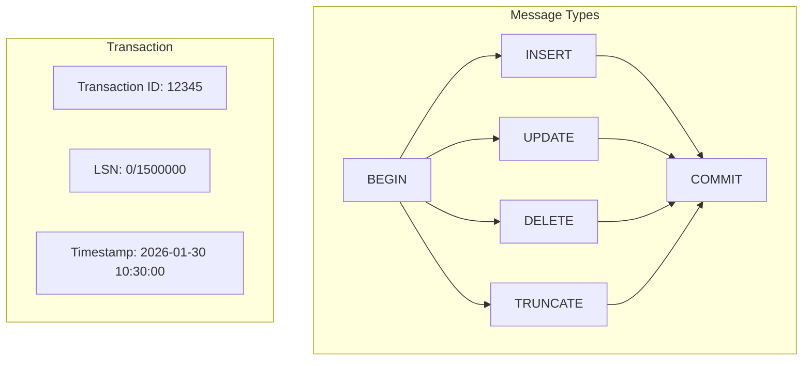
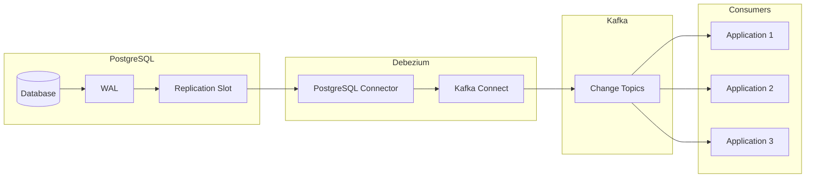
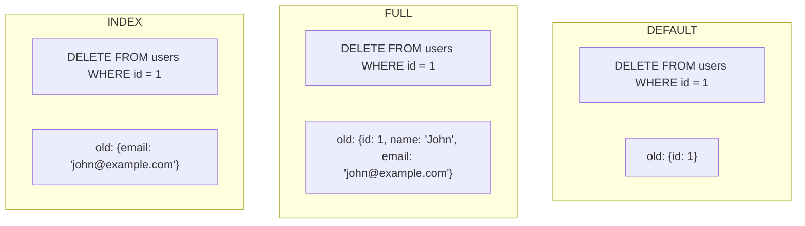

# How to Build PostgreSQL Logical Decoding

Author: [nawazdhandala](https://github.com/nawazdhandala)

Tags: PostgreSQL, Logical Decoding, CDC, Streaming

Description: Learn how to use PostgreSQL logical decoding for real-time change data capture.

---

Change Data Capture (CDC) has become essential for modern data architectures. PostgreSQL logical decoding provides a powerful mechanism to stream database changes in real-time. In this guide, we will explore how to build a complete logical decoding solution for change streaming.

## What is Logical Decoding?

Logical decoding is a PostgreSQL feature that allows you to extract changes made to a database in a logical format. Unlike physical replication, which copies raw bytes, logical decoding translates the Write-Ahead Log (WAL) into a human-readable or application-consumable format.



## Prerequisites

Before we begin, ensure you have:

- PostgreSQL 10 or later (PostgreSQL 14+ recommended)
- Superuser access to the database
- Understanding of basic PostgreSQL administration

## Step 1: Configure PostgreSQL for Logical Replication

First, modify your `postgresql.conf` to enable logical replication:

```ini
# postgresql.conf

# Set the WAL level to logical
# This is required for logical decoding to work
wal_level = logical

# Maximum number of replication slots
# Each consumer needs one slot
max_replication_slots = 10

# Maximum number of WAL sender processes
# Should be at least equal to max_replication_slots
max_wal_senders = 10

# Keep WAL segments for logical replication
# Adjust based on your consumer lag tolerance
wal_keep_size = 1GB
```

Restart PostgreSQL after making these changes:

```bash
# Restart PostgreSQL service
sudo systemctl restart postgresql

# Or on macOS with Homebrew
brew services restart postgresql
```

## Step 2: Understanding Replication Slots

Replication slots are a critical component of logical decoding. They track the position of a consumer in the WAL stream and prevent PostgreSQL from removing WAL segments that the consumer has not yet processed.



### Creating a Replication Slot

```sql
-- Create a logical replication slot using pgoutput plugin
-- The slot name must be unique across the cluster
SELECT pg_create_logical_replication_slot(
    'my_slot',      -- Slot name
    'pgoutput'      -- Output plugin
);

-- Verify the slot was created
SELECT
    slot_name,
    plugin,
    slot_type,
    active,
    restart_lsn,
    confirmed_flush_lsn
FROM pg_replication_slots;
```

### Managing Replication Slots

```sql
-- Check slot status and lag
SELECT
    slot_name,
    active,
    pg_size_pretty(
        pg_wal_lsn_diff(
            pg_current_wal_lsn(),
            restart_lsn
        )
    ) AS lag_size
FROM pg_replication_slots;

-- Drop a replication slot when no longer needed
-- WARNING: This will cause data loss if the consumer
-- has not processed all changes
SELECT pg_drop_replication_slot('my_slot');
```

## Step 3: Understanding Output Plugins

Output plugins transform WAL records into a specific format. PostgreSQL ships with `pgoutput`, but several other plugins are available.

### Available Output Plugins

| Plugin | Format | Use Case |
|--------|--------|----------|
| pgoutput | Binary Protocol | Native PostgreSQL logical replication |
| wal2json | JSON | REST APIs, general purpose |
| test_decoding | Text | Testing and debugging |
| decoderbufs | Protocol Buffers | High performance streaming |

### Using pgoutput (Native Plugin)

The `pgoutput` plugin is PostgreSQL's native logical replication output plugin. It is included by default and requires no additional installation.

```sql
-- Create a publication for specific tables
-- Publications define which tables to replicate
CREATE PUBLICATION my_publication FOR TABLE
    users,
    orders,
    products;

-- Or create a publication for all tables
CREATE PUBLICATION all_tables_pub FOR ALL TABLES;

-- View existing publications
SELECT * FROM pg_publication;

-- View tables in a publication
SELECT * FROM pg_publication_tables
WHERE pubname = 'my_publication';
```

### Installing wal2json

For JSON output, install the wal2json extension:

```bash
# On Ubuntu/Debian
sudo apt-get install postgresql-14-wal2json

# On CentOS/RHEL
sudo yum install wal2json14

# On macOS with Homebrew
brew install wal2json
```

Create a slot using wal2json:

```sql
-- Create a replication slot with wal2json
SELECT pg_create_logical_replication_slot(
    'json_slot',
    'wal2json'
);
```

## Step 4: Consuming Changes

### Using pg_logical_slot_get_changes

The simplest way to consume changes is using SQL functions:

```sql
-- Peek at changes without consuming them
-- Useful for testing and debugging
SELECT * FROM pg_logical_slot_peek_changes(
    'my_slot',     -- Slot name
    NULL,          -- Start LSN (NULL = from last position)
    NULL,          -- Number of changes (NULL = all available)
    'proto_version', '1',
    'publication_names', 'my_publication'
);

-- Consume changes (advances the slot position)
-- Changes are removed from the slot after this call
SELECT * FROM pg_logical_slot_get_changes(
    'my_slot',
    NULL,
    NULL,
    'proto_version', '1',
    'publication_names', 'my_publication'
);
```

### Using the Streaming Replication Protocol

For production use, connect using the streaming replication protocol:

```python
#!/usr/bin/env python3
"""
PostgreSQL Logical Decoding Consumer
Streams changes from a replication slot using psycopg2
"""

import psycopg2
from psycopg2.extras import LogicalReplicationConnection
import json

# Connection parameters for replication
conn_params = {
    'host': 'localhost',
    'port': 5432,
    'dbname': 'mydb',
    'user': 'replication_user',
    'password': 'secure_password',
    'connection_factory': LogicalReplicationConnection
}

def consume_changes():
    """
    Connect to PostgreSQL and consume logical changes
    """
    # Establish replication connection
    conn = psycopg2.connect(**conn_params)
    cursor = conn.cursor()

    # Start replication from the slot
    # This will stream changes as they occur
    cursor.start_replication(
        slot_name='my_slot',
        decode=True,
        options={
            'proto_version': '1',
            'publication_names': 'my_publication'
        }
    )

    print("Starting to consume changes...")

    # Process messages as they arrive
    def message_handler(msg):
        """
        Handle incoming replication messages
        """
        # Parse the message payload
        payload = msg.payload

        # Process the change based on type
        print(f"Received change: {payload}")

        # Acknowledge the message
        # This advances the slot position
        msg.cursor.send_feedback(flush_lsn=msg.data_start)

    # Consume messages with the handler
    cursor.consume_stream(message_handler)

if __name__ == '__main__':
    consume_changes()
```

### Using pg_recvlogical Command Line Tool

PostgreSQL provides a command line tool for consuming logical changes:

```bash
# Stream changes to stdout using wal2json
pg_recvlogical \
    --host=localhost \
    --port=5432 \
    --dbname=mydb \
    --username=replication_user \
    --slot=json_slot \
    --plugin=wal2json \
    --start \
    --fsync-interval=0 \
    --no-loop \
    -o pretty-print=1 \
    -o include-timestamp=1

# Stream changes to a file
pg_recvlogical \
    --host=localhost \
    --port=5432 \
    --dbname=mydb \
    --username=replication_user \
    --slot=json_slot \
    --plugin=wal2json \
    --start \
    --file=changes.json
```

## Step 5: Change Message Format

Understanding the change message format is crucial for building consumers.

### pgoutput Message Types



### wal2json Output Example

When using wal2json, changes are formatted as JSON:

```json
{
    "change": [
        {
            "kind": "insert",
            "schema": "public",
            "table": "users",
            "columnnames": ["id", "name", "email", "created_at"],
            "columntypes": ["integer", "text", "text", "timestamp"],
            "columnvalues": [1, "John Doe", "john@example.com", "2026-01-30 10:30:00"]
        },
        {
            "kind": "update",
            "schema": "public",
            "table": "users",
            "columnnames": ["id", "name", "email", "created_at"],
            "columntypes": ["integer", "text", "text", "timestamp"],
            "columnvalues": [1, "John Smith", "john@example.com", "2026-01-30 10:30:00"],
            "oldkeys": {
                "keynames": ["id"],
                "keytypes": ["integer"],
                "keyvalues": [1]
            }
        },
        {
            "kind": "delete",
            "schema": "public",
            "table": "users",
            "oldkeys": {
                "keynames": ["id"],
                "keytypes": ["integer"],
                "keyvalues": [1]
            }
        }
    ]
}
```

## Step 6: Debezium Integration

Debezium is a distributed platform for change data capture. It provides connectors for various databases, including PostgreSQL.



### Setting Up Debezium with Docker

Create a `docker-compose.yml` file:

```yaml
# docker-compose.yml
# Debezium setup with Kafka and PostgreSQL

version: '3.8'

services:
  # Zookeeper for Kafka coordination
  zookeeper:
    image: confluentinc/cp-zookeeper:7.5.0
    environment:
      ZOOKEEPER_CLIENT_PORT: 2181
      ZOOKEEPER_TICK_TIME: 2000

  # Kafka message broker
  kafka:
    image: confluentinc/cp-kafka:7.5.0
    depends_on:
      - zookeeper
    ports:
      - "9092:9092"
    environment:
      KAFKA_BROKER_ID: 1
      KAFKA_ZOOKEEPER_CONNECT: zookeeper:2181
      KAFKA_ADVERTISED_LISTENERS: PLAINTEXT://kafka:29092,PLAINTEXT_HOST://localhost:9092
      KAFKA_LISTENER_SECURITY_PROTOCOL_MAP: PLAINTEXT:PLAINTEXT,PLAINTEXT_HOST:PLAINTEXT
      KAFKA_INTER_BROKER_LISTENER_NAME: PLAINTEXT
      KAFKA_OFFSETS_TOPIC_REPLICATION_FACTOR: 1

  # Kafka Connect with Debezium
  connect:
    image: debezium/connect:2.4
    depends_on:
      - kafka
    ports:
      - "8083:8083"
    environment:
      GROUP_ID: 1
      CONFIG_STORAGE_TOPIC: connect_configs
      OFFSET_STORAGE_TOPIC: connect_offsets
      STATUS_STORAGE_TOPIC: connect_statuses
      BOOTSTRAP_SERVERS: kafka:29092

  # PostgreSQL database
  postgres:
    image: postgres:15
    ports:
      - "5432:5432"
    environment:
      POSTGRES_USER: postgres
      POSTGRES_PASSWORD: postgres
      POSTGRES_DB: mydb
    command:
      - "postgres"
      - "-c"
      - "wal_level=logical"
      - "-c"
      - "max_replication_slots=10"
      - "-c"
      - "max_wal_senders=10"
```

### Configuring the Debezium Connector

Register the PostgreSQL connector with Debezium:

```bash
# Register the Debezium PostgreSQL connector
curl -X POST http://localhost:8083/connectors \
    -H "Content-Type: application/json" \
    -d '{
        "name": "postgres-connector",
        "config": {
            "connector.class": "io.debezium.connector.postgresql.PostgresConnector",
            "database.hostname": "postgres",
            "database.port": "5432",
            "database.user": "postgres",
            "database.password": "postgres",
            "database.dbname": "mydb",
            "database.server.name": "myserver",
            "topic.prefix": "myserver",
            "table.include.list": "public.users,public.orders",
            "plugin.name": "pgoutput",
            "slot.name": "debezium_slot",
            "publication.name": "debezium_publication",
            "publication.autocreate.mode": "filtered",
            "snapshot.mode": "initial",
            "tombstones.on.delete": "true",
            "key.converter": "org.apache.kafka.connect.json.JsonConverter",
            "value.converter": "org.apache.kafka.connect.json.JsonConverter"
        }
    }'
```

### Debezium Change Event Structure

Debezium produces change events in a structured format:

```json
{
    "schema": { },
    "payload": {
        "before": {
            "id": 1,
            "name": "John Doe",
            "email": "john@example.com"
        },
        "after": {
            "id": 1,
            "name": "John Smith",
            "email": "john.smith@example.com"
        },
        "source": {
            "version": "2.4.0",
            "connector": "postgresql",
            "name": "myserver",
            "ts_ms": 1706612400000,
            "snapshot": "false",
            "db": "mydb",
            "schema": "public",
            "table": "users",
            "txId": 12345,
            "lsn": 12345678,
            "xmin": null
        },
        "op": "u",
        "ts_ms": 1706612400123,
        "transaction": {
            "id": "12345",
            "total_order": 1,
            "data_collection_order": 1
        }
    }
}
```

### Consuming Debezium Events with Python

```python
#!/usr/bin/env python3
"""
Debezium Kafka Consumer
Consumes change events from Debezium via Kafka
"""

from kafka import KafkaConsumer
import json

# Configure the Kafka consumer
consumer = KafkaConsumer(
    'myserver.public.users',  # Topic name follows pattern: prefix.schema.table
    bootstrap_servers=['localhost:9092'],
    auto_offset_reset='earliest',
    enable_auto_commit=True,
    group_id='my-consumer-group',
    value_deserializer=lambda x: json.loads(x.decode('utf-8'))
)

def process_change_event(event):
    """
    Process a Debezium change event
    """
    payload = event.get('payload', {})

    # Extract operation type
    # c = create, u = update, d = delete, r = read (snapshot)
    operation = payload.get('op')

    # Extract before and after states
    before = payload.get('before')
    after = payload.get('after')

    # Extract source metadata
    source = payload.get('source', {})
    table = source.get('table')

    # Handle different operations
    if operation == 'c':
        print(f"INSERT into {table}: {after}")
    elif operation == 'u':
        print(f"UPDATE in {table}: {before} -> {after}")
    elif operation == 'd':
        print(f"DELETE from {table}: {before}")
    elif operation == 'r':
        print(f"SNAPSHOT of {table}: {after}")

# Main consumer loop
print("Starting Debezium consumer...")
for message in consumer:
    process_change_event(message.value)
```

## Step 7: Handling REPLICA IDENTITY

PostgreSQL needs to know which columns to include in UPDATE and DELETE events. This is controlled by REPLICA IDENTITY.

```sql
-- Check current replica identity setting
SELECT
    relname AS table_name,
    CASE relreplident
        WHEN 'd' THEN 'DEFAULT (primary key)'
        WHEN 'n' THEN 'NOTHING'
        WHEN 'f' THEN 'FULL'
        WHEN 'i' THEN 'INDEX'
    END AS replica_identity
FROM pg_class
WHERE relname = 'users';

-- Set REPLICA IDENTITY to FULL
-- This includes all columns in UPDATE/DELETE events
ALTER TABLE users REPLICA IDENTITY FULL;

-- Set REPLICA IDENTITY to use a specific index
-- First create a unique index
CREATE UNIQUE INDEX users_email_idx ON users(email);

-- Then set the replica identity to use it
ALTER TABLE users REPLICA IDENTITY USING INDEX users_email_idx;

-- Reset to default (primary key only)
ALTER TABLE users REPLICA IDENTITY DEFAULT;
```

### REPLICA IDENTITY Comparison



## Step 8: Monitoring and Troubleshooting

### Monitoring Replication Lag

```sql
-- Check replication slot lag
SELECT
    slot_name,
    active,
    pg_size_pretty(
        pg_wal_lsn_diff(
            pg_current_wal_lsn(),
            confirmed_flush_lsn
        )
    ) AS lag_bytes,
    pg_size_pretty(
        pg_wal_lsn_diff(
            pg_current_wal_lsn(),
            restart_lsn
        )
    ) AS wal_retained
FROM pg_replication_slots
WHERE slot_type = 'logical';

-- Check WAL sender status
SELECT
    pid,
    usename,
    application_name,
    client_addr,
    state,
    sent_lsn,
    write_lsn,
    flush_lsn,
    replay_lsn,
    pg_size_pretty(
        pg_wal_lsn_diff(sent_lsn, replay_lsn)
    ) AS replication_lag
FROM pg_stat_replication;
```

### Common Issues and Solutions

**Issue: Replication slot is not active**

```sql
-- Check if the slot exists and is active
SELECT slot_name, active, active_pid
FROM pg_replication_slots;

-- If stuck, you may need to drop and recreate
SELECT pg_drop_replication_slot('stuck_slot');
```

**Issue: WAL files accumulating**

```sql
-- Check which slots are holding back WAL
SELECT
    slot_name,
    pg_size_pretty(
        pg_wal_lsn_diff(
            pg_current_wal_lsn(),
            restart_lsn
        )
    ) AS wal_retained
FROM pg_replication_slots
ORDER BY
    pg_wal_lsn_diff(pg_current_wal_lsn(), restart_lsn) DESC;
```

**Issue: Missing changes in stream**

```sql
-- Verify publication includes the table
SELECT * FROM pg_publication_tables
WHERE tablename = 'your_table';

-- Check replica identity
SELECT relreplident FROM pg_class
WHERE relname = 'your_table';
```

## Step 9: Production Best Practices

### 1. Use Separate Replication User

```sql
-- Create a dedicated replication user
CREATE ROLE replication_user WITH
    REPLICATION
    LOGIN
    PASSWORD 'secure_password';

-- Grant necessary permissions
GRANT USAGE ON SCHEMA public TO replication_user;
GRANT SELECT ON ALL TABLES IN SCHEMA public TO replication_user;
```

### 2. Configure Connection Limits

```ini
# postgresql.conf

# Reserve connections for replication
reserved_connections = 5

# Limit connections per user
# Set in pg_hba.conf or use connection pooling
```

### 3. Monitor Slot Health

```python
#!/usr/bin/env python3
"""
Replication Slot Health Monitor
Alerts when slots are inactive or lagging
"""

import psycopg2
import smtplib
from email.message import EmailMessage

# Thresholds
MAX_LAG_BYTES = 1024 * 1024 * 100  # 100 MB

def check_slot_health():
    """
    Check replication slot health and alert if issues found
    """
    conn = psycopg2.connect(
        host='localhost',
        dbname='mydb',
        user='monitor_user',
        password='password'
    )

    cursor = conn.cursor()

    # Query slot status
    cursor.execute("""
        SELECT
            slot_name,
            active,
            pg_wal_lsn_diff(
                pg_current_wal_lsn(),
                confirmed_flush_lsn
            ) AS lag_bytes
        FROM pg_replication_slots
        WHERE slot_type = 'logical'
    """)

    alerts = []

    for row in cursor.fetchall():
        slot_name, active, lag_bytes = row

        # Check for inactive slots
        if not active:
            alerts.append(f"Slot {slot_name} is inactive")

        # Check for excessive lag
        if lag_bytes and lag_bytes > MAX_LAG_BYTES:
            alerts.append(
                f"Slot {slot_name} has {lag_bytes / 1024 / 1024:.2f} MB lag"
            )

    # Send alerts if any issues found
    if alerts:
        send_alert('\n'.join(alerts))

    conn.close()

def send_alert(message):
    """
    Send alert via email
    """
    msg = EmailMessage()
    msg['Subject'] = 'PostgreSQL Replication Alert'
    msg['From'] = 'alerts@example.com'
    msg['To'] = 'admin@example.com'
    msg.set_content(message)

    # Send the message
    with smtplib.SMTP('localhost') as server:
        server.send_message(msg)

if __name__ == '__main__':
    check_slot_health()
```

### 4. Implement Graceful Shutdown

```python
#!/usr/bin/env python3
"""
Graceful shutdown handler for CDC consumer
"""

import signal
import sys
import psycopg2
from psycopg2.extras import LogicalReplicationConnection

# Global flag for shutdown
shutdown_requested = False

def signal_handler(signum, frame):
    """
    Handle shutdown signals gracefully
    """
    global shutdown_requested
    print("Shutdown requested, finishing current batch...")
    shutdown_requested = True

# Register signal handlers
signal.signal(signal.SIGINT, signal_handler)
signal.signal(signal.SIGTERM, signal_handler)

def consume_with_graceful_shutdown():
    """
    Consume changes with graceful shutdown support
    """
    conn = psycopg2.connect(
        host='localhost',
        dbname='mydb',
        user='replication_user',
        password='password',
        connection_factory=LogicalReplicationConnection
    )

    cursor = conn.cursor()
    cursor.start_replication(slot_name='my_slot', decode=True)

    try:
        while not shutdown_requested:
            # Poll for messages with timeout
            msg = cursor.read_message()

            if msg:
                # Process the message
                process_message(msg)

                # Send feedback to advance the slot
                cursor.send_feedback(flush_lsn=msg.data_start)
    finally:
        # Clean up
        print("Closing connection...")
        cursor.close()
        conn.close()
        print("Shutdown complete")

def process_message(msg):
    """
    Process a replication message
    """
    print(f"Processing: {msg.payload}")

if __name__ == '__main__':
    consume_with_graceful_shutdown()
```

## Conclusion

PostgreSQL logical decoding provides a robust foundation for building change data capture pipelines. By understanding replication slots, output plugins, and proper configuration, you can build reliable streaming solutions for your data architecture.

Key takeaways:

- Configure `wal_level = logical` and create replication slots for consumers
- Choose the right output plugin for your use case (pgoutput for native replication, wal2json for JSON)
- Set appropriate REPLICA IDENTITY for tables that need UPDATE/DELETE tracking
- Use Debezium for production-grade CDC with Kafka integration
- Monitor replication slot lag to prevent WAL accumulation
- Implement graceful shutdown and error handling in your consumers

With these foundations, you can build scalable, real-time data pipelines that keep your systems synchronized and responsive to changes.

## Further Reading

- [PostgreSQL Logical Replication Documentation](https://www.postgresql.org/docs/current/logical-replication.html)
- [Debezium PostgreSQL Connector](https://debezium.io/documentation/reference/stable/connectors/postgresql.html)
- [wal2json Output Plugin](https://github.com/eulerto/wal2json)
