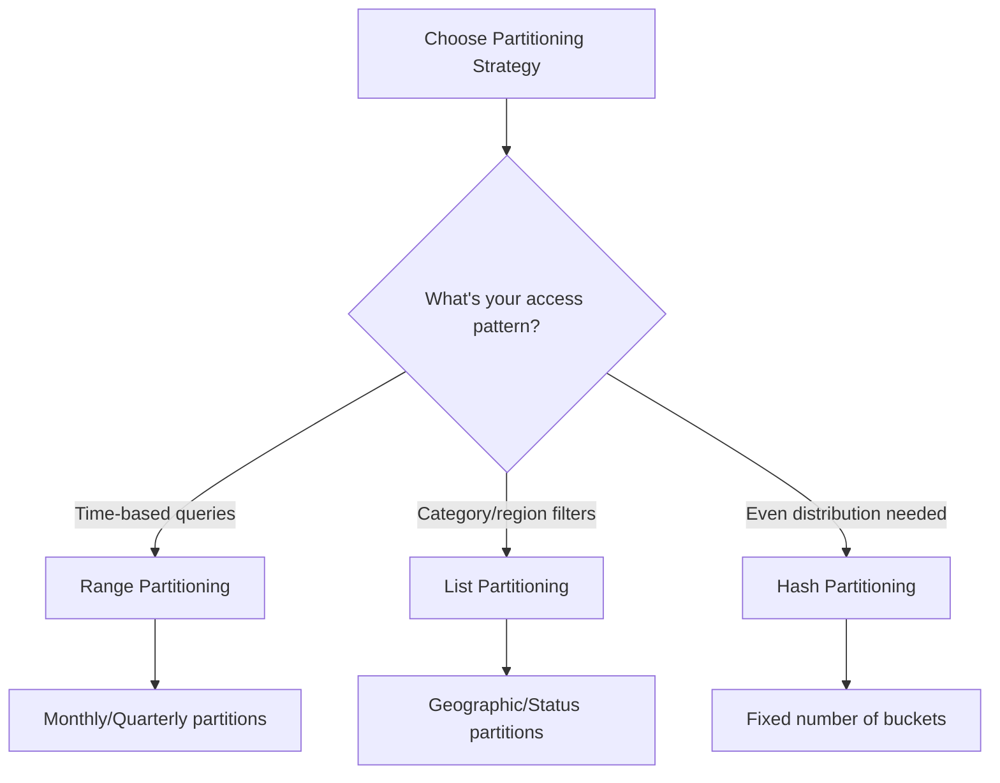

# How to Create PostgreSQL Partitioning Strategies

Author: [nawazdhandala](https://www.github.com/nawazdhandala)

Tags: PostgreSQL, Database, Partitioning, Performance, SQL

Description: Master PostgreSQL table partitioning with range, list, and hash strategies for handling large datasets with improved query performance and easier maintenance.

---

When your PostgreSQL tables grow to hundreds of millions of rows, queries slow down and maintenance becomes painful. Table partitioning solves this by splitting large tables into smaller, manageable chunks while keeping them accessible through a single interface. Let me walk you through building effective partitioning strategies.

## Understanding Partitioning Strategies

PostgreSQL offers three native partitioning methods, each suited to different use cases:



## Range Partitioning for Time-Series Data

Range partitioning works best when you query data by continuous ranges, especially timestamps. This is the most common strategy for logs, events, and transactional data.

```sql
-- Create the parent table with range partitioning on timestamp
-- The partition key (created_at) must be NOT NULL
CREATE TABLE metrics (
    id BIGSERIAL,
    sensor_id INTEGER NOT NULL,
    value DECIMAL(10,4) NOT NULL,
    created_at TIMESTAMP NOT NULL,
    -- Primary key must include the partition key
    PRIMARY KEY (id, created_at)
) PARTITION BY RANGE (created_at);

-- Create monthly partitions
-- Each partition handles a specific date range
CREATE TABLE metrics_2026_01 PARTITION OF metrics
    FOR VALUES FROM ('2026-01-01') TO ('2026-02-01');

CREATE TABLE metrics_2026_02 PARTITION OF metrics
    FOR VALUES FROM ('2026-02-01') TO ('2026-03-01');

CREATE TABLE metrics_2026_03 PARTITION OF metrics
    FOR VALUES FROM ('2026-03-01') TO ('2026-04-01');

-- Add an index that applies to all partitions
CREATE INDEX idx_metrics_sensor ON metrics(sensor_id);
```

The real power shows up in query execution. When you filter by date, PostgreSQL skips partitions entirely:

```sql
-- This query only scans metrics_2026_01
-- Other partitions are pruned automatically
EXPLAIN ANALYZE
SELECT sensor_id, AVG(value)
FROM metrics
WHERE created_at >= '2026-01-15' AND created_at < '2026-01-20'
GROUP BY sensor_id;
```

## List Partitioning for Categorical Data

When your queries filter by specific categories like regions, status values, or tenant IDs, list partitioning delivers excellent performance.

```sql
-- Partition orders by fulfillment region
-- Good for multi-tenant or geographic data
CREATE TABLE orders (
    id BIGSERIAL,
    customer_id INTEGER NOT NULL,
    total DECIMAL(12,2) NOT NULL,
    region VARCHAR(10) NOT NULL,
    created_at TIMESTAMP DEFAULT NOW(),
    PRIMARY KEY (id, region)
) PARTITION BY LIST (region);

-- North America partition
CREATE TABLE orders_na PARTITION OF orders
    FOR VALUES IN ('US', 'CA', 'MX');

-- Europe partition
CREATE TABLE orders_eu PARTITION OF orders
    FOR VALUES IN ('GB', 'DE', 'FR', 'ES', 'IT', 'NL');

-- Asia Pacific partition
CREATE TABLE orders_apac PARTITION OF orders
    FOR VALUES IN ('JP', 'AU', 'SG', 'IN', 'KR');

-- Catch-all for new regions you haven't configured yet
CREATE TABLE orders_other PARTITION OF orders
    DEFAULT;
```

The default partition prevents insert failures when new region codes appear. You can later move data to proper partitions.

## Hash Partitioning for Even Distribution

Hash partitioning distributes rows evenly across a fixed number of partitions. Use this when you need balanced partition sizes but lack a natural range or list key.

```sql
-- Distribute sessions across partitions by user_id hash
-- Useful when queries filter by user_id
CREATE TABLE sessions (
    id UUID DEFAULT gen_random_uuid(),
    user_id INTEGER NOT NULL,
    session_data JSONB,
    expires_at TIMESTAMP NOT NULL,
    PRIMARY KEY (id, user_id)
) PARTITION BY HASH (user_id);

-- Create 8 hash partitions (power of 2 recommended)
-- MODULUS is the total number of partitions
-- REMAINDER determines which rows go where
CREATE TABLE sessions_p0 PARTITION OF sessions
    FOR VALUES WITH (MODULUS 8, REMAINDER 0);
CREATE TABLE sessions_p1 PARTITION OF sessions
    FOR VALUES WITH (MODULUS 8, REMAINDER 1);
CREATE TABLE sessions_p2 PARTITION OF sessions
    FOR VALUES WITH (MODULUS 8, REMAINDER 2);
CREATE TABLE sessions_p3 PARTITION OF sessions
    FOR VALUES WITH (MODULUS 8, REMAINDER 3);
CREATE TABLE sessions_p4 PARTITION OF sessions
    FOR VALUES WITH (MODULUS 8, REMAINDER 4);
CREATE TABLE sessions_p5 PARTITION OF sessions
    FOR VALUES WITH (MODULUS 8, REMAINDER 5);
CREATE TABLE sessions_p6 PARTITION OF sessions
    FOR VALUES WITH (MODULUS 8, REMAINDER 6);
CREATE TABLE sessions_p7 PARTITION OF sessions
    FOR VALUES WITH (MODULUS 8, REMAINDER 7);
```

## Combining Strategies with Sub-Partitioning

For complex access patterns, combine strategies. Partition first by time, then by category:

```sql
-- Events partitioned by month, then by event type
CREATE TABLE events (
    id BIGSERIAL,
    event_type VARCHAR(30) NOT NULL,
    payload JSONB,
    created_at TIMESTAMP NOT NULL
) PARTITION BY RANGE (created_at);

-- January partition, further partitioned by list
CREATE TABLE events_2026_01 PARTITION OF events
    FOR VALUES FROM ('2026-01-01') TO ('2026-02-01')
    PARTITION BY LIST (event_type);

-- Sub-partitions for January
CREATE TABLE events_2026_01_user PARTITION OF events_2026_01
    FOR VALUES IN ('login', 'logout', 'signup', 'profile_update');

CREATE TABLE events_2026_01_order PARTITION OF events_2026_01
    FOR VALUES IN ('purchase', 'refund', 'cart_update');

CREATE TABLE events_2026_01_other PARTITION OF events_2026_01
    DEFAULT;
```

## Automating Partition Creation

Manual partition management gets tedious. Here is a function to create partitions automatically:

```sql
-- Function to create monthly range partitions ahead of time
CREATE OR REPLACE FUNCTION create_future_partitions(
    parent_table TEXT,
    months_ahead INTEGER DEFAULT 3
) RETURNS INTEGER AS $$
DECLARE
    partition_date DATE;
    partition_name TEXT;
    start_bound DATE;
    end_bound DATE;
    created_count INTEGER := 0;
BEGIN
    -- Loop through future months
    FOR i IN 0..months_ahead LOOP
        partition_date := DATE_TRUNC('month', CURRENT_DATE + (i || ' months')::INTERVAL);
        start_bound := partition_date;
        end_bound := partition_date + INTERVAL '1 month';
        partition_name := parent_table || '_' || TO_CHAR(partition_date, 'YYYY_MM');

        -- Check if partition exists before creating
        IF NOT EXISTS (
            SELECT 1 FROM pg_class WHERE relname = partition_name
        ) THEN
            EXECUTE format(
                'CREATE TABLE %I PARTITION OF %I FOR VALUES FROM (%L) TO (%L)',
                partition_name, parent_table, start_bound, end_bound
            );
            created_count := created_count + 1;
            RAISE NOTICE 'Created partition: %', partition_name;
        END IF;
    END LOOP;

    RETURN created_count;
END;
$$ LANGUAGE plpgsql;

-- Create partitions for the next 6 months
SELECT create_future_partitions('metrics', 6);
```

## Managing Old Partitions

One major benefit of partitioning is easy data archival. Instead of deleting millions of rows, just detach and drop partitions:

```sql
-- Detach partition from the table (data still exists)
ALTER TABLE metrics DETACH PARTITION metrics_2025_01;

-- Option 1: Archive to a different schema
ALTER TABLE metrics_2025_01 SET SCHEMA archive;

-- Option 2: Export and drop
COPY metrics_2025_01 TO '/backup/metrics_2025_01.csv' CSV HEADER;
DROP TABLE metrics_2025_01;

-- Option 3: Move to cheaper storage tablespace
ALTER TABLE metrics_2025_01 SET TABLESPACE slow_storage;
```

## Monitoring Partition Health

Keep tabs on partition sizes and row distribution:

```sql
-- View partition sizes and row counts
SELECT
    schemaname || '.' || tablename AS partition,
    pg_size_pretty(pg_total_relation_size(schemaname || '.' || tablename)) AS total_size,
    n_live_tup AS row_count
FROM pg_stat_user_tables
WHERE tablename LIKE 'metrics_%'
ORDER BY tablename;

-- Check for partition pruning in queries
EXPLAIN (COSTS OFF)
SELECT * FROM metrics
WHERE created_at >= '2026-01-01' AND created_at < '2026-02-01';
```

The EXPLAIN output should show only the relevant partition being scanned, not all partitions.

## Strategy Selection Guide

Picking the right strategy depends on your workload:

| Strategy | Best For | Query Pattern |
|----------|----------|---------------|
| Range | Time-series, logs, events | WHERE date BETWEEN x AND y |
| List | Multi-tenant, geographic | WHERE region = 'US' |
| Hash | Even distribution, no natural key | WHERE user_id = 123 |

## Key Takeaways

Building an effective partitioning strategy comes down to understanding your data access patterns. Start with range partitioning for time-series data since it covers most use cases. Use list partitioning when you have clear categorical boundaries. Reserve hash partitioning for situations where you need even distribution without a natural partition key.

Remember that partition pruning only works when your queries include the partition key in the WHERE clause. Design your partitions around your most common queries, not just your data structure. And automate partition management early - you do not want to wake up to insert failures because a new month started and no partition exists.
