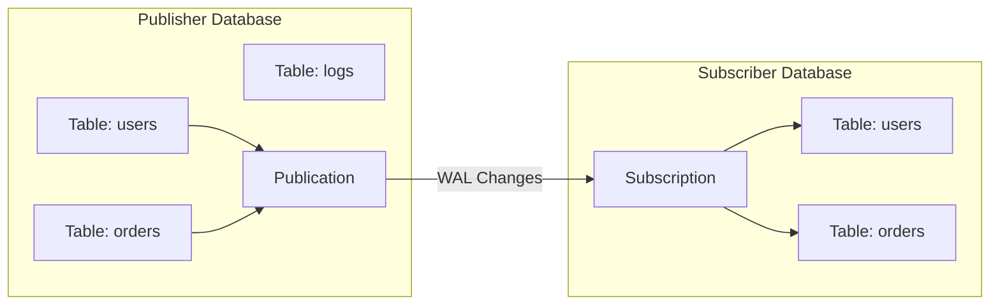
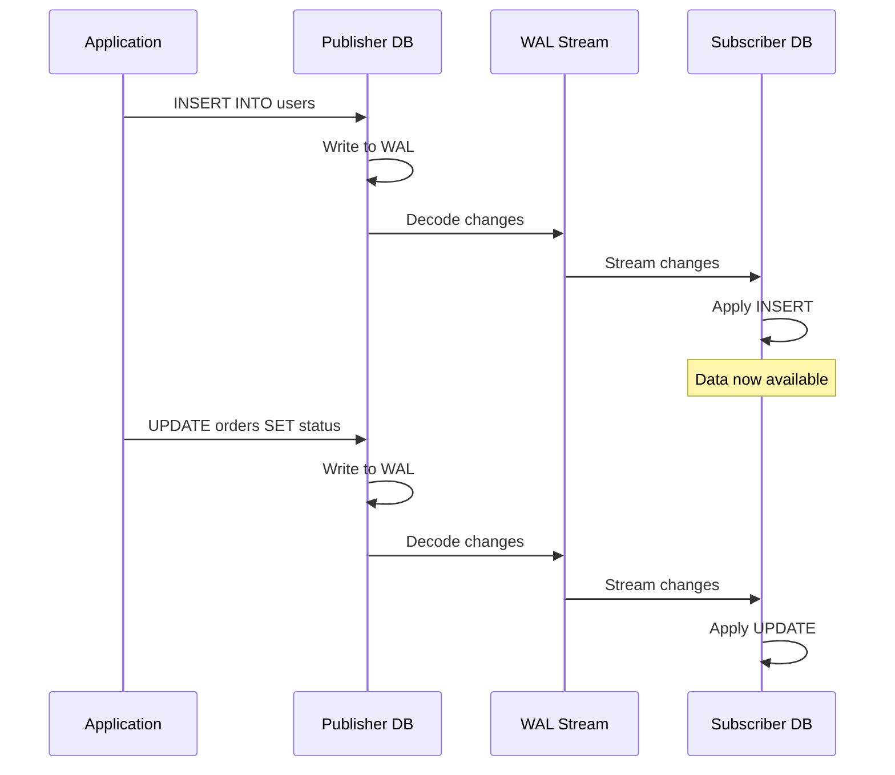
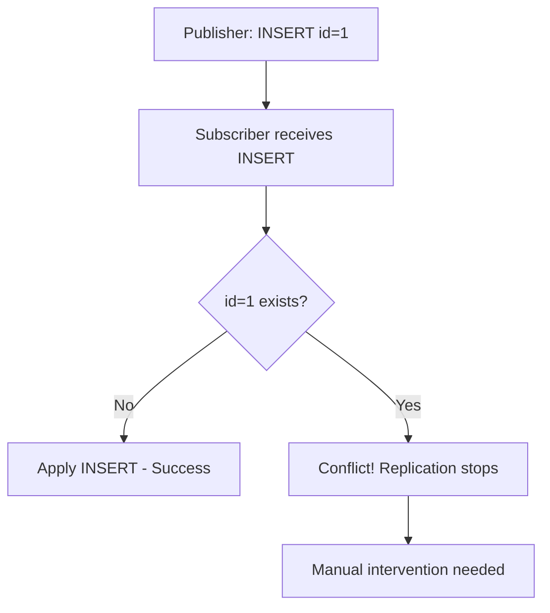
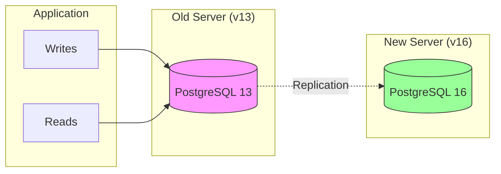

# How to Create PostgreSQL Publication/Subscription

Author: [nawazdhandala](https://github.com/nawazdhandala)

Tags: PostgreSQL, Database, Replication, DevOps, High Availability

Description: A practical guide to setting up PostgreSQL logical replication using publication and subscription for real-time data synchronization across databases.

---

PostgreSQL logical replication lets you selectively replicate data between databases in real time. Unlike physical replication that copies the entire cluster, publication/subscription gives you fine-grained control over which tables get replicated and where. Here's how to set it up.

## How Logical Replication Works



The publisher database captures changes via Write-Ahead Log (WAL) and streams them to subscribers. Each subscriber applies these changes independently, allowing for different indexes, triggers, or even additional columns on the subscriber side.

## Use Cases

| Scenario | Why Publication/Subscription Helps |
| --- | --- |
| Read replicas for reporting | Offload analytics queries without impacting production |
| Database migration | Replicate data to a new database with zero downtime |
| Multi-region deployment | Keep regional databases in sync for lower latency |
| Selective data sharing | Share specific tables with external systems |
| Version upgrades | Replicate from old to new PostgreSQL version |

## Prerequisites

Both publisher and subscriber need PostgreSQL 10 or later. The publisher requires these settings in `postgresql.conf`:

```ini
# Enable logical replication on the publisher
wal_level = logical

# Allow enough replication connections
max_replication_slots = 10
max_wal_senders = 10
```

After changing these settings, restart PostgreSQL:

```bash
# Restart PostgreSQL to apply configuration changes
sudo systemctl restart postgresql
```

## Step 1: Create the Publication

On the publisher database, create a publication that defines which tables to replicate.

### Replicate All Tables

This creates a publication that includes all tables in the database:

```sql
-- Create a publication that includes all tables in the database
CREATE PUBLICATION my_publication FOR ALL TABLES;
```

### Replicate Specific Tables

For more control, specify exactly which tables to include:

```sql
-- Create a publication for specific tables only
CREATE PUBLICATION orders_publication FOR TABLE
    users,
    orders,
    order_items;
```

### Filter Rows (PostgreSQL 15+)

PostgreSQL 15 introduced row filtering, letting you replicate only matching rows:

```sql
-- Create a publication that only replicates active users
CREATE PUBLICATION active_users_pub FOR TABLE users
    WHERE (status = 'active');

-- Replicate only orders from the last year
CREATE PUBLICATION recent_orders_pub FOR TABLE orders
    WHERE (created_at > CURRENT_DATE - INTERVAL '1 year');
```

### Filter Columns (PostgreSQL 15+)

You can also limit which columns get replicated:

```sql
-- Replicate only non-sensitive columns from the users table
CREATE PUBLICATION users_public_pub FOR TABLE
    users (id, username, created_at, updated_at);
```

## Step 2: Create a Replication User

Create a dedicated user with replication privileges:

```sql
-- Create a user specifically for replication
CREATE USER replication_user WITH REPLICATION PASSWORD 'secure_password_here';

-- Grant SELECT on tables to be replicated
GRANT SELECT ON ALL TABLES IN SCHEMA public TO replication_user;

-- Ensure future tables are also accessible
ALTER DEFAULT PRIVILEGES IN SCHEMA public
    GRANT SELECT ON TABLES TO replication_user;
```

## Step 3: Configure Access

Allow the subscriber to connect by editing `pg_hba.conf` on the publisher:

```conf
# Allow replication connections from subscriber IP
# Format: host database user address method
host    mydb    replication_user    10.0.0.50/32    scram-sha-256

# For replication connections
host    replication    replication_user    10.0.0.50/32    scram-sha-256
```

Reload configuration:

```bash
# Apply pg_hba.conf changes without restart
sudo systemctl reload postgresql
```

## Step 4: Prepare the Subscriber Database

The subscriber needs matching table structures. Create them manually or use `pg_dump`:

```bash
# Export schema only from the publisher (no data)
pg_dump -h publisher_host -U postgres -s -t users -t orders mydb > schema.sql

# Import schema on the subscriber
psql -h subscriber_host -U postgres -d mydb -f schema.sql
```

Or create tables manually:

```sql
-- Create matching table structure on subscriber
CREATE TABLE users (
    id SERIAL PRIMARY KEY,
    username VARCHAR(100) NOT NULL,
    email VARCHAR(255) NOT NULL,
    status VARCHAR(20) DEFAULT 'active',
    created_at TIMESTAMP DEFAULT CURRENT_TIMESTAMP
);

CREATE TABLE orders (
    id SERIAL PRIMARY KEY,
    user_id INTEGER REFERENCES users(id),
    total_amount DECIMAL(10, 2),
    status VARCHAR(20),
    created_at TIMESTAMP DEFAULT CURRENT_TIMESTAMP
);
```

## Step 5: Create the Subscription

On the subscriber database, create a subscription pointing to the publisher:

```sql
-- Create subscription to pull data from the publisher
CREATE SUBSCRIPTION my_subscription
    CONNECTION 'host=publisher_host port=5432 dbname=mydb user=replication_user password=secure_password_here'
    PUBLICATION my_publication;
```

The subscription immediately performs an initial data sync, then switches to streaming changes.

### Subscription Options

Control how the subscription behaves:

```sql
-- Create subscription with custom options
CREATE SUBSCRIPTION my_subscription
    CONNECTION 'host=publisher_host port=5432 dbname=mydb user=replication_user password=secure_password_here'
    PUBLICATION my_publication
    WITH (
        copy_data = true,           -- Initial data copy (default: true)
        create_slot = true,         -- Create replication slot (default: true)
        enabled = true,             -- Start replication immediately (default: true)
        synchronous_commit = off,   -- Async for better performance
        binary = true               -- Use binary format (PostgreSQL 14+)
    );
```

## Replication Flow Diagram



## Managing Publications and Subscriptions

### View Existing Publications

```sql
-- List all publications on the publisher
SELECT * FROM pg_publication;

-- See which tables are in a publication
SELECT * FROM pg_publication_tables;
```

### View Existing Subscriptions

```sql
-- List all subscriptions on the subscriber
SELECT * FROM pg_subscription;

-- Check subscription status and lag
SELECT
    subname,
    received_lsn,
    latest_end_lsn,
    latest_end_time
FROM pg_stat_subscription;
```

### Add Tables to Publication

```sql
-- Add a new table to an existing publication
ALTER PUBLICATION my_publication ADD TABLE new_table;
```

After adding tables, refresh the subscription:

```sql
-- Refresh subscription to pick up new tables
ALTER SUBSCRIPTION my_subscription REFRESH PUBLICATION;
```

### Remove Tables from Publication

```sql
-- Remove a table from publication
ALTER PUBLICATION my_publication DROP TABLE old_table;
```

### Pause and Resume Replication

```sql
-- Pause subscription (stop receiving changes)
ALTER SUBSCRIPTION my_subscription DISABLE;

-- Resume subscription
ALTER SUBSCRIPTION my_subscription ENABLE;
```

### Drop Publication and Subscription

```sql
-- On subscriber: drop subscription first
DROP SUBSCRIPTION my_subscription;

-- On publisher: drop publication
DROP PUBLICATION my_publication;
```

## Monitoring Replication Lag

Replication lag indicates how far behind the subscriber is. Monitor it closely:

```sql
-- On publisher: check replication slot status
SELECT
    slot_name,
    active,
    pg_size_pretty(pg_wal_lsn_diff(pg_current_wal_lsn(), confirmed_flush_lsn)) AS lag_size
FROM pg_replication_slots;
```

```sql
-- On subscriber: check subscription status
SELECT
    subname,
    pid,
    received_lsn,
    latest_end_lsn,
    latest_end_time,
    pg_size_pretty(pg_wal_lsn_diff(latest_end_lsn, received_lsn)) AS pending
FROM pg_stat_subscription;
```

## Handling Conflicts

Unlike physical replication, logical replication can encounter conflicts when the subscriber has conflicting data.

### Conflict Scenario



### Resolving Conflicts

When conflicts occur, replication stops. Check the subscriber logs and resolve manually:

```sql
-- Option 1: Delete conflicting row on subscriber
DELETE FROM users WHERE id = 1;

-- Option 2: Skip the problematic transaction
-- First, find the LSN to skip to
SELECT * FROM pg_replication_origin_status;

-- Then advance past the conflict
SELECT pg_replication_origin_advance('pg_<subscription_oid>', 'X/XXXXXXXX');
```

### Preventing Conflicts

```sql
-- Use higher sequence values on subscriber to avoid ID conflicts
ALTER SEQUENCE users_id_seq RESTART WITH 1000000;

-- Or use UUIDs instead of serial IDs
CREATE TABLE users (
    id UUID PRIMARY KEY DEFAULT gen_random_uuid(),
    username VARCHAR(100)
);
```

## Real-World Example: Zero-Downtime Migration

Here's a complete example of migrating a database using publication/subscription:



### Step-by-Step Migration

**1. Set up publication on old server:**

```sql
-- On old server: create publication for all tables
CREATE PUBLICATION migration_pub FOR ALL TABLES;
```

**2. Create matching schema on new server:**

```bash
# Dump schema from old server
pg_dump -h old_server -U postgres -s mydb > schema.sql

# Apply to new server
psql -h new_server -U postgres -d mydb -f schema.sql
```

**3. Create subscription on new server:**

```sql
-- On new server: subscribe to old server
CREATE SUBSCRIPTION migration_sub
    CONNECTION 'host=old_server dbname=mydb user=replication_user password=secret'
    PUBLICATION migration_pub;
```

**4. Wait for initial sync and monitor lag:**

```sql
-- Check sync progress
SELECT * FROM pg_stat_subscription;

-- Ensure lag is near zero before cutover
SELECT pg_size_pretty(pg_wal_lsn_diff(
    pg_current_wal_lsn(),
    confirmed_flush_lsn
)) FROM pg_replication_slots WHERE slot_name = 'migration_sub';
```

**5. Cutover to new server:**

```sql
-- Stop writes to old server (application level)
-- Wait for lag to reach zero

-- On new server: drop subscription (no longer needed)
DROP SUBSCRIPTION migration_sub;

-- On old server: drop publication
DROP PUBLICATION migration_pub;

-- Update application connection strings to new server
```

## Best Practices

1. **Use dedicated replication users** with minimal required privileges
2. **Monitor replication lag** and alert when it exceeds thresholds
3. **Test failover procedures** before you need them
4. **Keep schemas in sync** between publisher and subscriber
5. **Use row/column filters** to minimize replication traffic
6. **Clean up unused replication slots** to prevent WAL accumulation
7. **Document your replication topology** for operational clarity

## Troubleshooting Common Issues

| Issue | Cause | Solution |
| --- | --- | --- |
| Subscription not receiving data | Replication slot inactive | Check `pg_replication_slots` and network connectivity |
| WAL accumulation on publisher | Subscriber lagging or offline | Drop unused slots or fix subscriber |
| Permission denied | Missing grants | Grant SELECT and REPLICATION privileges |
| Table does not exist | Schema mismatch | Create matching table structure on subscriber |
| Conflict error | Duplicate key | Delete conflicting row or skip transaction |

## Limitations to Know

- **No DDL replication**: Schema changes must be applied manually on both sides
- **No sequence sync**: Sequences are not replicated; handle separately
- **TRUNCATE behavior**: TRUNCATE is replicated but only for tables in the publication
- **Large objects**: Not supported in logical replication
- **Partitioned tables**: Fully supported in PostgreSQL 13+

---

PostgreSQL publication/subscription gives you the flexibility to replicate exactly what you need, where you need it. Whether you are building read replicas, migrating databases, or sharing data across systems, logical replication handles the complexity while giving you full control over the process.
