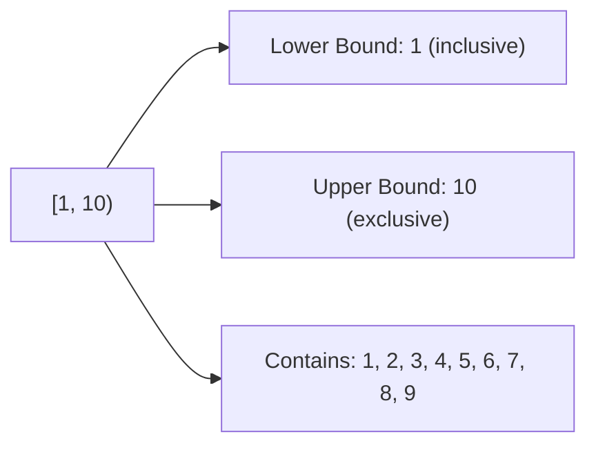
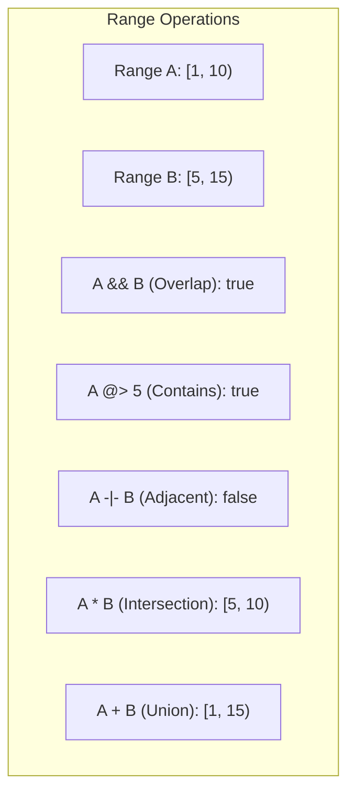
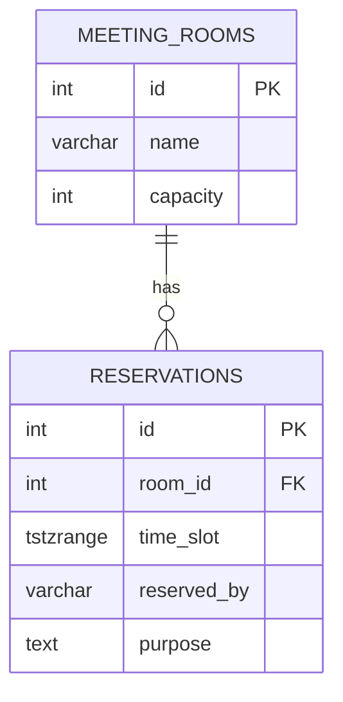
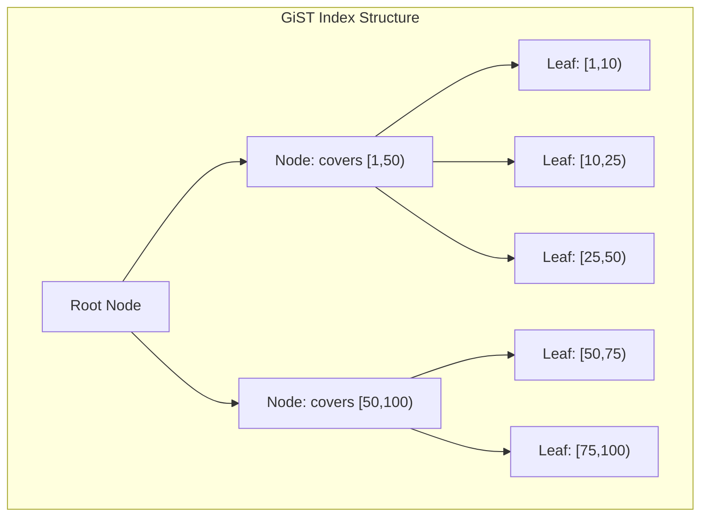
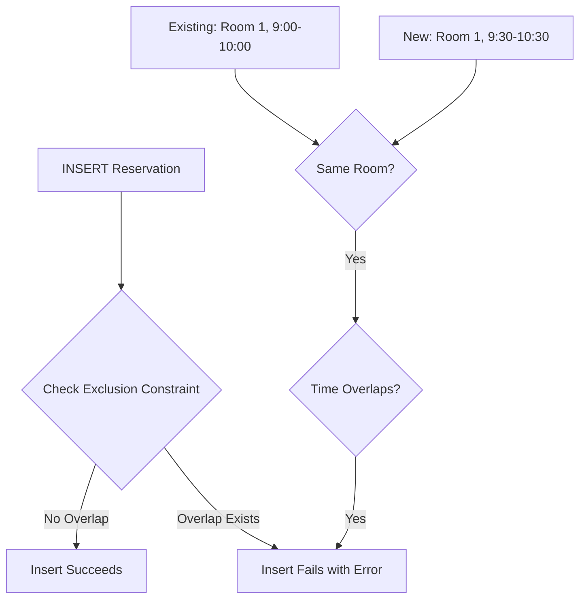
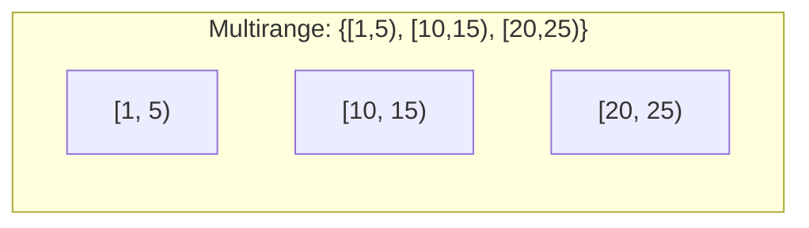

# How to Build PostgreSQL Range Types

Author: [nawazdhandala](https://github.com/nawazdhandala)

Tags: PostgreSQL, Range Types, Data Types, Temporal Data

Description: Learn to implement range types for intervals, time periods, and numeric ranges with operators, indexes, and exclusion constraints.

---

PostgreSQL range types provide a powerful way to represent intervals of values - whether you are working with time periods, numeric ranges, or custom data types. Instead of storing start and end values in separate columns and writing complex overlap logic, range types give you built-in operators and indexing capabilities that make interval operations simple and efficient.

## What Are Range Types?

A range type represents a contiguous span of values with a lower bound, an upper bound, and boundary inclusivity flags. PostgreSQL handles all the complexity of comparisons, overlaps, and containment checks for you.



### Boundary Notation

Range types use bracket notation to indicate whether bounds are inclusive or exclusive:

| Notation | Lower Bound | Upper Bound |
|----------|-------------|-------------|
| `[a, b]` | Inclusive   | Inclusive   |
| `[a, b)` | Inclusive   | Exclusive   |
| `(a, b]` | Exclusive   | Inclusive   |
| `(a, b)` | Exclusive   | Exclusive   |

## Built-in Range Types

PostgreSQL provides several built-in range types out of the box:

| Type | Description | Example |
|------|-------------|---------|
| `int4range` | Range of integer | `[1, 100)` |
| `int8range` | Range of bigint | `[1, 1000000000)` |
| `numrange` | Range of numeric | `[1.5, 9.9]` |
| `tsrange` | Range of timestamp without time zone | `['2026-01-01', '2026-12-31')` |
| `tstzrange` | Range of timestamp with time zone | `['2026-01-01 00:00:00+00', '2026-01-02 00:00:00+00')` |
| `daterange` | Range of date | `['2026-01-01', '2026-01-31']` |

### Creating Range Values

```sql
-- Integer range: includes 1 through 9 (10 is excluded)
SELECT '[1, 10)'::int4range;

-- Date range for January 2026
SELECT '[2026-01-01, 2026-02-01)'::daterange;

-- Timestamp range with time zone
SELECT '[2026-01-01 09:00:00+00, 2026-01-01 17:00:00+00)'::tstzrange;

-- Numeric range with decimal precision
SELECT '[0.0, 100.0]'::numrange;

-- Using constructor functions
SELECT int4range(1, 10);           -- Default: [1, 10)
SELECT int4range(1, 10, '[]');     -- Inclusive both ends: [1, 11)
SELECT int4range(1, 10, '(]');     -- Exclusive lower, inclusive upper: [2, 11)
SELECT daterange('2026-01-01', '2026-01-31', '[]');
```

## Range Operators

PostgreSQL provides a rich set of operators for working with ranges:



### Comparison Operators

```sql
-- Equality
SELECT '[1, 10)'::int4range = '[1, 10)'::int4range;  -- true

-- Less than / Greater than (compares lower bound, then upper bound)
SELECT '[1, 5)'::int4range < '[2, 5)'::int4range;    -- true

-- Overlap: Do two ranges share any values?
SELECT '[1, 10)'::int4range && '[5, 15)'::int4range; -- true
SELECT '[1, 5)'::int4range && '[5, 10)'::int4range;  -- false (5 not in [1,5))

-- Containment: Does range contain element?
SELECT '[1, 10)'::int4range @> 5;                     -- true
SELECT '[1, 10)'::int4range @> 10;                    -- false

-- Containment: Does range contain another range?
SELECT '[1, 20)'::int4range @> '[5, 10)'::int4range; -- true

-- Contained by: Is range contained by another range?
SELECT '[5, 10)'::int4range <@ '[1, 20)'::int4range; -- true
```

### Adjacency and Set Operations

```sql
-- Adjacent: Do ranges share a boundary without overlapping?
SELECT '[1, 5)'::int4range -|- '[5, 10)'::int4range; -- true
SELECT '[1, 5]'::int4range -|- '[6, 10)'::int4range; -- true (integers are discrete)

-- Union: Combine overlapping or adjacent ranges
SELECT '[1, 10)'::int4range + '[5, 15)'::int4range;  -- [1, 15)

-- Intersection: Find common values
SELECT '[1, 10)'::int4range * '[5, 15)'::int4range;  -- [5, 10)

-- Difference: Remove one range from another
SELECT '[1, 15)'::int4range - '[5, 10)'::int4range;  -- Error: would produce two ranges
SELECT '[1, 15)'::int4range - '[10, 20)'::int4range; -- [1, 10)
```

### Bound Extraction Functions

```sql
SELECT lower('[1, 10)'::int4range);           -- 1
SELECT upper('[1, 10)'::int4range);           -- 10
SELECT lower_inc('[1, 10)'::int4range);       -- true
SELECT upper_inc('[1, 10)'::int4range);       -- false
SELECT lower_inf('(,10)'::int4range);         -- true (unbounded lower)
SELECT upper_inf('[1,)'::int4range);          -- true (unbounded upper)
SELECT isempty('empty'::int4range);           -- true
```

## Practical Example: Meeting Room Reservations

Let us build a meeting room reservation system that prevents double bookings using range types:



### Creating the Schema

```sql
-- Create the meeting rooms table
CREATE TABLE meeting_rooms (
    id SERIAL PRIMARY KEY,
    name VARCHAR(100) NOT NULL,
    capacity INTEGER NOT NULL,
    location VARCHAR(200)
);

-- Create the reservations table with a range column
CREATE TABLE reservations (
    id SERIAL PRIMARY KEY,
    room_id INTEGER REFERENCES meeting_rooms(id),
    time_slot TSTZRANGE NOT NULL,
    reserved_by VARCHAR(100) NOT NULL,
    purpose TEXT,
    created_at TIMESTAMPTZ DEFAULT NOW()
);

-- Insert sample rooms
INSERT INTO meeting_rooms (name, capacity, location) VALUES
    ('Conference Room A', 10, 'Floor 1'),
    ('Huddle Space B', 4, 'Floor 2'),
    ('Board Room', 20, 'Floor 3');
```

### Adding Reservations

```sql
-- Reserve Conference Room A for a morning meeting
INSERT INTO reservations (room_id, time_slot, reserved_by, purpose)
VALUES (
    1,
    '[2026-01-30 09:00:00+00, 2026-01-30 10:30:00+00)',
    'alice@company.com',
    'Sprint Planning'
);

-- Reserve the same room for an afternoon meeting
INSERT INTO reservations (room_id, time_slot, reserved_by, purpose)
VALUES (
    1,
    '[2026-01-30 14:00:00+00, 2026-01-30 15:00:00+00)',
    'bob@company.com',
    'Client Call'
);
```

### Querying Reservations

```sql
-- Find all reservations that overlap with a specific time
SELECT r.*, m.name as room_name
FROM reservations r
JOIN meeting_rooms m ON r.room_id = m.id
WHERE r.time_slot && '[2026-01-30 09:30:00+00, 2026-01-30 10:00:00+00)'::tstzrange;

-- Find available rooms during a specific time slot
SELECT m.*
FROM meeting_rooms m
WHERE NOT EXISTS (
    SELECT 1 FROM reservations r
    WHERE r.room_id = m.id
    AND r.time_slot && '[2026-01-30 11:00:00+00, 2026-01-30 12:00:00+00)'::tstzrange
);

-- Find all reservations for today
SELECT r.*, m.name as room_name
FROM reservations r
JOIN meeting_rooms m ON r.room_id = m.id
WHERE r.time_slot && '[2026-01-30, 2026-01-31)'::tstzrange;

-- Get the duration of each reservation
SELECT
    id,
    reserved_by,
    upper(time_slot) - lower(time_slot) as duration
FROM reservations;
```

## GiST Indexes for Range Types

Range type queries can be expensive without proper indexing. PostgreSQL supports GiST (Generalized Search Tree) indexes that enable efficient range operations.



### Creating GiST Indexes

```sql
-- Create a GiST index on the time_slot column
CREATE INDEX idx_reservations_time_slot
ON reservations USING GIST (time_slot);

-- Composite GiST index for room-specific queries
CREATE INDEX idx_reservations_room_time
ON reservations USING GIST (room_id, time_slot);

-- Verify the index is being used
EXPLAIN ANALYZE
SELECT * FROM reservations
WHERE time_slot && '[2026-01-30 09:00:00+00, 2026-01-30 18:00:00+00)'::tstzrange;
```

### GiST vs B-tree Performance

```sql
-- B-tree indexes work for simple comparisons but not overlap queries
-- This would NOT use a B-tree index efficiently:
SELECT * FROM reservations WHERE time_slot && '[2026-01-30, 2026-01-31)'::tstzrange;

-- GiST indexes excel at:
-- 1. Overlap queries (&&)
-- 2. Containment queries (@>, <@)
-- 3. Adjacency queries (-|-)
```

## Exclusion Constraints

Exclusion constraints are one of the most powerful features for range types. They prevent conflicting data from being inserted, enforcing business rules at the database level.



### Creating Exclusion Constraints

```sql
-- First, enable the btree_gist extension for combining different types
CREATE EXTENSION IF NOT EXISTS btree_gist;

-- Add exclusion constraint to prevent double bookings
ALTER TABLE reservations
ADD CONSTRAINT no_overlapping_reservations
EXCLUDE USING GIST (
    room_id WITH =,
    time_slot WITH &&
);
```

### Testing the Exclusion Constraint

```sql
-- This will succeed - different room
INSERT INTO reservations (room_id, time_slot, reserved_by, purpose)
VALUES (2, '[2026-01-30 09:00:00+00, 2026-01-30 10:30:00+00)', 'charlie@company.com', 'Team Sync');

-- This will FAIL - same room, overlapping time
INSERT INTO reservations (room_id, time_slot, reserved_by, purpose)
VALUES (1, '[2026-01-30 10:00:00+00, 2026-01-30 11:00:00+00)', 'dave@company.com', 'Interview');
-- ERROR: conflicting key value violates exclusion constraint "no_overlapping_reservations"
```

### Advanced Exclusion Constraints

```sql
-- Allow adjacent bookings but not overlapping ones
-- The && operator already handles this - adjacent ranges do not overlap

-- For date ranges with gaps (e.g., require 15 minutes between bookings)
-- You would need a custom function or adjusted ranges

-- Soft delete support - only active reservations conflict
ALTER TABLE reservations ADD COLUMN is_cancelled BOOLEAN DEFAULT FALSE;

-- Drop and recreate the constraint with the cancelled check
ALTER TABLE reservations DROP CONSTRAINT no_overlapping_reservations;

ALTER TABLE reservations
ADD CONSTRAINT no_overlapping_active_reservations
EXCLUDE USING GIST (
    room_id WITH =,
    time_slot WITH &&
) WHERE (NOT is_cancelled);
```

## Creating Custom Range Types

PostgreSQL allows you to create range types for any data type that has a B-tree operator class.

### Example: IP Address Ranges

```sql
-- Create a range type for inet (IP addresses)
CREATE TYPE inetrange AS RANGE (
    subtype = inet
);

-- Now you can use it
CREATE TABLE ip_allocations (
    id SERIAL PRIMARY KEY,
    network_name VARCHAR(100),
    ip_range INETRANGE NOT NULL,
    allocated_to VARCHAR(100)
);

-- Insert IP allocations
INSERT INTO ip_allocations (network_name, ip_range, allocated_to)
VALUES
    ('Office Network', '[192.168.1.1, 192.168.1.50]'::inetrange, 'IT Department'),
    ('Server VLAN', '[192.168.1.100, 192.168.1.150]'::inetrange, 'Infrastructure');

-- Check if an IP is allocated
SELECT * FROM ip_allocations
WHERE ip_range @> '192.168.1.25'::inet;

-- Prevent overlapping allocations
CREATE EXTENSION IF NOT EXISTS btree_gist;
ALTER TABLE ip_allocations
ADD CONSTRAINT no_overlapping_ips
EXCLUDE USING GIST (ip_range WITH &&);
```

### Example: Custom Float Range with Precision

```sql
-- Create a range type for float8 with custom canonical function
CREATE TYPE float8range AS RANGE (
    subtype = float8,
    subtype_diff = float8mi  -- Built-in difference function
);

-- Use for price ranges
CREATE TABLE products (
    id SERIAL PRIMARY KEY,
    name VARCHAR(200),
    price_range FLOAT8RANGE
);

INSERT INTO products (name, price_range) VALUES
    ('Budget Laptop', '[299.99, 499.99]'),
    ('Premium Laptop', '[999.99, 2499.99]');

-- Find products in a price range
SELECT * FROM products
WHERE price_range && '[400.00, 1200.00]'::float8range;
```

## Multirange Types (PostgreSQL 14+)

PostgreSQL 14 introduced multirange types, which can hold multiple non-contiguous ranges in a single value.



### Using Multiranges

```sql
-- Create a multirange value
SELECT '{[1,5), [10,15), [20,25)}'::int4multirange;

-- Store business hours (multiple time slots per day)
CREATE TABLE business_hours (
    id SERIAL PRIMARY KEY,
    day_of_week INTEGER CHECK (day_of_week BETWEEN 0 AND 6),
    open_hours TSTZMULTIRANGE
);

-- Insert hours with a lunch break
INSERT INTO business_hours (day_of_week, open_hours)
VALUES (
    1, -- Monday
    '{[2026-01-30 09:00:00+00, 2026-01-30 12:00:00+00), [2026-01-30 13:00:00+00, 2026-01-30 17:00:00+00)}'::tstzmultirange
);

-- Check if a time falls within business hours
SELECT * FROM business_hours
WHERE open_hours @> '2026-01-30 10:30:00+00'::timestamptz;

-- Aggregate ranges into a multirange
SELECT range_agg(time_slot) as all_bookings
FROM reservations
WHERE room_id = 1;
```

## Best Practices

### 1. Choose the Right Range Type

```sql
-- Use daterange for full-day periods (more efficient)
SELECT '[2026-01-01, 2026-01-31]'::daterange;

-- Use tstzrange for precise time periods with time zones
SELECT '[2026-01-01 09:00:00+00, 2026-01-01 17:00:00+00)'::tstzrange;

-- Use tsrange only when time zone is not relevant
SELECT '[2026-01-01 09:00:00, 2026-01-01 17:00:00)'::tsrange;
```

### 2. Prefer Half-Open Ranges

```sql
-- Half-open ranges [a, b) are easier to work with
-- They do not overlap at boundaries and are easier to combine

-- Good: Half-open ranges
SELECT '[2026-01-01, 2026-01-02)'::daterange;  -- Just January 1st

-- Potentially confusing: Closed ranges
SELECT '[2026-01-01, 2026-01-01]'::daterange;  -- Also just January 1st
```

### 3. Handle Empty and Unbounded Ranges

```sql
-- Empty range
SELECT 'empty'::int4range;
SELECT isempty('[5,5)'::int4range);  -- true

-- Unbounded ranges
SELECT '[2026-01-01,)'::daterange;   -- From Jan 1st onwards
SELECT '(,2026-12-31]'::daterange;   -- Up to Dec 31st
SELECT '(,)'::int4range;              -- All integers

-- Check for unbounded
SELECT lower_inf('(,10)'::int4range);  -- true
```

### 4. Index Strategy

```sql
-- Always create GiST indexes for range columns used in queries
CREATE INDEX idx_range_col ON table_name USING GIST (range_column);

-- For composite queries, include other columns
CREATE INDEX idx_composite ON table_name USING GIST (category_id, range_column);

-- Consider partial indexes for frequently queried subsets
CREATE INDEX idx_active_reservations ON reservations USING GIST (time_slot)
WHERE NOT is_cancelled;
```

## Common Pitfalls and Solutions

### Pitfall 1: Forgetting About Time Zones

```sql
-- Problem: Mixing tsrange and tstzrange
-- Solution: Always use tstzrange for timestamps

-- Wrong - loses time zone information
CREATE TABLE events_wrong (
    event_period TSRANGE
);

-- Correct - preserves time zone
CREATE TABLE events_correct (
    event_period TSTZRANGE
);
```

### Pitfall 2: Not Using Exclusion Constraints

```sql
-- Problem: Checking for overlaps in application code is error-prone
-- Solution: Use exclusion constraints for data integrity

-- Let the database handle it
ALTER TABLE your_table
ADD CONSTRAINT prevent_overlap
EXCLUDE USING GIST (key_column WITH =, range_column WITH &&);
```

### Pitfall 3: Inefficient Range Comparisons

```sql
-- Problem: Using separate columns instead of range types
-- Inefficient
SELECT * FROM bookings
WHERE start_time < '2026-01-30 12:00:00'
AND end_time > '2026-01-30 10:00:00';

-- Better - use range types and operators
SELECT * FROM bookings
WHERE time_range && '[2026-01-30 10:00:00, 2026-01-30 12:00:00)'::tstzrange;
```

## Summary

PostgreSQL range types provide a powerful and efficient way to handle interval data. Key takeaways:

1. **Built-in types** cover most use cases: `int4range`, `int8range`, `numrange`, `daterange`, `tsrange`, and `tstzrange`

2. **Rich operators** make interval logic simple: overlap (`&&`), containment (`@>`, `<@`), adjacency (`-|-`), union (`+`), and intersection (`*`)

3. **GiST indexes** enable efficient queries on range columns - always create them for range columns used in WHERE clauses

4. **Exclusion constraints** enforce non-overlapping rules at the database level, preventing data integrity issues

5. **Custom range types** can be created for any type with a B-tree operator class

6. **Multiranges** (PostgreSQL 14+) allow storing non-contiguous intervals in a single column

By leveraging range types, you can write cleaner code, enforce data integrity at the database level, and achieve better query performance for interval-based operations.
