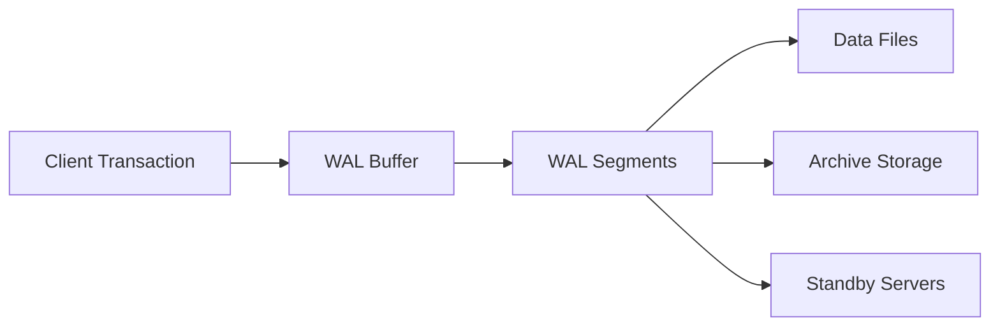
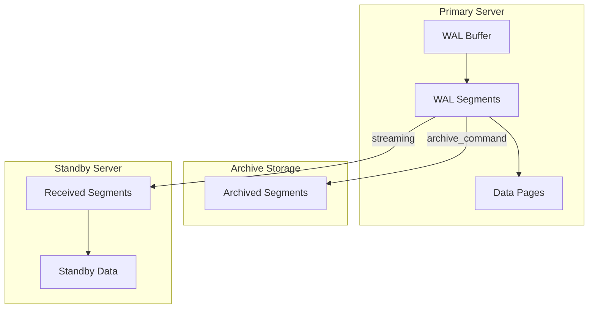
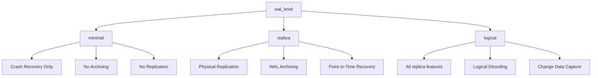
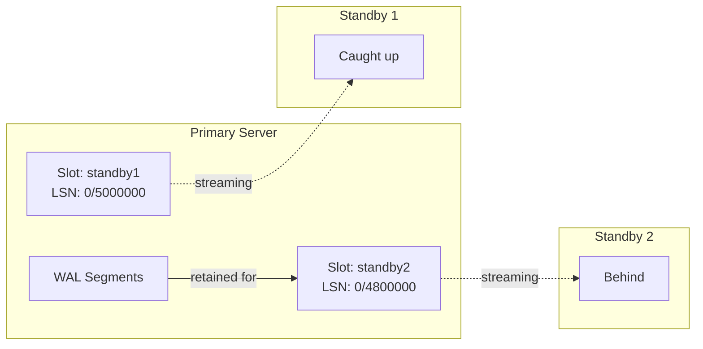
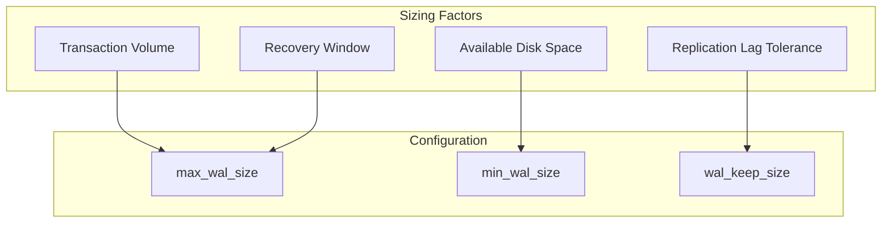
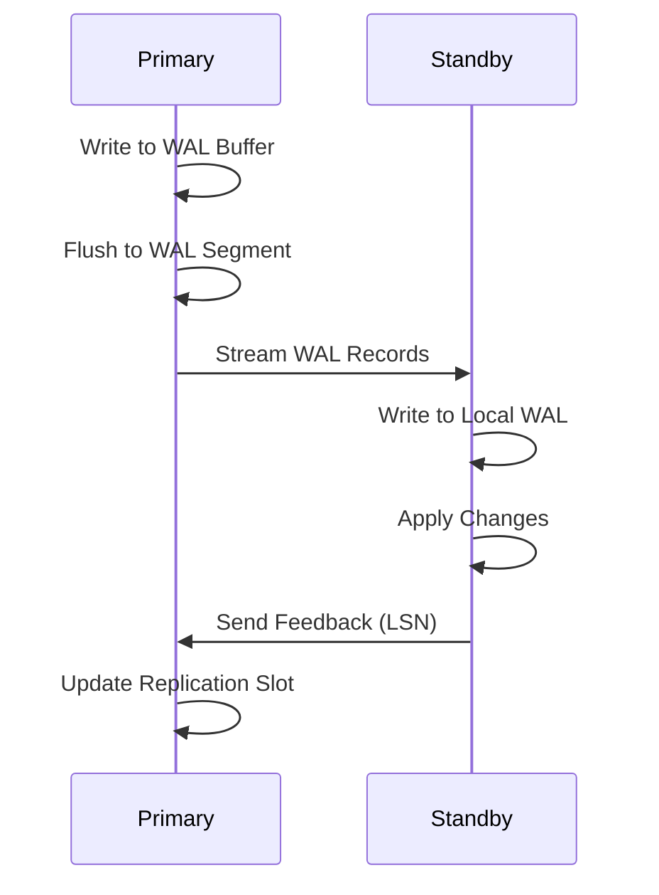
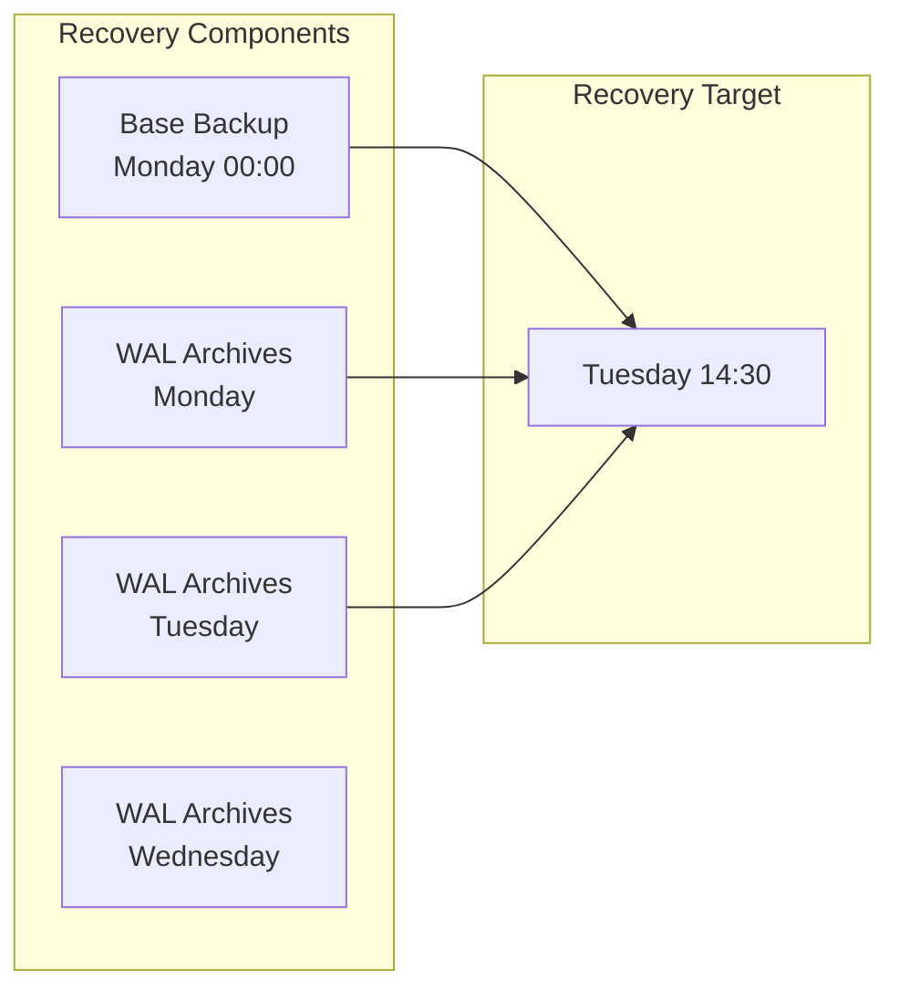

# How to Create PostgreSQL WAL Management

Author: [nawazdhandala](https://github.com/nawazdhandala)

Tags: PostgreSQL, WAL, Replication, Database

Description: Learn how to manage PostgreSQL Write-Ahead Logging for reliability and replication.

---

Write-Ahead Logging (WAL) is the backbone of PostgreSQL's data integrity and replication mechanisms. This guide covers everything you need to know about configuring, managing, and optimizing WAL for production database reliability.

## What is Write-Ahead Logging?

WAL ensures that all changes to the database are written to a log before being applied to the actual data files. This guarantees durability and enables point-in-time recovery, streaming replication, and crash recovery.



## WAL Architecture Overview

PostgreSQL writes changes sequentially to WAL segments, which are fixed-size files (typically 16MB each). Understanding this architecture is crucial for proper configuration.



## Core WAL Configuration Parameters

Configure these essential parameters in your `postgresql.conf` file:

```sql
-- Enable WAL archiving for backup and recovery
-- This is required for point-in-time recovery
wal_level = replica

-- Number of WAL segments to keep for replication
-- Each segment is 16MB by default
-- Formula: wal_keep_size = max_replication_lag_time * wal_generation_rate
wal_keep_size = 1GB

-- Maximum size of WAL files before checkpoint
-- Larger values reduce checkpoint frequency but increase recovery time
max_wal_size = 2GB

-- Minimum size of WAL files to maintain
-- Helps avoid recycling WAL segments too aggressively
min_wal_size = 512MB

-- Enable archiving of WAL segments
archive_mode = on

-- Command to copy WAL segments to archive location
-- %p = path to WAL file, %f = filename only
archive_command = 'cp %p /var/lib/postgresql/wal_archive/%f'

-- Timeout for archive_command execution (in seconds)
archive_timeout = 300
```

## WAL Levels Explained

PostgreSQL offers three WAL levels, each providing different capabilities:



| Level | Use Case | WAL Size Impact |
|-------|----------|-----------------|
| minimal | Development only | Smallest |
| replica | Physical standby, PITR | Medium |
| logical | Logical replication, CDC | Largest |

## Configuring WAL Archiving

WAL archiving copies completed WAL segments to a safe location for backup and recovery purposes.

### Basic Archive Configuration

```sql
-- postgresql.conf settings for WAL archiving

-- Enable archive mode (requires restart)
archive_mode = on

-- Archive command with error handling
-- The command must return 0 on success
archive_command = 'test ! -f /archive/%f && cp %p /archive/%f'

-- Force a segment switch after this many seconds
-- Useful for low-traffic databases to ensure recent changes are archived
archive_timeout = 300
```

### Advanced Archive Script

Create a robust archive script with compression and verification:

```bash
#!/bin/bash
# /usr/local/bin/archive_wal.sh
# WAL archiving script with compression and verification

# Configuration
ARCHIVE_DIR="/var/lib/postgresql/wal_archive"
WAL_FILE="$1"
WAL_NAME="$2"

# Create archive directory if it does not exist
mkdir -p "$ARCHIVE_DIR"

# Check if file already exists (avoid overwriting)
if [ -f "$ARCHIVE_DIR/$WAL_NAME.gz" ]; then
    echo "Archive file already exists: $WAL_NAME.gz"
    exit 0
fi

# Compress and copy the WAL file
gzip -c "$WAL_FILE" > "$ARCHIVE_DIR/$WAL_NAME.gz.tmp"

# Verify the compressed file
if gzip -t "$ARCHIVE_DIR/$WAL_NAME.gz.tmp" 2>/dev/null; then
    # Move to final location atomically
    mv "$ARCHIVE_DIR/$WAL_NAME.gz.tmp" "$ARCHIVE_DIR/$WAL_NAME.gz"
    echo "Successfully archived: $WAL_NAME"
    exit 0
else
    # Remove corrupted file
    rm -f "$ARCHIVE_DIR/$WAL_NAME.gz.tmp"
    echo "Failed to archive: $WAL_NAME"
    exit 1
fi
```

Configure PostgreSQL to use this script:

```sql
-- Use the custom archive script
archive_command = '/usr/local/bin/archive_wal.sh %p %f'
```

## Replication Slots

Replication slots ensure that the primary server retains WAL segments needed by standbys, preventing data loss during network outages.



### Creating and Managing Replication Slots

```sql
-- Create a physical replication slot for streaming replication
-- The slot name should be unique and descriptive
SELECT pg_create_physical_replication_slot('standby_slot_1');

-- Create a logical replication slot for logical replication
-- Requires wal_level = logical
SELECT pg_create_logical_replication_slot(
    'logical_slot_1',  -- slot name
    'pgoutput'         -- output plugin
);

-- View all replication slots and their status
SELECT
    slot_name,
    slot_type,
    active,
    restart_lsn,
    confirmed_flush_lsn,
    pg_size_pretty(
        pg_wal_lsn_diff(pg_current_wal_lsn(), restart_lsn)
    ) AS retained_wal
FROM pg_replication_slots;

-- Drop a replication slot that is no longer needed
-- WARNING: This allows WAL to be recycled, potentially breaking replication
SELECT pg_drop_replication_slot('standby_slot_1');
```

### Monitoring Slot Lag

```sql
-- Monitor replication slot lag and WAL retention
SELECT
    slot_name,
    slot_type,
    active,
    -- Calculate how far behind each slot is
    pg_size_pretty(
        pg_wal_lsn_diff(
            pg_current_wal_lsn(),
            restart_lsn
        )
    ) AS slot_lag,
    -- Show the oldest WAL position needed
    restart_lsn,
    -- For logical slots, show confirmed position
    confirmed_flush_lsn
FROM pg_replication_slots
ORDER BY
    pg_wal_lsn_diff(pg_current_wal_lsn(), restart_lsn) DESC;
```

## WAL Sizing and Retention Strategies

Proper WAL sizing prevents disk space issues while ensuring adequate recovery windows.



### Calculating WAL Size Requirements

```sql
-- Monitor WAL generation rate over time
-- Run this query periodically to understand your WAL patterns

-- Get current WAL position
SELECT pg_current_wal_lsn() AS current_lsn;

-- Calculate WAL generated in the last hour
-- Requires pg_stat_statements or custom logging
SELECT
    pg_size_pretty(
        pg_wal_lsn_diff(
            pg_current_wal_lsn(),
            '0/0'::pg_lsn
        )
    ) AS total_wal_generated;

-- View WAL statistics
SELECT * FROM pg_stat_wal;
```

### Recommended Settings by Workload

```sql
-- Small database (< 100GB, low traffic)
max_wal_size = 1GB
min_wal_size = 256MB
wal_keep_size = 512MB
checkpoint_completion_target = 0.9

-- Medium database (100GB - 1TB, moderate traffic)
max_wal_size = 4GB
min_wal_size = 1GB
wal_keep_size = 2GB
checkpoint_completion_target = 0.9

-- Large database (> 1TB, high traffic)
max_wal_size = 16GB
min_wal_size = 4GB
wal_keep_size = 8GB
checkpoint_completion_target = 0.9
```

### Automated WAL Cleanup Script

```bash
#!/bin/bash
# /usr/local/bin/cleanup_wal_archive.sh
# Clean up old WAL archives while respecting retention policy

# Configuration
ARCHIVE_DIR="/var/lib/postgresql/wal_archive"
RETENTION_DAYS=7
MIN_FREE_SPACE_GB=50

# Get current free space in GB
FREE_SPACE=$(df -BG "$ARCHIVE_DIR" | tail -1 | awk '{print $4}' | tr -d 'G')

# Calculate retention based on available space
if [ "$FREE_SPACE" -lt "$MIN_FREE_SPACE_GB" ]; then
    echo "Low disk space detected: ${FREE_SPACE}GB free"
    # Reduce retention when space is low
    RETENTION_DAYS=3
fi

# Find and remove old WAL files
find "$ARCHIVE_DIR" -name "*.gz" -type f -mtime +$RETENTION_DAYS -delete

# Log cleanup results
REMAINING_FILES=$(ls -1 "$ARCHIVE_DIR"/*.gz 2>/dev/null | wc -l)
echo "WAL cleanup complete. Remaining files: $REMAINING_FILES"
```

## Monitoring WAL Health

Effective monitoring prevents WAL-related issues before they impact production.

### Key Metrics to Monitor

```sql
-- Comprehensive WAL health check query
WITH wal_stats AS (
    SELECT
        pg_current_wal_lsn() AS current_lsn,
        pg_walfile_name(pg_current_wal_lsn()) AS current_wal_file
)
SELECT
    w.current_wal_file,
    -- Check archive status
    (SELECT count(*) FROM pg_stat_archiver) AS archive_count,
    (SELECT last_archived_wal FROM pg_stat_archiver) AS last_archived,
    (SELECT last_archived_time FROM pg_stat_archiver) AS last_archive_time,
    (SELECT failed_count FROM pg_stat_archiver) AS archive_failures,
    -- Check replication status
    (SELECT count(*) FROM pg_stat_replication) AS active_replicas,
    -- Check slot status
    (SELECT count(*) FROM pg_replication_slots WHERE NOT active) AS inactive_slots
FROM wal_stats w;

-- Monitor WAL generation rate
SELECT
    stats_reset,
    wal_records,
    wal_fpi,
    wal_bytes,
    pg_size_pretty(wal_bytes) AS wal_size_pretty,
    wal_buffers_full,
    wal_write,
    wal_sync
FROM pg_stat_wal;
```

### Alert Thresholds

```sql
-- Create a monitoring view for alerting
CREATE OR REPLACE VIEW wal_health_alerts AS
SELECT
    CASE
        WHEN archive_fail_count > 0
        THEN 'CRITICAL: WAL archiving failures detected'
        ELSE 'OK'
    END AS archive_status,

    CASE
        WHEN inactive_slot_count > 0
        THEN 'WARNING: Inactive replication slots found'
        ELSE 'OK'
    END AS slot_status,

    CASE
        WHEN max_slot_lag_bytes > 1073741824  -- 1GB
        THEN 'WARNING: High replication slot lag'
        ELSE 'OK'
    END AS lag_status
FROM (
    SELECT
        (SELECT failed_count FROM pg_stat_archiver) AS archive_fail_count,
        (SELECT count(*) FROM pg_replication_slots WHERE NOT active) AS inactive_slot_count,
        (SELECT max(pg_wal_lsn_diff(pg_current_wal_lsn(), restart_lsn))
         FROM pg_replication_slots) AS max_slot_lag_bytes
) metrics;
```

## Streaming Replication Setup

Configure streaming replication for high availability.



### Primary Server Configuration

```sql
-- postgresql.conf on primary

-- Enable replication connections
wal_level = replica

-- Maximum number of concurrent replication connections
max_wal_senders = 10

-- Keep enough WAL for standbys
wal_keep_size = 2GB

-- Enable replication slots
max_replication_slots = 10

-- Synchronous replication (optional)
-- synchronous_standby_names = 'standby1,standby2'
-- synchronous_commit = on
```

### pg_hba.conf Configuration

```conf
# Allow replication connections from standby servers
# TYPE  DATABASE        USER            ADDRESS                 METHOD

# Replication connections from specific standby IPs
host    replication     replicator      192.168.1.10/32         scram-sha-256
host    replication     replicator      192.168.1.11/32         scram-sha-256

# Replication connections from subnet (less secure)
# host    replication     replicator      192.168.1.0/24          scram-sha-256
```

### Standby Server Configuration

```sql
-- postgresql.conf on standby

-- Connection to primary server
primary_conninfo = 'host=192.168.1.1 port=5432 user=replicator password=secret_password application_name=standby1'

-- Use a replication slot to prevent WAL removal
primary_slot_name = 'standby_slot_1'

-- Hot standby allows read queries on the standby
hot_standby = on

-- Feedback to primary about replay progress
hot_standby_feedback = on
```

## Point-in-Time Recovery (PITR)

PITR allows you to restore a database to any point in time using base backups and WAL archives.



### Creating a Base Backup

```bash
#!/bin/bash
# Create a base backup for PITR

# Using pg_basebackup
pg_basebackup \
    --host=localhost \
    --port=5432 \
    --username=replicator \
    --pgdata=/var/lib/postgresql/backup/base \
    --format=tar \
    --gzip \
    --checkpoint=fast \
    --label="Daily backup $(date +%Y-%m-%d)" \
    --progress \
    --verbose

# Verify the backup
echo "Backup completed at $(date)"
ls -la /var/lib/postgresql/backup/base/
```

### Recovery Configuration

```sql
-- recovery.conf or postgresql.conf (PostgreSQL 12+)

-- Specify the command to retrieve archived WAL files
restore_command = 'cp /var/lib/postgresql/wal_archive/%f %p'

-- Recovery target options (choose one)

-- Recover to a specific timestamp
recovery_target_time = '2024-01-15 14:30:00'

-- Recover to a specific transaction ID
-- recovery_target_xid = '12345678'

-- Recover to a named restore point
-- recovery_target_name = 'before_migration'

-- Recover to the end of the backup (latest possible)
-- recovery_target = 'immediate'

-- Include or exclude the target transaction
recovery_target_inclusive = true

-- Action after recovery completes
recovery_target_action = 'promote'
```

## Best Practices Summary

### Configuration Checklist

```sql
-- Essential production WAL settings
-- Add these to your postgresql.conf

-- Core WAL settings
wal_level = replica                    -- Enable replication features
max_wal_size = 4GB                     -- Adjust based on transaction volume
min_wal_size = 1GB                     -- Prevent excessive WAL recycling
wal_keep_size = 2GB                    -- Retain WAL for replication lag

-- Archiving
archive_mode = on                      -- Enable WAL archiving
archive_command = 'your_archive_script %p %f'

-- Replication
max_wal_senders = 10                   -- Allow multiple replication connections
max_replication_slots = 10             -- Support multiple slots

-- Checkpoints
checkpoint_timeout = 15min             -- Maximum time between checkpoints
checkpoint_completion_target = 0.9     -- Spread checkpoint I/O

-- WAL writing
wal_compression = on                   -- Compress WAL to save space
wal_buffers = 64MB                     -- WAL buffer size (adjust for high traffic)
```

### Operational Guidelines

1. **Monitor WAL generation rate** to predict disk space requirements
2. **Set up alerts** for archive failures and replication lag
3. **Test recovery procedures** regularly in a non-production environment
4. **Clean up inactive replication slots** to prevent unbounded WAL retention
5. **Use checksums** for WAL verification (enabled at initdb)
6. **Document your recovery procedures** and keep them updated

## Troubleshooting Common Issues

### WAL Accumulation

```sql
-- Identify what is preventing WAL cleanup
SELECT
    slot_name,
    slot_type,
    active,
    pg_size_pretty(
        pg_wal_lsn_diff(pg_current_wal_lsn(), restart_lsn)
    ) AS retained_wal
FROM pg_replication_slots
WHERE pg_wal_lsn_diff(pg_current_wal_lsn(), restart_lsn) > 1073741824
ORDER BY pg_wal_lsn_diff(pg_current_wal_lsn(), restart_lsn) DESC;

-- Check archive status for stuck archiving
SELECT * FROM pg_stat_archiver;
```

### Archive Failures

```sql
-- Check for archive failures
SELECT
    archived_count,
    failed_count,
    last_archived_wal,
    last_archived_time,
    last_failed_wal,
    last_failed_time
FROM pg_stat_archiver;

-- Reset archive stats after fixing issues
SELECT pg_stat_reset_shared('archiver');
```

## Conclusion

Effective WAL management is essential for PostgreSQL database reliability. By properly configuring WAL settings, implementing robust archiving, and monitoring key metrics, you can ensure data durability, enable high availability through replication, and maintain the ability to recover from any failure scenario.

Key takeaways:
- Set `wal_level = replica` for production systems
- Configure appropriate `max_wal_size` and `wal_keep_size` based on your workload
- Use replication slots to prevent WAL removal during replication lag
- Monitor archive status and replication health continuously
- Test your recovery procedures regularly

With these practices in place, your PostgreSQL infrastructure will be well-prepared for both planned maintenance and unexpected failures.
