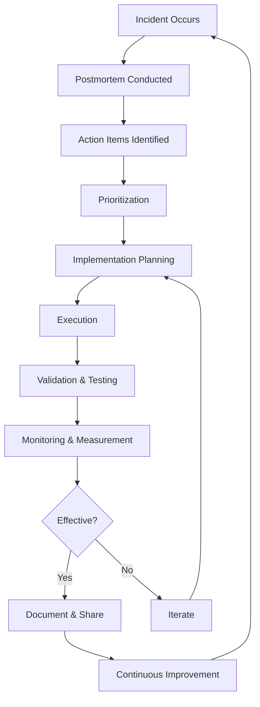
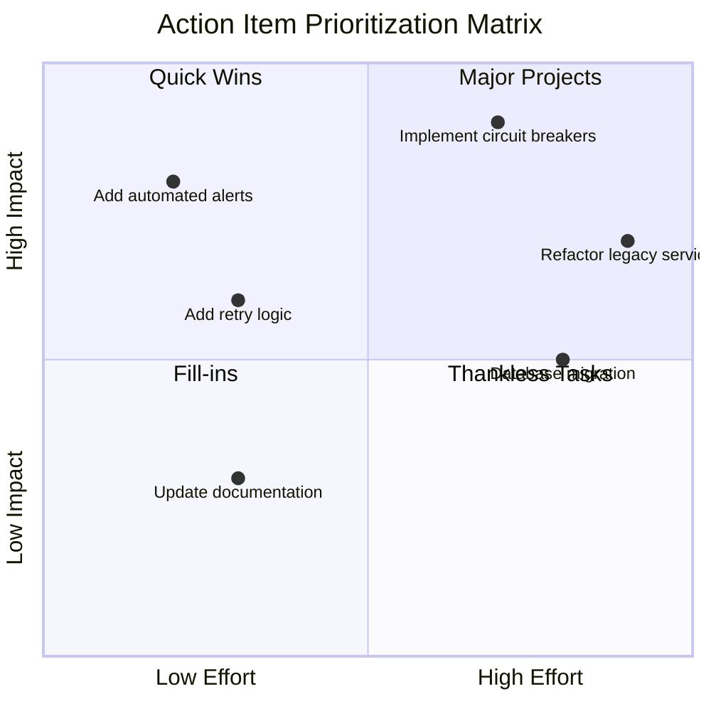
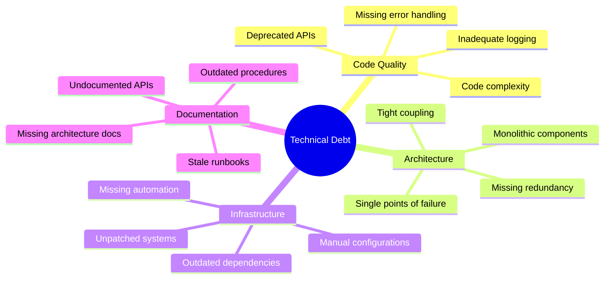
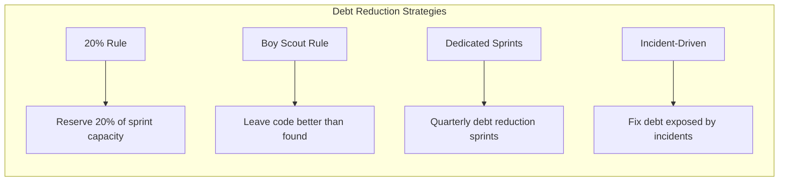
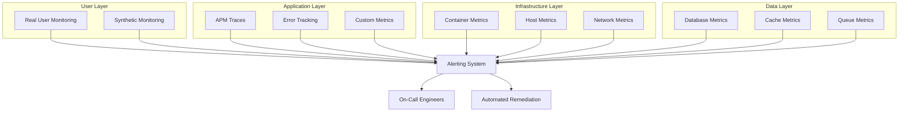
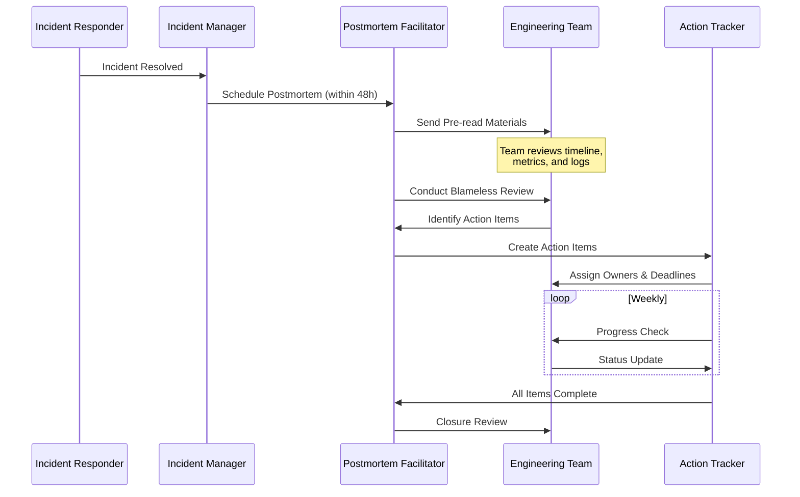
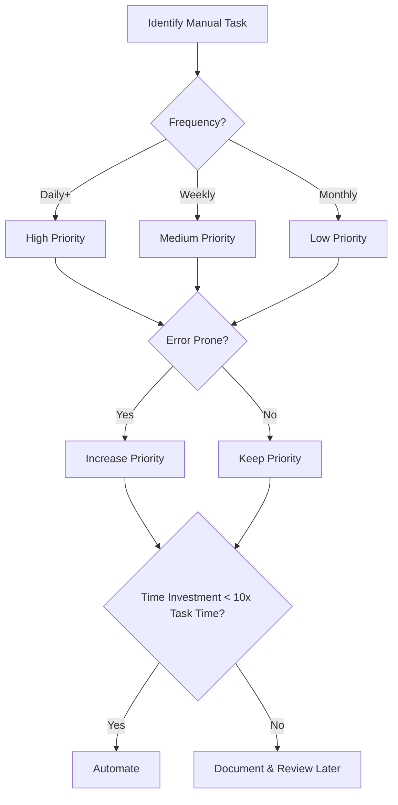
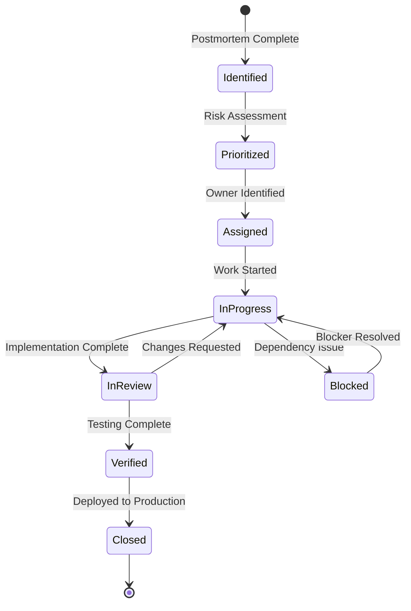
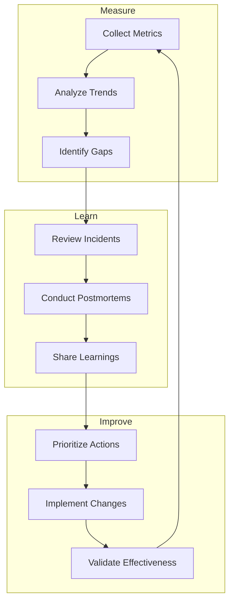

# How to Implement Prevention Implementation

Author: [nawazdhandala](https://github.com/nawazdhandala)

Tags: Incident Management, Prevention, SRE, Reliability

Description: Learn how to implement preventive measures from incident learnings.

Incidents are inevitable in any complex system. However, the true measure of a mature engineering organization is not the absence of incidents, but how effectively it learns from them and implements preventive measures. This post provides a comprehensive guide to implementing prevention strategies that emerge from incident postmortems and continuous improvement initiatives.

## The Prevention Implementation Lifecycle

Before diving into specific strategies, let us understand the complete lifecycle of prevention implementation:



## Action Item Prioritization

Not all preventive measures are created equal. Effective prioritization ensures that limited engineering resources are directed toward the highest-impact improvements.

### The Impact-Effort Matrix

Use this framework to categorize and prioritize action items:



### Prioritization Scoring System

Implement a quantitative scoring system for action items:

```typescript
interface ActionItem {
  id: string;
  title: string;
  description: string;
  incidentId: string;
  owner: string;
  status: 'pending' | 'in_progress' | 'completed' | 'blocked';
  createdAt: Date;
  dueDate: Date;
}

interface PrioritizationScore {
  actionItemId: string;
  impactScore: number;      // 1-10: How much will this reduce incident likelihood/severity?
  effortScore: number;      // 1-10: How much effort is required? (1 = low effort, 10 = high effort)
  riskScore: number;        // 1-10: Risk of recurrence without this fix
  dependencyScore: number;  // 1-10: How many other items depend on this?
  finalPriority: number;
}

function calculatePriority(scores: Omit<PrioritizationScore, 'finalPriority'>): number {
  // Weight factors based on organizational priorities
  const weights = {
    impact: 0.35,
    effort: 0.25,    // Inverted: lower effort = higher priority
    risk: 0.25,
    dependency: 0.15
  };

  const normalizedEffort = 11 - scores.effortScore; // Invert effort score

  return (
    scores.impactScore * weights.impact +
    normalizedEffort * weights.effort +
    scores.riskScore * weights.risk +
    scores.dependencyScore * weights.dependency
  );
}

// Example usage
const actionItemScores: Omit<PrioritizationScore, 'finalPriority'> = {
  actionItemId: 'AI-2024-001',
  impactScore: 9,
  effortScore: 3,
  riskScore: 8,
  dependencyScore: 6
};

const priority = calculatePriority(actionItemScores);
console.log(`Priority Score: ${priority.toFixed(2)}`); // Output: Priority Score: 7.90
```

### SLA-Based Prioritization

Align action items with your Service Level Objectives:

```typescript
interface SLOTarget {
  metric: string;
  target: number;
  current: number;
  errorBudgetRemaining: number; // percentage
}

interface ActionItemWithSLO extends ActionItem {
  affectedSLOs: string[];
  estimatedSLOImprovement: number; // percentage points
}

function prioritizeBySLOImpact(
  actionItems: ActionItemWithSLO[],
  sloTargets: Map<string, SLOTarget>
): ActionItemWithSLO[] {
  return actionItems.sort((a, b) => {
    // Calculate urgency based on error budget depletion
    const aUrgency = a.affectedSLOs.reduce((sum, slo) => {
      const target = sloTargets.get(slo);
      if (!target) return sum;
      // Lower error budget = higher urgency
      return sum + (100 - target.errorBudgetRemaining);
    }, 0);

    const bUrgency = b.affectedSLOs.reduce((sum, slo) => {
      const target = sloTargets.get(slo);
      if (!target) return sum;
      return sum + (100 - target.errorBudgetRemaining);
    }, 0);

    // Factor in estimated improvement
    const aScore = aUrgency * a.estimatedSLOImprovement;
    const bScore = bUrgency * b.estimatedSLOImprovement;

    return bScore - aScore; // Descending order
  });
}
```

## Technical Debt Reduction

Incidents often expose underlying technical debt. Strategic debt reduction prevents future incidents.

### Technical Debt Classification



### Debt Tracking System

Implement a systematic approach to track and address technical debt:

```typescript
enum DebtCategory {
  CODE_QUALITY = 'code_quality',
  ARCHITECTURE = 'architecture',
  INFRASTRUCTURE = 'infrastructure',
  DOCUMENTATION = 'documentation',
  SECURITY = 'security',
  TESTING = 'testing'
}

enum DebtSeverity {
  CRITICAL = 1,  // Immediate risk of incident
  HIGH = 2,      // Likely to cause incidents within 3 months
  MEDIUM = 3,    // May contribute to incidents within 6 months
  LOW = 4        // Long-term maintenance concern
}

interface TechnicalDebtItem {
  id: string;
  title: string;
  description: string;
  category: DebtCategory;
  severity: DebtSeverity;
  affectedServices: string[];
  estimatedEffortDays: number;
  linkedIncidents: string[];
  createdAt: Date;
  targetResolutionDate: Date | null;
  owner: string | null;
}

class TechnicalDebtTracker {
  private debtItems: Map<string, TechnicalDebtItem> = new Map();

  addDebtItem(item: TechnicalDebtItem): void {
    this.debtItems.set(item.id, item);
  }

  linkIncidentToDebt(debtId: string, incidentId: string): void {
    const item = this.debtItems.get(debtId);
    if (item && !item.linkedIncidents.includes(incidentId)) {
      item.linkedIncidents.push(incidentId);
      // Automatically elevate severity if multiple incidents are linked
      if (item.linkedIncidents.length >= 3 && item.severity > DebtSeverity.HIGH) {
        item.severity = DebtSeverity.HIGH;
      }
    }
  }

  getDebtByService(serviceName: string): TechnicalDebtItem[] {
    return Array.from(this.debtItems.values())
      .filter(item => item.affectedServices.includes(serviceName))
      .sort((a, b) => a.severity - b.severity);
  }

  getDebtReport(): DebtReport {
    const items = Array.from(this.debtItems.values());

    return {
      totalItems: items.length,
      byCategory: this.groupBy(items, 'category'),
      bySeverity: this.groupBy(items, 'severity'),
      totalEstimatedDays: items.reduce((sum, item) => sum + item.estimatedEffortDays, 0),
      incidentLinkedCount: items.filter(item => item.linkedIncidents.length > 0).length
    };
  }

  private groupBy<K extends keyof TechnicalDebtItem>(
    items: TechnicalDebtItem[],
    key: K
  ): Record<string, number> {
    return items.reduce((acc, item) => {
      const value = String(item[key]);
      acc[value] = (acc[value] || 0) + 1;
      return acc;
    }, {} as Record<string, number>);
  }
}

interface DebtReport {
  totalItems: number;
  byCategory: Record<string, number>;
  bySeverity: Record<string, number>;
  totalEstimatedDays: number;
  incidentLinkedCount: number;
}
```

### Debt Reduction Strategies



## Monitoring Improvements

Effective prevention requires proactive monitoring that detects issues before they become incidents.

### Multi-Layer Monitoring Architecture



### Implementing Proactive Alerts

Move from reactive to proactive alerting:

```typescript
interface AlertRule {
  id: string;
  name: string;
  metric: string;
  condition: AlertCondition;
  severity: 'critical' | 'warning' | 'info';
  runbook: string;
  escalationPolicy: string;
}

interface AlertCondition {
  operator: '>' | '<' | '>=' | '<=' | '==' | '!=';
  threshold: number;
  duration: string;  // e.g., "5m", "15m"
  aggregation: 'avg' | 'max' | 'min' | 'sum' | 'p95' | 'p99';
}

// Proactive alert examples
const proactiveAlerts: AlertRule[] = [
  {
    id: 'disk-usage-warning',
    name: 'Disk Usage Approaching Capacity',
    metric: 'node_filesystem_avail_bytes',
    condition: {
      operator: '<',
      threshold: 20, // 20% remaining
      duration: '15m',
      aggregation: 'min'
    },
    severity: 'warning',
    runbook: 'https://wiki.example.com/runbooks/disk-cleanup',
    escalationPolicy: 'infrastructure-team'
  },
  {
    id: 'error-rate-trend',
    name: 'Error Rate Trending Up',
    metric: 'http_requests_total{status=~"5.."}',
    condition: {
      operator: '>',
      threshold: 150, // 150% of baseline
      duration: '10m',
      aggregation: 'avg'
    },
    severity: 'warning',
    runbook: 'https://wiki.example.com/runbooks/error-rate-investigation',
    escalationPolicy: 'application-team'
  },
  {
    id: 'certificate-expiry',
    name: 'SSL Certificate Expiring Soon',
    metric: 'ssl_certificate_expiry_days',
    condition: {
      operator: '<',
      threshold: 30,
      duration: '1h',
      aggregation: 'min'
    },
    severity: 'warning',
    runbook: 'https://wiki.example.com/runbooks/certificate-renewal',
    escalationPolicy: 'security-team'
  }
];

// Anomaly detection for proactive alerting
class AnomalyDetector {
  private historicalData: Map<string, number[]> = new Map();
  private readonly windowSize = 168; // 1 week of hourly data points

  recordMetric(metricName: string, value: number): void {
    const history = this.historicalData.get(metricName) || [];
    history.push(value);

    // Keep only the window size
    if (history.length > this.windowSize) {
      history.shift();
    }

    this.historicalData.set(metricName, history);
  }

  detectAnomaly(metricName: string, currentValue: number): AnomalyResult {
    const history = this.historicalData.get(metricName);

    if (!history || history.length < this.windowSize / 2) {
      return { isAnomaly: false, confidence: 0, reason: 'Insufficient data' };
    }

    const mean = history.reduce((a, b) => a + b, 0) / history.length;
    const stdDev = Math.sqrt(
      history.reduce((sum, val) => sum + Math.pow(val - mean, 2), 0) / history.length
    );

    const zScore = (currentValue - mean) / stdDev;
    const isAnomaly = Math.abs(zScore) > 3; // 3 sigma rule

    return {
      isAnomaly,
      confidence: Math.min(Math.abs(zScore) / 5, 1), // Normalize to 0-1
      reason: isAnomaly
        ? `Value ${currentValue} is ${zScore.toFixed(2)} standard deviations from mean ${mean.toFixed(2)}`
        : 'Value within normal range',
      zScore,
      mean,
      stdDev
    };
  }
}

interface AnomalyResult {
  isAnomaly: boolean;
  confidence: number;
  reason: string;
  zScore?: number;
  mean?: number;
  stdDev?: number;
}
```

### Alert Quality Metrics

Track and improve alert effectiveness:

```typescript
interface AlertMetrics {
  alertId: string;
  totalFired: number;
  truePositives: number;
  falsePositives: number;
  missedIncidents: number;
  averageResponseTime: number; // seconds
  averageResolutionTime: number; // seconds
}

function calculateAlertQuality(metrics: AlertMetrics): AlertQualityScore {
  const precision = metrics.truePositives / (metrics.truePositives + metrics.falsePositives);
  const recall = metrics.truePositives / (metrics.truePositives + metrics.missedIncidents);
  const f1Score = 2 * (precision * recall) / (precision + recall);

  return {
    alertId: metrics.alertId,
    precision: isNaN(precision) ? 0 : precision,
    recall: isNaN(recall) ? 0 : recall,
    f1Score: isNaN(f1Score) ? 0 : f1Score,
    actionability: metrics.truePositives / metrics.totalFired,
    recommendations: generateRecommendations(metrics, precision, recall)
  };
}

interface AlertQualityScore {
  alertId: string;
  precision: number;
  recall: number;
  f1Score: number;
  actionability: number;
  recommendations: string[];
}

function generateRecommendations(
  metrics: AlertMetrics,
  precision: number,
  recall: number
): string[] {
  const recommendations: string[] = [];

  if (precision < 0.7) {
    recommendations.push('High false positive rate - consider raising threshold or adding conditions');
  }

  if (recall < 0.8) {
    recommendations.push('Missing incidents - consider lowering threshold or adding new detection methods');
  }

  if (metrics.averageResponseTime > 300) {
    recommendations.push('Slow response time - review escalation policy and notification channels');
  }

  if (metrics.totalFired > 100 && precision < 0.5) {
    recommendations.push('Alert fatigue risk - this alert may be causing on-call burnout');
  }

  return recommendations;
}
```

## Process Improvements

Beyond technical fixes, process improvements prevent entire categories of incidents.

### Incident Response Process Maturity Model

```mermaid
flowchart LR
    subgraph Level1["Level 1: Ad-hoc"]
        A1[Reactive response]
        A2[No documentation]
        A3[Tribal knowledge]
    end

    subgraph Level2["Level 2: Defined"]
        B1[Basic runbooks]
        B2[On-call rotation]
        B3[Incident channels]
    end

    subgraph Level3["Level 3: Managed"]
        C1[Postmortems conducted]
        C2[Action items tracked]
        C3[Metrics measured]
    end

    subgraph Level4["Level 4: Optimized"]
        D1[Automated detection]
        D2[Self-healing systems]
        D3[Continuous improvement]
    end

    Level1 --> Level2 --> Level3 --> Level4
```



### Change Management Process

Implement a robust change management process to prevent change-induced incidents:

```typescript
interface ChangeRequest {
  id: string;
  title: string;
  description: string;
  type: 'standard' | 'normal' | 'emergency';
  riskLevel: 'low' | 'medium' | 'high' | 'critical';
  affectedServices: string[];
  implementationPlan: string;
  rollbackPlan: string;
  testingEvidence: string;
  approvers: string[];
  scheduledTime: Date;
  maintenanceWindow: boolean;
}

interface ChangeValidation {
  isValid: boolean;
  errors: string[];
  warnings: string[];
  riskScore: number;
}

function validateChangeRequest(change: ChangeRequest): ChangeValidation {
  const errors: string[] = [];
  const warnings: string[] = [];
  let riskScore = 0;

  // Mandatory validations
  if (!change.rollbackPlan || change.rollbackPlan.length < 50) {
    errors.push('Rollback plan is missing or insufficient');
    riskScore += 30;
  }

  if (!change.testingEvidence) {
    errors.push('Testing evidence is required');
    riskScore += 25;
  }

  if (change.affectedServices.length === 0) {
    errors.push('Must specify affected services');
    riskScore += 15;
  }

  // Risk-based validations
  if (change.riskLevel === 'critical' && change.approvers.length < 2) {
    errors.push('Critical changes require at least 2 approvers');
  }

  if (change.riskLevel === 'high' && !change.maintenanceWindow) {
    warnings.push('High-risk changes should be scheduled during maintenance windows');
    riskScore += 20;
  }

  // Time-based validations
  const hour = change.scheduledTime.getHours();
  const dayOfWeek = change.scheduledTime.getDay();

  if (change.riskLevel !== 'low' && (dayOfWeek === 5 || dayOfWeek === 6)) {
    warnings.push('Non-low-risk changes on weekends require additional justification');
    riskScore += 15;
  }

  if (hour >= 17 || hour < 9) {
    warnings.push('Changes outside business hours may have delayed support');
    riskScore += 10;
  }

  // Service criticality check
  const criticalServices = ['payment-service', 'auth-service', 'api-gateway'];
  const affectsCritical = change.affectedServices.some(s => criticalServices.includes(s));

  if (affectsCritical && change.type !== 'emergency') {
    warnings.push('This change affects critical services - ensure all stakeholders are notified');
    riskScore += 20;
  }

  return {
    isValid: errors.length === 0,
    errors,
    warnings,
    riskScore: Math.min(riskScore, 100)
  };
}

// Automated pre-deployment checks
interface PreDeploymentCheck {
  name: string;
  check: () => Promise<boolean>;
  required: boolean;
  remediation: string;
}

const preDeploymentChecks: PreDeploymentCheck[] = [
  {
    name: 'Unit Tests Pass',
    check: async () => {
      // Run unit tests
      return true;
    },
    required: true,
    remediation: 'Fix failing unit tests before deployment'
  },
  {
    name: 'Integration Tests Pass',
    check: async () => {
      // Run integration tests
      return true;
    },
    required: true,
    remediation: 'Fix failing integration tests before deployment'
  },
  {
    name: 'No Critical Vulnerabilities',
    check: async () => {
      // Run security scan
      return true;
    },
    required: true,
    remediation: 'Address critical vulnerabilities identified by security scan'
  },
  {
    name: 'Database Migrations Reversible',
    check: async () => {
      // Verify migration rollback scripts exist
      return true;
    },
    required: false,
    remediation: 'Create rollback migration script'
  },
  {
    name: 'Feature Flags in Place',
    check: async () => {
      // Check for feature flag configuration
      return true;
    },
    required: false,
    remediation: 'Wrap new features in feature flags for safe rollout'
  }
];
```

### Post-Incident Review Process



## Automation Opportunities

Automation reduces human error and accelerates incident prevention.

### Automation Decision Framework



### Self-Healing Infrastructure

Implement automated remediation for common issues:

```typescript
interface RemediationAction {
  id: string;
  name: string;
  trigger: AlertTrigger;
  action: () => Promise<RemediationResult>;
  maxRetries: number;
  cooldownMinutes: number;
  requiresApproval: boolean;
  notifyOnExecution: string[];
}

interface AlertTrigger {
  alertName: string;
  conditions: Record<string, string>;
}

interface RemediationResult {
  success: boolean;
  action: string;
  details: string;
  timestamp: Date;
  requiresFollowUp: boolean;
}

class AutomatedRemediation {
  private lastExecution: Map<string, Date> = new Map();
  private retryCount: Map<string, number> = new Map();

  async executeRemediation(
    remediation: RemediationAction,
    alert: any
  ): Promise<RemediationResult> {
    // Check cooldown
    const lastRun = this.lastExecution.get(remediation.id);
    if (lastRun) {
      const cooldownMs = remediation.cooldownMinutes * 60 * 1000;
      if (Date.now() - lastRun.getTime() < cooldownMs) {
        return {
          success: false,
          action: 'skipped',
          details: 'Remediation in cooldown period',
          timestamp: new Date(),
          requiresFollowUp: false
        };
      }
    }

    // Check retry limit
    const retries = this.retryCount.get(remediation.id) || 0;
    if (retries >= remediation.maxRetries) {
      return {
        success: false,
        action: 'escalated',
        details: `Max retries (${remediation.maxRetries}) exceeded - escalating to human`,
        timestamp: new Date(),
        requiresFollowUp: true
      };
    }

    try {
      // Execute the remediation
      const result = await remediation.action();

      // Reset retry count on success
      if (result.success) {
        this.retryCount.set(remediation.id, 0);
      } else {
        this.retryCount.set(remediation.id, retries + 1);
      }

      this.lastExecution.set(remediation.id, new Date());

      // Notify stakeholders
      await this.notifyStakeholders(remediation.notifyOnExecution, result);

      return result;
    } catch (error) {
      this.retryCount.set(remediation.id, retries + 1);
      return {
        success: false,
        action: 'failed',
        details: `Remediation failed: ${error}`,
        timestamp: new Date(),
        requiresFollowUp: true
      };
    }
  }

  private async notifyStakeholders(
    stakeholders: string[],
    result: RemediationResult
  ): Promise<void> {
    // Implementation for notifications
    console.log(`Notifying ${stakeholders.join(', ')} of remediation result`);
  }
}

// Example remediation actions
const remediationActions: RemediationAction[] = [
  {
    id: 'restart-unhealthy-pod',
    name: 'Restart Unhealthy Pod',
    trigger: {
      alertName: 'PodCrashLooping',
      conditions: { namespace: 'production' }
    },
    action: async () => {
      // kubectl delete pod implementation
      return {
        success: true,
        action: 'pod_restart',
        details: 'Deleted crashlooping pod, new instance starting',
        timestamp: new Date(),
        requiresFollowUp: false
      };
    },
    maxRetries: 3,
    cooldownMinutes: 15,
    requiresApproval: false,
    notifyOnExecution: ['oncall-slack-channel']
  },
  {
    id: 'scale-up-deployment',
    name: 'Scale Up Deployment',
    trigger: {
      alertName: 'HighCPUUtilization',
      conditions: { threshold: '80' }
    },
    action: async () => {
      // kubectl scale implementation
      return {
        success: true,
        action: 'horizontal_scale',
        details: 'Scaled deployment from 3 to 5 replicas',
        timestamp: new Date(),
        requiresFollowUp: true // Review if scaling was appropriate
      };
    },
    maxRetries: 2,
    cooldownMinutes: 30,
    requiresApproval: false,
    notifyOnExecution: ['oncall-slack-channel', 'capacity-planning-team']
  },
  {
    id: 'failover-database',
    name: 'Database Failover',
    trigger: {
      alertName: 'DatabasePrimaryUnhealthy',
      conditions: { database: 'production-db' }
    },
    action: async () => {
      // Database failover implementation
      return {
        success: true,
        action: 'database_failover',
        details: 'Promoted replica to primary, old primary marked for investigation',
        timestamp: new Date(),
        requiresFollowUp: true
      };
    },
    maxRetries: 1,
    cooldownMinutes: 60,
    requiresApproval: true, // High-risk action requires approval
    notifyOnExecution: ['oncall-slack-channel', 'dba-team', 'incident-channel']
  }
];
```

### Chaos Engineering for Prevention

Proactively discover weaknesses before they cause incidents:

```typescript
interface ChaosExperiment {
  id: string;
  name: string;
  description: string;
  targetService: string;
  faultType: FaultType;
  parameters: Record<string, any>;
  steadyStateHypothesis: SteadyStateHypothesis;
  rollbackProcedure: string;
  schedule: string; // cron expression
}

enum FaultType {
  NETWORK_LATENCY = 'network_latency',
  NETWORK_PARTITION = 'network_partition',
  POD_FAILURE = 'pod_failure',
  CPU_STRESS = 'cpu_stress',
  MEMORY_STRESS = 'memory_stress',
  DISK_STRESS = 'disk_stress',
  DNS_FAILURE = 'dns_failure'
}

interface SteadyStateHypothesis {
  metric: string;
  operator: '>' | '<' | '>=' | '<=' | '==' | '!=';
  threshold: number;
  duration: string;
}

interface ExperimentResult {
  experimentId: string;
  startTime: Date;
  endTime: Date;
  hypothesis: SteadyStateHypothesis;
  actualValue: number;
  passed: boolean;
  observations: string[];
  actionItems: string[];
}

class ChaosRunner {
  async runExperiment(experiment: ChaosExperiment): Promise<ExperimentResult> {
    const startTime = new Date();
    const observations: string[] = [];
    const actionItems: string[] = [];

    try {
      // Verify steady state before experiment
      const baselineValue = await this.measureMetric(experiment.steadyStateHypothesis.metric);
      observations.push(`Baseline ${experiment.steadyStateHypothesis.metric}: ${baselineValue}`);

      // Inject fault
      await this.injectFault(experiment.faultType, experiment.parameters);
      observations.push(`Fault injected: ${experiment.faultType}`);

      // Wait for system to react
      await this.wait(30000); // 30 seconds

      // Measure during fault
      const duringFaultValue = await this.measureMetric(experiment.steadyStateHypothesis.metric);
      observations.push(`During fault ${experiment.steadyStateHypothesis.metric}: ${duringFaultValue}`);

      // Remove fault
      await this.removeFault(experiment.faultType);
      observations.push('Fault removed');

      // Wait for recovery
      await this.wait(60000); // 60 seconds

      // Measure after recovery
      const recoveryValue = await this.measureMetric(experiment.steadyStateHypothesis.metric);
      observations.push(`After recovery ${experiment.steadyStateHypothesis.metric}: ${recoveryValue}`);

      // Evaluate hypothesis
      const passed = this.evaluateHypothesis(
        experiment.steadyStateHypothesis,
        duringFaultValue
      );

      if (!passed) {
        actionItems.push(`System did not maintain steady state during ${experiment.faultType}`);
        actionItems.push(`Investigate resilience of ${experiment.targetService}`);
      }

      return {
        experimentId: experiment.id,
        startTime,
        endTime: new Date(),
        hypothesis: experiment.steadyStateHypothesis,
        actualValue: duringFaultValue,
        passed,
        observations,
        actionItems
      };
    } catch (error) {
      // Emergency rollback
      await this.removeFault(experiment.faultType);
      throw error;
    }
  }

  private async injectFault(faultType: FaultType, parameters: Record<string, any>): Promise<void> {
    // Implementation for fault injection
    console.log(`Injecting ${faultType} with parameters:`, parameters);
  }

  private async removeFault(faultType: FaultType): Promise<void> {
    // Implementation for fault removal
    console.log(`Removing ${faultType}`);
  }

  private async measureMetric(metric: string): Promise<number> {
    // Implementation for metric measurement
    return Math.random() * 100;
  }

  private evaluateHypothesis(hypothesis: SteadyStateHypothesis, value: number): boolean {
    switch (hypothesis.operator) {
      case '>': return value > hypothesis.threshold;
      case '<': return value < hypothesis.threshold;
      case '>=': return value >= hypothesis.threshold;
      case '<=': return value <= hypothesis.threshold;
      case '==': return value === hypothesis.threshold;
      case '!=': return value !== hypothesis.threshold;
      default: return false;
    }
  }

  private wait(ms: number): Promise<void> {
    return new Promise(resolve => setTimeout(resolve, ms));
  }
}
```

## Progress Tracking

Effective prevention requires disciplined tracking and measurement.

### Action Item Lifecycle



### Tracking Dashboard Metrics

```typescript
interface PreventionMetrics {
  // Action Item Metrics
  totalActionItems: number;
  completedActionItems: number;
  overdueActionItems: number;
  averageCompletionDays: number;

  // Effectiveness Metrics
  recurrentIncidents: number;
  preventedIncidents: number; // Estimated based on similar patterns
  mttrImprovement: number; // Percentage

  // Coverage Metrics
  servicesWithOpenItems: number;
  criticalItemsOpen: number;

  // Trend Metrics
  itemsCompletedThisMonth: number;
  itemsCreatedThisMonth: number;
  velocityTrend: 'increasing' | 'stable' | 'decreasing';
}

class PreventionTracker {
  private actionItems: Map<string, ActionItem> = new Map();
  private incidents: Map<string, any> = new Map();

  calculateMetrics(): PreventionMetrics {
    const items = Array.from(this.actionItems.values());
    const now = new Date();
    const oneMonthAgo = new Date(now.getTime() - 30 * 24 * 60 * 60 * 1000);

    const completed = items.filter(i => i.status === 'completed');
    const overdue = items.filter(i =>
      i.status !== 'completed' && new Date(i.dueDate) < now
    );

    const completedThisMonth = completed.filter(i =>
      new Date(i.createdAt) > oneMonthAgo
    );
    const createdThisMonth = items.filter(i =>
      new Date(i.createdAt) > oneMonthAgo
    );

    const completionTimes = completed
      .map(i => {
        const created = new Date(i.createdAt).getTime();
        const completedDate = now.getTime(); // Would need actual completion date
        return (completedDate - created) / (1000 * 60 * 60 * 24);
      });

    const avgCompletionDays = completionTimes.length > 0
      ? completionTimes.reduce((a, b) => a + b, 0) / completionTimes.length
      : 0;

    return {
      totalActionItems: items.length,
      completedActionItems: completed.length,
      overdueActionItems: overdue.length,
      averageCompletionDays: Math.round(avgCompletionDays),
      recurrentIncidents: this.calculateRecurrentIncidents(),
      preventedIncidents: this.estimatePreventedIncidents(),
      mttrImprovement: this.calculateMTTRImprovement(),
      servicesWithOpenItems: this.getServicesWithOpenItems().length,
      criticalItemsOpen: items.filter(i =>
        i.status !== 'completed' && this.isCritical(i)
      ).length,
      itemsCompletedThisMonth: completedThisMonth.length,
      itemsCreatedThisMonth: createdThisMonth.length,
      velocityTrend: this.calculateVelocityTrend()
    };
  }

  generateWeeklyReport(): string {
    const metrics = this.calculateMetrics();

    return `
# Prevention Implementation Weekly Report

## Summary
- Total Action Items: ${metrics.totalActionItems}
- Completed: ${metrics.completedActionItems} (${(metrics.completedActionItems / metrics.totalActionItems * 100).toFixed(1)}%)
- Overdue: ${metrics.overdueActionItems}
- Average Completion Time: ${metrics.averageCompletionDays} days

## Effectiveness
- Recurrent Incidents (30 days): ${metrics.recurrentIncidents}
- Estimated Prevented Incidents: ${metrics.preventedIncidents}
- MTTR Improvement: ${metrics.mttrImprovement}%

## Attention Required
- Services with Open Items: ${metrics.servicesWithOpenItems}
- Critical Items Open: ${metrics.criticalItemsOpen}

## Velocity
- Items Completed This Month: ${metrics.itemsCompletedThisMonth}
- Items Created This Month: ${metrics.itemsCreatedThisMonth}
- Trend: ${metrics.velocityTrend}
    `.trim();
  }

  private calculateRecurrentIncidents(): number {
    // Implementation to identify incidents with similar root causes
    return 0;
  }

  private estimatePreventedIncidents(): number {
    // Implementation based on pattern matching with resolved items
    return 0;
  }

  private calculateMTTRImprovement(): number {
    // Compare MTTR before and after prevention implementations
    return 0;
  }

  private getServicesWithOpenItems(): string[] {
    // Return list of services that have incomplete action items
    return [];
  }

  private isCritical(item: ActionItem): boolean {
    // Determine if action item is critical based on severity or affected services
    return false;
  }

  private calculateVelocityTrend(): 'increasing' | 'stable' | 'decreasing' {
    // Compare completion rates across recent periods
    return 'stable';
  }
}
```

### Continuous Improvement Loop



## Conclusion

Implementing effective prevention measures is an ongoing journey, not a destination. By systematically prioritizing action items, reducing technical debt, improving monitoring, refining processes, automating remediation, and tracking progress, organizations can significantly reduce incident frequency and severity.

Remember these key principles:

1. **Prioritize ruthlessly**: Not all action items are equal. Focus on high-impact, low-effort improvements first.

2. **Address root causes**: Surface-level fixes lead to recurring incidents. Dig deeper to find and address fundamental issues.

3. **Automate proactively**: Every manual intervention is an opportunity for automation that can prevent future incidents.

4. **Measure continuously**: What gets measured gets improved. Track your prevention effectiveness metrics regularly.

5. **Foster a learning culture**: Prevention is a team sport. Share learnings widely and celebrate improvements.

The investment in prevention pays dividends not just in reduced incidents, but in improved team morale, customer trust, and organizational resilience. Start small, iterate continuously, and build a culture where learning from incidents is seen as an opportunity rather than a burden.

For more guidance on incident management best practices, explore our posts on [effective postmortem templates](https://oneuptime.com/blog/post/2025-09-09-effective-incident-postmortem-templates-ready-to-use-examples/view) and [SRE best practices](https://oneuptime.com/blog/post/2025-11-28-sre-best-practices/view).
