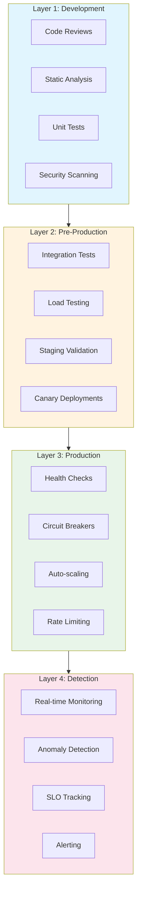

# How to Implement Prevention Strategies

Author: [nawazdhandala](https://github.com/nawazdhandala)

Tags: SRE, IncidentManagement, Prevention, Reliability

Description: A comprehensive guide to implementing proactive prevention strategies that reduce incidents and improve system reliability.

---

Incidents are costly. They drain engineering resources, erode customer trust, and disrupt business operations. While having a solid incident response process is essential, the most effective way to handle incidents is to prevent them from occurring in the first place. This post explores proven prevention strategies that can significantly reduce incident frequency and severity in your systems.

## Proactive Prevention Categories

Prevention strategies fall into several distinct categories, each addressing different aspects of system reliability:

### 1. Design-Level Prevention

Design-level prevention focuses on building systems that are inherently resilient. This includes:

- **Redundancy**: Eliminating single points of failure by deploying multiple instances of critical components
- **Graceful Degradation**: Designing systems to maintain partial functionality when components fail
- **Circuit Breakers**: Preventing cascade failures by stopping requests to failing services
- **Rate Limiting**: Protecting systems from overload by controlling request volumes

### 2. Operational Prevention

Operational prevention addresses the day-to-day practices that keep systems healthy:

- **Capacity Planning**: Ensuring systems have adequate resources before demand spikes
- **Change Management**: Implementing rigorous review and rollback procedures for deployments
- **Configuration Management**: Maintaining consistent and validated configurations across environments
- **Dependency Management**: Keeping dependencies updated and monitoring for vulnerabilities

### 3. Observability-Driven Prevention

Using data and monitoring to catch issues before they become incidents:

- **Anomaly Detection**: Identifying unusual patterns that may indicate emerging problems
- **Predictive Alerting**: Warning teams before thresholds are breached
- **Health Checks**: Continuously validating system components are functioning correctly
- **SLO Monitoring**: Tracking service level objectives to catch degradation early

### 4. Process-Level Prevention

Establishing organizational practices that reduce human error:

- **Runbook Automation**: Converting manual procedures into automated workflows
- **Blameless Post-mortems**: Learning from failures without creating fear of reporting
- **Chaos Engineering**: Proactively testing system resilience through controlled experiments
- **Training and Documentation**: Ensuring teams have the knowledge to operate systems safely

## Defense in Depth Approach

A robust prevention strategy implements multiple layers of defense. Each layer catches issues that slip through the previous one, dramatically reducing the probability of customer-facing incidents.



### Implementing Defense in Depth

The key to defense in depth is ensuring each layer is independent and complementary:

1. **Development Layer**: Catches bugs and vulnerabilities before code is merged
2. **Pre-Production Layer**: Validates functionality and performance in realistic conditions
3. **Production Layer**: Provides runtime protection against failures and overload
4. **Detection Layer**: Identifies issues quickly when they do occur, minimizing impact

## Automation for Common Failures

Automation is crucial for consistent and rapid response to common failure scenarios. Here are practical examples of automated prevention mechanisms:

### Auto-Healing Infrastructure

```yaml
# Kubernetes deployment with auto-healing configuration
# This ensures pods are automatically restarted when they become unhealthy
apiVersion: apps/v1
kind: Deployment
metadata:
  name: api-server
  labels:
    app: api-server
spec:
  replicas: 3
  selector:
    matchLabels:
      app: api-server
  template:
    metadata:
      labels:
        app: api-server
    spec:
      containers:
      - name: api-server
        image: myapp/api-server:v1.2.0
        ports:
        - containerPort: 8080

        # Liveness probe: Kubernetes restarts the container if this fails
        # Prevents zombie processes from consuming resources
        livenessProbe:
          httpGet:
            path: /health/live
            port: 8080
          initialDelaySeconds: 30
          periodSeconds: 10
          failureThreshold: 3

        # Readiness probe: Removes pod from service if this fails
        # Prevents traffic from being sent to unhealthy instances
        readinessProbe:
          httpGet:
            path: /health/ready
            port: 8080
          initialDelaySeconds: 5
          periodSeconds: 5
          failureThreshold: 2

        # Resource limits prevent runaway processes from affecting other workloads
        resources:
          requests:
            memory: "256Mi"
            cpu: "250m"
          limits:
            memory: "512Mi"
            cpu: "500m"
```

### Circuit Breaker Implementation

```python
# Circuit breaker implementation to prevent cascade failures
# When a service fails repeatedly, the circuit opens and fails fast
# This gives the failing service time to recover

import time
from enum import Enum
from typing import Callable, Any
from functools import wraps

class CircuitState(Enum):
    CLOSED = "closed"      # Normal operation, requests flow through
    OPEN = "open"          # Failing, requests are rejected immediately
    HALF_OPEN = "half_open"  # Testing if service has recovered

class CircuitBreaker:
    def __init__(
        self,
        failure_threshold: int = 5,    # Number of failures before opening
        recovery_timeout: int = 30,     # Seconds to wait before testing recovery
        expected_exception: type = Exception
    ):
        self.failure_threshold = failure_threshold
        self.recovery_timeout = recovery_timeout
        self.expected_exception = expected_exception

        # Internal state tracking
        self.state = CircuitState.CLOSED
        self.failure_count = 0
        self.last_failure_time = None
        self.success_count = 0

    def call(self, func: Callable, *args, **kwargs) -> Any:
        # Check if circuit should transition from OPEN to HALF_OPEN
        if self.state == CircuitState.OPEN:
            if self._should_attempt_reset():
                self.state = CircuitState.HALF_OPEN
            else:
                # Fail fast without calling the service
                raise CircuitOpenError("Circuit breaker is open")

        try:
            result = func(*args, **kwargs)
            self._on_success()
            return result
        except self.expected_exception as e:
            self._on_failure()
            raise e

    def _should_attempt_reset(self) -> bool:
        # Check if enough time has passed to test the service again
        if self.last_failure_time is None:
            return True
        return time.time() - self.last_failure_time >= self.recovery_timeout

    def _on_success(self):
        # Reset failure count on success
        self.failure_count = 0
        if self.state == CircuitState.HALF_OPEN:
            self.success_count += 1
            # Require multiple successes before fully closing
            if self.success_count >= 3:
                self.state = CircuitState.CLOSED
                self.success_count = 0

    def _on_failure(self):
        self.failure_count += 1
        self.last_failure_time = time.time()
        self.success_count = 0

        # Open the circuit if too many failures
        if self.failure_count >= self.failure_threshold:
            self.state = CircuitState.OPEN

class CircuitOpenError(Exception):
    pass

# Decorator for easy application to functions
def circuit_breaker(failure_threshold: int = 5, recovery_timeout: int = 30):
    breaker = CircuitBreaker(failure_threshold, recovery_timeout)

    def decorator(func: Callable) -> Callable:
        @wraps(func)
        def wrapper(*args, **kwargs):
            return breaker.call(func, *args, **kwargs)
        wrapper.circuit_breaker = breaker  # Expose for testing/monitoring
        return wrapper
    return decorator

# Usage example
@circuit_breaker(failure_threshold=3, recovery_timeout=60)
def call_payment_service(order_id: str) -> dict:
    # This function is now protected by a circuit breaker
    # If it fails 3 times, subsequent calls will fail fast for 60 seconds
    response = requests.post(
        "https://payments.internal/process",
        json={"order_id": order_id},
        timeout=5
    )
    response.raise_for_status()
    return response.json()
```

### Automated Capacity Scaling

```python
# Predictive auto-scaling based on historical patterns
# This script analyzes traffic patterns and pre-scales before predicted demand

import datetime
from dataclasses import dataclass
from typing import List
import statistics

@dataclass
class TrafficPattern:
    hour: int
    day_of_week: int  # 0 = Monday, 6 = Sunday
    average_requests: float
    peak_requests: float

class PredictiveScaler:
    def __init__(
        self,
        min_instances: int = 2,
        max_instances: int = 20,
        requests_per_instance: int = 100,
        scale_buffer: float = 1.3  # 30% buffer above predicted demand
    ):
        self.min_instances = min_instances
        self.max_instances = max_instances
        self.requests_per_instance = requests_per_instance
        self.scale_buffer = scale_buffer
        self.historical_patterns: List[TrafficPattern] = []

    def analyze_historical_data(self, traffic_logs: List[dict]):
        """
        Analyze historical traffic data to identify patterns.
        Groups data by hour and day of week to find typical load patterns.
        """
        # Group traffic by hour and day of week
        patterns = {}
        for log in traffic_logs:
            timestamp = log["timestamp"]
            key = (timestamp.hour, timestamp.weekday())

            if key not in patterns:
                patterns[key] = []
            patterns[key].append(log["request_count"])

        # Calculate statistics for each time slot
        for (hour, day), requests in patterns.items():
            self.historical_patterns.append(TrafficPattern(
                hour=hour,
                day_of_week=day,
                average_requests=statistics.mean(requests),
                peak_requests=max(requests)
            ))

    def predict_required_instances(
        self,
        target_time: datetime.datetime
    ) -> int:
        """
        Predict the number of instances needed at a specific time.
        Uses historical patterns plus a safety buffer.
        """
        # Find matching historical pattern
        matching_patterns = [
            p for p in self.historical_patterns
            if p.hour == target_time.hour
            and p.day_of_week == target_time.weekday()
        ]

        if not matching_patterns:
            # No historical data, use minimum instances
            return self.min_instances

        # Use peak requests with buffer for safety
        pattern = matching_patterns[0]
        predicted_requests = pattern.peak_requests * self.scale_buffer

        # Calculate required instances
        required = int(predicted_requests / self.requests_per_instance) + 1

        # Clamp to min/max bounds
        return max(self.min_instances, min(self.max_instances, required))

    def generate_scaling_schedule(self) -> List[dict]:
        """
        Generate a weekly scaling schedule based on predictions.
        This can be used to pre-warm instances before demand spikes.
        """
        schedule = []

        # Generate schedule for each hour of the week
        for day in range(7):
            for hour in range(24):
                # Create a datetime for this slot (using arbitrary week)
                dt = datetime.datetime(2024, 1, 1 + day, hour)
                instances = self.predict_required_instances(dt)

                schedule.append({
                    "day_of_week": day,
                    "hour": hour,
                    "target_instances": instances
                })

        return schedule
```

## Testing and Validation Strategies

Prevention requires continuous validation that your safeguards are working. Here are key testing strategies:

### Chaos Engineering

```python
# Chaos engineering experiment framework
# Systematically tests system resilience by injecting controlled failures

import random
import time
from typing import Callable, Optional
from dataclasses import dataclass
from enum import Enum

class ExperimentState(Enum):
    PENDING = "pending"
    RUNNING = "running"
    COMPLETED = "completed"
    ABORTED = "aborted"

@dataclass
class SteadyStateHypothesis:
    """Defines what 'normal' looks like for the system."""
    name: str
    check_function: Callable[[], bool]
    description: str

@dataclass
class ChaosExperiment:
    """
    A chaos experiment that tests system resilience.

    Structure:
    1. Verify steady state (system is healthy)
    2. Inject failure
    3. Verify system maintains acceptable behavior
    4. Rollback failure injection
    5. Verify system returns to steady state
    """
    name: str
    hypothesis: SteadyStateHypothesis
    inject_failure: Callable[[], None]
    rollback_failure: Callable[[], None]
    duration_seconds: int = 300  # How long to run the experiment

    state: ExperimentState = ExperimentState.PENDING

    def run(self) -> dict:
        """Execute the chaos experiment with safety checks."""
        results = {
            "experiment": self.name,
            "hypothesis": self.hypothesis.name,
            "success": False,
            "events": []
        }

        try:
            # Step 1: Verify initial steady state
            results["events"].append({"time": time.time(), "event": "checking_steady_state"})
            if not self.hypothesis.check_function():
                results["events"].append({"time": time.time(), "event": "steady_state_failed"})
                results["abort_reason"] = "System not in steady state before experiment"
                return results

            # Step 2: Inject the failure
            self.state = ExperimentState.RUNNING
            results["events"].append({"time": time.time(), "event": "injecting_failure"})
            self.inject_failure()

            # Step 3: Monitor during the experiment
            start_time = time.time()
            checks_passed = 0
            checks_failed = 0

            while time.time() - start_time < self.duration_seconds:
                time.sleep(10)  # Check every 10 seconds

                if self.hypothesis.check_function():
                    checks_passed += 1
                else:
                    checks_failed += 1
                    # Abort if too many failures (system not resilient)
                    if checks_failed > 3:
                        results["events"].append({
                            "time": time.time(),
                            "event": "aborting_too_many_failures"
                        })
                        self.state = ExperimentState.ABORTED
                        break

            results["checks_passed"] = checks_passed
            results["checks_failed"] = checks_failed

        finally:
            # Step 4: Always rollback the failure
            results["events"].append({"time": time.time(), "event": "rolling_back"})
            self.rollback_failure()

            # Step 5: Verify return to steady state
            time.sleep(30)  # Give system time to recover
            if self.hypothesis.check_function():
                results["events"].append({"time": time.time(), "event": "recovered"})
                if self.state != ExperimentState.ABORTED:
                    results["success"] = True
                    self.state = ExperimentState.COMPLETED
            else:
                results["events"].append({"time": time.time(), "event": "recovery_failed"})
                results["success"] = False

        return results

# Example: Test resilience to database connection loss
def create_database_failure_experiment(db_client, service_health_check):
    """
    Creates an experiment that tests whether the service
    can handle database connection failures gracefully.
    """

    hypothesis = SteadyStateHypothesis(
        name="Service responds to health checks",
        check_function=service_health_check,
        description="The service should respond to /health within 1 second"
    )

    def inject_database_failure():
        # Simulate database failure by blocking connections
        db_client.simulate_network_partition()

    def rollback_database_failure():
        # Restore database connectivity
        db_client.restore_network()

    return ChaosExperiment(
        name="Database Connection Failure",
        hypothesis=hypothesis,
        inject_failure=inject_database_failure,
        rollback_failure=rollback_database_failure,
        duration_seconds=180  # 3 minutes
    )
```

### Load Testing for Prevention

```python
# Load testing framework for identifying breaking points
# Helps prevent capacity-related incidents by finding limits before production does

import asyncio
import aiohttp
import time
from dataclasses import dataclass, field
from typing import List, Optional
import statistics

@dataclass
class LoadTestConfig:
    """Configuration for a load test run."""
    target_url: str
    duration_seconds: int = 60
    initial_rps: int = 10        # Requests per second to start
    rps_increment: int = 10       # How much to increase RPS each step
    step_duration: int = 30       # Seconds at each RPS level
    max_rps: int = 1000           # Maximum RPS to attempt
    timeout_seconds: float = 5.0  # Request timeout

    # Thresholds for detecting degradation
    max_error_rate: float = 0.01      # 1% error rate
    max_p99_latency_ms: float = 1000  # 1 second

@dataclass
class LoadTestResults:
    """Results from a load test step."""
    rps: int
    total_requests: int
    successful_requests: int
    failed_requests: int
    latencies_ms: List[float] = field(default_factory=list)

    @property
    def error_rate(self) -> float:
        if self.total_requests == 0:
            return 0.0
        return self.failed_requests / self.total_requests

    @property
    def p99_latency_ms(self) -> float:
        if not self.latencies_ms:
            return 0.0
        sorted_latencies = sorted(self.latencies_ms)
        index = int(len(sorted_latencies) * 0.99)
        return sorted_latencies[index]

    @property
    def median_latency_ms(self) -> float:
        if not self.latencies_ms:
            return 0.0
        return statistics.median(self.latencies_ms)

class LoadTester:
    """
    Progressive load tester that finds the breaking point of a service.
    Useful for capacity planning and setting appropriate limits.
    """

    def __init__(self, config: LoadTestConfig):
        self.config = config
        self.results: List[LoadTestResults] = []
        self.breaking_point_rps: Optional[int] = None

    async def run_test(self) -> dict:
        """
        Run a progressive load test, increasing RPS until degradation is detected.
        Returns the safe operating capacity and breaking point.
        """
        current_rps = self.config.initial_rps

        while current_rps <= self.config.max_rps:
            print(f"Testing at {current_rps} RPS...")

            # Run test at current RPS level
            result = await self._run_step(current_rps)
            self.results.append(result)

            # Check if we hit degradation thresholds
            if self._is_degraded(result):
                self.breaking_point_rps = current_rps
                print(f"Degradation detected at {current_rps} RPS")
                break

            # Increase RPS for next step
            current_rps += self.config.rps_increment

        return self._generate_report()

    async def _run_step(self, target_rps: int) -> LoadTestResults:
        """Run load test at a specific RPS for the configured step duration."""
        result = LoadTestResults(rps=target_rps, total_requests=0,
                                  successful_requests=0, failed_requests=0)

        # Calculate delay between requests to achieve target RPS
        delay = 1.0 / target_rps

        async with aiohttp.ClientSession() as session:
            start_time = time.time()
            tasks = []

            while time.time() - start_time < self.config.step_duration:
                # Schedule a request
                task = asyncio.create_task(
                    self._make_request(session, result)
                )
                tasks.append(task)

                # Wait to maintain target RPS
                await asyncio.sleep(delay)

            # Wait for all pending requests to complete
            await asyncio.gather(*tasks, return_exceptions=True)

        return result

    async def _make_request(
        self,
        session: aiohttp.ClientSession,
        result: LoadTestResults
    ):
        """Make a single request and record the result."""
        start = time.time()
        result.total_requests += 1

        try:
            async with session.get(
                self.config.target_url,
                timeout=aiohttp.ClientTimeout(total=self.config.timeout_seconds)
            ) as response:
                latency = (time.time() - start) * 1000  # Convert to ms
                result.latencies_ms.append(latency)

                if response.status < 400:
                    result.successful_requests += 1
                else:
                    result.failed_requests += 1

        except Exception:
            result.failed_requests += 1

    def _is_degraded(self, result: LoadTestResults) -> bool:
        """Check if the system is showing signs of degradation."""
        return (
            result.error_rate > self.config.max_error_rate or
            result.p99_latency_ms > self.config.max_p99_latency_ms
        )

    def _generate_report(self) -> dict:
        """Generate a report with recommendations."""
        if not self.results:
            return {"error": "No test results"}

        # Find the highest RPS that was still healthy
        safe_results = [r for r in self.results if not self._is_degraded(r)]
        safe_capacity = safe_results[-1].rps if safe_results else 0

        return {
            "safe_capacity_rps": safe_capacity,
            "breaking_point_rps": self.breaking_point_rps,
            "recommended_limit_rps": int(safe_capacity * 0.8),  # 80% of safe capacity
            "results_by_rps": [
                {
                    "rps": r.rps,
                    "error_rate": r.error_rate,
                    "p99_latency_ms": r.p99_latency_ms,
                    "median_latency_ms": r.median_latency_ms
                }
                for r in self.results
            ]
        }
```

## Building a Prevention Culture

Technical measures are only part of the equation. Building a culture of prevention requires:

### 1. Blameless Post-mortems

When incidents do occur, focus on systemic improvements rather than individual blame. This encourages honest reporting and learning.

### 2. Error Budgets

Use SLOs and error budgets to balance reliability with development velocity. When the error budget is depleted, prioritize reliability work.

### 3. On-call Feedback Loops

Ensure on-call engineers can easily propose and implement preventive measures based on their experiences.

### 4. Prevention Metrics

Track metrics that measure prevention effectiveness:
- Mean time between incidents (MTBI)
- Percentage of incidents caught by monitoring before customer impact
- Number of automated remediations triggered
- Coverage of critical paths by chaos experiments

## Conclusion

Effective incident prevention requires a multi-layered approach combining technical safeguards, automated responses, continuous testing, and a supportive organizational culture. By implementing the strategies outlined in this post, you can significantly reduce incident frequency and severity while building more resilient systems.

The key is to treat prevention as an ongoing practice rather than a one-time effort. Regularly review your prevention mechanisms, learn from the incidents that do occur, and continuously improve your defenses. The investment in prevention pays dividends through reduced firefighting, improved customer satisfaction, and more sustainable engineering practices.
