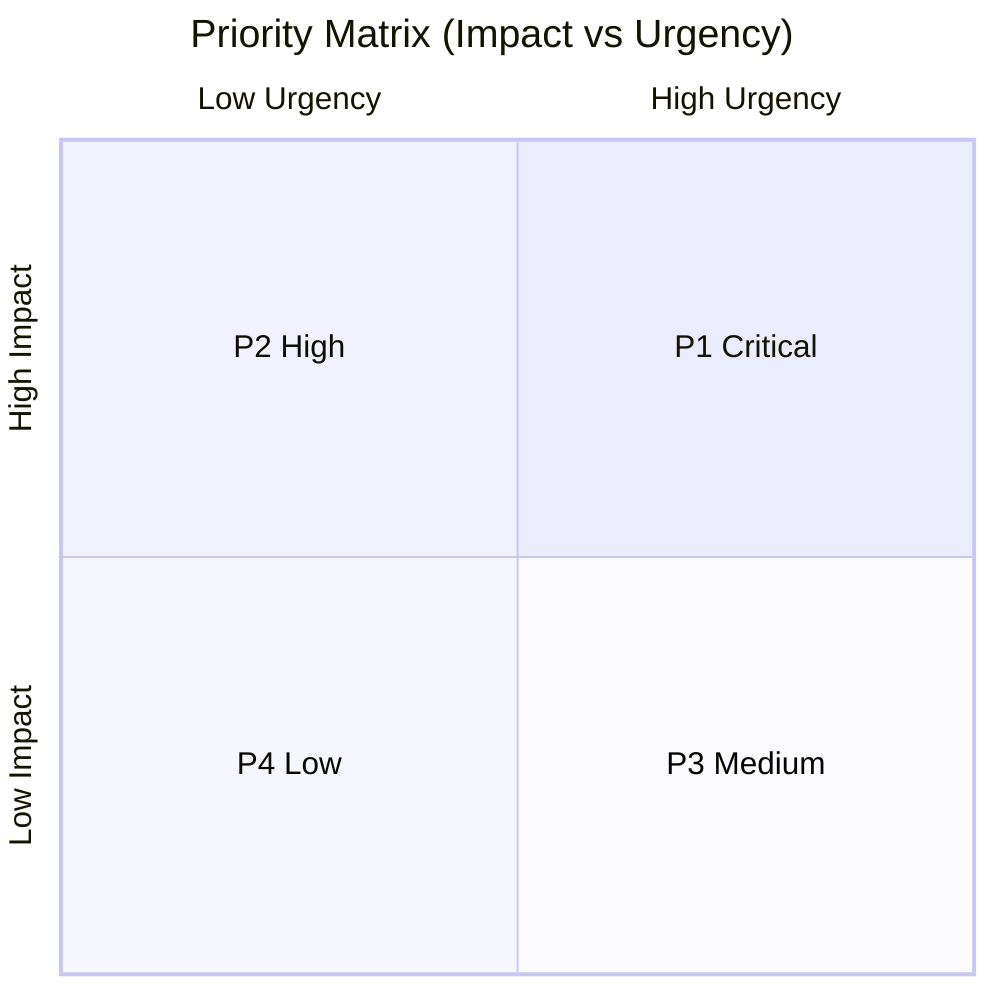
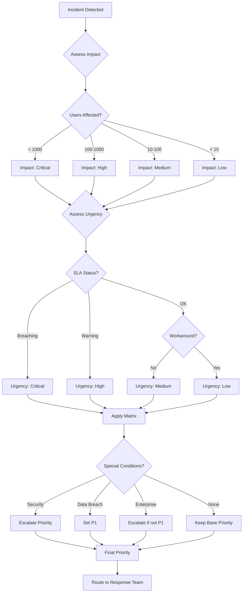
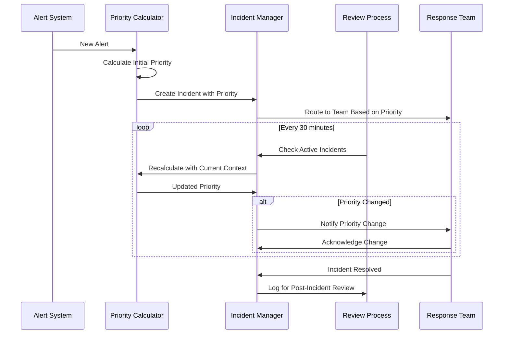

# How to Create Priority Calculation

Author: [nawazdhandala](https://github.com/nawazdhandala)

Tags: Incident Management, SRE, Triage, Priority

Description: Learn how to calculate incident priority from impact and urgency for effective triage.

---

When an incident strikes, the first critical decision is determining its priority. Get it wrong, and you either waste resources on minor issues or neglect critical ones. Priority calculation transforms subjective gut feelings into a systematic, repeatable process that ensures consistent incident handling across your organization.

This guide walks you through building a robust priority calculation system, from basic matrices to automated, context-aware prioritization.

## Understanding Priority vs. Severity

Before diving into calculations, let's clarify a common confusion:

- **Severity**: The technical impact of an incident (how broken is it?)
- **Priority**: The order in which incidents should be addressed (how urgently should we fix it?)

A severity-1 database corruption might be priority-2 if it affects only a test environment. Conversely, a severity-3 UI glitch might be priority-1 if it blocks a major customer demo happening in an hour.

## The Priority Matrix: Impact x Urgency

The foundation of priority calculation is the classic ITIL formula:

```
Priority = f(Impact, Urgency)
```

Let's build this step by step.

### Defining Impact Levels

Impact measures the breadth and depth of an incident's effect:

```typescript
enum Impact {
  CRITICAL = 4,  // Organization-wide, all users affected
  HIGH = 3,      // Multiple departments or large user segment
  MEDIUM = 2,    // Single department or limited user group
  LOW = 1        // Individual user or non-essential system
}

interface ImpactAssessment {
  level: Impact;
  affectedUsers: number;
  affectedServices: string[];
  revenueImpact: number;
  dataAtRisk: boolean;
}
```

### Defining Urgency Levels

Urgency measures time sensitivity:

```typescript
enum Urgency {
  CRITICAL = 4,  // Immediate action required, every minute counts
  HIGH = 3,      // Must be resolved within hours
  MEDIUM = 2,    // Should be resolved within the day
  LOW = 1        // Can wait, no immediate deadline
}

interface UrgencyAssessment {
  level: Urgency;
  slaDeadline: Date | null;
  customerEscalation: boolean;
  businessCriticalPeriod: boolean;
  workaroundAvailable: boolean;
}
```

### The Basic Priority Matrix

Here's the classic 4x4 priority matrix:



Implemented in code:

```typescript
type PriorityLevel = 'P1' | 'P2' | 'P3' | 'P4';

const PRIORITY_MATRIX: Record<Impact, Record<Urgency, PriorityLevel>> = {
  [Impact.CRITICAL]: {
    [Urgency.CRITICAL]: 'P1',
    [Urgency.HIGH]: 'P1',
    [Urgency.MEDIUM]: 'P2',
    [Urgency.LOW]: 'P3'
  },
  [Impact.HIGH]: {
    [Urgency.CRITICAL]: 'P1',
    [Urgency.HIGH]: 'P2',
    [Urgency.MEDIUM]: 'P2',
    [Urgency.LOW]: 'P3'
  },
  [Impact.MEDIUM]: {
    [Urgency.CRITICAL]: 'P2',
    [Urgency.HIGH]: 'P2',
    [Urgency.MEDIUM]: 'P3',
    [Urgency.LOW]: 'P4'
  },
  [Impact.LOW]: {
    [Urgency.CRITICAL]: 'P3',
    [Urgency.HIGH]: 'P3',
    [Urgency.MEDIUM]: 'P4',
    [Urgency.LOW]: 'P4'
  }
};

function calculatePriority(impact: Impact, urgency: Urgency): PriorityLevel {
  return PRIORITY_MATRIX[impact][urgency];
}
```

## Building a Complete Priority Calculator

Let's build a more sophisticated calculator that considers multiple factors:

```typescript
interface Incident {
  id: string;
  title: string;
  description: string;
  affectedServices: string[];
  affectedUsers: number;
  startTime: Date;
  slaDeadline?: Date;
  customerTier?: 'enterprise' | 'business' | 'free';
  isSecurityRelated: boolean;
  dataBreachPotential: boolean;
  workaroundExists: boolean;
}

interface PriorityResult {
  priority: PriorityLevel;
  score: number;
  impact: Impact;
  urgency: Urgency;
  factors: string[];
  recommendation: string;
}

class PriorityCalculator {
  private criticalServices: Set<string>;
  private userThresholds: { high: number; medium: number };

  constructor(config: {
    criticalServices: string[];
    userThresholds: { high: number; medium: number };
  }) {
    this.criticalServices = new Set(config.criticalServices);
    this.userThresholds = config.userThresholds;
  }

  calculate(incident: Incident): PriorityResult {
    const factors: string[] = [];

    // Calculate impact
    const impact = this.assessImpact(incident, factors);

    // Calculate urgency
    const urgency = this.assessUrgency(incident, factors);

    // Get base priority from matrix
    const basePriority = PRIORITY_MATRIX[impact][urgency];

    // Apply modifiers for special conditions
    const { priority, additionalFactors } = this.applyModifiers(
      basePriority,
      incident
    );

    factors.push(...additionalFactors);

    // Calculate numeric score for fine-grained sorting
    const score = this.calculateScore(impact, urgency, incident);

    return {
      priority,
      score,
      impact,
      urgency,
      factors,
      recommendation: this.getRecommendation(priority)
    };
  }

  private assessImpact(incident: Incident, factors: string[]): Impact {
    // Check for critical services
    const affectsCritical = incident.affectedServices.some(
      s => this.criticalServices.has(s)
    );

    if (affectsCritical) {
      factors.push('Affects critical service');
    }

    // Check user count
    if (incident.affectedUsers >= this.userThresholds.high) {
      factors.push(`High user impact (${incident.affectedUsers} users)`);
      return Impact.CRITICAL;
    }

    if (incident.affectedUsers >= this.userThresholds.medium) {
      factors.push(`Medium user impact (${incident.affectedUsers} users)`);
      return affectsCritical ? Impact.HIGH : Impact.MEDIUM;
    }

    if (affectsCritical) {
      return Impact.HIGH;
    }

    if (incident.affectedServices.length > 3) {
      factors.push('Multiple services affected');
      return Impact.MEDIUM;
    }

    return Impact.LOW;
  }

  private assessUrgency(incident: Incident, factors: string[]): Urgency {
    const now = new Date();

    // Check SLA deadline
    if (incident.slaDeadline) {
      const hoursUntilDeadline =
        (incident.slaDeadline.getTime() - now.getTime()) / (1000 * 60 * 60);

      if (hoursUntilDeadline <= 1) {
        factors.push('SLA breach imminent');
        return Urgency.CRITICAL;
      }

      if (hoursUntilDeadline <= 4) {
        factors.push('SLA deadline approaching');
        return Urgency.HIGH;
      }
    }

    // Check incident duration
    const incidentDuration =
      (now.getTime() - incident.startTime.getTime()) / (1000 * 60);

    if (incidentDuration > 60) {
      factors.push('Incident ongoing for over 1 hour');
      return Urgency.HIGH;
    }

    // Workaround availability reduces urgency
    if (incident.workaroundExists) {
      factors.push('Workaround available');
      return Urgency.LOW;
    }

    return Urgency.MEDIUM;
  }

  private applyModifiers(
    basePriority: PriorityLevel,
    incident: Incident
  ): { priority: PriorityLevel; additionalFactors: string[] } {
    const additionalFactors: string[] = [];
    let priority = basePriority;

    // Security incidents always escalate
    if (incident.isSecurityRelated) {
      additionalFactors.push('Security incident - priority elevated');
      priority = this.escalatePriority(priority);
    }

    // Data breach potential is critical
    if (incident.dataBreachPotential) {
      additionalFactors.push('Potential data breach - priority elevated');
      priority = 'P1';
    }

    // Enterprise customers get priority boost
    if (incident.customerTier === 'enterprise' && priority !== 'P1') {
      additionalFactors.push('Enterprise customer affected');
      priority = this.escalatePriority(priority);
    }

    return { priority, additionalFactors };
  }

  private escalatePriority(priority: PriorityLevel): PriorityLevel {
    const escalation: Record<PriorityLevel, PriorityLevel> = {
      'P1': 'P1',
      'P2': 'P1',
      'P3': 'P2',
      'P4': 'P3'
    };
    return escalation[priority];
  }

  private calculateScore(
    impact: Impact,
    urgency: Urgency,
    incident: Incident
  ): number {
    // Base score from impact and urgency (0-100)
    let score = (impact * 10) + (urgency * 10);

    // Bonus points for various factors
    if (incident.isSecurityRelated) score += 15;
    if (incident.dataBreachPotential) score += 25;
    if (incident.customerTier === 'enterprise') score += 10;
    if (!incident.workaroundExists) score += 5;

    return Math.min(score, 100);
  }

  private getRecommendation(priority: PriorityLevel): string {
    const recommendations: Record<PriorityLevel, string> = {
      'P1': 'Immediate response required. Page on-call team. Start incident bridge.',
      'P2': 'Urgent response needed. Notify on-call engineer within 15 minutes.',
      'P3': 'Address during business hours. Add to sprint if persistent.',
      'P4': 'Schedule for next maintenance window or backlog.'
    };
    return recommendations[priority];
  }
}
```

## Priority Calculation Flow

Here's how the complete priority calculation process works:



## Dynamic Priority Adjustment

Priorities should not be static. Implement a system that adjusts priority based on changing conditions:

```typescript
interface PriorityAdjustmentRule {
  name: string;
  condition: (incident: Incident, context: IncidentContext) => boolean;
  adjustment: 'escalate' | 'deescalate';
  reason: string;
}

interface IncidentContext {
  currentDuration: number;  // minutes
  acknowledgedAt?: Date;
  updateCount: number;
  escalationCount: number;
  customerComplaints: number;
}

const adjustmentRules: PriorityAdjustmentRule[] = [
  {
    name: 'Duration Escalation',
    condition: (_, ctx) => ctx.currentDuration > 120 && ctx.escalationCount === 0,
    adjustment: 'escalate',
    reason: 'Incident unresolved for over 2 hours'
  },
  {
    name: 'Customer Complaint Surge',
    condition: (_, ctx) => ctx.customerComplaints > 10,
    adjustment: 'escalate',
    reason: 'Multiple customer complaints received'
  },
  {
    name: 'Workaround Deployed',
    condition: (incident) => incident.workaroundExists,
    adjustment: 'deescalate',
    reason: 'Effective workaround in place'
  },
  {
    name: 'Business Hours End',
    condition: () => {
      const hour = new Date().getHours();
      return hour >= 18 || hour < 9;
    },
    adjustment: 'deescalate',
    reason: 'Outside business hours - reduced user impact'
  }
];

class DynamicPriorityManager {
  private rules: PriorityAdjustmentRule[];
  private adjustmentHistory: Map<string, string[]> = new Map();

  constructor(rules: PriorityAdjustmentRule[]) {
    this.rules = rules;
  }

  evaluateAdjustments(
    incident: Incident,
    currentPriority: PriorityLevel,
    context: IncidentContext
  ): { newPriority: PriorityLevel; adjustments: string[] } {
    const adjustments: string[] = [];
    let priority = currentPriority;

    for (const rule of this.rules) {
      if (rule.condition(incident, context)) {
        const historyKey = `${incident.id}-${rule.name}`;

        // Avoid duplicate adjustments
        if (this.adjustmentHistory.has(historyKey)) {
          continue;
        }

        if (rule.adjustment === 'escalate') {
          priority = this.escalate(priority);
        } else {
          priority = this.deescalate(priority);
        }

        adjustments.push(`${rule.name}: ${rule.reason}`);
        this.adjustmentHistory.set(historyKey, [rule.reason]);
      }
    }

    return { newPriority: priority, adjustments };
  }

  private escalate(priority: PriorityLevel): PriorityLevel {
    const order: PriorityLevel[] = ['P4', 'P3', 'P2', 'P1'];
    const currentIndex = order.indexOf(priority);
    return order[Math.min(currentIndex + 1, order.length - 1)];
  }

  private deescalate(priority: PriorityLevel): PriorityLevel {
    const order: PriorityLevel[] = ['P4', 'P3', 'P2', 'P1'];
    const currentIndex = order.indexOf(priority);
    return order[Math.max(currentIndex - 1, 0)];
  }
}
```

## Business Context Factors

Priority calculation should consider business context. Here's how to incorporate business factors:

```typescript
interface BusinessContext {
  currentQuarter: 'Q1' | 'Q2' | 'Q3' | 'Q4';
  isQuarterEnd: boolean;
  activePromotions: string[];
  upcomingEvents: BusinessEvent[];
  revenueThreshold: number;
}

interface BusinessEvent {
  name: string;
  date: Date;
  criticalServices: string[];
  impactMultiplier: number;
}

class BusinessAwarePriorityCalculator extends PriorityCalculator {
  private businessContext: BusinessContext;

  constructor(
    config: { criticalServices: string[]; userThresholds: { high: number; medium: number } },
    businessContext: BusinessContext
  ) {
    super(config);
    this.businessContext = businessContext;
  }

  calculateWithBusinessContext(incident: Incident): PriorityResult {
    const baseResult = this.calculate(incident);

    // Check for upcoming events
    const relevantEvent = this.findRelevantEvent(incident);
    if (relevantEvent) {
      baseResult.factors.push(
        `Upcoming event: ${relevantEvent.name} (impact x${relevantEvent.impactMultiplier})`
      );
      baseResult.score = Math.min(
        baseResult.score * relevantEvent.impactMultiplier,
        100
      );

      if (relevantEvent.impactMultiplier >= 2) {
        baseResult.priority = this.escalatePriorityLevel(baseResult.priority);
      }
    }

    // Quarter-end boost
    if (this.businessContext.isQuarterEnd) {
      baseResult.factors.push('Quarter-end period - elevated business sensitivity');
      baseResult.score = Math.min(baseResult.score + 10, 100);
    }

    // Active promotions check
    const affectsPromotion = incident.affectedServices.some(
      s => this.businessContext.activePromotions.includes(s)
    );
    if (affectsPromotion) {
      baseResult.factors.push('Affects active promotion');
      baseResult.priority = this.escalatePriorityLevel(baseResult.priority);
    }

    return baseResult;
  }

  private findRelevantEvent(incident: Incident): BusinessEvent | undefined {
    const now = new Date();
    const nextWeek = new Date(now.getTime() + 7 * 24 * 60 * 60 * 1000);

    return this.businessContext.upcomingEvents.find(event => {
      const isUpcoming = event.date >= now && event.date <= nextWeek;
      const affectsEvent = incident.affectedServices.some(
        s => event.criticalServices.includes(s)
      );
      return isUpcoming && affectsEvent;
    });
  }

  private escalatePriorityLevel(priority: PriorityLevel): PriorityLevel {
    const escalation: Record<PriorityLevel, PriorityLevel> = {
      'P1': 'P1',
      'P2': 'P1',
      'P3': 'P2',
      'P4': 'P3'
    };
    return escalation[priority];
  }
}
```

## Automated Priority Assignment

Integrate priority calculation with your monitoring and alerting system:

```typescript
interface AlertPayload {
  alertId: string;
  alertName: string;
  severity: 'critical' | 'warning' | 'info';
  source: string;
  affectedHost: string;
  metrics: Record<string, number>;
  labels: Record<string, string>;
}

interface ServiceMapping {
  host: string;
  service: string;
  tier: 'critical' | 'standard' | 'development';
  estimatedUsers: number;
}

class AutomatedPriorityAssigner {
  private calculator: PriorityCalculator;
  private serviceMappings: Map<string, ServiceMapping>;
  private alertToIncidentMap: Map<string, string>;

  constructor(
    calculator: PriorityCalculator,
    serviceMappings: ServiceMapping[]
  ) {
    this.calculator = calculator;
    this.serviceMappings = new Map(
      serviceMappings.map(m => [m.host, m])
    );
    this.alertToIncidentMap = new Map();
  }

  async processAlert(alert: AlertPayload): Promise<{
    incidentId: string;
    priority: PriorityResult;
    action: 'created' | 'updated' | 'deduplicated';
  }> {
    // Check for existing incident
    const existingIncidentId = this.alertToIncidentMap.get(alert.alertId);
    if (existingIncidentId) {
      return {
        incidentId: existingIncidentId,
        priority: await this.recalculatePriority(existingIncidentId),
        action: 'deduplicated'
      };
    }

    // Map alert to incident
    const incident = this.mapAlertToIncident(alert);

    // Calculate priority
    const priority = this.calculator.calculate(incident);

    // Store mapping for deduplication
    this.alertToIncidentMap.set(alert.alertId, incident.id);

    return {
      incidentId: incident.id,
      priority,
      action: 'created'
    };
  }

  private mapAlertToIncident(alert: AlertPayload): Incident {
    const serviceMapping = this.serviceMappings.get(alert.affectedHost);

    return {
      id: `INC-${Date.now()}`,
      title: alert.alertName,
      description: `Auto-generated from alert ${alert.alertId}`,
      affectedServices: serviceMapping ? [serviceMapping.service] : [alert.source],
      affectedUsers: serviceMapping?.estimatedUsers ?? 0,
      startTime: new Date(),
      isSecurityRelated: alert.labels['type'] === 'security',
      dataBreachPotential: alert.labels['data_exposure'] === 'true',
      workaroundExists: false,
      customerTier: this.mapTierToCustomerTier(serviceMapping?.tier)
    };
  }

  private mapTierToCustomerTier(
    tier?: 'critical' | 'standard' | 'development'
  ): 'enterprise' | 'business' | 'free' | undefined {
    if (!tier) return undefined;
    const mapping = {
      'critical': 'enterprise' as const,
      'standard': 'business' as const,
      'development': 'free' as const
    };
    return mapping[tier];
  }

  private async recalculatePriority(incidentId: string): Promise<PriorityResult> {
    // In a real system, fetch incident details and recalculate
    // This is a placeholder for the actual implementation
    throw new Error(`Recalculate priority for ${incidentId}`);
  }
}
```

## Priority Review Process

Establish a regular review process to ensure priorities remain accurate:



### Implementing Priority Review

```typescript
interface PriorityReviewConfig {
  reviewIntervalMinutes: number;
  escalationThresholdMinutes: number;
  autoEscalateOnNoAck: boolean;
}

class PriorityReviewService {
  private config: PriorityReviewConfig;
  private calculator: PriorityCalculator;
  private dynamicManager: DynamicPriorityManager;

  constructor(
    config: PriorityReviewConfig,
    calculator: PriorityCalculator,
    dynamicManager: DynamicPriorityManager
  ) {
    this.config = config;
    this.calculator = calculator;
    this.dynamicManager = dynamicManager;
  }

  async reviewIncident(
    incident: Incident,
    currentPriority: PriorityLevel,
    context: IncidentContext
  ): Promise<{
    shouldUpdate: boolean;
    newPriority: PriorityLevel;
    reasons: string[];
    notifications: string[];
  }> {
    const notifications: string[] = [];

    // Recalculate base priority
    const newBaseResult = this.calculator.calculate(incident);

    // Apply dynamic adjustments
    const { newPriority, adjustments } = this.dynamicManager.evaluateAdjustments(
      incident,
      newBaseResult.priority,
      context
    );

    // Check for no-acknowledgment escalation
    if (
      this.config.autoEscalateOnNoAck &&
      !context.acknowledgedAt &&
      context.currentDuration > this.config.escalationThresholdMinutes
    ) {
      notifications.push(
        `Incident ${incident.id} not acknowledged after ${context.currentDuration} minutes - escalating`
      );
      return {
        shouldUpdate: true,
        newPriority: this.escalate(newPriority),
        reasons: [...adjustments, 'Auto-escalation due to no acknowledgment'],
        notifications
      };
    }

    const shouldUpdate = newPriority !== currentPriority;

    if (shouldUpdate) {
      notifications.push(
        `Priority changed from ${currentPriority} to ${newPriority} for incident ${incident.id}`
      );
    }

    return {
      shouldUpdate,
      newPriority,
      reasons: adjustments,
      notifications
    };
  }

  private escalate(priority: PriorityLevel): PriorityLevel {
    const order: PriorityLevel[] = ['P4', 'P3', 'P2', 'P1'];
    const currentIndex = order.indexOf(priority);
    return order[Math.min(currentIndex + 1, order.length - 1)];
  }
}
```

## Best Practices for Priority Calculation

### 1. Document Your Criteria

Create clear documentation that explains how priorities are calculated:

```typescript
const priorityDocumentation = {
  P1: {
    name: 'Critical',
    description: 'Complete service outage or security breach',
    responseTime: '15 minutes',
    resolutionTarget: '4 hours',
    escalationPath: ['On-call Engineer', 'Team Lead', 'Engineering Director'],
    examples: [
      'Production database unavailable',
      'Authentication service down',
      'Active security breach'
    ]
  },
  P2: {
    name: 'High',
    description: 'Major feature unavailable or severe degradation',
    responseTime: '30 minutes',
    resolutionTarget: '8 hours',
    escalationPath: ['On-call Engineer', 'Team Lead'],
    examples: [
      'Payment processing failing for subset of users',
      'Search functionality unavailable',
      'Mobile app crashes on launch'
    ]
  },
  P3: {
    name: 'Medium',
    description: 'Minor feature unavailable or moderate degradation',
    responseTime: '4 hours',
    resolutionTarget: '24 hours',
    escalationPath: ['On-call Engineer'],
    examples: [
      'Report generation slow',
      'Non-critical API endpoint returning errors',
      'Email notifications delayed'
    ]
  },
  P4: {
    name: 'Low',
    description: 'Cosmetic issues or minor inconveniences',
    responseTime: '1 business day',
    resolutionTarget: '1 week',
    escalationPath: ['Assigned Engineer'],
    examples: [
      'Typo in UI',
      'Minor styling inconsistency',
      'Documentation outdated'
    ]
  }
};
```

### 2. Train Your Team

Ensure everyone understands the priority system:

```typescript
interface PriorityTrainingScenario {
  scenario: string;
  facts: string[];
  correctPriority: PriorityLevel;
  explanation: string;
}

const trainingScenarios: PriorityTrainingScenario[] = [
  {
    scenario: 'Login page returns 500 error',
    facts: [
      'All users affected',
      'No workaround available',
      'Started 5 minutes ago'
    ],
    correctPriority: 'P1',
    explanation: 'Authentication is critical infrastructure. Complete outage affecting all users requires immediate response.'
  },
  {
    scenario: 'Dashboard charts loading slowly',
    facts: [
      '20% of users affected',
      'Workaround: refresh page',
      'Started 2 hours ago'
    ],
    correctPriority: 'P3',
    explanation: 'Partial degradation with workaround. Important but not urgent.'
  }
];
```

### 3. Review and Iterate

Regularly analyze your priority decisions:

```typescript
interface PriorityAnalytics {
  calculateAccuracy(
    incidents: Array<{
      assignedPriority: PriorityLevel;
      actualImpact: 'higher' | 'correct' | 'lower';
    }>
  ): {
    overPrioritized: number;
    correctlyPrioritized: number;
    underPrioritized: number;
    accuracy: number;
  };
}

const analytics: PriorityAnalytics = {
  calculateAccuracy(incidents) {
    const results = {
      overPrioritized: 0,
      correctlyPrioritized: 0,
      underPrioritized: 0,
      accuracy: 0
    };

    for (const incident of incidents) {
      if (incident.actualImpact === 'higher') {
        results.underPrioritized++;
      } else if (incident.actualImpact === 'lower') {
        results.overPrioritized++;
      } else {
        results.correctlyPrioritized++;
      }
    }

    results.accuracy = results.correctlyPrioritized / incidents.length;
    return results;
  }
};
```

## Conclusion

Effective priority calculation is the foundation of efficient incident management. By combining objective criteria (impact and urgency), business context, and dynamic adjustment rules, you can build a system that consistently routes incidents to the right teams with appropriate urgency.

Key takeaways:

1. **Start simple**: Begin with a basic impact x urgency matrix
2. **Add context**: Incorporate business factors and special conditions
3. **Automate**: Connect priority calculation to your monitoring systems
4. **Review regularly**: Adjust your rules based on real-world outcomes
5. **Document everything**: Ensure your team understands the criteria

Remember, the goal is not perfect prioritization - it's consistent, defensible prioritization that improves over time. Start with these patterns, measure your results, and iterate.

For more on incident management, check out our guides on [effective postmortems](https://oneuptime.com/blog/post/2025-09-09-effective-incident-postmortem-templates-ready-to-use-examples/view) and [SRE best practices](https://oneuptime.com/blog/post/2025-11-28-sre-best-practices/view).
