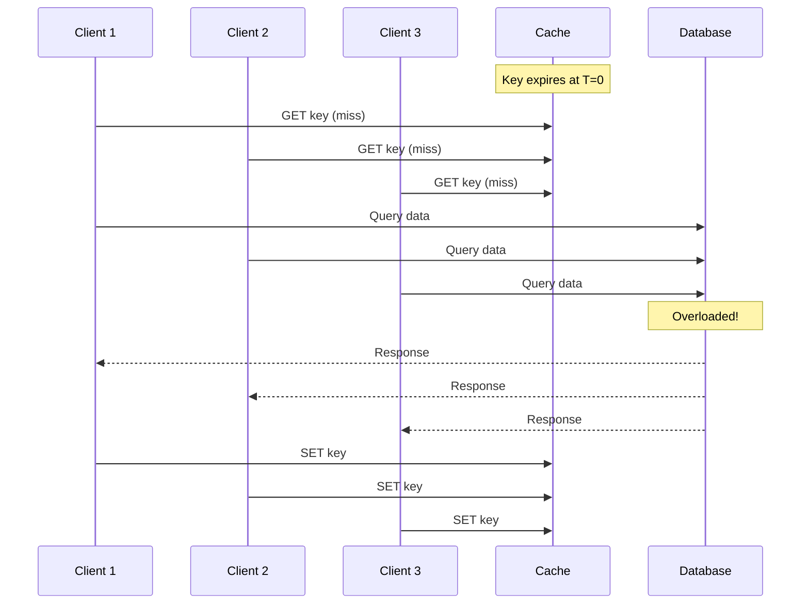
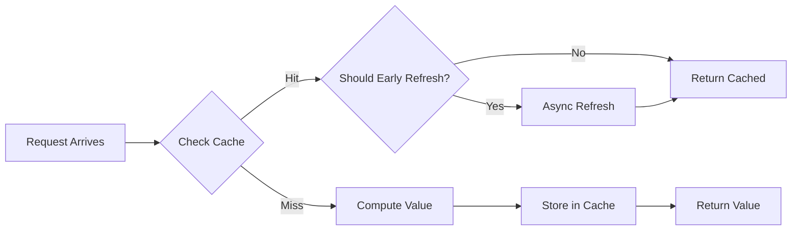
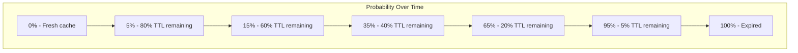

# How to Implement Probabilistic Early Expiration

Author: [nawazdhandala](https://github.com/nawazdhandala)

Tags: Caching, Stampede Prevention, Algorithms, Performance

Description: Learn to implement probabilistic early expiration to prevent cache stampedes under high load.

---

Cache stampedes can bring down your infrastructure in seconds. When a popular cache key expires, hundreds of concurrent requests hit your database simultaneously, causing cascading failures. Probabilistic early expiration (PER) solves this by having cache entries expire slightly before their actual TTL, with randomization ensuring that regeneration happens gradually rather than all at once.

## The Cache Stampede Problem

A cache stampede occurs when a cached value expires and multiple requests simultaneously attempt to regenerate it. This creates a thundering herd that can overwhelm your backend services.



## How Probabilistic Early Expiration Works

PER uses a simple but effective formula derived from the XFetch algorithm. Instead of waiting for the cache to expire, each request has a probability of triggering a refresh that increases as the expiration time approaches.

The core formula is:

```
shouldRefresh = currentTime - (delta * beta * log(random())) >= expirationTime
```

Where:
- `delta` is the time it took to compute the cached value
- `beta` is a tuning parameter (typically 1.0)
- `random()` returns a value between 0 and 1

This creates a probability distribution where cache entries are more likely to be refreshed as they approach expiration, with the likelihood proportional to how expensive they are to compute.



## Basic Implementation

Here is a straightforward implementation in JavaScript that demonstrates the core concept.

```javascript
class ProbabilisticCache {
  constructor(options = {}) {
    this.cache = new Map();
    this.beta = options.beta || 1.0;  // Tuning parameter for refresh probability
    this.refreshing = new Set();       // Track keys being refreshed
  }

  // Store a value with metadata needed for probabilistic expiration
  set(key, value, ttlMs, computeTimeMs) {
    const now = Date.now();
    this.cache.set(key, {
      value,
      expiresAt: now + ttlMs,
      delta: computeTimeMs,  // How long it took to compute
      createdAt: now,
    });
  }

  // Check if we should trigger an early refresh
  shouldEarlyRefresh(entry) {
    const now = Date.now();
    const timeUntilExpiry = entry.expiresAt - now;

    // If already expired, definitely refresh
    if (timeUntilExpiry <= 0) {
      return true;
    }

    // XFetch formula: probabilistic early expiration
    const random = Math.random();
    const logRandom = -Math.log(random);  // Produces values from 0 to infinity
    const threshold = entry.delta * this.beta * logRandom;

    return now + threshold >= entry.expiresAt;
  }

  // Get a value, potentially triggering early refresh
  async get(key, computeFn) {
    const entry = this.cache.get(key);

    // Cache miss: compute and store
    if (!entry || Date.now() >= entry.expiresAt) {
      return this.computeAndStore(key, computeFn);
    }

    // Cache hit: check for probabilistic early refresh
    if (this.shouldEarlyRefresh(entry) && !this.refreshing.has(key)) {
      // Trigger async refresh without blocking
      this.asyncRefresh(key, computeFn);
    }

    return entry.value;
  }

  // Compute value and store in cache
  async computeAndStore(key, computeFn) {
    const startTime = Date.now();
    const value = await computeFn();
    const computeTime = Date.now() - startTime;

    // Default TTL of 5 minutes
    this.set(key, value, 300000, computeTime);
    return value;
  }

  // Refresh in background without blocking the current request
  async asyncRefresh(key, computeFn) {
    this.refreshing.add(key);
    try {
      await this.computeAndStore(key, computeFn);
    } finally {
      this.refreshing.delete(key);
    }
  }
}
```

## Configuration Parameters

The behavior of probabilistic early expiration can be tuned using several parameters.

| Parameter | Default | Effect |
|-----------|---------|--------|
| beta | 1.0 | Higher values increase refresh probability |
| delta | Measured | Longer compute times trigger earlier refresh |
| TTL | Varies | Longer TTLs give more time for gradual refresh |

The relationship between beta and refresh probability follows this pattern:

| Beta Value | Behavior |
|------------|----------|
| 0.5 | Conservative, refreshes closer to expiration |
| 1.0 | Balanced, standard XFetch behavior |
| 2.0 | Aggressive, refreshes much earlier |
| 3.0+ | Very aggressive, may cause unnecessary refreshes |

## Production Implementation with Redis

For distributed systems, you need to store the metadata alongside your cached values. Here is a production-ready implementation using Redis.

```javascript
const Redis = require('ioredis');

class DistributedPERCache {
  constructor(redisUrl, options = {}) {
    this.redis = new Redis(redisUrl);
    this.beta = options.beta || 1.0;
    this.localLocks = new Set();  // Prevent duplicate refresh attempts
  }

  // Store value with PER metadata
  async set(key, value, ttlSeconds, computeTimeMs) {
    const data = JSON.stringify({
      value,
      delta: computeTimeMs,
      storedAt: Date.now(),
    });

    await this.redis.setex(key, ttlSeconds, data);
  }

  // Get remaining TTL and check for early expiration
  async get(key, computeFn, ttlSeconds = 300) {
    const [data, ttl] = await Promise.all([
      this.redis.get(key),
      this.redis.ttl(key),
    ]);

    // Cache miss
    if (!data || ttl <= 0) {
      return this.computeAndStore(key, computeFn, ttlSeconds);
    }

    const parsed = JSON.parse(data);
    const expiresAt = Date.now() + (ttl * 1000);

    // Check for probabilistic early refresh
    if (this.shouldEarlyRefresh(parsed.delta, expiresAt)) {
      this.triggerAsyncRefresh(key, computeFn, ttlSeconds);
    }

    return parsed.value;
  }

  shouldEarlyRefresh(delta, expiresAt) {
    const now = Date.now();
    const random = Math.random();
    const threshold = delta * this.beta * (-Math.log(random));
    return now + threshold >= expiresAt;
  }

  async computeAndStore(key, computeFn, ttlSeconds) {
    const startTime = Date.now();
    const value = await computeFn();
    const computeTime = Date.now() - startTime;

    await this.set(key, value, ttlSeconds, computeTime);
    return value;
  }

  // Use distributed lock to prevent multiple refreshes
  async triggerAsyncRefresh(key, computeFn, ttlSeconds) {
    const lockKey = `lock:${key}`;

    // Local check first to reduce Redis calls
    if (this.localLocks.has(key)) {
      return;
    }

    // Try to acquire distributed lock (5 second TTL)
    const acquired = await this.redis.set(lockKey, '1', 'EX', 5, 'NX');

    if (acquired) {
      this.localLocks.add(key);
      try {
        await this.computeAndStore(key, computeFn, ttlSeconds);
      } finally {
        this.localLocks.delete(key);
        await this.redis.del(lockKey);
      }
    }
  }
}
```

## Visualizing the Probability Distribution

The refresh probability increases exponentially as the cache entry approaches expiration. The delta (compute time) shifts this curve left for expensive operations.



## Handling Edge Cases

Several edge cases require special attention in production systems.

```javascript
class RobustPERCache {
  constructor(options = {}) {
    this.cache = new Map();
    this.beta = options.beta || 1.0;
    this.minDelta = options.minDelta || 10;     // Minimum 10ms compute time
    this.maxDelta = options.maxDelta || 30000;  // Maximum 30s compute time
    this.refreshing = new Set();
  }

  // Clamp delta to reasonable bounds
  normalizeDelta(computeTimeMs) {
    return Math.max(this.minDelta, Math.min(this.maxDelta, computeTimeMs));
  }

  shouldEarlyRefresh(entry) {
    const now = Date.now();
    const timeUntilExpiry = entry.expiresAt - now;

    // Already expired
    if (timeUntilExpiry <= 0) {
      return true;
    }

    // Use normalized delta for calculation
    const delta = this.normalizeDelta(entry.delta);

    // Avoid refresh if more than 90% TTL remains
    const totalTtl = entry.expiresAt - entry.createdAt;
    if (timeUntilExpiry > totalTtl * 0.9) {
      return false;
    }

    const random = Math.random();

    // Guard against random being exactly 0
    if (random === 0) {
      return true;
    }

    const threshold = delta * this.beta * (-Math.log(random));
    return now + threshold >= entry.expiresAt;
  }

  async get(key, computeFn, options = {}) {
    const entry = this.cache.get(key);
    const ttlMs = options.ttlMs || 300000;

    // Cache miss
    if (!entry || Date.now() >= entry.expiresAt) {
      // Prevent stampede on cold cache
      if (this.refreshing.has(key)) {
        // Wait briefly for refresh to complete
        await this.waitForRefresh(key, 100);
        const refreshed = this.cache.get(key);
        if (refreshed) {
          return refreshed.value;
        }
      }
      return this.computeAndStore(key, computeFn, ttlMs);
    }

    // Check for early refresh
    if (this.shouldEarlyRefresh(entry) && !this.refreshing.has(key)) {
      this.asyncRefresh(key, computeFn, ttlMs);
    }

    return entry.value;
  }

  async waitForRefresh(key, maxWaitMs) {
    const start = Date.now();
    while (this.refreshing.has(key) && Date.now() - start < maxWaitMs) {
      await new Promise(resolve => setTimeout(resolve, 10));
    }
  }

  async computeAndStore(key, computeFn, ttlMs) {
    this.refreshing.add(key);
    try {
      const startTime = Date.now();
      const value = await computeFn();
      const computeTime = Date.now() - startTime;

      this.cache.set(key, {
        value,
        expiresAt: Date.now() + ttlMs,
        delta: computeTime,
        createdAt: Date.now(),
      });

      return value;
    } finally {
      this.refreshing.delete(key);
    }
  }

  async asyncRefresh(key, computeFn, ttlMs) {
    this.refreshing.add(key);
    try {
      await this.computeAndStore(key, computeFn, ttlMs);
    } catch (error) {
      // Log error but do not throw - cached value still valid
      console.error(`Async refresh failed for ${key}:`, error);
    } finally {
      this.refreshing.delete(key);
    }
  }
}
```

## Summary

Probabilistic early expiration provides an elegant solution to cache stampedes without requiring complex coordination between servers. The key points to remember:

| Aspect | Recommendation |
|--------|----------------|
| Beta value | Start with 1.0, increase if stampedes still occur |
| Delta tracking | Always measure and store compute time |
| Distributed systems | Use locks to prevent duplicate refreshes |
| Error handling | Never let refresh failures affect cached responses |
| Monitoring | Track refresh rates and cache hit ratios |

The XFetch algorithm at the core of PER has been proven effective in large-scale systems. By implementing this pattern, you can maintain high cache hit rates while eliminating the thundering herd problem that brings down services during traffic spikes.
