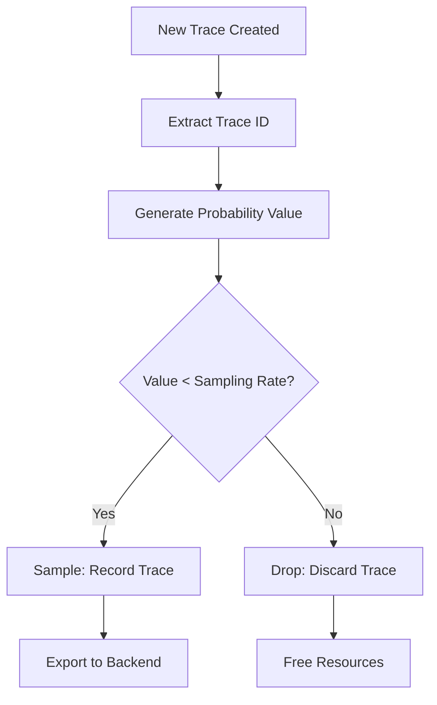
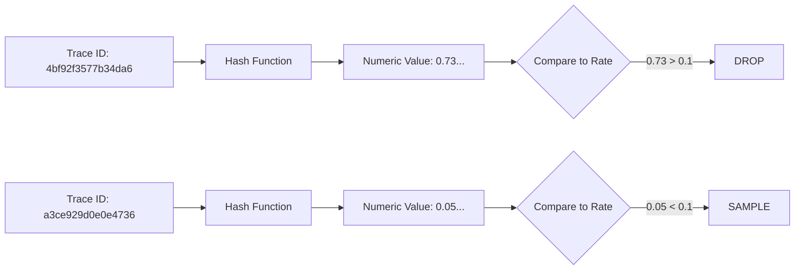
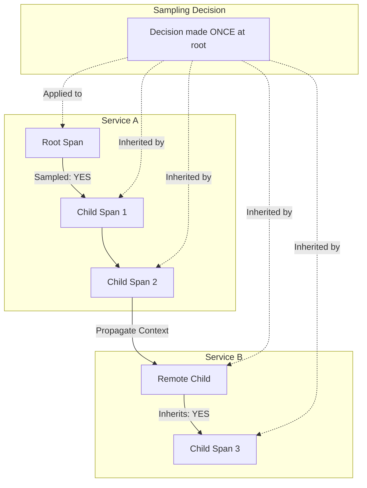
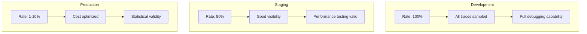
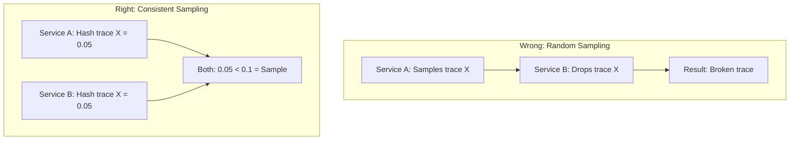

# How to Build Probability Sampling

Author: [nawazdhandala](https://github.com/nawazdhandala)

Tags: Observability, Tracing, OpenTelemetry, Sampling

Description: Learn how to implement probability-based sampling for consistent trace sampling rates.

---

Distributed tracing generates enormous volumes of data. In production systems handling thousands of requests per second, storing every single trace becomes prohibitively expensive and often unnecessary. Probability sampling solves this by keeping a mathematically consistent subset of traces while maintaining statistical validity.

This guide walks through building probability sampling from first principles, covering sampling rate configuration, consistent hashing for deterministic decisions, and environment-specific tuning strategies.

---

## Table of Contents

1. Why Probability Sampling Matters
2. Core Concepts
3. How Probability Sampling Works
4. Implementing a Basic Probability Sampler
5. Consistent Hashing for Deterministic Sampling
6. Parent-Based Sampling
7. Configuring Sampling Rates
8. Environment-Specific Sampling Strategies
9. OpenTelemetry Integration
10. Testing Your Sampler
11. Production Considerations
12. Common Pitfalls

---

## 1. Why Probability Sampling Matters

Without sampling, a service handling 10,000 requests per second generates approximately:

- 864 million spans per day (assuming 1 span per request)
- Multiple terabytes of trace data monthly
- Significant network, storage, and processing costs

Probability sampling addresses this by:

| Benefit | Description |
|---------|-------------|
| Cost Control | Reduce storage and egress costs linearly with sampling rate |
| Performance | Lower CPU and memory overhead in your application |
| Statistical Validity | Maintain representative data for analysis |
| Consistency | Same trace ID always produces the same sampling decision |

---

## 2. Core Concepts

| Term | Definition |
|------|------------|
| Sampling Rate | The probability (0.0 to 1.0) that a trace will be kept |
| Head Sampling | Decision made at trace creation time |
| Tail Sampling | Decision made after seeing the complete trace |
| Consistent Sampling | Same input always produces same decision |
| Parent-Based Sampling | Child spans inherit parent's sampling decision |

---

## 3. How Probability Sampling Works

The core idea is simple: generate a random number and compare it to your sampling rate. If the random number falls below the threshold, keep the trace.



The key insight is that "random" should not mean "different each time." Instead, we derive the probability value deterministically from the trace ID, ensuring consistent decisions across services.

---

## 4. Implementing a Basic Probability Sampler

Let's build a probability sampler step by step.

### Basic Random Sampler (Not Recommended for Production)

```typescript
// basic-sampler.ts
// A simple random sampler - useful for understanding concepts
// but NOT recommended for production due to inconsistency

interface SamplingResult {
  // Whether to sample this trace
  decision: 'RECORD_AND_SAMPLE' | 'DROP';
  // Attributes to add to the span
  attributes: Record<string, string | number>;
}

class BasicProbabilitySampler {
  // The sampling rate between 0.0 (sample nothing) and 1.0 (sample everything)
  private readonly samplingRate: number;

  constructor(samplingRate: number) {
    // Validate the sampling rate is within bounds
    if (samplingRate < 0 || samplingRate > 1) {
      throw new Error('Sampling rate must be between 0.0 and 1.0');
    }
    this.samplingRate = samplingRate;
  }

  shouldSample(traceId: string): SamplingResult {
    // Generate a random value between 0 and 1
    const randomValue = Math.random();

    // Compare against sampling rate
    const shouldSample = randomValue < this.samplingRate;

    return {
      decision: shouldSample ? 'RECORD_AND_SAMPLE' : 'DROP',
      attributes: {
        'sampling.rate': this.samplingRate,
        'sampling.random_value': randomValue,
      },
    };
  }
}

// Usage example
const sampler = new BasicProbabilitySampler(0.1); // 10% sampling
const result = sampler.shouldSample('abc123');
console.log(result.decision); // Either 'RECORD_AND_SAMPLE' or 'DROP'
```

**Problem**: This approach produces different decisions for the same trace ID across different services, breaking trace completeness.

---

## 5. Consistent Hashing for Deterministic Sampling

To ensure the same trace ID always produces the same sampling decision, we use consistent hashing. The trace ID becomes the source of randomness.

### How Consistent Hashing Works



### Production-Ready Consistent Sampler

```typescript
// consistent-sampler.ts
// A production-ready probability sampler using consistent hashing
// This ensures the same trace ID always produces the same decision

import { createHash } from 'crypto';

interface SamplingDecision {
  decision: 'RECORD_AND_SAMPLE' | 'DROP';
  probability: number;
  traceIdHash: number;
}

class ConsistentProbabilitySampler {
  private readonly samplingRate: number;
  // Upper bound for trace ID comparison (rate * max value)
  private readonly upperBound: bigint;
  // Maximum value for a 128-bit trace ID
  private static readonly MAX_TRACE_ID = BigInt('0xffffffffffffffffffffffffffffffff');

  constructor(samplingRate: number) {
    // Validate input
    if (samplingRate < 0 || samplingRate > 1) {
      throw new Error('Sampling rate must be between 0.0 and 1.0');
    }

    this.samplingRate = samplingRate;

    // Calculate the upper bound for sampling
    // If rate is 0.1, upper bound is 10% of max trace ID value
    this.upperBound = BigInt(
      Math.floor(samplingRate * Number(ConsistentProbabilitySampler.MAX_TRACE_ID / BigInt(1e15))) * 1e15
    );
  }

  shouldSample(traceId: string): SamplingDecision {
    // Handle edge cases
    if (this.samplingRate === 0) {
      return { decision: 'DROP', probability: 0, traceIdHash: 0 };
    }
    if (this.samplingRate === 1) {
      return { decision: 'RECORD_AND_SAMPLE', probability: 1, traceIdHash: 1 };
    }

    // Convert trace ID to a numeric value for comparison
    const traceIdNumeric = this.traceIdToNumeric(traceId);

    // Compare against upper bound
    const shouldSample = traceIdNumeric < this.upperBound;

    return {
      decision: shouldSample ? 'RECORD_AND_SAMPLE' : 'DROP',
      probability: this.samplingRate,
      traceIdHash: Number(traceIdNumeric % BigInt(1e6)) / 1e6,
    };
  }

  private traceIdToNumeric(traceId: string): bigint {
    // Remove any dashes or formatting from trace ID
    const cleanId = traceId.replace(/-/g, '');

    // If trace ID is already hex, convert directly
    if (/^[0-9a-fA-F]+$/.test(cleanId)) {
      return BigInt('0x' + cleanId.padStart(32, '0'));
    }

    // Otherwise, hash the trace ID to get a consistent numeric value
    const hash = createHash('md5').update(traceId).digest('hex');
    return BigInt('0x' + hash);
  }
}

// Usage example
const sampler = new ConsistentProbabilitySampler(0.1);

// Same trace ID always produces the same decision
const traceId = '4bf92f3577b34da6a3ce929d0e0e4736';
console.log(sampler.shouldSample(traceId)); // Always same result
console.log(sampler.shouldSample(traceId)); // Always same result
```

### Alternative: Using Lower 64 Bits (OpenTelemetry Approach)

OpenTelemetry uses the lower 64 bits of the trace ID for sampling decisions:

```typescript
// otel-style-sampler.ts
// Implements the OpenTelemetry trace ID ratio sampling algorithm
// Uses lower 64 bits of trace ID for consistent decisions

class TraceIdRatioSampler {
  private readonly ratio: number;
  private readonly idUpperBound: bigint;

  constructor(ratio: number) {
    if (ratio < 0 || ratio > 1) {
      throw new Error('Ratio must be between 0 and 1');
    }

    this.ratio = ratio;

    // Calculate upper bound based on max unsigned 64-bit integer
    // This matches OpenTelemetry's implementation
    const maxLong = BigInt('0xffffffffffffffff');
    this.idUpperBound = BigInt(Math.floor(ratio * Number(maxLong)));
  }

  shouldSample(traceId: string): boolean {
    // Extract lower 64 bits (last 16 hex characters)
    const lowerHex = traceId.slice(-16).padStart(16, '0');
    const traceIdLower = BigInt('0x' + lowerHex);

    // Sample if lower bits are below threshold
    return traceIdLower < this.idUpperBound;
  }

  getDescription(): string {
    return `TraceIdRatioBased{${this.ratio}}`;
  }
}

// Verify consistency
const sampler = new TraceIdRatioSampler(0.25);
const testId = 'abcdef1234567890abcdef1234567890';

// Run 100 times - should always return the same result
const results = Array.from({ length: 100 }, () => sampler.shouldSample(testId));
const allSame = results.every(r => r === results[0]);
console.log(`Consistent: ${allSame}`); // true
```

---

## 6. Parent-Based Sampling

In distributed systems, child spans should inherit their parent's sampling decision. This prevents orphaned spans and incomplete traces.



### Implementing Parent-Based Sampling

```typescript
// parent-based-sampler.ts
// Combines consistent sampling with parent-based decisions
// Ensures trace completeness across service boundaries

interface SpanContext {
  traceId: string;
  spanId: string;
  // Whether the parent was sampled
  isSampled: boolean;
  // Whether this is a remote parent (from another service)
  isRemote: boolean;
}

interface SamplingParams {
  // Context of the parent span, if any
  parentContext?: SpanContext;
  // Trace ID for the new span
  traceId: string;
  // Name of the span being created
  spanName: string;
  // Kind of span (SERVER, CLIENT, etc.)
  spanKind: string;
}

class ParentBasedSampler {
  // Sampler for root spans (no parent)
  private readonly rootSampler: TraceIdRatioSampler;
  // Sampler for remote parents that were sampled
  private readonly remoteParentSampled: AlwaysOnSampler;
  // Sampler for remote parents that were not sampled
  private readonly remoteParentNotSampled: AlwaysOffSampler;
  // Sampler for local parents that were sampled
  private readonly localParentSampled: AlwaysOnSampler;
  // Sampler for local parents that were not sampled
  private readonly localParentNotSampled: AlwaysOffSampler;

  constructor(rootSamplingRate: number) {
    this.rootSampler = new TraceIdRatioSampler(rootSamplingRate);
    this.remoteParentSampled = new AlwaysOnSampler();
    this.remoteParentNotSampled = new AlwaysOffSampler();
    this.localParentSampled = new AlwaysOnSampler();
    this.localParentNotSampled = new AlwaysOffSampler();
  }

  shouldSample(params: SamplingParams): boolean {
    const { parentContext, traceId } = params;

    // No parent context means this is a root span
    // Use the probability sampler to make a decision
    if (!parentContext) {
      return this.rootSampler.shouldSample(traceId);
    }

    // Has a parent - inherit the sampling decision
    if (parentContext.isRemote) {
      // Remote parent (from another service)
      return parentContext.isSampled
        ? this.remoteParentSampled.shouldSample()
        : this.remoteParentNotSampled.shouldSample();
    } else {
      // Local parent (same service)
      return parentContext.isSampled
        ? this.localParentSampled.shouldSample()
        : this.localParentNotSampled.shouldSample();
    }
  }
}

// Helper samplers
class AlwaysOnSampler {
  shouldSample(): boolean {
    return true;
  }
}

class AlwaysOffSampler {
  shouldSample(): boolean {
    return false;
  }
}

// Usage
const sampler = new ParentBasedSampler(0.1); // 10% for root spans

// Root span - uses probability sampling
const rootDecision = sampler.shouldSample({
  traceId: 'abc123',
  spanName: 'http.request',
  spanKind: 'SERVER',
});

// Child span - inherits from parent
const childDecision = sampler.shouldSample({
  traceId: 'abc123',
  spanName: 'db.query',
  spanKind: 'CLIENT',
  parentContext: {
    traceId: 'abc123',
    spanId: 'span456',
    isSampled: rootDecision,
    isRemote: false,
  },
});

console.log(`Root: ${rootDecision}, Child: ${childDecision}`);
// Child always matches root
```

---

## 7. Configuring Sampling Rates

Choosing the right sampling rate depends on traffic volume, budget, and observability needs.

### Sampling Rate Guidelines

| Traffic Level | Suggested Rate | Rationale |
|---------------|----------------|-----------|
| Low (< 100 RPS) | 1.0 (100%) | Full visibility, minimal cost |
| Medium (100-1000 RPS) | 0.1-0.5 (10-50%) | Balance cost and visibility |
| High (1000-10000 RPS) | 0.01-0.1 (1-10%) | Focus on statistical sampling |
| Very High (> 10000 RPS) | 0.001-0.01 (0.1-1%) | Cost-driven sampling |

### Dynamic Rate Configuration

```typescript
// config-sampler.ts
// Supports dynamic sampling rate configuration
// Useful for adjusting rates without redeployment

interface SamplerConfig {
  // Base sampling rate
  defaultRate: number;
  // Per-endpoint overrides
  endpointRates?: Record<string, number>;
  // Per-service overrides
  serviceRates?: Record<string, number>;
}

class ConfigurableSampler {
  private config: SamplerConfig;
  private samplers: Map<string, TraceIdRatioSampler> = new Map();

  constructor(config: SamplerConfig) {
    this.config = config;
    this.initializeSamplers();
  }

  private initializeSamplers(): void {
    // Create default sampler
    this.samplers.set('default', new TraceIdRatioSampler(this.config.defaultRate));

    // Create endpoint-specific samplers
    if (this.config.endpointRates) {
      for (const [endpoint, rate] of Object.entries(this.config.endpointRates)) {
        this.samplers.set(`endpoint:${endpoint}`, new TraceIdRatioSampler(rate));
      }
    }

    // Create service-specific samplers
    if (this.config.serviceRates) {
      for (const [service, rate] of Object.entries(this.config.serviceRates)) {
        this.samplers.set(`service:${service}`, new TraceIdRatioSampler(rate));
      }
    }
  }

  shouldSample(traceId: string, endpoint?: string, service?: string): boolean {
    // Check for endpoint-specific rate first
    if (endpoint) {
      const endpointSampler = this.samplers.get(`endpoint:${endpoint}`);
      if (endpointSampler) {
        return endpointSampler.shouldSample(traceId);
      }
    }

    // Check for service-specific rate
    if (service) {
      const serviceSampler = this.samplers.get(`service:${service}`);
      if (serviceSampler) {
        return serviceSampler.shouldSample(traceId);
      }
    }

    // Fall back to default
    return this.samplers.get('default')!.shouldSample(traceId);
  }

  // Hot-reload configuration
  updateConfig(newConfig: SamplerConfig): void {
    this.config = newConfig;
    this.samplers.clear();
    this.initializeSamplers();
  }
}

// Usage with different rates per endpoint
const sampler = new ConfigurableSampler({
  defaultRate: 0.1,          // 10% default
  endpointRates: {
    '/health': 0.001,        // 0.1% for health checks
    '/api/checkout': 0.5,    // 50% for critical paths
    '/api/search': 0.05,     // 5% for high-volume search
  },
  serviceRates: {
    'payment-service': 0.8,  // 80% for payment (critical)
    'logging-service': 0.01, // 1% for logging (high volume)
  },
});
```

---

## 8. Environment-Specific Sampling Strategies

Different environments have different observability needs. Development needs full visibility, while production needs cost efficiency.

### Environment Configuration



### Environment-Aware Sampler Implementation

```typescript
// environment-sampler.ts
// Automatically adjusts sampling based on environment
// Supports development, staging, and production configurations

type Environment = 'development' | 'staging' | 'production' | 'test';

interface EnvironmentSamplingConfig {
  development: {
    defaultRate: number;
    alwaysSampleErrors: boolean;
  };
  staging: {
    defaultRate: number;
    alwaysSampleErrors: boolean;
  };
  production: {
    defaultRate: number;
    alwaysSampleErrors: boolean;
    criticalEndpoints: string[];
    criticalEndpointRate: number;
  };
  test: {
    defaultRate: number;
    alwaysSampleErrors: boolean;
  };
}

const DEFAULT_CONFIG: EnvironmentSamplingConfig = {
  development: {
    defaultRate: 1.0,           // Sample everything in dev
    alwaysSampleErrors: true,
  },
  staging: {
    defaultRate: 0.5,           // 50% in staging
    alwaysSampleErrors: true,
  },
  production: {
    defaultRate: 0.05,          // 5% in production
    alwaysSampleErrors: true,
    criticalEndpoints: ['/api/checkout', '/api/payment', '/api/auth'],
    criticalEndpointRate: 0.25, // 25% for critical paths
  },
  test: {
    defaultRate: 1.0,           // Sample everything in tests
    alwaysSampleErrors: true,
  },
};

class EnvironmentAwareSampler {
  private readonly environment: Environment;
  private readonly config: EnvironmentSamplingConfig;
  private readonly defaultSampler: TraceIdRatioSampler;
  private readonly criticalSampler?: TraceIdRatioSampler;

  constructor(
    environment?: Environment,
    config: EnvironmentSamplingConfig = DEFAULT_CONFIG
  ) {
    // Detect environment from NODE_ENV or explicit parameter
    this.environment = environment || this.detectEnvironment();
    this.config = config;

    const envConfig = this.config[this.environment];
    this.defaultSampler = new TraceIdRatioSampler(envConfig.defaultRate);

    // Create critical endpoint sampler for production
    if (this.environment === 'production') {
      const prodConfig = this.config.production;
      this.criticalSampler = new TraceIdRatioSampler(prodConfig.criticalEndpointRate);
    }
  }

  private detectEnvironment(): Environment {
    const nodeEnv = process.env.NODE_ENV?.toLowerCase();

    switch (nodeEnv) {
      case 'development':
      case 'dev':
        return 'development';
      case 'staging':
      case 'stage':
        return 'staging';
      case 'production':
      case 'prod':
        return 'production';
      case 'test':
        return 'test';
      default:
        // Default to production for safety (lower sampling rate)
        return 'production';
    }
  }

  shouldSample(traceId: string, options?: {
    endpoint?: string;
    hasError?: boolean;
  }): { sampled: boolean; reason: string } {
    const { endpoint, hasError } = options || {};
    const envConfig = this.config[this.environment];

    // Always sample errors if configured
    if (hasError && envConfig.alwaysSampleErrors) {
      return { sampled: true, reason: 'error_always_sampled' };
    }

    // Check for critical endpoints in production
    if (
      this.environment === 'production' &&
      endpoint &&
      this.config.production.criticalEndpoints.includes(endpoint)
    ) {
      const sampled = this.criticalSampler!.shouldSample(traceId);
      return { sampled, reason: 'critical_endpoint' };
    }

    // Use default sampling rate
    const sampled = this.defaultSampler.shouldSample(traceId);
    return { sampled, reason: 'default_rate' };
  }

  getEffectiveRate(endpoint?: string): number {
    if (
      this.environment === 'production' &&
      endpoint &&
      this.config.production.criticalEndpoints.includes(endpoint)
    ) {
      return this.config.production.criticalEndpointRate;
    }
    return this.config[this.environment].defaultRate;
  }

  getEnvironment(): Environment {
    return this.environment;
  }
}

// Usage examples
console.log('--- Development Environment ---');
const devSampler = new EnvironmentAwareSampler('development');
console.log(`Environment: ${devSampler.getEnvironment()}`);
console.log(`Default rate: ${devSampler.getEffectiveRate()}`);

console.log('\n--- Production Environment ---');
const prodSampler = new EnvironmentAwareSampler('production');
console.log(`Environment: ${prodSampler.getEnvironment()}`);
console.log(`Default rate: ${prodSampler.getEffectiveRate()}`);
console.log(`Checkout rate: ${prodSampler.getEffectiveRate('/api/checkout')}`);

// Sampling decisions
const traceId = 'abc123def456';
console.log('\n--- Sampling Decisions ---');
console.log(`Dev sample: ${JSON.stringify(devSampler.shouldSample(traceId))}`);
console.log(`Prod sample: ${JSON.stringify(prodSampler.shouldSample(traceId))}`);
console.log(`Prod checkout: ${JSON.stringify(prodSampler.shouldSample(traceId, { endpoint: '/api/checkout' }))}`);
console.log(`Prod error: ${JSON.stringify(prodSampler.shouldSample(traceId, { hasError: true }))}`);
```

### Environment Variables Configuration

```typescript
// env-config.ts
// Load sampling configuration from environment variables
// Supports runtime configuration without code changes

interface EnvSamplingConfig {
  samplingRate: number;
  criticalRate: number;
  errorSampling: boolean;
  environment: string;
}

function loadSamplingConfig(): EnvSamplingConfig {
  return {
    // Base sampling rate (default: 10%)
    samplingRate: parseFloat(process.env.OTEL_TRACES_SAMPLER_ARG || '0.1'),

    // Critical endpoint rate (default: 50%)
    criticalRate: parseFloat(process.env.SAMPLING_CRITICAL_RATE || '0.5'),

    // Whether to always sample errors (default: true)
    errorSampling: process.env.SAMPLING_ERRORS !== 'false',

    // Environment name
    environment: process.env.NODE_ENV || 'production',
  };
}

// Example .env file:
// OTEL_TRACES_SAMPLER_ARG=0.05
// SAMPLING_CRITICAL_RATE=0.25
// SAMPLING_ERRORS=true
// NODE_ENV=production

const config = loadSamplingConfig();
console.log('Loaded config:', config);
```

---

## 9. OpenTelemetry Integration

Here's how to integrate your probability sampler with OpenTelemetry.

### Using Built-in OpenTelemetry Samplers

```typescript
// otel-integration.ts
// Complete OpenTelemetry setup with probability sampling
// Production-ready configuration

import { NodeSDK } from '@opentelemetry/sdk-node';
import { getNodeAutoInstrumentations } from '@opentelemetry/auto-instrumentations-node';
import { OTLPTraceExporter } from '@opentelemetry/exporter-trace-otlp-http';
import { Resource } from '@opentelemetry/resources';
import {
  SemanticResourceAttributes
} from '@opentelemetry/semantic-conventions';
import {
  ParentBasedSampler,
  TraceIdRatioBasedSampler,
  AlwaysOnSampler,
  AlwaysOffSampler,
} from '@opentelemetry/sdk-trace-node';

// Determine sampling rate based on environment
function getSamplingRate(): number {
  const env = process.env.NODE_ENV || 'production';
  const customRate = process.env.OTEL_TRACES_SAMPLER_ARG;

  if (customRate) {
    return parseFloat(customRate);
  }

  // Environment-specific defaults
  switch (env) {
    case 'development':
      return 1.0;    // 100% in development
    case 'staging':
      return 0.5;    // 50% in staging
    case 'production':
      return 0.05;   // 5% in production
    default:
      return 0.1;    // 10% default
  }
}

// Create the sampler with parent-based logic
function createSampler() {
  const rate = getSamplingRate();

  return new ParentBasedSampler({
    // Root spans use probability sampling
    root: new TraceIdRatioBasedSampler(rate),
    // Remote parent sampled - continue sampling
    remoteParentSampled: new AlwaysOnSampler(),
    // Remote parent not sampled - do not sample
    remoteParentNotSampled: new AlwaysOffSampler(),
    // Local parent sampled - continue sampling
    localParentSampled: new AlwaysOnSampler(),
    // Local parent not sampled - do not sample
    localParentNotSampled: new AlwaysOffSampler(),
  });
}

// Configure the trace exporter
const traceExporter = new OTLPTraceExporter({
  url: process.env.OTEL_EXPORTER_OTLP_ENDPOINT || 'https://oneuptime.com/otlp/v1/traces',
  headers: {
    'x-oneuptime-token': process.env.ONEUPTIME_TOKEN || '',
  },
});

// Create and configure the SDK
const sdk = new NodeSDK({
  // Service identification
  resource: new Resource({
    [SemanticResourceAttributes.SERVICE_NAME]: process.env.SERVICE_NAME || 'my-service',
    [SemanticResourceAttributes.SERVICE_VERSION]: process.env.SERVICE_VERSION || '1.0.0',
    [SemanticResourceAttributes.DEPLOYMENT_ENVIRONMENT]: process.env.NODE_ENV || 'production',
  }),

  // Trace exporter configuration
  traceExporter,

  // Sampling configuration
  sampler: createSampler(),

  // Auto-instrumentation for common libraries
  instrumentations: [
    getNodeAutoInstrumentations({
      // Customize which instrumentations to enable
      '@opentelemetry/instrumentation-fs': {
        enabled: false, // Disable filesystem instrumentation (too noisy)
      },
    }),
  ],
});

// Start the SDK
export async function initTelemetry(): Promise<void> {
  await sdk.start();

  const rate = getSamplingRate();
  console.log(`OpenTelemetry initialized with ${rate * 100}% sampling rate`);

  // Graceful shutdown
  process.on('SIGTERM', async () => {
    await sdk.shutdown();
    console.log('OpenTelemetry shut down');
  });
}

// Call this at application startup
initTelemetry();
```

### Custom Sampler Implementation

```typescript
// custom-otel-sampler.ts
// Implementing a custom OpenTelemetry sampler
// Useful when built-in samplers don't meet your needs

import {
  Sampler,
  SamplingDecision,
  SamplingResult,
  Context,
  SpanKind,
  Attributes,
  Link,
} from '@opentelemetry/api';
import { createHash } from 'crypto';

class CustomProbabilitySampler implements Sampler {
  private readonly ratio: number;
  private readonly description: string;
  private readonly criticalEndpoints: Set<string>;
  private readonly criticalRatio: number;

  constructor(options: {
    ratio: number;
    criticalEndpoints?: string[];
    criticalRatio?: number;
  }) {
    this.ratio = options.ratio;
    this.criticalEndpoints = new Set(options.criticalEndpoints || []);
    this.criticalRatio = options.criticalRatio || 1.0;
    this.description = `CustomProbabilitySampler{ratio=${this.ratio}}`;
  }

  shouldSample(
    context: Context,
    traceId: string,
    spanName: string,
    spanKind: SpanKind,
    attributes: Attributes,
    links: Link[]
  ): SamplingResult {
    // Determine the effective ratio based on span attributes
    let effectiveRatio = this.ratio;

    // Check if this is a critical endpoint
    const httpRoute = attributes['http.route'] as string;
    if (httpRoute && this.criticalEndpoints.has(httpRoute)) {
      effectiveRatio = this.criticalRatio;
    }

    // Calculate sampling decision based on trace ID
    const shouldSample = this.traceIdBasedDecision(traceId, effectiveRatio);

    return {
      decision: shouldSample
        ? SamplingDecision.RECORD_AND_SAMPLED
        : SamplingDecision.NOT_RECORD,
      attributes: {
        'sampling.ratio': effectiveRatio,
        'sampling.decision': shouldSample ? 'sampled' : 'dropped',
      },
    };
  }

  private traceIdBasedDecision(traceId: string, ratio: number): boolean {
    if (ratio >= 1.0) return true;
    if (ratio <= 0.0) return false;

    // Use lower 64 bits of trace ID for decision
    const lowerHex = traceId.slice(-16).padStart(16, '0');
    const traceIdLower = BigInt('0x' + lowerHex);
    const maxLong = BigInt('0xffffffffffffffff');
    const threshold = BigInt(Math.floor(ratio * Number(maxLong)));

    return traceIdLower < threshold;
  }

  toString(): string {
    return this.description;
  }
}

// Usage with OpenTelemetry SDK
import { NodeSDK } from '@opentelemetry/sdk-node';
import { ParentBasedSampler } from '@opentelemetry/sdk-trace-node';

const customSampler = new CustomProbabilitySampler({
  ratio: 0.1,                           // 10% default
  criticalEndpoints: ['/checkout', '/payment'],
  criticalRatio: 0.5,                   // 50% for critical
});

const sdk = new NodeSDK({
  sampler: new ParentBasedSampler({
    root: customSampler,
  }),
  // ... other config
});
```

---

## 10. Testing Your Sampler

Proper testing ensures your sampler behaves correctly across all scenarios.

```typescript
// sampler.test.ts
// Comprehensive tests for probability sampler
// Run with: npm test

import { describe, it, expect, beforeEach } from 'vitest';

describe('TraceIdRatioSampler', () => {
  describe('consistency', () => {
    it('should return same decision for same trace ID', () => {
      const sampler = new TraceIdRatioSampler(0.5);
      const traceId = 'abcdef1234567890abcdef1234567890';

      const results = Array.from({ length: 100 }, () =>
        sampler.shouldSample(traceId)
      );

      // All results should be identical
      const firstResult = results[0];
      expect(results.every(r => r === firstResult)).toBe(true);
    });

    it('should produce different decisions for different trace IDs', () => {
      const sampler = new TraceIdRatioSampler(0.5);
      const traceIds = [
        'aaaa000000000000aaaa000000000000',
        'bbbb000000000000bbbb000000000000',
        'cccc000000000000cccc000000000000',
        'dddd000000000000dddd000000000000',
      ];

      const results = traceIds.map(id => sampler.shouldSample(id));

      // With 50% rate and 4 different IDs, we expect some variation
      // (not all true and not all false)
      const hasVariation =
        results.some(r => r === true) &&
        results.some(r => r === false);

      // Note: This could theoretically fail but is extremely unlikely
      expect(hasVariation || results.length < 4).toBe(true);
    });
  });

  describe('rate accuracy', () => {
    it('should sample approximately at configured rate', () => {
      const targetRate = 0.1; // 10%
      const sampler = new TraceIdRatioSampler(targetRate);
      const sampleCount = 10000;

      // Generate many unique trace IDs and count samples
      let sampledCount = 0;
      for (let i = 0; i < sampleCount; i++) {
        const traceId = i.toString(16).padStart(32, '0');
        if (sampler.shouldSample(traceId)) {
          sampledCount++;
        }
      }

      const actualRate = sampledCount / sampleCount;

      // Allow 2% tolerance (8-12% for 10% target)
      expect(actualRate).toBeGreaterThan(targetRate - 0.02);
      expect(actualRate).toBeLessThan(targetRate + 0.02);
    });

    it('should sample everything at rate 1.0', () => {
      const sampler = new TraceIdRatioSampler(1.0);

      for (let i = 0; i < 100; i++) {
        const traceId = i.toString(16).padStart(32, '0');
        expect(sampler.shouldSample(traceId)).toBe(true);
      }
    });

    it('should sample nothing at rate 0.0', () => {
      const sampler = new TraceIdRatioSampler(0.0);

      for (let i = 0; i < 100; i++) {
        const traceId = i.toString(16).padStart(32, '0');
        expect(sampler.shouldSample(traceId)).toBe(false);
      }
    });
  });

  describe('edge cases', () => {
    it('should handle invalid rates', () => {
      expect(() => new TraceIdRatioSampler(-0.1)).toThrow();
      expect(() => new TraceIdRatioSampler(1.5)).toThrow();
    });

    it('should handle short trace IDs', () => {
      const sampler = new TraceIdRatioSampler(0.5);

      // Should not throw for short IDs
      expect(() => sampler.shouldSample('abc')).not.toThrow();
      expect(() => sampler.shouldSample('')).not.toThrow();
    });

    it('should handle trace IDs with dashes', () => {
      const sampler = new TraceIdRatioSampler(0.5);
      const withDashes = 'abcd-1234-5678-90ab-cdef-1234-5678-90ab';
      const withoutDashes = 'abcd123456789abcdef1234567890ab';

      // Should handle both formats
      expect(() => sampler.shouldSample(withDashes)).not.toThrow();
      expect(() => sampler.shouldSample(withoutDashes)).not.toThrow();
    });
  });
});

describe('ParentBasedSampler', () => {
  it('should use root sampler when no parent', () => {
    const sampler = new ParentBasedSampler(0.5);

    // Without parent context, should use root sampler
    const result = sampler.shouldSample({
      traceId: 'abc123',
      spanName: 'test',
      spanKind: 'SERVER',
    });

    expect(typeof result).toBe('boolean');
  });

  it('should inherit sampled decision from parent', () => {
    const sampler = new ParentBasedSampler(0.0); // 0% root rate

    // Parent was sampled, child should be sampled regardless of root rate
    const result = sampler.shouldSample({
      traceId: 'abc123',
      spanName: 'test',
      spanKind: 'CLIENT',
      parentContext: {
        traceId: 'abc123',
        spanId: 'span456',
        isSampled: true,
        isRemote: false,
      },
    });

    expect(result).toBe(true);
  });

  it('should inherit not-sampled decision from parent', () => {
    const sampler = new ParentBasedSampler(1.0); // 100% root rate

    // Parent was not sampled, child should not be sampled
    const result = sampler.shouldSample({
      traceId: 'abc123',
      spanName: 'test',
      spanKind: 'CLIENT',
      parentContext: {
        traceId: 'abc123',
        spanId: 'span456',
        isSampled: false,
        isRemote: true,
      },
    });

    expect(result).toBe(false);
  });
});

describe('EnvironmentAwareSampler', () => {
  it('should use 100% rate in development', () => {
    const sampler = new EnvironmentAwareSampler('development');

    // Should sample everything in development
    let sampledCount = 0;
    for (let i = 0; i < 100; i++) {
      const traceId = i.toString(16).padStart(32, '0');
      if (sampler.shouldSample(traceId).sampled) {
        sampledCount++;
      }
    }

    expect(sampledCount).toBe(100);
  });

  it('should always sample errors', () => {
    const sampler = new EnvironmentAwareSampler('production');

    // Even with low production rate, errors should be sampled
    for (let i = 0; i < 100; i++) {
      const traceId = i.toString(16).padStart(32, '0');
      const result = sampler.shouldSample(traceId, { hasError: true });
      expect(result.sampled).toBe(true);
      expect(result.reason).toBe('error_always_sampled');
    }
  });
});
```

---

## 11. Production Considerations

### Monitoring Your Sampler

Track these metrics to ensure your sampler is working correctly:

```typescript
// sampler-metrics.ts
// Instrument your sampler to expose metrics
// Essential for monitoring sampling effectiveness

import { Counter, Histogram, Registry } from 'prom-client';

const registry = new Registry();

// Count of sampling decisions
const samplingDecisions = new Counter({
  name: 'sampling_decisions_total',
  help: 'Total number of sampling decisions',
  labelNames: ['decision', 'reason', 'environment'],
  registers: [registry],
});

// Distribution of trace IDs across sampling buckets
const traceIdDistribution = new Histogram({
  name: 'trace_id_hash_distribution',
  help: 'Distribution of trace ID hash values',
  buckets: [0.1, 0.2, 0.3, 0.4, 0.5, 0.6, 0.7, 0.8, 0.9, 1.0],
  registers: [registry],
});

class InstrumentedSampler {
  private readonly sampler: TraceIdRatioSampler;
  private readonly environment: string;

  constructor(ratio: number, environment: string) {
    this.sampler = new TraceIdRatioSampler(ratio);
    this.environment = environment;
  }

  shouldSample(traceId: string, reason: string = 'default'): boolean {
    const decision = this.sampler.shouldSample(traceId);

    // Record metric
    samplingDecisions.inc({
      decision: decision ? 'sampled' : 'dropped',
      reason,
      environment: this.environment,
    });

    // Track distribution for uniformity analysis
    const hashValue = this.getHashValue(traceId);
    traceIdDistribution.observe(hashValue);

    return decision;
  }

  private getHashValue(traceId: string): number {
    const lowerHex = traceId.slice(-16).padStart(16, '0');
    const traceIdLower = BigInt('0x' + lowerHex);
    const maxLong = BigInt('0xffffffffffffffff');
    return Number(traceIdLower) / Number(maxLong);
  }
}

// Expose metrics endpoint
import express from 'express';
const app = express();

app.get('/metrics', async (req, res) => {
  res.set('Content-Type', registry.contentType);
  res.end(await registry.metrics());
});
```

### Performance Optimization

```typescript
// optimized-sampler.ts
// Performance-optimized sampler for high-throughput systems
// Minimizes allocations and computation

class OptimizedSampler {
  private readonly threshold: bigint;
  private readonly ratio: number;

  // Pre-computed mask for extracting lower 64 bits
  private static readonly LOWER_MASK = BigInt('0xffffffffffffffff');

  constructor(ratio: number) {
    this.ratio = ratio;

    // Pre-compute threshold once
    if (ratio <= 0) {
      this.threshold = BigInt(0);
    } else if (ratio >= 1) {
      this.threshold = OptimizedSampler.LOWER_MASK;
    } else {
      this.threshold = BigInt(Math.floor(ratio * Number(OptimizedSampler.LOWER_MASK)));
    }
  }

  // Optimized for hot path - minimal allocations
  shouldSample(traceIdLower64: bigint): boolean {
    return traceIdLower64 < this.threshold;
  }

  // Pre-parse trace ID outside hot path if possible
  static parseTraceIdLower64(traceId: string): bigint {
    // Fast path: already 16 chars
    if (traceId.length === 16) {
      return BigInt('0x' + traceId);
    }
    // Extract lower 64 bits (last 16 hex chars)
    return BigInt('0x' + traceId.slice(-16).padStart(16, '0'));
  }
}

// Usage in hot path
const sampler = new OptimizedSampler(0.1);

function processRequest(traceId: string): void {
  // Parse once at request start
  const traceIdLower = OptimizedSampler.parseTraceIdLower64(traceId);

  // Fast sampling check
  if (sampler.shouldSample(traceIdLower)) {
    // Record span
  }
}
```

---

## 12. Common Pitfalls

### Pitfall 1: Inconsistent Sampling Across Services



**Solution**: Always use trace ID-based consistent hashing.

### Pitfall 2: Ignoring Parent Sampling Decisions

```typescript
// BAD: Ignoring parent decision
function badSampler(traceId: string): boolean {
  // This breaks trace completeness!
  return Math.random() < 0.1;
}

// GOOD: Respecting parent decision
function goodSampler(traceId: string, parentSampled?: boolean): boolean {
  // If parent exists, inherit its decision
  if (parentSampled !== undefined) {
    return parentSampled;
  }
  // Only make new decision for root spans
  return traceIdBasedDecision(traceId, 0.1);
}
```

### Pitfall 3: Sampling Rate Mismatch Between Services

```typescript
// PROBLEM: Different services using different rates
// Service A: 10%
// Service B: 5%
// Result: 50% of Service A traces are orphaned in Service B

// SOLUTION: Use parent-based sampling everywhere
// Only root spans use the configured rate
// All child spans inherit from parent

const sampler = new ParentBasedSampler({
  root: new TraceIdRatioSampler(0.1),  // Only affects root spans
  // Child spans always inherit
});
```

### Pitfall 4: Not Adjusting for Traffic Spikes

```typescript
// Adaptive sampling that adjusts based on traffic
class AdaptiveSampler {
  private currentRate: number;
  private readonly minRate: number;
  private readonly maxRate: number;
  private readonly targetTracesPerSecond: number;
  private requestCount: number = 0;
  private lastAdjustment: number = Date.now();

  constructor(options: {
    initialRate: number;
    minRate: number;
    maxRate: number;
    targetTracesPerSecond: number;
  }) {
    this.currentRate = options.initialRate;
    this.minRate = options.minRate;
    this.maxRate = options.maxRate;
    this.targetTracesPerSecond = options.targetTracesPerSecond;
  }

  shouldSample(traceId: string): boolean {
    this.requestCount++;
    this.maybeAdjustRate();

    return new TraceIdRatioSampler(this.currentRate).shouldSample(traceId);
  }

  private maybeAdjustRate(): void {
    const now = Date.now();
    const elapsed = (now - this.lastAdjustment) / 1000;

    // Adjust every 10 seconds
    if (elapsed < 10) return;

    const requestsPerSecond = this.requestCount / elapsed;
    const currentTracesPerSecond = requestsPerSecond * this.currentRate;

    // Adjust rate to hit target
    if (currentTracesPerSecond > this.targetTracesPerSecond * 1.2) {
      // Too many traces, reduce rate
      this.currentRate = Math.max(
        this.minRate,
        this.currentRate * 0.8
      );
    } else if (currentTracesPerSecond < this.targetTracesPerSecond * 0.8) {
      // Too few traces, increase rate
      this.currentRate = Math.min(
        this.maxRate,
        this.currentRate * 1.2
      );
    }

    this.requestCount = 0;
    this.lastAdjustment = now;
  }

  getCurrentRate(): number {
    return this.currentRate;
  }
}
```

---

## Summary

Probability sampling is essential for managing distributed tracing at scale. Key takeaways:

| Concept | Implementation |
|---------|----------------|
| Consistent Sampling | Use trace ID hash, not random numbers |
| Parent-Based | Child spans inherit parent's decision |
| Environment Awareness | Higher rates in dev, lower in production |
| Configuration | Support runtime adjustments via env vars |
| Testing | Verify consistency and rate accuracy |
| Monitoring | Track sampling decisions with metrics |

The most important principle: **determinism**. The same trace ID must produce the same sampling decision across all services, every time.

---

## Further Reading

- [OpenTelemetry Sampling Specification](https://opentelemetry.io/docs/specs/otel/trace/sdk/#sampling)
- [Traces and Spans in OpenTelemetry](/blog/post/2025-08-27-traces-and-spans-in-opentelemetry)
- [How to Reduce Noise in OpenTelemetry](/blog/post/2025-08-25-how-to-reduce-noise-in-opentelemetry)

---

*Ready to implement probability sampling? [OneUptime](https://oneuptime.com) supports OpenTelemetry traces with configurable sampling, giving you full control over your observability costs while maintaining visibility into your distributed systems.*
