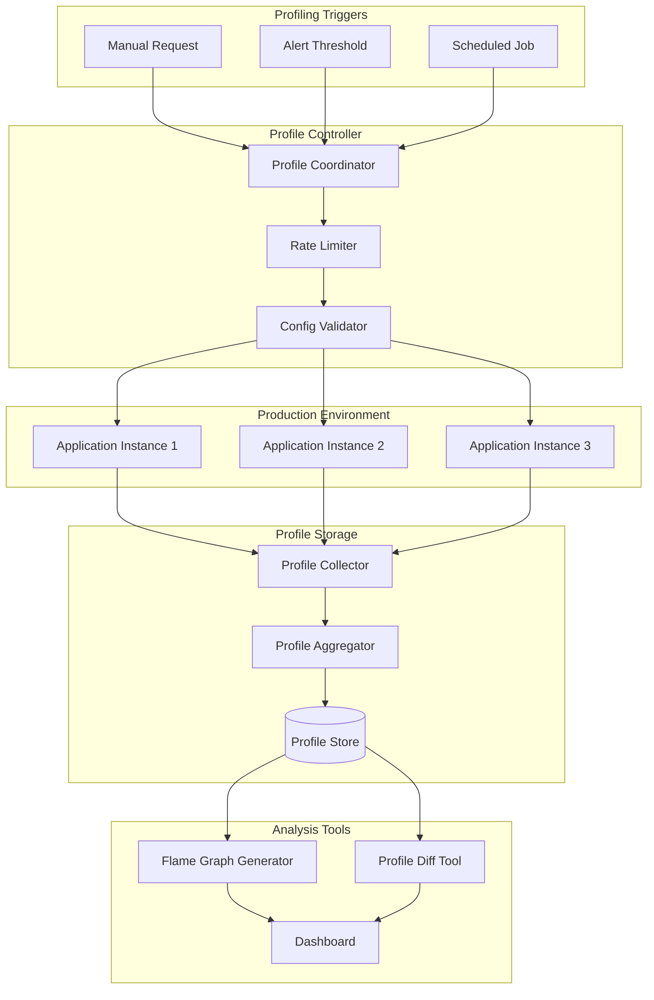
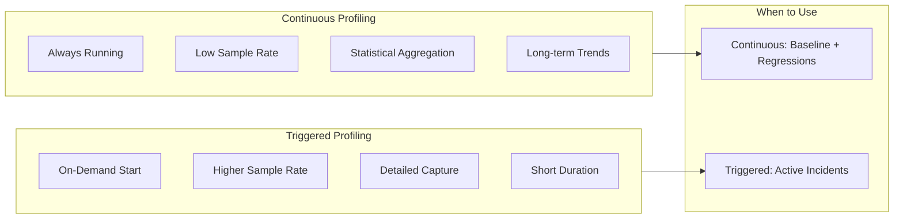

# How to Implement Production Profiling

Author: [nawazdhandala](https://github.com/nawazdhandala)

Tags: Performance, Profiling, Production, SRE

Description: A practical guide to safely profiling live systems with minimal overhead, covering sampling strategies, triggered profiling, and real-world implementation patterns.

---

Production profiling is the practice of collecting performance data from live systems to understand CPU usage, memory allocation, and execution bottlenecks without disrupting user traffic. Unlike development profiling where you can be aggressive with sampling, production profiling requires careful consideration of overhead, safety, and actionability.

---

## Why Profile in Production?

Development and staging environments rarely replicate production conditions. You might optimize for synthetic benchmarks only to discover different bottlenecks under real traffic patterns:

- Traffic spikes expose contention you never saw locally
- Data shapes in production differ from test fixtures
- Caching behavior changes with realistic access patterns
- Memory pressure builds over hours, not minutes

Production profiling gives you ground truth. Instead of guessing, you see exactly which functions consume CPU and where memory goes.

---

## Safe Production Profiling Techniques

The first rule of production profiling: do no harm. A profile that degrades user experience defeats its purpose.

### Sampling-Based Profiling

Sampling profiles collect stack traces at intervals rather than instrumenting every function call. This keeps overhead predictable and low.

```javascript
// Node.js: Using the built-in inspector for CPU profiling
// This approach samples at intervals rather than tracing every call

const inspector = require('inspector');
const fs = require('fs');
const session = new inspector.Session();

session.connect();

// Start profiling with a sampling interval
// Higher interval = lower overhead but less precision
function startProfiling() {
  session.post('Profiler.enable', () => {
    session.post('Profiler.start');
    console.log('Profiler started');
  });
}

// Stop and save the profile
function stopProfiling(filename) {
  session.post('Profiler.stop', (err, { profile }) => {
    if (err) {
      console.error('Profiling error:', err);
      return;
    }
    // Write profile to disk for later analysis
    fs.writeFileSync(filename, JSON.stringify(profile));
    console.log(`Profile saved to ${filename}`);
  });
}
```

```python
# Python: Using cProfile with controlled duration
# Wrap specific code paths rather than the entire process

import cProfile
import pstats
import io
from functools import wraps

def profile_endpoint(duration_seconds=10):
    """
    Decorator to profile a function for a limited duration.
    Automatically stops profiling after the specified time.
    """
    def decorator(func):
        @wraps(func)
        def wrapper(*args, **kwargs):
            profiler = cProfile.Profile()
            profiler.enable()
            try:
                return func(*args, **kwargs)
            finally:
                profiler.disable()
                # Output stats sorted by cumulative time
                stream = io.StringIO()
                stats = pstats.Stats(profiler, stream=stream)
                stats.sort_stats('cumulative')
                stats.print_stats(20)  # Top 20 functions only
                print(stream.getvalue())
        return wrapper
    return decorator
```

### Statistical Sampling with async-profiler (JVM)

For Java applications, async-profiler provides low-overhead sampling:

```bash
# Start profiling for 30 seconds with 10ms sampling interval
# Output as flamegraph-compatible format

./profiler.sh -d 30 -i 10ms -o flamegraph -f /tmp/profile.html <pid>

# For allocation profiling (track where memory is allocated)
./profiler.sh -d 30 -e alloc -o flamegraph -f /tmp/alloc.html <pid>
```

---

## Sampling Rate Configuration

Sampling rate directly affects both accuracy and overhead. Here is the tradeoff:

| Sampling Interval | Overhead | Accuracy | Use Case |
|-------------------|----------|----------|----------|
| 1ms | High (5-10%) | Very High | Short debugging sessions only |
| 10ms | Moderate (1-3%) | High | Triggered profiling during incidents |
| 100ms | Low (<1%) | Medium | Continuous profiling in production |
| 1000ms | Minimal (<0.1%) | Low | Always-on baseline monitoring |

### Configuring Sampling Rates

```javascript
// Node.js: Configurable sampling for production
// Default to conservative settings, allow override for debugging

const PROFILING_CONFIG = {
  // Default: 100ms interval for production safety
  samplingInterval: process.env.PROFILE_INTERVAL_MS
    ? parseInt(process.env.PROFILE_INTERVAL_MS)
    : 100,

  // Maximum profile duration to prevent runaway profiling
  maxDurationSeconds: process.env.PROFILE_MAX_DURATION
    ? parseInt(process.env.PROFILE_MAX_DURATION)
    : 60,

  // Only enable if explicitly requested
  enabled: process.env.ENABLE_PROFILING === 'true'
};

function validateConfig(config) {
  // Safety checks: reject dangerous configurations
  if (config.samplingInterval < 10) {
    console.warn('Sampling interval too aggressive, using 10ms minimum');
    config.samplingInterval = 10;
  }
  if (config.maxDurationSeconds > 300) {
    console.warn('Profile duration too long, capping at 5 minutes');
    config.maxDurationSeconds = 300;
  }
  return config;
}
```

```go
// Go: pprof with configurable sampling
// Built-in pprof is production-safe by design

package main

import (
    "net/http"
    _ "net/http/pprof"  // Register pprof handlers
    "runtime"
)

func configureProfiling() {
    // CPU profile sampling rate (default is 100Hz = 10ms)
    // Lower rate = less overhead
    runtime.SetCPUProfileRate(100)

    // Memory profile sampling rate
    // Sample 1 in every N allocations
    // Higher value = less overhead but less precision
    runtime.MemProfileRate = 524288  // Sample every 512KB allocated
}

func main() {
    configureProfiling()

    // Expose pprof endpoints on a separate port
    // Never expose this on your public-facing port
    go func() {
        http.ListenAndServe("localhost:6060", nil)
    }()

    // Your application code here
}
```

---

## Production Profiling Architecture

Here is how a typical production profiling system works:



---

## Impact Assessment and Limits

Before enabling production profiling, establish clear limits and monitoring:

### Resource Limits

```yaml
# Kubernetes resource limits for profiling sidecar
apiVersion: v1
kind: Pod
metadata:
  name: app-with-profiler
spec:
  containers:
  - name: app
    resources:
      limits:
        cpu: "2"
        memory: "4Gi"
  - name: profiler-sidecar
    image: profiler:latest
    resources:
      # Dedicated resources for profiling
      # Prevents profiler from stealing app resources
      limits:
        cpu: "200m"      # 0.2 CPU cores max
        memory: "256Mi"  # 256MB memory max
      requests:
        cpu: "50m"
        memory: "64Mi"
```

### Circuit Breaker Pattern

```javascript
// Implement a circuit breaker to stop profiling if overhead is detected

class ProfilingCircuitBreaker {
  constructor(options = {}) {
    // Maximum acceptable latency increase (percentage)
    this.maxLatencyIncrease = options.maxLatencyIncrease || 5;

    // Number of consecutive violations before tripping
    this.violationThreshold = options.violationThreshold || 3;

    // Time to wait before retrying after trip
    this.cooldownMs = options.cooldownMs || 60000;

    this.violations = 0;
    this.isOpen = false;
    this.lastTrip = null;
  }

  recordLatency(baselineMs, currentMs) {
    const increasePercent = ((currentMs - baselineMs) / baselineMs) * 100;

    if (increasePercent > this.maxLatencyIncrease) {
      this.violations++;
      console.warn(`Profiling latency impact: ${increasePercent.toFixed(1)}%`);

      if (this.violations >= this.violationThreshold) {
        this.trip();
      }
    } else {
      // Reset violations on good behavior
      this.violations = Math.max(0, this.violations - 1);
    }
  }

  trip() {
    this.isOpen = true;
    this.lastTrip = Date.now();
    console.error('Circuit breaker tripped: stopping profiling');
    // Signal profiler to stop
    this.stopProfiling();
  }

  canProfile() {
    if (!this.isOpen) return true;

    // Check if cooldown has passed
    if (Date.now() - this.lastTrip > this.cooldownMs) {
      this.isOpen = false;
      this.violations = 0;
      return true;
    }
    return false;
  }

  stopProfiling() {
    // Implementation depends on your profiler
    process.emit('stop-profiling');
  }
}
```

---

## Triggered vs Continuous Profiling

There are two main approaches to production profiling, each with distinct tradeoffs:

### Continuous Profiling

Continuous profiling runs at all times with very low overhead. It provides a baseline for comparison and catches issues that only appear under specific conditions.



```python
# Continuous profiling with periodic aggregation

import threading
import time
from collections import defaultdict

class ContinuousProfiler:
    """
    Low-overhead continuous profiler that aggregates samples over time.
    Designed to run indefinitely with minimal impact.
    """

    def __init__(self, sample_interval_ms=100, aggregation_window_seconds=60):
        self.sample_interval = sample_interval_ms / 1000.0
        self.aggregation_window = aggregation_window_seconds
        self.samples = defaultdict(int)
        self.running = False
        self.thread = None

    def start(self):
        """Start continuous profiling in background thread."""
        self.running = True
        self.thread = threading.Thread(target=self._profile_loop, daemon=True)
        self.thread.start()

    def _profile_loop(self):
        """Main profiling loop with periodic aggregation."""
        import sys
        last_aggregation = time.time()

        while self.running:
            # Capture current stack frame
            frame = sys._current_frames()
            for thread_id, stack in frame.items():
                # Record simplified stack signature
                stack_sig = self._stack_signature(stack)
                self.samples[stack_sig] += 1

            # Periodic aggregation and export
            if time.time() - last_aggregation > self.aggregation_window:
                self._export_and_reset()
                last_aggregation = time.time()

            time.sleep(self.sample_interval)

    def _stack_signature(self, frame):
        """Create a hashable signature from a stack frame."""
        frames = []
        while frame:
            code = frame.f_code
            frames.append(f"{code.co_filename}:{code.co_name}:{frame.f_lineno}")
            frame = frame.f_back
        return tuple(frames[:10])  # Limit depth to reduce overhead

    def _export_and_reset(self):
        """Export aggregated samples and reset for next window."""
        if not self.samples:
            return

        # Sort by frequency and export top stacks
        top_stacks = sorted(
            self.samples.items(),
            key=lambda x: x[1],
            reverse=True
        )[:100]

        # Export to your observability backend
        self._send_to_backend(top_stacks)
        self.samples.clear()

    def _send_to_backend(self, stacks):
        """Send profile data to your observability platform."""
        # Implementation depends on your backend
        pass
```

### Triggered Profiling

Triggered profiling activates when specific conditions are met. This allows higher-fidelity capture during incidents without constant overhead.

```javascript
// Triggered profiling based on latency thresholds

class TriggeredProfiler {
  constructor(options = {}) {
    // Trigger profiling when p95 latency exceeds this threshold
    this.latencyThresholdMs = options.latencyThresholdMs || 500;

    // Minimum time between triggered profiles
    this.cooldownMs = options.cooldownMs || 300000;  // 5 minutes

    // Duration of triggered profile capture
    this.profileDurationMs = options.profileDurationMs || 30000;  // 30 seconds

    this.lastTrigger = 0;
    this.isProfileActive = false;
    this.latencyWindow = [];
  }

  recordLatency(latencyMs) {
    // Maintain rolling window of latencies
    this.latencyWindow.push(latencyMs);
    if (this.latencyWindow.length > 100) {
      this.latencyWindow.shift();
    }

    // Check if we should trigger
    if (this.shouldTrigger()) {
      this.triggerProfile();
    }
  }

  calculateP95() {
    if (this.latencyWindow.length < 20) return 0;

    const sorted = [...this.latencyWindow].sort((a, b) => a - b);
    const index = Math.floor(sorted.length * 0.95);
    return sorted[index];
  }

  shouldTrigger() {
    // Already profiling
    if (this.isProfileActive) return false;

    // In cooldown period
    if (Date.now() - this.lastTrigger < this.cooldownMs) return false;

    // Check latency threshold
    return this.calculateP95() > this.latencyThresholdMs;
  }

  async triggerProfile() {
    console.log('Latency threshold exceeded, triggering profile capture');

    this.isProfileActive = true;
    this.lastTrigger = Date.now();

    // Start high-fidelity profiling
    const profile = await this.captureProfile(this.profileDurationMs);

    // Send to analysis backend
    await this.uploadProfile(profile, {
      trigger: 'latency_threshold',
      p95_latency: this.calculateP95(),
      timestamp: new Date().toISOString()
    });

    this.isProfileActive = false;
  }

  async captureProfile(durationMs) {
    const inspector = require('inspector');
    const session = new inspector.Session();
    session.connect();

    return new Promise((resolve, reject) => {
      session.post('Profiler.enable', () => {
        // Use more aggressive sampling for triggered profiles
        session.post('Profiler.setSamplingInterval', { interval: 100 });
        session.post('Profiler.start', () => {
          setTimeout(() => {
            session.post('Profiler.stop', (err, { profile }) => {
              if (err) reject(err);
              else resolve(profile);
            });
          }, durationMs);
        });
      });
    });
  }

  async uploadProfile(profile, metadata) {
    // Send to your profiling backend
    // Implementation depends on your infrastructure
  }
}
```

---

## Comparing Continuous and Triggered Approaches

| Aspect | Continuous | Triggered |
|--------|------------|-----------|
| Overhead | Very low (0.1-1%) | Moderate during capture (1-5%) |
| Data Volume | High (aggregated) | Low (episodic) |
| Baseline Visibility | Excellent | None |
| Incident Response | Historical comparison | Real-time detail |
| Implementation Complexity | Higher | Lower |
| Storage Cost | Higher | Lower |

Best practice: Use both. Run continuous profiling at low overhead for baselines, and trigger high-fidelity profiles during incidents or when anomalies are detected.

---

## Practical Implementation Checklist

Before deploying production profiling:

1. **Measure baseline performance** without profiling enabled
2. **Set strict resource limits** for profiler processes
3. **Implement circuit breakers** to stop profiling if overhead is detected
4. **Use separate endpoints** for profiling (never expose on public ports)
5. **Encrypt profile data** in transit and at rest
6. **Set retention policies** for profile storage
7. **Test failover behavior** when profiling is active
8. **Document runbooks** for enabling and disabling profiling

---

## Summary

Production profiling is essential for understanding real-world performance, but it requires careful implementation. Start with conservative sampling rates, implement safety mechanisms like circuit breakers, and combine continuous low-overhead profiling with triggered high-fidelity capture during incidents.

The key principles:
- Sample, do not trace, for acceptable overhead
- Implement safety limits and circuit breakers
- Use both continuous and triggered approaches
- Keep profiling endpoints private and secured
- Always measure the impact of profiling itself

With proper safeguards in place, production profiling transforms from a risky operation into a valuable observability signal that complements your existing logs, metrics, and traces.

---

**Related Reading:**
- [Basics of Profiling: Turning CPU and Memory Hotspots into Action](https://oneuptime.com/blog/post/2025-09-09-basics-of-profiling/view)
- [Three Pillars of Observability: Logs, Metrics, Traces](https://oneuptime.com/blog/post/2025-08-20-three-pillars-of-observability-logs-metrics-traces/view)
- [Node.js Profiling with V8 Inspector](https://oneuptime.com/blog/post/2026-01-06-nodejs-profiling-v8-inspector-chrome-devtools/view)

---

*Ready to add profiling to your observability stack? OneUptime provides integrated support for collecting and analyzing production profiles alongside your logs, metrics, and traces. Start with minimal overhead and scale your profiling as needed.*
