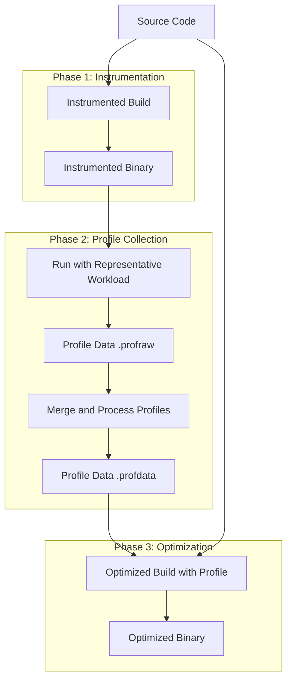
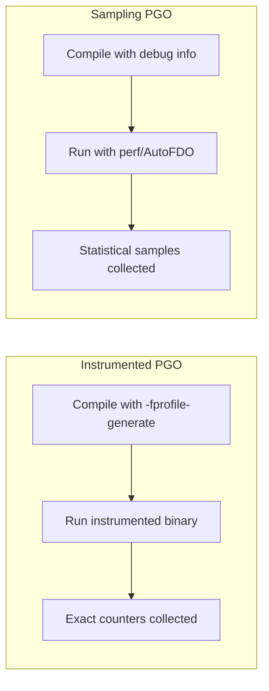
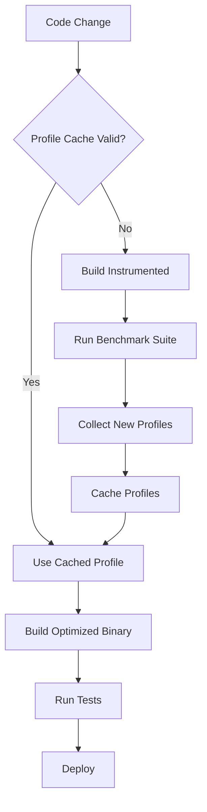

# How to Build Profile-Guided Optimization

Author: [nawazdhandala](https://github.com/nawazdhandala)

Tags: Performance, PGO, Compiler, Optimization

Description: Learn how Profile-Guided Optimization uses runtime data to help compilers generate faster, more efficient code.

---

## Introduction

Profile-Guided Optimization (PGO) is a compiler optimization technique that uses runtime profiling data to make better optimization decisions. Instead of relying solely on static analysis and heuristics, PGO leverages actual execution patterns to guide the compiler toward generating more efficient machine code.

Traditional compilers make educated guesses about code behavior. They assume certain branches are more likely, estimate function call frequencies, and predict memory access patterns. PGO replaces these assumptions with real data collected from representative workloads.

## Why PGO Matters

Modern applications often have complex control flow that compilers struggle to optimize statically. Consider these scenarios where PGO excels:

- **Branch prediction**: PGO knows which branches are taken frequently and optimizes accordingly
- **Function inlining**: Hot functions get inlined while cold functions stay out of line
- **Code layout**: Frequently executed code paths are placed together for better cache utilization
- **Register allocation**: Critical paths get priority access to CPU registers
- **Loop optimizations**: Actual iteration counts guide unrolling decisions

Performance improvements from PGO typically range from 5% to 30%, depending on the application and workload characteristics.

## The PGO Pipeline

The PGO workflow consists of three distinct phases. Here is how the complete pipeline works:



## Instrumented vs Sampling-Based PGO

There are two primary approaches to collecting profile data, each with distinct tradeoffs.

### Instrumentation-Based PGO

The compiler inserts probes into the code that count executions of basic blocks, branches, and function calls. This approach provides precise data but has overhead.

**Advantages:**
- Exact execution counts
- Complete coverage information
- Deterministic results

**Disadvantages:**
- 10-50% runtime overhead during profiling
- Binary size increases during instrumentation phase
- Requires recompilation for instrumented build

### Sampling-Based PGO

The profiler periodically samples the program counter and call stack using hardware performance counters. This has minimal overhead but provides statistical approximations.

**Advantages:**
- Less than 2% runtime overhead
- Works with production binaries
- No instrumented build required

**Disadvantages:**
- Statistical rather than exact counts
- Requires longer profiling runs for accuracy
- May miss infrequently executed paths

Here is a comparison of the two approaches:



## Practical Implementation with Clang/LLVM

Let us walk through a complete PGO workflow using Clang. We will optimize a sample application step by step.

### Step 1: Create the Application

```cpp
// compute.cpp - A sample application with branchy code
#include <iostream>
#include <vector>
#include <random>

// Function that processes data with conditional logic
// PGO will learn which branches are hot
int processValue(int value, int threshold) {
    if (value > threshold) {
        // This branch might be taken 80% of the time
        // PGO will optimize for this case
        return value * 2 + 1;
    } else if (value == threshold) {
        // Rarely taken branch
        // PGO will deprioritize this path
        return value;
    } else {
        // Taken 20% of the time
        return value / 2;
    }
}

// Hot function that gets called frequently
// PGO will likely inline this
inline int hotFunction(int x) {
    return x * x + x;
}

// Cold function called rarely
// PGO will keep this out of line
int coldFunction(int x) {
    std::cout << "Cold path taken: " << x << std::endl;
    return x * x * x;
}

int main() {
    std::vector<int> data(1000000);
    std::mt19937 rng(42);
    std::uniform_int_distribution<int> dist(0, 100);

    // Generate test data
    for (auto& val : data) {
        val = dist(rng);
    }

    long long sum = 0;
    int threshold = 20;  // 80% of values will be above this

    for (const auto& val : data) {
        sum += processValue(val, threshold);
        sum += hotFunction(val);

        // Cold path taken 1% of the time
        if (val == 42) {
            sum += coldFunction(val);
        }
    }

    std::cout << "Result: " << sum << std::endl;
    return 0;
}
```

### Step 2: Build with Instrumentation

```bash
#!/bin/bash
# build_instrumented.sh - Create the instrumented binary

# Clean previous builds
rm -rf build_pgo
mkdir -p build_pgo

# Compile with instrumentation enabled
# -fprofile-generate tells clang to insert profiling counters
clang++ -O2 -fprofile-generate=build_pgo/profiles \
    -o build_pgo/compute_instrumented \
    compute.cpp

echo "Instrumented binary created at build_pgo/compute_instrumented"
```

### Step 3: Collect Profile Data

```bash
#!/bin/bash
# collect_profiles.sh - Run the instrumented binary to collect profiles

# Run with representative workloads
# The more representative the workload, the better the optimization
echo "Running workload 1..."
./build_pgo/compute_instrumented

echo "Running workload 2..."
./build_pgo/compute_instrumented

echo "Running workload 3..."
./build_pgo/compute_instrumented

# Merge all profile data into a single file
# llvm-profdata combines multiple .profraw files
llvm-profdata merge -output=build_pgo/merged.profdata \
    build_pgo/profiles/*.profraw

echo "Profile data merged into build_pgo/merged.profdata"
```

### Step 4: Build the Optimized Binary

```bash
#!/bin/bash
# build_optimized.sh - Create the final optimized binary

# Compile with profile data
# -fprofile-use tells clang to read and apply the profile
clang++ -O2 -fprofile-use=build_pgo/merged.profdata \
    -o build_pgo/compute_optimized \
    compute.cpp

echo "Optimized binary created at build_pgo/compute_optimized"
```

## Build System Integration

### CMake Integration

Here is how to integrate PGO into a CMake project:

```cmake
# CMakeLists.txt with PGO support

cmake_minimum_required(VERSION 3.16)
project(MyProject)

# Option to enable PGO phases
option(PGO_GENERATE "Build with profile generation" OFF)
option(PGO_USE "Build with profile optimization" OFF)

set(PGO_PROFILE_DIR "${CMAKE_BINARY_DIR}/profiles")
set(PGO_PROFILE_DATA "${PGO_PROFILE_DIR}/merged.profdata")

add_executable(myapp main.cpp utils.cpp)

if(PGO_GENERATE)
    # Phase 1: Instrumentation build
    target_compile_options(myapp PRIVATE
        -fprofile-generate=${PGO_PROFILE_DIR}
    )
    target_link_options(myapp PRIVATE
        -fprofile-generate=${PGO_PROFILE_DIR}
    )
    message(STATUS "PGO: Building instrumented binary")

elseif(PGO_USE)
    # Phase 3: Optimized build using collected profiles
    if(NOT EXISTS ${PGO_PROFILE_DATA})
        message(FATAL_ERROR "Profile data not found at ${PGO_PROFILE_DATA}")
    endif()
    target_compile_options(myapp PRIVATE
        -fprofile-use=${PGO_PROFILE_DATA}
    )
    target_link_options(myapp PRIVATE
        -fprofile-use=${PGO_PROFILE_DATA}
    )
    message(STATUS "PGO: Building optimized binary with profile data")

else()
    # Standard build without PGO
    message(STATUS "PGO: Building without profile optimization")
endif()
```

Usage workflow:

```bash
# Step 1: Build instrumented version
cmake -B build_instr -DPGO_GENERATE=ON
cmake --build build_instr

# Step 2: Run with representative workloads
./build_instr/myapp workload1.txt
./build_instr/myapp workload2.txt
./build_instr/myapp workload3.txt

# Step 3: Merge profiles
llvm-profdata merge -output=build_instr/profiles/merged.profdata \
    build_instr/profiles/*.profraw

# Step 4: Build optimized version
cmake -B build_opt -DPGO_USE=ON
cmake --build build_opt
```

### Makefile Integration

```makefile
# Makefile with PGO targets

CXX = clang++
CXXFLAGS = -O2 -Wall
PROFILE_DIR = profiles
PROFILE_DATA = $(PROFILE_DIR)/merged.profdata

SOURCES = main.cpp utils.cpp
TARGET = myapp

# Standard build
$(TARGET): $(SOURCES)
	$(CXX) $(CXXFLAGS) -o $@ $^

# PGO instrumented build
pgo-instrument: $(SOURCES)
	mkdir -p $(PROFILE_DIR)
	$(CXX) $(CXXFLAGS) -fprofile-generate=$(PROFILE_DIR) \
		-o $(TARGET)_instrumented $^
	@echo "Run $(TARGET)_instrumented with representative workloads"
	@echo "Then run 'make pgo-merge' followed by 'make pgo-optimize'"

# Merge collected profiles
pgo-merge:
	llvm-profdata merge -output=$(PROFILE_DATA) $(PROFILE_DIR)/*.profraw
	@echo "Profiles merged into $(PROFILE_DATA)"

# Build optimized binary using profiles
pgo-optimize: $(SOURCES)
	$(CXX) $(CXXFLAGS) -fprofile-use=$(PROFILE_DATA) \
		-o $(TARGET)_optimized $^
	@echo "Optimized binary created: $(TARGET)_optimized"

# Complete PGO workflow with automated training
pgo-full: pgo-instrument
	./$(TARGET)_instrumented < training_input1.txt
	./$(TARGET)_instrumented < training_input2.txt
	./$(TARGET)_instrumented < training_input3.txt
	$(MAKE) pgo-merge
	$(MAKE) pgo-optimize

clean:
	rm -rf $(TARGET) $(TARGET)_instrumented $(TARGET)_optimized $(PROFILE_DIR)

.PHONY: pgo-instrument pgo-merge pgo-optimize pgo-full clean
```

## Sampling-Based PGO with AutoFDO

For production systems where instrumentation overhead is unacceptable, sampling-based PGO using AutoFDO provides an alternative.

```bash
#!/bin/bash
# autofdo_workflow.sh - Sampling-based PGO using perf and AutoFDO

# Build with debug info (needed for symbol resolution)
clang++ -O2 -g -o myapp main.cpp

# Collect samples using Linux perf
# Run this in production or with representative workload
perf record -b -o perf.data ./myapp production_workload.txt

# Convert perf data to AutoFDO format
# create_llvm_prof is part of the AutoFDO toolset
create_llvm_prof --binary=myapp \
    --profile=perf.data \
    --out=autofdo.profdata

# Build optimized binary using AutoFDO profile
clang++ -O2 -fprofile-sample-use=autofdo.profdata \
    -o myapp_optimized main.cpp

echo "Optimized binary ready: myapp_optimized"
```

## Best Practices

### Choosing Representative Workloads

The quality of PGO optimization depends entirely on profile quality. Follow these guidelines:

1. **Use production-like data**: Synthetic benchmarks may not represent real usage patterns
2. **Cover all major code paths**: Include common, uncommon, and edge cases
3. **Match production ratios**: If 90% of calls are reads and 10% are writes, profile with similar ratios
4. **Run multiple iterations**: More samples lead to more accurate profiles
5. **Update profiles periodically**: As usage patterns change, regenerate profiles

### Profile Data Management

```bash
#!/bin/bash
# profile_management.sh - Managing profile data in CI/CD

# Store profiles with version information
PROFILE_VERSION=$(git rev-parse --short HEAD)
PROFILE_ARCHIVE="profiles_${PROFILE_VERSION}.tar.gz"

# Archive profiles for reproducibility
tar -czf $PROFILE_ARCHIVE profiles/

# Upload to artifact storage
aws s3 cp $PROFILE_ARCHIVE s3://mybucket/pgo-profiles/

# In subsequent builds, download and use cached profiles
aws s3 cp s3://mybucket/pgo-profiles/$PROFILE_ARCHIVE .
tar -xzf $PROFILE_ARCHIVE
```

### Continuous Integration Pipeline



## Measuring PGO Impact

Always measure the performance impact of PGO to ensure it provides benefits for your specific workload.

```bash
#!/bin/bash
# benchmark.sh - Compare performance with and without PGO

echo "Building baseline binary..."
clang++ -O2 -o baseline main.cpp

echo "Building PGO-optimized binary..."
# Assume profiles already collected
clang++ -O2 -fprofile-use=merged.profdata -o optimized main.cpp

echo "Running benchmarks..."
echo "Baseline:"
time ./baseline benchmark_input.txt

echo "PGO Optimized:"
time ./optimized benchmark_input.txt

# Use hyperfine for more accurate benchmarking
hyperfine --warmup 3 \
    './baseline benchmark_input.txt' \
    './optimized benchmark_input.txt'
```

## Common Pitfalls

1. **Stale profiles**: Using old profiles with significantly changed code can hurt performance
2. **Unrepresentative workloads**: Profiling with test data that differs from production
3. **Missing profile warnings**: Always check compiler warnings about missing profile data
4. **Cross-compilation issues**: Profiles are architecture-specific; do not mix x86 and ARM profiles

## Conclusion

Profile-Guided Optimization is a powerful technique that bridges the gap between static compiler analysis and actual runtime behavior. By investing in proper profile collection infrastructure, you can achieve significant performance improvements with minimal code changes.

Start with instrumentation-based PGO for development and testing, then consider sampling-based approaches for production profiling. Remember that profile quality matters more than quantity, so focus on representative workloads that match your production environment.

The initial setup effort pays dividends through consistently faster builds that automatically adapt to your application's actual usage patterns.
