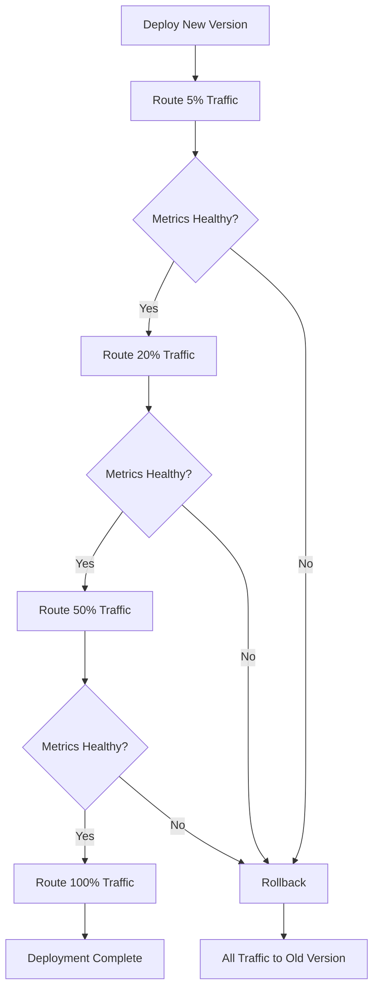
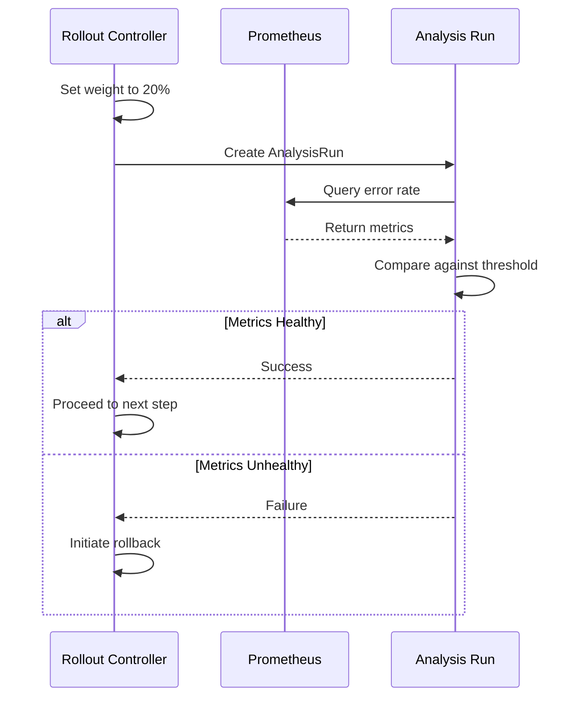

# How to Implement Progressive Rollout

Author: [nawazdhandala](https://github.com/nawazdhandala)

Tags: DevOps, Progressive Delivery, Argo Rollouts, Deployments

Description: Learn to implement progressive rollout for automated phased deployments.

---

Progressive rollout is a deployment strategy that gradually shifts traffic from an old version of your application to a new one. Instead of switching all users at once, you incrementally increase the percentage of traffic going to the new version while monitoring for issues. If something goes wrong, you can quickly roll back before most users are affected.

This approach reduces deployment risk significantly. Rather than hoping your staging environment caught every bug, you validate the new version with real production traffic in a controlled manner.

## Why Progressive Rollout Matters

Traditional deployments follow an all-or-nothing approach. You deploy your new version and hope for the best. If there is a critical bug, all your users experience it simultaneously. Rolling back takes time, and the damage is already done.

Progressive rollout changes this dynamic. You start by sending just 5% of traffic to the new version. If metrics look healthy, you increase to 20%, then 50%, then 100%. At any point, you can pause or roll back if you detect problems.

Here is how a typical progressive rollout flow works:



## Setting Up Argo Rollouts

Argo Rollouts is a Kubernetes controller that provides advanced deployment capabilities including progressive rollouts. It extends Kubernetes with custom resources that define how your deployment should progress.

First, install Argo Rollouts in your cluster.

```bash
# Install Argo Rollouts controller
kubectl create namespace argo-rollouts
kubectl apply -n argo-rollouts -f https://github.com/argoproj/argo-rollouts/releases/latest/download/install.yaml

# Verify the installation
kubectl get pods -n argo-rollouts
```

Next, install the kubectl plugin for easier management.

```bash
# Install the Argo Rollouts kubectl plugin
brew install argoproj/tap/kubectl-argo-rollouts

# Verify plugin installation
kubectl argo rollouts version
```

## Creating Your First Rollout

The Rollout resource replaces the standard Kubernetes Deployment. It looks similar but includes a strategy section that defines how traffic shifts should occur.

Here is a complete Rollout configuration with a canary strategy.

```yaml
# rollout.yaml - Progressive rollout configuration for a web service
apiVersion: argoproj.io/v1alpha1
kind: Rollout
metadata:
  name: web-service
  namespace: production
spec:
  # Number of pods to run
  replicas: 10

  # How to select pods managed by this rollout
  selector:
    matchLabels:
      app: web-service

  # Pod template - same as a Deployment
  template:
    metadata:
      labels:
        app: web-service
    spec:
      containers:
      - name: web-service
        image: myregistry/web-service:v2.0.0
        ports:
        - containerPort: 8080
        resources:
          requests:
            memory: "256Mi"
            cpu: "250m"
          limits:
            memory: "512Mi"
            cpu: "500m"

  # Progressive rollout strategy
  strategy:
    canary:
      # Traffic routing via service mesh or ingress
      canaryService: web-service-canary
      stableService: web-service-stable

      # Traffic routing configuration for Istio
      trafficRouting:
        istio:
          virtualService:
            name: web-service-vsvc
            routes:
            - primary

      # Define the rollout steps
      steps:
      # Step 1: Send 5% of traffic to new version
      - setWeight: 5
      # Wait 2 minutes before proceeding
      - pause: {duration: 2m}

      # Step 2: Increase to 20%
      - setWeight: 20
      # Wait 5 minutes
      - pause: {duration: 5m}

      # Step 3: Increase to 50%
      - setWeight: 50
      # Wait 10 minutes
      - pause: {duration: 10m}

      # Step 4: Full rollout
      - setWeight: 100
```

You also need services to route traffic to the stable and canary versions.

```yaml
# services.yaml - Services for traffic splitting
apiVersion: v1
kind: Service
metadata:
  name: web-service-stable
  namespace: production
spec:
  selector:
    app: web-service
  ports:
  - port: 80
    targetPort: 8080
---
apiVersion: v1
kind: Service
metadata:
  name: web-service-canary
  namespace: production
spec:
  selector:
    app: web-service
  ports:
  - port: 80
    targetPort: 8080
```

Apply the configuration to start your rollout.

```bash
# Apply the rollout and services
kubectl apply -f services.yaml
kubectl apply -f rollout.yaml

# Watch the rollout progress
kubectl argo rollouts get rollout web-service -n production --watch
```

## Adding Automated Analysis

Manual observation during rollouts does not scale. Argo Rollouts supports automated analysis that queries your metrics system and decides whether to proceed or roll back.

The following diagram shows how analysis integrates with the rollout process:



Define an AnalysisTemplate that queries Prometheus for error rates.

```yaml
# analysis-template.yaml - Automated health checks using Prometheus
apiVersion: argoproj.io/v1alpha1
kind: AnalysisTemplate
metadata:
  name: success-rate
  namespace: production
spec:
  # Arguments passed from the Rollout
  args:
  - name: service-name

  # Metrics to evaluate
  metrics:
  - name: success-rate
    # Run every 30 seconds
    interval: 30s
    # Require 3 successful measurements
    successCondition: result[0] >= 0.95
    # Fail after 3 consecutive failures
    failureLimit: 3
    provider:
      prometheus:
        address: http://prometheus.monitoring:9090
        query: |
          sum(rate(
            http_requests_total{
              service="{{args.service-name}}",
              status=~"2.."
            }[5m]
          )) / sum(rate(
            http_requests_total{
              service="{{args.service-name}}"
            }[5m]
          ))
```

Update your Rollout to use the analysis template during each step.

```yaml
# Updated rollout strategy with analysis
strategy:
  canary:
    canaryService: web-service-canary
    stableService: web-service-stable

    # Run analysis in background during rollout
    analysis:
      templates:
      - templateName: success-rate
      startingStep: 1
      args:
      - name: service-name
        value: web-service

    steps:
    - setWeight: 5
    - pause: {duration: 2m}
    - setWeight: 20
    - pause: {duration: 5m}
    - setWeight: 50
    - pause: {duration: 10m}
    - setWeight: 100
```

## Managing Rollouts in Production

During a rollout, you can use the kubectl plugin to monitor progress and intervene when needed.

```bash
# View current rollout status
kubectl argo rollouts get rollout web-service -n production

# Manually promote to next step (skip the pause)
kubectl argo rollouts promote web-service -n production

# Abort the rollout and roll back
kubectl argo rollouts abort web-service -n production

# Retry a failed rollout
kubectl argo rollouts retry rollout web-service -n production
```

## Best Practices

Start with conservative percentages. Beginning at 5% gives you time to detect issues before they affect many users. Increase gradually and use longer pauses at higher percentages where more users are affected.

Monitor the right metrics. Error rates and latency are essential, but also consider business metrics like conversion rates or checkout completions. A deployment might be technically healthy but cause user experience problems.

Set appropriate thresholds. Your success criteria should reflect acceptable performance levels. Setting thresholds too tight causes unnecessary rollbacks while setting them too loose defeats the purpose.

Test your rollback process. Regularly verify that rollbacks work correctly. The worst time to discover a problem with your rollback mechanism is during an actual incident.

## Conclusion

Progressive rollout transforms deployments from high-stress events into routine operations. By gradually shifting traffic and automatically analyzing metrics, you catch problems early and minimize user impact. Argo Rollouts provides the tooling to implement this strategy in Kubernetes with minimal configuration changes to your existing deployments.

Start with a simple canary configuration and add automated analysis as you gain confidence. Your deployments will become safer, and your on-call engineers will thank you.
