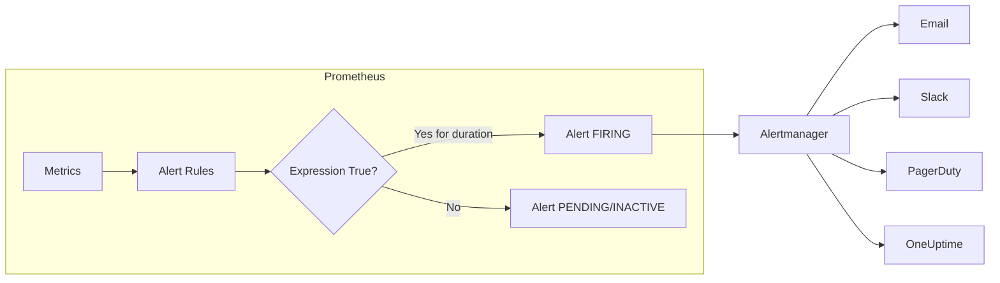
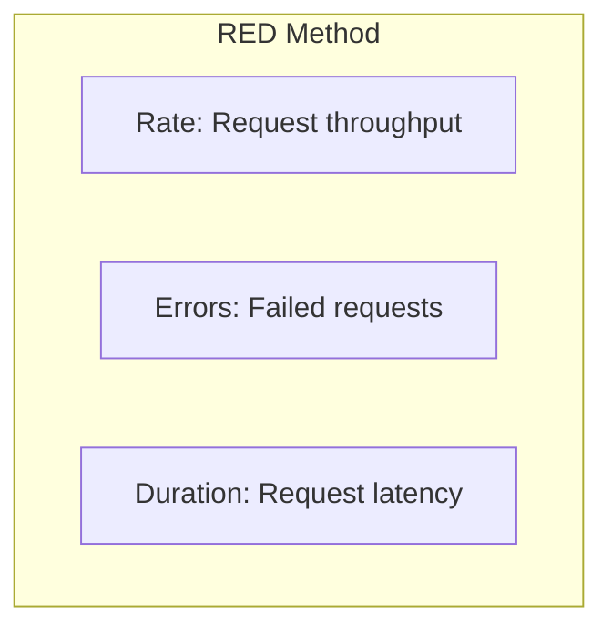
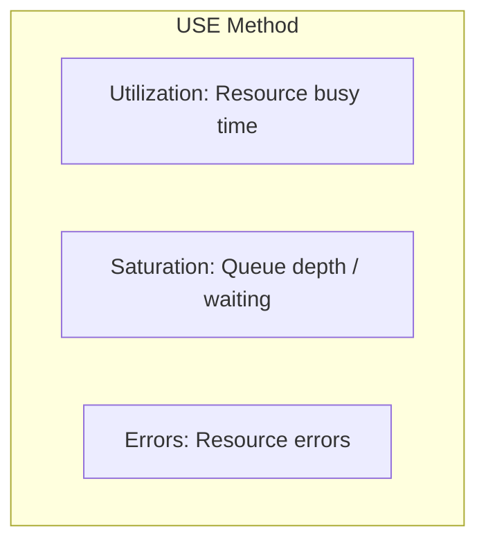
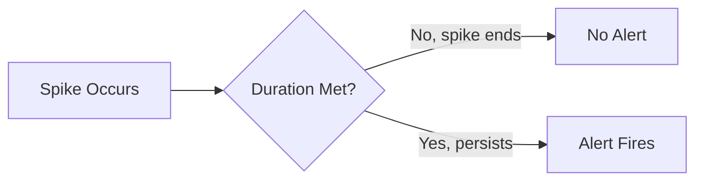
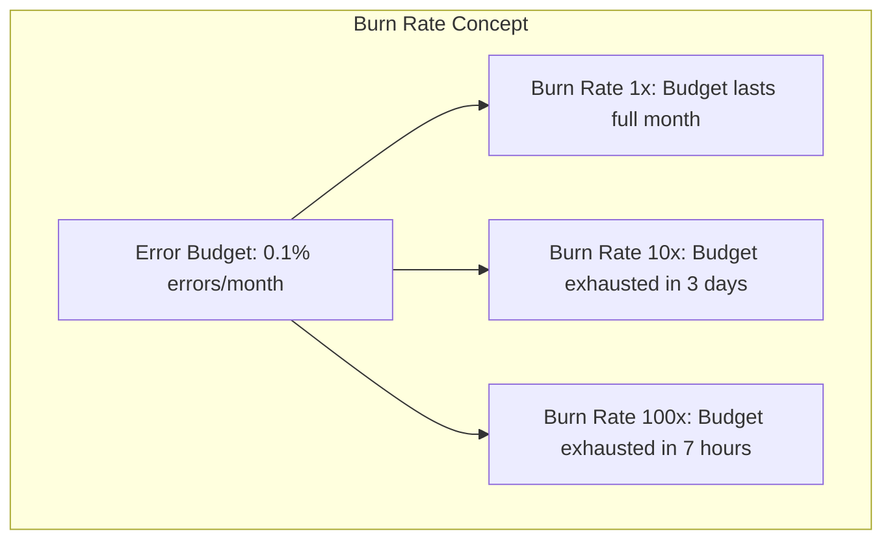
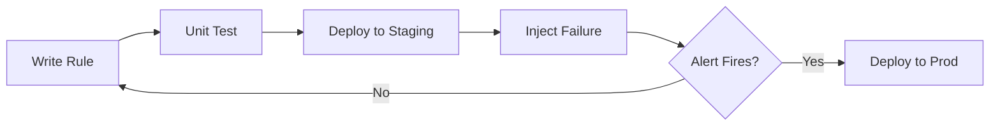

# How to Implement Prometheus Alert Rule Design

Author: [nawazdhandala](https://github.com/nawazdhandala)

Tags: Prometheus, Alerting, Monitoring, Rules

Description: A practical guide to designing effective Prometheus alert rules that reduce noise, catch real incidents, and integrate with modern observability workflows.

---

Prometheus alerting is simple to start but difficult to master. A poorly designed alert rule set will either drown your team in noise or fail to catch real incidents. This guide walks through the principles, patterns, and practical examples you need to build alert rules that actually work.

---

## Table of Contents

1. How Prometheus Alerting Works
2. Alert Rule Anatomy
3. Core Design Principles
4. Choosing What to Alert On
5. Thresholds and Duration
6. Multi-Window and Burn-Rate Alerts
7. Alert Grouping and Routing
8. Practical Examples
9. Testing Alert Rules
10. Common Anti-Patterns
11. Integration with Alertmanager
12. Maintenance and Review

---

## 1. How Prometheus Alerting Works

Prometheus evaluates alert rules at regular intervals. When a rule expression evaluates to true for longer than the specified duration, the alert fires and is sent to Alertmanager, which handles deduplication, grouping, and routing to notification channels.



Key concepts:

| Term | Description |
|------|-------------|
| **Alert Rule** | A PromQL expression combined with labels and duration |
| **PENDING** | Expression is true but duration threshold not yet met |
| **FIRING** | Alert is active and sent to Alertmanager |
| **RESOLVED** | Alert condition no longer true |
| **Alertmanager** | Handles routing, grouping, silencing, and notification |

---

## 2. Alert Rule Anatomy

A Prometheus alert rule has these components. The following example creates an alert that fires when more than 1% of HTTP requests return 5xx errors over the past 5 minutes.

```yaml
groups:
  - name: http_alerts
    interval: 30s
    rules:
      - alert: HighErrorRate
        expr: |
          (
            sum(rate(http_requests_total{status=~"5.."}[5m]))
            /
            sum(rate(http_requests_total[5m]))
          ) > 0.01
        for: 5m
        labels:
          severity: critical
          team: platform
        annotations:
          summary: "High HTTP 5xx error rate detected"
          description: "Error rate is {{ $value | humanizePercentage }} over the last 5 minutes"
          runbook_url: "https://wiki.example.com/runbooks/high-error-rate"
```

| Field | Purpose |
|-------|---------|
| `alert` | Unique name for the alert |
| `expr` | PromQL expression that defines the alert condition |
| `for` | How long the condition must be true before firing |
| `labels` | Metadata for routing and grouping |
| `annotations` | Human-readable context for responders |

---

## 3. Core Design Principles

### Alert on Symptoms, Not Causes

Alert on user-facing impact, not internal system state. Users do not care if CPU is high; they care if the service is slow or unavailable.

| Symptom (Alert On This) | Cause (Investigate, Not Alert) |
|-------------------------|--------------------------------|
| High request latency | High CPU usage |
| Elevated error rate | Memory pressure |
| Service unavailable | Disk I/O saturation |
| Failed transactions | GC pause time |

### Every Alert Needs an Action

If the responder cannot take action when an alert fires, the alert should not exist. Before creating an alert, answer: "What will someone do when this fires?"

### Prefer Fewer, Higher-Quality Alerts

A noisy alerting system trains responders to ignore alerts. Aim for alerts that are:

- **Actionable**: Someone can and should do something
- **Urgent**: It cannot wait until tomorrow
- **Real**: Low false positive rate

---

## 4. Choosing What to Alert On

Use the RED method for services and USE method for resources.

### RED Method (Request-Driven Services)



The RED method focuses on request-driven services. Alerts should cover rate anomalies, error spikes, and latency degradation.

```yaml
# Rate: Sudden drop in traffic might indicate upstream issues
- alert: LowRequestRate
  expr: |
    sum(rate(http_requests_total[5m])) < 10
    and
    sum(rate(http_requests_total[5m] offset 1h)) > 100
  for: 10m
  labels:
    severity: warning

# Errors: Track error percentage, not absolute count
- alert: HighErrorRate
  expr: |
    (
      sum(rate(http_requests_total{status=~"5.."}[5m]))
      /
      sum(rate(http_requests_total[5m]))
    ) > 0.01
  for: 5m
  labels:
    severity: critical

# Duration: Use percentiles, not averages
- alert: HighLatencyP99
  expr: |
    histogram_quantile(0.99,
      sum(rate(http_request_duration_seconds_bucket[5m])) by (le)
    ) > 1
  for: 5m
  labels:
    severity: warning
```

### USE Method (Resources)



The USE method applies to resources like CPU, memory, disk, and network. Alert when resources approach saturation.

```yaml
# Utilization: CPU consistently high
- alert: HighCPUUtilization
  expr: |
    (1 - avg(rate(node_cpu_seconds_total{mode="idle"}[5m]))) > 0.9
  for: 15m
  labels:
    severity: warning

# Saturation: Memory pressure causing swapping
- alert: HighMemoryPressure
  expr: |
    (
      node_memory_MemTotal_bytes - node_memory_MemAvailable_bytes
    ) / node_memory_MemTotal_bytes > 0.95
  for: 10m
  labels:
    severity: critical

# Errors: Disk errors indicate hardware issues
- alert: DiskErrors
  expr: |
    increase(node_disk_io_errors_total[1h]) > 0
  for: 0m
  labels:
    severity: critical
```

---

## 5. Thresholds and Duration

### Threshold Selection

Thresholds should be based on data, not guesses. Analyze historical metrics to understand normal behavior.

```yaml
# Use histogram_quantile to find baseline p99
# Then set threshold above that with headroom

# If historical p99 is ~200ms, alert at 500ms
- alert: HighLatency
  expr: |
    histogram_quantile(0.99,
      sum(rate(http_request_duration_seconds_bucket[5m])) by (le, service)
    ) > 0.5
  for: 5m
```

### Duration Selection

The `for` duration prevents alerting on brief spikes. Balance between catching real issues quickly and avoiding noise.

| Duration | Use Case |
|----------|----------|
| 0m (instant) | Critical failures, data corruption, security events |
| 1-5m | Service degradation that users notice immediately |
| 5-15m | Performance issues, capacity warnings |
| 15m-1h | Trends that need attention but are not urgent |



---

## 6. Multi-Window and Burn-Rate Alerts

Simple threshold alerts have a fundamental tradeoff: short windows catch issues quickly but generate noise; long windows reduce noise but delay detection.

### Multi-Window Alerts

Use multiple time windows to catch both sudden spikes and gradual degradation.

```yaml
# Short window: catch sudden spikes
- alert: HighErrorRateShort
  expr: |
    (
      sum(rate(http_requests_total{status=~"5.."}[1m]))
      /
      sum(rate(http_requests_total[1m]))
    ) > 0.05
  for: 2m
  labels:
    severity: critical
    window: short

# Long window: catch gradual increase
- alert: HighErrorRateLong
  expr: |
    (
      sum(rate(http_requests_total{status=~"5.."}[30m]))
      /
      sum(rate(http_requests_total[30m]))
    ) > 0.01
  for: 15m
  labels:
    severity: warning
    window: long
```

### Burn-Rate Alerts for SLOs

Burn rate measures how fast you are consuming your error budget. A burn rate of 1 means you will exactly exhaust your budget over the SLO window. A burn rate of 10 means you will exhaust it in 1/10th the time.



The following example implements multi-window burn-rate alerting. It uses both short and long windows to balance detection speed against alert precision.

```yaml
# Recording rules to calculate error ratios
groups:
  - name: slo_recording_rules
    rules:
      # 5m error ratio
      - record: http_request:error_ratio:rate5m
        expr: |
          sum(rate(http_requests_total{status=~"5.."}[5m]))
          /
          sum(rate(http_requests_total[5m]))

      # 30m error ratio
      - record: http_request:error_ratio:rate30m
        expr: |
          sum(rate(http_requests_total{status=~"5.."}[30m]))
          /
          sum(rate(http_requests_total[30m]))

      # 1h error ratio
      - record: http_request:error_ratio:rate1h
        expr: |
          sum(rate(http_requests_total{status=~"5.."}[1h]))
          /
          sum(rate(http_requests_total[1h]))

      # 6h error ratio
      - record: http_request:error_ratio:rate6h
        expr: |
          sum(rate(http_requests_total{status=~"5.."}[6h]))
          /
          sum(rate(http_requests_total[6h]))

# Alert rules using burn rates
# SLO: 99.9% availability = 0.1% error budget
  - name: slo_alerts
    rules:
      # Page: 14.4x burn rate over 5m AND 1h
      # Exhausts monthly budget in 2 days
      - alert: SLOBurnRateCritical
        expr: |
          http_request:error_ratio:rate5m > (14.4 * 0.001)
          and
          http_request:error_ratio:rate1h > (14.4 * 0.001)
        for: 2m
        labels:
          severity: critical
        annotations:
          summary: "SLO burn rate critical - budget exhaustion in ~2 days"

      # Page: 6x burn rate over 30m AND 6h
      # Exhausts monthly budget in 5 days
      - alert: SLOBurnRateHigh
        expr: |
          http_request:error_ratio:rate30m > (6 * 0.001)
          and
          http_request:error_ratio:rate6h > (6 * 0.001)
        for: 5m
        labels:
          severity: warning
        annotations:
          summary: "SLO burn rate high - budget exhaustion in ~5 days"
```

---

## 7. Alert Grouping and Routing

Use labels strategically to enable intelligent grouping and routing in Alertmanager.

### Effective Label Design

```yaml
- alert: ServiceDown
  expr: up{job="api-server"} == 0
  for: 1m
  labels:
    severity: critical
    team: platform
    service: api-server
    environment: production
  annotations:
    summary: "{{ $labels.instance }} is down"
```

| Label | Purpose |
|-------|---------|
| `severity` | Route to appropriate channel (page vs ticket) |
| `team` | Route to responsible team |
| `service` | Group alerts by service |
| `environment` | Distinguish prod from staging |

### Alertmanager Routing Configuration

The following Alertmanager configuration demonstrates routing alerts based on labels. Critical production alerts go to PagerDuty, while warnings create tickets.

```yaml
route:
  receiver: default
  group_by: [alertname, service]
  group_wait: 30s
  group_interval: 5m
  repeat_interval: 4h
  routes:
    # Critical production alerts page immediately
    - match:
        severity: critical
        environment: production
      receiver: pagerduty
      continue: true

    # Also send to Slack for visibility
    - match:
        severity: critical
      receiver: slack-critical

    # Warnings create tickets
    - match:
        severity: warning
      receiver: ticketing-system
      group_wait: 10m

receivers:
  - name: default
    slack_configs:
      - channel: '#alerts'

  - name: pagerduty
    pagerduty_configs:
      - service_key: 'your-pagerduty-key'

  - name: slack-critical
    slack_configs:
      - channel: '#incidents'

  - name: ticketing-system
    webhook_configs:
      - url: 'https://tickets.example.com/webhook'
```

---

## 8. Practical Examples

### Database Alerts

```yaml
groups:
  - name: database_alerts
    rules:
      # Connection pool exhaustion
      - alert: DatabaseConnectionPoolExhausted
        expr: |
          (
            pg_stat_activity_count{state="active"}
            /
            pg_settings_max_connections
          ) > 0.8
        for: 5m
        labels:
          severity: warning
        annotations:
          summary: "PostgreSQL connection pool at {{ $value | humanizePercentage }}"

      # Replication lag
      - alert: DatabaseReplicationLag
        expr: |
          pg_replication_lag_seconds > 30
        for: 5m
        labels:
          severity: critical
        annotations:
          summary: "PostgreSQL replication lag is {{ $value }}s"

      # Slow queries increasing
      - alert: SlowQueriesIncreasing
        expr: |
          increase(pg_stat_statements_seconds_total{quantile="0.99"}[1h])
          >
          increase(pg_stat_statements_seconds_total{quantile="0.99"}[1h] offset 1d) * 2
        for: 30m
        labels:
          severity: warning
```

### Kubernetes Alerts

```yaml
groups:
  - name: kubernetes_alerts
    rules:
      # Pod crash looping
      - alert: PodCrashLooping
        expr: |
          increase(kube_pod_container_status_restarts_total[1h]) > 5
        for: 10m
        labels:
          severity: warning
        annotations:
          summary: "Pod {{ $labels.namespace }}/{{ $labels.pod }} restarting frequently"

      # Deployment stuck
      - alert: DeploymentStuck
        expr: |
          kube_deployment_status_replicas_available
          /
          kube_deployment_spec_replicas
          < 1
        for: 15m
        labels:
          severity: critical
        annotations:
          summary: "Deployment {{ $labels.deployment }} has no available replicas"

      # Node not ready
      - alert: NodeNotReady
        expr: |
          kube_node_status_condition{condition="Ready", status="true"} == 0
        for: 5m
        labels:
          severity: critical
        annotations:
          summary: "Kubernetes node {{ $labels.node }} is not ready"
```

### Queue and Async Processing Alerts

```yaml
groups:
  - name: queue_alerts
    rules:
      # Queue depth growing
      - alert: QueueDepthHigh
        expr: |
          rabbitmq_queue_messages_ready > 10000
        for: 10m
        labels:
          severity: warning
        annotations:
          summary: "Queue {{ $labels.queue }} depth is {{ $value }}"

      # Consumer lag
      - alert: KafkaConsumerLag
        expr: |
          kafka_consumer_group_lag > 100000
        for: 10m
        labels:
          severity: warning
        annotations:
          summary: "Kafka consumer {{ $labels.consumer_group }} lag is {{ $value }}"

      # Dead letter queue growing
      - alert: DeadLetterQueueGrowing
        expr: |
          increase(rabbitmq_queue_messages_ready{queue=~".*dlq.*"}[1h]) > 100
        for: 5m
        labels:
          severity: critical
        annotations:
          summary: "Dead letter queue {{ $labels.queue }} receiving messages"
```

---

## 9. Testing Alert Rules

### Unit Testing with promtool

Create test files to validate alert behavior.

```yaml
# test_alerts.yaml
rule_files:
  - alerts.yaml

evaluation_interval: 1m

tests:
  - interval: 1m
    input_series:
      # Simulate 5% error rate
      - series: 'http_requests_total{status="500"}'
        values: '0+5x10'
      - series: 'http_requests_total{status="200"}'
        values: '0+95x10'

    alert_rule_test:
      - eval_time: 5m
        alertname: HighErrorRate
        exp_alerts:
          - exp_labels:
              severity: critical
            exp_annotations:
              summary: "High HTTP 5xx error rate detected"

  - interval: 1m
    input_series:
      # Simulate normal 0.1% error rate
      - series: 'http_requests_total{status="500"}'
        values: '0+1x10'
      - series: 'http_requests_total{status="200"}'
        values: '0+999x10'

    alert_rule_test:
      - eval_time: 5m
        alertname: HighErrorRate
        exp_alerts: []  # Should not fire
```

Run tests with the following command.

```bash
promtool test rules test_alerts.yaml
```

### Staging Environment Validation

Before deploying new alert rules to production, validate them in staging to verify they fire as expected.



---

## 10. Common Anti-Patterns

### Alerting on Causes Instead of Symptoms

```yaml
# Bad: Alerts on CPU without knowing if it affects users
- alert: HighCPU
  expr: node_cpu_usage > 80
  for: 5m

# Good: Alerts on latency which users experience
- alert: HighLatency
  expr: histogram_quantile(0.99, rate(request_duration_seconds_bucket[5m])) > 1
  for: 5m
```

### Missing or Too Short Duration

```yaml
# Bad: Alerts on momentary spikes
- alert: HighMemory
  expr: node_memory_usage_percent > 90
  for: 0m  # Instant alert

# Good: Requires sustained condition
- alert: HighMemory
  expr: node_memory_usage_percent > 90
  for: 10m
```

### High Cardinality Labels in Alert Names

```yaml
# Bad: Creates thousands of distinct alerts
- alert: HighLatency_{{ $labels.user_id }}
  expr: request_latency > 1

# Good: Use labels for routing, not alert names
- alert: HighLatency
  expr: request_latency > 1
  labels:
    user_segment: "{{ $labels.user_segment }}"
```

### No Runbook or Context

```yaml
# Bad: Responder has no idea what to do
- alert: DatabaseError
  expr: database_errors > 0

# Good: Provides context and next steps
- alert: DatabaseError
  expr: database_errors > 0
  annotations:
    summary: "Database errors detected on {{ $labels.instance }}"
    description: "{{ $value }} errors in the last 5 minutes"
    runbook_url: "https://wiki.example.com/runbooks/database-errors"
    dashboard_url: "https://grafana.example.com/d/db-health"
```

---

## 11. Integration with Alertmanager

### Silencing and Inhibition

Use inhibition rules to suppress lower-severity alerts when higher-severity alerts are already firing.

```yaml
# alertmanager.yaml
inhibit_rules:
  # If service is down, suppress latency alerts
  - source_match:
      alertname: ServiceDown
    target_match:
      alertname: HighLatency
    equal: [service]

  # If node is down, suppress all pod alerts on that node
  - source_match:
      alertname: NodeNotReady
    target_match_re:
      alertname: Pod.*
    equal: [node]
```

### Notification Templates

Customize notification content for better context.

```yaml
# alertmanager.yaml
templates:
  - '/etc/alertmanager/templates/*.tmpl'

receivers:
  - name: slack
    slack_configs:
      - channel: '#alerts'
        title: '{{ .Status | toUpper }}: {{ .CommonAnnotations.summary }}'
        text: |
          {{ range .Alerts }}
          *Alert:* {{ .Annotations.summary }}
          *Severity:* {{ .Labels.severity }}
          *Description:* {{ .Annotations.description }}
          *Runbook:* {{ .Annotations.runbook_url }}
          {{ end }}
```

---

## 12. Maintenance and Review

### Regular Alert Review

Schedule quarterly reviews of your alert rules.

| Question | Action if "No" |
|----------|----------------|
| Did this alert page anyone in the last 90 days? | Consider removing |
| When it fired, was action taken? | Clarify runbook or remove |
| Is the threshold still appropriate? | Recalibrate based on data |
| Does this alert have a runbook? | Add one or remove the alert |

### Alert Documentation

Maintain a registry of alerts with ownership and purpose.

```yaml
# alerts/registry.yaml
alerts:
  - name: HighErrorRate
    owner: platform-team
    purpose: "Detect elevated 5xx errors affecting users"
    runbook: "https://wiki.example.com/runbooks/high-error-rate"
    last_reviewed: "2026-01-15"
    slo_link: "https://slo.example.com/api-availability"

  - name: DatabaseReplicationLag
    owner: data-team
    purpose: "Detect replication lag that could cause stale reads"
    runbook: "https://wiki.example.com/runbooks/db-replication"
    last_reviewed: "2026-01-10"
```

---

## Summary

Effective Prometheus alert rules follow these principles:

| Principle | Implementation |
|-----------|----------------|
| Alert on symptoms | Monitor latency, errors, availability |
| Every alert needs action | Include runbook URLs |
| Use appropriate durations | Balance speed vs noise |
| Design labels for routing | severity, team, service |
| Test before deploying | Use promtool and staging |
| Review regularly | Quarterly alert audits |

Start with a small set of high-quality alerts. Add new alerts only when an incident reveals a gap. Remove alerts that do not drive action.

---

## Related Resources

- [SRE Metrics Worth Tracking](/blog/post/2025-11-28-sre-metrics-to-track)
- [Monitoring vs Observability](/blog/post/2025-11-28-monitoring-vs-observability-sre)
- [What is Site Reliability Engineering](/blog/post/2025-11-28-what-is-site-reliability-engineering)

---

*OneUptime integrates with Prometheus and Alertmanager to provide unified incident management, on-call scheduling, and status pages. Send your alerts to [OneUptime](https://oneuptime.com) for end-to-end incident response.*
