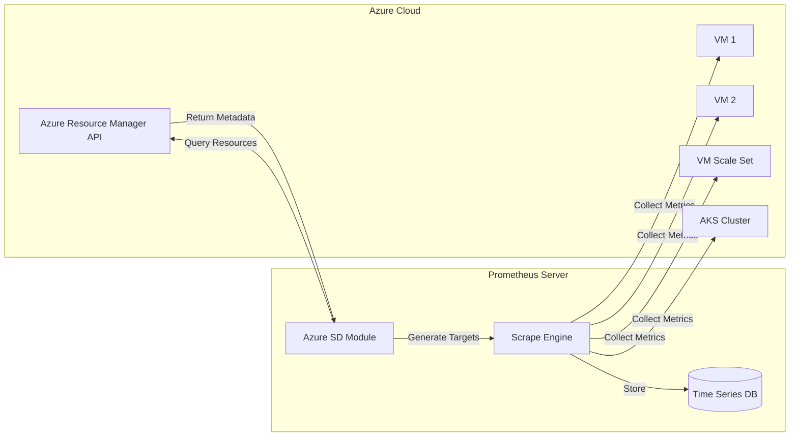
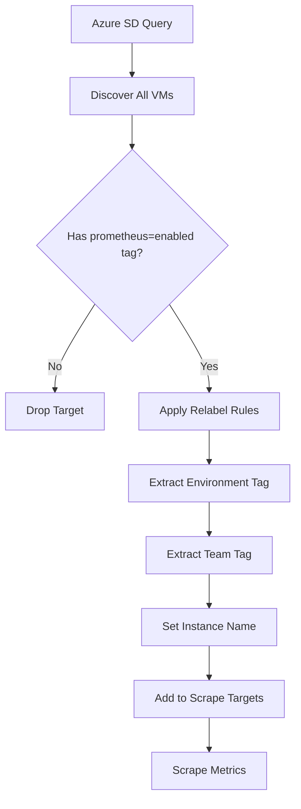
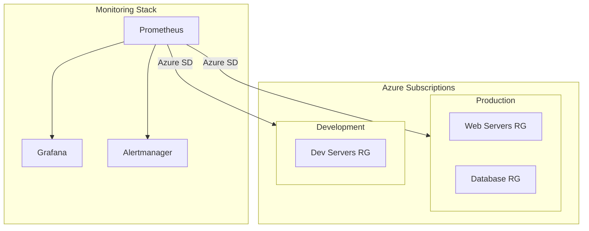

# How to Create Prometheus Azure SD (Service Discovery)

Author: [nawazdhandala](https://github.com/nawazdhandala)

Tags: Prometheus, Azure, Service Discovery, Monitoring

Description: A comprehensive guide to configuring Prometheus Azure Service Discovery to automatically discover and monitor Azure resources including virtual machines, virtual machine scale sets, and Azure Kubernetes Service clusters.

---

Managing monitoring targets manually is tedious and error-prone, especially in dynamic cloud environments where resources come and go. Prometheus Azure Service Discovery (SD) solves this by automatically discovering Azure resources and adding them as scrape targets. No more updating configuration files every time you spin up a new VM.

## How Azure Service Discovery Works

Azure SD queries the Azure Resource Manager API to discover resources in your subscriptions. It finds VMs, scale sets, and other resources, then creates scrape targets based on their metadata.



## Prerequisites

Before configuring Azure SD, you need:

1. **Azure Service Principal** - An application registration with read access to your resources
2. **Prometheus 2.x or later** - Azure SD is built into Prometheus
3. **Network connectivity** - Prometheus must reach both the Azure API and your target resources

## Creating an Azure Service Principal

First, create a service principal that Prometheus will use to authenticate with Azure.

```bash
# Login to Azure CLI
az login

# Create service principal with Reader role
az ad sp create-for-rbac \
  --name "prometheus-azure-sd" \
  --role "Reader" \
  --scopes "/subscriptions/YOUR_SUBSCRIPTION_ID"
```

This outputs credentials you will need:

```json
{
  "appId": "xxxxxxxx-xxxx-xxxx-xxxx-xxxxxxxxxxxx",
  "displayName": "prometheus-azure-sd",
  "password": "your-client-secret",
  "tenant": "xxxxxxxx-xxxx-xxxx-xxxx-xxxxxxxxxxxx"
}
```

Save these values securely. You will need them for Prometheus configuration.

## Basic Azure SD Configuration

Here is a minimal configuration to discover all VMs in a subscription:

```yaml
# prometheus.yml
global:
  scrape_interval: 15s
  evaluation_interval: 15s

scrape_configs:
  - job_name: 'azure-vms'
    azure_sd_configs:
      - subscription_id: 'YOUR_SUBSCRIPTION_ID'
        tenant_id: 'YOUR_TENANT_ID'
        client_id: 'YOUR_CLIENT_ID'
        client_secret: 'YOUR_CLIENT_SECRET'
        port: 9100  # Node exporter port
```

This discovers all VMs and assumes they run node_exporter on port 9100.

## Understanding Azure SD Labels

Azure SD automatically attaches labels to discovered targets. These labels enable powerful filtering and relabeling.

| Label | Description |
|-------|-------------|
| `__meta_azure_subscription_id` | Azure subscription ID |
| `__meta_azure_resource_group` | Resource group containing the resource |
| `__meta_azure_machine_name` | VM name |
| `__meta_azure_machine_location` | Azure region (eastus, westeurope, etc.) |
| `__meta_azure_machine_os_type` | Operating system (Linux or Windows) |
| `__meta_azure_machine_size` | VM size (Standard_D2s_v3, etc.) |
| `__meta_azure_machine_private_ip` | Private IP address |
| `__meta_azure_machine_public_ip` | Public IP (if assigned) |
| `__meta_azure_machine_tag_<tagname>` | Azure resource tags |
| `__meta_azure_machine_scale_set` | Scale set name (if VM is in a scale set) |

## Filtering by Resource Group

Most organizations use resource groups to organize workloads. Filter discovery to specific groups:

```yaml
scrape_configs:
  - job_name: 'production-vms'
    azure_sd_configs:
      - subscription_id: 'YOUR_SUBSCRIPTION_ID'
        tenant_id: 'YOUR_TENANT_ID'
        client_id: 'YOUR_CLIENT_ID'
        client_secret: 'YOUR_CLIENT_SECRET'
        resource_group: 'production-rg'
        port: 9100
```

## Using Azure Tags for Dynamic Targeting

Azure tags are the most flexible way to control which resources get monitored. Tag your VMs in Azure:

```bash
# Add monitoring tag to a VM
az vm update \
  --resource-group production-rg \
  --name web-server-01 \
  --set tags.prometheus=enabled tags.environment=production tags.team=platform
```

Then use relabeling to filter based on tags:

```yaml
scrape_configs:
  - job_name: 'tagged-vms'
    azure_sd_configs:
      - subscription_id: 'YOUR_SUBSCRIPTION_ID'
        tenant_id: 'YOUR_TENANT_ID'
        client_id: 'YOUR_CLIENT_ID'
        client_secret: 'YOUR_CLIENT_SECRET'
        port: 9100

    relabel_configs:
      # Only scrape VMs with prometheus=enabled tag
      - source_labels: [__meta_azure_machine_tag_prometheus]
        regex: 'enabled'
        action: keep

      # Add environment label from Azure tag
      - source_labels: [__meta_azure_machine_tag_environment]
        target_label: environment

      # Add team label from Azure tag
      - source_labels: [__meta_azure_machine_tag_team]
        target_label: team

      # Use VM name as instance label
      - source_labels: [__meta_azure_machine_name]
        target_label: instance
```

## Service Discovery Flow with Relabeling



## Monitoring Virtual Machine Scale Sets

VM Scale Sets (VMSS) automatically appear when Azure SD discovers their instances. Each instance becomes a separate target:

```yaml
scrape_configs:
  - job_name: 'vmss-instances'
    azure_sd_configs:
      - subscription_id: 'YOUR_SUBSCRIPTION_ID'
        tenant_id: 'YOUR_TENANT_ID'
        client_id: 'YOUR_CLIENT_ID'
        client_secret: 'YOUR_CLIENT_SECRET'
        port: 9100

    relabel_configs:
      # Only include VMs that are part of a scale set
      - source_labels: [__meta_azure_machine_scale_set]
        regex: '.+'
        action: keep

      # Add scale set name as label
      - source_labels: [__meta_azure_machine_scale_set]
        target_label: scaleset

      # Create meaningful instance name
      - source_labels: [__meta_azure_machine_scale_set, __meta_azure_machine_name]
        separator: '/'
        target_label: instance
```

## Handling Multiple Ports and Exporters

Real-world setups often have multiple exporters per host. Use multiple scrape jobs with different ports:

```yaml
scrape_configs:
  # Node exporter for system metrics
  - job_name: 'azure-node'
    azure_sd_configs:
      - subscription_id: 'YOUR_SUBSCRIPTION_ID'
        tenant_id: 'YOUR_TENANT_ID'
        client_id: 'YOUR_CLIENT_ID'
        client_secret: 'YOUR_CLIENT_SECRET'
        port: 9100
    relabel_configs:
      - source_labels: [__meta_azure_machine_tag_node_exporter]
        regex: 'true'
        action: keep

  # Application metrics
  - job_name: 'azure-app'
    azure_sd_configs:
      - subscription_id: 'YOUR_SUBSCRIPTION_ID'
        tenant_id: 'YOUR_TENANT_ID'
        client_id: 'YOUR_CLIENT_ID'
        client_secret: 'YOUR_CLIENT_SECRET'
        port: 8080
    relabel_configs:
      - source_labels: [__meta_azure_machine_tag_app_metrics]
        regex: 'true'
        action: keep
      - source_labels: [__meta_azure_machine_tag_app_name]
        target_label: application

  # MySQL exporter
  - job_name: 'azure-mysql'
    azure_sd_configs:
      - subscription_id: 'YOUR_SUBSCRIPTION_ID'
        tenant_id: 'YOUR_TENANT_ID'
        client_id: 'YOUR_CLIENT_ID'
        client_secret: 'YOUR_CLIENT_SECRET'
        port: 9104
    relabel_configs:
      - source_labels: [__meta_azure_machine_tag_mysql_exporter]
        regex: 'true'
        action: keep
```

## Dynamic Port Assignment with Tags

For maximum flexibility, store the exporter port in an Azure tag and extract it during relabeling:

```yaml
scrape_configs:
  - job_name: 'azure-dynamic-port'
    azure_sd_configs:
      - subscription_id: 'YOUR_SUBSCRIPTION_ID'
        tenant_id: 'YOUR_TENANT_ID'
        client_id: 'YOUR_CLIENT_ID'
        client_secret: 'YOUR_CLIENT_SECRET'

    relabel_configs:
      # Extract port from prometheus_port tag
      - source_labels: [__meta_azure_machine_tag_prometheus_port]
        regex: '(\d+)'
        target_label: __address__
        replacement: '${1}'

      # Combine IP and port
      - source_labels: [__meta_azure_machine_private_ip, __address__]
        separator: ':'
        target_label: __address__
```

Tag your VM with the port:

```bash
az vm update \
  --resource-group production-rg \
  --name app-server-01 \
  --set tags.prometheus_port=9090
```

## Multi-Subscription Discovery

Enterprise environments often span multiple subscriptions. Configure multiple Azure SD blocks:

```yaml
scrape_configs:
  - job_name: 'multi-subscription'
    azure_sd_configs:
      # Production subscription
      - subscription_id: 'PROD_SUBSCRIPTION_ID'
        tenant_id: 'YOUR_TENANT_ID'
        client_id: 'YOUR_CLIENT_ID'
        client_secret: 'YOUR_CLIENT_SECRET'
        port: 9100

      # Development subscription
      - subscription_id: 'DEV_SUBSCRIPTION_ID'
        tenant_id: 'YOUR_TENANT_ID'
        client_id: 'YOUR_CLIENT_ID'
        client_secret: 'YOUR_CLIENT_SECRET'
        port: 9100

    relabel_configs:
      # Add subscription as label
      - source_labels: [__meta_azure_subscription_id]
        target_label: subscription
```

## Architecture Overview



## Using Managed Identity (Recommended for Azure-Hosted Prometheus)

If Prometheus runs on an Azure VM, use Managed Identity instead of service principal credentials:

```yaml
scrape_configs:
  - job_name: 'azure-managed-identity'
    azure_sd_configs:
      - subscription_id: 'YOUR_SUBSCRIPTION_ID'
        # No tenant_id, client_id, or client_secret needed
        # Prometheus uses the VM's managed identity automatically
        port: 9100
```

Enable managed identity on your Prometheus VM:

```bash
# Enable system-assigned managed identity
az vm identity assign \
  --resource-group monitoring-rg \
  --name prometheus-vm

# Grant Reader role to the managed identity
az role assignment create \
  --assignee-object-id $(az vm show --resource-group monitoring-rg --name prometheus-vm --query identity.principalId -o tsv) \
  --role "Reader" \
  --scope "/subscriptions/YOUR_SUBSCRIPTION_ID"
```

## Securing Credentials with Environment Variables

Never hardcode credentials in configuration files. Use environment variables:

```yaml
scrape_configs:
  - job_name: 'azure-env-vars'
    azure_sd_configs:
      - subscription_id: '${AZURE_SUBSCRIPTION_ID}'
        tenant_id: '${AZURE_TENANT_ID}'
        client_id: '${AZURE_CLIENT_ID}'
        client_secret: '${AZURE_CLIENT_SECRET}'
        port: 9100
```

Set environment variables before starting Prometheus:

```bash
export AZURE_SUBSCRIPTION_ID="your-subscription-id"
export AZURE_TENANT_ID="your-tenant-id"
export AZURE_CLIENT_ID="your-client-id"
export AZURE_CLIENT_SECRET="your-client-secret"

./prometheus --config.file=prometheus.yml
```

For Kubernetes deployments, use secrets:

```yaml
apiVersion: v1
kind: Secret
metadata:
  name: azure-credentials
  namespace: monitoring
type: Opaque
stringData:
  subscription_id: "your-subscription-id"
  tenant_id: "your-tenant-id"
  client_id: "your-client-id"
  client_secret: "your-client-secret"
---
apiVersion: apps/v1
kind: Deployment
metadata:
  name: prometheus
  namespace: monitoring
spec:
  template:
    spec:
      containers:
        - name: prometheus
          env:
            - name: AZURE_SUBSCRIPTION_ID
              valueFrom:
                secretKeyRef:
                  name: azure-credentials
                  key: subscription_id
            - name: AZURE_TENANT_ID
              valueFrom:
                secretKeyRef:
                  name: azure-credentials
                  key: tenant_id
            - name: AZURE_CLIENT_ID
              valueFrom:
                secretKeyRef:
                  name: azure-credentials
                  key: client_id
            - name: AZURE_CLIENT_SECRET
              valueFrom:
                secretKeyRef:
                  name: azure-credentials
                  key: client_secret
```

## Complete Production Configuration

Here is a production-ready configuration combining multiple patterns:

```yaml
global:
  scrape_interval: 30s
  evaluation_interval: 30s

scrape_configs:
  # Production VMs with node exporter
  - job_name: 'azure-prod-nodes'
    azure_sd_configs:
      - subscription_id: '${AZURE_SUBSCRIPTION_ID}'
        tenant_id: '${AZURE_TENANT_ID}'
        client_id: '${AZURE_CLIENT_ID}'
        client_secret: '${AZURE_CLIENT_SECRET}'
        port: 9100

    relabel_configs:
      # Only production VMs with monitoring enabled
      - source_labels: [__meta_azure_machine_tag_environment]
        regex: 'production'
        action: keep
      - source_labels: [__meta_azure_machine_tag_monitoring]
        regex: 'enabled'
        action: keep

      # Standard labels
      - source_labels: [__meta_azure_machine_name]
        target_label: instance
      - source_labels: [__meta_azure_resource_group]
        target_label: resource_group
      - source_labels: [__meta_azure_machine_location]
        target_label: region
      - source_labels: [__meta_azure_machine_size]
        target_label: vm_size
      - source_labels: [__meta_azure_machine_os_type]
        target_label: os_type

      # Custom labels from tags
      - source_labels: [__meta_azure_machine_tag_team]
        target_label: team
      - source_labels: [__meta_azure_machine_tag_service]
        target_label: service
      - source_labels: [__meta_azure_machine_tag_cost_center]
        target_label: cost_center

  # Scale set instances
  - job_name: 'azure-vmss'
    azure_sd_configs:
      - subscription_id: '${AZURE_SUBSCRIPTION_ID}'
        tenant_id: '${AZURE_TENANT_ID}'
        client_id: '${AZURE_CLIENT_ID}'
        client_secret: '${AZURE_CLIENT_SECRET}'
        port: 9100

    relabel_configs:
      - source_labels: [__meta_azure_machine_scale_set]
        regex: '.+'
        action: keep
      - source_labels: [__meta_azure_machine_scale_set]
        target_label: scaleset
      - source_labels: [__meta_azure_machine_scale_set, __meta_azure_machine_name]
        separator: '/'
        target_label: instance
      - source_labels: [__meta_azure_machine_location]
        target_label: region

  # Application metrics (custom port from tag)
  - job_name: 'azure-apps'
    azure_sd_configs:
      - subscription_id: '${AZURE_SUBSCRIPTION_ID}'
        tenant_id: '${AZURE_TENANT_ID}'
        client_id: '${AZURE_CLIENT_ID}'
        client_secret: '${AZURE_CLIENT_SECRET}'

    relabel_configs:
      - source_labels: [__meta_azure_machine_tag_app_metrics]
        regex: 'true'
        action: keep
      - source_labels: [__meta_azure_machine_private_ip, __meta_azure_machine_tag_metrics_port]
        separator: ':'
        target_label: __address__
      - source_labels: [__meta_azure_machine_tag_app_name]
        target_label: application
      - source_labels: [__meta_azure_machine_name]
        target_label: instance
```

## Troubleshooting Azure SD

### Checking Discovered Targets

Access the Prometheus UI at `http://prometheus:9090/targets` to see discovered targets and their status.

### Debug with promtool

Validate your configuration:

```bash
promtool check config prometheus.yml
```

### Common Issues

**No targets discovered:**
- Verify service principal has Reader role on the subscription
- Check that VMs have public or private IPs assigned
- Ensure the port is correct and the exporter is running

**Authentication errors:**
- Verify tenant_id, client_id, and client_secret are correct
- Check that the service principal has not expired
- Ensure the subscription_id matches where your resources exist

**Targets show as down:**
- Verify network connectivity between Prometheus and targets
- Check if NSG rules allow traffic on the exporter port
- Confirm the exporter is running on the target VMs

### Enable Debug Logging

Start Prometheus with debug logging:

```bash
./prometheus --config.file=prometheus.yml --log.level=debug
```

Look for Azure SD related messages:

```
level=debug ts=2026-01-30T10:00:00.000Z caller=azure.go:123 component="discovery manager scrape" discovery=azure msg="Discovering targets"
```

## Best Practices

1. **Use tags consistently** - Establish a tagging convention across your organization for monitoring-related metadata

2. **Start with read-only access** - The service principal only needs Reader role; never grant more permissions than necessary

3. **Monitor the monitor** - Set up alerts for when Azure SD fails to discover targets

4. **Use managed identities** - When running Prometheus on Azure, managed identities eliminate credential management

5. **Document your relabel rules** - Complex relabeling can be hard to understand; add comments explaining the logic

6. **Test in non-production first** - Validate your configuration against development resources before rolling out to production

## Conclusion

Prometheus Azure Service Discovery transforms infrastructure monitoring from a manual chore into an automated process. As your Azure environment grows and changes, Prometheus automatically adapts. Combined with Azure tags for metadata and relabeling for customization, you get a flexible monitoring system that scales with your infrastructure.

The key is to establish good tagging practices and invest time in crafting relabel rules that extract meaningful labels from Azure metadata. Once configured, you can focus on the metrics that matter instead of maintaining target lists.
