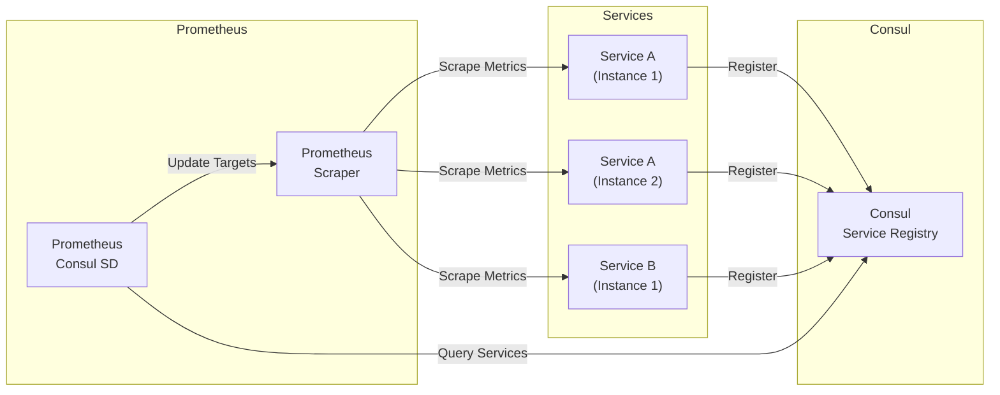
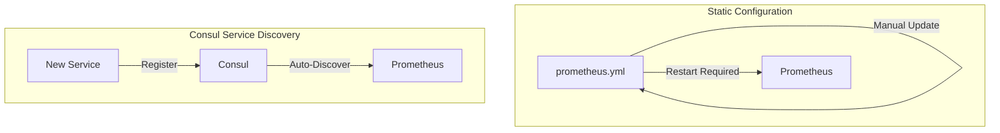
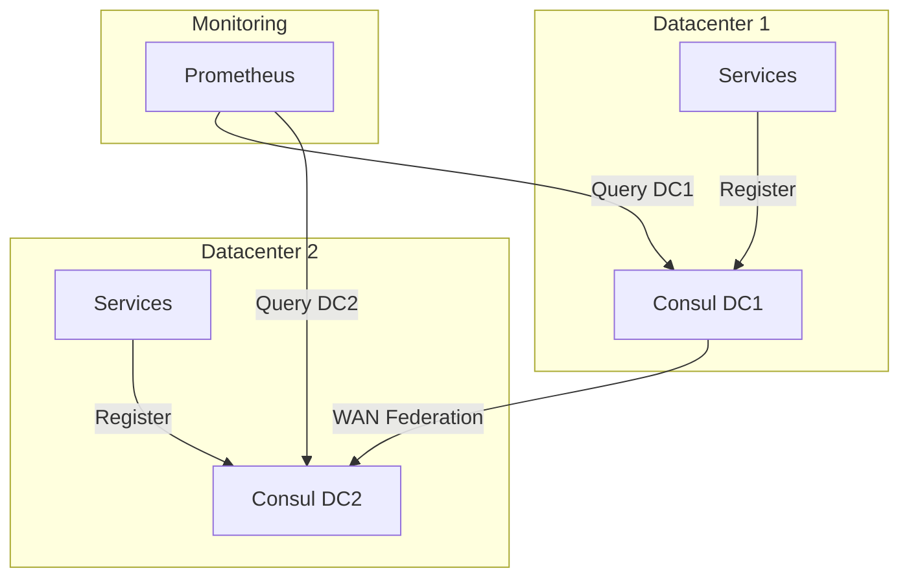
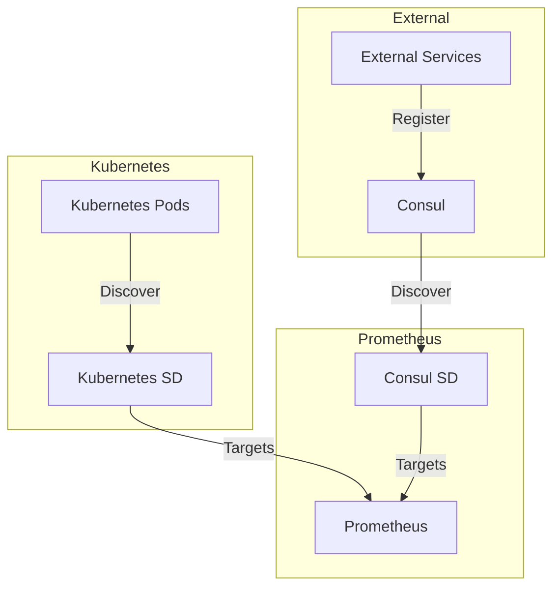

# How to Build Prometheus Consul SD (Service Discovery)

Author: [nawazdhandala](https://github.com/nawazdhandala)

Tags: Prometheus, Consul, Service Discovery, Monitoring

Description: Learn how to build and configure Prometheus Consul Service Discovery to automatically discover and monitor services in dynamic environments. This guide covers configuration, relabeling, health filtering, and production best practices.

---

> Static configurations break in dynamic environments. Consul Service Discovery lets Prometheus automatically find and monitor services as they scale up, down, or move across your infrastructure. Stop manually updating target lists and let your monitoring adapt to your infrastructure.

Service discovery is essential for monitoring dynamic environments where services come and go frequently.

---

## Overview

Prometheus Consul SD enables automatic discovery of monitoring targets registered with HashiCorp Consul. When services register themselves with Consul, Prometheus automatically detects them and starts scraping metrics.



---

## Why Use Consul Service Discovery?

Manual target configuration in Prometheus requires updating configuration files every time services scale or change. This approach has significant limitations:

- **Manual updates**: Adding or removing instances requires config changes
- **Error-prone**: Human errors in IP addresses or ports cause gaps
- **Delayed discovery**: New instances are not monitored until config is updated
- **Scaling challenges**: Auto-scaling environments break static configs

Consul SD solves these problems by automatically discovering services:



---

## Prerequisites

Before setting up Prometheus Consul SD, you need:

1. **Running Consul cluster** (agent or server)
2. **Prometheus installation** (version 2.0+)
3. **Services registered in Consul** with health checks

---

## Basic Configuration

### Minimal Consul SD Setup

The simplest Consul SD configuration discovers all services registered in Consul:

```yaml
# prometheus.yml
global:
  scrape_interval: 15s
  evaluation_interval: 15s

scrape_configs:
  - job_name: 'consul-services'
    consul_sd_configs:
      - server: 'consul.example.com:8500'
```

This configuration:
- Connects to Consul at the specified server address
- Discovers all registered services
- Uses default port 8500 for Consul HTTP API
- Creates targets for each service instance

### Connecting to Local Consul Agent

When running Prometheus alongside a local Consul agent:

```yaml
scrape_configs:
  - job_name: 'consul-services'
    consul_sd_configs:
      - server: 'localhost:8500'
```

---

## Service Registration in Consul

For Prometheus to discover your services, they must be registered with Consul. Here are common registration methods:

### Service Definition File

Create a service definition file in Consul's configuration directory:

```json
{
  "service": {
    "name": "web-api",
    "port": 8080,
    "tags": ["prometheus", "production"],
    "meta": {
      "metrics_path": "/metrics",
      "env": "production"
    },
    "check": {
      "http": "http://localhost:8080/health",
      "interval": "10s",
      "timeout": "5s"
    }
  }
}
```

### Registration via HTTP API

Register a service programmatically using Consul's HTTP API:

```bash
curl --request PUT \
  --data '{
    "Name": "payment-service",
    "Port": 9090,
    "Tags": ["prometheus", "v2"],
    "Meta": {
      "metrics_path": "/metrics",
      "team": "payments"
    },
    "Check": {
      "HTTP": "http://localhost:9090/health",
      "Interval": "10s"
    }
  }' \
  http://localhost:8500/v1/agent/service/register
```

### Registration from Application Code

Register services directly from your application using Consul client libraries:

```python
# Python example using python-consul
import consul

c = consul.Consul(host='localhost', port=8500)

# Register service with health check
c.agent.service.register(
    name='analytics-service',
    service_id='analytics-service-1',
    port=8000,
    tags=['prometheus', 'analytics'],
    meta={
        'metrics_path': '/metrics',
        'version': '1.2.0'
    },
    check=consul.Check.http(
        'http://localhost:8000/health',
        interval='10s',
        timeout='5s'
    )
)
```

---

## Relabeling Configuration

Relabeling transforms Consul metadata into Prometheus labels. This is where Consul SD becomes powerful.

### Understanding Consul SD Labels

Consul SD provides these labels for each discovered target:

| Label | Description |
|-------|-------------|
| `__meta_consul_address` | Service instance address |
| `__meta_consul_dc` | Consul datacenter |
| `__meta_consul_health` | Service health status |
| `__meta_consul_metadata_<key>` | Service metadata |
| `__meta_consul_node` | Consul node name |
| `__meta_consul_service` | Service name |
| `__meta_consul_service_address` | Service-specific address |
| `__meta_consul_service_id` | Service ID |
| `__meta_consul_service_port` | Service port |
| `__meta_consul_tagged_address_<key>` | Tagged addresses |
| `__meta_consul_tags` | Comma-separated tags |

### Filtering by Tags

Filter services to only scrape those with specific tags:

```yaml
scrape_configs:
  - job_name: 'prometheus-tagged-services'
    consul_sd_configs:
      - server: 'localhost:8500'
        tags:
          - prometheus
```

This only discovers services that have the `prometheus` tag.

### Advanced Relabeling

Transform Consul metadata into useful Prometheus labels:

```yaml
scrape_configs:
  - job_name: 'consul-services'
    consul_sd_configs:
      - server: 'localhost:8500'
        tags:
          - prometheus

    relabel_configs:
      # Use service name as the job label
      - source_labels: [__meta_consul_service]
        target_label: job

      # Add datacenter as a label
      - source_labels: [__meta_consul_dc]
        target_label: datacenter

      # Add node name for infrastructure correlation
      - source_labels: [__meta_consul_node]
        target_label: node

      # Extract environment from service metadata
      - source_labels: [__meta_consul_service_metadata_env]
        target_label: environment

      # Extract team ownership from metadata
      - source_labels: [__meta_consul_service_metadata_team]
        target_label: team

      # Set metrics path from service metadata
      - source_labels: [__meta_consul_service_metadata_metrics_path]
        target_label: __metrics_path__
        regex: (.+)

      # Build instance label from address and port
      - source_labels: [__meta_consul_address, __meta_consul_service_port]
        separator: ':'
        target_label: instance
```

---

## Health-Based Filtering

Consul provides health status for registered services. Use this to filter out unhealthy instances:

```yaml
scrape_configs:
  - job_name: 'healthy-services'
    consul_sd_configs:
      - server: 'localhost:8500'
        tags:
          - prometheus

    relabel_configs:
      # Only scrape services with passing health checks
      - source_labels: [__meta_consul_health]
        regex: passing
        action: keep

      - source_labels: [__meta_consul_service]
        target_label: job
```

### Health Status Values

Consul reports these health status values:

- `passing` - All health checks pass
- `warning` - At least one check is in warning state
- `critical` - At least one check is failing
- `maintenance` - Node or service is in maintenance mode

### Including Warning State

To include services in warning state:

```yaml
relabel_configs:
  - source_labels: [__meta_consul_health]
    regex: (passing|warning)
    action: keep
```

---

## Multi-Datacenter Configuration

Consul supports multiple datacenters. Configure Prometheus to discover services across datacenters:

```yaml
scrape_configs:
  # Primary datacenter
  - job_name: 'dc1-services'
    consul_sd_configs:
      - server: 'consul-dc1.example.com:8500'
        datacenter: dc1
        tags:
          - prometheus

    relabel_configs:
      - source_labels: [__meta_consul_dc]
        target_label: datacenter
      - source_labels: [__meta_consul_service]
        target_label: job

  # Secondary datacenter
  - job_name: 'dc2-services'
    consul_sd_configs:
      - server: 'consul-dc2.example.com:8500'
        datacenter: dc2
        tags:
          - prometheus

    relabel_configs:
      - source_labels: [__meta_consul_dc]
        target_label: datacenter
      - source_labels: [__meta_consul_service]
        target_label: job
```



---

## Authentication and Security

### ACL Token Authentication

When Consul ACL is enabled, provide a token for authentication:

```yaml
scrape_configs:
  - job_name: 'consul-services'
    consul_sd_configs:
      - server: 'localhost:8500'
        token: 'your-consul-acl-token'
        tags:
          - prometheus
```

### Using Environment Variables

Store sensitive tokens in environment variables:

```yaml
scrape_configs:
  - job_name: 'consul-services'
    consul_sd_configs:
      - server: 'localhost:8500'
        token_file: '/etc/prometheus/consul-token'
        tags:
          - prometheus
```

### TLS Configuration

For secure Consul connections:

```yaml
scrape_configs:
  - job_name: 'consul-services'
    consul_sd_configs:
      - server: 'consul.example.com:8501'
        scheme: https
        tls_config:
          ca_file: '/etc/prometheus/consul-ca.pem'
          cert_file: '/etc/prometheus/consul-cert.pem'
          key_file: '/etc/prometheus/consul-key.pem'
        tags:
          - prometheus
```

---

## Service-Specific Configurations

Different services may require different scrape configurations. Use separate jobs for each:

```yaml
scrape_configs:
  # Web services - standard configuration
  - job_name: 'web-services'
    scrape_interval: 15s
    consul_sd_configs:
      - server: 'localhost:8500'
        tags:
          - prometheus
          - web

    relabel_configs:
      - source_labels: [__meta_consul_service]
        target_label: job

  # Database exporters - longer scrape interval
  - job_name: 'database-exporters'
    scrape_interval: 60s
    consul_sd_configs:
      - server: 'localhost:8500'
        tags:
          - prometheus
          - database

    relabel_configs:
      - source_labels: [__meta_consul_service]
        target_label: job

  # High-frequency metrics - shorter interval
  - job_name: 'realtime-services'
    scrape_interval: 5s
    consul_sd_configs:
      - server: 'localhost:8500'
        tags:
          - prometheus
          - realtime

    relabel_configs:
      - source_labels: [__meta_consul_service]
        target_label: job
```

---

## Custom Metrics Path

Services may expose metrics on different paths. Use metadata to configure this:

### Register Service with Custom Path

```json
{
  "service": {
    "name": "legacy-app",
    "port": 8080,
    "tags": ["prometheus"],
    "meta": {
      "metrics_path": "/actuator/prometheus"
    }
  }
}
```

### Configure Prometheus to Use Custom Path

```yaml
scrape_configs:
  - job_name: 'consul-services'
    consul_sd_configs:
      - server: 'localhost:8500'
        tags:
          - prometheus

    relabel_configs:
      # Use custom metrics path from metadata if available
      - source_labels: [__meta_consul_service_metadata_metrics_path]
        target_label: __metrics_path__
        regex: (.+)

      # Default to /metrics if no custom path specified
      - source_labels: [__metrics_path__]
        regex: ''
        replacement: /metrics
        target_label: __metrics_path__

      - source_labels: [__meta_consul_service]
        target_label: job
```

---

## Namespace Support

Consul Enterprise supports namespaces. Configure Prometheus to discover services in specific namespaces:

```yaml
scrape_configs:
  - job_name: 'production-namespace'
    consul_sd_configs:
      - server: 'localhost:8500'
        namespace: production
        tags:
          - prometheus

    relabel_configs:
      - source_labels: [__meta_consul_service]
        target_label: job

      # Add namespace label
      - replacement: production
        target_label: namespace

  - job_name: 'staging-namespace'
    consul_sd_configs:
      - server: 'localhost:8500'
        namespace: staging
        tags:
          - prometheus

    relabel_configs:
      - source_labels: [__meta_consul_service]
        target_label: job

      - replacement: staging
        target_label: namespace
```

---

## Complete Production Configuration

Here is a comprehensive production-ready configuration:

```yaml
# prometheus.yml
global:
  scrape_interval: 15s
  evaluation_interval: 15s
  external_labels:
    cluster: production
    region: us-east-1

scrape_configs:
  # Prometheus self-monitoring
  - job_name: 'prometheus'
    static_configs:
      - targets: ['localhost:9090']

  # All Consul-registered services
  - job_name: 'consul-services'
    consul_sd_configs:
      - server: 'consul.internal:8500'
        token_file: '/etc/prometheus/consul-token'
        tags:
          - prometheus
        refresh_interval: 30s

    relabel_configs:
      # Filter to only healthy services
      - source_labels: [__meta_consul_health]
        regex: passing
        action: keep

      # Set job name from service name
      - source_labels: [__meta_consul_service]
        target_label: job

      # Add datacenter label
      - source_labels: [__meta_consul_dc]
        target_label: datacenter

      # Add node for infrastructure correlation
      - source_labels: [__meta_consul_node]
        target_label: consul_node

      # Extract environment from metadata
      - source_labels: [__meta_consul_service_metadata_env]
        target_label: environment
        regex: (.+)

      # Extract team ownership
      - source_labels: [__meta_consul_service_metadata_team]
        target_label: team
        regex: (.+)

      # Extract version for tracking deployments
      - source_labels: [__meta_consul_service_metadata_version]
        target_label: version
        regex: (.+)

      # Use custom metrics path if specified
      - source_labels: [__meta_consul_service_metadata_metrics_path]
        target_label: __metrics_path__
        regex: (.+)

      # Build instance identifier
      - source_labels: [__meta_consul_address, __meta_consul_service_port]
        separator: ':'
        target_label: instance

      # Add service ID for unique identification
      - source_labels: [__meta_consul_service_id]
        target_label: service_id

    # Metric relabeling for cost control
    metric_relabel_configs:
      # Drop high-cardinality debug metrics
      - source_labels: [__name__]
        regex: 'go_gc_.*'
        action: drop
```

---

## Monitoring the Discovery Process

### Prometheus Metrics for SD

Prometheus exposes metrics about service discovery:

```promql
# Number of targets discovered
prometheus_sd_discovered_targets{config="consul-services"}

# Failed SD refresh attempts
prometheus_sd_refresh_failures_total

# SD refresh duration
prometheus_sd_refresh_duration_seconds
```

### Alerting on Discovery Issues

Set up alerts for service discovery problems:

```yaml
# alerts.yml
groups:
  - name: service-discovery
    rules:
      - alert: ConsulSDRefreshFailing
        expr: increase(prometheus_sd_refresh_failures_total[5m]) > 0
        for: 5m
        labels:
          severity: warning
        annotations:
          summary: Consul service discovery refresh failing
          description: Prometheus is failing to refresh service discovery from Consul

      - alert: NoTargetsDiscovered
        expr: prometheus_sd_discovered_targets{config="consul-services"} == 0
        for: 5m
        labels:
          severity: critical
        annotations:
          summary: No targets discovered from Consul
          description: Prometheus has discovered zero targets from Consul SD
```

---

## Docker Compose Example

A complete Docker Compose setup with Consul and Prometheus:

```yaml
# docker-compose.yml
version: '3.8'

services:
  consul:
    image: hashicorp/consul:1.15
    command: agent -dev -client=0.0.0.0
    ports:
      - "8500:8500"
    volumes:
      - ./consul-config:/consul/config

  prometheus:
    image: prom/prometheus:v2.45.0
    ports:
      - "9090:9090"
    volumes:
      - ./prometheus.yml:/etc/prometheus/prometheus.yml
      - prometheus-data:/prometheus
    command:
      - '--config.file=/etc/prometheus/prometheus.yml'
      - '--storage.tsdb.path=/prometheus'
      - '--web.enable-lifecycle'
    depends_on:
      - consul

  # Example service that registers with Consul
  web-api:
    build: ./web-api
    environment:
      - CONSUL_HTTP_ADDR=consul:8500
      - SERVICE_NAME=web-api
      - SERVICE_PORT=8080
    depends_on:
      - consul

volumes:
  prometheus-data:
```

### Example Service Registration Script

```bash
#!/bin/bash
# register-service.sh

SERVICE_NAME=${SERVICE_NAME:-"web-api"}
SERVICE_PORT=${SERVICE_PORT:-8080}
CONSUL_ADDR=${CONSUL_HTTP_ADDR:-"localhost:8500"}

# Wait for Consul to be ready
until curl -s "http://${CONSUL_ADDR}/v1/status/leader" | grep -q .; do
  echo "Waiting for Consul..."
  sleep 2
done

# Register service
curl --request PUT \
  --data "{
    \"Name\": \"${SERVICE_NAME}\",
    \"Port\": ${SERVICE_PORT},
    \"Tags\": [\"prometheus\"],
    \"Meta\": {
      \"metrics_path\": \"/metrics\",
      \"version\": \"${APP_VERSION:-1.0.0}\"
    },
    \"Check\": {
      \"HTTP\": \"http://localhost:${SERVICE_PORT}/health\",
      \"Interval\": \"10s\",
      \"Timeout\": \"5s\"
    }
  }" \
  "http://${CONSUL_ADDR}/v1/agent/service/register"

echo "Service registered with Consul"
```

---

## Kubernetes Integration

When running in Kubernetes with Consul, combine both service discovery methods:

```yaml
# prometheus-config.yaml
apiVersion: v1
kind: ConfigMap
metadata:
  name: prometheus-config
data:
  prometheus.yml: |
    global:
      scrape_interval: 15s

    scrape_configs:
      # Kubernetes native service discovery
      - job_name: 'kubernetes-pods'
        kubernetes_sd_configs:
          - role: pod
        relabel_configs:
          - source_labels: [__meta_kubernetes_pod_annotation_prometheus_io_scrape]
            action: keep
            regex: true

      # Consul service discovery for non-Kubernetes services
      - job_name: 'consul-services'
        consul_sd_configs:
          - server: 'consul.consul.svc.cluster.local:8500'
            tags:
              - prometheus
        relabel_configs:
          - source_labels: [__meta_consul_service]
            target_label: job
          - source_labels: [__meta_consul_dc]
            target_label: datacenter
```



---

## Troubleshooting

### Common Issues

**No targets discovered**

1. Verify Consul connectivity:
```bash
curl http://localhost:8500/v1/catalog/services
```

2. Check service registration:
```bash
curl http://localhost:8500/v1/catalog/service/your-service-name
```

3. Verify tags match your configuration:
```bash
curl http://localhost:8500/v1/catalog/service/your-service-name | jq '.[].ServiceTags'
```

**Authentication failures**

Check ACL token permissions:
```bash
curl -H "X-Consul-Token: your-token" \
  http://localhost:8500/v1/catalog/services
```

**Health check filtering**

Verify service health status:
```bash
curl http://localhost:8500/v1/health/service/your-service-name
```

### Debugging with Prometheus

Check the Prometheus targets page (`/targets`) to see:
- Discovered targets
- Target state (up/down)
- Labels applied
- Last scrape time and duration
- Any errors

---

## Best Practices

1. **Use tags consistently** - Define a tagging convention for all services
2. **Include metadata** - Store metrics path, team, and version in service metadata
3. **Enable health filtering** - Only scrape healthy instances
4. **Set appropriate refresh intervals** - Balance freshness against Consul load
5. **Use ACL tokens** - Secure Consul access in production
6. **Monitor SD health** - Alert on discovery failures
7. **Label strategically** - Include datacenter, environment, and team labels
8. **Document service registration** - Ensure teams know how to register services

---

## Conclusion

Prometheus Consul Service Discovery automates target management in dynamic environments. Key takeaways:

- **Automatic discovery** eliminates manual configuration updates
- **Health filtering** ensures only healthy instances are scraped
- **Relabeling** transforms Consul metadata into useful Prometheus labels
- **Multi-datacenter support** enables unified monitoring across regions
- **ACL integration** secures the discovery process

By implementing Consul SD, your monitoring infrastructure automatically adapts as services scale and change.

---

*Need comprehensive monitoring for your dynamic infrastructure? [OneUptime](https://oneuptime.com) provides unified observability with automatic service discovery, metrics collection, and intelligent alerting.*
