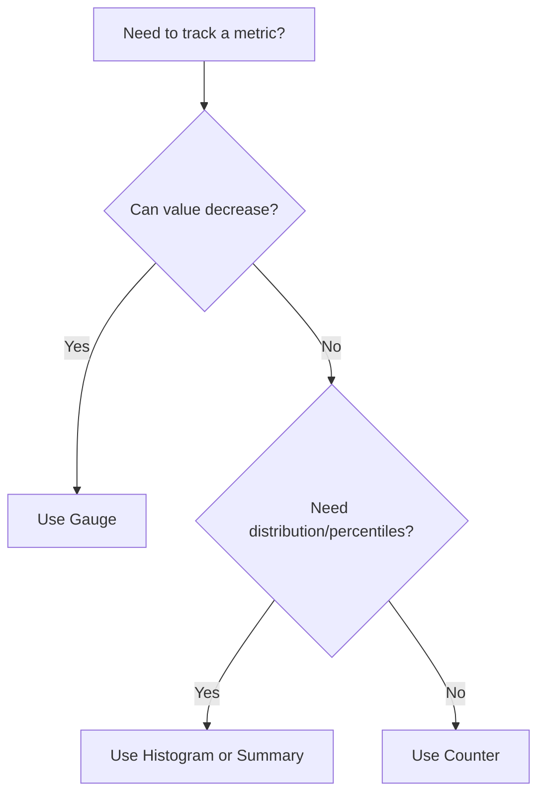
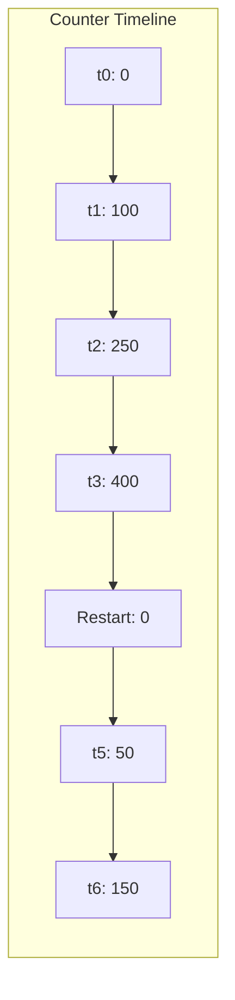
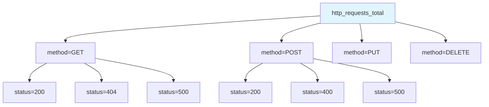
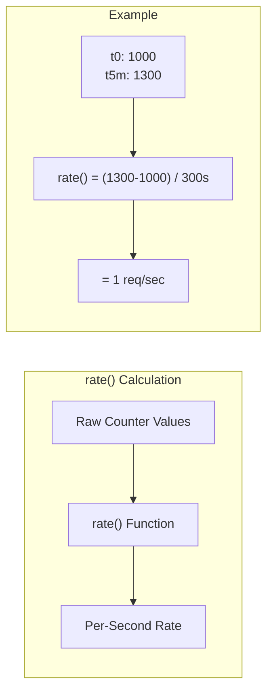

# How to Implement Prometheus Counter Best Practices

Author: [nawazdhandala](https://github.com/nawazdhandala)

Tags: Prometheus, Counter, Metrics, Best Practices

Description: Learn to implement Prometheus counters with proper naming, labeling, reset handling, and rate calculation for reliable metrics.

---

Prometheus counters are deceptively simple - they only go up. Yet this simplicity hides subtleties that trip up even experienced engineers. A poorly designed counter can produce misleading dashboards, broken alerts, and hours of debugging. This guide walks through the semantics, naming conventions, rate queries, and reset handling you need to build reliable counter-based metrics.

---

## Table of Contents

1. What Is a Counter and When to Use It
2. Counter Semantics and Behavior
3. Naming Conventions
4. Labeling Best Practices
5. Counter Resets and the `rate()` Function
6. Common Patterns and Code Examples
7. Anti-Patterns to Avoid
8. Putting It All Together
9. Summary

---

## 1. What Is a Counter and When to Use It

A **counter** is a cumulative metric that represents a single monotonically increasing value. It can only increase or reset to zero (on process restart).

Use counters for:
- Total HTTP requests served
- Total errors encountered
- Total bytes processed
- Total tasks completed
- Total retries performed

Do NOT use counters for:
- Current queue depth (use a gauge)
- Memory usage (use a gauge)
- Request latency (use a histogram or summary)
- Values that can decrease



---

## 2. Counter Semantics and Behavior

### The Monotonic Guarantee

Counters MUST only increase. This guarantee enables Prometheus to detect resets and compute accurate rates across restarts.



### What Happens on Restart

When your application restarts, the counter resets to zero. Prometheus handles this gracefully in `rate()` and `increase()` functions by detecting the reset and accounting for it.

| Time | Raw Counter Value | What Prometheus Sees |
|------|-------------------|---------------------|
| t0 | 0 | Start of series |
| t1 | 100 | +100 increase |
| t2 | 250 | +150 increase |
| t3 | 0 (restart) | Reset detected |
| t4 | 50 | +50 increase (from reset) |
| t5 | 120 | +70 increase |

The key insight: raw counter values are rarely useful. You almost always want `rate()` or `increase()` to compute meaningful metrics.

---

## 3. Naming Conventions

Good counter names follow these rules:

### Rule 1: Use the `_total` Suffix

All counters MUST end with `_total`. This is a Prometheus convention that makes metric types immediately recognizable.

```
# Good
http_requests_total
errors_total
processed_bytes_total

# Bad
http_requests
errors_count
processed_bytes
```

### Rule 2: Use Snake Case

Prometheus metrics use `snake_case` - lowercase letters with underscores separating words.

```
# Good
http_server_requests_total
database_queries_total

# Bad
httpServerRequests_total
DatabaseQueries_total
```

### Rule 3: Include a Meaningful Prefix

Start with a namespace (usually your application or subsystem name) to avoid collisions.

```
# Good - clear ownership
myapp_http_requests_total
checkout_orders_total
payment_gateway_calls_total

# Bad - too generic, will collide
requests_total
orders_total
calls_total
```

### Rule 4: Describe What Is Being Counted

The name should clearly indicate what entity is being counted.

```
# Good - clear what is counted
http_requests_total          # requests
login_attempts_total         # attempts
messages_sent_total          # messages
cache_hits_total             # hits

# Bad - ambiguous
http_total                   # total what?
login_total                  # total what?
```

### Complete Naming Pattern

```
<namespace>_<subsystem>_<name>_total
```

Examples:
- `myapp_http_requests_total`
- `myapp_database_queries_total`
- `myapp_cache_operations_total`

---

## 4. Labeling Best Practices

Labels add dimensions to your metrics. They are powerful but dangerous if misused.

### Rule 1: Keep Cardinality Low

Every unique combination of label values creates a new time series. High cardinality causes memory issues and slow queries.



```
# Good - bounded cardinality
http_requests_total{method="GET", status="200"}
http_requests_total{method="GET", status="404"}
http_requests_total{method="POST", status="201"}

# Bad - unbounded cardinality (user IDs are infinite)
http_requests_total{user_id="12345"}
http_requests_total{user_id="12346"}
# ... millions more
```

### Rule 2: Use Labels for Dimensions You Will Filter or Aggregate

Only add labels if you need to:
- Filter by that dimension in queries
- Aggregate across that dimension
- Alert on specific label values

```
# Useful labels - you will filter/aggregate by these
http_requests_total{method="GET", status="200", endpoint="/api/users"}

# Useless label - you will never query by request ID
http_requests_total{request_id="abc-123"}
```

### Rule 3: Normalize Label Values

Keep label values consistent and predictable.

```
# Good - consistent casing and format
http_requests_total{status="2xx"}
http_requests_total{status="4xx"}
http_requests_total{status="5xx"}

# Bad - inconsistent values
http_requests_total{status="200"}
http_requests_total{status="OK"}
http_requests_total{status="success"}
```

### Recommended Labels for HTTP Counters

| Label | Values | Purpose |
|-------|--------|---------|
| `method` | GET, POST, PUT, DELETE, etc. | HTTP method |
| `status` | 2xx, 4xx, 5xx (or exact codes) | Response status class |
| `endpoint` | /api/users, /api/orders | Route pattern (NOT with IDs) |
| `service` | users-api, orders-api | Target service name |

---

## 5. Counter Resets and the `rate()` Function

### Why Raw Counters Are Misleading

Raw counter values are cumulative since process start. Comparing raw values across time or instances is meaningless.

```
Instance A (running 30 days): http_requests_total = 5,000,000
Instance B (running 1 hour):  http_requests_total = 1,000
```

Which instance handles more traffic? You cannot tell from raw values.

### The `rate()` Function

`rate()` calculates the per-second average rate of increase over a time window. It automatically handles counter resets.

```promql
# Per-second request rate over the last 5 minutes
rate(http_requests_total[5m])
```



### Handling Resets in rate()

When Prometheus detects a reset (new value < previous value), it assumes:
1. The counter reached some value before restart
2. It then reset to zero
3. It climbed to the current value

Prometheus adds the post-reset value to the increase calculation.

```
t0: 1000
t1: 1200   # +200
t2: 0      # reset detected
t3: 100    # +100 (from reset point)

Total increase: 200 + 100 = 300
```

### Choosing the Right Time Window

The `[5m]` in `rate(counter[5m])` is crucial:

| Window | Use Case | Trade-off |
|--------|----------|-----------|
| `[1m]` | Real-time dashboards | Noisy, sensitive to gaps |
| `[5m]` | Standard dashboards | Good balance |
| `[15m]` | Alerts | Smooths noise, less false positives |
| `[1h]` | Trend analysis | Very smooth, misses short spikes |

**Rule of thumb**: Window should be at least 4x your scrape interval. If scraping every 15s, use at least `[1m]`.

### `rate()` vs `increase()` vs `irate()`

| Function | Returns | Use Case |
|----------|---------|----------|
| `rate()` | Per-second rate | Dashboards, alerts, most use cases |
| `increase()` | Total increase over window | "How many requests in the last hour?" |
| `irate()` | Instant rate (last two samples) | Volatile, real-time graphs only |

```promql
# Requests per second (most common)
rate(http_requests_total[5m])

# Total requests in the last hour
increase(http_requests_total[1h])

# Instant rate (use sparingly)
irate(http_requests_total[1m])
```

---

## 6. Common Patterns and Code Examples

### Basic Counter in Go

```go
package main

import (
    "net/http"

    "github.com/prometheus/client_golang/prometheus"
    "github.com/prometheus/client_golang/prometheus/promauto"
    "github.com/prometheus/client_golang/prometheus/promhttp"
)

var httpRequestsTotal = promauto.NewCounterVec(
    prometheus.CounterOpts{
        Name: "myapp_http_requests_total",
        Help: "Total number of HTTP requests processed",
    },
    []string{"method", "status", "endpoint"},
)

func handler(w http.ResponseWriter, r *http.Request) {
    // Process request...

    // Increment counter with labels
    httpRequestsTotal.WithLabelValues(
        r.Method,
        "200",
        "/api/users",
    ).Inc()

    w.WriteHeader(http.StatusOK)
}

func main() {
    http.HandleFunc("/api/users", handler)
    http.Handle("/metrics", promhttp.Handler())
    http.ListenAndServe(":8080", nil)
}
```

### Basic Counter in Python

```python
from prometheus_client import Counter, start_http_server

# Define counter with labels
http_requests_total = Counter(
    'myapp_http_requests_total',
    'Total number of HTTP requests processed',
    ['method', 'status', 'endpoint']
)

def handle_request(method, endpoint):
    try:
        # Process request...
        status = "200"
    except Exception:
        status = "500"
    finally:
        # Always increment the counter
        http_requests_total.labels(
            method=method,
            status=status,
            endpoint=endpoint
        ).inc()

if __name__ == '__main__':
    start_http_server(8080)
    # Your application logic here
```

### Basic Counter in Node.js

```javascript
const client = require('prom-client');

// Create counter with labels
const httpRequestsTotal = new client.Counter({
    name: 'myapp_http_requests_total',
    help: 'Total number of HTTP requests processed',
    labelNames: ['method', 'status', 'endpoint']
});

// Express middleware example
function metricsMiddleware(req, res, next) {
    res.on('finish', () => {
        httpRequestsTotal.labels({
            method: req.method,
            status: res.statusCode.toString(),
            endpoint: req.route?.path || 'unknown'
        }).inc();
    });
    next();
}

// Use in Express app
app.use(metricsMiddleware);
app.get('/metrics', async (req, res) => {
    res.set('Content-Type', client.register.contentType);
    res.send(await client.register.metrics());
});
```

### Counter for Error Tracking

```go
var (
    errorsTotal = promauto.NewCounterVec(
        prometheus.CounterOpts{
            Name: "myapp_errors_total",
            Help: "Total number of errors by type and severity",
        },
        []string{"type", "severity"},
    )
)

func processOrder(order Order) error {
    if err := validateOrder(order); err != nil {
        errorsTotal.WithLabelValues("validation", "warning").Inc()
        return err
    }

    if err := chargePayment(order); err != nil {
        errorsTotal.WithLabelValues("payment", "critical").Inc()
        return err
    }

    return nil
}
```

### Counter for Retry Tracking

```go
var retriesTotal = promauto.NewCounterVec(
    prometheus.CounterOpts{
        Name: "myapp_operation_retries_total",
        Help: "Total number of operation retries",
    },
    []string{"operation", "reason"},
)

func callExternalAPI() error {
    maxRetries := 3

    for attempt := 1; attempt <= maxRetries; attempt++ {
        err := doAPICall()
        if err == nil {
            return nil
        }

        if attempt < maxRetries {
            retriesTotal.WithLabelValues("external_api", "timeout").Inc()
            time.Sleep(time.Second * time.Duration(attempt))
        }
    }

    return errors.New("max retries exceeded")
}
```

---

## 7. Anti-Patterns to Avoid

### Anti-Pattern 1: Using Counters for Values That Decrease

```go
// WRONG - queue depth can decrease
var queueDepth = promauto.NewCounter(...)
queueDepth.Inc()   // item added
queueDepth.Dec()   // ERROR: counters cannot decrease

// CORRECT - use a gauge
var queueDepth = promauto.NewGauge(...)
queueDepth.Inc()   // item added
queueDepth.Dec()   // item removed
```

### Anti-Pattern 2: High Cardinality Labels

```go
// WRONG - user_id creates millions of time series
httpRequestsTotal.WithLabelValues(
    "GET",
    "200",
    userID,  // unbounded cardinality
).Inc()

// CORRECT - use bounded labels only
httpRequestsTotal.WithLabelValues(
    "GET",
    "200",
    "/api/users",
).Inc()
// Track user-specific metrics in logs or traces instead
```

### Anti-Pattern 3: Forgetting the `_total` Suffix

```go
// WRONG - unclear metric type
var httpRequests = promauto.NewCounter(
    prometheus.CounterOpts{
        Name: "myapp_http_requests",  // missing _total
    },
)

// CORRECT
var httpRequests = promauto.NewCounter(
    prometheus.CounterOpts{
        Name: "myapp_http_requests_total",
    },
)
```

### Anti-Pattern 4: Including IDs in Metric Names

```go
// WRONG - metric name includes dynamic value
orderCounter123 := promauto.NewCounter(...)
orderCounter456 := promauto.NewCounter(...)

// CORRECT - use labels for dimensions
ordersTotal.WithLabelValues("type_a").Inc()
ordersTotal.WithLabelValues("type_b").Inc()
```

### Anti-Pattern 5: Querying Raw Counter Values

```promql
# WRONG - raw counter value is meaningless
http_requests_total

# CORRECT - use rate() for useful data
rate(http_requests_total[5m])
```

### Anti-Pattern 6: Too Short Rate Windows

```promql
# WRONG - [30s] is too short, will be noisy and have gaps
rate(http_requests_total[30s])

# CORRECT - use at least 4x scrape interval
rate(http_requests_total[5m])
```

---

## 8. Putting It All Together

### Complete Example: HTTP Server with Counters

```go
package main

import (
    "log"
    "net/http"
    "time"

    "github.com/prometheus/client_golang/prometheus"
    "github.com/prometheus/client_golang/prometheus/promauto"
    "github.com/prometheus/client_golang/prometheus/promhttp"
)

var (
    // Request counter with useful dimensions
    httpRequestsTotal = promauto.NewCounterVec(
        prometheus.CounterOpts{
            Name: "myapp_http_requests_total",
            Help: "Total HTTP requests by method, status, and endpoint",
        },
        []string{"method", "status", "endpoint"},
    )

    // Error counter for tracking failures
    httpErrorsTotal = promauto.NewCounterVec(
        prometheus.CounterOpts{
            Name: "myapp_http_errors_total",
            Help: "Total HTTP errors by type",
        },
        []string{"type"},
    )

    // Bytes counter for throughput tracking
    httpResponseBytesTotal = promauto.NewCounterVec(
        prometheus.CounterOpts{
            Name: "myapp_http_response_bytes_total",
            Help: "Total bytes sent in HTTP responses",
        },
        []string{"endpoint"},
    )
)

func instrumentedHandler(endpoint string, handler http.HandlerFunc) http.HandlerFunc {
    return func(w http.ResponseWriter, r *http.Request) {
        // Wrap response writer to capture status and bytes
        wrapped := &responseWriter{ResponseWriter: w, status: 200}

        // Call actual handler
        handler(wrapped, r)

        // Record metrics
        httpRequestsTotal.WithLabelValues(
            r.Method,
            statusClass(wrapped.status),
            endpoint,
        ).Inc()

        httpResponseBytesTotal.WithLabelValues(endpoint).Add(float64(wrapped.bytes))

        if wrapped.status >= 500 {
            httpErrorsTotal.WithLabelValues("server_error").Inc()
        } else if wrapped.status >= 400 {
            httpErrorsTotal.WithLabelValues("client_error").Inc()
        }
    }
}

type responseWriter struct {
    http.ResponseWriter
    status int
    bytes  int
}

func (w *responseWriter) WriteHeader(status int) {
    w.status = status
    w.ResponseWriter.WriteHeader(status)
}

func (w *responseWriter) Write(b []byte) (int, error) {
    n, err := w.ResponseWriter.Write(b)
    w.bytes += n
    return n, err
}

func statusClass(code int) string {
    switch {
    case code >= 500:
        return "5xx"
    case code >= 400:
        return "4xx"
    case code >= 300:
        return "3xx"
    case code >= 200:
        return "2xx"
    default:
        return "1xx"
    }
}

func usersHandler(w http.ResponseWriter, r *http.Request) {
    w.Write([]byte(`{"users": []}`))
}

func ordersHandler(w http.ResponseWriter, r *http.Request) {
    w.Write([]byte(`{"orders": []}`))
}

func main() {
    http.HandleFunc("/api/users", instrumentedHandler("/api/users", usersHandler))
    http.HandleFunc("/api/orders", instrumentedHandler("/api/orders", ordersHandler))
    http.Handle("/metrics", promhttp.Handler())

    log.Println("Server starting on :8080")
    log.Fatal(http.ListenAndServe(":8080", nil))
}
```

### Useful PromQL Queries for These Counters

```promql
# Request rate per second by endpoint
rate(myapp_http_requests_total[5m])

# Total requests in the last hour
increase(myapp_http_requests_total[1h])

# Error rate as percentage
sum(rate(myapp_http_requests_total{status="5xx"}[5m]))
/
sum(rate(myapp_http_requests_total[5m]))
* 100

# Request rate by endpoint, sorted
topk(10, sum by (endpoint) (rate(myapp_http_requests_total[5m])))

# Throughput in MB/s
rate(myapp_http_response_bytes_total[5m]) / 1024 / 1024

# Error rate alert query (> 1% errors for 5 minutes)
sum(rate(myapp_http_errors_total[5m]))
/
sum(rate(myapp_http_requests_total[5m]))
> 0.01
```

### Alert Rule Example

```yaml
groups:
  - name: http_alerts
    rules:
      - alert: HighErrorRate
        expr: |
          sum(rate(myapp_http_requests_total{status="5xx"}[5m]))
          /
          sum(rate(myapp_http_requests_total[5m]))
          > 0.01
        for: 5m
        labels:
          severity: critical
        annotations:
          summary: "High HTTP error rate detected"
          description: "Error rate is {{ $value | humanizePercentage }} over the last 5 minutes"

      - alert: NoRequests
        expr: sum(rate(myapp_http_requests_total[5m])) == 0
        for: 10m
        labels:
          severity: warning
        annotations:
          summary: "No HTTP requests received"
          description: "The service has received no requests for 10 minutes"
```

---

## 9. Summary

| Aspect | Best Practice |
|--------|---------------|
| **When to use** | Values that only increase (requests, errors, bytes) |
| **Naming** | `<namespace>_<subsystem>_<name>_total` in snake_case |
| **Labels** | Low cardinality, bounded values, useful for filtering |
| **Querying** | Always use `rate()` or `increase()`, never raw values |
| **Time window** | At least 4x scrape interval, typically 5m for dashboards |
| **Reset handling** | Prometheus handles automatically in rate functions |

### Quick Checklist

Before deploying a new counter:

- [ ] Name ends with `_total`
- [ ] Name uses snake_case
- [ ] Name has a namespace prefix
- [ ] Labels are bounded (no user IDs, request IDs, timestamps)
- [ ] Help text is descriptive
- [ ] Dashboard queries use `rate()` or `increase()`
- [ ] Alert queries use appropriate time windows

Counters are the foundation of request-based metrics. Get them right, and your dashboards will be accurate, your alerts will be reliable, and debugging production issues becomes straightforward.

---

**Related Reading:**

- [SRE Metrics Worth Tracking](/blog/post/2025-11-28-sre-metrics-to-track)
- [What is OpenTelemetry Collector and Why Use One](/blog/post/2025-09-18-what-is-opentelemetry-collector-and-why-use-one)
- [Three Pillars of Observability: Logs, Metrics, Traces](/blog/post/2025-08-20-three-pillars-of-observability-logs-metrics-traces)
