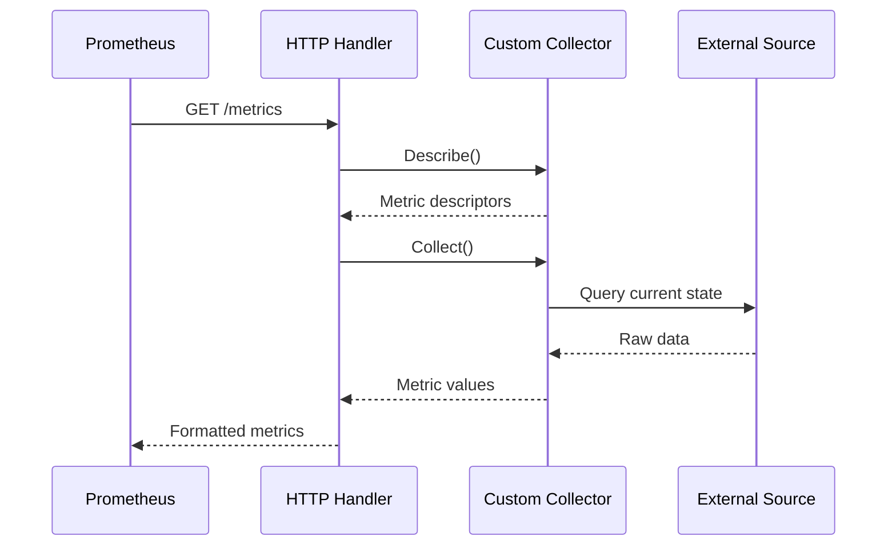

# How to Build Prometheus Custom Collectors

Author: [nawazdhandala](https://www.github.com/nawazdhandala)

Tags: Prometheus, Metrics, Monitoring, Go, Observability

Description: Build custom Prometheus collectors to expose application-specific metrics, external system data, and business KPIs for comprehensive monitoring.

---

Standard Prometheus metrics work great for tracking counters and gauges that change during normal application flow. But what happens when you need metrics from external sources - a database connection pool, a third-party API, hardware sensors, or legacy systems that do not expose Prometheus endpoints? This is where custom collectors come in.

Custom collectors let you fetch metrics on-demand whenever Prometheus scrapes your endpoint. Instead of updating metrics throughout your code, you query the source directly at scrape time. This approach works particularly well for external data sources, expensive computations that should not run constantly, or metrics that need to reflect the exact state at query time.

## When to Use Custom Collectors

Before diving into implementation, consider whether you actually need a custom collector. Standard metrics using `promauto` are simpler and work well for most cases.

Use custom collectors when:

- Metrics come from external systems (databases, caches, message queues)
- You need to query an API or run a command to get values
- The metric source already maintains its own state
- You want to expose metrics from legacy systems

Stick with standard metrics when:

- Your application generates the events being measured
- You are counting requests, errors, or tracking durations
- Values update frequently as part of normal code execution

## The Collector Interface

Prometheus collectors implement a simple interface with two methods:



The `Describe` method tells Prometheus what metrics this collector provides. The `Collect` method fetches current values and sends them to the channel.

Here is the interface you need to implement:

```go
// The Collector interface from prometheus package
type Collector interface {
    // Describe sends metric descriptors to the channel
    Describe(chan<- *prometheus.Desc)

    // Collect fetches values and sends metrics to the channel
    Collect(chan<- prometheus.Metric)
}
```

## Building Your First Custom Collector

Let's build a collector that exposes connection pool statistics from a SQL database. The Go `database/sql` package provides a `Stats()` method with useful metrics that we can expose to Prometheus.

First, define the collector struct with metric descriptors:

```go
package collectors

import (
    "database/sql"

    "github.com/prometheus/client_golang/prometheus"
)

// DatabaseCollector exposes database connection pool metrics
type DatabaseCollector struct {
    db *sql.DB

    // Metric descriptors define the metric name, help text, and labels
    openConnections   *prometheus.Desc
    inUseConnections  *prometheus.Desc
    idleConnections   *prometheus.Desc
    waitCount         *prometheus.Desc
    waitDuration      *prometheus.Desc
}

// NewDatabaseCollector creates a collector for the given database
func NewDatabaseCollector(db *sql.DB, dbName string) *DatabaseCollector {
    // Labels that will be attached to every metric from this collector
    labels := prometheus.Labels{"database": dbName}

    return &DatabaseCollector{
        db: db,
        openConnections: prometheus.NewDesc(
            "db_connections_open",
            "Number of open connections to the database",
            nil,    // No variable labels
            labels, // Constant labels
        ),
        inUseConnections: prometheus.NewDesc(
            "db_connections_in_use",
            "Number of connections currently in use",
            nil,
            labels,
        ),
        idleConnections: prometheus.NewDesc(
            "db_connections_idle",
            "Number of idle connections",
            nil,
            labels,
        ),
        waitCount: prometheus.NewDesc(
            "db_connections_wait_total",
            "Total number of connections waited for",
            nil,
            labels,
        ),
        waitDuration: prometheus.NewDesc(
            "db_connections_wait_duration_seconds_total",
            "Total time spent waiting for connections",
            nil,
            labels,
        ),
    }
}
```

Next, implement the `Describe` method. This sends all metric descriptors to Prometheus so it knows what to expect:

```go
// Describe sends metric descriptors to the provided channel
func (c *DatabaseCollector) Describe(ch chan<- *prometheus.Desc) {
    ch <- c.openConnections
    ch <- c.inUseConnections
    ch <- c.idleConnections
    ch <- c.waitCount
    ch <- c.waitDuration
}
```

The `Collect` method does the actual work - fetching current values and sending metrics:

```go
// Collect retrieves database stats and sends them as metrics
func (c *DatabaseCollector) Collect(ch chan<- prometheus.Metric) {
    // Get current connection pool statistics
    stats := c.db.Stats()

    // Send each metric with its current value
    ch <- prometheus.MustNewConstMetric(
        c.openConnections,
        prometheus.GaugeValue,
        float64(stats.OpenConnections),
    )

    ch <- prometheus.MustNewConstMetric(
        c.inUseConnections,
        prometheus.GaugeValue,
        float64(stats.InUse),
    )

    ch <- prometheus.MustNewConstMetric(
        c.idleConnections,
        prometheus.GaugeValue,
        float64(stats.Idle),
    )

    // Counters for cumulative values
    ch <- prometheus.MustNewConstMetric(
        c.waitCount,
        prometheus.CounterValue,
        float64(stats.WaitCount),
    )

    ch <- prometheus.MustNewConstMetric(
        c.waitDuration,
        prometheus.CounterValue,
        stats.WaitDuration.Seconds(),
    )
}
```

Register the collector with Prometheus:

```go
func main() {
    db, err := sql.Open("postgres", "postgres://localhost/mydb")
    if err != nil {
        log.Fatal(err)
    }

    // Create and register the collector
    collector := collectors.NewDatabaseCollector(db, "mydb")
    prometheus.MustRegister(collector)

    // Expose metrics endpoint
    http.Handle("/metrics", promhttp.Handler())
    http.ListenAndServe(":8080", nil)
}
```

## Handling Dynamic Labels

Sometimes you need labels with values determined at collection time. For example, exposing queue depths for multiple queues where queue names are not known at startup.

Define variable labels in the descriptor and provide values during collection:

```go
type QueueCollector struct {
    client    *MessageQueueClient
    queueSize *prometheus.Desc
}

func NewQueueCollector(client *MessageQueueClient) *QueueCollector {
    return &QueueCollector{
        client: client,
        queueSize: prometheus.NewDesc(
            "message_queue_size",
            "Number of messages in the queue",
            []string{"queue_name"}, // Variable label
            nil,
        ),
    }
}

func (c *QueueCollector) Collect(ch chan<- prometheus.Metric) {
    // Get all queues dynamically
    queues, err := c.client.ListQueues()
    if err != nil {
        // Log error but do not panic - partial metrics are better than none
        log.Printf("Failed to list queues: %v", err)
        return
    }

    for _, queue := range queues {
        size, err := c.client.GetQueueSize(queue.Name)
        if err != nil {
            continue
        }

        // Pass label value as the last argument
        ch <- prometheus.MustNewConstMetric(
            c.queueSize,
            prometheus.GaugeValue,
            float64(size),
            queue.Name, // Value for "queue_name" label
        )
    }
}
```

## Error Handling in Collectors

Collectors should be resilient. A failing collector should not crash your application or prevent other metrics from being collected.

```go
func (c *ExternalServiceCollector) Collect(ch chan<- prometheus.Metric) {
    // Use a context with timeout to prevent hanging scrapes
    ctx, cancel := context.WithTimeout(context.Background(), 5*time.Second)
    defer cancel()

    stats, err := c.client.GetStats(ctx)
    if err != nil {
        // Option 1: Log and return partial metrics
        log.Printf("Failed to collect external metrics: %v", err)

        // Option 2: Expose an error metric
        ch <- prometheus.MustNewConstMetric(
            c.scrapeErrors,
            prometheus.CounterValue,
            1,
        )
        return
    }

    // Send successful metrics
    ch <- prometheus.MustNewConstMetric(
        c.requestsTotal,
        prometheus.CounterValue,
        float64(stats.TotalRequests),
    )
}
```

## Exposing Business Metrics

Custom collectors shine when exposing business-level metrics. Here is an example that queries a database for order statistics:

```go
type BusinessMetricsCollector struct {
    db             *sql.DB
    ordersTotal    *prometheus.Desc
    revenueTotal   *prometheus.Desc
    activeUsers    *prometheus.Desc
}

func (c *BusinessMetricsCollector) Collect(ch chan<- prometheus.Metric) {
    // Query orders by status
    rows, err := c.db.Query(`
        SELECT status, COUNT(*), COALESCE(SUM(total_amount), 0)
        FROM orders
        WHERE created_at > NOW() - INTERVAL '24 hours'
        GROUP BY status
    `)
    if err != nil {
        log.Printf("Failed to query orders: %v", err)
        return
    }
    defer rows.Close()

    for rows.Next() {
        var status string
        var count int64
        var revenue float64

        if err := rows.Scan(&status, &count, &revenue); err != nil {
            continue
        }

        ch <- prometheus.MustNewConstMetric(
            c.ordersTotal,
            prometheus.GaugeValue,
            float64(count),
            status,
        )

        ch <- prometheus.MustNewConstMetric(
            c.revenueTotal,
            prometheus.GaugeValue,
            revenue,
            status,
        )
    }
}
```

## Testing Custom Collectors

Test collectors by calling their methods directly and verifying the output:

```go
func TestDatabaseCollector(t *testing.T) {
    db := setupTestDatabase(t)
    collector := NewDatabaseCollector(db, "test")

    // Collect metrics into a channel
    ch := make(chan prometheus.Metric, 10)
    go func() {
        collector.Collect(ch)
        close(ch)
    }()

    // Verify metrics were produced
    metrics := []prometheus.Metric{}
    for m := range ch {
        metrics = append(metrics, m)
    }

    if len(metrics) != 5 {
        t.Errorf("Expected 5 metrics, got %d", len(metrics))
    }
}
```

## Performance Considerations

Keep your `Collect` method fast. Prometheus scrapes typically have a timeout of 10-30 seconds. If collection takes too long, you will see gaps in your metrics.

- Use connection pooling for database queries
- Add timeouts to external API calls
- Cache expensive computations if staleness is acceptable
- Consider running slow collectors in a separate registry with longer scrape intervals

## Summary

Custom collectors give you flexibility to expose metrics from any data source. The key points to remember:

| Aspect | Recommendation |
|--------|----------------|
| Use case | External data sources, on-demand queries |
| Error handling | Log errors, do not panic, consider error metrics |
| Performance | Add timeouts, keep collection fast |
| Labels | Use variable labels for dynamic dimensions |
| Testing | Mock external dependencies, verify metric output |

Start simple with a single metric and expand as needed. The Prometheus client library handles all the formatting and exposition - you just need to provide the values.
