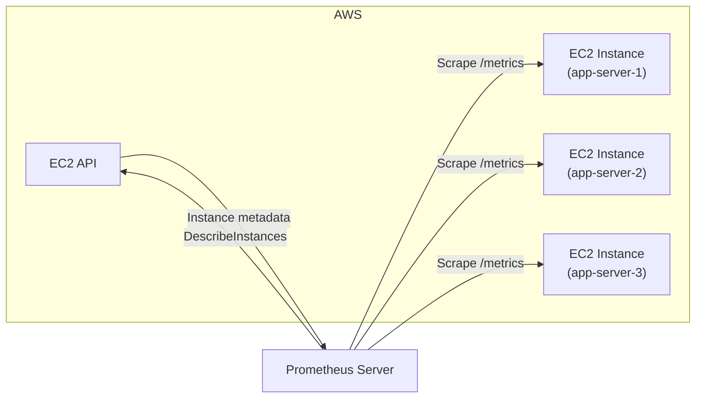
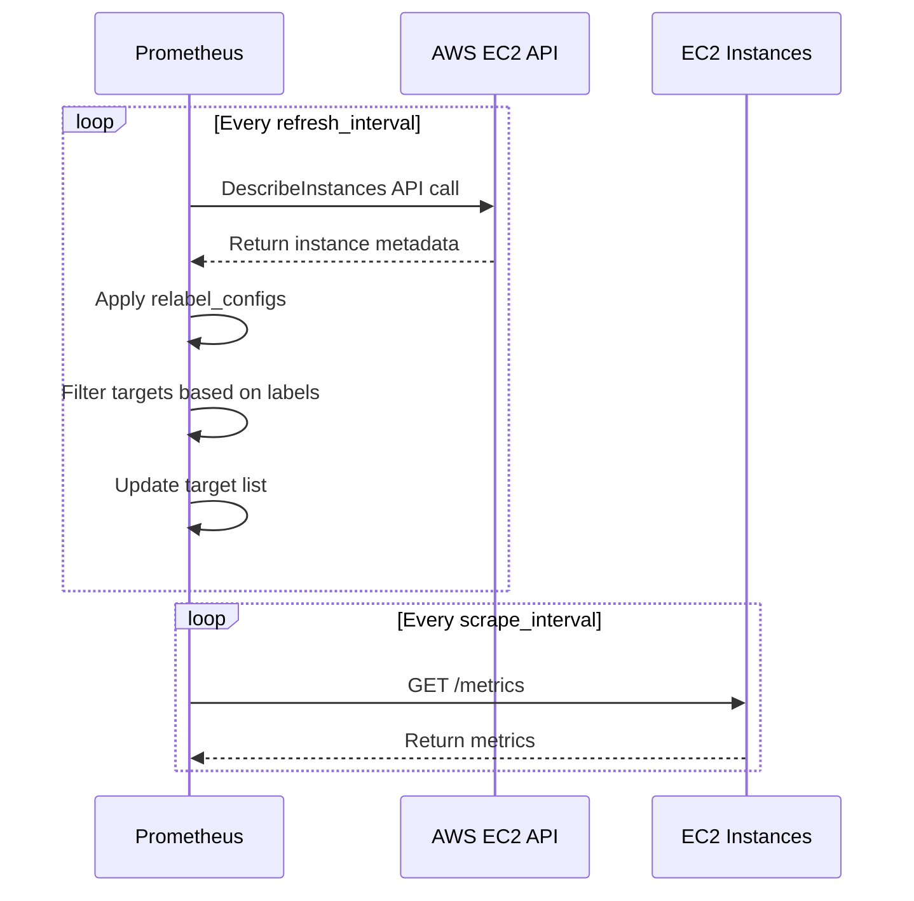
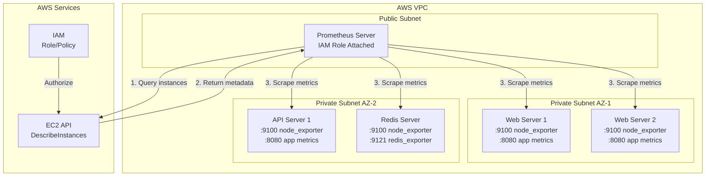

# How to Implement Prometheus EC2 SD (Service Discovery)

Author: [nawazdhandala](https://github.com/nawazdhandala)

Tags: Prometheus, AWS, EC2, Service Discovery

Description: Learn how to implement Prometheus EC2 Service Discovery to automatically discover and monitor EC2 instances. This guide covers IAM configuration, Prometheus setup, relabeling, filtering by tags, and production best practices.

---

> Managing Prometheus targets manually is tedious and error-prone, especially in dynamic cloud environments where instances come and go. EC2 Service Discovery lets Prometheus automatically find and monitor your EC2 instances based on tags and metadata.

Stop maintaining static target lists. Let Prometheus discover your infrastructure automatically.

---

## Overview

Prometheus EC2 Service Discovery queries the AWS EC2 API to discover instances and automatically add them as scrape targets. When instances launch or terminate, Prometheus updates its target list without manual intervention.



---

## How EC2 Service Discovery Works

EC2 SD operates through a continuous discovery loop:



Prometheus discovers instances with the following metadata:

- `__meta_ec2_instance_id` - The EC2 instance ID
- `__meta_ec2_public_ip` - Public IP address (if assigned)
- `__meta_ec2_private_ip` - Private IP address
- `__meta_ec2_tag_<tagname>` - EC2 tags (sanitized)
- `__meta_ec2_availability_zone` - Availability zone
- `__meta_ec2_instance_state` - Instance state (running, stopped, etc.)
- `__meta_ec2_instance_type` - Instance type (t3.micro, m5.large, etc.)
- `__meta_ec2_vpc_id` - VPC ID

---

## Prerequisites

Before configuring EC2 SD, ensure you have:

1. Prometheus server running (v2.0 or later)
2. EC2 instances exposing metrics (typically on port 9100 for node_exporter)
3. Network connectivity from Prometheus to EC2 instances
4. AWS credentials with appropriate permissions

---

## IAM Configuration

### Create IAM Policy

Prometheus needs permission to describe EC2 instances. Create a policy with minimal required permissions:

```json
{
    "Version": "2012-10-17",
    "Statement": [
        {
            "Effect": "Allow",
            "Action": [
                "ec2:DescribeInstances"
            ],
            "Resource": "*"
        }
    ]
}
```

Save this as `prometheus-ec2-sd-policy.json` and create the policy:

```bash
aws iam create-policy \
    --policy-name PrometheusEC2ServiceDiscovery \
    --policy-document file://prometheus-ec2-sd-policy.json
```

### Option 1: IAM Role for EC2 (Recommended)

If Prometheus runs on EC2, attach an IAM role to the instance. This eliminates the need for access keys:

```bash
# Create trust policy for EC2
cat > trust-policy.json << 'EOF'
{
    "Version": "2012-10-17",
    "Statement": [
        {
            "Effect": "Allow",
            "Principal": {
                "Service": "ec2.amazonaws.com"
            },
            "Action": "sts:AssumeRole"
        }
    ]
}
EOF

# Create the role
aws iam create-role \
    --role-name PrometheusEC2SDRole \
    --assume-role-policy-document file://trust-policy.json

# Attach the policy
aws iam attach-role-policy \
    --role-name PrometheusEC2SDRole \
    --policy-arn arn:aws:iam::YOUR_ACCOUNT_ID:policy/PrometheusEC2ServiceDiscovery

# Create instance profile
aws iam create-instance-profile \
    --instance-profile-name PrometheusEC2SDProfile

aws iam add-role-to-instance-profile \
    --instance-profile-name PrometheusEC2SDProfile \
    --role-name PrometheusEC2SDRole
```

Attach the instance profile to your Prometheus EC2 instance:

```bash
aws ec2 associate-iam-instance-profile \
    --instance-id i-1234567890abcdef0 \
    --iam-instance-profile Name=PrometheusEC2SDProfile
```

### Option 2: IAM User with Access Keys

For Prometheus running outside EC2 (on-premises or other cloud):

```bash
# Create IAM user
aws iam create-user --user-name prometheus-ec2-sd

# Attach policy
aws iam attach-user-policy \
    --user-name prometheus-ec2-sd \
    --policy-arn arn:aws:iam::YOUR_ACCOUNT_ID:policy/PrometheusEC2ServiceDiscovery

# Create access keys
aws iam create-access-key --user-name prometheus-ec2-sd
```

Store the access key and secret key securely for use in Prometheus configuration.

---

## Basic Prometheus Configuration

### Minimal Configuration

The simplest EC2 SD configuration discovers all running instances in a region:

```yaml
# prometheus.yml
global:
  scrape_interval: 15s
  evaluation_interval: 15s

scrape_configs:
  - job_name: 'ec2-instances'
    ec2_sd_configs:
      - region: us-east-1
        port: 9100
```

When using an IAM role (recommended), no credentials are needed. Prometheus uses the instance metadata service automatically.

### Configuration with Access Keys

If using IAM user credentials:

```yaml
scrape_configs:
  - job_name: 'ec2-instances'
    ec2_sd_configs:
      - region: us-east-1
        access_key: YOUR_ACCESS_KEY
        secret_key: YOUR_SECRET_KEY
        port: 9100
```

For better security, use environment variables or AWS credentials file instead of hardcoding credentials.

### Using Environment Variables

```yaml
scrape_configs:
  - job_name: 'ec2-instances'
    ec2_sd_configs:
      - region: us-east-1
        port: 9100
```

Set credentials via environment variables before starting Prometheus:

```bash
export AWS_ACCESS_KEY_ID=YOUR_ACCESS_KEY
export AWS_SECRET_ACCESS_KEY=YOUR_SECRET_KEY
prometheus --config.file=prometheus.yml
```

---

## Relabeling Configuration

Relabeling transforms discovered metadata into useful labels. This is where EC2 SD becomes powerful.

### Basic Relabeling

Convert EC2 metadata into Prometheus labels:

```yaml
scrape_configs:
  - job_name: 'ec2-instances'
    ec2_sd_configs:
      - region: us-east-1
        port: 9100

    relabel_configs:
      # Use instance ID as the instance label
      - source_labels: [__meta_ec2_instance_id]
        target_label: instance_id

      # Add availability zone label
      - source_labels: [__meta_ec2_availability_zone]
        target_label: availability_zone

      # Add instance type label
      - source_labels: [__meta_ec2_instance_type]
        target_label: instance_type

      # Use Name tag as the instance label for readability
      - source_labels: [__meta_ec2_tag_Name]
        target_label: instance
```

### Using Private IP vs Public IP

By default, Prometheus uses the private IP. To use the public IP:

```yaml
relabel_configs:
  # Replace target address with public IP
  - source_labels: [__meta_ec2_public_ip]
    target_label: __address__
    replacement: '${1}:9100'
```

To keep private IP (default behavior, but explicit):

```yaml
relabel_configs:
  - source_labels: [__meta_ec2_private_ip]
    target_label: __address__
    replacement: '${1}:9100'
```

---

## Filtering by Tags

Filter discovered instances using EC2 tags. This allows you to monitor only specific instances.

### Filter by Single Tag

Monitor only instances with `Environment=production`:

```yaml
scrape_configs:
  - job_name: 'production-servers'
    ec2_sd_configs:
      - region: us-east-1
        port: 9100
        filters:
          - name: tag:Environment
            values:
              - production
```

### Filter by Multiple Tags

Monitor instances matching multiple tag conditions:

```yaml
scrape_configs:
  - job_name: 'production-web-servers'
    ec2_sd_configs:
      - region: us-east-1
        port: 9100
        filters:
          - name: tag:Environment
            values:
              - production
          - name: tag:Role
            values:
              - web
              - api
```

### Filter by Instance State

Only discover running instances (default behavior, but can be explicit):

```yaml
scrape_configs:
  - job_name: 'ec2-instances'
    ec2_sd_configs:
      - region: us-east-1
        port: 9100
        filters:
          - name: instance-state-name
            values:
              - running
```

### Filter Using Relabel Configs

For more complex filtering, use relabel_configs with the `drop` or `keep` actions:

```yaml
scrape_configs:
  - job_name: 'ec2-instances'
    ec2_sd_configs:
      - region: us-east-1
        port: 9100

    relabel_configs:
      # Only keep instances with monitoring=enabled tag
      - source_labels: [__meta_ec2_tag_monitoring]
        regex: enabled
        action: keep

      # Drop instances in stopped state
      - source_labels: [__meta_ec2_instance_state]
        regex: stopped|terminated
        action: drop
```

---

## Multiple Environments Configuration

Organize scrape jobs by environment for clear separation:

```yaml
scrape_configs:
  # Production environment
  - job_name: 'production'
    ec2_sd_configs:
      - region: us-east-1
        port: 9100
        filters:
          - name: tag:Environment
            values:
              - production
    relabel_configs:
      - source_labels: [__meta_ec2_tag_Name]
        target_label: instance
      - target_label: environment
        replacement: production

  # Staging environment
  - job_name: 'staging'
    ec2_sd_configs:
      - region: us-east-1
        port: 9100
        filters:
          - name: tag:Environment
            values:
              - staging
    relabel_configs:
      - source_labels: [__meta_ec2_tag_Name]
        target_label: instance
      - target_label: environment
        replacement: staging

  # Development environment
  - job_name: 'development'
    ec2_sd_configs:
      - region: us-east-1
        port: 9100
        filters:
          - name: tag:Environment
            values:
              - development
    relabel_configs:
      - source_labels: [__meta_ec2_tag_Name]
        target_label: instance
      - target_label: environment
        replacement: development
```

---

## Multi-Region Discovery

Discover instances across multiple AWS regions:

```yaml
scrape_configs:
  - job_name: 'ec2-multi-region'
    ec2_sd_configs:
      - region: us-east-1
        port: 9100
        filters:
          - name: tag:monitoring
            values:
              - enabled
      - region: us-west-2
        port: 9100
        filters:
          - name: tag:monitoring
            values:
              - enabled
      - region: eu-west-1
        port: 9100
        filters:
          - name: tag:monitoring
            values:
              - enabled

    relabel_configs:
      - source_labels: [__meta_ec2_availability_zone]
        target_label: region
        regex: '([a-z]+-[a-z]+-[0-9]+)[a-z]'
        replacement: '${1}'
      - source_labels: [__meta_ec2_tag_Name]
        target_label: instance
```

---

## Dynamic Port Configuration

Different services may expose metrics on different ports. Use EC2 tags to configure ports dynamically:

### Tag-Based Port Configuration

Tag your EC2 instances with the metrics port:

```bash
aws ec2 create-tags \
    --resources i-1234567890abcdef0 \
    --tags Key=prometheus_port,Value=9100
```

Configure Prometheus to use the tag value:

```yaml
scrape_configs:
  - job_name: 'ec2-dynamic-port'
    ec2_sd_configs:
      - region: us-east-1
        # Default port, will be overridden by tag
        port: 9100

    relabel_configs:
      # Use port from tag if available
      - source_labels: [__meta_ec2_private_ip, __meta_ec2_tag_prometheus_port]
        regex: '(.+);(.+)'
        target_label: __address__
        replacement: '${1}:${2}'

      # Fall back to default port if tag not set
      - source_labels: [__meta_ec2_private_ip, __meta_ec2_tag_prometheus_port]
        regex: '(.+);'
        target_label: __address__
        replacement: '${1}:9100'
```

### Multiple Exporters Per Instance

Monitor multiple exporters on the same instance:

```yaml
scrape_configs:
  # Node exporter
  - job_name: 'ec2-node-exporter'
    ec2_sd_configs:
      - region: us-east-1
        port: 9100
        filters:
          - name: tag:node_exporter
            values:
              - enabled
    relabel_configs:
      - source_labels: [__meta_ec2_tag_Name]
        target_label: instance

  # Application metrics
  - job_name: 'ec2-app-metrics'
    ec2_sd_configs:
      - region: us-east-1
        port: 8080
        filters:
          - name: tag:app_metrics
            values:
              - enabled
    relabel_configs:
      - source_labels: [__meta_ec2_tag_Name]
        target_label: instance
    metrics_path: /actuator/prometheus
```

---

## Complete Production Configuration

Here is a comprehensive configuration for production use:

```yaml
# prometheus.yml
global:
  scrape_interval: 30s
  evaluation_interval: 30s
  external_labels:
    cluster: production
    region: us-east-1

scrape_configs:
  # Self-monitoring
  - job_name: 'prometheus'
    static_configs:
      - targets: ['localhost:9090']

  # EC2 instances - Node Exporter
  - job_name: 'ec2-node-exporter'
    ec2_sd_configs:
      - region: us-east-1
        port: 9100
        refresh_interval: 60s
        filters:
          - name: tag:monitoring
            values:
              - enabled
          - name: instance-state-name
            values:
              - running

    relabel_configs:
      # Set instance name from Name tag
      - source_labels: [__meta_ec2_tag_Name]
        target_label: instance

      # Add instance metadata as labels
      - source_labels: [__meta_ec2_instance_id]
        target_label: instance_id

      - source_labels: [__meta_ec2_availability_zone]
        target_label: availability_zone

      - source_labels: [__meta_ec2_instance_type]
        target_label: instance_type

      - source_labels: [__meta_ec2_vpc_id]
        target_label: vpc_id

      # Add environment label from tag
      - source_labels: [__meta_ec2_tag_Environment]
        target_label: environment

      # Add service label from tag
      - source_labels: [__meta_ec2_tag_Service]
        target_label: service

      # Add team label from tag
      - source_labels: [__meta_ec2_tag_Team]
        target_label: team

      # Drop instances without Name tag
      - source_labels: [__meta_ec2_tag_Name]
        regex: '.+'
        action: keep

  # EC2 instances - Application Metrics
  - job_name: 'ec2-application'
    ec2_sd_configs:
      - region: us-east-1
        port: 8080
        refresh_interval: 60s
        filters:
          - name: tag:app_metrics
            values:
              - enabled
          - name: instance-state-name
            values:
              - running

    metrics_path: /metrics

    relabel_configs:
      - source_labels: [__meta_ec2_tag_Name]
        target_label: instance

      - source_labels: [__meta_ec2_tag_Service]
        target_label: service

      - source_labels: [__meta_ec2_tag_Environment]
        target_label: environment

      # Use custom port from tag if set
      - source_labels: [__meta_ec2_private_ip, __meta_ec2_tag_metrics_port]
        regex: '(.+);(.+)'
        target_label: __address__
        replacement: '${1}:${2}'

  # EC2 instances - Redis Exporter
  - job_name: 'ec2-redis'
    ec2_sd_configs:
      - region: us-east-1
        port: 9121
        refresh_interval: 60s
        filters:
          - name: tag:Service
            values:
              - redis
          - name: instance-state-name
            values:
              - running

    relabel_configs:
      - source_labels: [__meta_ec2_tag_Name]
        target_label: instance

      - source_labels: [__meta_ec2_tag_Environment]
        target_label: environment
```

---

## Architecture Diagram



---

## Terraform Infrastructure Setup

Automate your EC2 instance creation with proper tags for Prometheus discovery:

```hcl
# main.tf
provider "aws" {
  region = "us-east-1"
}

# IAM role for Prometheus server
resource "aws_iam_role" "prometheus" {
  name = "prometheus-ec2-sd-role"

  assume_role_policy = jsonencode({
    Version = "2012-10-17"
    Statement = [
      {
        Action = "sts:AssumeRole"
        Effect = "Allow"
        Principal = {
          Service = "ec2.amazonaws.com"
        }
      }
    ]
  })
}

resource "aws_iam_role_policy" "prometheus_ec2_sd" {
  name = "prometheus-ec2-sd-policy"
  role = aws_iam_role.prometheus.id

  policy = jsonencode({
    Version = "2012-10-17"
    Statement = [
      {
        Effect   = "Allow"
        Action   = ["ec2:DescribeInstances"]
        Resource = "*"
      }
    ]
  })
}

resource "aws_iam_instance_profile" "prometheus" {
  name = "prometheus-ec2-sd-profile"
  role = aws_iam_role.prometheus.name
}

# Security group for Prometheus
resource "aws_security_group" "prometheus" {
  name        = "prometheus-server"
  description = "Security group for Prometheus server"
  vpc_id      = var.vpc_id

  ingress {
    from_port   = 9090
    to_port     = 9090
    protocol    = "tcp"
    cidr_blocks = [var.allowed_cidr]
  }

  egress {
    from_port   = 0
    to_port     = 0
    protocol    = "-1"
    cidr_blocks = ["0.0.0.0/0"]
  }

  tags = {
    Name = "prometheus-server"
  }
}

# Security group for monitored instances
resource "aws_security_group" "monitored_instances" {
  name        = "monitored-instances"
  description = "Allow Prometheus to scrape metrics"
  vpc_id      = var.vpc_id

  ingress {
    from_port       = 9100
    to_port         = 9100
    protocol        = "tcp"
    security_groups = [aws_security_group.prometheus.id]
    description     = "Node exporter"
  }

  ingress {
    from_port       = 8080
    to_port         = 8080
    protocol        = "tcp"
    security_groups = [aws_security_group.prometheus.id]
    description     = "Application metrics"
  }

  tags = {
    Name = "monitored-instances"
  }
}

# Example monitored EC2 instance
resource "aws_instance" "web_server" {
  count                  = 2
  ami                    = var.ami_id
  instance_type          = "t3.micro"
  subnet_id              = var.private_subnet_id
  vpc_security_group_ids = [aws_security_group.monitored_instances.id]

  tags = {
    Name        = "web-server-${count.index + 1}"
    Environment = "production"
    Service     = "web"
    Team        = "platform"
    monitoring  = "enabled"
  }
}

# Prometheus server instance
resource "aws_instance" "prometheus" {
  ami                    = var.ami_id
  instance_type          = "t3.medium"
  subnet_id              = var.public_subnet_id
  vpc_security_group_ids = [aws_security_group.prometheus.id]
  iam_instance_profile   = aws_iam_instance_profile.prometheus.name

  user_data = <<-EOF
              #!/bin/bash
              # Install and configure Prometheus
              wget https://github.com/prometheus/prometheus/releases/download/v2.48.0/prometheus-2.48.0.linux-amd64.tar.gz
              tar xvfz prometheus-2.48.0.linux-amd64.tar.gz
              cd prometheus-2.48.0.linux-amd64
              ./prometheus --config.file=/etc/prometheus/prometheus.yml
              EOF

  tags = {
    Name = "prometheus-server"
  }
}
```

---

## Troubleshooting

### Common Issues and Solutions

#### 1. No Targets Discovered

Check Prometheus logs for errors:

```bash
journalctl -u prometheus -f | grep ec2
```

Verify IAM permissions:

```bash
aws ec2 describe-instances --region us-east-1 --query 'Reservations[*].Instances[*].InstanceId'
```

#### 2. Targets in Unknown State

Ensure network connectivity from Prometheus to targets:

```bash
# From Prometheus server
curl -v http://TARGET_IP:9100/metrics
```

Check security group rules allow traffic on the metrics port.

#### 3. High API Usage

Increase `refresh_interval` to reduce API calls:

```yaml
ec2_sd_configs:
  - region: us-east-1
    refresh_interval: 300s  # 5 minutes instead of default 60s
```

#### 4. Missing Labels

Verify EC2 tags exist and are properly formatted:

```bash
aws ec2 describe-tags \
    --filters "Name=resource-id,Values=i-1234567890abcdef0"
```

Remember that Prometheus sanitizes tag names (replaces invalid characters with underscores).

### Useful PromQL Queries for Debugging

```promql
# Check discovered targets
up{job="ec2-instances"}

# Count targets by availability zone
count by (availability_zone) (up{job="ec2-instances"})

# Find targets that are down
up{job="ec2-instances"} == 0

# Check scrape duration
scrape_duration_seconds{job="ec2-instances"}
```

---

## Best Practices

### 1. Use Tags Consistently

Establish a tagging strategy across your organization:

| Tag Key | Purpose | Example Values |
|---------|---------|----------------|
| `monitoring` | Enable/disable discovery | enabled, disabled |
| `Environment` | Environment identifier | production, staging, dev |
| `Service` | Service/application name | api, web, worker |
| `Team` | Owning team | platform, backend, frontend |

### 2. Minimize IAM Permissions

Only grant `ec2:DescribeInstances`. Never grant broader EC2 permissions to Prometheus.

### 3. Use Filters Over Relabeling

Filter at the API level when possible. This reduces API response size and processing:

```yaml
# Preferred - filter at API level
ec2_sd_configs:
  - region: us-east-1
    filters:
      - name: tag:monitoring
        values: [enabled]

# Less efficient - filter after discovery
relabel_configs:
  - source_labels: [__meta_ec2_tag_monitoring]
    regex: enabled
    action: keep
```

### 4. Set Appropriate Refresh Intervals

Balance freshness against API costs:

- Development: 30-60 seconds
- Production: 60-300 seconds
- Large fleets (1000+ instances): 300+ seconds

### 5. Monitor the Monitor

Set up alerts for Prometheus health:

```yaml
groups:
  - name: prometheus-health
    rules:
      - alert: PrometheusTargetDown
        expr: up == 0
        for: 5m
        labels:
          severity: warning
        annotations:
          summary: "Target {{ $labels.instance }} is down"

      - alert: PrometheusEC2SDError
        expr: prometheus_sd_ec2_refresh_failures_total > 0
        for: 5m
        labels:
          severity: warning
        annotations:
          summary: "EC2 service discovery refresh failures detected"
```

---

## Conclusion

Prometheus EC2 Service Discovery automates target management for AWS infrastructure. Key takeaways:

- **Use IAM roles** when Prometheus runs on EC2 for secure, credential-free authentication
- **Filter with tags** to discover only the instances you want to monitor
- **Relabel metadata** into meaningful Prometheus labels
- **Set appropriate refresh intervals** to balance freshness and API costs
- **Follow tagging conventions** for consistent discovery across your organization

With EC2 SD configured, your monitoring automatically adapts as your infrastructure scales. New instances appear in Prometheus within the refresh interval, and terminated instances are removed automatically.

---

*Need comprehensive monitoring for your AWS infrastructure? [OneUptime](https://oneuptime.com) provides full-stack observability with automatic service discovery, alerting, and incident management.*
