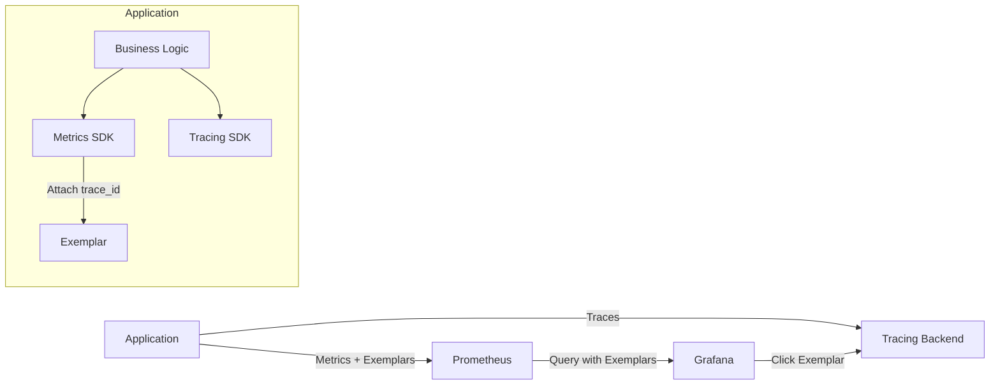
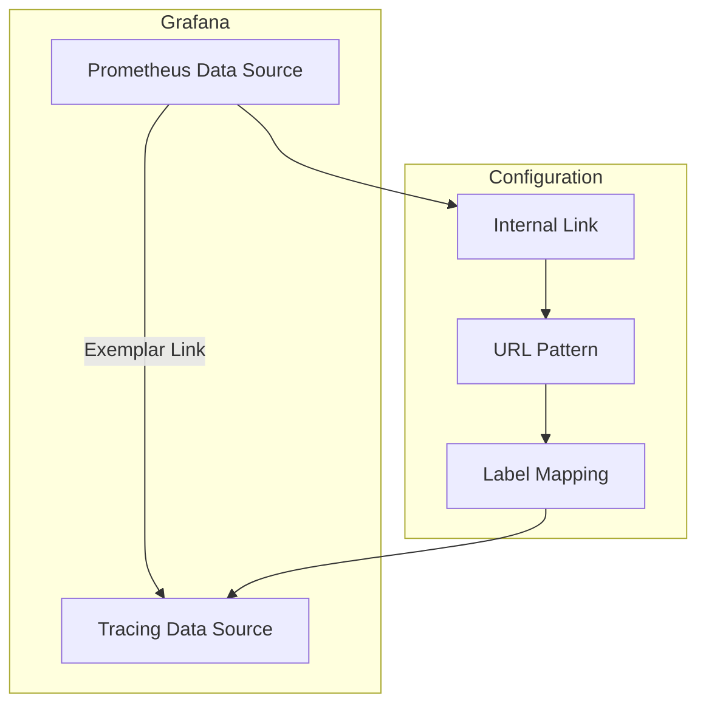
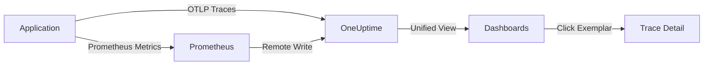

# How to Create Prometheus Exemplar Integration

Author: [nawazdhandala](https://github.com/nawazdhandala)

Tags: Prometheus, Exemplars, Tracing, Observability

Description: Learn how to connect Prometheus metrics to distributed traces using exemplars for faster root cause analysis.

---

You are staring at a latency spike on your Prometheus dashboard. The p99 is through the roof. You know *what* is happening, but you have no idea *which specific requests* are causing the problem. You pivot to your tracing system, run a dozen queries, and 30 minutes later you finally find the culprit.

What if clicking on that spike took you directly to the exact trace that caused it?

That is what Prometheus exemplars give you. They bridge the gap between aggregated metrics and individual traces, turning your observability from a scavenger hunt into a direct path to root cause.

---

## What Are Exemplars?

Exemplars are sample trace references attached to histogram or counter metrics. When Prometheus scrapes a metric, the exemplar carries metadata (typically a `trace_id`) pointing to a specific request that contributed to that data point.

Think of them as bookmarks. Your metric says "p99 latency was 500ms" and the exemplar says "here is one of those slow requests so you can investigate."

The OpenMetrics format supports exemplars natively, and Prometheus 2.26+ can store and query them.

---

## How Exemplars Work

The following diagram shows how exemplars flow through your observability stack.



When your application records a metric (like request duration), the metrics SDK captures the current trace context and attaches it as an exemplar. Prometheus scrapes these exemplars alongside the metric values. When you query in Grafana, you see the exemplar points on your graph, and clicking one takes you to the corresponding trace.

---

## Setting Up Exemplar Support

### Prerequisites

Before implementing exemplars, ensure you have:

- Prometheus 2.26 or later with `--enable-feature=exemplar-storage` flag
- A tracing backend (Jaeger, Tempo, Zipkin, or OneUptime)
- OpenTelemetry or a compatible metrics library
- Grafana 7.4+ for visualization

### Prometheus Configuration

Enable exemplar storage in your Prometheus configuration by adding the feature flag.

```yaml
# prometheus.yml
global:
  scrape_interval: 15s
  evaluation_interval: 15s

# Enable exemplar storage via command line flag:
# prometheus --enable-feature=exemplar-storage --config.file=prometheus.yml

scrape_configs:
  - job_name: 'my-service'
    scrape_interval: 10s
    static_configs:
      - targets: ['localhost:8080']
```

---

## Implementing Exemplars in Go

The Prometheus Go client library supports exemplars natively. Here is how to instrument a histogram with exemplar support.

First, set up your imports and create a histogram metric.

```go
package main

import (
    "context"
    "net/http"
    "time"

    "github.com/prometheus/client_golang/prometheus"
    "github.com/prometheus/client_golang/prometheus/promauto"
    "github.com/prometheus/client_golang/prometheus/promhttp"
    "go.opentelemetry.io/otel"
    "go.opentelemetry.io/otel/trace"
)

var requestDuration = promauto.NewHistogramVec(
    prometheus.HistogramOpts{
        Name:    "http_request_duration_seconds",
        Help:    "Duration of HTTP requests in seconds",
        Buckets: prometheus.DefBuckets,
    },
    []string{"method", "path", "status"},
)
```

Next, create a middleware that records the metric with an exemplar containing the trace ID.

```go
func instrumentHandler(next http.Handler) http.Handler {
    return http.HandlerFunc(func(w http.ResponseWriter, r *http.Request) {
        start := time.Now()

        // Get the current span context
        ctx := r.Context()
        span := trace.SpanFromContext(ctx)

        // Create a response wrapper to capture status code
        rw := &responseWriter{ResponseWriter: w, statusCode: 200}

        next.ServeHTTP(rw, r)

        duration := time.Since(start).Seconds()

        // Build exemplar labels with trace_id
        exemplarLabels := prometheus.Labels{}
        if span.SpanContext().HasTraceID() {
            exemplarLabels["trace_id"] = span.SpanContext().TraceID().String()
        }

        // Record the metric with exemplar
        observer := requestDuration.WithLabelValues(
            r.Method,
            r.URL.Path,
            http.StatusText(rw.statusCode),
        )

        if histogramObserver, ok := observer.(prometheus.ExemplarObserver); ok {
            histogramObserver.ObserveWithExemplar(duration, exemplarLabels)
        } else {
            observer.Observe(duration)
        }
    })
}

type responseWriter struct {
    http.ResponseWriter
    statusCode int
}

func (rw *responseWriter) WriteHeader(code int) {
    rw.statusCode = code
    rw.ResponseWriter.WriteHeader(code)
}
```

---

## Implementing Exemplars in Python

For Python applications using the prometheus-client library, you can add exemplar support with OpenTelemetry.

Set up the histogram and import the necessary modules.

```python
from prometheus_client import Histogram, REGISTRY, generate_latest, CONTENT_TYPE_LATEST
from prometheus_client.openmetrics.exposition import generate_latest as generate_openmetrics
from opentelemetry import trace
from opentelemetry.sdk.trace import TracerProvider
from opentelemetry.sdk.trace.export import BatchSpanProcessor
from opentelemetry.exporter.otlp.proto.grpc.trace_exporter import OTLPSpanExporter
import time
from functools import wraps

# Initialize tracing
trace.set_tracer_provider(TracerProvider())
tracer = trace.get_tracer(__name__)

# Create histogram metric
REQUEST_DURATION = Histogram(
    'http_request_duration_seconds',
    'Duration of HTTP requests in seconds',
    ['method', 'path', 'status'],
    buckets=[0.005, 0.01, 0.025, 0.05, 0.1, 0.25, 0.5, 1.0, 2.5, 5.0, 10.0]
)
```

Create a decorator that records metrics with exemplars.

```python
def track_request_duration(method, path):
    def decorator(func):
        @wraps(func)
        def wrapper(*args, **kwargs):
            start_time = time.time()

            # Get current span context
            current_span = trace.get_current_span()
            span_context = current_span.get_span_context()

            try:
                result = func(*args, **kwargs)
                status = "200"
                return result
            except Exception as e:
                status = "500"
                raise
            finally:
                duration = time.time() - start_time

                # Build exemplar with trace_id
                exemplar = None
                if span_context.is_valid:
                    exemplar = {
                        'trace_id': format(span_context.trace_id, '032x')
                    }

                # Record metric with exemplar
                REQUEST_DURATION.labels(
                    method=method,
                    path=path,
                    status=status
                ).observe(duration, exemplar=exemplar)

        return wrapper
    return decorator


# Usage example
@track_request_duration('GET', '/api/users')
def get_users():
    with tracer.start_as_current_span("get_users"):
        # Your business logic here
        time.sleep(0.1)
        return {"users": []}
```

Important: To expose exemplars, use the OpenMetrics format in your metrics endpoint.

```python
from flask import Flask, Response

app = Flask(__name__)

@app.route('/metrics')
def metrics():
    # Use OpenMetrics format to include exemplars
    return Response(
        generate_openmetrics(REGISTRY),
        mimetype='application/openmetrics-text'
    )
```

---

## Implementing Exemplars in Node.js

For Node.js applications, the prom-client library supports exemplars when using OpenTelemetry.

Set up your dependencies and create the histogram.

```typescript
import { Histogram, Registry, collectDefaultMetrics } from 'prom-client';
import { trace, context } from '@opentelemetry/api';
import express, { Request, Response, NextFunction } from 'express';

const register = new Registry();
collectDefaultMetrics({ register });

const requestDuration = new Histogram({
    name: 'http_request_duration_seconds',
    help: 'Duration of HTTP requests in seconds',
    labelNames: ['method', 'path', 'status'],
    buckets: [0.005, 0.01, 0.025, 0.05, 0.1, 0.25, 0.5, 1.0, 2.5, 5.0, 10.0],
    enableExemplars: true,
    registers: [register],
});
```

Create middleware that attaches trace context to metrics.

```typescript
function metricsMiddleware(req: Request, res: Response, next: NextFunction): void {
    const start = process.hrtime.bigint();

    res.on('finish', () => {
        const durationNs = Number(process.hrtime.bigint() - start);
        const durationSeconds = durationNs / 1e9;

        // Get current span context
        const currentSpan = trace.getSpan(context.active());
        const spanContext = currentSpan?.spanContext();

        // Build exemplar labels
        const exemplarLabels: Record<string, string> = {};
        if (spanContext && spanContext.traceId) {
            exemplarLabels.traceID = spanContext.traceId;
        }

        // Record with exemplar
        requestDuration.observe(
            {
                method: req.method,
                path: req.route?.path || req.path,
                status: res.statusCode.toString(),
            },
            durationSeconds,
            exemplarLabels
        );
    });

    next();
}

const app = express();
app.use(metricsMiddleware);

// Expose metrics endpoint with OpenMetrics format
app.get('/metrics', async (req, res) => {
    res.set('Content-Type', register.contentType);
    res.end(await register.metrics());
});
```

---

## Configuring Grafana for Exemplars

To visualize exemplars in Grafana, you need to configure the data source to link to your tracing backend.



### Data Source Configuration

In your Grafana Prometheus data source settings, configure the exemplar section.

1. Navigate to Configuration > Data Sources > Prometheus
2. Scroll to the "Exemplars" section
3. Enable "Internal link"
4. Select your tracing data source (Jaeger, Tempo, or OneUptime)
5. Set the Label name to `trace_id` (or `traceID` depending on your implementation)

For OneUptime, use this URL pattern in the data source configuration.

```
${__value.raw}
```

This tells Grafana to use the trace_id value from the exemplar to construct the link to your tracing backend.

### Dashboard Panel Configuration

When creating histogram panels, enable exemplar display in the panel options.

```json
{
  "targets": [
    {
      "expr": "histogram_quantile(0.99, rate(http_request_duration_seconds_bucket[5m]))",
      "legendFormat": "p99",
      "exemplar": true
    }
  ],
  "options": {
    "exemplars": {
      "color": "rgba(255, 0, 0, 0.7)"
    }
  }
}
```

---

## Best Practices

### Sampling Strategy

Not every request needs an exemplar. Implement a sampling strategy to keep storage costs reasonable.

```go
// Sample exemplars at 1% rate to reduce storage
func shouldRecordExemplar() bool {
    return rand.Float64() < 0.01
}

func recordMetricWithExemplar(duration float64, traceID string) {
    observer := requestDuration.WithLabelValues("GET", "/api", "200")

    if shouldRecordExemplar() && traceID != "" {
        exemplarLabels := prometheus.Labels{"trace_id": traceID}
        if histogramObserver, ok := observer.(prometheus.ExemplarObserver); ok {
            histogramObserver.ObserveWithExemplar(duration, exemplarLabels)
            return
        }
    }

    observer.Observe(duration)
}
```

### Focus on High-Value Metrics

Add exemplars to metrics that matter most for debugging.

- Request latency histograms (p50, p95, p99)
- Error counters
- Queue processing times
- Database query durations

Avoid adding exemplars to every metric. Focus on the ones where tracing context provides actionable insight.

### Label Consistency

Use consistent label names across your stack. If your tracing system expects `traceID`, use that everywhere.

```yaml
# Standardize on snake_case or camelCase, but be consistent
exemplar_labels:
  trace_id: "preferred for Prometheus/Grafana ecosystem"
  traceID: "common in OpenTelemetry ecosystem"
```

---

## Troubleshooting

### Exemplars Not Appearing

If exemplars are not showing in Prometheus or Grafana, check these common issues.

The scrape endpoint must return OpenMetrics format. Verify by checking the Content-Type header.

```bash
curl -H "Accept: application/openmetrics-text" http://localhost:8080/metrics
```

You should see exemplars in the output like this.

```
http_request_duration_seconds_bucket{method="GET",path="/api",status="200",le="0.1"} 150 # {trace_id="abc123def456"} 0.095 1640000000.000
```

### Prometheus Not Storing Exemplars

Ensure the feature flag is enabled.

```bash
prometheus --enable-feature=exemplar-storage --config.file=prometheus.yml
```

Check that your Prometheus version is 2.26 or higher.

```bash
prometheus --version
```

### Grafana Links Not Working

Verify the data source exemplar configuration matches your label names exactly. The label name in Grafana must match what your application emits (`trace_id` vs `traceID`).

---

## Integration with OneUptime

OneUptime supports Prometheus exemplars out of the box. When you send traces via OTLP and metrics via Prometheus remote write, exemplar links work automatically.



Configure Prometheus to remote write to OneUptime.

```yaml
remote_write:
  - url: https://oneuptime.com/api/prometheus/write
    headers:
      Authorization: Bearer YOUR_API_KEY
```

With this setup, clicking an exemplar in your Grafana dashboard (or OneUptime's built-in dashboards) takes you directly to the trace in OneUptime's trace viewer.

---

## Summary

Exemplars transform your metrics from isolated numbers into connected observability signals. By attaching trace IDs to histogram and counter observations, you create a direct path from "something is slow" to "here is why."

Key takeaways:

- Exemplars link metrics to traces using trace_id metadata
- Prometheus 2.26+ with the exemplar-storage feature flag is required
- Use OpenMetrics format to expose exemplars from your application
- Configure Grafana data sources to enable exemplar-to-trace navigation
- Sample exemplars strategically to manage storage costs
- Focus on high-value metrics like latency histograms and error counters

Start with your most critical latency metrics. Add exemplar support, configure Grafana, and watch your debugging time drop from 30 minutes to 30 seconds.

---

**Related Reading:**

- [Logs, Metrics & Traces: Turning Three Noisy Streams into One Story](https://oneuptime.com/blog/post/2025-08-20-three-pillars-of-observability-logs-metrics-traces/view)
- [What are Traces and Spans in OpenTelemetry](https://oneuptime.com/blog/post/2025-08-27-traces-and-spans-in-opentelemetry/view)
- [How to Collect OpenTelemetry Collector Internal Metrics](https://oneuptime.com/blog/post/2025-01-22-how-to-collect-opentelemetry-collector-internal-metrics/view)
