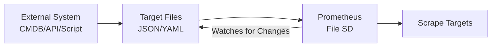
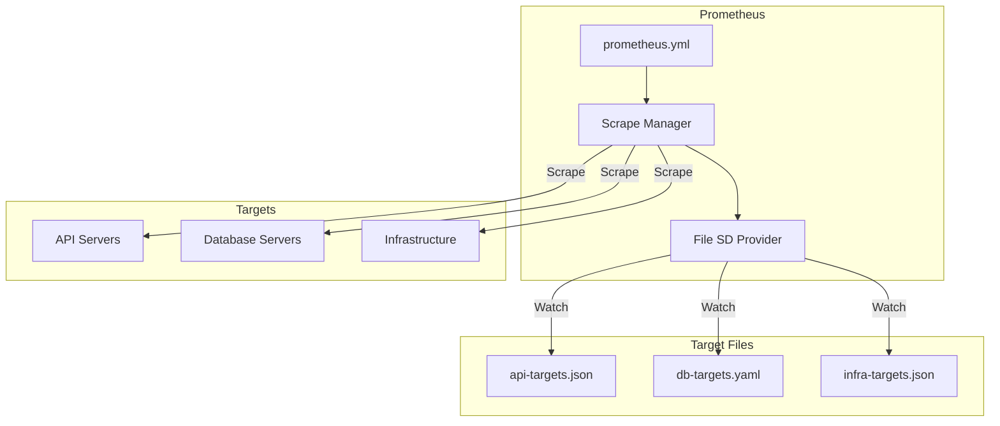
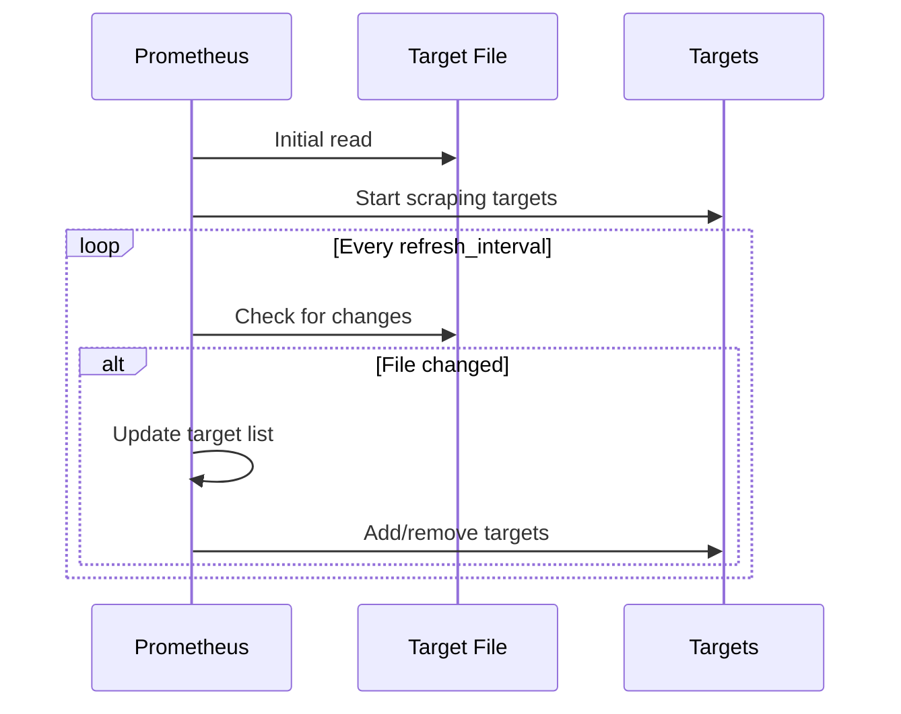
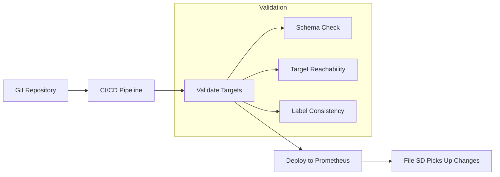

# How to Create Prometheus File SD

Author: [nawazdhandala](https://github.com/nawazdhandala)

Tags: Prometheus, File Service Discovery, Configuration, Targets

Description: Learn to implement Prometheus file-based service discovery with JSON/YAML targets, automatic reloading, and integration patterns.

---

Prometheus supports multiple service discovery mechanisms to dynamically find and scrape targets. Among these, File-based Service Discovery (File SD) stands out as one of the most flexible and straightforward options. It allows you to define your scrape targets in external JSON or YAML files, which Prometheus watches and reloads automatically when changes occur.

This guide walks you through everything you need to know about implementing Prometheus File SD - from basic configuration to advanced patterns and automation scripts.

## What is File-based Service Discovery?

File SD is a service discovery mechanism where Prometheus reads target definitions from files on disk. Unlike static configurations embedded directly in `prometheus.yml`, File SD enables you to update targets without restarting Prometheus.



### Key Benefits

- **Dynamic Updates**: Modify targets without restarting Prometheus
- **Separation of Concerns**: Keep target definitions separate from main configuration
- **Automation Ready**: Easily integrate with external systems that generate target files
- **No Dependencies**: Works without external service discovery systems like Consul or Kubernetes

## File Format Options

Prometheus File SD supports both JSON and YAML formats. Choose the format that best fits your workflow and tooling.

### JSON Format

The JSON format uses an array of target groups. Each target group contains a list of targets and optional labels.

```json
[
  {
    "targets": ["192.168.1.10:9090", "192.168.1.11:9090"],
    "labels": {
      "env": "production",
      "team": "platform",
      "service": "api-gateway"
    }
  },
  {
    "targets": ["192.168.1.20:9100"],
    "labels": {
      "env": "production",
      "team": "infrastructure",
      "service": "node-exporter"
    }
  }
]
```

### YAML Format

The YAML format follows the same structure but with YAML syntax.

```yaml
- targets:
    - "192.168.1.10:9090"
    - "192.168.1.11:9090"
  labels:
    env: production
    team: platform
    service: api-gateway

- targets:
    - "192.168.1.20:9100"
  labels:
    env: production
    team: infrastructure
    service: node-exporter
```

### Target Group Structure

Each target group in the file consists of:

| Field | Type | Required | Description |
|-------|------|----------|-------------|
| `targets` | array of strings | Yes | List of `host:port` endpoints to scrape |
| `labels` | object/map | No | Key-value pairs attached to all targets in the group |

## Configuring Prometheus for File SD

To enable File SD, add a `file_sd_configs` section to your scrape job in `prometheus.yml`.

### Basic Configuration

```yaml
global:
  scrape_interval: 15s
  evaluation_interval: 15s

scrape_configs:
  - job_name: "dynamic-targets"
    file_sd_configs:
      - files:
          - "/etc/prometheus/targets/*.json"
          - "/etc/prometheus/targets/*.yaml"
        refresh_interval: 5m
```

### Configuration Options

The `file_sd_configs` section supports these parameters:

| Parameter | Default | Description |
|-----------|---------|-------------|
| `files` | - | List of file patterns (supports glob patterns) |
| `refresh_interval` | 5m | How often to re-read the files |

### Architecture Overview



## Automatic Reloading

One of the most powerful features of File SD is automatic reloading. Prometheus watches the target files and automatically picks up changes without requiring a restart or configuration reload.

### How It Works

1. Prometheus reads target files at startup
2. A background process watches the files based on `refresh_interval`
3. When changes are detected, Prometheus updates its target list
4. New targets are added to the scrape pool
5. Removed targets are gracefully stopped



### Tuning the Refresh Interval

The `refresh_interval` setting controls how frequently Prometheus checks for file changes.

```yaml
file_sd_configs:
  - files:
      - "/etc/prometheus/targets/*.json"
    refresh_interval: 30s  # Check every 30 seconds
```

**Considerations:**

- **Shorter intervals** (10s-30s): Faster target updates, slightly higher disk I/O
- **Longer intervals** (5m-15m): Lower overhead, delayed target updates
- **Default** (5m): Good balance for most use cases

## Label Configuration

Labels are key-value pairs attached to metrics that enable filtering, grouping, and routing. File SD allows you to define custom labels for each target group.

### Common Label Patterns

```json
[
  {
    "targets": ["app1.example.com:8080"],
    "labels": {
      "env": "production",
      "region": "us-east-1",
      "team": "backend",
      "service": "user-service",
      "version": "2.1.0"
    }
  }
]
```

### Reserved Labels

Prometheus uses labels prefixed with `__` for internal purposes. You can set these in File SD:

```json
[
  {
    "targets": ["secure-app.example.com:443"],
    "labels": {
      "__scheme__": "https",
      "__metrics_path__": "/custom/metrics",
      "__scrape_interval__": "30s",
      "__scrape_timeout__": "10s"
    }
  }
]
```

| Label | Purpose |
|-------|---------|
| `__scheme__` | Protocol to use (http/https) |
| `__metrics_path__` | Custom metrics endpoint path |
| `__scrape_interval__` | Override global scrape interval |
| `__scrape_timeout__` | Override global scrape timeout |
| `__param_<name>` | URL parameters for the request |

### Label Relabeling

You can transform labels using `relabel_configs` in your scrape job:

```yaml
scrape_configs:
  - job_name: "file-sd-targets"
    file_sd_configs:
      - files:
          - "/etc/prometheus/targets/*.json"
    relabel_configs:
      # Keep only production targets
      - source_labels: [env]
        regex: production
        action: keep

      # Create instance label from target
      - source_labels: [__address__]
        target_label: instance
        regex: "(.+):\\d+"
        replacement: "${1}"

      # Add datacenter prefix to job name
      - source_labels: [region, __name__]
        separator: "-"
        target_label: job
```

## Target Generation Scripts

In production environments, you often need to generate target files dynamically from external sources. Here are practical examples for common scenarios.

### Python Script - Generate from API

This script fetches server information from an API and generates a target file:

```python
#!/usr/bin/env python3
"""
Generate Prometheus target file from infrastructure API.
"""

import json
import requests
import sys
from pathlib import Path

API_URL = "https://api.example.com/v1/servers"
OUTPUT_FILE = "/etc/prometheus/targets/servers.json"

def fetch_servers():
    """Fetch server list from infrastructure API."""
    response = requests.get(
        API_URL,
        headers={"Authorization": "Bearer ${API_TOKEN}"},
        timeout=30
    )
    response.raise_for_status()
    return response.json()

def generate_targets(servers):
    """Convert server list to Prometheus target format."""
    target_groups = {}

    for server in servers:
        # Group by service and environment
        key = (server["service"], server["environment"])

        if key not in target_groups:
            target_groups[key] = {
                "targets": [],
                "labels": {
                    "service": server["service"],
                    "env": server["environment"],
                    "team": server.get("team", "unknown")
                }
            }

        # Add target with port
        port = server.get("metrics_port", 9090)
        target = f"{server['ip_address']}:{port}"
        target_groups[key]["targets"].append(target)

    return list(target_groups.values())

def write_targets(targets, output_path):
    """Write targets to file atomically."""
    path = Path(output_path)
    temp_path = path.with_suffix(".tmp")

    # Write to temp file first
    with open(temp_path, "w") as f:
        json.dump(targets, f, indent=2)

    # Atomic rename
    temp_path.rename(path)
    print(f"Wrote {len(targets)} target groups to {output_path}")

def main():
    try:
        servers = fetch_servers()
        targets = generate_targets(servers)
        write_targets(targets, OUTPUT_FILE)
    except Exception as e:
        print(f"Error: {e}", file=sys.stderr)
        sys.exit(1)

if __name__ == "__main__":
    main()
```

### Bash Script - Generate from AWS EC2

This script discovers EC2 instances with specific tags and generates targets:

```bash
#!/bin/bash
# Generate Prometheus targets from AWS EC2 instances

OUTPUT_FILE="/etc/prometheus/targets/ec2-targets.json"
TEMP_FILE="${OUTPUT_FILE}.tmp"

# Query EC2 instances with monitoring enabled
instances=$(aws ec2 describe-instances \
  --filters "Name=tag:monitoring,Values=enabled" \
            "Name=instance-state-name,Values=running" \
  --query 'Reservations[].Instances[].[PrivateIpAddress,Tags[?Key==`Name`].Value|[0],Tags[?Key==`environment`].Value|[0],Tags[?Key==`service`].Value|[0]]' \
  --output json)

# Generate target file
python3 << EOF
import json
import sys

instances = json.loads('''$instances''')
target_groups = {}

for ip, name, env, service in instances:
    if not ip:
        continue

    env = env or "unknown"
    service = service or "unknown"
    key = (env, service)

    if key not in target_groups:
        target_groups[key] = {
            "targets": [],
            "labels": {
                "env": env,
                "service": service,
                "source": "ec2"
            }
        }

    target_groups[key]["targets"].append(f"{ip}:9100")

result = list(target_groups.values())

with open("$TEMP_FILE", "w") as f:
    json.dump(result, f, indent=2)

print(f"Generated {len(result)} target groups")
EOF

# Atomic move
mv "$TEMP_FILE" "$OUTPUT_FILE"
```

### Go Script - Watch and Generate

For more sophisticated scenarios, you might want a daemon that continuously watches a source and updates targets:

```go
package main

import (
    "encoding/json"
    "log"
    "os"
    "time"
)

type Target struct {
    Targets []string          `json:"targets"`
    Labels  map[string]string `json:"labels"`
}

func generateTargets() []Target {
    // Your logic to discover targets
    // This could query a database, API, or file

    return []Target{
        {
            Targets: []string{"10.0.1.1:9090", "10.0.1.2:9090"},
            Labels: map[string]string{
                "env":     "production",
                "service": "api",
            },
        },
    }
}

func writeTargets(targets []Target, path string) error {
    tempPath := path + ".tmp"

    data, err := json.MarshalIndent(targets, "", "  ")
    if err != nil {
        return err
    }

    if err := os.WriteFile(tempPath, data, 0644); err != nil {
        return err
    }

    return os.Rename(tempPath, path)
}

func main() {
    outputPath := "/etc/prometheus/targets/dynamic.json"
    interval := 60 * time.Second

    ticker := time.NewTicker(interval)
    defer ticker.Stop()

    // Initial generation
    targets := generateTargets()
    if err := writeTargets(targets, outputPath); err != nil {
        log.Fatal(err)
    }

    // Continuous updates
    for range ticker.C {
        targets := generateTargets()
        if err := writeTargets(targets, outputPath); err != nil {
            log.Printf("Error writing targets: %v", err)
            continue
        }
        log.Printf("Updated %d target groups", len(targets))
    }
}
```

## Integration Patterns

### Pattern 1 - Configuration Management Integration

Integrate File SD with configuration management tools like Ansible:

```yaml
# ansible/roles/prometheus/tasks/targets.yml
- name: Generate Prometheus targets
  template:
    src: targets.json.j2
    dest: /etc/prometheus/targets/{{ item.name }}.json
    mode: "0644"
  loop: "{{ prometheus_target_groups }}"
  notify: Prometheus targets updated

# ansible/roles/prometheus/templates/targets.json.j2
[

  {
    "targets": {{ group.targets | to_json }},
    "labels": {{ group.labels | to_json }}
  },


]
```

### Pattern 2 - CI/CD Pipeline Integration



Example GitLab CI job:

```yaml
validate-prometheus-targets:
  stage: validate
  script:
    - |
      # Validate JSON syntax
      for file in targets/*.json; do
        python3 -m json.tool "$file" > /dev/null || exit 1
      done
    - |
      # Validate schema
      python3 << 'EOF'
      import json
      import sys
      from pathlib import Path

      for path in Path("targets").glob("*.json"):
          with open(path) as f:
              data = json.load(f)

          for group in data:
              if "targets" not in group:
                  print(f"Missing targets in {path}")
                  sys.exit(1)
              if not isinstance(group["targets"], list):
                  print(f"Targets must be a list in {path}")
                  sys.exit(1)

      print("All target files valid")
      EOF

deploy-prometheus-targets:
  stage: deploy
  script:
    - rsync -av targets/ prometheus-server:/etc/prometheus/targets/
  only:
    - main
```

### Pattern 3 - Multiple Environment Setup

Organize targets by environment using separate files and directories:

```
/etc/prometheus/
  prometheus.yml
  targets/
    production/
      api-servers.json
      database-exporters.json
      infrastructure.json
    staging/
      api-servers.json
      database-exporters.json
    development/
      all-targets.json
```

Configure different scrape jobs per environment:

```yaml
scrape_configs:
  - job_name: "production"
    file_sd_configs:
      - files:
          - "/etc/prometheus/targets/production/*.json"
    relabel_configs:
      - target_label: env
        replacement: production

  - job_name: "staging"
    file_sd_configs:
      - files:
          - "/etc/prometheus/targets/staging/*.json"
    relabel_configs:
      - target_label: env
        replacement: staging

  - job_name: "development"
    file_sd_configs:
      - files:
          - "/etc/prometheus/targets/development/*.json"
    relabel_configs:
      - target_label: env
        replacement: development
```

## Best Practices

### 1. Use Atomic File Updates

Always write to a temporary file and rename to prevent Prometheus from reading partially written files:

```python
import os
from pathlib import Path

def atomic_write(content, path):
    temp_path = Path(path).with_suffix(".tmp")
    with open(temp_path, "w") as f:
        f.write(content)
    os.rename(temp_path, path)
```

### 2. Validate Before Writing

Validate target files before deploying to catch errors early:

```python
def validate_targets(targets):
    """Validate target file structure."""
    if not isinstance(targets, list):
        raise ValueError("Root must be a list")

    for i, group in enumerate(targets):
        if "targets" not in group:
            raise ValueError(f"Group {i}: missing 'targets' field")

        if not isinstance(group["targets"], list):
            raise ValueError(f"Group {i}: 'targets' must be a list")

        for target in group["targets"]:
            if ":" not in target:
                raise ValueError(f"Group {i}: invalid target '{target}' - must be host:port")
```

### 3. Include Metadata Labels

Add labels that help with debugging and organization:

```json
[
  {
    "targets": ["app.example.com:9090"],
    "labels": {
      "service": "myapp",
      "env": "production",
      "__meta_generated_at": "2026-01-30T10:00:00Z",
      "__meta_source": "inventory-api",
      "__meta_version": "1.2.3"
    }
  }
]
```

### 4. Monitor File SD Health

Create alerts for File SD issues:

```yaml
groups:
  - name: file-sd
    rules:
      - alert: FileSDTargetDown
        expr: up == 0
        for: 5m
        labels:
          severity: warning
        annotations:
          summary: "Target {{ $labels.instance }} is down"

      - alert: FileSDNoTargets
        expr: prometheus_sd_file_read_errors_total > 0
        for: 1m
        labels:
          severity: critical
        annotations:
          summary: "Error reading File SD targets"
```

## Troubleshooting

### Common Issues

**Issue: Targets not appearing**

1. Check file permissions - Prometheus must be able to read the files
2. Verify file path matches the glob pattern in `prometheus.yml`
3. Check Prometheus logs for file read errors

```bash
# Check file permissions
ls -la /etc/prometheus/targets/

# Check Prometheus logs
journalctl -u prometheus | grep -i "file_sd"
```

**Issue: Changes not detected**

1. Verify `refresh_interval` setting
2. Check if the file modification time actually changed
3. Ensure atomic writes are being used

**Issue: Invalid JSON/YAML errors**

Validate your target files:

```bash
# Validate JSON
python3 -m json.tool /etc/prometheus/targets/myfile.json

# Validate YAML
python3 -c "import yaml; yaml.safe_load(open('/etc/prometheus/targets/myfile.yaml'))"
```

### Debugging Commands

```bash
# Check Prometheus target status
curl -s localhost:9090/api/v1/targets | jq '.data.activeTargets[] | {instance, health, labels}'

# View File SD discovered targets
curl -s localhost:9090/api/v1/targets/metadata | jq .

# Check for scrape errors
curl -s localhost:9090/api/v1/targets | jq '.data.activeTargets[] | select(.health != "up")'
```

## Conclusion

Prometheus File SD provides a powerful and flexible way to manage scrape targets dynamically. Its simplicity makes it accessible for small deployments, while its automation potential scales to large infrastructures.

Key takeaways:

- Use JSON or YAML format for target files based on your preference
- Configure appropriate `refresh_interval` for your update frequency needs
- Leverage labels for organizing and filtering metrics
- Automate target generation from your infrastructure sources
- Follow best practices like atomic writes and validation
- Monitor your File SD setup for errors and missing targets

By implementing File SD with proper automation and monitoring, you can maintain a dynamic and reliable Prometheus monitoring setup that adapts to your infrastructure changes automatically.
