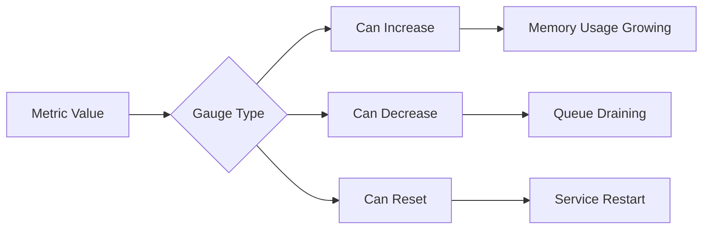
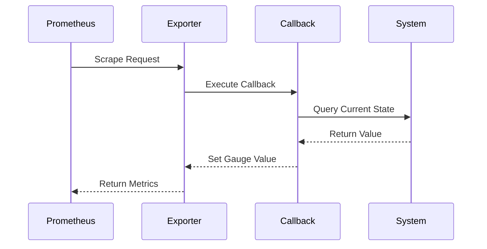
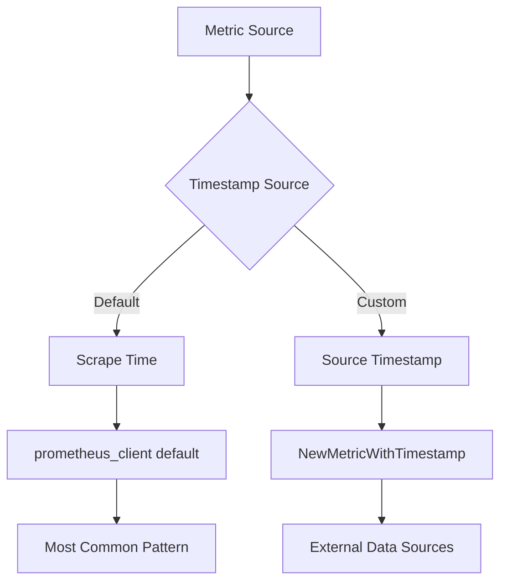
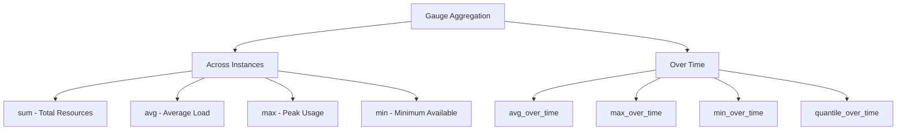
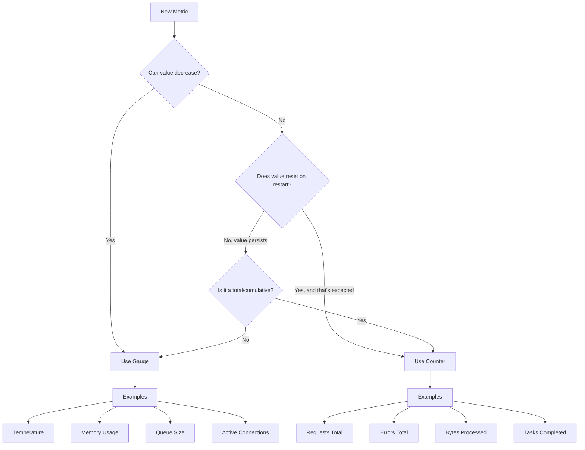

# How to Create Prometheus Gauge Patterns

Author: [nawazdhandala](https://github.com/nawazdhandala)

Tags: Prometheus, Gauge, Metrics, State

Description: Learn to implement Prometheus gauge metrics for current state values with timestamp handling, callback patterns, and aggregation strategies.

---

## Introduction

Prometheus gauges are one of the four core metric types and represent a single numerical value that can go up or down. Unlike counters that only increase, gauges are perfect for measuring current state values like temperature, memory usage, queue sizes, or the number of active connections.

In this post, we will explore gauge semantics, callback-based updates, aggregation strategies, and common patterns for effective state monitoring.

## Understanding Gauge Semantics

A gauge represents a snapshot of a current value at a specific point in time. The key characteristics of gauges are:

- **Values can increase or decrease** - Unlike counters, gauges can move in both directions
- **No rate calculations** - Gauges represent absolute values, not rates
- **Point-in-time snapshots** - Each scrape captures the current state
- **No monotonicity guarantees** - Values may reset or jump without special handling



## Basic Gauge Implementation

Let us start with basic gauge patterns in different languages.

### Python Example

```python
from prometheus_client import Gauge, start_http_server
import time
import random

# Create a gauge metric
active_connections = Gauge(
    'app_active_connections',
    'Number of currently active connections',
    ['service', 'endpoint']
)

# Set a specific value
active_connections.labels(service='api', endpoint='/users').set(42)

# Increment the value
active_connections.labels(service='api', endpoint='/users').inc()

# Decrement the value
active_connections.labels(service='api', endpoint='/users').dec()

# Increment or decrement by a specific amount
active_connections.labels(service='api', endpoint='/users').inc(5)
active_connections.labels(service='api', endpoint='/users').dec(3)
```

### Go Example

```go
package main

import (
    "github.com/prometheus/client_golang/prometheus"
    "github.com/prometheus/client_golang/prometheus/promauto"
)

var (
    activeConnections = promauto.NewGaugeVec(
        prometheus.GaugeOpts{
            Name: "app_active_connections",
            Help: "Number of currently active connections",
        },
        []string{"service", "endpoint"},
    )
)

func main() {
    // Set a specific value
    activeConnections.WithLabelValues("api", "/users").Set(42)

    // Increment the value
    activeConnections.WithLabelValues("api", "/users").Inc()

    // Decrement the value
    activeConnections.WithLabelValues("api", "/users").Dec()

    // Add or subtract specific amounts
    activeConnections.WithLabelValues("api", "/users").Add(5)
    activeConnections.WithLabelValues("api", "/users").Sub(3)
}
```

## Callback-Based Gauge Updates

One of the most powerful patterns for gauges is using callbacks to compute values at scrape time. This ensures metrics always reflect the current state without needing continuous updates.



### Python Callback Pattern

```python
from prometheus_client import Gauge
import psutil

# Method 1: Using set_function
memory_usage = Gauge(
    'system_memory_usage_bytes',
    'Current memory usage in bytes'
)
memory_usage.set_function(lambda: psutil.virtual_memory().used)

# Method 2: Using a callback class for more complex logic
class DatabaseConnectionGauge:
    def __init__(self, db_pool):
        self.db_pool = db_pool
        self.gauge = Gauge(
            'database_active_connections',
            'Number of active database connections',
            ['database']
        )

    def collect(self):
        # Called at scrape time
        for db_name, pool in self.db_pool.items():
            self.gauge.labels(database=db_name).set(pool.active_count())

# Method 3: Using the Gauge as a context manager for timing
request_in_progress = Gauge(
    'app_requests_in_progress',
    'Number of requests currently being processed'
)

def handle_request():
    with request_in_progress.track_inprogress():
        # Process the request
        process_request()
```

### Go Callback Pattern

```go
package main

import (
    "runtime"
    "github.com/prometheus/client_golang/prometheus"
)

// GaugeFunc executes a function at collect time
var memoryUsage = prometheus.NewGaugeFunc(
    prometheus.GaugeOpts{
        Name: "go_memory_heap_bytes",
        Help: "Current heap memory usage in bytes",
    },
    func() float64 {
        var m runtime.MemStats
        runtime.ReadMemStats(&m)
        return float64(m.HeapAlloc)
    },
)

func init() {
    prometheus.MustRegister(memoryUsage)
}

// For more complex scenarios, implement the Collector interface
type ConnectionPoolCollector struct {
    pool           *ConnectionPool
    activeDesc     *prometheus.Desc
    idleDesc       *prometheus.Desc
}

func NewConnectionPoolCollector(pool *ConnectionPool) *ConnectionPoolCollector {
    return &ConnectionPoolCollector{
        pool: pool,
        activeDesc: prometheus.NewDesc(
            "pool_active_connections",
            "Number of active connections",
            []string{"pool_name"},
            nil,
        ),
        idleDesc: prometheus.NewDesc(
            "pool_idle_connections",
            "Number of idle connections",
            []string{"pool_name"},
            nil,
        ),
    }
}

func (c *ConnectionPoolCollector) Describe(ch chan<- *prometheus.Desc) {
    ch <- c.activeDesc
    ch <- c.idleDesc
}

func (c *ConnectionPoolCollector) Collect(ch chan<- prometheus.Metric) {
    stats := c.pool.Stats()
    ch <- prometheus.MustNewConstMetric(
        c.activeDesc,
        prometheus.GaugeValue,
        float64(stats.ActiveConnections),
        c.pool.Name(),
    )
    ch <- prometheus.MustNewConstMetric(
        c.idleDesc,
        prometheus.GaugeValue,
        float64(stats.IdleConnections),
        c.pool.Name(),
    )
}
```

## Timestamp Handling

When dealing with gauges, timestamps become important for understanding when a value was observed. Prometheus assigns the scrape timestamp to all metrics by default, but sometimes you need to handle stale data or external timestamps.



### Handling Stale Data

```python
from prometheus_client import Gauge
import time

last_update_time = Gauge(
    'external_data_last_update_timestamp',
    'Unix timestamp of last successful data update'
)

external_value = Gauge(
    'external_data_value',
    'Value from external source'
)

def update_from_external_source():
    try:
        value = fetch_external_data()
        external_value.set(value)
        last_update_time.set(time.time())
    except Exception as e:
        # Do not update gauges on failure
        # The stale value indicates a problem
        log_error(e)
```

### Staleness Detection in PromQL

```promql
# Alert if data is older than 5 minutes
time() - external_data_last_update_timestamp > 300

# Only use values updated in the last minute
external_data_value and on() (time() - external_data_last_update_timestamp < 60)
```

## Aggregation Strategies

Gauges require careful consideration when aggregating across instances or time. Unlike counters where you can sum rates, gauge aggregation depends on your use case.



### Common Aggregation Patterns

```promql
# Sum across all instances - useful for total connections
sum(app_active_connections) by (service)

# Average across instances - useful for load distribution
avg(node_cpu_utilization) by (cluster)

# Maximum value - useful for capacity planning
max(container_memory_usage_bytes) by (pod)

# Minimum value - useful for finding bottlenecks
min(pool_available_connections) by (database)

# Average over time window - smooths out spikes
avg_over_time(app_active_connections[5m])

# Maximum over time - find peak usage
max_over_time(container_memory_usage_bytes[1h])

# Quantile over time - understand distribution
quantile_over_time(0.95, http_request_duration_seconds[1h])
```

## Common Gauge Patterns

### Pattern 1: Resource Utilization

Track resource usage as a percentage or absolute value.

```python
from prometheus_client import Gauge
import psutil

cpu_usage = Gauge(
    'system_cpu_usage_percent',
    'Current CPU usage percentage',
    ['cpu']
)

memory_usage_percent = Gauge(
    'system_memory_usage_percent',
    'Current memory usage percentage'
)

disk_usage = Gauge(
    'system_disk_usage_bytes',
    'Current disk usage in bytes',
    ['mount_point']
)

def collect_system_metrics():
    # CPU per core
    for i, percent in enumerate(psutil.cpu_percent(percpu=True)):
        cpu_usage.labels(cpu=f'cpu{i}').set(percent)

    # Memory
    mem = psutil.virtual_memory()
    memory_usage_percent.set(mem.percent)

    # Disk per mount point
    for partition in psutil.disk_partitions():
        usage = psutil.disk_usage(partition.mountpoint)
        disk_usage.labels(mount_point=partition.mountpoint).set(usage.used)
```

### Pattern 2: Queue Depth Monitoring

Track queue sizes and processing backlogs.

```python
from prometheus_client import Gauge

queue_size = Gauge(
    'message_queue_size',
    'Number of messages currently in queue',
    ['queue_name', 'priority']
)

queue_oldest_message_age = Gauge(
    'message_queue_oldest_message_age_seconds',
    'Age of the oldest message in the queue',
    ['queue_name']
)

class QueueMonitor:
    def __init__(self, queue_client):
        self.queue_client = queue_client

    def update_metrics(self):
        for queue in self.queue_client.list_queues():
            stats = self.queue_client.get_queue_stats(queue.name)

            # Track size by priority
            for priority, count in stats.messages_by_priority.items():
                queue_size.labels(
                    queue_name=queue.name,
                    priority=priority
                ).set(count)

            # Track oldest message age
            if stats.oldest_message_timestamp:
                age = time.time() - stats.oldest_message_timestamp
                queue_oldest_message_age.labels(
                    queue_name=queue.name
                ).set(age)
```

### Pattern 3: Connection Pool Status

Monitor connection pools with multiple state dimensions.

```go
package main

import (
    "github.com/prometheus/client_golang/prometheus"
    "github.com/prometheus/client_golang/prometheus/promauto"
)

var (
    poolConnections = promauto.NewGaugeVec(
        prometheus.GaugeOpts{
            Name: "db_pool_connections",
            Help: "Number of database connections by state",
        },
        []string{"pool", "state"},
    )

    poolUtilization = promauto.NewGaugeVec(
        prometheus.GaugeOpts{
            Name: "db_pool_utilization_ratio",
            Help: "Connection pool utilization ratio (0-1)",
        },
        []string{"pool"},
    )
)

func updatePoolMetrics(pool *DBPool) {
    stats := pool.Stats()

    poolConnections.WithLabelValues(pool.Name, "active").Set(float64(stats.Active))
    poolConnections.WithLabelValues(pool.Name, "idle").Set(float64(stats.Idle))
    poolConnections.WithLabelValues(pool.Name, "waiting").Set(float64(stats.Waiting))

    utilization := float64(stats.Active) / float64(stats.MaxConnections)
    poolUtilization.WithLabelValues(pool.Name).Set(utilization)
}
```

### Pattern 4: State Machine Metrics

Track the current state of a state machine or service status.

```python
from prometheus_client import Gauge, Enum

# Option 1: Using multiple gauges (better for PromQL)
service_state = Gauge(
    'service_state_info',
    'Current state of the service (1 = current state)',
    ['service', 'state']
)

def update_service_state(service_name, current_state):
    states = ['starting', 'running', 'degraded', 'stopping', 'stopped']
    for state in states:
        value = 1 if state == current_state else 0
        service_state.labels(service=service_name, state=state).set(value)

# Option 2: Using Enum type (simpler but limited PromQL support)
service_status = Enum(
    'service_status',
    'Current service status',
    ['service'],
    states=['starting', 'running', 'degraded', 'stopping', 'stopped']
)

service_status.labels(service='api').state('running')
```

### Pattern 5: Last Occurrence Timestamp

Track when something last happened.

```python
from prometheus_client import Gauge
import time

last_successful_backup = Gauge(
    'backup_last_success_timestamp_seconds',
    'Unix timestamp of last successful backup',
    ['database']
)

last_error_timestamp = Gauge(
    'app_last_error_timestamp_seconds',
    'Unix timestamp of last error occurrence',
    ['error_type']
)

def on_backup_complete(database):
    last_successful_backup.labels(database=database).set(time.time())

def on_error(error_type):
    last_error_timestamp.labels(error_type=error_type).set(time.time())
```

## Gauge vs Counter Decision Flow

Use this diagram to decide when to use a gauge versus a counter.



## Best Practices

1. **Use descriptive names** - Include the unit in the metric name (e.g., `_bytes`, `_seconds`, `_ratio`)

2. **Limit cardinality** - Avoid high-cardinality labels that could create too many time series

3. **Use callbacks for expensive operations** - Calculate values at scrape time rather than continuously

4. **Include a last-updated timestamp** - For data from external sources, track freshness separately

5. **Choose appropriate aggregation** - Document whether your gauge should be summed, averaged, or use max/min

6. **Handle missing data gracefully** - Decide whether to keep stale values or remove the metric entirely

```python
# Good: Clear naming with units
memory_usage_bytes = Gauge('app_memory_usage_bytes', 'Memory usage in bytes')

# Good: Bounded cardinality
request_queue_size = Gauge(
    'request_queue_size',
    'Number of requests in queue',
    ['priority']  # Limited set: high, medium, low
)

# Bad: Unbounded cardinality
request_queue_size_bad = Gauge(
    'request_queue_size',
    'Number of requests in queue',
    ['user_id']  # Could be millions of users
)
```

## Conclusion

Prometheus gauges are essential for monitoring current state values in your systems. By understanding gauge semantics, leveraging callback patterns for efficient updates, and applying appropriate aggregation strategies, you can build robust monitoring solutions that accurately reflect your system's state.

Key takeaways:
- Gauges represent point-in-time values that can go up or down
- Use callbacks to compute values at scrape time for accuracy and efficiency
- Choose aggregation functions based on what the metric represents
- Track timestamps separately when dealing with external data sources
- Follow naming conventions and keep label cardinality under control

With these patterns in your toolkit, you can effectively monitor everything from resource utilization to queue depths to service states in your Prometheus-based observability stack.
