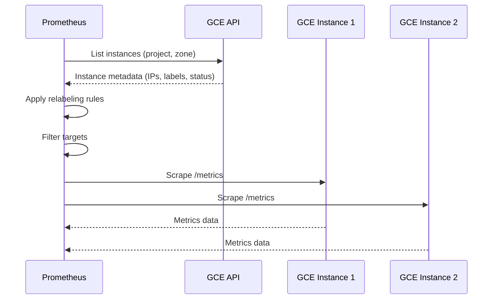
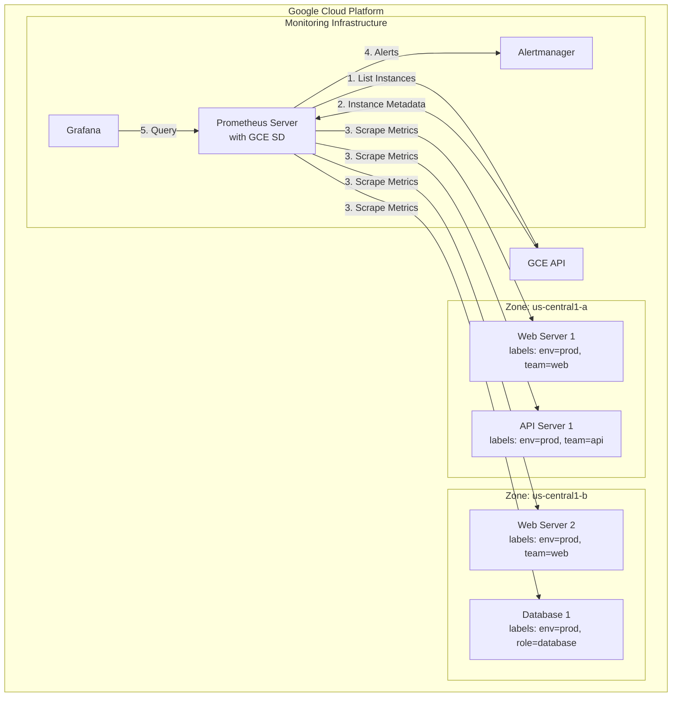

# How to Build Prometheus GCE SD (Google Cloud Service Discovery)

Author: [nawazdhandala](https://github.com/nawazdhandala)

Tags: Prometheus, GCP, Service Discovery, Monitoring

Description: A comprehensive guide to configuring Prometheus GCE Service Discovery for automatic target detection in Google Cloud Platform. Learn how to dynamically discover and monitor GCE instances without manual configuration.

Managing monitoring targets manually is like trying to keep track of grains of sand on a beach. In dynamic cloud environments where instances spin up and down constantly, static target lists become outdated the moment you save them. This is where Prometheus GCE Service Discovery (GCE SD) becomes essential.

GCE SD automatically discovers Google Compute Engine instances in your GCP projects and adds them as scrape targets. No more updating configuration files every time you scale. No more missing metrics from new instances. No more stale targets pointing to terminated VMs.

This guide walks you through everything you need to implement GCE SD in production, from basic setup to advanced filtering and security best practices.

## What is Prometheus Service Discovery?

Service Discovery in Prometheus is a mechanism that automatically finds and registers targets for metric scraping. Instead of maintaining static lists of IP addresses and ports, Prometheus queries external systems to discover what to monitor.

Prometheus supports multiple service discovery mechanisms:

- **GCE SD** - Google Compute Engine instances
- **EC2 SD** - AWS EC2 instances
- **Kubernetes SD** - Kubernetes pods, services, and endpoints
- **Consul SD** - Consul service catalog
- **DNS SD** - DNS SRV records
- **File SD** - JSON/YAML files for custom discovery

GCE SD specifically queries the Google Compute Engine API to enumerate VM instances, extracting metadata like instance names, zones, labels, and network configurations.

## How GCE Service Discovery Works

When you configure GCE SD, Prometheus periodically queries the GCE API to fetch instance information. Here is the flow:



Prometheus extracts several metadata labels from each discovered instance:

| Label | Description |
|-------|-------------|
| `__meta_gce_instance_name` | Instance name |
| `__meta_gce_instance_id` | Unique instance ID |
| `__meta_gce_project` | GCP project ID |
| `__meta_gce_zone` | Zone (e.g., us-central1-a) |
| `__meta_gce_network` | Network name |
| `__meta_gce_subnetwork` | Subnetwork name |
| `__meta_gce_private_ip` | Internal IP address |
| `__meta_gce_public_ip` | External IP (if assigned) |
| `__meta_gce_tags` | Comma-separated network tags |
| `__meta_gce_metadata_<key>` | Custom instance metadata |
| `__meta_gce_label_<key>` | Instance labels |
| `__meta_gce_machine_type` | Machine type URL |
| `__meta_gce_instance_status` | Instance status (RUNNING, STOPPED, etc.) |

These labels enable powerful filtering and relabeling to target exactly the instances you need.

## Prerequisites

Before configuring GCE SD, ensure you have:

1. **A GCP Project** with Compute Engine instances to monitor
2. **Prometheus installed** (version 2.0 or later recommended)
3. **GCP credentials** with appropriate permissions
4. **Network connectivity** between Prometheus and target instances

### Required IAM Permissions

The service account or credentials used by Prometheus need the following IAM role:

```
roles/compute.viewer
```

This role includes the `compute.instances.list` permission required to enumerate instances. For minimal permissions, create a custom role with just:

- `compute.instances.list`
- `compute.zones.list` (if discovering across all zones)

## Basic GCE SD Configuration

Here is a minimal Prometheus configuration for GCE Service Discovery:

```yaml
# prometheus.yml
global:
  scrape_interval: 15s
  evaluation_interval: 15s

scrape_configs:
  - job_name: 'gce-instances'
    gce_sd_configs:
      - project: my-gcp-project
        zone: us-central1-a
        port: 9100  # Node Exporter default port
```

This configuration discovers all GCE instances in the specified project and zone, then attempts to scrape metrics from port 9100 on each instance.

### Multi-Zone Discovery

To discover instances across multiple zones, add multiple `gce_sd_configs` entries:

```yaml
scrape_configs:
  - job_name: 'gce-instances'
    gce_sd_configs:
      - project: my-gcp-project
        zone: us-central1-a
        port: 9100
      - project: my-gcp-project
        zone: us-central1-b
        port: 9100
      - project: my-gcp-project
        zone: us-east1-b
        port: 9100
```

### Discovering All Zones in a Project

For automatic discovery across all zones, omit the `zone` parameter and use `zones` with a regex pattern, or iterate zones programmatically. A common approach is to use a wildcard zone configuration:

```yaml
scrape_configs:
  - job_name: 'gce-instances-all-zones'
    gce_sd_configs:
      - project: my-gcp-project
        port: 9100
        # When zone is omitted, Prometheus discovers instances in all zones
```

Note: Omitting the zone parameter causes Prometheus to query all zones, which increases API calls. Consider rate limiting implications for large deployments.

## Authentication Methods

Prometheus supports multiple authentication methods for GCE SD:

### 1. Default Application Credentials (Recommended for GCE)

When running Prometheus on a GCE instance, use the instance's service account:

```yaml
gce_sd_configs:
  - project: my-gcp-project
    zone: us-central1-a
    port: 9100
    # No credentials_file - uses instance metadata
```

Ensure the GCE instance running Prometheus has a service account with `compute.viewer` role attached.

### 2. Service Account Key File

For Prometheus running outside GCP or with a specific service account:

```yaml
gce_sd_configs:
  - project: my-gcp-project
    zone: us-central1-a
    port: 9100
    credentials_file: /etc/prometheus/gcp-credentials.json
```

Create and download a service account key:

```bash
# Create service account
gcloud iam service-accounts create prometheus-sd \
    --display-name="Prometheus Service Discovery"

# Grant compute viewer role
gcloud projects add-iam-policy-binding my-gcp-project \
    --member="serviceAccount:prometheus-sd@my-gcp-project.iam.gserviceaccount.com" \
    --role="roles/compute.viewer"

# Create and download key
gcloud iam service-accounts keys create /etc/prometheus/gcp-credentials.json \
    --iam-account=prometheus-sd@my-gcp-project.iam.gserviceaccount.com
```

### 3. Workload Identity (GKE)

When running Prometheus on GKE with Workload Identity:

```yaml
gce_sd_configs:
  - project: my-gcp-project
    zone: us-central1-a
    port: 9100
    # Uses Workload Identity automatically
```

Configure Workload Identity binding:

```bash
# Link Kubernetes service account to GCP service account
gcloud iam service-accounts add-iam-policy-binding \
    prometheus-sd@my-gcp-project.iam.gserviceaccount.com \
    --role="roles/iam.workloadIdentityUser" \
    --member="serviceAccount:my-gcp-project.svc.id.goog[monitoring/prometheus]"
```

## Relabeling for Target Filtering

Relabeling is where GCE SD becomes powerful. Use relabel_configs to filter targets and customize labels.

### Filter by Instance Labels

Only monitor instances with a specific GCP label:

```yaml
scrape_configs:
  - job_name: 'production-servers'
    gce_sd_configs:
      - project: my-gcp-project
        zone: us-central1-a
        port: 9100
    relabel_configs:
      # Only keep instances with label environment=production
      - source_labels: [__meta_gce_label_environment]
        regex: production
        action: keep
```

### Filter by Network Tags

Target instances with specific network tags:

```yaml
relabel_configs:
  # Keep only instances tagged with 'prometheus-target'
  - source_labels: [__meta_gce_tags]
    regex: '.*,prometheus-target,.*'
    action: keep
```

### Filter by Instance Status

Only scrape running instances (recommended):

```yaml
relabel_configs:
  - source_labels: [__meta_gce_instance_status]
    regex: RUNNING
    action: keep
```

### Combining Multiple Filters

```yaml
relabel_configs:
  # Must be running
  - source_labels: [__meta_gce_instance_status]
    regex: RUNNING
    action: keep

  # Must have environment label
  - source_labels: [__meta_gce_label_environment]
    regex: (production|staging)
    action: keep

  # Must have prometheus-target tag
  - source_labels: [__meta_gce_tags]
    regex: '.*,prometheus-target,.*'
    action: keep
```

## Customizing Target Labels

Beyond filtering, relabeling lets you customize the labels attached to scraped metrics.

### Setting the Instance Label

```yaml
relabel_configs:
  # Use instance name as the 'instance' label
  - source_labels: [__meta_gce_instance_name]
    target_label: instance

  # Preserve zone information
  - source_labels: [__meta_gce_zone]
    target_label: zone

  # Add environment from GCP label
  - source_labels: [__meta_gce_label_environment]
    target_label: environment
```

### Extracting Region from Zone

```yaml
relabel_configs:
  # Extract region (us-central1) from zone (us-central1-a)
  - source_labels: [__meta_gce_zone]
    regex: '([a-z]+-[a-z0-9]+)-[a-z]'
    target_label: region
    replacement: '${1}'
```

### Using Private vs Public IP

By default, Prometheus uses the private IP. To use public IP for scraping:

```yaml
relabel_configs:
  # Use public IP for scraping (useful for monitoring from outside GCP)
  - source_labels: [__meta_gce_public_ip]
    target_label: __address__
    replacement: '${1}:9100'
```

## Complete Production Configuration

Here is a comprehensive configuration suitable for production environments:

```yaml
# prometheus.yml
global:
  scrape_interval: 15s
  evaluation_interval: 15s
  external_labels:
    cluster: production
    region: us-central1

scrape_configs:
  # Node Exporter on all production instances
  - job_name: 'node-exporter'
    gce_sd_configs:
      - project: my-gcp-project
        port: 9100

    relabel_configs:
      # Only running instances
      - source_labels: [__meta_gce_instance_status]
        regex: RUNNING
        action: keep

      # Only production environment
      - source_labels: [__meta_gce_label_environment]
        regex: production
        action: keep

      # Set instance name
      - source_labels: [__meta_gce_instance_name]
        target_label: instance

      # Set zone
      - source_labels: [__meta_gce_zone]
        target_label: zone

      # Extract region
      - source_labels: [__meta_gce_zone]
        regex: '([a-z]+-[a-z0-9]+)-[a-z]'
        target_label: region
        replacement: '${1}'

      # Add team from GCP label
      - source_labels: [__meta_gce_label_team]
        target_label: team

      # Add service from GCP label
      - source_labels: [__meta_gce_label_service]
        target_label: service

  # Application metrics on specific tagged instances
  - job_name: 'app-metrics'
    gce_sd_configs:
      - project: my-gcp-project
        port: 8080

    metrics_path: /actuator/prometheus

    relabel_configs:
      - source_labels: [__meta_gce_instance_status]
        regex: RUNNING
        action: keep

      - source_labels: [__meta_gce_tags]
        regex: '.*,app-metrics,.*'
        action: keep

      - source_labels: [__meta_gce_instance_name]
        target_label: instance

      - source_labels: [__meta_gce_label_service]
        target_label: service

  # Database instances with custom port
  - job_name: 'database-exporters'
    gce_sd_configs:
      - project: my-gcp-project
        port: 9187  # PostgreSQL exporter port

    relabel_configs:
      - source_labels: [__meta_gce_instance_status]
        regex: RUNNING
        action: keep

      - source_labels: [__meta_gce_label_role]
        regex: database
        action: keep

      - source_labels: [__meta_gce_instance_name]
        target_label: instance

      - source_labels: [__meta_gce_label_database_type]
        target_label: db_type
```

## Architecture Overview

Here is how GCE SD fits into a typical monitoring architecture:



## Setting Up Node Exporter on GCE Instances

For GCE SD to be useful, your instances need to expose metrics. Here is how to install Node Exporter:

### Using a Startup Script

Add this startup script to your instance template or individual instances:

```bash
#!/bin/bash
# install-node-exporter.sh

NODE_EXPORTER_VERSION="1.7.0"

# Create user
useradd --no-create-home --shell /bin/false node_exporter

# Download and install
cd /tmp
wget https://github.com/prometheus/node_exporter/releases/download/v${NODE_EXPORTER_VERSION}/node_exporter-${NODE_EXPORTER_VERSION}.linux-amd64.tar.gz
tar xzf node_exporter-${NODE_EXPORTER_VERSION}.linux-amd64.tar.gz
cp node_exporter-${NODE_EXPORTER_VERSION}.linux-amd64/node_exporter /usr/local/bin/
chown node_exporter:node_exporter /usr/local/bin/node_exporter

# Create systemd service
cat > /etc/systemd/system/node_exporter.service << EOF
[Unit]
Description=Node Exporter
Wants=network-online.target
After=network-online.target

[Service]
User=node_exporter
Group=node_exporter
Type=simple
ExecStart=/usr/local/bin/node_exporter

[Install]
WantedBy=multi-user.target
EOF

# Start service
systemctl daemon-reload
systemctl enable node_exporter
systemctl start node_exporter
```

### Using Terraform

Automate instance creation with Node Exporter:

```hcl
# main.tf

resource "google_compute_instance" "web_server" {
  name         = "web-server-1"
  machine_type = "e2-medium"
  zone         = "us-central1-a"

  boot_disk {
    initialize_params {
      image = "debian-cloud/debian-11"
    }
  }

  network_interface {
    network = "default"
    access_config {}
  }

  # Labels for Prometheus discovery
  labels = {
    environment = "production"
    team        = "web"
    service     = "frontend"
  }

  # Network tags for filtering
  tags = ["prometheus-target", "http-server"]

  # Startup script to install Node Exporter
  metadata_startup_script = file("${path.module}/install-node-exporter.sh")

  service_account {
    scopes = ["cloud-platform"]
  }
}

# Firewall rule for Prometheus scraping
resource "google_compute_firewall" "prometheus_scrape" {
  name    = "allow-prometheus-scrape"
  network = "default"

  allow {
    protocol = "tcp"
    ports    = ["9100"]
  }

  # Only allow from Prometheus server
  source_tags = ["prometheus-server"]
  target_tags = ["prometheus-target"]
}
```

## Firewall Configuration

Prometheus needs network access to scrape targets. Configure firewall rules appropriately:

### Using gcloud

```bash
# Allow Prometheus to scrape Node Exporter (port 9100)
gcloud compute firewall-rules create allow-prometheus-scrape \
    --direction=INGRESS \
    --priority=1000 \
    --network=default \
    --action=ALLOW \
    --rules=tcp:9100 \
    --source-tags=prometheus-server \
    --target-tags=prometheus-target

# If using application metrics on port 8080
gcloud compute firewall-rules create allow-prometheus-app-metrics \
    --direction=INGRESS \
    --priority=1000 \
    --network=default \
    --action=ALLOW \
    --rules=tcp:8080 \
    --source-tags=prometheus-server \
    --target-tags=app-metrics
```

### Security Best Practices

1. **Use network tags** to restrict which instances Prometheus can scrape
2. **Use source tags** to allow only the Prometheus server
3. **Never expose metrics ports to the internet** (0.0.0.0/0)
4. **Consider using internal load balancers** for multi-region setups

## Troubleshooting Common Issues

### Targets Not Appearing

Check the following:

1. **Verify API permissions**:
```bash
gcloud compute instances list --project=my-gcp-project
```
If this fails, the service account lacks permissions.

2. **Check Prometheus logs**:
```bash
journalctl -u prometheus | grep -i gce
```

3. **Verify network connectivity**:
```bash
# From Prometheus server
curl -v http://<target-ip>:9100/metrics
```

4. **Check firewall rules**:
```bash
gcloud compute firewall-rules list --filter="name~prometheus"
```

### Targets Appear but Scraping Fails

1. **Verify the exporter is running**:
```bash
# On target instance
systemctl status node_exporter
curl localhost:9100/metrics
```

2. **Check the metrics path**:
Ensure `metrics_path` in your config matches the exporter's endpoint.

3. **Verify port configuration**:
The `port` in `gce_sd_configs` must match the exporter's listening port.

### High API Usage

If you are hitting GCE API rate limits:

1. **Increase refresh interval**:
```yaml
gce_sd_configs:
  - project: my-gcp-project
    zone: us-central1-a
    port: 9100
    refresh_interval: 60s  # Default is 60s, increase if needed
```

2. **Use specific zones** instead of discovering all zones

3. **Implement caching** with a sidecar proxy for very large deployments

## Monitoring Prometheus Itself

Do not forget to monitor your monitoring system:

```yaml
scrape_configs:
  # Prometheus self-monitoring
  - job_name: 'prometheus'
    static_configs:
      - targets: ['localhost:9090']

    # Track GCE SD specific metrics
    # prometheus_sd_gce_refresh_duration_seconds
    # prometheus_sd_gce_refresh_failures_total
```

Key metrics to watch:

| Metric | Description |
|--------|-------------|
| `prometheus_sd_gce_refresh_duration_seconds` | Time taken to refresh GCE targets |
| `prometheus_sd_gce_refresh_failures_total` | Number of failed refreshes |
| `prometheus_target_scrape_pool_targets` | Number of targets in each job |
| `up` | Whether targets are reachable |

## Integration with OneUptime

Once you have Prometheus collecting metrics from your GCE instances, you can forward them to OneUptime for unified observability:

```yaml
# prometheus.yml
remote_write:
  - url: https://oneuptime.com/api/prometheus/write
    bearer_token: YOUR_ONEUPTIME_TOKEN
```

This gives you:
- Centralized metric storage with long-term retention
- Unified alerting across metrics, logs, and traces
- Pre-built dashboards for infrastructure monitoring
- Incident management integration

## Summary

Prometheus GCE Service Discovery eliminates the operational burden of maintaining static target lists. By leveraging GCP's instance metadata and labels, you can build a self-maintaining monitoring system that scales with your infrastructure.

Key takeaways:

1. **Use instance labels** for logical grouping (environment, team, service)
2. **Use network tags** for security-based filtering
3. **Always filter by instance status** to avoid scraping terminated instances
4. **Implement proper IAM** with minimal required permissions
5. **Configure firewall rules** to restrict metrics access
6. **Monitor your service discovery** to catch API issues early

The combination of GCE SD with proper relabeling transforms Prometheus from a static scraper into a dynamic, cloud-native monitoring solution that adapts to your infrastructure automatically.

---

**Related Reading:**

- [SRE Metrics to Track](https://oneuptime.com/blog/post/2025-11-28-sre-metrics-to-track/view)
- [Monitoring vs Observability in SRE](https://oneuptime.com/blog/post/2025-11-28-monitoring-vs-observability-sre/view)
- [What is OpenTelemetry Collector and Why Use One](https://oneuptime.com/blog/post/2025-09-18-what-is-opentelemetry-collector-and-why-use-one/view)
