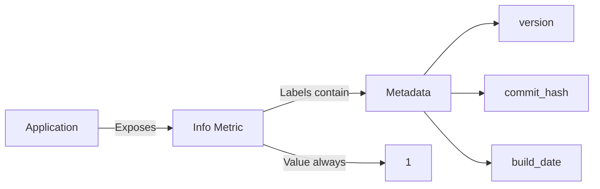
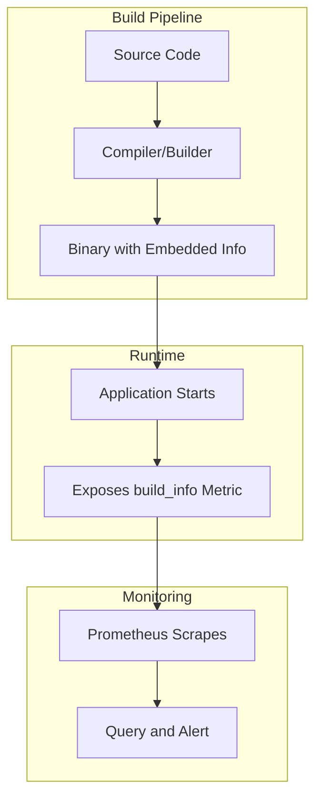
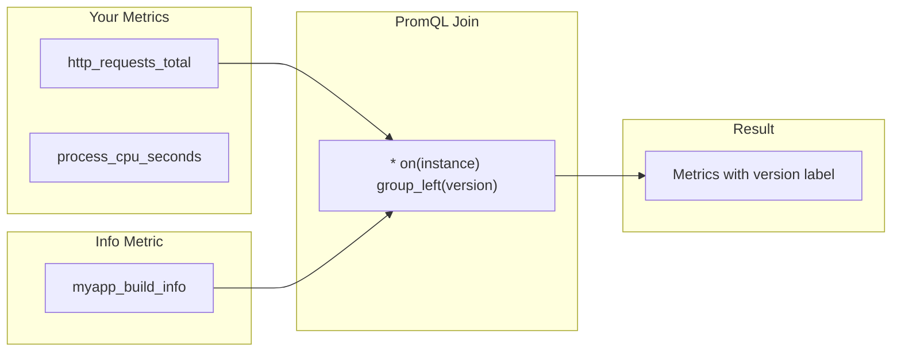
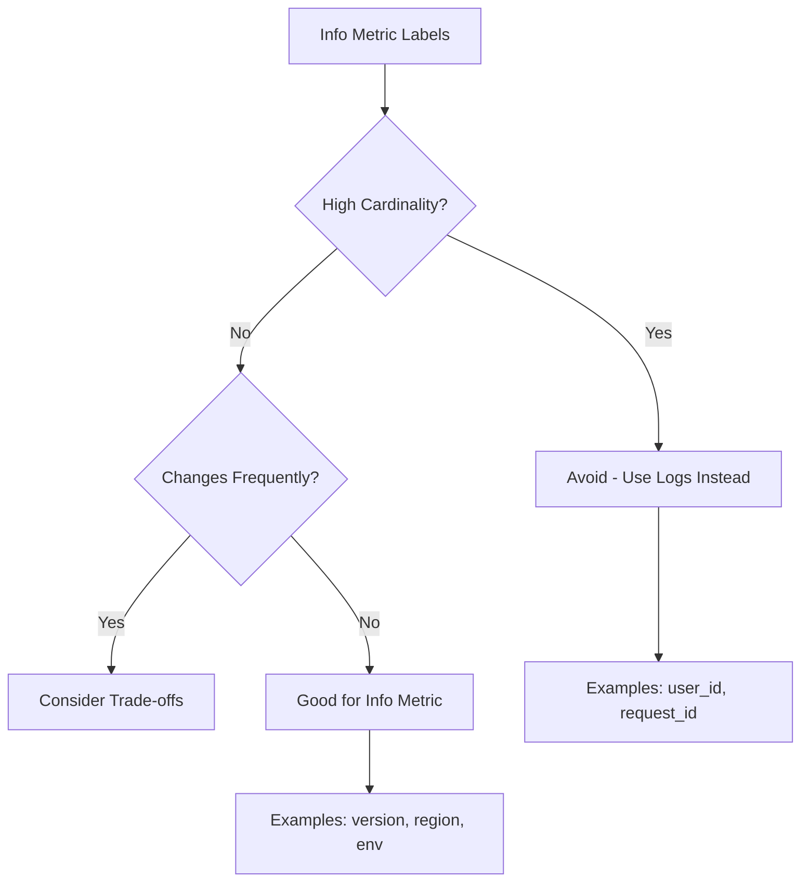

# How to Build Prometheus Info Metrics

Author: [nawazdhandala](https://github.com/nawazdhandala)

Tags: Prometheus, Info Metrics, Metadata, Labels

Description: Learn to implement Prometheus info metrics for exposing metadata with label-based information and build/version tracking patterns.

---

## Introduction

Prometheus is designed to collect numerical time-series data, but what about metadata like version strings, build information, or configuration details? This is where **info metrics** come in. Info metrics are a powerful pattern that allows you to expose textual metadata as Prometheus metrics while maintaining the numerical format that Prometheus requires.

In this guide, you will learn how to build and use Prometheus info metrics effectively, including practical patterns for version tracking, build information, and joining metadata with other metrics.

## What Are Info Metrics?

Info metrics are Prometheus metrics with a constant value of `1` that carry metadata through their labels. Since Prometheus only supports numerical values, info metrics use labels to store string-based information while the metric value itself remains fixed at `1`.



### The Info Metric Pattern

The naming convention for info metrics follows the pattern: `<metric_name>_info`. For example:

- `app_info` - Application metadata
- `build_info` - Build and compilation details
- `node_info` - Node or instance metadata

## Building Your First Info Metric

Let us start with a basic example using the Prometheus client library in Go.

### Go Implementation

```go
package main

import (
    "net/http"

    "github.com/prometheus/client_golang/prometheus"
    "github.com/prometheus/client_golang/prometheus/promhttp"
)

var (
    // Define version variables - typically set at build time
    Version   = "1.0.0"
    Commit    = "abc123def"
    BuildDate = "2026-01-30"
    GoVersion = "go1.21.0"
)

func main() {
    // Create the info metric
    buildInfo := prometheus.NewGaugeVec(
        prometheus.GaugeOpts{
            Name: "myapp_build_info",
            Help: "Build information about the application",
        },
        []string{"version", "commit", "build_date", "go_version"},
    )

    // Register the metric
    prometheus.MustRegister(buildInfo)

    // Set the value to 1 with our metadata labels
    buildInfo.WithLabelValues(Version, Commit, BuildDate, GoVersion).Set(1)

    // Expose metrics endpoint
    http.Handle("/metrics", promhttp.Handler())
    http.ListenAndServe(":8080", nil)
}
```

### Python Implementation

```python
from prometheus_client import Gauge, start_http_server
import time

# Define version information
VERSION = "1.0.0"
COMMIT = "abc123def"
BUILD_DATE = "2026-01-30"

# Create info metric with labels
build_info = Gauge(
    'myapp_build_info',
    'Build information about the application',
    ['version', 'commit', 'build_date']
)

# Set the metric value to 1 with metadata labels
build_info.labels(
    version=VERSION,
    commit=COMMIT,
    build_date=BUILD_DATE
).set(1)

if __name__ == '__main__':
    start_http_server(8080)
    while True:
        time.sleep(1)
```

### Resulting Metric Output

When you scrape the `/metrics` endpoint, you will see:

```
# HELP myapp_build_info Build information about the application
# TYPE myapp_build_info gauge
myapp_build_info{version="1.0.0",commit="abc123def",build_date="2026-01-30"} 1
```

## Build Info Pattern in Detail

The build info pattern is one of the most common uses of info metrics. It allows you to track which version of your application is running across your infrastructure.



### Setting Build Info at Compile Time

In Go, you can inject build information at compile time using `-ldflags`:

```go
// main.go
package main

var (
    Version   = "dev"
    Commit    = "unknown"
    BuildDate = "unknown"
)
```

Build with:

```bash
go build -ldflags "-X main.Version=1.2.3 \
                   -X main.Commit=$(git rev-parse HEAD) \
                   -X main.BuildDate=$(date -u +%Y-%m-%dT%H:%M:%SZ)" \
         -o myapp
```

### Complete Build Info Example

```go
package main

import (
    "net/http"
    "runtime"

    "github.com/prometheus/client_golang/prometheus"
    "github.com/prometheus/client_golang/prometheus/promauto"
    "github.com/prometheus/client_golang/prometheus/promhttp"
)

var (
    Version   = "dev"
    Commit    = "unknown"
    BuildDate = "unknown"
    Branch    = "unknown"
)

// Using promauto for automatic registration
var buildInfo = promauto.NewGaugeVec(
    prometheus.GaugeOpts{
        Namespace: "myapp",
        Name:      "build_info",
        Help:      "A metric with constant value 1 labeled with build information",
    },
    []string{"version", "commit", "build_date", "branch", "go_version"},
)

func init() {
    buildInfo.WithLabelValues(
        Version,
        Commit,
        BuildDate,
        Branch,
        runtime.Version(),
    ).Set(1)
}

func main() {
    http.Handle("/metrics", promhttp.Handler())
    http.ListenAndServe(":8080", nil)
}
```

## Version Tracking with Info Metrics

Info metrics excel at version tracking across distributed systems. Here is how to track versions effectively.

### Multi-Component Version Tracking

```go
package main

import (
    "github.com/prometheus/client_golang/prometheus"
    "github.com/prometheus/client_golang/prometheus/promauto"
)

// Track multiple components
var componentInfo = promauto.NewGaugeVec(
    prometheus.GaugeOpts{
        Namespace: "myapp",
        Name:      "component_info",
        Help:      "Information about application components",
    },
    []string{"component", "version", "status"},
)

func registerComponents() {
    // Database driver
    componentInfo.WithLabelValues("postgres_driver", "v1.10.9", "active").Set(1)

    // Cache client
    componentInfo.WithLabelValues("redis_client", "v9.0.0", "active").Set(1)

    // HTTP router
    componentInfo.WithLabelValues("http_router", "v1.8.0", "active").Set(1)
}
```

### Querying Version Information

With PromQL, you can query which versions are deployed:

```promql
# Find all running versions
myapp_build_info

# Find instances running a specific version
myapp_build_info{version="1.0.0"}

# Count instances by version
count by (version) (myapp_build_info)

# Find instances NOT running the latest version
myapp_build_info{version!="2.0.0"}
```

## Joining Info Metrics with Other Metrics

One of the most powerful features of info metrics is the ability to join them with other metrics using PromQL. This allows you to add metadata labels to any metric.



### The group_left Join Pattern

```promql
# Add version label to request rate
sum by (instance, version) (
  rate(http_requests_total[5m])
  * on(instance) group_left(version)
  myapp_build_info
)
```

### Practical Example: Version-Aware Alerting

```yaml
# Alert on high error rate, include version in alert
groups:
  - name: application
    rules:
      - alert: HighErrorRate
        expr: |
          sum by (instance, version) (
            rate(http_requests_total{status=~"5.."}[5m])
            * on(instance) group_left(version)
            myapp_build_info
          )
          /
          sum by (instance, version) (
            rate(http_requests_total[5m])
            * on(instance) group_left(version)
            myapp_build_info
          ) > 0.05
        for: 5m
        labels:
          severity: critical
        annotations:
          summary: "High error rate on {{ $labels.instance }}"
          description: "Instance {{ $labels.instance }} running version {{ $labels.version }} has error rate above 5%"
```

## Advanced Info Metric Patterns

### Dynamic Configuration Info

Track runtime configuration that might change:

```go
package main

import (
    "sync"

    "github.com/prometheus/client_golang/prometheus"
    "github.com/prometheus/client_golang/prometheus/promauto"
)

var (
    configInfo = promauto.NewGaugeVec(
        prometheus.GaugeOpts{
            Namespace: "myapp",
            Name:      "config_info",
            Help:      "Current configuration information",
        },
        []string{"config_file", "log_level", "feature_flags"},
    )

    configMutex sync.Mutex
    currentLabels []string
)

func updateConfigInfo(configFile, logLevel, featureFlags string) {
    configMutex.Lock()
    defer configMutex.Unlock()

    // Reset previous value if exists
    if currentLabels != nil {
        configInfo.DeleteLabelValues(currentLabels...)
    }

    // Set new configuration
    currentLabels = []string{configFile, logLevel, featureFlags}
    configInfo.WithLabelValues(currentLabels...).Set(1)
}
```

### Environment Info

```go
var envInfo = promauto.NewGaugeVec(
    prometheus.GaugeOpts{
        Namespace: "myapp",
        Name:      "environment_info",
        Help:      "Environment information",
    },
    []string{"environment", "region", "availability_zone", "cluster"},
)

func init() {
    envInfo.WithLabelValues(
        getEnvOrDefault("ENVIRONMENT", "development"),
        getEnvOrDefault("REGION", "us-east-1"),
        getEnvOrDefault("AZ", "us-east-1a"),
        getEnvOrDefault("CLUSTER", "default"),
    ).Set(1)
}

func getEnvOrDefault(key, defaultVal string) string {
    if val := os.Getenv(key); val != "" {
        return val
    }
    return defaultVal
}
```

### Feature Flag Info

```go
var featureFlagInfo = promauto.NewGaugeVec(
    prometheus.GaugeOpts{
        Namespace: "myapp",
        Name:      "feature_flag_info",
        Help:      "Feature flag status - value 1 means enabled, 0 means disabled",
    },
    []string{"flag_name", "flag_variant"},
)

func setFeatureFlag(name, variant string, enabled bool) {
    value := 0.0
    if enabled {
        value = 1.0
    }
    featureFlagInfo.WithLabelValues(name, variant).Set(value)
}
```

## Best Practices

### Label Cardinality



**Do:**
- Use labels for low-cardinality metadata (version, environment, region)
- Keep label values stable and predictable
- Use consistent naming conventions

**Avoid:**
- High-cardinality labels (user IDs, timestamps, unique identifiers)
- Frequently changing label values
- Too many labels per metric

### Naming Conventions

```go
// Good naming examples
myapp_build_info        // Build and version information
myapp_config_info       // Configuration metadata
myapp_environment_info  // Environment context

// Always use _info suffix for info metrics
// Use namespace prefix (myapp_) for your application
```

### Memory and Performance

Info metrics have minimal overhead since they are typically set once at startup. However, be mindful of:

1. **Label count**: Each unique label combination creates a new time series
2. **Update frequency**: Avoid frequent updates to info metrics
3. **Cleanup**: Remove old label combinations when values change

```go
// Example: Cleaning up old labels
func updateInfo(oldLabels, newLabels []string) {
    // Delete old time series
    infoMetric.DeleteLabelValues(oldLabels...)

    // Create new time series
    infoMetric.WithLabelValues(newLabels...).Set(1)
}
```

## Complete Working Example

Here is a full application demonstrating all the concepts:

```go
package main

import (
    "log"
    "net/http"
    "os"
    "runtime"

    "github.com/prometheus/client_golang/prometheus"
    "github.com/prometheus/client_golang/prometheus/promauto"
    "github.com/prometheus/client_golang/prometheus/promhttp"
)

var (
    // Build-time variables
    Version   = "1.0.0"
    Commit    = "abc123"
    BuildDate = "2026-01-30"
    Branch    = "main"
)

var (
    // Build info metric
    buildInfo = promauto.NewGaugeVec(
        prometheus.GaugeOpts{
            Namespace: "myapp",
            Name:      "build_info",
            Help:      "Build information with version, commit, and build date",
        },
        []string{"version", "commit", "build_date", "branch", "go_version"},
    )

    // Environment info metric
    envInfo = promauto.NewGaugeVec(
        prometheus.GaugeOpts{
            Namespace: "myapp",
            Name:      "environment_info",
            Help:      "Environment and deployment information",
        },
        []string{"environment", "region", "instance_type"},
    )

    // Dependencies info metric
    depsInfo = promauto.NewGaugeVec(
        prometheus.GaugeOpts{
            Namespace: "myapp",
            Name:      "dependency_info",
            Help:      "Dependency versions",
        },
        []string{"name", "version", "type"},
    )

    // Sample application metric to demonstrate joining
    httpRequests = promauto.NewCounterVec(
        prometheus.CounterOpts{
            Namespace: "myapp",
            Name:      "http_requests_total",
            Help:      "Total HTTP requests",
        },
        []string{"method", "path", "status"},
    )
)

func initMetrics() {
    // Set build info
    buildInfo.WithLabelValues(
        Version,
        Commit,
        BuildDate,
        Branch,
        runtime.Version(),
    ).Set(1)

    // Set environment info
    envInfo.WithLabelValues(
        getEnv("ENVIRONMENT", "development"),
        getEnv("REGION", "us-east-1"),
        getEnv("INSTANCE_TYPE", "t3.medium"),
    ).Set(1)

    // Set dependency info
    depsInfo.WithLabelValues("prometheus_client", "v1.17.0", "library").Set(1)
    depsInfo.WithLabelValues("postgresql", "15.4", "database").Set(1)
    depsInfo.WithLabelValues("redis", "7.2", "cache").Set(1)
}

func getEnv(key, defaultVal string) string {
    if val := os.Getenv(key); val != "" {
        return val
    }
    return defaultVal
}

func handler(w http.ResponseWriter, r *http.Request) {
    httpRequests.WithLabelValues(r.Method, r.URL.Path, "200").Inc()
    w.Write([]byte("Hello, World!"))
}

func main() {
    initMetrics()

    http.HandleFunc("/", handler)
    http.Handle("/metrics", promhttp.Handler())

    log.Printf("Starting server on :8080 (version: %s)", Version)
    log.Fatal(http.ListenAndServe(":8080", nil))
}
```

## Useful PromQL Queries

```promql
# List all versions currently running
group by (version) (myapp_build_info)

# Count instances per version
count by (version) (myapp_build_info)

# Find instances running old versions (not v2.0.0)
myapp_build_info{version!="2.0.0"}

# Join build info with request metrics
sum by (version) (
  rate(myapp_http_requests_total[5m])
  * on(instance) group_left(version)
  myapp_build_info
)

# Get all metadata for a specific instance
{__name__=~"myapp_.*_info", instance="myapp-1:8080"}

# Check for version drift across environments
count by (environment, version) (
  myapp_build_info
  * on(instance) group_left(environment)
  myapp_environment_info
)
```

## Conclusion

Prometheus info metrics are a simple yet powerful pattern for exposing metadata in a way that integrates seamlessly with your existing monitoring infrastructure. By using a constant value of `1` and encoding information in labels, you can:

- Track build versions and deployment metadata across your infrastructure
- Join metadata with other metrics using PromQL for richer insights
- Create version-aware alerts and dashboards
- Maintain visibility into your application's runtime context

Start by implementing `build_info` for your applications, then expand to cover environment information, feature flags, and other metadata as needed. The patterns shown in this guide will help you build a robust observability foundation for your systems.

## Further Reading

- [Prometheus Documentation - Metric Types](https://prometheus.io/docs/concepts/metric_types/)
- [Prometheus Best Practices - Naming](https://prometheus.io/docs/practices/naming/)
- [PromQL Joins and group_left](https://prometheus.io/docs/prometheus/latest/querying/operators/)
