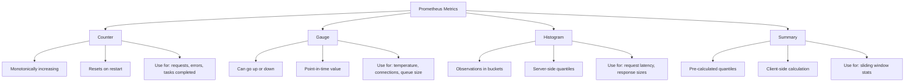
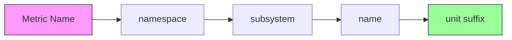

# How to Implement Prometheus Instrumentation Libraries

Author: [nawazdhandala](https://github.com/nawazdhandala)

Tags: Prometheus, Monitoring, Observability, DevOps

Description: A practical guide to implementing Prometheus instrumentation libraries across different programming languages for effective metrics collection and monitoring.

---

Prometheus has become the de facto standard for metrics collection in cloud-native environments. While Prometheus excels at scraping metrics from endpoints, your applications need to expose those metrics first. That is where instrumentation libraries come in. They provide the tools to define, collect, and expose metrics that Prometheus can then scrape.

This guide walks you through implementing Prometheus instrumentation across multiple languages, covering metric types, best practices, and real-world patterns that help you build observable systems.

## Understanding Prometheus Metric Types

Before writing code, you need to understand the four core metric types Prometheus supports. Each type serves a specific purpose and choosing the right one is crucial for meaningful metrics.



| Metric Type | Behavior | Best Used For | Example |
|-------------|----------|---------------|---------|
| Counter | Only increases (resets on restart) | Total requests, errors, bytes processed | `http_requests_total` |
| Gauge | Can increase or decrease | Current connections, temperature, queue depth | `db_connections_active` |
| Histogram | Counts observations in buckets | Request latency, response sizes | `http_request_duration_seconds` |
| Summary | Calculates quantiles client-side | Sliding window percentiles | `rpc_duration_seconds` |

## Python Implementation

Python applications can use the official `prometheus_client` library. It works seamlessly with frameworks like Flask, FastAPI, and Django.

### Installation and Basic Setup

Install the prometheus client library using pip.

```bash
pip install prometheus-client
```

### Defining Metrics

Create a metrics module that defines all your application metrics in one place. This keeps metric definitions consistent and makes them easy to find.

```python
# metrics.py
from prometheus_client import Counter, Gauge, Histogram, Summary, Info

# Counter: Track total number of HTTP requests
# Labels allow you to slice the metric by method, endpoint, and status
http_requests_total = Counter(
    'http_requests_total',
    'Total number of HTTP requests',
    ['method', 'endpoint', 'status']
)

# Gauge: Track current number of active connections
# Gauges can go up and down, perfect for connection pools
active_connections = Gauge(
    'db_connections_active',
    'Number of active database connections',
    ['database']
)

# Histogram: Track request latency distribution
# Default buckets: .005, .01, .025, .05, .075, .1, .25, .5, .75, 1.0, 2.5, 5.0, 7.5, 10.0
# Custom buckets optimized for typical web request latencies
request_latency = Histogram(
    'http_request_duration_seconds',
    'HTTP request latency in seconds',
    ['method', 'endpoint'],
    buckets=[0.01, 0.025, 0.05, 0.1, 0.25, 0.5, 1.0, 2.5, 5.0, 10.0]
)

# Summary: Calculate quantiles for RPC calls
# Quantiles are calculated on the client side over a sliding time window
rpc_duration = Summary(
    'rpc_duration_seconds',
    'RPC call duration in seconds',
    ['service', 'method']
)

# Info: Static information about the application
# Useful for joining with other metrics to add context
app_info = Info(
    'app',
    'Application information'
)
app_info.info({
    'version': '1.2.3',
    'environment': 'production'
})
```

### Flask Integration

Integrate Prometheus metrics into a Flask application with middleware that tracks every request.

```python
# app.py
import time
from functools import wraps
from flask import Flask, request, Response
from prometheus_client import generate_latest, CONTENT_TYPE_LATEST
from metrics import http_requests_total, request_latency, active_connections

app = Flask(__name__)

def track_requests(f):
    """
    Decorator that tracks request count and latency for any route.
    Wraps the route function to measure execution time and record metrics.
    """
    @wraps(f)
    def decorated_function(*args, **kwargs):
        # Record the start time before processing
        start_time = time.time()

        # Execute the actual route handler
        response = f(*args, **kwargs)

        # Calculate how long the request took
        latency = time.time() - start_time

        # Extract status code from response
        # Flask responses can be tuples (body, status) or Response objects
        status = response[1] if isinstance(response, tuple) else 200

        # Record metrics with appropriate labels
        # Labels must match the order defined in the metric
        http_requests_total.labels(
            method=request.method,
            endpoint=request.endpoint,
            status=status
        ).inc()

        request_latency.labels(
            method=request.method,
            endpoint=request.endpoint
        ).observe(latency)

        return response
    return decorated_function

@app.route('/metrics')
def metrics():
    """
    Expose metrics endpoint for Prometheus to scrape.
    Returns all registered metrics in Prometheus text format.
    """
    return Response(generate_latest(), mimetype=CONTENT_TYPE_LATEST)

@app.route('/api/users')
@track_requests
def get_users():
    # Simulate database work
    active_connections.labels(database='users_db').inc()
    try:
        # Your actual database logic here
        time.sleep(0.1)  # Simulating DB query
        return {'users': []}, 200
    finally:
        # Always decrement, even if an error occurs
        active_connections.labels(database='users_db').dec()

@app.route('/api/orders', methods=['POST'])
@track_requests
def create_order():
    # Process order creation
    return {'order_id': '12345'}, 201

if __name__ == '__main__':
    app.run(port=8000)
```

### FastAPI Integration

FastAPI applications can use middleware for automatic request tracking.

```python
# main.py
import time
from fastapi import FastAPI, Request, Response
from prometheus_client import generate_latest, CONTENT_TYPE_LATEST
from starlette.middleware.base import BaseHTTPMiddleware
from metrics import http_requests_total, request_latency

app = FastAPI()

class PrometheusMiddleware(BaseHTTPMiddleware):
    """
    Middleware that automatically tracks metrics for all requests.
    This approach is cleaner than decorating every route manually.
    """

    async def dispatch(self, request: Request, call_next):
        # Skip metrics endpoint to avoid recursion
        if request.url.path == '/metrics':
            return await call_next(request)

        start_time = time.time()

        # Process the request through the application
        response = await call_next(request)

        # Calculate latency after response is generated
        latency = time.time() - start_time

        # Normalize the path to avoid high cardinality
        # Replace dynamic segments like /users/123 with /users/{id}
        path = request.url.path
        for route in app.routes:
            if hasattr(route, 'path') and route.path_regex.match(path):
                path = route.path
                break

        # Record the metrics
        http_requests_total.labels(
            method=request.method,
            endpoint=path,
            status=response.status_code
        ).inc()

        request_latency.labels(
            method=request.method,
            endpoint=path
        ).observe(latency)

        return response

# Add the middleware to the application
app.add_middleware(PrometheusMiddleware)

@app.get('/metrics')
async def metrics():
    """Prometheus metrics endpoint."""
    return Response(
        content=generate_latest(),
        media_type=CONTENT_TYPE_LATEST
    )

@app.get('/api/health')
async def health():
    return {'status': 'healthy'}
```

## Node.js Implementation

Node.js applications use the `prom-client` library, which is the official Prometheus client for JavaScript.

### Installation

```bash
npm install prom-client
```

### Express.js Integration

Create a metrics module and integrate it with Express middleware.

```javascript
// metrics.js
const client = require('prom-client');

// Create a Registry to hold all metrics
// Using a custom registry gives you more control over what gets exposed
const register = new client.Registry();

// Add default metrics (CPU, memory, event loop lag, etc.)
// These provide valuable system-level insights out of the box
client.collectDefaultMetrics({ register });

// Counter: Track total HTTP requests
// The labelNames array defines which labels this metric accepts
const httpRequestsTotal = new client.Counter({
  name: 'http_requests_total',
  help: 'Total number of HTTP requests',
  labelNames: ['method', 'route', 'status_code'],
  registers: [register]
});

// Histogram: Track request duration with custom buckets
// Buckets are chosen based on typical web application latencies
const httpRequestDuration = new client.Histogram({
  name: 'http_request_duration_seconds',
  help: 'HTTP request duration in seconds',
  labelNames: ['method', 'route', 'status_code'],
  buckets: [0.01, 0.05, 0.1, 0.25, 0.5, 1, 2.5, 5, 10],
  registers: [register]
});

// Gauge: Track active requests currently being processed
const activeRequests = new client.Gauge({
  name: 'http_active_requests',
  help: 'Number of active HTTP requests',
  registers: [register]
});

// Gauge: Track database connection pool status
const dbPoolConnections = new client.Gauge({
  name: 'db_pool_connections',
  help: 'Database connection pool status',
  labelNames: ['state'],  // 'active', 'idle', 'waiting'
  registers: [register]
});

// Summary: Track external API call latencies with quantiles
const externalApiLatency = new client.Summary({
  name: 'external_api_duration_seconds',
  help: 'External API call duration',
  labelNames: ['service', 'endpoint'],
  percentiles: [0.5, 0.9, 0.95, 0.99],
  registers: [register]
});

module.exports = {
  register,
  httpRequestsTotal,
  httpRequestDuration,
  activeRequests,
  dbPoolConnections,
  externalApiLatency
};
```

### Express Middleware

Create middleware that automatically instruments all routes.

```javascript
// app.js
const express = require('express');
const {
  register,
  httpRequestsTotal,
  httpRequestDuration,
  activeRequests
} = require('./metrics');

const app = express();

// Middleware to track request metrics
// This runs for every request before reaching route handlers
function metricsMiddleware(req, res, next) {
  // Skip the metrics endpoint itself
  if (req.path === '/metrics') {
    return next();
  }

  // Increment active requests counter
  activeRequests.inc();

  // Record start time for latency calculation
  const startTime = process.hrtime();

  // Hook into response finish event to record metrics
  // This ensures we capture the final status code
  res.on('finish', () => {
    // Calculate duration in seconds with nanosecond precision
    const [seconds, nanoseconds] = process.hrtime(startTime);
    const duration = seconds + nanoseconds / 1e9;

    // Normalize route path to prevent high cardinality
    // Express populates req.route for matched routes
    const route = req.route ? req.route.path : req.path;

    // Record the counter metric
    httpRequestsTotal
      .labels(req.method, route, res.statusCode.toString())
      .inc();

    // Record the histogram metric
    httpRequestDuration
      .labels(req.method, route, res.statusCode.toString())
      .observe(duration);

    // Decrement active requests
    activeRequests.dec();
  });

  next();
}

// Apply middleware globally
app.use(metricsMiddleware);
app.use(express.json());

// Metrics endpoint for Prometheus to scrape
app.get('/metrics', async (req, res) => {
  try {
    res.set('Content-Type', register.contentType);
    res.end(await register.metrics());
  } catch (error) {
    res.status(500).end(error.message);
  }
});

// Example API routes
app.get('/api/users', (req, res) => {
  res.json({ users: [] });
});

app.get('/api/users/:id', (req, res) => {
  res.json({ id: req.params.id, name: 'John Doe' });
});

app.post('/api/orders', (req, res) => {
  res.status(201).json({ orderId: 'ord-123' });
});

app.listen(3000, () => {
  console.log('Server running on port 3000');
});
```

### Tracking External Service Calls

Instrument calls to external services to identify latency bottlenecks.

```javascript
// services/payment.js
const { externalApiLatency } = require('../metrics');

class PaymentService {
  constructor(baseUrl) {
    this.baseUrl = baseUrl;
  }

  async processPayment(orderId, amount) {
    // Start timing the external call
    const endTimer = externalApiLatency
      .labels('payment-gateway', '/v1/charges')
      .startTimer();

    try {
      const response = await fetch(`${this.baseUrl}/v1/charges`, {
        method: 'POST',
        headers: { 'Content-Type': 'application/json' },
        body: JSON.stringify({ orderId, amount })
      });

      if (!response.ok) {
        throw new Error(`Payment failed: ${response.status}`);
      }

      return await response.json();
    } finally {
      // Always record the duration, even if the call failed
      // This gives you visibility into failure latencies too
      endTimer();
    }
  }
}

module.exports = PaymentService;
```

## Go Implementation

Go applications use the official `prometheus/client_golang` library, which provides idiomatic Go APIs for metrics.

### Installation

```bash
go get github.com/prometheus/client_golang/prometheus
go get github.com/prometheus/client_golang/prometheus/promhttp
```

### Defining Metrics

Create a metrics package that initializes and registers all metrics.

```go
// metrics/metrics.go
package metrics

import (
	"github.com/prometheus/client_golang/prometheus"
	"github.com/prometheus/client_golang/prometheus/promauto"
)

// Use promauto for automatic registration with the default registry.
// This eliminates boilerplate registration code.

// HttpRequestsTotal counts all HTTP requests by method, path, and status.
var HttpRequestsTotal = promauto.NewCounterVec(
	prometheus.CounterOpts{
		Name: "http_requests_total",
		Help: "Total number of HTTP requests",
	},
	[]string{"method", "path", "status"},
)

// HttpRequestDuration tracks request latency distribution.
// Custom buckets are optimized for typical API response times.
var HttpRequestDuration = promauto.NewHistogramVec(
	prometheus.HistogramOpts{
		Name:    "http_request_duration_seconds",
		Help:    "HTTP request duration in seconds",
		Buckets: []float64{0.001, 0.005, 0.01, 0.025, 0.05, 0.1, 0.25, 0.5, 1, 2.5, 5, 10},
	},
	[]string{"method", "path"},
)

// ActiveConnections tracks current number of active connections.
var ActiveConnections = promauto.NewGauge(
	prometheus.GaugeOpts{
		Name: "http_active_connections",
		Help: "Number of active HTTP connections",
	},
)

// DbQueryDuration tracks database query latencies by operation type.
var DbQueryDuration = promauto.NewHistogramVec(
	prometheus.HistogramOpts{
		Name:    "db_query_duration_seconds",
		Help:    "Database query duration in seconds",
		Buckets: prometheus.ExponentialBuckets(0.001, 2, 12), // 1ms to ~4s
	},
	[]string{"operation", "table"},
)

// CacheHits tracks cache hit/miss ratios.
var CacheOperations = promauto.NewCounterVec(
	prometheus.CounterOpts{
		Name: "cache_operations_total",
		Help: "Total cache operations",
	},
	[]string{"operation", "result"}, // operation: get/set, result: hit/miss
)

// QueueSize tracks current items in processing queues.
var QueueSize = promauto.NewGaugeVec(
	prometheus.GaugeOpts{
		Name: "queue_size",
		Help: "Current number of items in queue",
	},
	[]string{"queue_name"},
)
```

### HTTP Server with Middleware

Create middleware that instruments HTTP handlers.

```go
// main.go
package main

import (
	"fmt"
	"net/http"
	"strconv"
	"time"

	"github.com/prometheus/client_golang/prometheus/promhttp"
	"yourapp/metrics"
)

// responseWriter wraps http.ResponseWriter to capture the status code.
// This is necessary because the standard ResponseWriter doesn't expose
// the status code after WriteHeader is called.
type responseWriter struct {
	http.ResponseWriter
	statusCode int
}

func newResponseWriter(w http.ResponseWriter) *responseWriter {
	// Default to 200 if WriteHeader is never called
	return &responseWriter{w, http.StatusOK}
}

func (rw *responseWriter) WriteHeader(code int) {
	rw.statusCode = code
	rw.ResponseWriter.WriteHeader(code)
}

// metricsMiddleware wraps handlers to record request metrics.
func metricsMiddleware(next http.Handler) http.Handler {
	return http.HandlerFunc(func(w http.ResponseWriter, r *http.Request) {
		// Skip metrics endpoint to avoid noise
		if r.URL.Path == "/metrics" {
			next.ServeHTTP(w, r)
			return
		}

		// Track active connections
		metrics.ActiveConnections.Inc()
		defer metrics.ActiveConnections.Dec()

		// Start timing
		start := time.Now()

		// Wrap response writer to capture status code
		wrapped := newResponseWriter(w)

		// Call the actual handler
		next.ServeHTTP(wrapped, r)

		// Record duration
		duration := time.Since(start).Seconds()

		// Record metrics with labels
		metrics.HttpRequestsTotal.WithLabelValues(
			r.Method,
			r.URL.Path,
			strconv.Itoa(wrapped.statusCode),
		).Inc()

		metrics.HttpRequestDuration.WithLabelValues(
			r.Method,
			r.URL.Path,
		).Observe(duration)
	})
}

// Example handler demonstrating business logic metrics
func getUserHandler(w http.ResponseWriter, r *http.Request) {
	// Simulate cache lookup
	cacheHit := checkCache(r.URL.Query().Get("id"))
	if cacheHit {
		metrics.CacheOperations.WithLabelValues("get", "hit").Inc()
	} else {
		metrics.CacheOperations.WithLabelValues("get", "miss").Inc()

		// Simulate database query on cache miss
		queryStart := time.Now()
		// ... actual database query
		time.Sleep(10 * time.Millisecond) // Simulated latency
		metrics.DbQueryDuration.WithLabelValues("SELECT", "users").Observe(
			time.Since(queryStart).Seconds(),
		)
	}

	w.Header().Set("Content-Type", "application/json")
	fmt.Fprintf(w, `{"id": "123", "name": "John"}`)
}

func checkCache(id string) bool {
	// Simulated cache check
	return id == "cached-id"
}

func main() {
	mux := http.NewServeMux()

	// Expose Prometheus metrics endpoint
	mux.Handle("/metrics", promhttp.Handler())

	// API routes
	mux.HandleFunc("/api/users", getUserHandler)

	// Wrap with metrics middleware
	handler := metricsMiddleware(mux)

	fmt.Println("Server starting on :8080")
	http.ListenAndServe(":8080", handler)
}
```

## Java Implementation

Java applications typically use the Micrometer library, which provides a vendor-neutral metrics facade with Prometheus support.

### Maven Dependencies

```xml
<!-- Add to pom.xml -->
<dependencies>
    <dependency>
        <groupId>io.micrometer</groupId>
        <artifactId>micrometer-core</artifactId>
        <version>1.12.0</version>
    </dependency>
    <dependency>
        <groupId>io.micrometer</groupId>
        <artifactId>micrometer-registry-prometheus</artifactId>
        <version>1.12.0</version>
    </dependency>
</dependencies>
```

### Spring Boot Integration

Spring Boot applications can leverage auto-configuration for seamless integration.

```java
// MetricsConfig.java
package com.example.metrics;

import io.micrometer.core.instrument.Counter;
import io.micrometer.core.instrument.Gauge;
import io.micrometer.core.instrument.MeterRegistry;
import io.micrometer.core.instrument.Timer;
import org.springframework.context.annotation.Bean;
import org.springframework.context.annotation.Configuration;
import java.util.concurrent.atomic.AtomicInteger;

@Configuration
public class MetricsConfig {

    // Track current queue size using an AtomicInteger
    // The Gauge will read this value whenever Prometheus scrapes
    private final AtomicInteger queueSize = new AtomicInteger(0);

    @Bean
    public Counter orderCounter(MeterRegistry registry) {
        // Counter for tracking total orders processed
        // Tags allow slicing by status and payment method
        return Counter.builder("orders_total")
            .description("Total number of orders processed")
            .tags("status", "completed")
            .register(registry);
    }

    @Bean
    public Timer orderProcessingTimer(MeterRegistry registry) {
        // Timer combines a counter and histogram for latency tracking
        // publishPercentiles enables client-side percentile calculation
        return Timer.builder("order_processing_duration")
            .description("Time spent processing orders")
            .publishPercentiles(0.5, 0.95, 0.99)
            .register(registry);
    }

    @Bean
    public Gauge queueSizeGauge(MeterRegistry registry) {
        // Gauge that reports the current queue size
        // The supplier function is called on each scrape
        return Gauge.builder("processing_queue_size", queueSize, AtomicInteger::get)
            .description("Current size of the processing queue")
            .register(registry);
    }

    public void incrementQueueSize() {
        queueSize.incrementAndGet();
    }

    public void decrementQueueSize() {
        queueSize.decrementAndGet();
    }
}
```

### Service Layer Instrumentation

Add metrics to service methods using Micrometer's annotations and APIs.

```java
// OrderService.java
package com.example.service;

import io.micrometer.core.annotation.Timed;
import io.micrometer.core.instrument.Counter;
import io.micrometer.core.instrument.MeterRegistry;
import io.micrometer.core.instrument.Timer;
import org.springframework.stereotype.Service;

@Service
public class OrderService {

    private final MeterRegistry meterRegistry;
    private final Counter successCounter;
    private final Counter failureCounter;

    public OrderService(MeterRegistry meterRegistry) {
        this.meterRegistry = meterRegistry;

        // Create counters for success and failure tracking
        this.successCounter = Counter.builder("order_operations")
            .tag("result", "success")
            .register(meterRegistry);

        this.failureCounter = Counter.builder("order_operations")
            .tag("result", "failure")
            .register(meterRegistry);
    }

    // The @Timed annotation automatically creates a timer metric
    // It records both count and latency distribution
    @Timed(value = "order.creation", description = "Time to create an order")
    public Order createOrder(OrderRequest request) {
        try {
            // Validate the request
            validateOrder(request);

            // Process payment with explicit timing
            Timer.Sample paymentSample = Timer.start(meterRegistry);
            PaymentResult payment = processPayment(request.getPayment());
            paymentSample.stop(Timer.builder("payment.processing")
                .tag("method", request.getPayment().getMethod())
                .register(meterRegistry));

            // Save to database
            Order order = saveOrder(request, payment);

            // Record success
            successCounter.increment();

            return order;
        } catch (Exception e) {
            // Record failure with reason tag for better debugging
            meterRegistry.counter("order_operations",
                "result", "failure",
                "reason", e.getClass().getSimpleName()
            ).increment();

            throw e;
        }
    }

    private void validateOrder(OrderRequest request) {
        // Validation logic
    }

    private PaymentResult processPayment(PaymentInfo payment) {
        // Payment processing
        return new PaymentResult();
    }

    private Order saveOrder(OrderRequest request, PaymentResult payment) {
        // Database save
        return new Order();
    }
}
```

## Best Practices for Prometheus Instrumentation

Following these practices will help you build maintainable and efficient metrics.

### Naming Conventions

Prometheus has specific naming conventions that improve consistency and queryability.



| Component | Description | Example |
|-----------|-------------|---------|
| Namespace | Application or organization prefix | `myapp_` |
| Subsystem | Component within the application | `http_`, `db_`, `cache_` |
| Name | What is being measured | `requests`, `duration`, `size` |
| Unit suffix | Unit of measurement | `_seconds`, `_bytes`, `_total` |

Good naming examples:

```plaintext
# Counters end with _total
http_requests_total
orders_processed_total
cache_hits_total

# Histograms/summaries include the unit
http_request_duration_seconds
response_size_bytes
db_query_duration_seconds

# Gauges describe the current state
http_active_connections
queue_size
db_pool_connections_idle
```

### Label Cardinality

High cardinality labels can cause performance issues. Be intentional about which dimensions you track.

```python
# BAD: High cardinality labels will explode your time series count
# Each unique user_id creates a new time series
http_requests.labels(
    user_id=request.user_id,        # Millions of unique values
    session_id=request.session_id,  # Even more unique values
    request_id=request.request_id   # Unique per request
).inc()

# GOOD: Bounded cardinality with meaningful dimensions
# These labels have a finite, small number of possible values
http_requests.labels(
    method=request.method,      # GET, POST, PUT, DELETE, etc.
    endpoint=request.endpoint,  # /api/users, /api/orders, etc.
    status=response.status      # 200, 201, 400, 404, 500, etc.
).inc()

# Track user-specific data in logs or traces instead
# Metrics are for aggregates, not individual events
```

### Histogram Bucket Selection

Choose buckets based on your application's latency profile.

```python
from prometheus_client import Histogram

# For fast internal APIs (sub-100ms typical)
internal_api_latency = Histogram(
    'internal_api_duration_seconds',
    'Internal API latency',
    buckets=[0.001, 0.005, 0.01, 0.025, 0.05, 0.1, 0.25, 0.5]
)

# For external API calls (100ms-10s typical)
external_api_latency = Histogram(
    'external_api_duration_seconds',
    'External API latency',
    buckets=[0.05, 0.1, 0.25, 0.5, 1, 2.5, 5, 10, 30]
)

# For batch processing jobs (seconds to minutes)
batch_job_duration = Histogram(
    'batch_job_duration_seconds',
    'Batch job processing time',
    buckets=[1, 5, 10, 30, 60, 120, 300, 600, 1800]
)
```

### Error Rate Tracking

Track errors in a way that enables calculating error rates.

```javascript
const client = require('prom-client');

// Track all requests and errors separately
// This allows calculating error rate: errors / total
const requestsTotal = new client.Counter({
  name: 'http_requests_total',
  help: 'Total HTTP requests',
  labelNames: ['method', 'path', 'status']
});

// Middleware that records every request
app.use((req, res, next) => {
  res.on('finish', () => {
    requestsTotal.labels(
      req.method,
      req.route?.path || 'unknown',
      res.statusCode.toString()
    ).inc();
  });
  next();
});

// PromQL to calculate error rate:
// sum(rate(http_requests_total{status=~"5.."}[5m]))
// /
// sum(rate(http_requests_total[5m]))
```

## Prometheus Configuration

Configure Prometheus to scrape your application metrics.

```yaml
# prometheus.yml
global:
  scrape_interval: 15s      # How often to scrape targets
  evaluation_interval: 15s  # How often to evaluate rules

scrape_configs:
  # Scrape the application
  - job_name: 'myapp'
    static_configs:
      - targets: ['localhost:8000']
    # Relabel to add environment label
    relabel_configs:
      - source_labels: [__address__]
        target_label: instance
      - target_label: environment
        replacement: 'production'

  # Scrape multiple instances with service discovery
  - job_name: 'myapp-kubernetes'
    kubernetes_sd_configs:
      - role: pod
    relabel_configs:
      # Only scrape pods with the annotation prometheus.io/scrape: "true"
      - source_labels: [__meta_kubernetes_pod_annotation_prometheus_io_scrape]
        action: keep
        regex: true
      # Use the annotation for the metrics path if specified
      - source_labels: [__meta_kubernetes_pod_annotation_prometheus_io_path]
        action: replace
        target_label: __metrics_path__
        regex: (.+)
      # Use the annotation for the port if specified
      - source_labels: [__address__, __meta_kubernetes_pod_annotation_prometheus_io_port]
        action: replace
        regex: ([^:]+)(?::\d+)?;(\d+)
        replacement: $1:$2
        target_label: __address__
```

## Testing Your Instrumentation

Verify your metrics are working correctly.

```python
# test_metrics.py
import pytest
from prometheus_client import REGISTRY
from your_app import app

@pytest.fixture
def client():
    """Create a test client for the Flask app."""
    app.config['TESTING'] = True
    with app.test_client() as client:
        yield client

def test_metrics_endpoint_returns_prometheus_format(client):
    """Verify the /metrics endpoint returns valid Prometheus format."""
    response = client.get('/metrics')
    assert response.status_code == 200
    assert 'text/plain' in response.content_type
    # Check for expected metric names in output
    assert b'http_requests_total' in response.data
    assert b'http_request_duration_seconds' in response.data

def test_request_increments_counter(client):
    """Verify that making requests increments the counter."""
    # Get initial count
    initial = REGISTRY.get_sample_value(
        'http_requests_total',
        {'method': 'GET', 'endpoint': 'get_users', 'status': '200'}
    ) or 0

    # Make a request
    client.get('/api/users')

    # Verify counter increased
    final = REGISTRY.get_sample_value(
        'http_requests_total',
        {'method': 'GET', 'endpoint': 'get_users', 'status': '200'}
    )
    assert final == initial + 1

def test_histogram_records_latency(client):
    """Verify that request latency is recorded in the histogram."""
    client.get('/api/users')

    # Check that histogram has recorded samples
    count = REGISTRY.get_sample_value(
        'http_request_duration_seconds_count',
        {'method': 'GET', 'endpoint': 'get_users'}
    )
    assert count >= 1

    # Check that the sum is positive (latency was recorded)
    total = REGISTRY.get_sample_value(
        'http_request_duration_seconds_sum',
        {'method': 'GET', 'endpoint': 'get_users'}
    )
    assert total > 0
```

## Summary

Implementing Prometheus instrumentation requires understanding metric types, choosing appropriate labels, and following naming conventions. Here is a quick reference:

| Metric Type | Use Case | Key Consideration |
|-------------|----------|-------------------|
| Counter | Requests, errors, events | Always increases, use `rate()` in queries |
| Gauge | Connections, queue size, temperature | Point-in-time value |
| Histogram | Latency, sizes | Choose buckets based on expected distribution |
| Summary | Percentiles with sliding window | Calculated client-side, cannot be aggregated |

Key takeaways:

1. Instrument early in your application lifecycle
2. Keep label cardinality bounded
3. Use consistent naming conventions
4. Choose histogram buckets based on your latency profile
5. Test your metrics to ensure they work correctly

For viewing and alerting on these metrics, consider using OneUptime's Prometheus integration, which provides dashboards, alerting, and long-term storage for your metrics data.

**Related Reading:**

- [Logs, Metrics & Traces: Turning Three Noisy Streams into One Story](https://oneuptime.com/blog/post/2025-08-20-three-pillars-of-observability-logs-metrics-traces/view)
- [What are metrics in OpenTelemetry: A Complete Guide](https://oneuptime.com/blog/post/2025-08-26-what-are-metrics-in-opentelemetry/view)
- [SRE Metrics to Track](https://oneuptime.com/blog/post/2025-11-28-sre-metrics-to-track/view)
