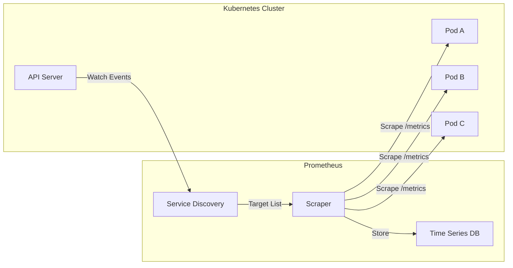
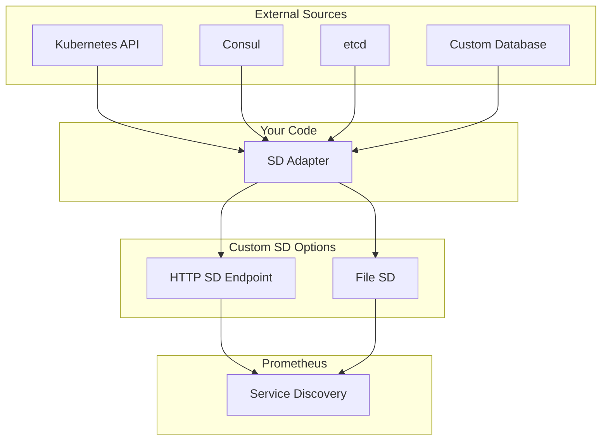
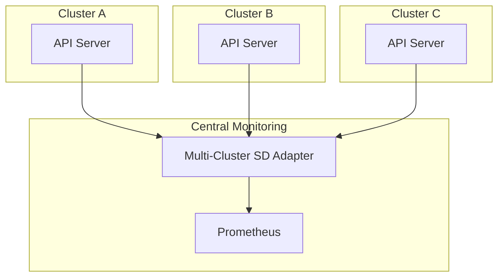

# How to Build Prometheus Kubernetes SD Custom

Author: [nawazdhandala](https://github.com/nawazdhandala)

Tags: Prometheus, Kubernetes, Service-Discovery, Monitoring

Description: Learn how to build custom Prometheus service discovery for Kubernetes to dynamically discover and scrape metrics from your workloads.

---

Prometheus excels at scraping metrics, but knowing what to scrape is half the battle. In Kubernetes environments, pods come and go constantly. Static configuration files cannot keep up. Service discovery bridges this gap by automatically finding scrape targets as they appear and disappear.

## How Prometheus Service Discovery Works

Prometheus supports multiple service discovery mechanisms. For Kubernetes, it queries the API server to discover pods, services, endpoints, nodes, and ingresses. When you configure a `kubernetes_sd_config`, Prometheus watches the cluster and updates its target list in real time.



## Built-in Kubernetes SD Roles

Prometheus provides five discovery roles for Kubernetes:

| Role | Description | Use Case |
|------|-------------|----------|
| `node` | Discovers cluster nodes | Node-level metrics (kubelet, node-exporter) |
| `pod` | Discovers all pods | Application metrics with per-pod targeting |
| `service` | Discovers services | Service-level aggregation |
| `endpoints` | Discovers endpoints from services | Most common for application metrics |
| `endpointslice` | Discovers endpoint slices | Scalable alternative to endpoints |
| `ingress` | Discovers ingress resources | Blackbox monitoring of URLs |

## Basic Kubernetes SD Configuration

Here is a minimal configuration to discover pods in a Kubernetes cluster.

```yaml
# prometheus.yml
global:
  scrape_interval: 15s
  evaluation_interval: 15s

scrape_configs:
  - job_name: 'kubernetes-pods'
    kubernetes_sd_configs:
      - role: pod
    relabel_configs:
      # Only scrape pods with prometheus.io/scrape annotation
      - source_labels: [__meta_kubernetes_pod_annotation_prometheus_io_scrape]
        action: keep
        regex: true

      # Use custom metrics path if specified
      - source_labels: [__meta_kubernetes_pod_annotation_prometheus_io_path]
        action: replace
        target_label: __metrics_path__
        regex: (.+)

      # Use custom port if specified
      - source_labels: [__address__, __meta_kubernetes_pod_annotation_prometheus_io_port]
        action: replace
        regex: ([^:]+)(?::\d+)?;(\d+)
        replacement: $1:$2
        target_label: __address__

      # Add namespace label
      - source_labels: [__meta_kubernetes_namespace]
        action: replace
        target_label: namespace

      # Add pod name label
      - source_labels: [__meta_kubernetes_pod_name]
        action: replace
        target_label: pod
```

## Why Build Custom Service Discovery

The built-in mechanisms cover most scenarios, but sometimes you need more control. Common reasons to build custom SD include:

- Discovering targets from external systems (Consul, etcd, custom databases)
- Complex filtering logic that relabeling cannot express
- Integration with internal service registries
- Multi-cluster discovery with custom authentication
- Adding metadata not available through standard labels

## Custom SD Architecture

Prometheus supports two methods for custom service discovery: HTTP SD and file SD. HTTP SD is more dynamic, while file SD works with any system that can write JSON or YAML files.



## Building an HTTP SD Endpoint

HTTP service discovery lets Prometheus poll an HTTP endpoint for targets. The endpoint must return a JSON array of target groups.

Here is a Go implementation that discovers pods with custom logic.

```go
package main

import (
    "context"
    "encoding/json"
    "log"
    "net/http"
    "os"
    "time"

    metav1 "k8s.io/apimachinery/pkg/apis/meta/v1"
    "k8s.io/client-go/kubernetes"
    "k8s.io/client-go/rest"
)

// TargetGroup represents a Prometheus target group
type TargetGroup struct {
    Targets []string          `json:"targets"`
    Labels  map[string]string `json:"labels,omitempty"`
}

// SDAdapter holds the Kubernetes client and discovered targets
type SDAdapter struct {
    client  *kubernetes.Clientset
    targets []TargetGroup
}

func main() {
    // Create in-cluster config
    config, err := rest.InClusterConfig()
    if err != nil {
        log.Fatalf("Failed to create in-cluster config: %v", err)
    }

    // Create Kubernetes client
    clientset, err := kubernetes.NewForConfig(config)
    if err != nil {
        log.Fatalf("Failed to create Kubernetes client: %v", err)
    }

    adapter := &SDAdapter{
        client:  clientset,
        targets: []TargetGroup{},
    }

    // Start background discovery
    go adapter.discover()

    // HTTP endpoint
    http.HandleFunc("/targets", adapter.handleTargets)

    port := os.Getenv("PORT")
    if port == "" {
        port = "8080"
    }

    log.Printf("Starting HTTP SD adapter on port %s", port)
    log.Fatal(http.ListenAndServe(":"+port, nil))
}

func (a *SDAdapter) discover() {
    ticker := time.NewTicker(30 * time.Second)
    defer ticker.Stop()

    // Initial discovery
    a.updateTargets()

    for range ticker.C {
        a.updateTargets()
    }
}

func (a *SDAdapter) updateTargets() {
    ctx := context.Background()

    // List all pods across namespaces
    pods, err := a.client.CoreV1().Pods("").List(ctx, metav1.ListOptions{})
    if err != nil {
        log.Printf("Failed to list pods: %v", err)
        return
    }

    var targets []TargetGroup

    for _, pod := range pods.Items {
        // Skip pods that are not running
        if pod.Status.Phase != "Running" {
            continue
        }

        // Skip pods without an IP
        if pod.Status.PodIP == "" {
            continue
        }

        // Custom logic: only discover pods with specific annotation
        scrape, ok := pod.Annotations["monitoring.example.com/scrape"]
        if !ok || scrape != "true" {
            continue
        }

        // Get metrics port from annotation or default to 9090
        port := pod.Annotations["monitoring.example.com/port"]
        if port == "" {
            port = "9090"
        }

        // Get metrics path from annotation or default to /metrics
        path := pod.Annotations["monitoring.example.com/path"]
        if path == "" {
            path = "/metrics"
        }

        // Build target
        target := pod.Status.PodIP + ":" + port

        // Build labels
        labels := map[string]string{
            "namespace":     pod.Namespace,
            "pod":           pod.Name,
            "node":          pod.Spec.NodeName,
            "__metrics_path__": path,
        }

        // Copy pod labels with prefix
        for k, v := range pod.Labels {
            labels["pod_label_"+k] = v
        }

        // Add custom labels from annotations
        for k, v := range pod.Annotations {
            if len(k) > 24 && k[:24] == "monitoring.example.com/label_" {
                labelName := k[24:]
                labels[labelName] = v
            }
        }

        targets = append(targets, TargetGroup{
            Targets: []string{target},
            Labels:  labels,
        })
    }

    a.targets = targets
    log.Printf("Discovered %d targets", len(targets))
}

func (a *SDAdapter) handleTargets(w http.ResponseWriter, r *http.Request) {
    w.Header().Set("Content-Type", "application/json")
    json.NewEncoder(w).Encode(a.targets)
}
```

## Configuring Prometheus for HTTP SD

Configure Prometheus to use the HTTP SD endpoint.

```yaml
# prometheus.yml
scrape_configs:
  - job_name: 'custom-kubernetes-sd'
    http_sd_configs:
      - url: http://sd-adapter.monitoring.svc:8080/targets
        refresh_interval: 30s
```

## Building a File SD Adapter

File SD reads targets from JSON or YAML files. This approach works well when you want to use any language or tool to generate the target list.

Here is a Python implementation.

```python
#!/usr/bin/env python3
"""
Prometheus File SD Adapter for Kubernetes
Watches pods and writes targets to a JSON file
"""

import json
import os
import time
import logging
from kubernetes import client, config, watch

logging.basicConfig(level=logging.INFO)
logger = logging.getLogger(__name__)

OUTPUT_FILE = os.getenv("OUTPUT_FILE", "/etc/prometheus/file_sd/targets.json")
NAMESPACE = os.getenv("NAMESPACE", "")  # Empty for all namespaces
ANNOTATION_PREFIX = "monitoring.example.com"

def get_kubernetes_client():
    """Initialize Kubernetes client"""
    try:
        config.load_incluster_config()
        logger.info("Loaded in-cluster config")
    except config.ConfigException:
        config.load_kube_config()
        logger.info("Loaded kubeconfig")

    return client.CoreV1Api()

def build_targets(v1):
    """Build target list from pods"""
    targets = []

    if NAMESPACE:
        pods = v1.list_namespaced_pod(NAMESPACE)
    else:
        pods = v1.list_pod_for_all_namespaces()

    for pod in pods.items:
        # Skip non-running pods
        if pod.status.phase != "Running":
            continue

        # Skip pods without IP
        if not pod.status.pod_ip:
            continue

        # Check for scrape annotation
        annotations = pod.metadata.annotations or {}
        if annotations.get(f"{ANNOTATION_PREFIX}/scrape") != "true":
            continue

        # Get port and path
        port = annotations.get(f"{ANNOTATION_PREFIX}/port", "9090")
        path = annotations.get(f"{ANNOTATION_PREFIX}/path", "/metrics")

        # Build target
        target = f"{pod.status.pod_ip}:{port}"

        # Build labels
        labels = {
            "namespace": pod.metadata.namespace,
            "pod": pod.metadata.name,
            "node": pod.spec.node_name or "",
            "__metrics_path__": path,
        }

        # Add pod labels with prefix
        pod_labels = pod.metadata.labels or {}
        for key, value in pod_labels.items():
            safe_key = key.replace("/", "_").replace("-", "_")
            labels[f"pod_label_{safe_key}"] = value

        # Add custom labels from annotations
        label_prefix = f"{ANNOTATION_PREFIX}/label_"
        for key, value in annotations.items():
            if key.startswith(label_prefix):
                label_name = key[len(label_prefix):]
                labels[label_name] = value

        targets.append({
            "targets": [target],
            "labels": labels,
        })

    return targets

def write_targets(targets):
    """Write targets to JSON file atomically"""
    # Write to temp file first
    temp_file = OUTPUT_FILE + ".tmp"

    # Ensure directory exists
    os.makedirs(os.path.dirname(OUTPUT_FILE), exist_ok=True)

    with open(temp_file, "w") as f:
        json.dump(targets, f, indent=2)

    # Atomic rename
    os.rename(temp_file, OUTPUT_FILE)
    logger.info(f"Wrote {len(targets)} targets to {OUTPUT_FILE}")

def main():
    """Main loop"""
    v1 = get_kubernetes_client()

    while True:
        try:
            targets = build_targets(v1)
            write_targets(targets)
        except Exception as e:
            logger.error(f"Error updating targets: {e}")

        time.sleep(30)

if __name__ == "__main__":
    main()
```

## Configuring Prometheus for File SD

Configure Prometheus to read from the file SD targets file.

```yaml
# prometheus.yml
scrape_configs:
  - job_name: 'file-kubernetes-sd'
    file_sd_configs:
      - files:
          - /etc/prometheus/file_sd/targets.json
        refresh_interval: 30s
```

## Deploying the SD Adapter

Deploy the HTTP SD adapter in your Kubernetes cluster.

```yaml
# deployment.yaml
apiVersion: apps/v1
kind: Deployment
metadata:
  name: prometheus-sd-adapter
  namespace: monitoring
spec:
  replicas: 2
  selector:
    matchLabels:
      app: prometheus-sd-adapter
  template:
    metadata:
      labels:
        app: prometheus-sd-adapter
    spec:
      serviceAccountName: prometheus-sd-adapter
      containers:
        - name: adapter
          image: your-registry/prometheus-sd-adapter:latest
          ports:
            - containerPort: 8080
          env:
            - name: PORT
              value: "8080"
          resources:
            requests:
              cpu: 50m
              memory: 64Mi
            limits:
              cpu: 200m
              memory: 128Mi
          livenessProbe:
            httpGet:
              path: /targets
              port: 8080
            initialDelaySeconds: 10
            periodSeconds: 30
          readinessProbe:
            httpGet:
              path: /targets
              port: 8080
            initialDelaySeconds: 5
            periodSeconds: 10
---
apiVersion: v1
kind: Service
metadata:
  name: sd-adapter
  namespace: monitoring
spec:
  selector:
    app: prometheus-sd-adapter
  ports:
    - port: 8080
      targetPort: 8080
---
apiVersion: v1
kind: ServiceAccount
metadata:
  name: prometheus-sd-adapter
  namespace: monitoring
---
apiVersion: rbac.authorization.k8s.io/v1
kind: ClusterRole
metadata:
  name: prometheus-sd-adapter
rules:
  - apiGroups: [""]
    resources: ["pods", "nodes", "services", "endpoints"]
    verbs: ["get", "list", "watch"]
  - apiGroups: [""]
    resources: ["namespaces"]
    verbs: ["get", "list"]
---
apiVersion: rbac.authorization.k8s.io/v1
kind: ClusterRoleBinding
metadata:
  name: prometheus-sd-adapter
subjects:
  - kind: ServiceAccount
    name: prometheus-sd-adapter
    namespace: monitoring
roleRef:
  kind: ClusterRole
  name: prometheus-sd-adapter
  apiGroup: rbac.authorization.k8s.io
```

## Advanced Filtering Logic

Custom SD adapters let you implement complex filtering that relabeling cannot achieve. Here are some examples.

### Filter by Resource Usage

Only discover pods that have requested specific resources.

```go
func (a *SDAdapter) filterByResources(pod *corev1.Pod) bool {
    for _, container := range pod.Spec.Containers {
        requests := container.Resources.Requests
        if requests == nil {
            continue
        }

        // Only include pods with memory request > 256Mi
        if mem, ok := requests[corev1.ResourceMemory]; ok {
            if mem.Value() > 256*1024*1024 {
                return true
            }
        }
    }
    return false
}
```

### Filter by Owner

Only discover pods owned by specific deployments.

```go
func (a *SDAdapter) filterByOwner(pod *corev1.Pod) bool {
    for _, owner := range pod.OwnerReferences {
        if owner.Kind == "ReplicaSet" {
            // Get the ReplicaSet to find the Deployment
            rs, err := a.client.AppsV1().ReplicaSets(pod.Namespace).Get(
                context.Background(), owner.Name, metav1.GetOptions{})
            if err != nil {
                continue
            }

            for _, rsOwner := range rs.OwnerReferences {
                if rsOwner.Kind == "Deployment" {
                    // Check if deployment is in allowed list
                    if a.allowedDeployments[rsOwner.Name] {
                        return true
                    }
                }
            }
        }
    }
    return false
}
```

## Multi-Cluster Discovery

For multi-cluster setups, build an adapter that aggregates targets from multiple clusters.



```go
type MultiClusterAdapter struct {
    clusters map[string]*kubernetes.Clientset
    targets  []TargetGroup
    mu       sync.RWMutex
}

func (m *MultiClusterAdapter) discoverAll() {
    var allTargets []TargetGroup

    for clusterName, client := range m.clusters {
        targets := m.discoverCluster(clusterName, client)
        allTargets = append(allTargets, targets...)
    }

    m.mu.Lock()
    m.targets = allTargets
    m.mu.Unlock()
}

func (m *MultiClusterAdapter) discoverCluster(name string, client *kubernetes.Clientset) []TargetGroup {
    pods, err := client.CoreV1().Pods("").List(context.Background(), metav1.ListOptions{})
    if err != nil {
        log.Printf("Failed to list pods in cluster %s: %v", name, err)
        return nil
    }

    var targets []TargetGroup

    for _, pod := range pods.Items {
        // ... filtering logic ...

        labels := map[string]string{
            "cluster":   name,
            "namespace": pod.Namespace,
            "pod":       pod.Name,
        }

        targets = append(targets, TargetGroup{
            Targets: []string{pod.Status.PodIP + ":9090"},
            Labels:  labels,
        })
    }

    return targets
}
```

## Caching and Performance

For large clusters, implement caching to reduce API server load.

```go
type CachedAdapter struct {
    client    *kubernetes.Clientset
    cache     *TargetCache
    informer  cache.SharedIndexInformer
}

type TargetCache struct {
    targets map[string]TargetGroup
    mu      sync.RWMutex
}

func (a *CachedAdapter) setupInformer() {
    factory := informers.NewSharedInformerFactory(a.client, 0)
    a.informer = factory.Core().V1().Pods().Informer()

    a.informer.AddEventHandler(cache.ResourceEventHandlerFuncs{
        AddFunc:    a.onPodAdd,
        UpdateFunc: a.onPodUpdate,
        DeleteFunc: a.onPodDelete,
    })

    factory.Start(context.Background().Done())
    factory.WaitForCacheSync(context.Background().Done())
}

func (a *CachedAdapter) onPodAdd(obj interface{}) {
    pod := obj.(*corev1.Pod)
    if target := a.buildTarget(pod); target != nil {
        a.cache.mu.Lock()
        a.cache.targets[string(pod.UID)] = *target
        a.cache.mu.Unlock()
    }
}

func (a *CachedAdapter) onPodDelete(obj interface{}) {
    pod := obj.(*corev1.Pod)
    a.cache.mu.Lock()
    delete(a.cache.targets, string(pod.UID))
    a.cache.mu.Unlock()
}
```

## Monitoring Your SD Adapter

Add metrics to observe your adapter's health.

```go
var (
    discoveryDuration = prometheus.NewHistogram(prometheus.HistogramOpts{
        Name:    "sd_adapter_discovery_duration_seconds",
        Help:    "Time spent discovering targets",
        Buckets: prometheus.DefBuckets,
    })

    targetsTotal = prometheus.NewGauge(prometheus.GaugeOpts{
        Name: "sd_adapter_targets_total",
        Help: "Total number of discovered targets",
    })

    discoveryErrors = prometheus.NewCounter(prometheus.CounterOpts{
        Name: "sd_adapter_discovery_errors_total",
        Help: "Total number of discovery errors",
    })
)

func init() {
    prometheus.MustRegister(discoveryDuration, targetsTotal, discoveryErrors)
}

func (a *SDAdapter) updateTargets() {
    timer := prometheus.NewTimer(discoveryDuration)
    defer timer.ObserveDuration()

    targets, err := a.discover()
    if err != nil {
        discoveryErrors.Inc()
        return
    }

    targetsTotal.Set(float64(len(targets)))
    a.targets = targets
}
```

## Testing Your SD Adapter

Write tests to verify discovery logic.

```go
func TestBuildTargets(t *testing.T) {
    // Create fake client with test pods
    pod := &corev1.Pod{
        ObjectMeta: metav1.ObjectMeta{
            Name:      "test-pod",
            Namespace: "default",
            Annotations: map[string]string{
                "monitoring.example.com/scrape": "true",
                "monitoring.example.com/port":   "8080",
            },
        },
        Status: corev1.PodStatus{
            Phase: corev1.PodRunning,
            PodIP: "10.0.0.1",
        },
    }

    client := fake.NewSimpleClientset(pod)
    adapter := &SDAdapter{client: client}

    targets := adapter.buildTargets()

    if len(targets) != 1 {
        t.Errorf("Expected 1 target, got %d", len(targets))
    }

    if targets[0].Targets[0] != "10.0.0.1:8080" {
        t.Errorf("Unexpected target: %s", targets[0].Targets[0])
    }
}
```

## Best Practices

1. **Use informers over polling** - Informers watch for changes instead of listing all resources repeatedly
2. **Implement graceful shutdown** - Drain HTTP connections and stop informers cleanly
3. **Add health checks** - Expose liveness and readiness endpoints
4. **Cache aggressively** - Reduce API server load in large clusters
5. **Handle partial failures** - Do not crash if one cluster is unreachable
6. **Export metrics** - Monitor discovery latency, errors, and target counts
7. **Use leader election** - Run multiple replicas for HA but only one active writer
8. **Validate output** - Ensure target format matches Prometheus expectations

---

Custom Prometheus service discovery adapters give you full control over what gets scraped in your Kubernetes clusters. Start with the built-in `kubernetes_sd_configs` when possible, but do not hesitate to build custom adapters when you need complex filtering, multi-cluster support, or integration with external systems. The HTTP SD interface is simple enough that you can implement it in any language in under an hour.
