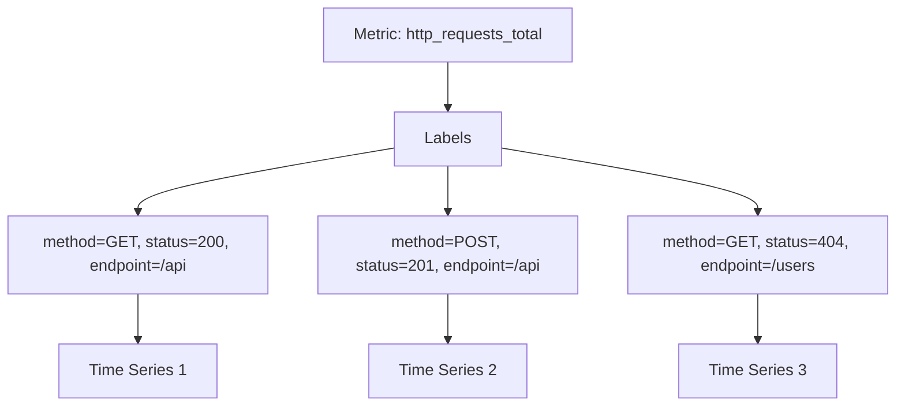
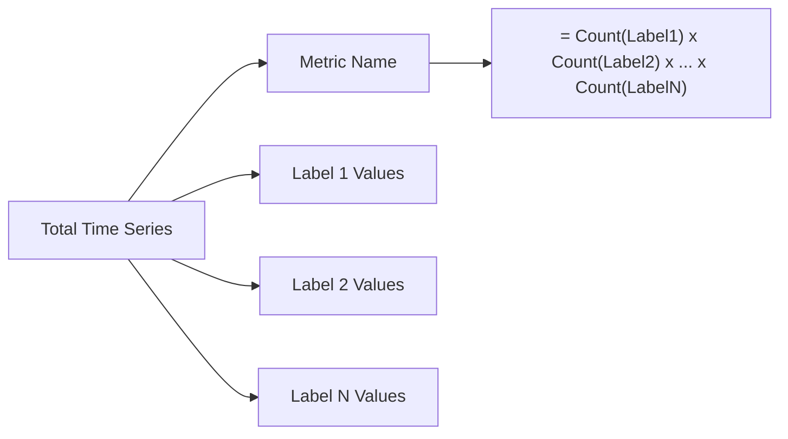
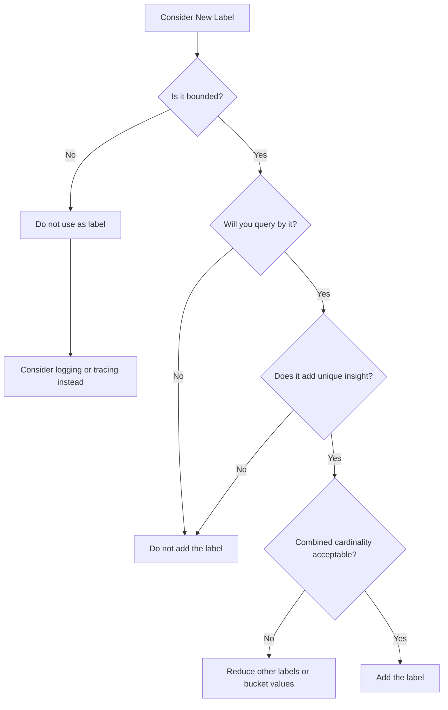
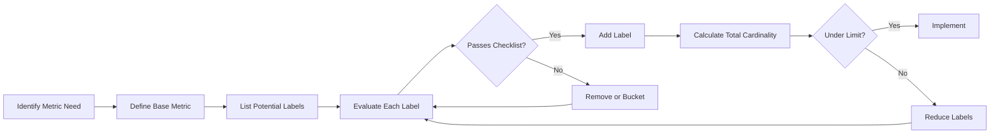

# How to Create Prometheus Label Best Practices

Author: [nawazdhandala](https://github.com/nawazdhandala)

Tags: Prometheus, Labels, Metrics Design, Cardinality

Description: Learn to implement Prometheus labels with cardinality control, naming conventions, and dimension selection for efficient metrics storage.

---

Labels are the backbone of Prometheus metrics. They transform simple counters and gauges into powerful, queryable dimensions that enable deep observability into your systems. However, poorly designed labels can quickly become a liability - causing memory bloat, slow queries, and storage explosions. This guide will walk you through the best practices for creating effective Prometheus labels.

## Understanding Labels and Their Impact

Before diving into best practices, let's understand what labels actually do. In Prometheus, every unique combination of metric name and label key-value pairs creates a distinct time series.



Each time series consumes memory and storage. The total number of time series grows multiplicatively with each label you add.

## Label Naming Conventions

### Use Snake Case

Prometheus label names should follow snake_case convention. This keeps them consistent with metric names and improves readability.

```python
# Good - snake_case labels
http_requests_total{http_method="GET", status_code="200", service_name="api-gateway"}

# Bad - inconsistent casing
http_requests_total{httpMethod="GET", StatusCode="200", ServiceName="api-gateway"}
```

### Be Descriptive But Concise

Label names should clearly describe what they represent without being overly verbose.

```python
# Good - clear and concise
request_duration_seconds{endpoint="/api/users", method="GET"}

# Bad - too abbreviated
request_duration_seconds{ep="/api/users", m="GET"}

# Bad - overly verbose
request_duration_seconds{api_endpoint_path="/api/users", http_request_method="GET"}
```

### Avoid Reserved Prefixes

Prometheus reserves the `__` prefix for internal use. Never use it for your labels.

```python
# Bad - uses reserved prefix
http_requests_total{__internal_id="123"}

# Good - uses appropriate naming
http_requests_total{request_id="123"}
```

## Understanding and Controlling Cardinality

Cardinality refers to the number of unique time series a metric produces. High cardinality is the most common pitfall in Prometheus metrics design.

### The Cardinality Formula



For example, if you have a metric with:
- 10 possible endpoints
- 5 HTTP methods
- 10 status codes
- 100 server instances

Total time series = 10 x 5 x 10 x 100 = **50,000 time series**

### Cardinality Limits by Label Type

Here is a practical guide for label cardinality limits:

| Label Type | Example | Safe Cardinality | Warning Zone | Danger Zone |
|------------|---------|------------------|--------------|-------------|
| Static | environment, region | < 10 | 10-50 | > 50 |
| Semi-static | service, version | < 100 | 100-500 | > 500 |
| Dynamic | pod_name, instance | < 1000 | 1000-5000 | > 5000 |
| Never Use | user_id, request_id | N/A | N/A | Any value |

### Code Example: Safe Label Design

```go
package main

import (
    "github.com/prometheus/client_golang/prometheus"
    "github.com/prometheus/client_golang/prometheus/promauto"
)

// Good - bounded cardinality labels
var httpRequestsTotal = promauto.NewCounterVec(
    prometheus.CounterOpts{
        Name: "http_requests_total",
        Help: "Total number of HTTP requests",
    },
    []string{"method", "status_code", "endpoint"},
)

// Bad - unbounded cardinality with user_id
var httpRequestsByUser = promauto.NewCounterVec(
    prometheus.CounterOpts{
        Name: "http_requests_by_user_total",
        Help: "Total HTTP requests per user",
    },
    []string{"method", "status_code", "user_id"}, // user_id is unbounded!
)

func recordRequest(method, statusCode, endpoint string) {
    // Safe - all labels have bounded values
    httpRequestsTotal.WithLabelValues(method, statusCode, endpoint).Inc()
}
```

## Dimension Selection Strategy

Choosing the right dimensions (labels) requires balancing observability needs with cardinality concerns.

### The Dimension Decision Framework



### Recommended Label Dimensions

```python
# Infrastructure labels - who/where
service_name      # The service producing the metric
instance          # The specific instance (pod, container, VM)
environment       # prod, staging, dev
region            # Geographic region
availability_zone # AZ within region

# Request labels - what/how
method            # HTTP method (GET, POST, etc.)
endpoint          # API endpoint (use bucketed paths)
status_code       # HTTP status code
error_type        # Categorized error types

# Business labels - why (use sparingly)
customer_tier     # free, pro, enterprise
feature_flag      # Feature being tested
```

### Bucketing High-Cardinality Values

When you need to track something with many possible values, bucket them into categories.

```go
package main

import (
    "net/http"
    "regexp"
)

// Bucket endpoint paths to control cardinality
func normalizeEndpoint(path string) string {
    // Replace dynamic segments with placeholders
    patterns := []struct {
        regex       *regexp.Regexp
        replacement string
    }{
        {regexp.MustCompile(`/users/[0-9]+`), "/users/:id"},
        {regexp.MustCompile(`/orders/[0-9]+`), "/orders/:id"},
        {regexp.MustCompile(`/products/[a-zA-Z0-9-]+`), "/products/:slug"},
    }

    result := path
    for _, p := range patterns {
        result = p.regex.ReplaceAllString(result, p.replacement)
    }
    return result
}

// Bucket status codes into categories
func normalizeStatusCode(code int) string {
    switch {
    case code >= 200 && code < 300:
        return "2xx"
    case code >= 300 && code < 400:
        return "3xx"
    case code >= 400 && code < 500:
        return "4xx"
    case code >= 500:
        return "5xx"
    default:
        return "unknown"
    }
}

func handleRequest(w http.ResponseWriter, r *http.Request) {
    endpoint := normalizeEndpoint(r.URL.Path)
    // ... handle request ...
    statusCode := normalizeStatusCode(200)

    httpRequestsTotal.WithLabelValues(r.Method, statusCode, endpoint).Inc()
}
```

## Anti-Patterns to Avoid

### Anti-Pattern 1: Using Unbounded Identifiers

```python
# NEVER DO THIS - unbounded cardinality
http_requests_total{user_id="12345", request_id="abc-123-def"}
database_queries_total{query_hash="a1b2c3d4e5f6"}
api_calls_total{trace_id="span-123456"}
```

Instead, track these in logs or traces where they belong.

### Anti-Pattern 2: Timestamps in Labels

```python
# NEVER DO THIS - infinite cardinality
job_last_run{timestamp="2026-01-30T10:30:00Z"}
```

Use a gauge instead:

```python
# Good - store timestamp as the metric value
job_last_run_timestamp_seconds{job_name="data_sync"} 1738234200
```

### Anti-Pattern 3: Full Error Messages

```python
# NEVER DO THIS - potentially infinite unique values
errors_total{message="Connection refused to host 192.168.1.45 port 5432"}
```

Categorize errors instead:

```python
# Good - bounded error categories
errors_total{error_type="connection_refused", target_service="database"}
```

### Anti-Pattern 4: Version Strings with Build Numbers

```python
# Bad - creates new series with every build
app_info{version="1.2.3-build.12345-abc123def"}

# Good - use semantic version only
app_info{version="1.2.3"}

# Track build info separately as a gauge that rarely changes
build_info{version="1.2.3", commit="abc123def", build_number="12345"} 1
```

## Monitoring Label Cardinality

Always monitor your own metrics cardinality to catch issues early.

```yaml
# Prometheus alerting rules for cardinality
groups:
  - name: cardinality_alerts
    rules:
      - alert: HighCardinalityMetric
        expr: count by (__name__) ({__name__=~".+"}) > 10000
        for: 5m
        labels:
          severity: warning
        annotations:
          summary: "Metric {{ $labels.__name__ }} has high cardinality"
          description: "The metric has {{ $value }} time series"

      - alert: CardinalityExplosion
        expr: |
          (
            count by (__name__) ({__name__=~".+"})
            - count by (__name__) ({__name__=~".+"} offset 1h)
          ) > 1000
        for: 10m
        labels:
          severity: critical
        annotations:
          summary: "Rapid cardinality increase for {{ $labels.__name__ }}"
```

## Label Design Workflow



### Label Evaluation Checklist

Before adding any label, ask these questions:

1. **Is the cardinality bounded?** - Can you enumerate all possible values?
2. **Will you aggregate or filter by this label?** - If not, do not add it.
3. **Does it provide actionable insight?** - Can you take action based on this dimension?
4. **Is the data better suited for logs/traces?** - High-cardinality data often is.
5. **What is the combined cardinality impact?** - Calculate the multiplicative effect.

## Practical Implementation Example

Here is a complete example implementing these best practices in a Go service:

```go
package metrics

import (
    "github.com/prometheus/client_golang/prometheus"
    "github.com/prometheus/client_golang/prometheus/promauto"
)

// Define metrics with carefully chosen labels
var (
    // HTTP metrics with bounded labels
    HTTPRequestDuration = promauto.NewHistogramVec(
        prometheus.HistogramOpts{
            Name:    "http_request_duration_seconds",
            Help:    "HTTP request duration in seconds",
            Buckets: prometheus.DefBuckets,
        },
        []string{"method", "endpoint", "status_class"},
    )

    HTTPRequestsTotal = promauto.NewCounterVec(
        prometheus.CounterOpts{
            Name: "http_requests_total",
            Help: "Total HTTP requests",
        },
        []string{"method", "endpoint", "status_code"},
    )

    // Database metrics
    DBQueryDuration = promauto.NewHistogramVec(
        prometheus.HistogramOpts{
            Name:    "db_query_duration_seconds",
            Help:    "Database query duration",
            Buckets: []float64{.001, .005, .01, .025, .05, .1, .25, .5, 1},
        },
        []string{"operation", "table"},
    )

    // Business metrics with bounded dimensions
    OrdersProcessed = promauto.NewCounterVec(
        prometheus.CounterOpts{
            Name: "orders_processed_total",
            Help: "Total orders processed",
        },
        []string{"status", "payment_method", "customer_tier"},
    )

    // Service info - static labels, rarely changes
    ServiceInfo = promauto.NewGaugeVec(
        prometheus.GaugeOpts{
            Name: "service_info",
            Help: "Service information",
        },
        []string{"version", "environment", "region"},
    )
)

// Helper functions to ensure bounded values
func StatusClass(code int) string {
    return fmt.Sprintf("%dxx", code/100)
}

func BucketPaymentMethod(method string) string {
    known := map[string]bool{
        "credit_card": true,
        "debit_card":  true,
        "paypal":      true,
        "bank_transfer": true,
    }
    if known[method] {
        return method
    }
    return "other"
}

func BucketCustomerTier(tier string) string {
    known := map[string]bool{
        "free":       true,
        "pro":        true,
        "enterprise": true,
    }
    if known[tier] {
        return tier
    }
    return "unknown"
}
```

## Summary

Effective Prometheus label design requires balancing observability with operational constraints. Follow these key principles:

1. **Keep cardinality bounded** - Never use unbounded values like user IDs or timestamps as labels
2. **Use consistent naming** - Follow snake_case convention and be descriptive but concise
3. **Choose dimensions wisely** - Only add labels you will actually query and aggregate by
4. **Bucket when necessary** - Convert high-cardinality values into bounded categories
5. **Monitor your metrics** - Set up alerts for cardinality explosions
6. **Use the right tool** - High-cardinality data belongs in logs and traces, not metrics

By following these best practices, you will build a metrics system that scales efficiently, queries quickly, and provides the observability you need without breaking your Prometheus infrastructure.
