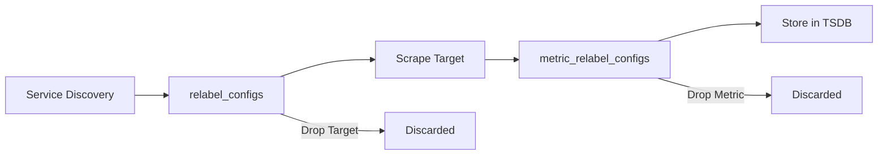
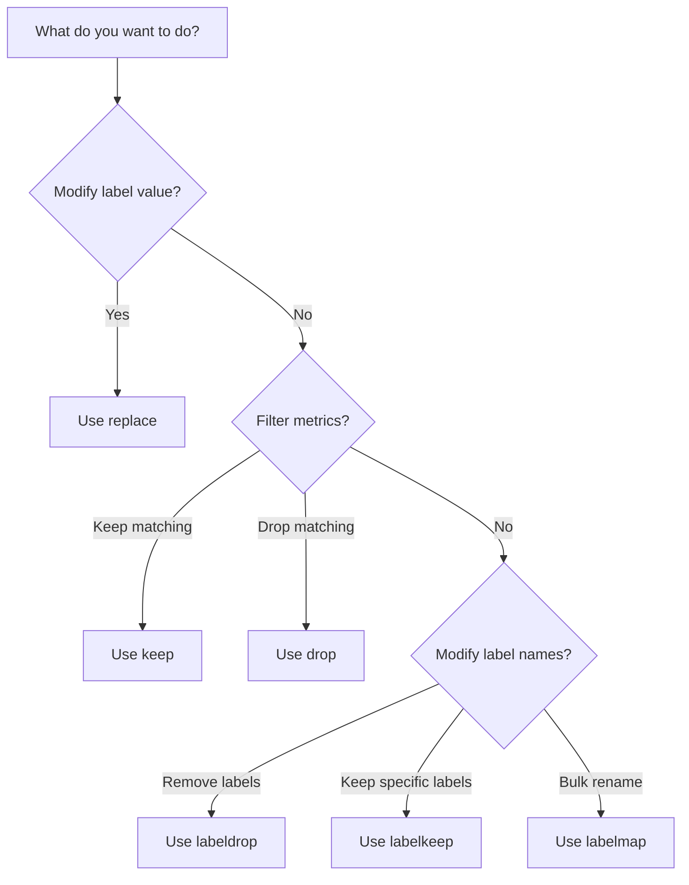

# How to Create Prometheus Metric Relabeling

Author: [nawazdhandala](https://github.com/nawazdhandala)

Tags: Prometheus, Metrics, Relabeling, Monitoring

Description: A practical guide to Prometheus metric relabeling that helps you transform, filter, and optimize your metrics pipeline for better observability.

---

> Metric relabeling is the Swiss Army knife of Prometheus. It lets you shape raw metrics into exactly what your dashboards and alerts need.

Prometheus scrapes metrics from targets, but the raw data often needs transformation before it becomes useful. Labels might be too verbose, metric names inconsistent, or certain series just noise. Metric relabeling solves all of this by letting you manipulate labels and filter metrics at scrape time or before remote write.

This guide covers everything you need to know about Prometheus relabeling: when to use it, how to configure it, and practical patterns you can apply today.

---

## What is Metric Relabeling?

Prometheus has two relabeling stages:

| Stage | Config Key | When It Runs | Use Case |
|-------|------------|--------------|----------|
| Target relabeling | `relabel_configs` | Before scraping | Modify target labels, filter targets |
| Metric relabeling | `metric_relabel_configs` | After scraping | Transform metrics, drop unwanted series |

The key difference: `relabel_configs` operates on **targets** (endpoints to scrape), while `metric_relabel_configs` operates on **scraped metrics** (the actual time series data).

---

## Relabeling Flow

Here is how the relabeling pipeline works from target discovery to storage.



Understanding this flow helps you decide where to place your relabeling rules for maximum efficiency.

---

## Relabeling Actions

Prometheus supports several relabeling actions.

| Action | Description | Common Use |
|--------|-------------|------------|
| `replace` | Replace label value using regex | Rename labels, extract parts |
| `keep` | Keep only matching series | Filter to specific metrics |
| `drop` | Drop matching series | Remove unwanted metrics |
| `labelmap` | Copy labels matching regex | Bulk rename label prefixes |
| `labeldrop` | Remove labels matching regex | Clean up verbose labels |
| `labelkeep` | Keep only labels matching regex | Reduce cardinality |
| `hashmod` | Hash label value for sharding | Distribute load |

---

## Basic Configuration Structure

Every relabel config follows this structure.

```yaml
# prometheus.yml
scrape_configs:
  - job_name: 'my-service'
    static_configs:
      - targets: ['localhost:9090']
    metric_relabel_configs:
      - source_labels: [__name__]  # Labels to read from
        separator: ';'              # Join multiple labels with this
        regex: '(.+)'               # Match pattern
        target_label: 'new_label'   # Label to write to
        replacement: '${1}'         # Value to write (supports capture groups)
        action: replace             # What to do
```

Most fields have sensible defaults. A minimal config often just needs `source_labels`, `regex`, and `action`.

---

## Practical Examples

### 1. Drop Unwanted Metrics

High-cardinality metrics can overwhelm your storage. Drop them before they cause problems.

This configuration drops all Go runtime metrics that you might not need.

```yaml
metric_relabel_configs:
  - source_labels: [__name__]
    regex: 'go_.*'
    action: drop
```

### 2. Keep Only Specific Metrics

When you only care about certain metrics from a verbose exporter, use keep.

This keeps only HTTP and database metrics, dropping everything else.

```yaml
metric_relabel_configs:
  - source_labels: [__name__]
    regex: '(http_requests_total|http_request_duration_.*|db_query_.*)'
    action: keep
```

### 3. Rename a Metric

Legacy metric names can be standardized without changing the exporter.

This renames a legacy metric name to follow your naming convention.

```yaml
metric_relabel_configs:
  - source_labels: [__name__]
    regex: 'old_metric_name'
    target_label: __name__
    replacement: 'new_metric_name'
    action: replace
```

### 4. Extract Label from Metric Name

Some exporters encode information in metric names that should be labels.

This extracts the HTTP method from metric names like `http_requests_get_total`.

```yaml
metric_relabel_configs:
  - source_labels: [__name__]
    regex: 'http_requests_(.+)_total'
    target_label: method
    replacement: '${1}'
    action: replace
  - source_labels: [__name__]
    regex: 'http_requests_.+_total'
    target_label: __name__
    replacement: 'http_requests_total'
    action: replace
```

### 5. Drop High-Cardinality Labels

Labels with too many unique values (like user IDs) explode cardinality.

This removes the user_id label to prevent cardinality explosion.

```yaml
metric_relabel_configs:
  - regex: 'user_id'
    action: labeldrop
```

### 6. Rename Label Prefixes with labelmap

When exporters add prefixes to labels, you can bulk rename them.

This removes the `kubernetes_pod_` prefix from all matching labels.

```yaml
metric_relabel_configs:
  - regex: 'kubernetes_pod_(.*)'
    replacement: '${1}'
    action: labelmap
```

### 7. Combine Multiple Labels

Create a composite label from multiple source labels.

This creates an `endpoint` label by combining host and port.

```yaml
metric_relabel_configs:
  - source_labels: [host, port]
    separator: ':'
    target_label: endpoint
    replacement: '${1}'
    action: replace
```

### 8. Conditional Relabeling

Apply transformations only when certain conditions match.

This adds an environment label only for production targets.

```yaml
metric_relabel_configs:
  - source_labels: [instance]
    regex: 'prod-.*'
    target_label: environment
    replacement: 'production'
    action: replace
```

---

## Target Relabeling Examples

These examples use `relabel_configs` to modify targets before scraping.

### Filter Targets by Label

Only scrape targets with a specific annotation.

```yaml
scrape_configs:
  - job_name: 'kubernetes-pods'
    kubernetes_sd_configs:
      - role: pod
    relabel_configs:
      - source_labels: [__meta_kubernetes_pod_annotation_prometheus_io_scrape]
        regex: 'true'
        action: keep
```

### Set Custom Scrape Path

Some exporters expose metrics on non-standard paths.

```yaml
relabel_configs:
  - source_labels: [__meta_kubernetes_pod_annotation_prometheus_io_path]
    regex: '(.+)'
    target_label: __metrics_path__
    replacement: '${1}'
    action: replace
```

### Add Static Labels

Enrich all metrics from a job with additional context.

```yaml
relabel_configs:
  - target_label: team
    replacement: 'platform'
    action: replace
  - target_label: tier
    replacement: 'infrastructure'
    action: replace
```

---

## Relabeling Decision Flow

Use this flowchart to decide which relabeling action fits your use case.



---

## Complete Configuration Example

Here is a production-ready Prometheus configuration with comprehensive relabeling.

```yaml
global:
  scrape_interval: 15s
  evaluation_interval: 15s

scrape_configs:
  - job_name: 'kubernetes-pods'
    kubernetes_sd_configs:
      - role: pod

    # Target relabeling - before scrape
    relabel_configs:
      # Only scrape pods with prometheus.io/scrape annotation
      - source_labels: [__meta_kubernetes_pod_annotation_prometheus_io_scrape]
        regex: 'true'
        action: keep

      # Use custom metrics path if specified
      - source_labels: [__meta_kubernetes_pod_annotation_prometheus_io_path]
        regex: '(.+)'
        target_label: __metrics_path__
        replacement: '${1}'
        action: replace

      # Use custom port if specified
      - source_labels: [__address__, __meta_kubernetes_pod_annotation_prometheus_io_port]
        regex: '([^:]+)(?::\d+)?;(\d+)'
        target_label: __address__
        replacement: '${1}:${2}'
        action: replace

      # Add namespace label
      - source_labels: [__meta_kubernetes_namespace]
        target_label: namespace
        action: replace

      # Add pod name label
      - source_labels: [__meta_kubernetes_pod_name]
        target_label: pod
        action: replace

      # Add service name from label
      - source_labels: [__meta_kubernetes_pod_label_app]
        target_label: service
        action: replace

    # Metric relabeling - after scrape
    metric_relabel_configs:
      # Drop Go runtime metrics
      - source_labels: [__name__]
        regex: 'go_(gc|memstats|threads).*'
        action: drop

      # Drop process metrics
      - source_labels: [__name__]
        regex: 'process_(cpu|open_fds|max_fds|resident|virtual|start).*'
        action: drop

      # Drop high-cardinality labels
      - regex: '(request_id|trace_id|span_id)'
        action: labeldrop

      # Standardize HTTP status code label
      - source_labels: [status_code]
        regex: '(.+)'
        target_label: code
        replacement: '${1}'
        action: replace
      - regex: 'status_code'
        action: labeldrop

      # Add environment label based on namespace
      - source_labels: [namespace]
        regex: '.*-prod$'
        target_label: env
        replacement: 'production'
        action: replace
      - source_labels: [namespace]
        regex: '.*-staging$'
        target_label: env
        replacement: 'staging'
        action: replace

  - job_name: 'node-exporter'
    static_configs:
      - targets: ['node-exporter:9100']

    metric_relabel_configs:
      # Keep only essential node metrics
      - source_labels: [__name__]
        regex: 'node_(cpu_seconds_total|memory_.*|disk_.*|network_.*|filesystem_.*|load.*)'
        action: keep

      # Simplify device labels
      - source_labels: [device]
        regex: '(sd[a-z]|nvme\d+n\d+)'
        target_label: disk_type
        replacement: 'block'
        action: replace
```

---

## Remote Write Relabeling

When using remote write (sending metrics to external systems), you can apply additional relabeling.

```yaml
remote_write:
  - url: 'https://metrics.example.com/api/v1/write'

    write_relabel_configs:
      # Only send production metrics
      - source_labels: [env]
        regex: 'production'
        action: keep

      # Aggregate high-cardinality metrics before sending
      - source_labels: [__name__]
        regex: 'http_request_duration_seconds_bucket'
        action: keep

      # Remove internal labels
      - regex: '(__replica__|prometheus_replica)'
        action: labeldrop
```

---

## Common Pitfalls and Solutions

### 1. Regex Matching Issues

Prometheus uses RE2 regex syntax. Common gotchas include unescaped dots and missing anchors.

```yaml
# Wrong - matches http_requests_total_extra too
- source_labels: [__name__]
  regex: 'http_requests_total'
  action: keep

# Correct - exact match
- source_labels: [__name__]
  regex: '^http_requests_total$'
  action: keep
```

### 2. Order Matters

Relabel configs are applied in order. A drop rule before a transform means the transform never runs.

```yaml
# Wrong order - metric is dropped before rename can happen
metric_relabel_configs:
  - source_labels: [__name__]
    regex: 'legacy_.*'
    action: drop
  - source_labels: [__name__]
    regex: 'legacy_metric'
    target_label: __name__
    replacement: 'new_metric'
    action: replace

# Correct order - rename first, then drop others
metric_relabel_configs:
  - source_labels: [__name__]
    regex: 'legacy_metric'
    target_label: __name__
    replacement: 'new_metric'
    action: replace
  - source_labels: [__name__]
    regex: 'legacy_.*'
    action: drop
```

### 3. Missing Labels

If a source label does not exist, the regex matches an empty string.

```yaml
# This will match and add env=production to ALL metrics without an existing env label
- source_labels: [env]
  regex: ''
  target_label: env
  replacement: 'production'
  action: replace

# Better - only add if instance matches production pattern
- source_labels: [instance]
  regex: 'prod-.*'
  target_label: env
  replacement: 'production'
  action: replace
```

### 4. Cardinality After Relabeling

Dropping a label can increase cardinality if it creates duplicate series.

```yaml
# Before: {method="GET", user_id="123"} and {method="GET", user_id="456"} are distinct
# After labeldrop user_id: Both become {method="GET"} - collision!

# Solution: Use recording rules to aggregate, or drop at source
```

---

## Debugging Relabel Configs

### Use promtool

Test your relabeling rules without deploying.

```bash
promtool check config prometheus.yml
```

### Enable Debug Logging

Add this to your Prometheus startup flags.

```bash
--log.level=debug
```

### Check Target Labels

View the Prometheus UI at `/targets` to see labels after relabeling.

### Test with Sample Data

Use this Python script to simulate relabeling.

```python
import re

def apply_relabel(labels, config):
    source = config.get('separator', ';').join(
        labels.get(l, '') for l in config.get('source_labels', [])
    )
    regex = config.get('regex', '(.*)')
    match = re.match(regex, source)

    if config['action'] == 'keep':
        return labels if match else None
    elif config['action'] == 'drop':
        return None if match else labels
    elif config['action'] == 'replace' and match:
        target = config.get('target_label')
        replacement = config.get('replacement', '${1}')
        for i, group in enumerate(match.groups(), 1):
            replacement = replacement.replace(f'${{{i}}}', group or '')
        labels[target] = replacement

    return labels

# Test
labels = {'__name__': 'http_requests_total', 'method': 'GET'}
config = {'source_labels': ['method'], 'regex': 'GET', 'action': 'keep'}
print(apply_relabel(labels, config))
```

---

## Performance Considerations

Relabeling adds CPU overhead. Follow these guidelines for large-scale deployments.

| Guideline | Reason |
|-----------|--------|
| Drop early | Filter unwanted metrics in `metric_relabel_configs` before storage |
| Use simple regex | Complex patterns consume more CPU |
| Limit source_labels | Concatenating many labels is expensive |
| Prefer keep over drop | One keep rule beats multiple drop rules for allowlists |
| Monitor relabel duration | Check `prometheus_target_scrape_pool_reloads_total` |

---

## Integration with OneUptime

OneUptime accepts Prometheus metrics via remote write. Use relabeling to optimize what you send.

```yaml
remote_write:
  - url: 'https://oneuptime.com/api/v1/prometheus/write'
    headers:
      Authorization: 'Bearer YOUR_API_KEY'

    write_relabel_configs:
      # Send only business-critical metrics
      - source_labels: [__name__]
        regex: '(http_requests_total|http_request_duration_seconds.*|error_rate|availability)'
        action: keep

      # Add service identifier
      - target_label: service
        replacement: 'my-application'
        action: replace
```

---

## Key Takeaways

- **Two stages**: `relabel_configs` for targets, `metric_relabel_configs` for metrics
- **Drop early**: Filter unwanted data before it hits storage
- **Order matters**: Rules execute sequentially
- **Test thoroughly**: Use promtool and the Prometheus UI
- **Monitor impact**: Track scrape durations and storage usage

Metric relabeling transforms raw Prometheus data into a clean, efficient metrics pipeline. Start with simple rules, test incrementally, and build up to complex transformations as needed.

---

**Related Reading:**

- [What is OpenTelemetry Collector and Why Use One?](https://oneuptime.com/blog/post/2025-09-18-what-is-opentelemetry-collector-and-why-use-one/view)
- [How to Reduce Noise in OpenTelemetry](https://oneuptime.com/blog/post/2025-08-25-how-to-reduce-noise-in-opentelemetry/view)
- [SRE Metrics to Track](https://oneuptime.com/blog/post/2025-11-28-sre-metrics-to-track/view)
