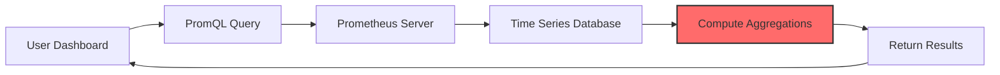
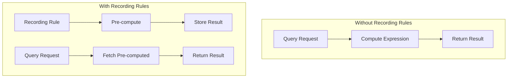
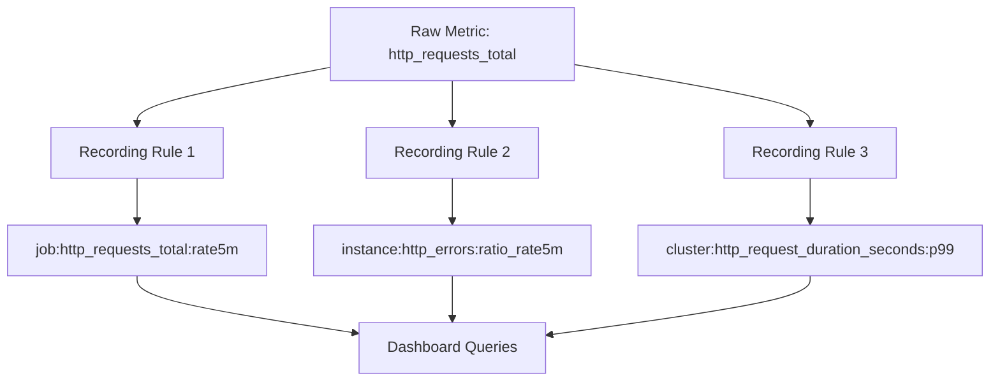
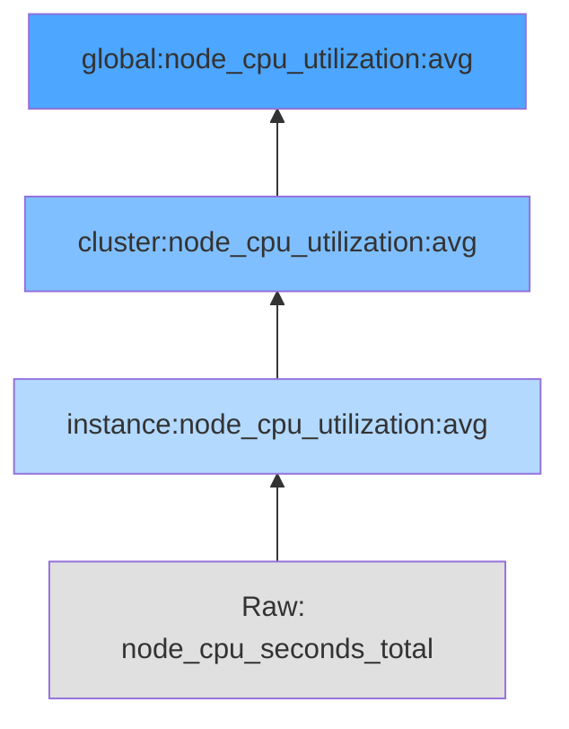
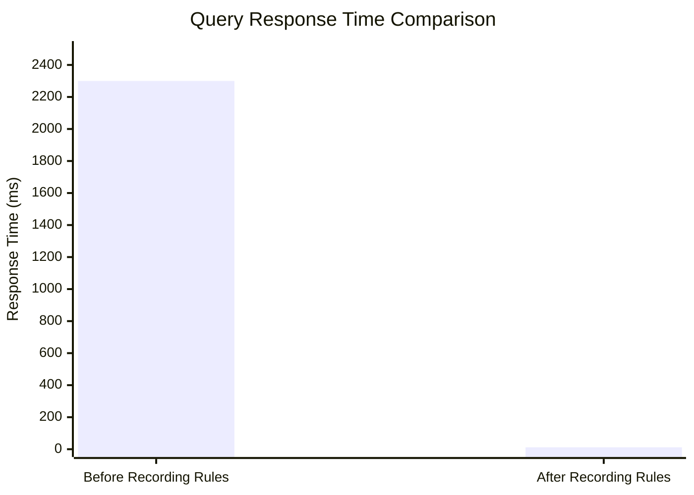

# How to Build Prometheus Recording Rule Optimization

Author: [nawazdhandala](https://github.com/nawazdhandala)

Tags: Prometheus, Recording Rules, Optimization, Performance

Description: Learn to implement Prometheus recording rules for query optimization with pre-computation, naming conventions, and evaluation strategies.

---

## Introduction

Prometheus recording rules are one of the most powerful yet underutilized features for optimizing query performance. When your Prometheus instance starts handling thousands of time series and complex queries, dashboard load times can degrade significantly. Recording rules solve this by pre-computing frequently used or computationally expensive expressions and storing the results as new time series.

In this guide, we will explore how to build and optimize Prometheus recording rules to dramatically improve query performance while maintaining data accuracy and system stability.

## Understanding the Problem

Before diving into recording rules, let us understand why query performance degrades.



The computation step (shown in red) happens on every query. For complex aggregations over large time ranges, this can take seconds or even minutes.

## What Are Recording Rules?

Recording rules allow you to pre-compute frequently needed or computationally expensive expressions and save their results as a new set of time series. Querying the pre-computed result is then much faster than executing the original expression every time.



## Recording Rule Syntax

Recording rules are defined in YAML configuration files. Here is the basic structure:

```yaml
groups:
  - name: example_recording_rules
    interval: 30s
    rules:
      - record: job:http_requests_total:rate5m
        expr: sum by (job) (rate(http_requests_total[5m]))
        labels:
          aggregation: "rate5m"
```

Let us break down each component:

### Group Configuration

```yaml
groups:
  - name: my_rules          # Unique name for the rule group
    interval: 30s           # How often rules in this group are evaluated
    limit: 1000             # Optional: max series this group can produce
    rules:                  # List of recording rules
      - ...
```

### Rule Definition

```yaml
- record: metric_name       # Name of the new metric to create
  expr: promql_expression   # The PromQL expression to evaluate
  labels:                   # Optional: additional labels to add
    team: "platform"
```

## Naming Conventions

Prometheus recommends a specific naming convention for recording rules that makes them easy to identify and understand:

```
level:metric:operations
```

Where:
- **level**: The aggregation level (e.g., job, instance, namespace)
- **metric**: The base metric name
- **operations**: The operations applied (e.g., rate5m, sum, avg)

### Examples of Good Naming

```yaml
groups:
  - name: http_recording_rules
    rules:
      # Per-job request rate
      - record: job:http_requests_total:rate5m
        expr: sum by (job) (rate(http_requests_total[5m]))

      # Per-instance error ratio
      - record: instance:http_errors:ratio_rate5m
        expr: |
          sum by (instance) (rate(http_requests_total{status=~"5.."}[5m]))
          /
          sum by (instance) (rate(http_requests_total[5m]))

      # Cluster-wide latency percentiles
      - record: cluster:http_request_duration_seconds:p99
        expr: histogram_quantile(0.99, sum by (le) (rate(http_request_duration_seconds_bucket[5m])))
```



## Evaluation Intervals

Choosing the right evaluation interval is critical for balancing freshness with resource usage.

### Factors to Consider

| Factor | Shorter Interval | Longer Interval |
|--------|------------------|-----------------|
| Data freshness | Better | Worse |
| CPU usage | Higher | Lower |
| Storage usage | Higher | Lower |
| Query latency | Same | Same |

### Recommended Intervals

```yaml
groups:
  # High-priority alerting metrics - evaluate frequently
  - name: critical_metrics
    interval: 15s
    rules:
      - record: job:service_availability:ratio
        expr: avg by (job) (up)

  # Standard dashboard metrics - moderate frequency
  - name: dashboard_metrics
    interval: 30s
    rules:
      - record: job:http_requests_total:rate5m
        expr: sum by (job) (rate(http_requests_total[5m]))

  # Long-term trending metrics - less frequent
  - name: trending_metrics
    interval: 2m
    rules:
      - record: job:http_requests_total:rate1h
        expr: sum by (job) (rate(http_requests_total[1h]))
```



```mermaid
gantt
    title Recording Rule Evaluation Timeline
    dateFormat X
    axisFormat %s

    section Critical (15s)
    Evaluate :0, 15
    Evaluate :15, 15
    Evaluate :30, 15
    Evaluate :45, 15

    section Dashboard (30s)
    Evaluate :0, 30
    Evaluate :30, 30

    section Trending (2m)
    Evaluate :0, 120
```

## Practical Use Cases

### Use Case 1: Aggregating High-Cardinality Metrics

When you have metrics with many label values, aggregating them reduces query complexity.

```yaml
groups:
  - name: high_cardinality_aggregations
    interval: 30s
    rules:
      # Original metric has user_id label with millions of values
      # Aggregate to useful dimensions only
      - record: endpoint:api_latency_seconds:avg
        expr: avg by (endpoint, method) (api_latency_seconds)

      - record: region:api_requests_total:rate5m
        expr: sum by (region) (rate(api_requests_total[5m]))
```

### Use Case 2: Pre-computing Histogram Quantiles

Histogram quantile calculations are expensive. Pre-compute them:

```yaml
groups:
  - name: latency_percentiles
    interval: 30s
    rules:
      - record: job:http_request_duration_seconds:p50
        expr: histogram_quantile(0.50, sum by (job, le) (rate(http_request_duration_seconds_bucket[5m])))

      - record: job:http_request_duration_seconds:p90
        expr: histogram_quantile(0.90, sum by (job, le) (rate(http_request_duration_seconds_bucket[5m])))

      - record: job:http_request_duration_seconds:p99
        expr: histogram_quantile(0.99, sum by (job, le) (rate(http_request_duration_seconds_bucket[5m])))
```

### Use Case 3: Building Hierarchical Aggregations

Create a hierarchy of aggregations that build on each other:

```yaml
groups:
  - name: hierarchical_aggregations
    interval: 30s
    rules:
      # Level 1: Per-instance metrics
      - record: instance:node_cpu_utilization:avg
        expr: 1 - avg by (instance) (rate(node_cpu_seconds_total{mode="idle"}[5m]))

      # Level 2: Per-cluster metrics (uses Level 1)
      - record: cluster:node_cpu_utilization:avg
        expr: avg by (cluster) (instance:node_cpu_utilization:avg)

      # Level 3: Global metrics (uses Level 2)
      - record: global:node_cpu_utilization:avg
        expr: avg(cluster:node_cpu_utilization:avg)
```



### Use Case 4: SLI and SLO Calculations

Pre-compute Service Level Indicators for SLO dashboards:

```yaml
groups:
  - name: sli_calculations
    interval: 30s
    rules:
      # Availability SLI
      - record: service:availability:ratio_rate5m
        expr: |
          sum by (service) (rate(http_requests_total{status!~"5.."}[5m]))
          /
          sum by (service) (rate(http_requests_total[5m]))

      # Latency SLI (percentage of requests under threshold)
      - record: service:latency_sli:ratio_rate5m
        expr: |
          sum by (service) (rate(http_request_duration_seconds_bucket{le="0.3"}[5m]))
          /
          sum by (service) (rate(http_request_duration_seconds_count[5m]))

      # Error budget remaining
      - record: service:error_budget_remaining:ratio
        expr: |
          1 - (
            (1 - service:availability:ratio_rate5m)
            /
            (1 - 0.999)
          )
```

## Configuration Best Practices

### Organizing Rule Files

Structure your rule files logically:

```
/etc/prometheus/rules/
    recording_rules/
        infrastructure.yml
        application.yml
        sli_slo.yml
    alerting_rules/
        critical_alerts.yml
        warning_alerts.yml
```

### Prometheus Configuration

Reference rule files in your main configuration:

```yaml
# prometheus.yml
global:
  scrape_interval: 15s
  evaluation_interval: 15s

rule_files:
  - /etc/prometheus/rules/recording_rules/*.yml
  - /etc/prometheus/rules/alerting_rules/*.yml
```

### Validating Rules

Always validate your rules before deploying:

```bash
# Using promtool (included with Prometheus)
promtool check rules /etc/prometheus/rules/recording_rules/*.yml

# Example output for valid rules
Checking /etc/prometheus/rules/recording_rules/infrastructure.yml
  SUCCESS: 5 rules found

# Example output with errors
Checking /etc/prometheus/rules/recording_rules/broken.yml
  FAILED:
    group "my_rules", rule 1, "bad:metric:name": could not parse expression: unexpected character: '!'
```

## Performance Comparison

Let us look at a real-world example of query performance improvement.

### Before Recording Rules

```promql
# This query executes on every dashboard load
histogram_quantile(0.99,
  sum by (service, le) (
    rate(http_request_duration_seconds_bucket{environment="production"}[5m])
  )
)
```

**Query time**: 2.3 seconds (scanning 50,000 time series)

### After Recording Rules

```yaml
# Pre-computed recording rule
- record: service:http_request_duration_seconds:p99_rate5m
  expr: |
    histogram_quantile(0.99,
      sum by (service, le) (
        rate(http_request_duration_seconds_bucket{environment="production"}[5m])
      )
    )
```

```promql
# Dashboard query now simply fetches the pre-computed result
service:http_request_duration_seconds:p99_rate5m
```

**Query time**: 12 milliseconds (scanning 10 time series)



## Monitoring Your Recording Rules

Track the health and performance of your recording rules:

```yaml
groups:
  - name: recording_rule_monitoring
    interval: 30s
    rules:
      # Track evaluation duration
      - record: prometheus:rule_evaluation_duration_seconds:p99
        expr: |
          histogram_quantile(0.99,
            sum by (rule_group) (
              rate(prometheus_rule_evaluation_duration_seconds_bucket[5m])
            )
          )

      # Track rule evaluation failures
      - record: prometheus:rule_evaluation_failures:rate5m
        expr: sum by (rule_group) (rate(prometheus_rule_evaluation_failures_total[5m]))
```

### Key Metrics to Watch

| Metric | Description | Warning Threshold |
|--------|-------------|-------------------|
| `prometheus_rule_evaluation_duration_seconds` | Time taken to evaluate rule groups | > 50% of interval |
| `prometheus_rule_evaluation_failures_total` | Number of failed rule evaluations | > 0 |
| `prometheus_rule_group_last_evaluation_timestamp_seconds` | Last successful evaluation | Staleness > 2x interval |

## Common Pitfalls and Solutions

### Pitfall 1: Creating Too Many Time Series

Recording rules can accidentally create cardinality explosions:

```yaml
# BAD: This preserves all labels, potentially creating millions of series
- record: job:http_requests:rate5m
  expr: rate(http_requests_total[5m])

# GOOD: Explicitly aggregate to reduce cardinality
- record: job:http_requests_total:rate5m
  expr: sum by (job) (rate(http_requests_total[5m]))
```

### Pitfall 2: Evaluation Interval Mismatches

```yaml
# BAD: 1-minute evaluation with 30-second rate window creates gaps
groups:
  - name: mismatched_intervals
    interval: 1m
    rules:
      - record: job:requests:rate30s
        expr: rate(requests_total[30s])

# GOOD: Rate window should be at least 4x the evaluation interval
groups:
  - name: matched_intervals
    interval: 30s
    rules:
      - record: job:requests:rate5m
        expr: sum by (job) (rate(requests_total[5m]))
```

### Pitfall 3: Circular Dependencies

```yaml
# BAD: Rule B depends on Rule A, but they are in different groups
# with different intervals, causing inconsistent data
groups:
  - name: group_a
    interval: 15s
    rules:
      - record: metric_a
        expr: sum(some_metric)

  - name: group_b
    interval: 30s
    rules:
      - record: metric_b
        expr: metric_a * 2

# GOOD: Keep dependent rules in the same group
groups:
  - name: dependent_rules
    interval: 30s
    rules:
      - record: metric_a
        expr: sum(some_metric)
      - record: metric_b
        expr: metric_a * 2
```

## Complete Example Configuration

Here is a comprehensive recording rules configuration for a typical microservices environment:

```yaml
# /etc/prometheus/rules/recording_rules/microservices.yml
groups:
  # Request rate and throughput metrics
  - name: request_metrics
    interval: 30s
    rules:
      - record: service:http_requests_total:rate5m
        expr: sum by (service, method, status_code) (rate(http_requests_total[5m]))

      - record: service:http_requests_total:rate1h
        expr: sum by (service) (rate(http_requests_total[1h]))

      - record: cluster:http_requests_total:rate5m
        expr: sum(rate(http_requests_total[5m]))

  # Latency metrics
  - name: latency_metrics
    interval: 30s
    rules:
      - record: service:http_request_duration_seconds:p50
        expr: |
          histogram_quantile(0.50,
            sum by (service, le) (rate(http_request_duration_seconds_bucket[5m]))
          )

      - record: service:http_request_duration_seconds:p95
        expr: |
          histogram_quantile(0.95,
            sum by (service, le) (rate(http_request_duration_seconds_bucket[5m]))
          )

      - record: service:http_request_duration_seconds:p99
        expr: |
          histogram_quantile(0.99,
            sum by (service, le) (rate(http_request_duration_seconds_bucket[5m]))
          )

  # Error metrics
  - name: error_metrics
    interval: 30s
    rules:
      - record: service:http_errors_total:rate5m
        expr: sum by (service) (rate(http_requests_total{status_code=~"5.."}[5m]))

      - record: service:http_error_ratio:rate5m
        expr: |
          service:http_errors_total:rate5m
          /
          sum by (service) (service:http_requests_total:rate5m)

  # Resource utilization
  - name: resource_metrics
    interval: 1m
    rules:
      - record: service:container_cpu_usage:avg
        expr: avg by (service) (rate(container_cpu_usage_seconds_total[5m]))

      - record: service:container_memory_usage_bytes:avg
        expr: avg by (service) (container_memory_usage_bytes)

      - record: service:container_memory_utilization:ratio
        expr: |
          service:container_memory_usage_bytes:avg
          /
          avg by (service) (container_spec_memory_limit_bytes)

  # SLI/SLO metrics
  - name: sli_metrics
    interval: 30s
    rules:
      - record: service:sli_availability:ratio_rate5m
        expr: |
          1 - (
            sum by (service) (rate(http_requests_total{status_code=~"5.."}[5m]))
            /
            sum by (service) (rate(http_requests_total[5m]))
          )

      - record: service:sli_latency:ratio_rate5m
        expr: |
          sum by (service) (rate(http_request_duration_seconds_bucket{le="0.5"}[5m]))
          /
          sum by (service) (rate(http_request_duration_seconds_count[5m]))
```

## Conclusion

Prometheus recording rules are essential for maintaining fast query performance as your monitoring infrastructure scales. By pre-computing expensive expressions and following consistent naming conventions, you can reduce dashboard load times from seconds to milliseconds while also simplifying your PromQL queries.

Key takeaways:
- Use recording rules for frequently queried or computationally expensive expressions
- Follow the `level:metric:operations` naming convention
- Choose evaluation intervals based on data freshness requirements
- Validate rules with `promtool` before deployment
- Monitor your recording rules to catch issues early

Start with your slowest dashboard queries, create recording rules for them, and measure the improvement. You will likely see significant performance gains that make recording rules an indispensable part of your Prometheus deployment.

## Further Reading

- [Prometheus Recording Rules Documentation](https://prometheus.io/docs/prometheus/latest/configuration/recording_rules/)
- [PromQL Best Practices](https://prometheus.io/docs/practices/rules/)
- [Prometheus Naming Conventions](https://prometheus.io/docs/practices/naming/)
