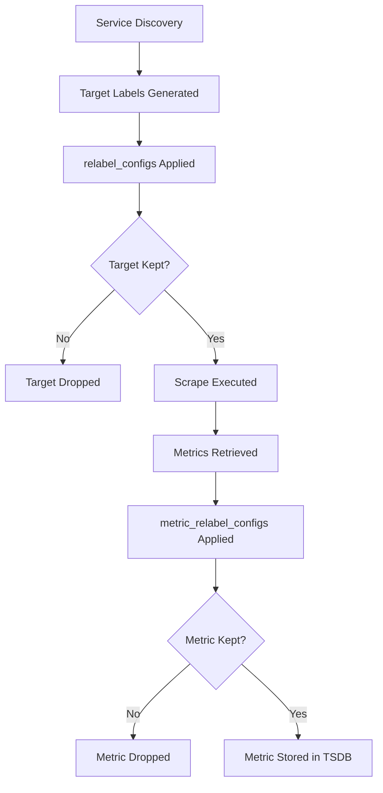
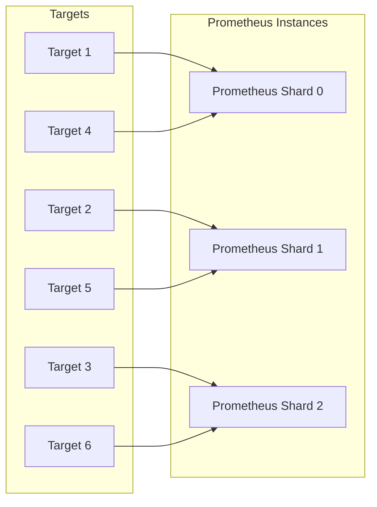

# How to Implement Prometheus Relabeling Advanced

Author: [nawazdhandala](https://github.com/nawazdhandala)

Tags: Prometheus, Relabeling, Monitoring, Configuration

Description: Master advanced Prometheus relabeling techniques to transform, filter, and route metrics for optimized observability pipelines.

---

> Relabeling is the Swiss Army knife of Prometheus. Master it, and you control the shape, volume, and quality of every metric in your pipeline.

Prometheus relabeling is one of the most powerful yet underutilized features in the monitoring ecosystem. While basic relabeling handles simple label manipulation, advanced techniques let you build sophisticated metric pipelines that filter noise, enrich context, route data intelligently, and reduce cardinality before it becomes a problem.

This guide covers advanced relabeling patterns with practical examples you can apply immediately to production Prometheus deployments.

---

## Table of Contents

1. Relabeling Fundamentals Recap
2. The Relabeling Pipeline
3. Advanced Action Types
4. Multi-Stage Relabeling Patterns
5. Metric Filtering and Dropping
6. Dynamic Label Generation
7. Hashmod for Sharding
8. Regex Mastery
9. Real-World Use Cases
10. Debugging Relabeling Rules
11. Performance Considerations
12. Common Pitfalls and Solutions

---

## 1. Relabeling Fundamentals Recap

Relabeling in Prometheus occurs at two distinct phases:

| Phase | Config Block | When It Runs | What It Affects |
|-------|--------------|--------------|-----------------|
| Service Discovery | `relabel_configs` | Before scrape | Target labels (which endpoints to scrape) |
| Metric Ingestion | `metric_relabel_configs` | After scrape | Metric labels (what gets stored) |

Key insight: `relabel_configs` shapes your scrape targets. `metric_relabel_configs` shapes your stored data. Confusing these is a common source of bugs.

---

## 2. The Relabeling Pipeline

Understanding the relabeling pipeline flow is essential for advanced configurations.



Each relabel_config rule is applied sequentially. The output of one rule becomes the input of the next. This sequential nature enables powerful multi-stage transformations.

---

## 3. Advanced Action Types

Prometheus supports several relabeling actions beyond basic `replace`.

### Action Reference Table

| Action | Purpose | Common Use Case |
|--------|---------|-----------------|
| `replace` | Replace label value using regex capture groups | Extracting parts of labels |
| `keep` | Keep targets/metrics matching regex | Filtering to specific services |
| `drop` | Drop targets/metrics matching regex | Removing unwanted data |
| `hashmod` | Set label to modulus of hash | Sharding across Prometheus instances |
| `labelmap` | Copy labels matching regex to new names | Renaming label prefixes |
| `labeldrop` | Drop labels matching regex | Removing high-cardinality labels |
| `labelkeep` | Keep only labels matching regex | Strict label allowlisting |
| `lowercase` | Convert label value to lowercase | Normalizing inconsistent labels |
| `uppercase` | Convert label value to uppercase | Standardizing label formats |

### Replace with Capture Groups

Extract structured data from complex label values.

```yaml
relabel_configs:
  # Extract datacenter and rack from a compound node name
  # Input: __meta_kubernetes_node_name = "dc1-rack42-node007"
  - source_labels: [__meta_kubernetes_node_name]
    regex: '([^-]+)-([^-]+)-(.+)'
    target_label: datacenter
    replacement: '${1}'
  - source_labels: [__meta_kubernetes_node_name]
    regex: '([^-]+)-([^-]+)-(.+)'
    target_label: rack
    replacement: '${2}'
  - source_labels: [__meta_kubernetes_node_name]
    regex: '([^-]+)-([^-]+)-(.+)'
    target_label: node
    replacement: '${3}'
```

### Labelmap for Bulk Renaming

Rename multiple labels matching a pattern in one rule.

```yaml
relabel_configs:
  # Convert all __meta_kubernetes_pod_label_* to pod_label_*
  - action: labelmap
    regex: '__meta_kubernetes_pod_label_(.+)'
    replacement: 'pod_label_${1}'
```

---

## 4. Multi-Stage Relabeling Patterns

Chain multiple rules to build complex transformations.

### Pattern: Conditional Label Assignment

Assign different values based on matching conditions.

```yaml
relabel_configs:
  # Default tier to "standard"
  - target_label: tier
    replacement: 'standard'

  # Override to "critical" for production namespace
  - source_labels: [__meta_kubernetes_namespace]
    regex: 'production'
    target_label: tier
    replacement: 'critical'

  # Override to "critical" for any *-critical namespace
  - source_labels: [__meta_kubernetes_namespace]
    regex: '.*-critical'
    target_label: tier
    replacement: 'critical'
```

### Pattern: Composite Label Creation

Combine multiple source labels into a single derived label.

```yaml
relabel_configs:
  # Create a unique identifier: namespace/deployment/pod
  - source_labels: [__meta_kubernetes_namespace, __meta_kubernetes_pod_controller_name, __meta_kubernetes_pod_name]
    separator: '/'
    target_label: workload_id
    replacement: '${1}/${2}/${3}'
```

---

## 5. Metric Filtering and Dropping

Reduce storage costs and query noise by filtering at ingestion time.

### Drop High-Cardinality Metrics

Identify and drop metrics that explode cardinality.

```yaml
metric_relabel_configs:
  # Drop histogram buckets with too many values
  - source_labels: [__name__]
    regex: '.*_bucket'
    action: drop

  # Alternatively, drop specific problematic metrics
  - source_labels: [__name__]
    regex: 'http_request_duration_seconds_bucket|process_.*'
    action: drop
```

### Keep Only Essential Metrics

Allowlist approach for strict control.

```yaml
metric_relabel_configs:
  # Keep only metrics matching our allowlist
  - source_labels: [__name__]
    regex: '(up|scrape_duration_seconds|http_requests_total|node_cpu_seconds_total|node_memory_.*)'
    action: keep
```

### Drop Labels to Reduce Cardinality

Remove high-cardinality labels while keeping the metric.

```yaml
metric_relabel_configs:
  # Remove instance-specific labels from aggregated metrics
  - regex: '(pod|container_id|instance)'
    action: labeldrop
```

---

## 6. Dynamic Label Generation

Generate labels dynamically based on existing data.

### Environment Detection from Namespace

```yaml
relabel_configs:
  # Detect environment from namespace naming convention
  - source_labels: [__meta_kubernetes_namespace]
    regex: '(prod|production).*'
    target_label: environment
    replacement: 'production'
  - source_labels: [__meta_kubernetes_namespace]
    regex: '(staging|stage).*'
    target_label: environment
    replacement: 'staging'
  - source_labels: [__meta_kubernetes_namespace]
    regex: '(dev|development).*'
    target_label: environment
    replacement: 'development'
```

### Service Discovery Label Enrichment

Add context from annotations and labels.

```yaml
relabel_configs:
  # Extract team ownership from pod annotation
  - source_labels: [__meta_kubernetes_pod_annotation_team]
    regex: '(.+)'
    target_label: team
    replacement: '${1}'

  # Default team if annotation missing
  - source_labels: [team]
    regex: '^$'
    target_label: team
    replacement: 'platform'
```

---

## 7. Hashmod for Sharding

Distribute scrape load across multiple Prometheus instances using consistent hashing.

### Sharding Architecture



### Hashmod Configuration

Each Prometheus instance uses the same config but with different `__shard` value.

```yaml
# prometheus-shard-0.yml
global:
  external_labels:
    prometheus_shard: '0'

scrape_configs:
  - job_name: 'kubernetes-pods'
    kubernetes_sd_configs:
      - role: pod
    relabel_configs:
      # Generate hash from target address
      - source_labels: [__address__]
        modulus: 3
        target_label: __shard
        action: hashmod

      # Keep only targets assigned to this shard
      - source_labels: [__shard]
        regex: '0'
        action: keep
```

For shard 1, change the keep regex to `'1'`, and for shard 2, change it to `'2'`.

---

## 8. Regex Mastery

Powerful regex patterns for complex relabeling scenarios.

### Negative Lookahead Simulation

Prometheus regex does not support lookaheads, but you can simulate them.

```yaml
relabel_configs:
  # Keep all namespaces EXCEPT kube-system and monitoring
  - source_labels: [__meta_kubernetes_namespace]
    regex: '(kube-system|monitoring)'
    action: drop
```

### Extracting from URL Paths

Parse structured paths into labels.

```yaml
relabel_configs:
  # Extract from metrics path: /api/v2/users/123/orders
  - source_labels: [__metrics_path__]
    regex: '/api/(v[0-9]+)/([^/]+)/.*'
    target_label: api_version
    replacement: '${1}'
  - source_labels: [__metrics_path__]
    regex: '/api/(v[0-9]+)/([^/]+)/.*'
    target_label: resource_type
    replacement: '${2}'
```

### Case-Insensitive Matching

Use character classes for case-insensitive patterns.

```yaml
relabel_configs:
  # Match Production, production, PRODUCTION
  - source_labels: [__meta_kubernetes_namespace]
    regex: '[Pp][Rr][Oo][Dd][Uu][Cc][Tt][Ii][Oo][Nn]'
    target_label: environment
    replacement: 'production'
```

Or use the `lowercase` action first.

```yaml
relabel_configs:
  # Normalize to lowercase first
  - source_labels: [__meta_kubernetes_namespace]
    target_label: __tmp_namespace_lower
    action: lowercase
  # Then match lowercase
  - source_labels: [__tmp_namespace_lower]
    regex: 'production'
    target_label: environment
    replacement: 'production'
```

---

## 9. Real-World Use Cases

### Use Case 1: Multi-Tenant Metrics Isolation

Route metrics from different tenants to appropriate storage.

```yaml
relabel_configs:
  # Extract tenant from namespace (format: tenant-<name>-<env>)
  - source_labels: [__meta_kubernetes_namespace]
    regex: 'tenant-([^-]+)-.*'
    target_label: tenant
    replacement: '${1}'

  # Add tenant-specific scrape interval label for remote_write routing
  - source_labels: [tenant]
    regex: '(enterprise|premium)'
    target_label: __scrape_interval__
    replacement: '15s'
  - source_labels: [tenant]
    regex: '(free|basic)'
    target_label: __scrape_interval__
    replacement: '60s'
```

### Use Case 2: Kubernetes Service Mesh Metrics

Clean up Istio/Envoy metrics for better usability.

```yaml
metric_relabel_configs:
  # Simplify Istio metric names
  - source_labels: [__name__]
    regex: 'istio_requests_total'
    target_label: __name__
    replacement: 'http_requests_total'

  # Extract clean service names from Istio labels
  - source_labels: [destination_service_name]
    regex: '([^.]+)\..*'
    target_label: service
    replacement: '${1}'

  # Drop verbose Istio internal labels
  - regex: '(source_principal|destination_principal|request_protocol|connection_security_policy)'
    action: labeldrop
```

### Use Case 3: Cost Attribution Labels

Add business context for chargeback and cost allocation.

```yaml
relabel_configs:
  # Map namespace to cost center using prefix convention
  - source_labels: [__meta_kubernetes_namespace]
    regex: 'cc([0-9]+)-.*'
    target_label: cost_center
    replacement: '${1}'

  # Extract business unit from pod labels
  - source_labels: [__meta_kubernetes_pod_label_business_unit]
    regex: '(.+)'
    target_label: business_unit
    replacement: '${1}'

  # Default cost center for unmapped namespaces
  - source_labels: [cost_center]
    regex: '^$'
    target_label: cost_center
    replacement: 'shared-infrastructure'
```

---

## 10. Debugging Relabeling Rules

Troubleshooting relabeling issues can be challenging. Here are techniques to debug effectively.

### Enable Debug Logging

Start Prometheus with debug logging for relabeling.

```bash
prometheus --log.level=debug --config.file=prometheus.yml
```

### Use the Prometheus UI

Navigate to Status > Targets to see the final labels after relabeling. Compare discovered labels vs active labels.

### Test Rules with promtool

Validate configuration syntax before deploying.

```bash
promtool check config prometheus.yml
```

### Temporary Debug Labels

Add temporary labels to trace rule execution.

```yaml
relabel_configs:
  # Debug: preserve original value
  - source_labels: [__meta_kubernetes_namespace]
    target_label: __debug_original_namespace

  # Your transformation rule
  - source_labels: [__meta_kubernetes_namespace]
    regex: '([^-]+)-.*'
    target_label: environment
    replacement: '${1}'

  # Debug: show what matched
  - source_labels: [__meta_kubernetes_namespace]
    regex: '([^-]+)-.*'
    target_label: __debug_matched_group
    replacement: '${1}'
```

Remember to remove debug labels before production deployment.

---

## 11. Performance Considerations

Relabeling has computational cost. Optimize for scale.

### Rule Ordering Matters

Place drop rules early to skip unnecessary processing.

```yaml
relabel_configs:
  # Drop first - no further processing needed
  - source_labels: [__meta_kubernetes_namespace]
    regex: 'kube-system'
    action: drop

  # Expensive transformations only run on kept targets
  - source_labels: [__meta_kubernetes_pod_annotation_prometheus_io_path]
    regex: '(.+)'
    target_label: __metrics_path__
    replacement: '${1}'
```

### Avoid Regex When Possible

Simple equality checks are faster than regex.

```yaml
# Slower - uses regex engine
- source_labels: [__meta_kubernetes_namespace]
  regex: 'production'
  action: keep

# Equivalent but explicit
- source_labels: [__meta_kubernetes_namespace]
  regex: '^production$'
  action: keep
```

### Cardinality Impact

Monitor the impact of relabeling on cardinality.

```promql
# Check label cardinality
count by (__name__)(count by (__name__, instance)({__name__=~".+"}))

# Monitor scrape performance
scrape_duration_seconds{job="your-job"}
```

---

## 12. Common Pitfalls and Solutions

### Pitfall: Labels Not Appearing

**Symptom**: Relabeled labels do not show up on metrics.

**Cause**: Using `relabel_configs` when you meant `metric_relabel_configs`.

**Solution**: Remember that `relabel_configs` affects target selection, `metric_relabel_configs` affects stored metrics.

### Pitfall: Regex Not Matching

**Symptom**: Rules seem to have no effect.

**Cause**: Prometheus regex must match the entire string by default.

**Solution**: Use `.*` anchors for partial matching.

```yaml
# This will NOT match "my-production-namespace"
regex: 'production'

# This WILL match
regex: '.*production.*'
```

### Pitfall: Temporary Labels Persisted

**Symptom**: Labels starting with `__` appearing in stored metrics.

**Cause**: Only labels starting with `__` are dropped before storage for relabel_configs. In metric_relabel_configs, you must handle them explicitly.

**Solution**: Use `labeldrop` to remove temporary labels.

```yaml
metric_relabel_configs:
  - regex: '__.*'
    action: labeldrop
```

### Pitfall: Empty Replacement

**Symptom**: Label becomes empty string instead of being dropped.

**Cause**: Setting a label to empty string does not remove it.

**Solution**: Use `labeldrop` action to remove labels.

---

## Complete Example: Production Configuration

Here is a comprehensive production-ready relabeling configuration for Kubernetes.

```yaml
scrape_configs:
  - job_name: 'kubernetes-pods'
    kubernetes_sd_configs:
      - role: pod

    relabel_configs:
      # Only scrape pods with prometheus.io/scrape annotation
      - source_labels: [__meta_kubernetes_pod_annotation_prometheus_io_scrape]
        regex: 'true'
        action: keep

      # Drop system namespaces early
      - source_labels: [__meta_kubernetes_namespace]
        regex: '(kube-system|kube-public|kube-node-lease)'
        action: drop

      # Use custom port if specified
      - source_labels: [__address__, __meta_kubernetes_pod_annotation_prometheus_io_port]
        regex: '([^:]+)(?::\d+)?;(\d+)'
        target_label: __address__
        replacement: '${1}:${2}'

      # Use custom path if specified
      - source_labels: [__meta_kubernetes_pod_annotation_prometheus_io_path]
        regex: '(.+)'
        target_label: __metrics_path__
        replacement: '${1}'

      # Standard labels
      - source_labels: [__meta_kubernetes_namespace]
        target_label: namespace
      - source_labels: [__meta_kubernetes_pod_name]
        target_label: pod
      - source_labels: [__meta_kubernetes_pod_container_name]
        target_label: container

      # Extract app name from standard labels
      - source_labels: [__meta_kubernetes_pod_label_app_kubernetes_io_name]
        regex: '(.+)'
        target_label: app
        replacement: '${1}'
      - source_labels: [__meta_kubernetes_pod_label_app]
        regex: '(.+)'
        target_label: app
        replacement: '${1}'

      # Environment from namespace prefix
      - source_labels: [__meta_kubernetes_namespace]
        regex: '(prod|production).*'
        target_label: environment
        replacement: 'production'
      - source_labels: [__meta_kubernetes_namespace]
        regex: '(staging|stage).*'
        target_label: environment
        replacement: 'staging'
      - source_labels: [environment]
        regex: '^$'
        target_label: environment
        replacement: 'development'

      # Team ownership from annotation
      - source_labels: [__meta_kubernetes_pod_annotation_team]
        regex: '(.+)'
        target_label: team
        replacement: '${1}'
      - source_labels: [team]
        regex: '^$'
        target_label: team
        replacement: 'platform'

    metric_relabel_configs:
      # Drop high-cardinality Go runtime metrics
      - source_labels: [__name__]
        regex: 'go_gc_.*|go_memstats_.*'
        action: drop

      # Simplify histogram metrics if needed
      - source_labels: [__name__, le]
        regex: '(.+_bucket);(\+Inf|0\.005|0\.01|0\.025)'
        action: drop

      # Remove pod UID from labels (high cardinality)
      - regex: 'pod_uid'
        action: labeldrop
```

---

## Key Takeaways

1. **Understand the two phases**: `relabel_configs` for target selection, `metric_relabel_configs` for metric transformation.

2. **Order matters**: Place drop rules early, expensive transformations later.

3. **Use hashmod for scaling**: Shard scrape load across multiple Prometheus instances.

4. **Reduce cardinality proactively**: Drop high-cardinality labels and metrics at ingestion.

5. **Test before deploying**: Use promtool and debug labels to validate rules.

6. **Document your patterns**: Complex relabeling chains need documentation for maintainability.

Mastering relabeling transforms Prometheus from a simple scraper into a sophisticated metrics pipeline. Take time to learn the patterns, and your observability infrastructure will be more efficient, cost-effective, and maintainable.

---

**Related Reading:**

- [What is OpenTelemetry Collector and Why Use One?](https://oneuptime.com/blog/post/2025-09-18-what-is-opentelemetry-collector-and-why-use-one/view)
- [How to Reduce Noise in OpenTelemetry](https://oneuptime.com/blog/post/2025-08-25-how-to-reduce-noise-in-opentelemetry/view)
- [SRE Metrics to Track](https://oneuptime.com/blog/post/2025-11-28-sre-metrics-to-track/view)
