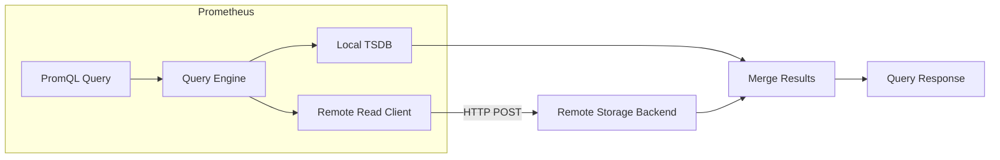
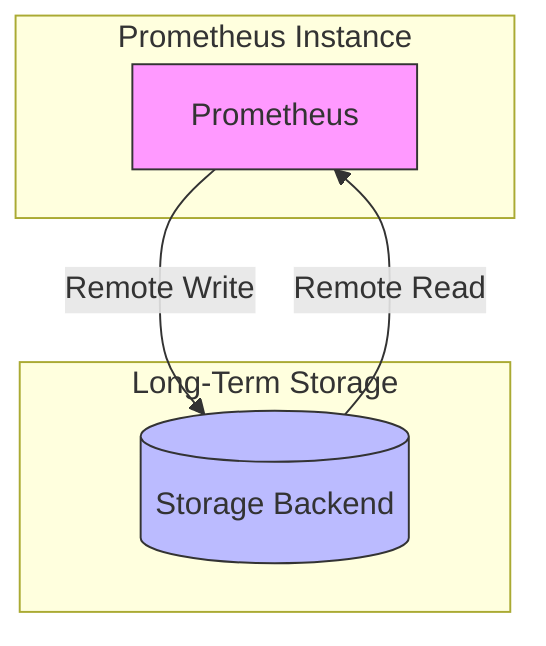
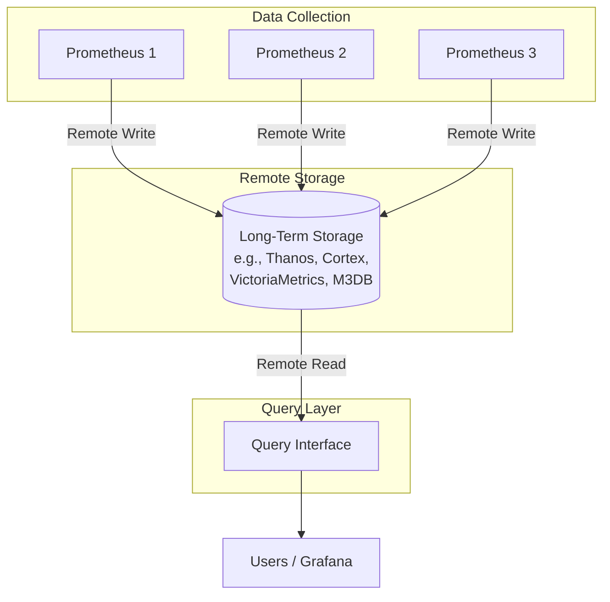
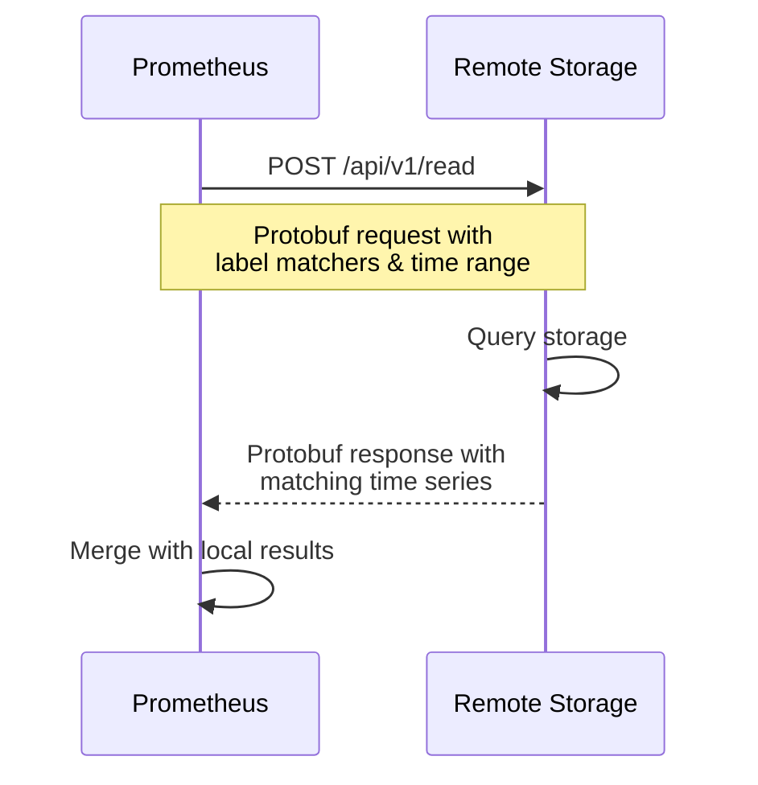

# How to Implement Prometheus Remote Read

Author: [nawazdhandala](https://github.com/nawazdhandala)

Tags: Prometheus, Remote-Storage, Long-Term-Storage, Monitoring

Description: A practical guide to implementing Prometheus remote read for querying metrics from external long-term storage backends.

---

Prometheus is excellent at scraping and storing time-series metrics locally, but its local storage has limits. By default, Prometheus retains data for 15 days. If you need to query historical metrics beyond that window, or if you want to federate queries across multiple Prometheus instances, you need **remote read**.

This post walks you through what remote read is, how it differs from remote write, the architecture behind it, and step-by-step implementation with practical examples.

---

## What is Prometheus Remote Read?

Remote read allows Prometheus to query metrics from external storage systems during PromQL evaluation. When you run a query, Prometheus can transparently fetch data from both its local TSDB and configured remote endpoints, merging results before returning them.

This is different from remote write, which pushes metrics out of Prometheus. Remote read pulls metrics back in at query time.



---

## Remote Write vs Remote Read

Understanding the difference between these two features is crucial:

| Aspect | Remote Write | Remote Read |
|--------|-------------|-------------|
| Direction | Push metrics out | Pull metrics in |
| Timing | Continuous streaming | On-demand at query time |
| Purpose | Long-term storage, replication | Query historical data |
| Performance Impact | Write path | Read path |
| Data Flow | Prometheus to Backend | Backend to Prometheus |

You typically use both together: remote write sends metrics to long-term storage, and remote read queries them back when needed.



---

## When to Use Remote Read

Remote read is valuable in several scenarios:

- **Long-term metric retention**: Query metrics older than your local retention period
- **Cross-cluster queries**: Access metrics from other Prometheus instances via a shared backend
- **Migration scenarios**: Gradually move to a new storage backend while maintaining query access
- **Disaster recovery**: Restore query capability from backed-up metrics
- **Cost optimization**: Keep local storage small while maintaining query access to historical data

---

## Architecture Overview

A typical remote read setup involves three components:



---

## The Remote Read Protocol

Prometheus remote read uses a simple HTTP-based protocol. The client (Prometheus) sends a POST request with a protobuf-encoded query, and the server responds with matching time series.

The request contains:
- Label matchers (which series to fetch)
- Start and end timestamps
- Optional hints for optimization

The response contains:
- Matching time series with their samples

Here is the basic request/response flow:



---

## Configuring Remote Read in Prometheus

Add the remote_read configuration to your prometheus.yml file. This example configures Prometheus to read from a Thanos Store Gateway:

```yaml
# prometheus.yml

global:
  scrape_interval: 15s
  evaluation_interval: 15s

remote_read:
  - url: "http://thanos-store-gateway:10901/api/v1/read"
    read_recent: false

    # Optional: Add authentication headers
    # headers:
    #   Authorization: "Bearer your-token"

    # Optional: Filter which queries use remote read
    # required_matchers:
    #   job: "production"
```

The key configuration options are:

| Option | Description | Default |
|--------|-------------|---------|
| url | Remote read endpoint URL | Required |
| read_recent | Also read recent data from remote | true |
| required_matchers | Only use remote read for matching queries | None |
| remote_timeout | Timeout for remote read requests | 1m |
| headers | Custom HTTP headers | None |
| basic_auth | Basic authentication credentials | None |
| tls_config | TLS configuration | None |

---

## Implementing a Remote Read Server

If you want to build your own remote read endpoint, you need to implement the Prometheus remote read API. Here is a Go implementation that reads from a hypothetical storage backend:

```go
package main

import (
    "io"
    "log"
    "net/http"

    "github.com/gogo/protobuf/proto"
    "github.com/golang/snappy"
    "github.com/prometheus/prometheus/prompb"
)

func remoteReadHandler(w http.ResponseWriter, r *http.Request) {
    // Read and decompress the request body
    compressed, err := io.ReadAll(r.Body)
    if err != nil {
        http.Error(w, err.Error(), http.StatusBadRequest)
        return
    }

    reqBuf, err := snappy.Decode(nil, compressed)
    if err != nil {
        http.Error(w, err.Error(), http.StatusBadRequest)
        return
    }

    // Unmarshal the protobuf request
    var req prompb.ReadRequest
    if err := proto.Unmarshal(reqBuf, &req); err != nil {
        http.Error(w, err.Error(), http.StatusBadRequest)
        return
    }

    // Process each query in the request
    resp := &prompb.ReadResponse{
        Results: make([]*prompb.QueryResult, len(req.Queries)),
    }

    for i, query := range req.Queries {
        // Convert label matchers and query your storage
        timeseries := queryStorage(query)
        resp.Results[i] = &prompb.QueryResult{
            Timeseries: timeseries,
        }
    }

    // Marshal and compress the response
    data, err := proto.Marshal(resp)
    if err != nil {
        http.Error(w, err.Error(), http.StatusInternalServerError)
        return
    }

    w.Header().Set("Content-Type", "application/x-protobuf")
    w.Header().Set("Content-Encoding", "snappy")
    w.Write(snappy.Encode(nil, data))
}

func queryStorage(query *prompb.Query) []*prompb.TimeSeries {
    // Implement your storage query logic here
    // This is where you fetch data from your backend

    // Example: Return a sample time series
    return []*prompb.TimeSeries{
        {
            Labels: []prompb.Label{
                {Name: "__name__", Value: "example_metric"},
                {Name: "instance", Value: "localhost:9090"},
            },
            Samples: []prompb.Sample{
                {Value: 42.0, Timestamp: query.StartTimestampMs},
                {Value: 43.0, Timestamp: query.EndTimestampMs},
            },
        },
    }
}

func main() {
    http.HandleFunc("/api/v1/read", remoteReadHandler)
    log.Println("Starting remote read server on :8080")
    log.Fatal(http.ListenAndServe(":8080", nil))
}
```

---

## Complete Example with VictoriaMetrics

VictoriaMetrics is a popular choice for Prometheus long-term storage. Here is a complete setup:

First, start VictoriaMetrics with remote read support enabled:

```bash
# Start VictoriaMetrics single-node
docker run -d \
  --name victoriametrics \
  -p 8428:8428 \
  -v /path/to/data:/victoria-metrics-data \
  victoriametrics/victoria-metrics:latest
```

Configure Prometheus to write and read from VictoriaMetrics:

```yaml
# prometheus.yml

global:
  scrape_interval: 15s

# Send metrics to VictoriaMetrics
remote_write:
  - url: "http://victoriametrics:8428/api/v1/write"

# Query metrics from VictoriaMetrics
remote_read:
  - url: "http://victoriametrics:8428/api/v1/read"
    read_recent: false

scrape_configs:
  - job_name: 'prometheus'
    static_configs:
      - targets: ['localhost:9090']
```

---

## Complete Example with Thanos

Thanos provides remote read through its Store Gateway. Here is a Docker Compose setup:

```yaml
# docker-compose.yml

version: '3.8'

services:
  prometheus:
    image: prom/prometheus:latest
    volumes:
      - ./prometheus.yml:/etc/prometheus/prometheus.yml
      - prometheus-data:/prometheus
    command:
      - '--config.file=/etc/prometheus/prometheus.yml'
      - '--storage.tsdb.path=/prometheus'
      - '--storage.tsdb.retention.time=2h'
    ports:
      - "9090:9090"

  thanos-sidecar:
    image: quay.io/thanos/thanos:latest
    command:
      - sidecar
      - --tsdb.path=/prometheus
      - --prometheus.url=http://prometheus:9090
      - --objstore.config-file=/etc/thanos/bucket.yml
    volumes:
      - prometheus-data:/prometheus
      - ./bucket.yml:/etc/thanos/bucket.yml

  thanos-store:
    image: quay.io/thanos/thanos:latest
    command:
      - store
      - --data-dir=/var/thanos/store
      - --objstore.config-file=/etc/thanos/bucket.yml
    volumes:
      - ./bucket.yml:/etc/thanos/bucket.yml

  thanos-query:
    image: quay.io/thanos/thanos:latest
    command:
      - query
      - --store=thanos-sidecar:10901
      - --store=thanos-store:10901
    ports:
      - "10902:10902"

volumes:
  prometheus-data:
```

The Prometheus configuration for this setup:

```yaml
# prometheus.yml

global:
  scrape_interval: 15s
  external_labels:
    cluster: 'production'
    replica: '0'

remote_read:
  - url: "http://thanos-query:10902/api/v1/read"
    read_recent: false

scrape_configs:
  - job_name: 'prometheus'
    static_configs:
      - targets: ['localhost:9090']
```

---

## Performance Considerations

Remote read can impact query performance. Here are best practices to optimize it:

**1. Use read_recent wisely**

Setting `read_recent: false` tells Prometheus to only use remote read for data outside its local retention window. This prevents duplicate queries.

```yaml
remote_read:
  - url: "http://remote-storage:8080/api/v1/read"
    read_recent: false  # Only read old data from remote
```

**2. Filter with required_matchers**

If only certain queries need remote read, use required_matchers to limit which queries hit the remote endpoint:

```yaml
remote_read:
  - url: "http://remote-storage:8080/api/v1/read"
    required_matchers:
      env: "production"  # Only queries with env="production" use remote read
```

**3. Set appropriate timeouts**

Long-running queries can tie up resources. Set reasonable timeouts:

```yaml
remote_read:
  - url: "http://remote-storage:8080/api/v1/read"
    remote_timeout: 30s
```

**4. Monitor remote read latency**

Prometheus exposes metrics about remote read performance:

```promql
# Average remote read duration
rate(prometheus_remote_storage_read_request_duration_seconds_sum[5m])
/
rate(prometheus_remote_storage_read_request_duration_seconds_count[5m])

# Remote read request rate
rate(prometheus_remote_storage_read_queries_total[5m])
```

---

## Troubleshooting Common Issues

**Connection refused errors**

Verify the remote endpoint is accessible from Prometheus:

```bash
# Test connectivity from Prometheus container
curl -X POST http://remote-storage:8080/api/v1/read
```

**Slow queries**

Check if remote read is causing slowdowns:

```promql
# Time spent in remote read
histogram_quantile(0.99,
  rate(prometheus_remote_storage_read_request_duration_seconds_bucket[5m])
)
```

**Empty results**

Ensure the time range in your query overlaps with data in remote storage. Also verify label matchers are correct.

**Authentication failures**

Check your auth configuration:

```yaml
remote_read:
  - url: "http://remote-storage:8080/api/v1/read"
    basic_auth:
      username: prometheus
      password_file: /etc/prometheus/password
```

---

## Security Best Practices

When exposing remote read endpoints:

- Use TLS to encrypt traffic between Prometheus and remote storage
- Implement authentication (basic auth, bearer tokens, or mTLS)
- Restrict network access to remote read endpoints
- Rate limit requests to prevent abuse

Example TLS configuration:

```yaml
remote_read:
  - url: "https://remote-storage:8080/api/v1/read"
    tls_config:
      ca_file: /etc/prometheus/ca.crt
      cert_file: /etc/prometheus/client.crt
      key_file: /etc/prometheus/client.key
      insecure_skip_verify: false
```

---

## How OneUptime Helps

OneUptime provides native support for Prometheus metrics through OpenTelemetry. You can:

- Send Prometheus metrics via OTLP for long-term storage
- Query historical metrics through a unified interface
- Set up alerts and SLOs on metrics from any source
- Correlate metrics with traces and logs

If you are looking for a unified observability platform that integrates with your Prometheus infrastructure, check out [OneUptime](https://oneuptime.com).

---

## Conclusion

Prometheus remote read extends your monitoring capabilities beyond local storage limits. By implementing remote read:

- You gain access to historical metrics beyond local retention
- You can federate queries across multiple storage backends
- You maintain flexibility to switch storage solutions

Start with a simple configuration, monitor performance metrics, and tune based on your query patterns. Whether you choose VictoriaMetrics, Thanos, Cortex, or build a custom solution, the remote read protocol provides a standardized way to extend Prometheus.

---

**Related Reading:**

- [What is OpenTelemetry Collector and Why Use One?](https://oneuptime.com/blog/post/2025-09-18-what-is-opentelemetry-collector-and-why-use-one/view)
- [Logs, Metrics & Traces: The Three Pillars of Observability](https://oneuptime.com/blog/post/2025-08-20-three-pillars-of-observability-logs-metrics-traces/view)
- [How to Collect OpenTelemetry Collector Internal Metrics](https://oneuptime.com/blog/post/2025-01-22-how-to-collect-opentelemetry-collector-internal-metrics/view)
