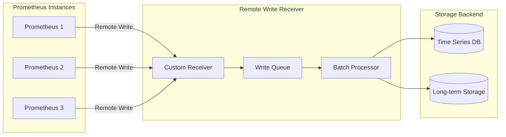
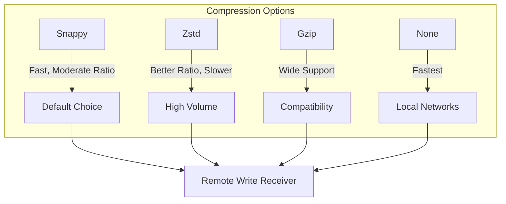
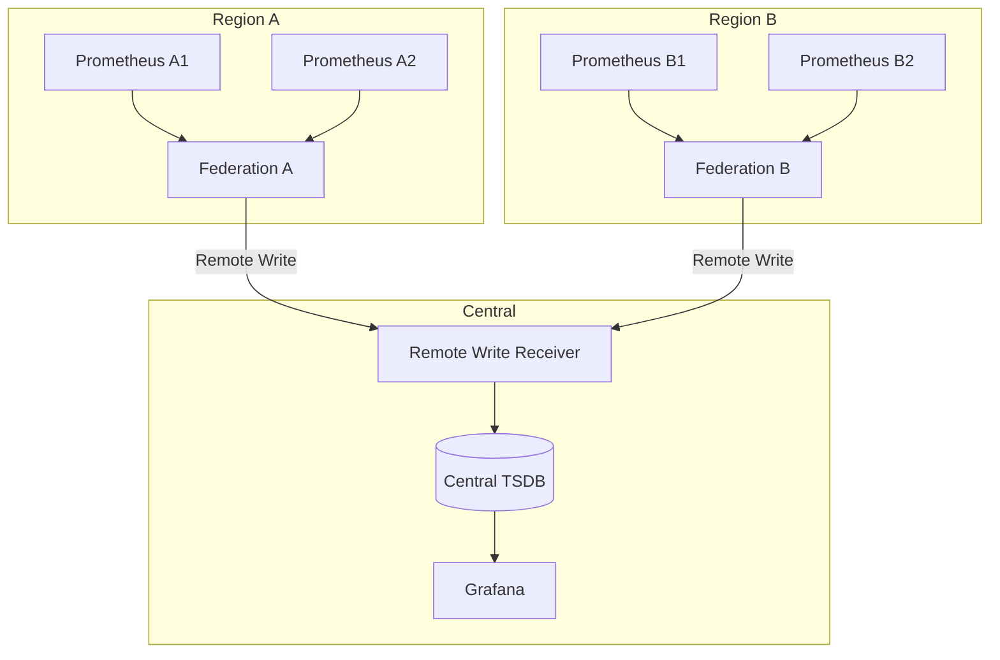
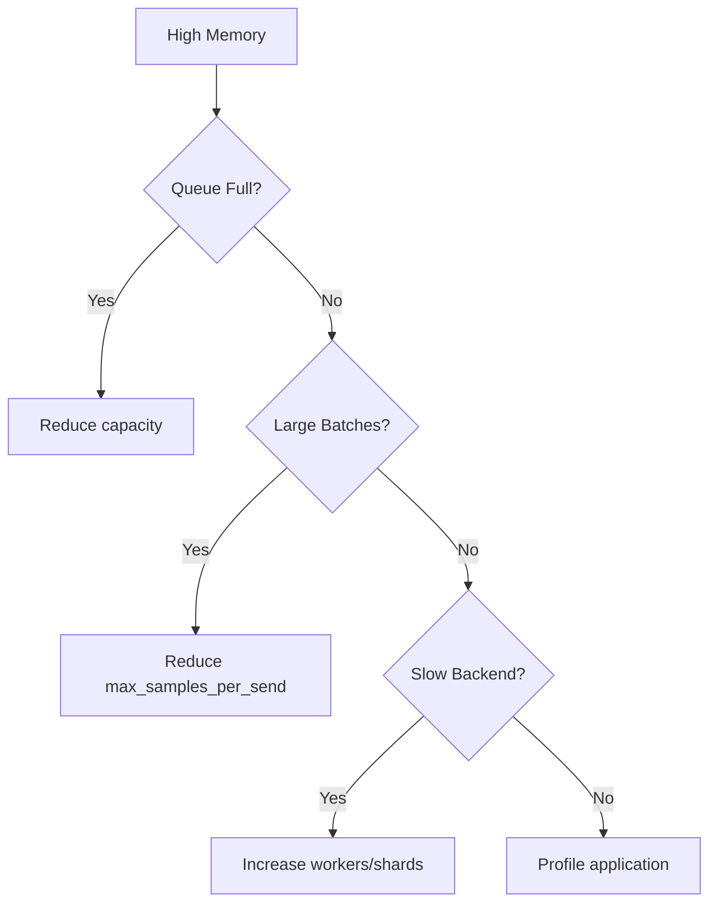
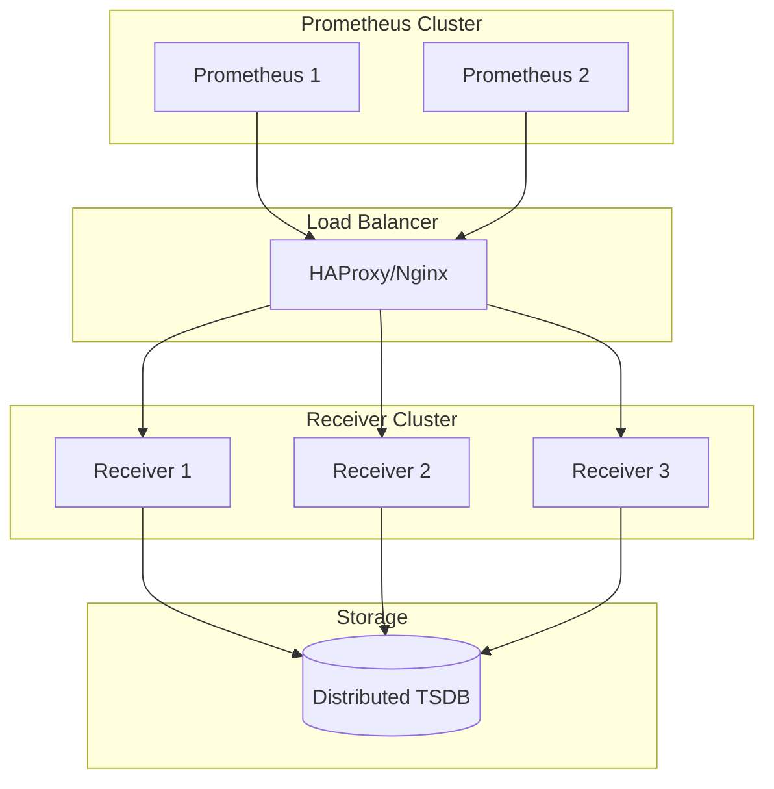

# How to Build Prometheus Remote Write Custom

Author: [nawazdhandala](https://github.com/nawazdhandala)

Tags: Prometheus, Remote Write, Federation, Long-Term Storage

Description: Learn to implement Prometheus remote write for long-term storage with receiver configuration, batching, and compression strategies.

---

## Introduction

Prometheus is an excellent tool for collecting and querying metrics, but its local storage model has limitations for long-term retention and horizontal scaling. The remote write feature allows you to send metrics to external storage systems, enabling metrics federation across multiple Prometheus instances and long-term storage solutions.

In this guide, we will build a custom Prometheus remote write receiver from scratch, covering configuration, batching strategies, compression, and troubleshooting techniques.

## Understanding Prometheus Remote Write Architecture

Before diving into implementation, let us understand how remote write works in the Prometheus ecosystem.



The remote write protocol uses Protocol Buffers (protobuf) with Snappy compression over HTTP. Each write request contains a batch of time series samples that your receiver must decode, process, and store.

## Setting Up Prometheus Remote Write Configuration

First, configure your Prometheus instance to send metrics via remote write. Add the following to your `prometheus.yml`:

```yaml
# prometheus.yml
global:
  scrape_interval: 15s
  evaluation_interval: 15s

remote_write:
  - url: "http://your-receiver:9090/api/v1/write"

    # Queue configuration for batching
    queue_config:
      capacity: 10000
      max_shards: 200
      min_shards: 1
      max_samples_per_send: 5000
      batch_send_deadline: 5s
      min_backoff: 30ms
      max_backoff: 5s
      retry_on_http_429: true

    # Write relabel configurations for filtering
    write_relabel_configs:
      - source_labels: [__name__]
        regex: "go_.*"
        action: drop

      - source_labels: [job]
        regex: "important-.*"
        action: keep

    # Optional: Add metadata
    send_exemplars: true
    send_native_histograms: true

    # TLS configuration (for production)
    tls_config:
      cert_file: /path/to/cert.pem
      key_file: /path/to/key.pem
      ca_file: /path/to/ca.pem

    # Basic authentication
    basic_auth:
      username: prometheus
      password_file: /path/to/password
```

### Understanding Queue Configuration Parameters

The queue configuration is critical for performance:

| Parameter | Description | Recommended Value |
|-----------|-------------|-------------------|
| `capacity` | Total number of samples to buffer | 10000-50000 |
| `max_shards` | Maximum parallel connections | 100-200 |
| `max_samples_per_send` | Samples per HTTP request | 1000-5000 |
| `batch_send_deadline` | Maximum wait time before sending | 5s |
| `min_backoff` | Initial retry delay | 30ms |
| `max_backoff` | Maximum retry delay | 5s |

## Building a Custom Remote Write Receiver

Now let us build a custom receiver in Go. This receiver will handle incoming remote write requests, decompress them, and process the metrics.

### Project Structure

```
remote-write-receiver/
├── main.go
├── handler/
│   └── write.go
├── storage/
│   └── storage.go
├── proto/
│   └── remote.pb.go
└── go.mod
```

### Step 1: Define the Protocol Buffer Messages

First, you need the Prometheus remote write protobuf definitions. Create or download the proto file:

```protobuf
// proto/remote.proto
syntax = "proto3";

package prometheus;

option go_package = "./proto";

message WriteRequest {
  repeated TimeSeries timeseries = 1;
  repeated MetricMetadata metadata = 2;
}

message TimeSeries {
  repeated Label labels = 1;
  repeated Sample samples = 2;
  repeated Exemplar exemplars = 3;
  repeated Histogram histograms = 4;
}

message Label {
  string name = 1;
  string value = 2;
}

message Sample {
  double value = 1;
  int64 timestamp = 2;
}

message Exemplar {
  repeated Label labels = 1;
  double value = 2;
  int64 timestamp = 3;
}

message Histogram {
  // Histogram fields omitted for brevity
}

message MetricMetadata {
  enum MetricType {
    UNKNOWN = 0;
    COUNTER = 1;
    GAUGE = 2;
    SUMMARY = 3;
    HISTOGRAM = 4;
  }

  MetricType type = 1;
  string metric_family_name = 2;
  string help = 4;
  string unit = 5;
}
```

Generate the Go code:

```bash
protoc --go_out=. --go_opt=paths=source_relative proto/remote.proto
```

### Step 2: Implement the Write Handler

```go
// handler/write.go
package handler

import (
    "fmt"
    "io"
    "net/http"

    "github.com/golang/snappy"
    "github.com/prometheus/prometheus/prompb"
    "google.golang.org/protobuf/proto"
)

type WriteHandler struct {
    storage Storage
}

type Storage interface {
    Write(timeseries []prompb.TimeSeries) error
}

func NewWriteHandler(storage Storage) *WriteHandler {
    return &WriteHandler{storage: storage}
}

func (h *WriteHandler) ServeHTTP(w http.ResponseWriter, r *http.Request) {
    // Validate HTTP method
    if r.Method != http.MethodPost {
        http.Error(w, "Method not allowed", http.StatusMethodNotAllowed)
        return
    }

    // Validate content type
    contentType := r.Header.Get("Content-Type")
    if contentType != "application/x-protobuf" {
        http.Error(w, "Invalid content type", http.StatusUnsupportedMediaType)
        return
    }

    // Read the compressed body
    compressed, err := io.ReadAll(r.Body)
    if err != nil {
        http.Error(w, fmt.Sprintf("Error reading body: %v", err), http.StatusBadRequest)
        return
    }
    defer r.Body.Close()

    // Decompress using Snappy
    decompressed, err := snappy.Decode(nil, compressed)
    if err != nil {
        http.Error(w, fmt.Sprintf("Error decompressing: %v", err), http.StatusBadRequest)
        return
    }

    // Unmarshal the protobuf
    var writeRequest prompb.WriteRequest
    if err := proto.Unmarshal(decompressed, &writeRequest); err != nil {
        http.Error(w, fmt.Sprintf("Error unmarshaling: %v", err), http.StatusBadRequest)
        return
    }

    // Process the time series
    if err := h.storage.Write(writeRequest.Timeseries); err != nil {
        http.Error(w, fmt.Sprintf("Error writing: %v", err), http.StatusInternalServerError)
        return
    }

    // Return 204 No Content on success (Prometheus expects this)
    w.WriteHeader(http.StatusNoContent)
}
```

### Step 3: Implement Storage with Batching

```go
// storage/storage.go
package storage

import (
    "context"
    "sync"
    "time"

    "github.com/prometheus/prometheus/prompb"
)

type BatchConfig struct {
    MaxBatchSize  int
    FlushInterval time.Duration
    Workers       int
}

type BatchStorage struct {
    config     BatchConfig
    backend    Backend
    batch      []prompb.TimeSeries
    batchMu    sync.Mutex
    flushChan  chan []prompb.TimeSeries
    ctx        context.Context
    cancel     context.CancelFunc
    wg         sync.WaitGroup
}

type Backend interface {
    WriteBatch(ctx context.Context, timeseries []prompb.TimeSeries) error
}

func NewBatchStorage(config BatchConfig, backend Backend) *BatchStorage {
    ctx, cancel := context.WithCancel(context.Background())

    s := &BatchStorage{
        config:    config,
        backend:   backend,
        batch:     make([]prompb.TimeSeries, 0, config.MaxBatchSize),
        flushChan: make(chan []prompb.TimeSeries, config.Workers*2),
        ctx:       ctx,
        cancel:    cancel,
    }

    // Start worker goroutines
    for i := 0; i < config.Workers; i++ {
        s.wg.Add(1)
        go s.worker()
    }

    // Start flush timer
    s.wg.Add(1)
    go s.flushTimer()

    return s
}

func (s *BatchStorage) Write(timeseries []prompb.TimeSeries) error {
    s.batchMu.Lock()
    defer s.batchMu.Unlock()

    s.batch = append(s.batch, timeseries...)

    // Check if batch is full
    if len(s.batch) >= s.config.MaxBatchSize {
        s.flushLocked()
    }

    return nil
}

func (s *BatchStorage) flushLocked() {
    if len(s.batch) == 0 {
        return
    }

    // Copy batch and reset
    toFlush := make([]prompb.TimeSeries, len(s.batch))
    copy(toFlush, s.batch)
    s.batch = s.batch[:0]

    // Send to workers (non-blocking with buffer)
    select {
    case s.flushChan <- toFlush:
    default:
        // Channel full - process synchronously as fallback
        go func() {
            s.backend.WriteBatch(s.ctx, toFlush)
        }()
    }
}

func (s *BatchStorage) flushTimer() {
    defer s.wg.Done()

    ticker := time.NewTicker(s.config.FlushInterval)
    defer ticker.Stop()

    for {
        select {
        case <-ticker.C:
            s.batchMu.Lock()
            s.flushLocked()
            s.batchMu.Unlock()
        case <-s.ctx.Done():
            return
        }
    }
}

func (s *BatchStorage) worker() {
    defer s.wg.Done()

    for {
        select {
        case batch := <-s.flushChan:
            if err := s.backend.WriteBatch(s.ctx, batch); err != nil {
                // Log error and implement retry logic
                s.retryWrite(batch)
            }
        case <-s.ctx.Done():
            return
        }
    }
}

func (s *BatchStorage) retryWrite(batch []prompb.TimeSeries) {
    backoff := 100 * time.Millisecond
    maxBackoff := 5 * time.Second
    maxRetries := 5

    for i := 0; i < maxRetries; i++ {
        time.Sleep(backoff)

        if err := s.backend.WriteBatch(s.ctx, batch); err == nil {
            return
        }

        backoff *= 2
        if backoff > maxBackoff {
            backoff = maxBackoff
        }
    }

    // Log permanent failure
}

func (s *BatchStorage) Close() error {
    s.cancel()
    s.wg.Wait()
    close(s.flushChan)
    return nil
}
```

### Step 4: Main Application

```go
// main.go
package main

import (
    "context"
    "log"
    "net/http"
    "os"
    "os/signal"
    "syscall"
    "time"

    "remote-write-receiver/handler"
    "remote-write-receiver/storage"
)

func main() {
    // Configure batching
    batchConfig := storage.BatchConfig{
        MaxBatchSize:  1000,
        FlushInterval: 5 * time.Second,
        Workers:       4,
    }

    // Initialize your backend (e.g., ClickHouse, TimescaleDB, etc.)
    backend := NewYourBackend()

    // Create batch storage
    batchStorage := storage.NewBatchStorage(batchConfig, backend)
    defer batchStorage.Close()

    // Create write handler
    writeHandler := handler.NewWriteHandler(batchStorage)

    // Setup HTTP server
    mux := http.NewServeMux()
    mux.Handle("/api/v1/write", writeHandler)
    mux.HandleFunc("/health", func(w http.ResponseWriter, r *http.Request) {
        w.WriteHeader(http.StatusOK)
        w.Write([]byte("OK"))
    })

    server := &http.Server{
        Addr:         ":9090",
        Handler:      mux,
        ReadTimeout:  30 * time.Second,
        WriteTimeout: 30 * time.Second,
        IdleTimeout:  60 * time.Second,
    }

    // Graceful shutdown
    go func() {
        sigChan := make(chan os.Signal, 1)
        signal.Notify(sigChan, syscall.SIGINT, syscall.SIGTERM)
        <-sigChan

        ctx, cancel := context.WithTimeout(context.Background(), 30*time.Second)
        defer cancel()

        log.Println("Shutting down server...")
        if err := server.Shutdown(ctx); err != nil {
            log.Printf("Server shutdown error: %v", err)
        }
    }()

    log.Println("Starting remote write receiver on :9090")
    if err := server.ListenAndServe(); err != http.ErrServerClosed {
        log.Fatalf("Server error: %v", err)
    }
}
```

## Implementing Compression Strategies

Prometheus uses Snappy compression by default. Let us explore different compression options and their trade-offs.



### Multi-Compression Support

```go
// handler/compression.go
package handler

import (
    "bytes"
    "compress/gzip"
    "io"

    "github.com/golang/snappy"
    "github.com/klauspost/compress/zstd"
)

type Decompressor interface {
    Decompress(data []byte) ([]byte, error)
}

type SnappyDecompressor struct{}

func (d *SnappyDecompressor) Decompress(data []byte) ([]byte, error) {
    return snappy.Decode(nil, data)
}

type ZstdDecompressor struct {
    decoder *zstd.Decoder
}

func NewZstdDecompressor() (*ZstdDecompressor, error) {
    decoder, err := zstd.NewReader(nil)
    if err != nil {
        return nil, err
    }
    return &ZstdDecompressor{decoder: decoder}, nil
}

func (d *ZstdDecompressor) Decompress(data []byte) ([]byte, error) {
    return d.decoder.DecodeAll(data, nil)
}

type GzipDecompressor struct{}

func (d *GzipDecompressor) Decompress(data []byte) ([]byte, error) {
    reader, err := gzip.NewReader(bytes.NewReader(data))
    if err != nil {
        return nil, err
    }
    defer reader.Close()
    return io.ReadAll(reader)
}

func GetDecompressor(contentEncoding string) Decompressor {
    switch contentEncoding {
    case "snappy", "":
        return &SnappyDecompressor{}
    case "zstd":
        d, _ := NewZstdDecompressor()
        return d
    case "gzip":
        return &GzipDecompressor{}
    default:
        return &SnappyDecompressor{}
    }
}
```

### Compression Performance Comparison

| Compression | Ratio | Encode Speed | Decode Speed | CPU Usage |
|-------------|-------|--------------|--------------|-----------|
| Snappy | 2-3x | Very Fast | Very Fast | Low |
| Zstd | 3-5x | Fast | Fast | Medium |
| Gzip | 3-4x | Slow | Medium | High |
| None | 1x | N/A | N/A | None |

## Metrics Federation Architecture

When federating metrics across multiple Prometheus instances, consider this architecture:



### Federation Configuration

```yaml
# prometheus-federation.yml
global:
  scrape_interval: 15s
  external_labels:
    region: us-east-1
    cluster: production

scrape_configs:
  # Federate from local Prometheus instances
  - job_name: 'federate'
    scrape_interval: 30s
    honor_labels: true
    metrics_path: '/federate'
    params:
      'match[]':
        - '{job=~".+"}'
        - '{__name__=~"job:.*"}'
    static_configs:
      - targets:
        - 'prometheus-1:9090'
        - 'prometheus-2:9090'

remote_write:
  - url: "https://central-receiver.example.com/api/v1/write"
    queue_config:
      capacity: 50000
      max_shards: 100
      max_samples_per_send: 2000

    # Add external labels
    write_relabel_configs:
      - target_label: federated_from
        replacement: us-east-1
```

## Implementing Health Checks and Metrics

Add observability to your remote write receiver:

```go
// metrics/metrics.go
package metrics

import (
    "github.com/prometheus/client_golang/prometheus"
    "github.com/prometheus/client_golang/prometheus/promauto"
)

var (
    WriteRequestsTotal = promauto.NewCounterVec(
        prometheus.CounterOpts{
            Name: "remote_write_requests_total",
            Help: "Total number of remote write requests",
        },
        []string{"status"},
    )

    WriteRequestDuration = promauto.NewHistogramVec(
        prometheus.HistogramOpts{
            Name:    "remote_write_request_duration_seconds",
            Help:    "Duration of remote write requests",
            Buckets: prometheus.ExponentialBuckets(0.001, 2, 15),
        },
        []string{"status"},
    )

    SamplesReceived = promauto.NewCounter(
        prometheus.CounterOpts{
            Name: "remote_write_samples_received_total",
            Help: "Total number of samples received",
        },
    )

    BatchSize = promauto.NewHistogram(
        prometheus.HistogramOpts{
            Name:    "remote_write_batch_size",
            Help:    "Size of batches written to storage",
            Buckets: prometheus.ExponentialBuckets(10, 2, 12),
        },
    )

    QueueLength = promauto.NewGauge(
        prometheus.GaugeOpts{
            Name: "remote_write_queue_length",
            Help: "Current length of the write queue",
        },
    )

    StorageErrors = promauto.NewCounterVec(
        prometheus.CounterOpts{
            Name: "remote_write_storage_errors_total",
            Help: "Total number of storage errors",
        },
        []string{"type"},
    )
)
```

### Instrumented Handler

```go
// handler/instrumented_write.go
package handler

import (
    "net/http"
    "time"

    "remote-write-receiver/metrics"
)

func (h *WriteHandler) ServeHTTP(w http.ResponseWriter, r *http.Request) {
    start := time.Now()
    status := "success"

    defer func() {
        duration := time.Since(start).Seconds()
        metrics.WriteRequestsTotal.WithLabelValues(status).Inc()
        metrics.WriteRequestDuration.WithLabelValues(status).Observe(duration)
    }()

    // ... existing handler logic ...

    // Track samples received
    metrics.SamplesReceived.Add(float64(len(writeRequest.Timeseries)))
}
```

## Troubleshooting Common Issues

### Issue 1: High Memory Usage



**Solution**: Tune queue configuration:

```yaml
remote_write:
  - url: "http://receiver:9090/api/v1/write"
    queue_config:
      capacity: 5000          # Reduce from default
      max_samples_per_send: 500  # Smaller batches
      max_shards: 50          # Limit parallelism
```

### Issue 2: Dropped Samples

Check for dropped samples using these Prometheus metrics:

```promql
# Rate of dropped samples
rate(prometheus_remote_storage_dropped_samples_total[5m])

# Failed samples
rate(prometheus_remote_storage_failed_samples_total[5m])

# Pending samples in queue
prometheus_remote_storage_pending_samples
```

**Solution**: Increase queue capacity and check network connectivity:

```yaml
queue_config:
  capacity: 100000
  max_shards: 200
  retry_on_http_429: true
```

### Issue 3: Slow Write Performance

Diagnose with these queries:

```promql
# Write latency
histogram_quantile(0.99,
  rate(prometheus_remote_storage_sent_batch_duration_seconds_bucket[5m])
)

# Throughput
rate(prometheus_remote_storage_samples_total[5m])

# Retries
rate(prometheus_remote_storage_retried_samples_total[5m])
```

**Solution**: Enable compression and increase batch size:

```yaml
remote_write:
  - url: "http://receiver:9090/api/v1/write"
    queue_config:
      max_samples_per_send: 5000
      batch_send_deadline: 10s
```

### Issue 4: Authentication Failures

```go
// handler/auth.go
package handler

import (
    "crypto/subtle"
    "net/http"
)

type AuthMiddleware struct {
    username string
    password string
    next     http.Handler
}

func NewAuthMiddleware(username, password string, next http.Handler) *AuthMiddleware {
    return &AuthMiddleware{
        username: username,
        password: password,
        next:     next,
    }
}

func (m *AuthMiddleware) ServeHTTP(w http.ResponseWriter, r *http.Request) {
    username, password, ok := r.BasicAuth()
    if !ok {
        w.Header().Set("WWW-Authenticate", `Basic realm="Remote Write"`)
        http.Error(w, "Unauthorized", http.StatusUnauthorized)
        return
    }

    usernameMatch := subtle.ConstantTimeCompare([]byte(username), []byte(m.username))
    passwordMatch := subtle.ConstantTimeCompare([]byte(password), []byte(m.password))

    if usernameMatch != 1 || passwordMatch != 1 {
        http.Error(w, "Unauthorized", http.StatusUnauthorized)
        return
    }

    m.next.ServeHTTP(w, r)
}
```

### Debugging Checklist

1. **Verify connectivity**: Test the receiver endpoint manually
   ```bash
   curl -v -X POST http://receiver:9090/api/v1/write
   ```

2. **Check Prometheus logs**: Look for remote write errors
   ```bash
   journalctl -u prometheus | grep -i "remote"
   ```

3. **Monitor queue metrics**: Ensure queues are not backing up
   ```promql
   prometheus_remote_storage_queue_highest_sent_timestamp_seconds
   ```

4. **Validate TLS certificates**: Ensure certificates are valid and trusted
   ```bash
   openssl s_client -connect receiver:9090
   ```

## Production Deployment Recommendations

### High Availability Setup



### Kubernetes Deployment

```yaml
# deployment.yaml
apiVersion: apps/v1
kind: Deployment
metadata:
  name: remote-write-receiver
spec:
  replicas: 3
  selector:
    matchLabels:
      app: remote-write-receiver
  template:
    metadata:
      labels:
        app: remote-write-receiver
    spec:
      containers:
      - name: receiver
        image: your-registry/remote-write-receiver:latest
        ports:
        - containerPort: 9090
        resources:
          requests:
            memory: "512Mi"
            cpu: "500m"
          limits:
            memory: "2Gi"
            cpu: "2000m"
        livenessProbe:
          httpGet:
            path: /health
            port: 9090
          initialDelaySeconds: 10
          periodSeconds: 10
        readinessProbe:
          httpGet:
            path: /health
            port: 9090
          initialDelaySeconds: 5
          periodSeconds: 5
---
apiVersion: v1
kind: Service
metadata:
  name: remote-write-receiver
spec:
  selector:
    app: remote-write-receiver
  ports:
  - port: 9090
    targetPort: 9090
  type: ClusterIP
---
apiVersion: autoscaling/v2
kind: HorizontalPodAutoscaler
metadata:
  name: remote-write-receiver-hpa
spec:
  scaleTargetRef:
    apiVersion: apps/v1
    kind: Deployment
    name: remote-write-receiver
  minReplicas: 3
  maxReplicas: 10
  metrics:
  - type: Resource
    resource:
      name: cpu
      target:
        type: Utilization
        averageUtilization: 70
```

## Conclusion

Building a custom Prometheus remote write receiver enables you to:

- Implement custom storage backends tailored to your needs
- Add business logic for metric processing and transformation
- Scale horizontally to handle high-volume metric ingestion
- Create a centralized metrics federation architecture

Key takeaways:

1. **Understand the protocol**: Remote write uses protobuf with Snappy compression over HTTP
2. **Implement proper batching**: Buffer samples and flush in batches for efficiency
3. **Handle backpressure**: Use queue configurations and retry logic to handle load spikes
4. **Monitor your receiver**: Add comprehensive metrics to track performance and errors
5. **Plan for scale**: Design for horizontal scaling from the start

By following this guide, you can build a robust remote write infrastructure that meets your organization's specific requirements for metrics federation and long-term storage.

## Additional Resources

- [Prometheus Remote Write Specification](https://prometheus.io/docs/concepts/remote_write_spec/)
- [Prometheus Configuration Documentation](https://prometheus.io/docs/prometheus/latest/configuration/configuration/#remote_write)
- [Protocol Buffers Documentation](https://developers.google.com/protocol-buffers)
- [Snappy Compression](https://github.com/google/snappy)
