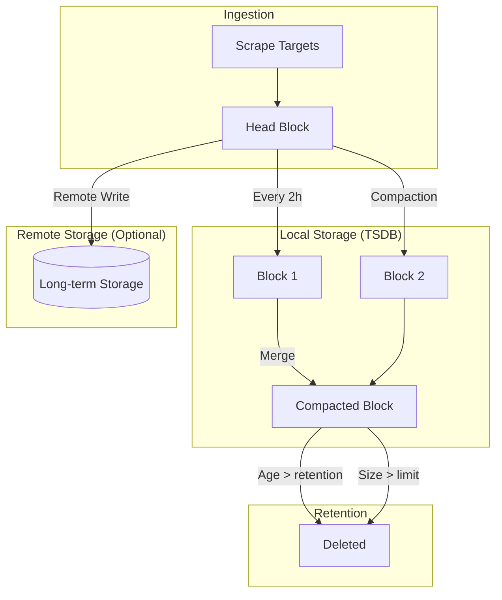
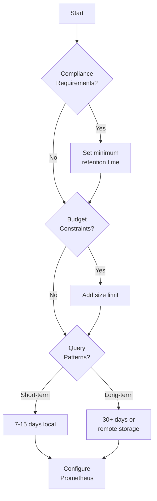
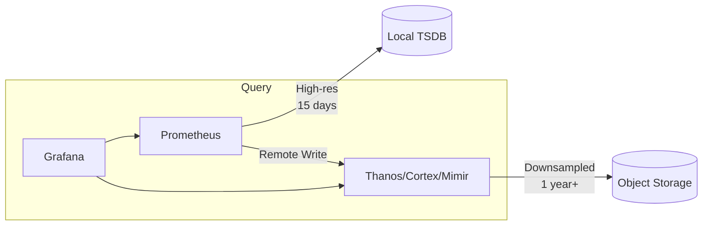
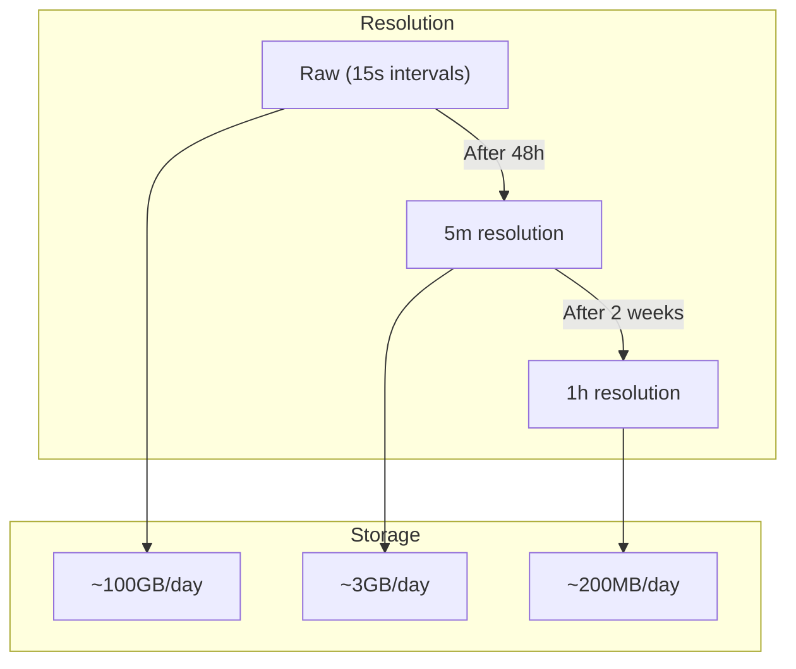
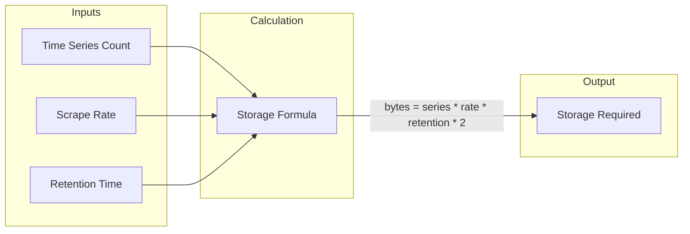

# How to Create Prometheus Retention Strategies

Author: [nawazdhandala](https://github.com/nawazdhandala)

Tags: Prometheus, Retention, Storage, Data-Management

Description: A practical guide to configuring Prometheus retention policies for optimal storage management, performance, and cost efficiency.

---

Prometheus collects millions of time-series data points. Without a proper retention strategy, your storage fills up, queries slow down, and costs spiral. Here is how to build retention policies that balance observability needs with operational constraints.

## Understanding Prometheus Storage

Before configuring retention, understand how Prometheus stores data.



Prometheus uses a time-series database (TSDB) that writes data in 2-hour blocks. These blocks are compacted over time and eventually deleted based on your retention settings.

## Retention Configuration Options

Prometheus offers two primary retention controls: time-based and size-based.

### Time-Based Retention

Set how long data stays before deletion.

```yaml
# prometheus.yml or command-line flag
global:
  scrape_interval: 15s

# Command-line configuration
# --storage.tsdb.retention.time=15d
```

Launch Prometheus with time-based retention.

```bash
prometheus \
  --config.file=/etc/prometheus/prometheus.yml \
  --storage.tsdb.path=/var/lib/prometheus \
  --storage.tsdb.retention.time=15d
```

### Size-Based Retention

Cap storage at a specific size. Prometheus deletes oldest blocks first when the limit is reached.

```bash
prometheus \
  --config.file=/etc/prometheus/prometheus.yml \
  --storage.tsdb.path=/var/lib/prometheus \
  --storage.tsdb.retention.size=50GB
```

### Combined Retention

Use both time and size limits. Whichever threshold triggers first wins.

```bash
prometheus \
  --config.file=/etc/prometheus/prometheus.yml \
  --storage.tsdb.path=/var/lib/prometheus \
  --storage.tsdb.retention.time=30d \
  --storage.tsdb.retention.size=100GB
```

## Retention Strategy Decision Framework

Choose your strategy based on your requirements.



## Common Retention Configurations

### Development Environment

Keep costs low with minimal retention.

```bash
prometheus \
  --storage.tsdb.retention.time=3d \
  --storage.tsdb.retention.size=10GB
```

### Production - Short-Term Analysis

Balance detail with storage for typical operational needs.

```bash
prometheus \
  --storage.tsdb.retention.time=15d \
  --storage.tsdb.retention.size=50GB
```

### Production - Extended History

Longer retention for capacity planning and trend analysis.

```bash
prometheus \
  --storage.tsdb.retention.time=90d \
  --storage.tsdb.retention.size=500GB
```

## Tiered Retention with Remote Storage

For long-term retention without local storage bloat, use remote storage backends.



### Remote Write Configuration

Send data to a long-term storage backend.

```yaml
# prometheus.yml
remote_write:
  - url: "http://thanos-receive:19291/api/v1/receive"
    queue_config:
      max_samples_per_send: 10000
      batch_send_deadline: 5s
      capacity: 50000
      max_shards: 30
```

### Thanos Sidecar Setup

Deploy Thanos alongside Prometheus for seamless long-term storage.

```yaml
apiVersion: apps/v1
kind: Deployment
metadata:
  name: prometheus
spec:
  template:
    spec:
      containers:
        - name: prometheus
          image: prom/prometheus:v2.47.0
          args:
            - "--config.file=/etc/prometheus/prometheus.yml"
            - "--storage.tsdb.path=/prometheus"
            - "--storage.tsdb.retention.time=15d"
            - "--storage.tsdb.min-block-duration=2h"
            - "--storage.tsdb.max-block-duration=2h"
          volumeMounts:
            - name: prometheus-storage
              mountPath: /prometheus

        - name: thanos-sidecar
          image: quay.io/thanos/thanos:v0.32.0
          args:
            - sidecar
            - "--tsdb.path=/prometheus"
            - "--prometheus.url=http://localhost:9090"
            - "--objstore.config-file=/etc/thanos/bucket.yml"
          volumeMounts:
            - name: prometheus-storage
              mountPath: /prometheus
            - name: thanos-config
              mountPath: /etc/thanos
```

### Object Storage Configuration for Thanos

Configure S3-compatible storage for long-term retention.

```yaml
# bucket.yml
type: S3
config:
  bucket: prometheus-longterm
  endpoint: s3.amazonaws.com
  region: us-east-1
  access_key: ${AWS_ACCESS_KEY_ID}
  secret_key: ${AWS_SECRET_ACCESS_KEY}
```

## Downsampling for Long-Term Data

Reduce storage costs by downsampling old data.



### Thanos Compactor Configuration

Enable automatic downsampling with Thanos compactor.

```yaml
apiVersion: apps/v1
kind: Deployment
metadata:
  name: thanos-compactor
spec:
  template:
    spec:
      containers:
        - name: compactor
          image: quay.io/thanos/thanos:v0.32.0
          args:
            - compact
            - "--data-dir=/data"
            - "--objstore.config-file=/etc/thanos/bucket.yml"
            - "--retention.resolution-raw=14d"
            - "--retention.resolution-5m=90d"
            - "--retention.resolution-1h=365d"
            - "--wait"
            - "--wait-interval=5m"
```

## Recording Rules to Reduce Cardinality

Pre-aggregate high-cardinality metrics to reduce storage needs.

```yaml
# prometheus-rules.yml
groups:
  - name: aggregations
    interval: 1m
    rules:
      # Aggregate per-pod metrics to per-deployment
      - record: deployment:http_requests_total:rate5m
        expr: |
          sum by (deployment, namespace) (
            rate(http_requests_total[5m])
          )

      # Pre-calculate percentiles
      - record: deployment:http_request_duration_seconds:p99
        expr: |
          histogram_quantile(0.99,
            sum by (deployment, le) (
              rate(http_request_duration_seconds_bucket[5m])
            )
          )

      # Aggregate error rates
      - record: service:error_rate:ratio
        expr: |
          sum by (service) (rate(http_requests_total{status=~"5.."}[5m]))
          /
          sum by (service) (rate(http_requests_total[5m]))
```

## Monitoring Your Retention

Track storage usage to adjust retention settings proactively.

### Key Metrics to Watch

```yaml
# Alert when storage is filling up
groups:
  - name: prometheus-storage
    rules:
      - alert: PrometheusStorageFillingUp
        expr: |
          (
            prometheus_tsdb_storage_blocks_bytes
            / prometheus_tsdb_retention_limit_bytes
          ) > 0.8
        for: 5m
        labels:
          severity: warning
        annotations:
          summary: "Prometheus storage is 80% full"

      - alert: PrometheusHighChurnRate
        expr: |
          rate(prometheus_tsdb_head_series_created_total[1h])
          > 10000
        for: 15m
        labels:
          severity: warning
        annotations:
          summary: "High series churn may impact performance"

      - alert: PrometheusTSDBCompactionsFailing
        expr: |
          increase(prometheus_tsdb_compactions_failed_total[1h]) > 0
        for: 5m
        labels:
          severity: critical
        annotations:
          summary: "TSDB compactions are failing"
```

### Grafana Dashboard Queries

Monitor these metrics in your dashboards.

```promql
# Current storage size
prometheus_tsdb_storage_blocks_bytes

# Number of active time series
prometheus_tsdb_head_series

# Series churn rate
rate(prometheus_tsdb_head_series_created_total[1h])

# Oldest block timestamp
prometheus_tsdb_lowest_timestamp_seconds

# Data ingestion rate
rate(prometheus_tsdb_head_samples_appended_total[5m])
```

## Storage Capacity Planning

Estimate your storage needs before they become problems.



### Capacity Estimation Formula

Calculate expected storage usage.

```bash
# Formula: bytes = series_count * scrape_interval_samples * retention_seconds * bytes_per_sample

# Example calculation:
# - 100,000 active time series
# - 15s scrape interval (4 samples/minute)
# - 15 days retention (1,296,000 seconds)
# - ~2 bytes per sample (compressed)

# Storage = 100,000 * (1,296,000 / 15) * 2 = ~17.3 GB

# Check current series count
curl -s http://localhost:9090/api/v1/status/tsdb | jq '.data.headStats.numSeries'
```

## Best Practices

1. **Start conservative**: Begin with 15 days and adjust based on actual usage patterns
2. **Use size limits as guardrails**: Prevent runaway storage even if time-based retention is set
3. **Implement recording rules**: Pre-aggregate metrics you query frequently at longer ranges
4. **Adopt tiered storage**: Keep high-resolution data local, downsample for long-term
5. **Monitor storage metrics**: Alert before you run out of space
6. **Review cardinality regularly**: High-cardinality labels are the primary storage consumer
7. **Document retention decisions**: Make compliance and business requirements explicit

## Retention Strategy Checklist

Before deploying, verify these items:

- [ ] Time-based retention configured based on query patterns
- [ ] Size-based limit set as a safety net
- [ ] Remote storage configured for data beyond local retention
- [ ] Downsampling rules defined for long-term data
- [ ] Recording rules created for frequently-queried aggregations
- [ ] Storage alerts configured for proactive monitoring
- [ ] Capacity planning documented with growth projections

---

A well-designed retention strategy keeps your Prometheus instance performant, your storage costs predictable, and your historical data accessible when you need it. Start with the basics, add tiered storage as requirements grow, and continuously monitor to stay ahead of capacity needs.
