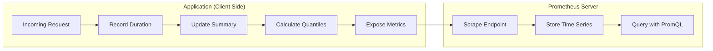
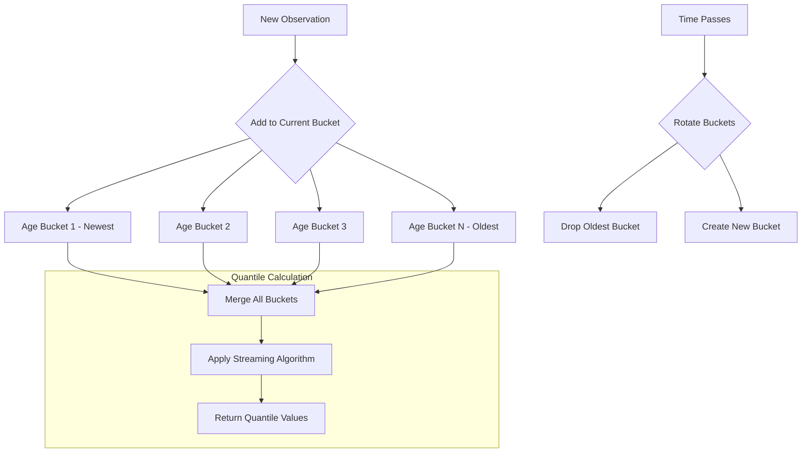
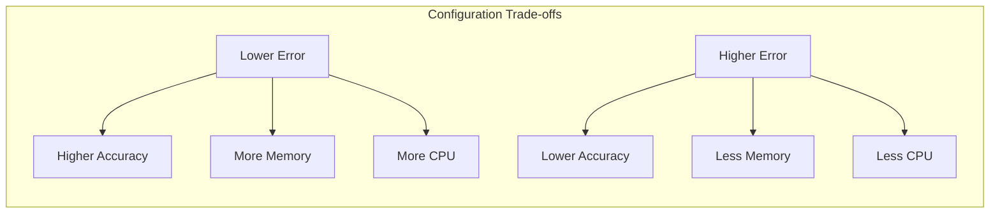
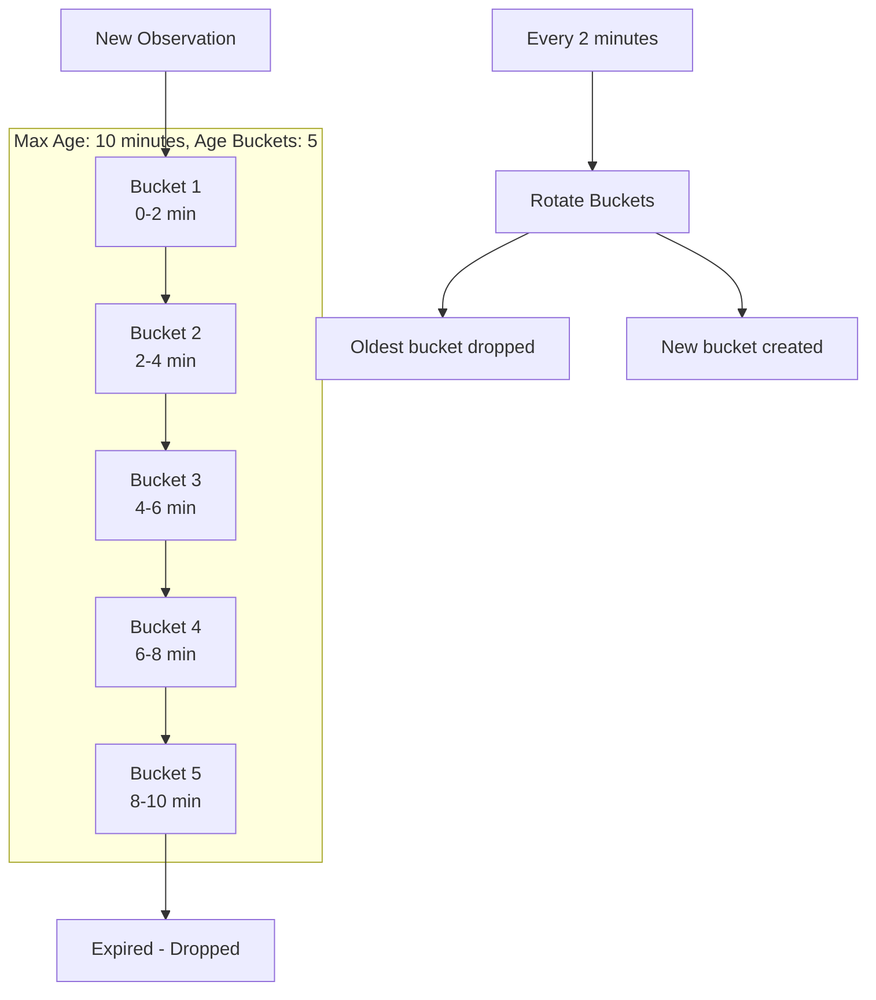
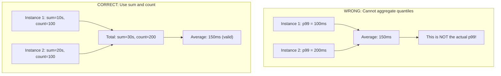
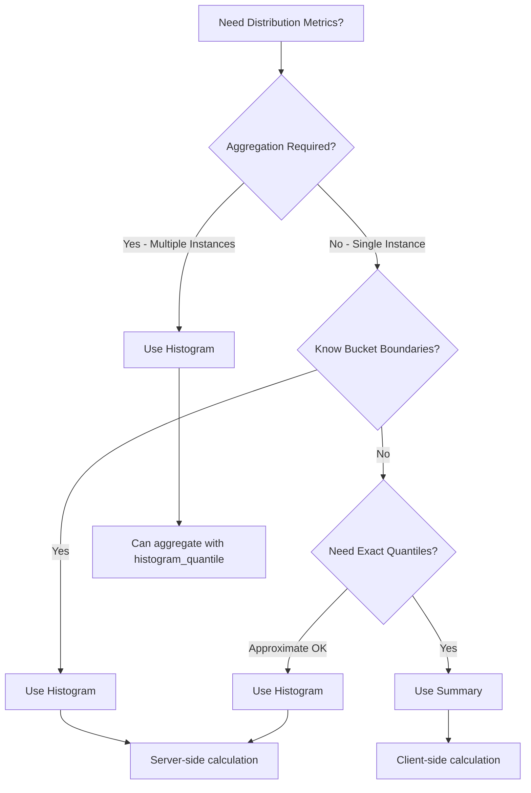

# How to Build Prometheus Summary Quantiles

Author: [nawazdhandala](https://github.com/nawazdhandala)

Tags: Prometheus, Summary, Quantiles, Metrics

Description: Learn to implement Prometheus summary metrics with quantile calculation, configurable objectives, and comparison with histograms.

---

## Introduction

When measuring application performance, understanding latency distributions is critical. While averages tell you the typical case, they hide outliers that affect user experience. Prometheus provides two metric types for distribution analysis: histograms and summaries. This guide focuses on summaries - specifically how to build and use quantiles effectively.

Summaries calculate quantiles (percentiles) on the client side before exposing them to Prometheus. This approach has distinct advantages and trade-offs compared to histograms, which we will explore in depth.

## Understanding Summaries and Quantiles

A quantile represents the value below which a given percentage of observations fall. For example, the 0.95 quantile (95th percentile or p95) tells you that 95% of requests completed faster than this value.



### How Summaries Work Internally

Summaries use streaming algorithms to calculate quantiles without storing all observations. The most common implementation uses a sliding time window with configurable max age and age buckets.



## Creating Summary Metrics

### Basic Summary in Go

Here is how to create a summary metric with configurable quantile objectives:

```go
package main

import (
    "math/rand"
    "net/http"
    "time"

    "github.com/prometheus/client_golang/prometheus"
    "github.com/prometheus/client_golang/prometheus/promhttp"
)

var (
    requestDuration = prometheus.NewSummary(prometheus.SummaryOpts{
        Name: "http_request_duration_seconds",
        Help: "Request latency distribution in seconds",
        Objectives: map[float64]float64{
            0.5:  0.05,  // p50 with 5% error
            0.9:  0.01,  // p90 with 1% error
            0.95: 0.005, // p95 with 0.5% error
            0.99: 0.001, // p99 with 0.1% error
        },
    })
)

func init() {
    prometheus.MustRegister(requestDuration)
}

func handleRequest(w http.ResponseWriter, r *http.Request) {
    start := time.Now()

    // Simulate work with random latency
    time.Sleep(time.Duration(rand.Intn(100)) * time.Millisecond)

    duration := time.Since(start).Seconds()
    requestDuration.Observe(duration)

    w.WriteHeader(http.StatusOK)
    w.Write([]byte("OK"))
}

func main() {
    http.HandleFunc("/api", handleRequest)
    http.Handle("/metrics", promhttp.Handler())
    http.ListenAndServe(":8080", nil)
}
```

### Understanding Quantile Objectives

The `Objectives` map defines which quantiles to track and their acceptable error margins:

```go
Objectives: map[float64]float64{
    0.5:  0.05,  // Actual quantile between 0.45 and 0.55
    0.9:  0.01,  // Actual quantile between 0.89 and 0.91
    0.95: 0.005, // Actual quantile between 0.945 and 0.955
    0.99: 0.001, // Actual quantile between 0.989 and 0.991
}
```

Lower error margins require more memory and computation but provide higher accuracy.



### Summary with Labels

For more granular tracking, add labels to your summary:

```go
package main

import (
    "net/http"
    "time"

    "github.com/prometheus/client_golang/prometheus"
    "github.com/prometheus/client_golang/prometheus/promhttp"
)

var (
    requestDurationVec = prometheus.NewSummaryVec(
        prometheus.SummaryOpts{
            Name: "http_request_duration_seconds",
            Help: "Request latency by endpoint and method",
            Objectives: map[float64]float64{
                0.5:  0.05,
                0.9:  0.01,
                0.99: 0.001,
            },
            MaxAge:     10 * time.Minute,
            AgeBuckets: 5,
        },
        []string{"method", "endpoint", "status"},
    )
)

func init() {
    prometheus.MustRegister(requestDurationVec)
}

func instrumentedHandler(endpoint string, handler http.HandlerFunc) http.HandlerFunc {
    return func(w http.ResponseWriter, r *http.Request) {
        start := time.Now()

        // Wrap response writer to capture status code
        wrapper := &responseWrapper{ResponseWriter: w, status: http.StatusOK}
        handler(wrapper, r)

        duration := time.Since(start).Seconds()
        requestDurationVec.WithLabelValues(
            r.Method,
            endpoint,
            http.StatusText(wrapper.status),
        ).Observe(duration)
    }
}

type responseWrapper struct {
    http.ResponseWriter
    status int
}

func (w *responseWrapper) WriteHeader(code int) {
    w.status = code
    w.ResponseWriter.WriteHeader(code)
}

func main() {
    http.HandleFunc("/api/users", instrumentedHandler("/api/users", usersHandler))
    http.HandleFunc("/api/orders", instrumentedHandler("/api/orders", ordersHandler))
    http.Handle("/metrics", promhttp.Handler())
    http.ListenAndServe(":8080", nil)
}

func usersHandler(w http.ResponseWriter, r *http.Request) {
    time.Sleep(50 * time.Millisecond)
    w.Write([]byte("users"))
}

func ordersHandler(w http.ResponseWriter, r *http.Request) {
    time.Sleep(100 * time.Millisecond)
    w.Write([]byte("orders"))
}
```

## Summary in Python

The Python Prometheus client provides similar functionality:

```python
from prometheus_client import Summary, start_http_server
import time
import random

# Create summary with quantile objectives
REQUEST_DURATION = Summary(
    'http_request_duration_seconds',
    'Request latency distribution',
    ['method', 'endpoint']
)

# Note: Python client uses default quantiles (0.5, 0.9, 0.99)
# Custom quantiles require using the multiprocess mode or custom implementation

def handle_request(method: str, endpoint: str):
    start_time = time.time()

    # Simulate request processing
    time.sleep(random.uniform(0.01, 0.1))

    duration = time.time() - start_time
    REQUEST_DURATION.labels(method=method, endpoint=endpoint).observe(duration)

def main():
    start_http_server(8080)
    print("Metrics server started on port 8080")

    while True:
        handle_request("GET", "/api/users")
        handle_request("POST", "/api/orders")
        time.sleep(0.1)

if __name__ == '__main__':
    main()
```

### Python with Custom Quantiles

For custom quantile objectives in Python, you can extend the Summary class:

```python
from prometheus_client import Summary
from prometheus_client.metrics import MetricWrapperBase
import time

class CustomSummary:
    """Wrapper for Summary with explicit quantile tracking"""

    def __init__(self, name: str, documentation: str, labelnames=None):
        self.summary = Summary(
            name,
            documentation,
            labelnames or []
        )
        self.name = name

    def observe(self, amount: float, labels: dict = None):
        if labels:
            self.summary.labels(**labels).observe(amount)
        else:
            self.summary.observe(amount)

    def time(self):
        """Context manager for timing operations"""
        return self.summary.time()


# Usage
request_time = CustomSummary(
    'request_processing_seconds',
    'Time spent processing requests',
    labelnames=['handler']
)

def process_request(handler_name: str):
    start = time.time()
    # Do work
    time.sleep(0.05)
    request_time.observe(time.time() - start, {'handler': handler_name})
```

## Summary in Node.js

Using the prom-client library for Node.js:

```javascript
const client = require('prom-client');
const express = require('express');

// Create summary with custom percentiles
const httpRequestDuration = new client.Summary({
    name: 'http_request_duration_seconds',
    help: 'Duration of HTTP requests in seconds',
    labelNames: ['method', 'route', 'status_code'],
    percentiles: [0.5, 0.9, 0.95, 0.99],
    maxAgeSeconds: 600,
    ageBuckets: 5
});

// Register the metric
client.register.registerMetric(httpRequestDuration);

const app = express();

// Middleware to track request duration
app.use((req, res, next) => {
    const start = Date.now();

    res.on('finish', () => {
        const duration = (Date.now() - start) / 1000;
        httpRequestDuration
            .labels(req.method, req.route?.path || req.path, res.statusCode)
            .observe(duration);
    });

    next();
});

app.get('/api/users', async (req, res) => {
    // Simulate database query
    await new Promise(resolve => setTimeout(resolve, Math.random() * 100));
    res.json({ users: [] });
});

app.get('/api/orders', async (req, res) => {
    // Simulate slower operation
    await new Promise(resolve => setTimeout(resolve, 50 + Math.random() * 100));
    res.json({ orders: [] });
});

app.get('/metrics', async (req, res) => {
    res.set('Content-Type', client.register.contentType);
    res.end(await client.register.metrics());
});

app.listen(8080, () => {
    console.log('Server running on port 8080');
});
```

## Configuring Time Windows

The `MaxAge` and `AgeBuckets` parameters control how observations are retained:



### Configuration Examples

```go
// Short window for real-time monitoring
shortWindowSummary := prometheus.NewSummary(prometheus.SummaryOpts{
    Name:       "realtime_latency_seconds",
    Help:       "Recent latency with 1 minute window",
    Objectives: map[float64]float64{0.9: 0.01, 0.99: 0.001},
    MaxAge:     1 * time.Minute,
    AgeBuckets: 3,
})

// Longer window for trend analysis
longWindowSummary := prometheus.NewSummary(prometheus.SummaryOpts{
    Name:       "hourly_latency_seconds",
    Help:       "Latency over the past hour",
    Objectives: map[float64]float64{0.5: 0.05, 0.9: 0.01, 0.99: 0.001},
    MaxAge:     1 * time.Hour,
    AgeBuckets: 6,
})
```

## Exposed Metrics Format

When Prometheus scrapes a summary, it receives these metrics:

```
# HELP http_request_duration_seconds Request latency distribution in seconds
# TYPE http_request_duration_seconds summary
http_request_duration_seconds{quantile="0.5"} 0.052
http_request_duration_seconds{quantile="0.9"} 0.089
http_request_duration_seconds{quantile="0.95"} 0.094
http_request_duration_seconds{quantile="0.99"} 0.098
http_request_duration_seconds_sum 523.4
http_request_duration_seconds_count 10000
```

The `_sum` and `_count` suffixes allow you to calculate averages:

```promql
# Average request duration over the last 5 minutes
rate(http_request_duration_seconds_sum[5m]) / rate(http_request_duration_seconds_count[5m])
```

## Querying Summaries in PromQL

### Basic Quantile Queries

```promql
# Get p99 latency for all endpoints
http_request_duration_seconds{quantile="0.99"}

# Get p99 latency for a specific endpoint
http_request_duration_seconds{quantile="0.99", endpoint="/api/users"}

# Compare p50 to p99 to understand latency spread
http_request_duration_seconds{quantile="0.99"}
  - http_request_duration_seconds{quantile="0.5"}
```

### Aggregation Limitations

A critical limitation of summaries is that you cannot aggregate quantiles across instances:



### Valid Aggregations

```promql
# Total request count across all instances
sum(http_request_duration_seconds_count)

# Average latency across all instances (valid)
sum(rate(http_request_duration_seconds_sum[5m]))
  / sum(rate(http_request_duration_seconds_count[5m]))

# Request rate per second
sum(rate(http_request_duration_seconds_count[5m]))
```

## Summary vs Histogram Comparison

Understanding when to use summaries versus histograms is essential:



### Feature Comparison

| Feature | Summary | Histogram |
|---------|---------|-----------|
| Quantile calculation | Client-side | Server-side |
| Quantile accuracy | Configurable error | Depends on bucket width |
| Aggregatable | No (except sum/count) | Yes |
| CPU usage | Higher on client | Higher on server |
| Network usage | Lower (pre-calculated) | Higher (all buckets) |
| Flexibility | Fixed quantiles | Any quantile at query time |
| Memory usage | Depends on objectives | Depends on bucket count |

### When to Use Summary

1. Single instance applications where aggregation is not needed
2. When you need precise quantile values with controlled error
3. When you cannot determine appropriate histogram bucket boundaries
4. When you want to reduce Prometheus server load

### When to Use Histogram

1. Multi-instance deployments requiring aggregated quantiles
2. When you need flexibility to calculate any percentile later
3. When bucket boundaries are well understood
4. When investigating latency distributions across different dimensions

## Advanced Patterns

### Combining Summary with Counter for SLOs

```go
package main

import (
    "net/http"
    "time"

    "github.com/prometheus/client_golang/prometheus"
)

var (
    requestDuration = prometheus.NewSummary(prometheus.SummaryOpts{
        Name: "http_request_duration_seconds",
        Help: "Request duration distribution",
        Objectives: map[float64]float64{
            0.5: 0.05, 0.9: 0.01, 0.99: 0.001,
        },
    })

    sloViolations = prometheus.NewCounterVec(
        prometheus.CounterOpts{
            Name: "http_request_slo_violations_total",
            Help: "Number of requests exceeding SLO threshold",
        },
        []string{"threshold"},
    )

    requestsTotal = prometheus.NewCounter(prometheus.CounterOpts{
        Name: "http_requests_total",
        Help: "Total number of HTTP requests",
    })
)

const (
    sloThreshold100ms = 0.1  // 100ms
    sloThreshold500ms = 0.5  // 500ms
)

func init() {
    prometheus.MustRegister(requestDuration, sloViolations, requestsTotal)
}

func trackRequest(duration float64) {
    requestsTotal.Inc()
    requestDuration.Observe(duration)

    if duration > sloThreshold100ms {
        sloViolations.WithLabelValues("100ms").Inc()
    }
    if duration > sloThreshold500ms {
        sloViolations.WithLabelValues("500ms").Inc()
    }
}
```

### Multi-Window Summaries

Track different time windows for different use cases:

```go
package main

import (
    "time"

    "github.com/prometheus/client_golang/prometheus"
)

type MultiWindowSummary struct {
    short  prometheus.Summary // 1 minute window
    medium prometheus.Summary // 10 minute window
    long   prometheus.Summary // 1 hour window
}

func NewMultiWindowSummary(name, help string, objectives map[float64]float64) *MultiWindowSummary {
    return &MultiWindowSummary{
        short: prometheus.NewSummary(prometheus.SummaryOpts{
            Name:       name + "_short",
            Help:       help + " (1 minute window)",
            Objectives: objectives,
            MaxAge:     1 * time.Minute,
            AgeBuckets: 3,
        }),
        medium: prometheus.NewSummary(prometheus.SummaryOpts{
            Name:       name + "_medium",
            Help:       help + " (10 minute window)",
            Objectives: objectives,
            MaxAge:     10 * time.Minute,
            AgeBuckets: 5,
        }),
        long: prometheus.NewSummary(prometheus.SummaryOpts{
            Name:       name + "_long",
            Help:       help + " (1 hour window)",
            Objectives: objectives,
            MaxAge:     1 * time.Hour,
            AgeBuckets: 6,
        }),
    }
}

func (m *MultiWindowSummary) Register() {
    prometheus.MustRegister(m.short, m.medium, m.long)
}

func (m *MultiWindowSummary) Observe(value float64) {
    m.short.Observe(value)
    m.medium.Observe(value)
    m.long.Observe(value)
}
```

## Common Pitfalls and Solutions

### Pitfall 1: Aggregating Quantiles

```promql
# WRONG - meaningless result
avg(http_request_duration_seconds{quantile="0.99"})

# CORRECT - use sum and count for cross-instance aggregation
sum(rate(http_request_duration_seconds_sum[5m]))
  / sum(rate(http_request_duration_seconds_count[5m]))
```

### Pitfall 2: High Cardinality Labels

```go
// WRONG - user_id creates unbounded cardinality
requestDuration.WithLabelValues(userID, endpoint).Observe(duration)

// CORRECT - use bounded labels
requestDuration.WithLabelValues(method, endpoint, statusCode).Observe(duration)
```

### Pitfall 3: Not Setting MaxAge

```go
// WRONG - uses default 10 minute window which may not suit your needs
summary := prometheus.NewSummary(prometheus.SummaryOpts{
    Name: "request_duration",
    Help: "Request duration",
})

// CORRECT - explicitly set time window based on requirements
summary := prometheus.NewSummary(prometheus.SummaryOpts{
    Name:       "request_duration",
    Help:       "Request duration",
    MaxAge:     5 * time.Minute,
    AgeBuckets: 5,
})
```

### Pitfall 4: Forgetting Sum and Count

Summaries automatically expose `_sum` and `_count` metrics. Use them for:

```promql
# Request rate
rate(http_request_duration_seconds_count[5m])

# Average latency
rate(http_request_duration_seconds_sum[5m])
  / rate(http_request_duration_seconds_count[5m])

# Total request time
increase(http_request_duration_seconds_sum[1h])
```

## Performance Considerations

### Memory Usage

Each summary uses memory proportional to:
- Number of quantile objectives
- Accuracy (inverse of error margin)
- Number of age buckets

```go
// Low memory configuration
lowMemSummary := prometheus.NewSummary(prometheus.SummaryOpts{
    Name: "low_memory_summary",
    Help: "Summary with reduced memory footprint",
    Objectives: map[float64]float64{
        0.9:  0.05, // Higher error tolerance
        0.99: 0.01,
    },
    AgeBuckets: 3, // Fewer buckets
})

// High accuracy configuration (more memory)
highAccuracySummary := prometheus.NewSummary(prometheus.SummaryOpts{
    Name: "high_accuracy_summary",
    Help: "Summary with high accuracy",
    Objectives: map[float64]float64{
        0.5:   0.01,
        0.75:  0.005,
        0.9:   0.001,
        0.95:  0.0005,
        0.99:  0.0001,
        0.999: 0.00001,
    },
    AgeBuckets: 10, // More buckets for smoother rotation
})
```

### CPU Usage

Quantile calculation happens on every scrape. For high-frequency scrapes:

```yaml
# prometheus.yml
scrape_configs:
  - job_name: 'application'
    scrape_interval: 15s  # Balance between freshness and CPU load
    static_configs:
      - targets: ['localhost:8080']
```

## Conclusion

Prometheus summaries provide client-side quantile calculation with configurable accuracy. They are ideal for single-instance applications or when you need precise percentile values without aggregation requirements.

Key takeaways:

1. Summaries calculate quantiles on the client side using streaming algorithms
2. Configure quantile objectives based on your accuracy and resource requirements
3. Use `MaxAge` and `AgeBuckets` to control the observation window
4. Remember that quantiles cannot be meaningfully aggregated across instances
5. Always use the `_sum` and `_count` metrics for rate calculations
6. Consider histograms when you need cross-instance aggregation

For applications with multiple instances requiring aggregated percentiles, consider using histograms instead. For single-instance deployments or when you need precise quantile values with minimal server-side computation, summaries are the optimal choice.

## Related Resources

- [Prometheus Metric Types Documentation](https://prometheus.io/docs/concepts/metric_types/)
- [Histograms and Summaries Best Practices](https://prometheus.io/docs/practices/histograms/)
- [Three Pillars of Observability](https://oneuptime.com/blog/post/2025-08-20-three-pillars-of-observability-logs-metrics-traces/view)
