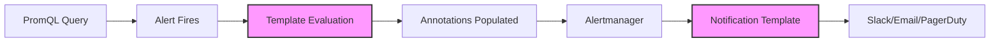
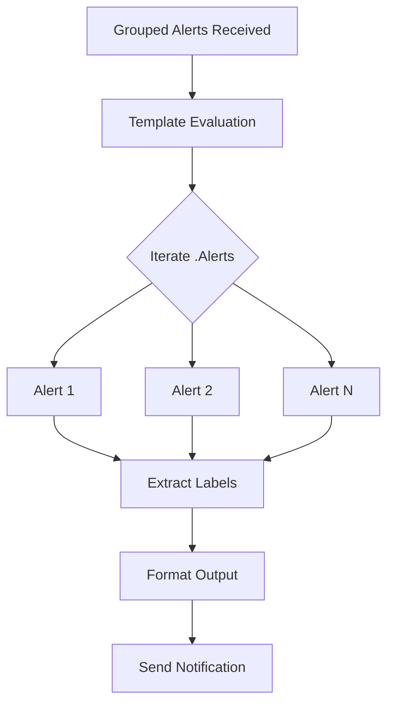

# How to Create Prometheus Template Functions

Author: [nawazdhandala](https://github.com/nawazdhandala)

Tags: Prometheus, Templates, Alerting, PromQL

Description: Learn how to create and use Prometheus template functions to build dynamic, context-rich alert messages that help you respond to incidents faster.

---

Prometheus alerting is powerful, but raw alerts with just metric names and values are not enough. When an alert fires at 3 AM, you need context: which service is affected, what the threshold was, how bad the situation is, and what you should do next. Prometheus template functions let you transform raw alert data into actionable, human-readable messages.

This guide covers everything you need to know about Prometheus template functions, from basic syntax to advanced patterns that will make your on-call rotations significantly less painful.

---

## Table of Contents

1. What Are Prometheus Templates?
2. Template Syntax Basics
3. Built-in Template Functions
4. Working with Labels
5. Formatting Numbers and Time
6. Conditional Logic in Templates
7. Iterating Over Data
8. External Labels and Annotations
9. Common Template Patterns
10. Testing Your Templates
11. Production Best Practices

---

## 1. What Are Prometheus Templates?

Prometheus templates use Go's text/template package to generate dynamic content in alerting rules and notification configurations. They allow you to insert metric values, labels, and computed expressions into alert titles, descriptions, and runbook links.

Templates are evaluated in two contexts: within Alertmanager for notifications and within Prometheus for alert annotations.



---

## 2. Template Syntax Basics

Templates use double curly braces to denote expressions. Everything inside `{{ }}` is evaluated, and everything outside is literal text.

### Basic Variable Access

The simplest templates access predefined variables directly.

```yaml
# prometheus-rules.yaml
groups:
  - name: example-alerts
    rules:
      - alert: HighErrorRate
        expr: rate(http_requests_total{status=~"5.."}[5m]) > 0.1
        for: 5m
        labels:
          severity: critical
        annotations:
          summary: "High error rate on {{ $labels.instance }}"
          description: "Error rate is {{ $value }} errors/sec on {{ $labels.job }}"
```

In this example, `$labels` gives you access to all labels from the alert, and `$value` contains the current value of the alerting expression.

### Available Variables in Prometheus Rules

| Variable | Type | Description |
|----------|------|-------------|
| `$labels` | map | Labels from the alerting expression |
| `$value` | float | Current value of the expression |
| `$externalLabels` | map | Global external labels from Prometheus config |

---

## 3. Built-in Template Functions

Prometheus and Alertmanager include numerous built-in functions that transform data within templates.

### String Functions

String manipulation is essential for creating readable alert messages.

```yaml
annotations:
  # Convert to uppercase
  summary: "Alert on {{ $labels.instance | toUpper }}"

  # Convert to lowercase
  service: "{{ $labels.job | toLower }}"

  # Get first part of a domain
  hostname: "{{ $labels.instance | reReplaceAll \":.*\" \"\" }}"

  # Replace characters
  safe_name: "{{ $labels.service | reReplaceAll \"-\" \"_\" }}"
```

Here is a reference table of string functions.

| Function | Description | Example |
|----------|-------------|---------|
| `toUpper` | Convert to uppercase | `{{ "hello" \| toUpper }}` returns `HELLO` |
| `toLower` | Convert to lowercase | `{{ "HELLO" \| toLower }}` returns `hello` |
| `title` | Title case | `{{ "hello world" \| title }}` returns `Hello World` |
| `reReplaceAll` | Regex replace | `{{ "foo:9090" \| reReplaceAll ":.*" "" }}` returns `foo` |
| `match` | Regex match test | `{{ match "^prod" $labels.env }}` returns true/false |

### Math Functions

Math functions help you present values in meaningful ways.

```yaml
annotations:
  # Round to integer
  description: "CPU usage is {{ $value | printf \"%.0f\" }}%"

  # Humanize large numbers
  requests: "Processing {{ $value | humanize }} requests/sec"

  # Humanize with SI units
  bytes: "Disk usage is {{ $value | humanize1024 }}B"
```

---

## 4. Working with Labels

Labels are the foundation of meaningful alerts. Template functions help you extract, transform, and combine label values.

### Accessing Specific Labels

Access labels using dot notation on the `$labels` map.

```yaml
groups:
  - name: service-alerts
    rules:
      - alert: ServiceDown
        expr: up == 0
        for: 1m
        labels:
          severity: critical
        annotations:
          summary: "{{ $labels.job }} is down on {{ $labels.instance }}"
          description: |
            Service {{ $labels.job }} on instance {{ $labels.instance }}
            has been down for more than 1 minute.

            Environment: {{ $labels.env }}
            Region: {{ $labels.region }}
```

### Handling Missing Labels

When a label might not exist, use the `or` function to provide defaults.

```yaml
annotations:
  # Provide default if label is missing
  environment: "{{ $labels.env | default \"unknown\" }}"

  # Check if label exists before using
  team: "{{ if $labels.team }}{{ $labels.team }}{{ else }}unassigned{{ end }}"
```

### Combining Multiple Labels

Build context-rich messages by combining several labels.

```yaml
annotations:
  summary: "[{{ $labels.severity | toUpper }}] {{ $labels.alertname }} on {{ $labels.cluster }}/{{ $labels.namespace }}"
  runbook: "https://wiki.example.com/runbooks/{{ $labels.alertname | toLower }}"
```

---

## 5. Formatting Numbers and Time

Raw numbers from metrics are often hard to interpret. Template functions help you present data in human-readable formats.

### Number Formatting with printf

The `printf` function gives you precise control over number formatting.

```yaml
annotations:
  # Fixed decimal places
  cpu: "CPU usage: {{ printf \"%.2f\" $value }}%"

  # Percentage from ratio
  error_rate: "Error rate: {{ printf \"%.1f\" (mul $value 100) }}%"

  # Scientific notation for large numbers
  events: "{{ printf \"%.2e\" $value }} events processed"

  # Integer only
  count: "{{ printf \"%.0f\" $value }} active connections"
```

### Humanize Functions

Humanize functions automatically add appropriate suffixes for large numbers.

```yaml
annotations:
  # Standard humanize (1000-based)
  requests: "{{ $value | humanize }} requests/sec"
  # Output: "1.5M requests/sec" for 1500000

  # Binary humanize (1024-based, good for bytes)
  memory: "{{ $value | humanize1024 }}B used"
  # Output: "1.5GiB used" for 1610612736

  # Duration formatting
  uptime: "Service uptime: {{ $value | humanizeDuration }}"
  # Output: "2d 5h 30m" for 191400 seconds
```

### Time Formatting

Format timestamps for human readability.

```yaml
annotations:
  # Current time
  fired_at: "Alert fired at {{ now | date \"2006-01-02 15:04:05 MST\" }}"

  # Relative time
  since: "Issue started {{ humanizeDuration $value }} ago"
```

---

## 6. Conditional Logic in Templates

Use conditionals to create context-aware alert messages that adapt based on severity, values, or label presence.

### Basic If-Else Statements

Control what appears in your alerts based on conditions.

```yaml
annotations:
  summary: |
    {{ if gt $value 0.9 }}
    CRITICAL: {{ $labels.service }} error rate is {{ printf "%.1f" (mul $value 100) }}%
    {{ else if gt $value 0.5 }}
    WARNING: {{ $labels.service }} error rate elevated at {{ printf "%.1f" (mul $value 100) }}%
    {{ else }}
    INFO: {{ $labels.service }} error rate is {{ printf "%.1f" (mul $value 100) }}%
    {{ end }}
```

### Comparison Operators

Templates support standard comparison operators.

| Operator | Description | Example |
|----------|-------------|---------|
| `eq` | Equal | `{{ if eq $labels.env "prod" }}` |
| `ne` | Not equal | `{{ if ne $labels.severity "info" }}` |
| `lt` | Less than | `{{ if lt $value 10 }}` |
| `le` | Less than or equal | `{{ if le $value 10 }}` |
| `gt` | Greater than | `{{ if gt $value 100 }}` |
| `ge` | Greater than or equal | `{{ if ge $value 100 }}` |

### Boolean Logic

Combine conditions using `and`, `or`, and `not`.

```yaml
annotations:
  description: |
    {{ if and (eq $labels.env "prod") (gt $value 0.5) }}
    URGENT: Production service {{ $labels.service }} needs immediate attention!
    {{ else if or (eq $labels.env "staging") (eq $labels.env "dev") }}
    Non-production alert: {{ $labels.service }} in {{ $labels.env }}
    {{ end }}
```

---

## 7. Iterating Over Data

When working with Alertmanager templates, you often need to iterate over multiple alerts or labels.

### Iterating Over Alerts in Alertmanager

Alertmanager templates receive grouped alerts that you can iterate over.

```yaml
# alertmanager.yaml
templates:
  - '/etc/alertmanager/templates/*.tmpl'

receivers:
  - name: 'slack-notifications'
    slack_configs:
      - channel: '#alerts'
        title: '{{ template "slack.title" . }}'
        text: '{{ template "slack.text" . }}'
```

Create a custom template file for iteration.

```go-template
{{ define "slack.title" }}
[{{ .Status | toUpper }}] {{ .Alerts | len }} alert(s) for {{ .GroupLabels.alertname }}
{{ end }}

{{ define "slack.text" }}
{{ range .Alerts }}
*Alert:* {{ .Labels.alertname }}
*Instance:* {{ .Labels.instance }}
*Severity:* {{ .Labels.severity }}
*Value:* {{ .Annotations.value }}
*Description:* {{ .Annotations.description }}
---
{{ end }}
{{ end }}
```

### Iterating Over Labels

List all labels in an alert for debugging or comprehensive notifications.

```go-template
{{ define "alert.labels" }}
Labels:
{{ range $key, $value := .Labels }}
  - {{ $key }}: {{ $value }}
{{ end }}
{{ end }}
```

The iteration flow in Alertmanager templates looks like this.



---

## 8. External Labels and Annotations

External labels and annotations provide additional context that makes alerts more actionable.

### Using External Labels

External labels are defined in your Prometheus configuration and are available in all templates.

```yaml
# prometheus.yaml
global:
  external_labels:
    cluster: production-us-east
    team: platform
    environment: production
```

Access them in your alert rules.

```yaml
annotations:
  summary: "Alert on cluster {{ $externalLabels.cluster }}"
  dashboard: "https://grafana.example.com/d/abc123?var-cluster={{ $externalLabels.cluster }}"
  runbook: "https://wiki.example.com/{{ $externalLabels.team }}/runbooks/{{ $labels.alertname }}"
```

### Building Dynamic Links

Create links that deep-dive into the exact problem.

```yaml
annotations:
  # Link to Grafana with pre-filled variables
  grafana_dashboard: |
    https://grafana.example.com/d/service-dashboard?
    orgId=1&
    var-service={{ $labels.service }}&
    var-instance={{ $labels.instance }}&
    from=now-1h&
    to=now

  # Link to logs
  logs_link: |
    https://oneuptime.com/logs?
    query=service%3D{{ $labels.service }}%20AND%20level%3Derror&
    from={{ now | date "2006-01-02T15:04:05Z" }}

  # Link to runbook
  runbook_url: "https://runbooks.example.com/alerts/{{ $labels.alertname | toLower | reReplaceAll \" \" \"-\" }}"
```

---

## 9. Common Template Patterns

Here are battle-tested patterns that work well in production environments.

### Pattern 1: Severity-Based Formatting

Adjust message urgency based on alert severity.

```yaml
groups:
  - name: http-alerts
    rules:
      - alert: HighLatency
        expr: histogram_quantile(0.99, rate(http_request_duration_seconds_bucket[5m])) > 1
        for: 5m
        labels:
          severity: |
            {{ if gt $value 5 }}critical{{ else if gt $value 2 }}warning{{ else }}info{{ end }}
        annotations:
          summary: |
            {{ if gt $value 5 }}[CRITICAL]{{ else if gt $value 2 }}[WARNING]{{ else }}[INFO]{{ end }} High latency detected on {{ $labels.service }}
          description: |
            P99 latency is {{ printf "%.2f" $value }}s (threshold: 1s)

            {{ if gt $value 5 }}
            Immediate action required. Consider:
            - Scaling up the service
            - Checking for downstream dependencies
            - Reviewing recent deployments
            {{ else if gt $value 2 }}
            Investigation recommended within 30 minutes.
            {{ end }}
```

### Pattern 2: Resource Usage Alerts

Create informative alerts for resource consumption.

```yaml
groups:
  - name: resource-alerts
    rules:
      - alert: DiskSpaceLow
        expr: (node_filesystem_avail_bytes / node_filesystem_size_bytes) * 100 < 15
        for: 10m
        labels:
          severity: warning
        annotations:
          summary: "Disk space low on {{ $labels.instance }}"
          description: |
            Filesystem {{ $labels.mountpoint }} on {{ $labels.instance }} has only {{ printf "%.1f" $value }}% free space.

            Available: {{ with printf "node_filesystem_avail_bytes{instance='%s',mountpoint='%s'}" $labels.instance $labels.mountpoint | query }}{{ . | first | value | humanize1024 }}B{{ end }}
            Total: {{ with printf "node_filesystem_size_bytes{instance='%s',mountpoint='%s'}" $labels.instance $labels.mountpoint | query }}{{ . | first | value | humanize1024 }}B{{ end }}
          runbook: "https://wiki.example.com/runbooks/disk-space-low"
```

### Pattern 3: Service Dependency Alerts

Show the impact of service failures.

```yaml
groups:
  - name: dependency-alerts
    rules:
      - alert: UpstreamServiceDown
        expr: probe_success{job="blackbox"} == 0
        for: 2m
        labels:
          severity: critical
        annotations:
          summary: "Upstream service {{ $labels.target }} is unreachable"
          description: |
            The service at {{ $labels.target }} has been unreachable for more than 2 minutes.

            This may affect:
            {{ if match "payment" $labels.target }}
            - Payment processing
            - Order completion
            {{ else if match "auth" $labels.target }}
            - User authentication
            - Session management
            {{ else if match "inventory" $labels.target }}
            - Stock availability checks
            - Cart operations
            {{ else }}
            - Unknown downstream services
            {{ end }}

            Last successful probe: {{ with printf "probe_success{target='%s'}" $labels.target | query }}{{ . | first | value }}{{ end }}
```

### Pattern 4: Alertmanager Slack Template

A comprehensive Slack template for Alertmanager.

```go-template
{{ define "__alert_severity_prefix" -}}
{{ if ne .Status "firing" -}}
:white_check_mark:
{{- else if eq .Labels.severity "critical" -}}
:rotating_light:
{{- else if eq .Labels.severity "warning" -}}
:warning:
{{- else -}}
:information_source:
{{- end }}
{{- end }}

{{ define "slack.title" -}}
{{ template "__alert_severity_prefix" . }} [{{ .Status | toUpper }}{{ if eq .Status "firing" }} x {{ .Alerts.Firing | len }}{{ end }}] {{ .GroupLabels.alertname }}
{{- end }}

{{ define "slack.text" -}}
{{ range .Alerts -}}
*Alert:* {{ .Annotations.summary }}
*Severity:* {{ .Labels.severity }}
*Instance:* {{ .Labels.instance }}
{{ if .Annotations.description }}*Description:* {{ .Annotations.description }}{{ end }}
{{ if .Annotations.runbook_url }}*Runbook:* <{{ .Annotations.runbook_url }}|View Runbook>{{ end }}
{{ if .Annotations.grafana_dashboard }}*Dashboard:* <{{ .Annotations.grafana_dashboard }}|View Dashboard>{{ end }}

{{ end }}
{{- end }}
```

---

## 10. Testing Your Templates

Always test templates before deploying them to production.

### Using promtool

Prometheus includes a tool for testing alert rules and their templates.

```bash
# Validate your rules file
promtool check rules prometheus-rules.yaml

# Test specific rules
promtool test rules tests.yaml
```

Create a test file to verify your templates produce expected output.

```yaml
# tests.yaml
rule_files:
  - prometheus-rules.yaml

evaluation_interval: 1m

tests:
  - interval: 1m
    input_series:
      - series: 'http_requests_total{job="api",instance="server1:9090",status="500"}'
        values: '0+10x10'

    alert_rule_test:
      - eval_time: 5m
        alertname: HighErrorRate
        exp_alerts:
          - exp_labels:
              severity: critical
              job: api
              instance: server1:9090
            exp_annotations:
              summary: "High error rate on server1:9090"
```

### Using amtool for Alertmanager Templates

Test Alertmanager templates with amtool.

```bash
# Check Alertmanager config including templates
amtool check-config alertmanager.yaml

# Test template rendering
amtool template test template.tmpl
```

### Manual Template Testing

Create a simple Go program to test complex templates.

```go
package main

import (
    "os"
    "text/template"
)

func main() {
    tmpl := `
{{ if gt .Value 0.9 }}
CRITICAL: Error rate is {{ printf "%.1f" (mul .Value 100) }}%
{{ else }}
WARNING: Error rate is {{ printf "%.1f" (mul .Value 100) }}%
{{ end }}
`

    funcMap := template.FuncMap{
        "mul": func(a, b float64) float64 { return a * b },
    }

    t := template.Must(template.New("test").Funcs(funcMap).Parse(tmpl))

    data := struct {
        Value float64
    }{
        Value: 0.95,
    }

    t.Execute(os.Stdout, data)
}
```

---

## 11. Production Best Practices

### Keep Templates Readable

Break complex templates into multiple annotations rather than one massive block.

```yaml
# Good: Separate concerns
annotations:
  summary: "{{ $labels.alertname }} on {{ $labels.instance }}"
  description: "{{ $labels.job }} is experiencing issues"
  impact: "Users may see degraded performance"
  action: "Check the runbook for remediation steps"
  runbook_url: "https://wiki.example.com/runbooks/{{ $labels.alertname }}"
  dashboard_url: "https://grafana.example.com/d/abc123"

# Avoid: Everything in one field
annotations:
  description: "{{ $labels.alertname }} on {{ $labels.instance }}. {{ $labels.job }} is experiencing issues. Users may see degraded performance. Check the runbook at https://wiki.example.com/runbooks/{{ $labels.alertname }}. Dashboard: https://grafana.example.com/d/abc123"
```

### Use Consistent Naming

Establish conventions for annotation names across your organization.

| Annotation | Purpose |
|------------|---------|
| `summary` | One-line alert description |
| `description` | Detailed context and current values |
| `impact` | Who/what is affected |
| `action` | What the responder should do |
| `runbook_url` | Link to remediation documentation |
| `dashboard_url` | Link to relevant dashboard |
| `logs_url` | Link to filtered log view |

### Handle Edge Cases

Always account for missing labels and zero values.

```yaml
annotations:
  summary: |
    {{ $labels.alertname }} on {{ $labels.instance | default "unknown instance" }}
  description: |
    {{ if $value }}
    Current value: {{ printf "%.2f" $value }}
    {{ else }}
    Value unavailable
    {{ end }}
    Service: {{ $labels.service | default "unspecified" }}
```

### Version Control Your Templates

Store alert rules and templates in version control with your infrastructure code.

```
alerting/
  rules/
    service-alerts.yaml
    infrastructure-alerts.yaml
    slo-alerts.yaml
  templates/
    slack.tmpl
    pagerduty.tmpl
    email.tmpl
  tests/
    service-alerts-test.yaml
    infrastructure-alerts-test.yaml
```

### Document Custom Functions

If you add custom template functions, document them for your team.

```yaml
# Custom Functions Reference
#
# truncate(s string, n int) - Truncate string to n characters
# toSlackMention(team string) - Convert team name to Slack mention
# envEmoji(env string) - Return emoji for environment
```

---

## Summary

Prometheus template functions transform basic alerts into actionable notifications that help your team respond faster and more effectively.

| Key Point | Recommendation |
|-----------|----------------|
| Use built-in functions | Leverage `humanize`, `printf`, and string functions for readable output |
| Handle missing data | Always provide defaults for optional labels |
| Build useful links | Generate dashboard and runbook links dynamically |
| Test before deploying | Use promtool and amtool to validate templates |
| Keep templates maintainable | Split complex logic across multiple annotations |

Well-crafted templates reduce mean time to resolution by giving responders the context they need immediately. Invest time in your templates, and your on-call rotations will thank you.

---

*Need to send your Prometheus alerts somewhere? [OneUptime](https://oneuptime.com) accepts alerts from Prometheus Alertmanager and provides incident management, status pages, and on-call scheduling in one platform.*

---

**Related Reading:**

- [18 SRE Metrics Worth Tracking](https://oneuptime.com/blog/post/2025-11-28-sre-metrics-to-track/view)
- [Monitoring vs Observability for SRE](https://oneuptime.com/blog/post/2025-11-28-monitoring-vs-observability-sre/view)
- [SRE Best Practices](https://oneuptime.com/blog/post/2025-11-28-sre-best-practices/view)
