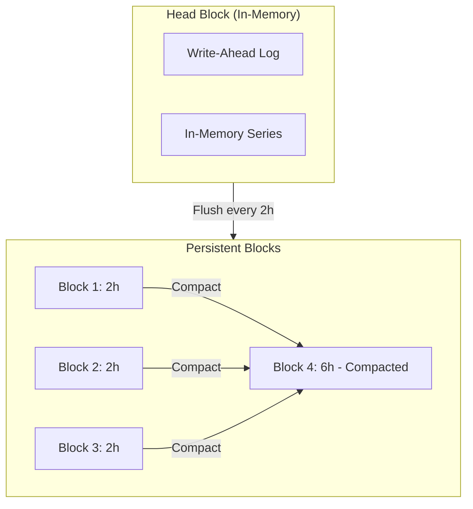
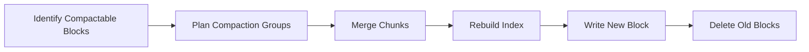
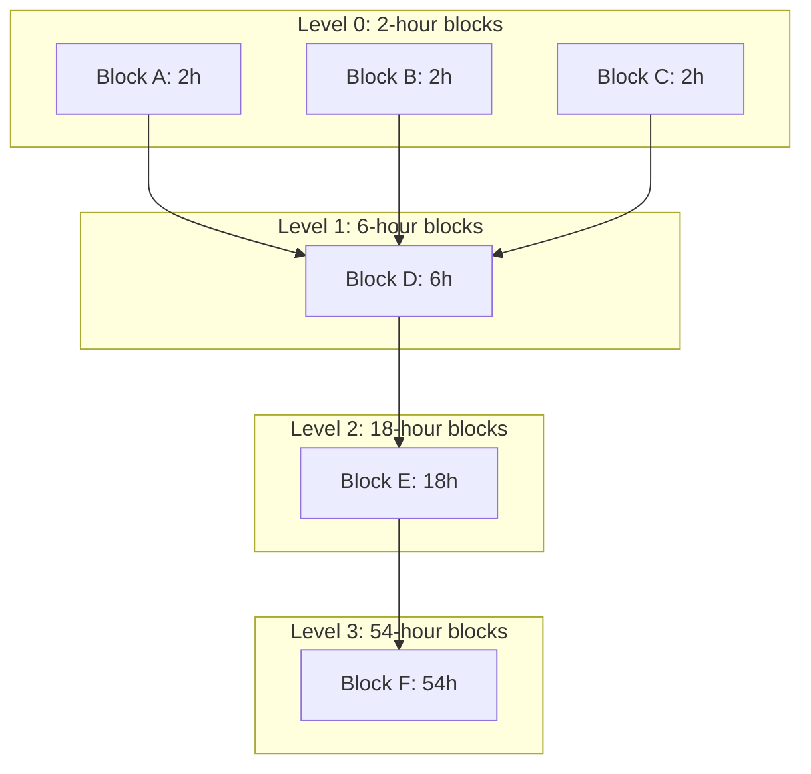

# How to Build Prometheus TSDB Compaction

Author: [nawazdhandala](https://github.com/nawazdhandala)

Tags: Prometheus, TSDB, Storage, Performance

Description: A deep dive into building and understanding Prometheus TSDB compaction, from block structure to custom compaction strategies.

---

Prometheus stores metrics in a custom time-series database called TSDB. Over time, your disk fills with small blocks of data that need to be merged, deduplicated, and downsampled. This process is called compaction. Understanding how compaction works is essential if you want to tune Prometheus for performance, debug storage issues, or build your own TSDB-inspired system.

## Why Compaction Matters

Without compaction, you would have thousands of tiny blocks cluttering your disk. Queries would slow to a crawl because each query must scan multiple blocks. Compaction solves three problems:

1. **Reduces block count:** Merges small blocks into larger ones, reducing directory entries and file handles.
2. **Removes deleted and outdated samples:** Tombstones and out-of-order data get cleaned up.
3. **Improves query performance:** Larger blocks mean fewer seeks and better cache efficiency.

## How Prometheus TSDB Stores Data

Before diving into compaction, you need to understand the block structure.



Prometheus organizes data into:

- **Head block:** The in-memory, actively written block backed by a Write-Ahead Log (WAL).
- **Persistent blocks:** Immutable, time-bounded directories on disk. Each block covers a specific time range.

A typical block directory looks like this:

```
01HQXYZ123ABC456/
    meta.json       # Block metadata (time range, stats)
    index           # Inverted index for label lookups
    chunks/
        000001      # Compressed chunk files
    tombstones      # Deletion markers
```

## The Compaction Algorithm

Compaction in Prometheus follows a leveled approach inspired by LSM trees. Here is the core algorithm:



### Step 1: Identify Compactable Blocks

The compactor scans the data directory and finds blocks that can be merged. Blocks are candidates if:

- They are adjacent in time (no gaps).
- Their combined size stays within the maximum block duration (default 31 days, configurable).
- They are not currently being queried or written.

Here is a simplified function to find compaction candidates:

```go
func planCompaction(blocks []Block, maxBlockDuration time.Duration) [][]Block {
    var plans [][]Block

    // Sort blocks by minimum time
    sort.Slice(blocks, func(i, j int) bool {
        return blocks[i].MinTime < blocks[j].MinTime
    })

    var current []Block
    var currentDuration time.Duration

    for _, b := range blocks {
        blockDuration := time.Duration(b.MaxTime - b.MinTime)

        if currentDuration + blockDuration <= maxBlockDuration {
            current = append(current, b)
            currentDuration += blockDuration
        } else {
            if len(current) > 1 {
                plans = append(plans, current)
            }
            current = []Block{b}
            currentDuration = blockDuration
        }
    }

    if len(current) > 1 {
        plans = append(plans, current)
    }

    return plans
}
```

### Step 2: Merge Chunks

Once you have a compaction plan, you need to merge the chunks from all source blocks. The merge process must:

- Deduplicate samples with identical timestamps.
- Handle tombstones (skip deleted data).
- Re-encode chunks for optimal compression.

The following code shows how to merge series from multiple blocks:

```go
type SeriesMerger struct {
    blocks  []Block
    current map[string]*MergedSeries
}

func (m *SeriesMerger) MergeSeries() []*MergedSeries {
    // Create a heap of iterators, one per block
    iterators := make([]SeriesIterator, len(m.blocks))
    for i, b := range m.blocks {
        iterators[i] = b.SeriesIterator()
    }

    heap := NewSeriesHeap(iterators)

    var result []*MergedSeries

    for heap.Len() > 0 {
        // Get series with smallest label set
        series := heap.Pop()

        // Find all series with same labels across blocks
        toMerge := []*Series{series}
        for heap.Len() > 0 && heap.Peek().Labels.Equal(series.Labels) {
            toMerge = append(toMerge, heap.Pop())
        }

        // Merge samples from all matching series
        merged := mergeSamples(toMerge)
        result = append(result, merged)
    }

    return result
}

func mergeSamples(series []*Series) *MergedSeries {
    // Use a min-heap to merge samples by timestamp
    samples := NewSampleHeap()

    for _, s := range series {
        for _, sample := range s.Samples {
            samples.Push(sample)
        }
    }

    var merged []Sample
    var lastTimestamp int64 = -1

    for samples.Len() > 0 {
        sample := samples.Pop()

        // Skip duplicates (same timestamp)
        if sample.Timestamp == lastTimestamp {
            continue
        }

        merged = append(merged, sample)
        lastTimestamp = sample.Timestamp
    }

    return &MergedSeries{Samples: merged}
}
```

### Step 3: Rebuild the Index

The index is an inverted index mapping label pairs to series IDs. After merging, you need to rebuild it for the new block.

```go
type IndexBuilder struct {
    postings map[string]map[string][]uint64  // label -> value -> series IDs
    symbols  map[string]uint32               // string -> symbol ID
}

func (b *IndexBuilder) AddSeries(id uint64, labels Labels) {
    for _, l := range labels {
        // Add to symbol table
        if _, ok := b.symbols[l.Name]; !ok {
            b.symbols[l.Name] = uint32(len(b.symbols))
        }
        if _, ok := b.symbols[l.Value]; !ok {
            b.symbols[l.Value] = uint32(len(b.symbols))
        }

        // Add to postings
        if b.postings[l.Name] == nil {
            b.postings[l.Name] = make(map[string][]uint64)
        }
        b.postings[l.Name][l.Value] = append(
            b.postings[l.Name][l.Value],
            id,
        )
    }
}

func (b *IndexBuilder) Write(path string) error {
    f, err := os.Create(path)
    if err != nil {
        return err
    }
    defer f.Close()

    // Write header
    f.Write([]byte("INDEX"))

    // Write symbol table
    for sym, id := range b.symbols {
        binary.Write(f, binary.BigEndian, id)
        binary.Write(f, binary.BigEndian, uint16(len(sym)))
        f.Write([]byte(sym))
    }

    // Write postings
    for label, values := range b.postings {
        for value, ids := range values {
            // Write label/value reference
            binary.Write(f, binary.BigEndian, b.symbols[label])
            binary.Write(f, binary.BigEndian, b.symbols[value])

            // Write posting list
            binary.Write(f, binary.BigEndian, uint32(len(ids)))
            for _, id := range ids {
                binary.Write(f, binary.BigEndian, id)
            }
        }
    }

    return nil
}
```

### Step 4: Write the New Block

With merged chunks and a rebuilt index, write the new block atomically.

```go
func writeBlock(dir string, series []*MergedSeries, mint, maxt int64) error {
    // Create temporary directory
    tmpDir := dir + ".tmp"
    os.MkdirAll(tmpDir, 0755)
    os.MkdirAll(filepath.Join(tmpDir, "chunks"), 0755)

    // Write chunks
    chunkWriter := NewChunkWriter(filepath.Join(tmpDir, "chunks"))
    indexBuilder := &IndexBuilder{
        postings: make(map[string]map[string][]uint64),
        symbols:  make(map[string]uint32),
    }

    for id, s := range series {
        // Encode and write chunks
        ref, err := chunkWriter.WriteChunks(s.Chunks)
        if err != nil {
            return err
        }

        // Add to index
        indexBuilder.AddSeries(uint64(id), s.Labels)
    }

    chunkWriter.Close()

    // Write index
    indexBuilder.Write(filepath.Join(tmpDir, "index"))

    // Write metadata
    meta := BlockMeta{
        ULID:    ulid.New(),
        MinTime: mint,
        MaxTime: maxt,
        Stats: BlockStats{
            NumSeries:  len(series),
            NumChunks:  chunkWriter.NumChunks(),
            NumSamples: chunkWriter.NumSamples(),
        },
    }
    writeMeta(filepath.Join(tmpDir, "meta.json"), meta)

    // Atomic rename
    return os.Rename(tmpDir, dir)
}
```

### Step 5: Delete Old Blocks

After the new block is written, remove the source blocks. This must happen carefully to avoid data loss.

```go
func deleteOldBlocks(blocks []Block) error {
    for _, b := range blocks {
        // Mark block as deletable
        tombstone := filepath.Join(b.Dir, "tombstone")
        if err := os.WriteFile(tombstone, nil, 0644); err != nil {
            return err
        }
    }

    // Give queries time to finish (grace period)
    time.Sleep(5 * time.Minute)

    for _, b := range blocks {
        if err := os.RemoveAll(b.Dir); err != nil {
            return err
        }
    }

    return nil
}
```

## Compaction Levels Explained

Prometheus uses a leveled compaction strategy where block sizes grow exponentially:



The default compaction ranges in Prometheus are:

| Level | Block Duration | Typical Count |
|-------|----------------|---------------|
| 0     | 2 hours        | Many          |
| 1     | 6 hours        | Fewer         |
| 2     | 18 hours       | Even fewer    |
| 3+    | Up to 31 days  | Few           |

This leveled approach balances write amplification (how many times data gets rewritten) against query performance (fewer blocks to scan).

## Building a Custom Compactor

Here is a complete, minimal compactor implementation:

```go
package compactor

import (
    "context"
    "os"
    "path/filepath"
    "sort"
    "time"
)

type Compactor struct {
    dataDir          string
    maxBlockDuration time.Duration
    minBlocksToMerge int
}

func New(dataDir string) *Compactor {
    return &Compactor{
        dataDir:          dataDir,
        maxBlockDuration: 31 * 24 * time.Hour,
        minBlocksToMerge: 3,
    }
}

func (c *Compactor) Run(ctx context.Context) error {
    ticker := time.NewTicker(1 * time.Hour)
    defer ticker.Stop()

    for {
        select {
        case <-ctx.Done():
            return ctx.Err()
        case <-ticker.C:
            if err := c.Compact(); err != nil {
                // Log error but continue
                continue
            }
        }
    }
}

func (c *Compactor) Compact() error {
    // List all blocks
    blocks, err := c.listBlocks()
    if err != nil {
        return err
    }

    // Plan compactions
    plans := c.planCompactions(blocks)

    // Execute each plan
    for _, plan := range plans {
        if err := c.compactBlocks(plan); err != nil {
            return err
        }
    }

    return nil
}

func (c *Compactor) listBlocks() ([]Block, error) {
    entries, err := os.ReadDir(c.dataDir)
    if err != nil {
        return nil, err
    }

    var blocks []Block
    for _, e := range entries {
        if !e.IsDir() {
            continue
        }

        metaPath := filepath.Join(c.dataDir, e.Name(), "meta.json")
        meta, err := readMeta(metaPath)
        if err != nil {
            continue
        }

        blocks = append(blocks, Block{
            Dir:     filepath.Join(c.dataDir, e.Name()),
            MinTime: meta.MinTime,
            MaxTime: meta.MaxTime,
            Meta:    meta,
        })
    }

    return blocks, nil
}

func (c *Compactor) planCompactions(blocks []Block) [][]Block {
    // Sort by time
    sort.Slice(blocks, func(i, j int) bool {
        return blocks[i].MinTime < blocks[j].MinTime
    })

    // Group adjacent blocks within duration limit
    var plans [][]Block
    var current []Block
    var currentDuration int64

    for _, b := range blocks {
        blockDuration := b.MaxTime - b.MinTime
        maxDurationMs := c.maxBlockDuration.Milliseconds()

        if currentDuration+blockDuration <= maxDurationMs {
            current = append(current, b)
            currentDuration += blockDuration
        } else {
            if len(current) >= c.minBlocksToMerge {
                plans = append(plans, current)
            }
            current = []Block{b}
            currentDuration = blockDuration
        }
    }

    if len(current) >= c.minBlocksToMerge {
        plans = append(plans, current)
    }

    return plans
}

func (c *Compactor) compactBlocks(blocks []Block) error {
    // Calculate time range for new block
    minTime := blocks[0].MinTime
    maxTime := blocks[len(blocks)-1].MaxTime

    // Merge all series
    merger := NewSeriesMerger(blocks)
    mergedSeries := merger.MergeSeries()

    // Write new block
    newDir := filepath.Join(c.dataDir, ulid.New().String())
    if err := writeBlock(newDir, mergedSeries, minTime, maxTime); err != nil {
        return err
    }

    // Delete old blocks
    return deleteOldBlocks(blocks)
}
```

## Tuning Compaction for Performance

Here are key parameters to tune:

**Block duration:** Longer blocks mean fewer files but slower compactions. Start with the default 2h for level 0.

```yaml
# prometheus.yml
storage:
  tsdb:
    min-block-duration: 2h
    max-block-duration: 31d
```

**Retention:** Compaction interacts with retention. Old blocks are deleted before compaction if they exceed retention.

```yaml
storage:
  tsdb:
    retention.time: 15d
    retention.size: 50GB
```

**Compaction concurrency:** Prometheus compacts one plan at a time by default. For high-cardinality workloads, this can become a bottleneck.

## Monitoring Compaction

Track these metrics to understand compaction health:

```
prometheus_tsdb_compactions_total
prometheus_tsdb_compaction_duration_seconds
prometheus_tsdb_compactions_failed_total
prometheus_tsdb_blocks_loaded
prometheus_tsdb_storage_blocks_bytes
```

Set up alerts for compaction failures:

```yaml
groups:
  - name: tsdb
    rules:
      - alert: TSDBCompactionFailing
        expr: increase(prometheus_tsdb_compactions_failed_total[1h]) > 0
        for: 5m
        labels:
          severity: warning
        annotations:
          summary: TSDB compaction is failing
```

## Common Compaction Issues

| Problem | Symptom | Solution |
|---------|---------|----------|
| Disk full during compaction | Compaction fails, old blocks accumulate | Ensure 2x free space of largest compaction group |
| Slow queries after restart | Block loading takes minutes | Use memory-mapped chunks, add SSD storage |
| High write amplification | Disk I/O spikes hourly | Increase min-block-duration, reduce cardinality |
| Tombstones not cleaned | Deleted data still on disk | Wait for next compaction cycle, check retention |

## How OneUptime Uses TSDB Compaction

OneUptime ingests metrics via OTLP and stores them in a Prometheus-compatible TSDB. Our compaction strategy is tuned for:

- **High cardinality workloads:** We handle millions of unique series by using aggressive downsampling during compaction.
- **Long retention:** Historical data is compacted into larger blocks and moved to cheaper storage tiers.
- **Query performance:** Compacted blocks are optimized for the queries our alerting engine runs most frequently.

If you are building observability infrastructure, understanding compaction is essential. It determines how much disk you need, how fast queries run, and how your system behaves under load.

---

## Summary

Prometheus TSDB compaction is a multi-step process that merges small blocks into larger ones, rebuilds indexes, and cleans up deleted data. The key components are:

1. **Block structure:** Head block (in-memory) plus persistent blocks on disk.
2. **Compaction planning:** Identify adjacent blocks within duration limits.
3. **Series merging:** Deduplicate samples, apply tombstones, re-encode chunks.
4. **Index rebuilding:** Create new inverted index for the merged block.
5. **Atomic writes:** Write new block to temp directory, rename atomically.
6. **Cleanup:** Delete source blocks after grace period.

Tuning compaction requires balancing write amplification, query performance, and disk usage. Monitor compaction metrics and set up alerts for failures. With proper tuning, Prometheus TSDB can handle millions of series with predictable performance.
