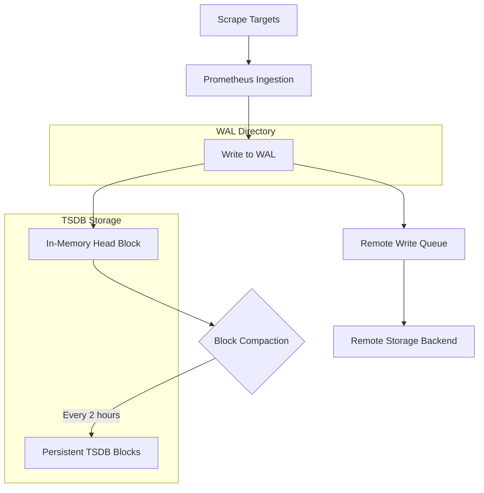
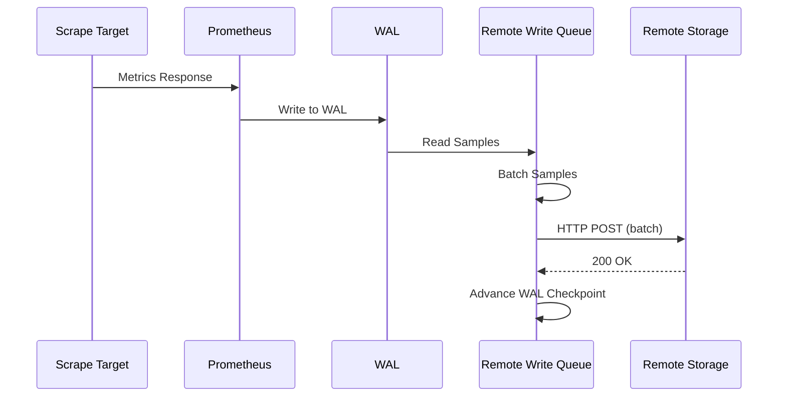

# How to Implement Prometheus WAL Configuration

Author: [nawazdhandala](https://github.com/nawazdhandala)

Tags: Prometheus, WAL, Storage, Reliability

Description: A practical guide to configuring the Prometheus Write-Ahead Log (WAL) for improved data durability, crash recovery, and remote write performance.

---

The Write-Ahead Log (WAL) is one of the most critical components in Prometheus, yet it remains poorly understood by many operators. When Prometheus scrapes metrics, it does not immediately write them to disk blocks. Instead, it first writes them to the WAL, a sequential log that ensures data durability even if Prometheus crashes unexpectedly. Understanding and tuning the WAL can mean the difference between losing minutes of data during a restart and recovering seamlessly.

This guide walks through the WAL architecture, configuration options, performance tuning, and best practices for production deployments.

---

## Table of Contents

1. What is the Prometheus WAL?
2. WAL Architecture and Data Flow
3. Default WAL Behavior
4. Key WAL Configuration Parameters
5. Configuring WAL for Remote Write
6. WAL Compression
7. Monitoring WAL Health
8. Troubleshooting Common WAL Issues
9. Best Practices for Production
10. Summary

---

## 1. What is the Prometheus WAL?

The Write-Ahead Log is a durability mechanism borrowed from database systems. Before Prometheus commits metrics to its time-series database (TSDB) blocks, it writes them sequentially to the WAL. This provides two critical guarantees:

- **Crash Recovery:** If Prometheus crashes or restarts, it can replay the WAL to recover metrics that were not yet persisted to blocks.
- **Remote Write Buffer:** The WAL serves as the source of truth for remote write, allowing Prometheus to send metrics to remote storage systems without data loss.

Think of the WAL as a transaction log. Every sample scraped gets written here first, and only later does Prometheus compact these samples into efficient, queryable blocks.

---

## 2. WAL Architecture and Data Flow

The following diagram illustrates how data flows through Prometheus with the WAL:



Key observations:

- Samples are written to the WAL before being available for queries in the head block.
- Remote write reads from the WAL, not from compacted blocks.
- The WAL is segmented into files, each up to 128 MB by default.
- WAL segments are deleted only after their data has been compacted into blocks.

---

## 3. Default WAL Behavior

Out of the box, Prometheus manages the WAL with sensible defaults:

| Parameter | Default Value | Description |
|-----------|---------------|-------------|
| Segment Size | 128 MB | Maximum size of each WAL segment file |
| Truncation Interval | 2 hours | How often Prometheus truncates old WAL segments |
| Compression | Disabled (pre-2.20), Enabled (2.20+) | Whether WAL segments are compressed |
| WAL Directory | `data/wal/` | Location within the Prometheus data directory |

The WAL grows as Prometheus scrapes more targets. During normal operation, you will see multiple segment files in the `wal/` directory:

```bash
ls -la /var/lib/prometheus/data/wal/
```

Example output:

```
-rw-r--r-- 1 prometheus prometheus 134217728 Jan 30 10:00 00000001
-rw-r--r-- 1 prometheus prometheus 134217728 Jan 30 12:00 00000002
-rw-r--r-- 1 prometheus prometheus  67108864 Jan 30 14:00 00000003
```

---

## 4. Key WAL Configuration Parameters

Prometheus exposes several flags for WAL tuning. Here are the most important ones:

### 4.1 Storage Path

Set the base storage directory, which contains the WAL subdirectory.

```bash
prometheus --storage.tsdb.path=/var/lib/prometheus/data
```

### 4.2 Retention Time

Control how long data is retained. This indirectly affects WAL size since older WAL segments are truncated after their data is compacted.

```bash
prometheus --storage.tsdb.retention.time=15d
```

### 4.3 WAL Compression

Enable WAL compression to reduce disk usage at the cost of slightly higher CPU. This is enabled by default in Prometheus 2.20+.

```bash
prometheus --storage.tsdb.wal-compression
```

### 4.4 Minimum Block Duration

The minimum time range of a block before compaction. Lowering this creates more frequent compactions, which truncates the WAL sooner.

```bash
prometheus --storage.tsdb.min-block-duration=2h
```

### 4.5 Sample Configuration File

Here is a complete Prometheus configuration with WAL-relevant settings:

```yaml
# prometheus.yml
global:
  scrape_interval: 15s
  evaluation_interval: 15s

scrape_configs:
  - job_name: 'prometheus'
    static_configs:
      - targets: ['localhost:9090']

  - job_name: 'node_exporter'
    static_configs:
      - targets: ['node1:9100', 'node2:9100', 'node3:9100']
```

Launch Prometheus with WAL tuning flags:

```bash
prometheus \
  --config.file=/etc/prometheus/prometheus.yml \
  --storage.tsdb.path=/var/lib/prometheus/data \
  --storage.tsdb.retention.time=30d \
  --storage.tsdb.wal-compression \
  --storage.tsdb.min-block-duration=2h \
  --storage.tsdb.max-block-duration=24h
```

---

## 5. Configuring WAL for Remote Write

Remote write is where WAL configuration becomes critical. Prometheus reads from the WAL to send samples to remote storage systems like Cortex, Thanos, Mimir, or OneUptime.

### 5.1 Basic Remote Write Configuration

Add a `remote_write` section to your Prometheus configuration:

```yaml
remote_write:
  - url: "https://oneuptime.com/api/v1/write"
    remote_timeout: 30s
    headers:
      X-OneUptime-Token: "your-api-token"
```

### 5.2 Queue Configuration

The remote write queue buffers samples from the WAL before sending. Tune these parameters based on your network latency and throughput.

```yaml
remote_write:
  - url: "https://oneuptime.com/api/v1/write"
    remote_timeout: 30s
    headers:
      X-OneUptime-Token: "your-api-token"
    queue_config:
      capacity: 10000
      max_shards: 50
      min_shards: 1
      max_samples_per_send: 2000
      batch_send_deadline: 5s
      min_backoff: 30ms
      max_backoff: 5s
      retry_on_http_429: true
```

### 5.3 Queue Configuration Parameters Explained

| Parameter | Description | Recommended Value |
|-----------|-------------|-------------------|
| `capacity` | Total number of samples to buffer per shard | 10000 |
| `max_shards` | Maximum parallel senders | 50 (increase for high throughput) |
| `min_shards` | Minimum parallel senders | 1 |
| `max_samples_per_send` | Batch size per request | 2000 |
| `batch_send_deadline` | Max time to wait before sending partial batch | 5s |
| `min_backoff` | Initial retry delay | 30ms |
| `max_backoff` | Maximum retry delay | 5s |

### 5.4 Remote Write Data Flow



---

## 6. WAL Compression

WAL compression reduces disk I/O and storage requirements. It uses Snappy compression, which provides a good balance between compression ratio and CPU overhead.

### 6.1 Enabling Compression

```bash
prometheus --storage.tsdb.wal-compression
```

### 6.2 Compression Impact

| Metric | Without Compression | With Compression |
|--------|---------------------|------------------|
| WAL Size | 100% | 40-60% |
| Write Latency | Baseline | +5-10% |
| Read Latency (replay) | Baseline | +10-15% |
| CPU Usage | Baseline | +5-10% |

For most deployments, enable compression. The disk savings outweigh the minor CPU increase.

### 6.3 Checking Compression Status

Query the Prometheus metrics endpoint to verify compression is active:

```bash
curl -s http://localhost:9090/metrics | grep prometheus_tsdb_wal
```

Look for:

```
prometheus_tsdb_wal_segment_current 3
prometheus_tsdb_wal_truncations_total 15
prometheus_tsdb_wal_corruptions_total 0
```

---

## 7. Monitoring WAL Health

A healthy WAL is essential for reliable Prometheus operation. Monitor these metrics to detect issues early.

### 7.1 Key WAL Metrics

| Metric | Description | Alert Threshold |
|--------|-------------|-----------------|
| `prometheus_tsdb_wal_segment_current` | Current WAL segment number | N/A (informational) |
| `prometheus_tsdb_wal_truncations_total` | Total WAL truncations | Flat for >4h = investigate |
| `prometheus_tsdb_wal_truncations_failed_total` | Failed truncation attempts | Any increase = critical |
| `prometheus_tsdb_wal_corruptions_total` | WAL corruption events | Any increase = critical |
| `prometheus_tsdb_wal_completed_pages_total` | Completed WAL pages | N/A (informational) |
| `prometheus_tsdb_wal_writes_failed_total` | Failed WAL writes | Any increase = critical |

### 7.2 Alerting Rules for WAL Health

Create alerting rules to catch WAL problems before they cause data loss:

```yaml
groups:
  - name: prometheus_wal
    rules:
      - alert: PrometheusWALCorruption
        expr: increase(prometheus_tsdb_wal_corruptions_total[1h]) > 0
        for: 0m
        labels:
          severity: critical
        annotations:
          summary: "Prometheus WAL corruption detected"
          description: "WAL corruption on {{ $labels.instance }}. Immediate investigation required."

      - alert: PrometheusWALWriteFailures
        expr: increase(prometheus_tsdb_wal_writes_failed_total[5m]) > 0
        for: 0m
        labels:
          severity: critical
        annotations:
          summary: "Prometheus WAL write failures"
          description: "WAL write failures on {{ $labels.instance }}. Check disk space and I/O."

      - alert: PrometheusWALTruncationStalled
        expr: increase(prometheus_tsdb_wal_truncations_total[4h]) == 0
        for: 0m
        labels:
          severity: warning
        annotations:
          summary: "Prometheus WAL truncation stalled"
          description: "No WAL truncations in 4 hours on {{ $labels.instance }}. WAL may be growing unbounded."

      - alert: PrometheusRemoteWriteBehind
        expr: prometheus_remote_storage_highest_timestamp_in_seconds - prometheus_remote_storage_queue_highest_sent_timestamp_seconds > 300
        for: 5m
        labels:
          severity: warning
        annotations:
          summary: "Prometheus remote write is behind"
          description: "Remote write on {{ $labels.instance }} is {{ $value }}s behind. Check network and remote storage."
```

### 7.3 Grafana Dashboard Query Examples

Use these PromQL queries to build a WAL health dashboard:

WAL size growth rate:

```promql
rate(prometheus_tsdb_wal_segment_current[1h])
```

Remote write lag in seconds:

```promql
prometheus_remote_storage_highest_timestamp_in_seconds
  - prometheus_remote_storage_queue_highest_sent_timestamp_seconds
```

WAL truncation rate:

```promql
rate(prometheus_tsdb_wal_truncations_total[1h])
```

---

## 8. Troubleshooting Common WAL Issues

### 8.1 WAL Growing Unbounded

**Symptom:** The `wal/` directory keeps growing, consuming disk space.

**Causes:**
- Remote write is failing and preventing WAL truncation.
- Block compaction is failing.
- Disk I/O is too slow for the ingestion rate.

**Resolution:**

Check remote write status:

```bash
curl -s http://localhost:9090/metrics | grep remote_storage
```

Look for `prometheus_remote_storage_samples_failed_total` increasing. If remote write is the culprit, fix the remote endpoint or temporarily disable it.

Check compaction status:

```bash
curl -s http://localhost:9090/metrics | grep compaction
```

Look for `prometheus_tsdb_compactions_failed_total`.

### 8.2 Slow Startup After Crash

**Symptom:** Prometheus takes minutes to start after an unexpected shutdown.

**Cause:** Prometheus must replay the entire WAL to recover in-memory state.

**Resolution:**

- Enable WAL compression to reduce replay I/O.
- Use faster storage (SSD over HDD).
- Reduce `min-block-duration` to compact more frequently, keeping WAL smaller.

### 8.3 WAL Corruption

**Symptom:** `prometheus_tsdb_wal_corruptions_total` increases, or startup fails with WAL errors.

**Cause:** Disk failure, filesystem corruption, or incomplete writes during crash.

**Resolution:**

If Prometheus cannot start, you may need to remove corrupted segments:

```bash
# CAUTION: This will lose data in the affected segments
cd /var/lib/prometheus/data/wal
# Identify the corrupted segment from logs
rm 00000005  # Replace with actual corrupted segment
```

Better approach - use the WAL repair tool (Prometheus 2.31+):

```bash
promtool tsdb repair /var/lib/prometheus/data
```

### 8.4 Remote Write Falling Behind

**Symptom:** `prometheus_remote_storage_queue_highest_sent_timestamp_seconds` lags behind `prometheus_remote_storage_highest_timestamp_in_seconds`.

**Resolution:**

Increase parallelism:

```yaml
remote_write:
  - url: "https://remote-storage/api/v1/write"
    queue_config:
      max_shards: 100  # Increase from default
      capacity: 20000  # Increase buffer
```

Check network latency to the remote endpoint and consider deploying Prometheus closer to the remote storage.

---

## 9. Best Practices for Production

### 9.1 Storage Recommendations

| Environment | Storage Type | IOPS Recommendation |
|-------------|--------------|---------------------|
| Development | Any | N/A |
| Small Production (<100k samples/s) | SSD | 3000+ |
| Large Production (>100k samples/s) | NVMe | 10000+ |

### 9.2 Filesystem Configuration

Use XFS or ext4 with appropriate mount options:

```bash
# /etc/fstab entry for Prometheus data
/dev/sdb1 /var/lib/prometheus xfs defaults,noatime,nodiratime 0 2
```

### 9.3 Sizing Guidelines

Estimate WAL size based on ingestion rate:

```
WAL Size (GB) = (samples_per_second * bytes_per_sample * retention_seconds) / 1e9
```

Where:
- `bytes_per_sample` is approximately 1-2 bytes with compression.
- `retention_seconds` is typically 7200 (2 hours before compaction).

Example for 100,000 samples/second:

```
WAL Size = (100000 * 1.5 * 7200) / 1e9 = 1.08 GB
```

### 9.4 Operational Checklist

Before going to production, verify:

- [ ] WAL compression is enabled
- [ ] Storage is SSD or NVMe
- [ ] Alerting rules for WAL health are deployed
- [ ] Remote write queue is sized for your throughput
- [ ] Backup strategy includes WAL (for point-in-time recovery)
- [ ] Monitoring dashboard shows WAL metrics

### 9.5 Backup Considerations

The WAL is essential for crash recovery but challenging to back up consistently. Options include:

1. **Snapshot API:** Use the Prometheus admin API to create consistent snapshots.

```bash
curl -X POST http://localhost:9090/api/v1/admin/tsdb/snapshot
```

2. **Filesystem Snapshots:** Use LVM or ZFS snapshots for atomic backups.

3. **Remote Write:** Treat remote storage as your backup, accepting that you may lose up to `batch_send_deadline` seconds of data.

---

## 10. Summary

The Prometheus WAL is the foundation of data durability and remote write reliability. Key takeaways:

| Topic | Recommendation |
|-------|----------------|
| Compression | Enable with `--storage.tsdb.wal-compression` |
| Storage | Use SSD or NVMe for production workloads |
| Remote Write | Tune `queue_config` based on throughput and latency |
| Monitoring | Alert on corruption, write failures, and truncation stalls |
| Recovery | Use `promtool tsdb repair` for corruption, never delete WAL blindly |

A well-configured WAL ensures that your metrics survive crashes, reach remote storage reliably, and do not consume unbounded disk space. Invest time in understanding these mechanics, and your Prometheus deployment will reward you with consistent, durable observability data.

---

**Related Reading:**

- [Prometheus Storage Architecture](https://prometheus.io/docs/prometheus/latest/storage/)
- [Remote Write Tuning](https://prometheus.io/docs/practices/remote_write/)
- [OpenTelemetry Collector as an Alternative](https://oneuptime.com/blog/post/2025-09-18-what-is-opentelemetry-collector-and-why-use-one/view)
