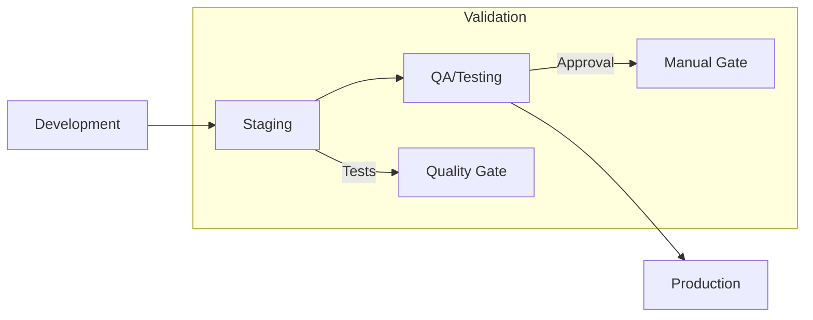
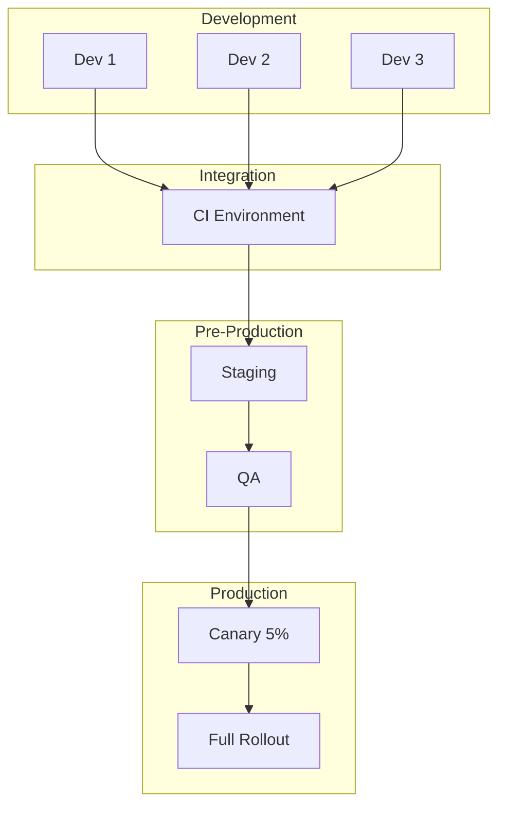
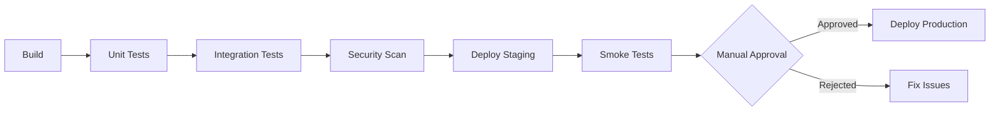
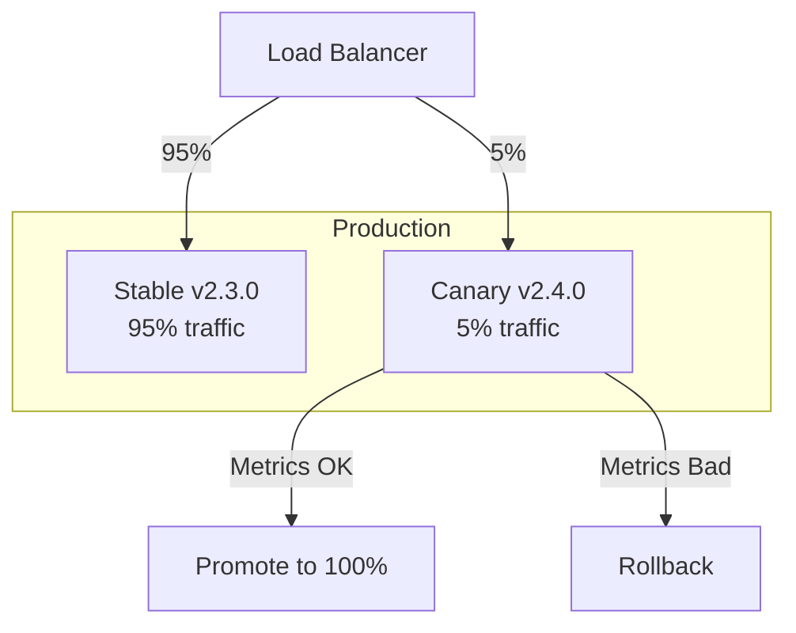

# How to Build Promotion Strategies

Author: [nawazdhandala](https://github.com/nawazdhandala)

Tags: DevOps, Promotion, Environments, CI/CD

Description: Learn to build promotion strategies for moving code between environments.

---

Promotion strategies define how code moves from development to production. A well-designed promotion pipeline catches bugs early, reduces deployment risk, and gives teams confidence to ship faster. This guide covers the patterns and tooling you need to build reliable promotion workflows.

## What Is Code Promotion?

Code promotion is the process of moving artifacts through a series of environments, each with increasing levels of scrutiny. The artifact stays the same; only the environment changes.



The key principle: build once, deploy many times. Your CI pipeline builds the artifact once, tags it with a version, and that exact artifact flows through every environment. No rebuilding between stages.

## Why Promotion Strategies Matter

Without a clear promotion strategy, teams often:
- Deploy untested code directly to production
- Lose track of which version runs where
- Rebuild artifacts for each environment, introducing inconsistencies
- Skip staging entirely when deadlines loom

A structured approach solves these problems by making promotion explicit, auditable, and automated where possible.

## Environment Topology

Most organizations use three to five environments. Here is a common setup.



Each environment serves a purpose:
- **Development**: Individual developer testing
- **CI**: Automated integration tests run here
- **Staging**: Mirror of production for final validation
- **QA**: Manual and exploratory testing
- **Canary**: Small percentage of production traffic
- **Production**: Full customer traffic

## Implementing Promotion with GitOps

GitOps provides an excellent foundation for promotion strategies. Each environment has its own configuration in Git, and promotions happen through pull requests or automated commits.

The following directory structure separates base configuration from environment-specific overlays.

```
infrastructure/
├── base/
│   ├── kustomization.yaml
│   ├── deployment.yaml
│   └── service.yaml
├── environments/
│   ├── development/
│   │   ├── kustomization.yaml
│   │   └── version.yaml        # Contains image tag
│   ├── staging/
│   │   ├── kustomization.yaml
│   │   └── version.yaml
│   └── production/
│       ├── kustomization.yaml
│       └── version.yaml
```

The version file for each environment specifies which artifact version to deploy.

```yaml
# environments/staging/version.yaml
# This file gets updated during promotion to staging
apiVersion: kustomize.config.k8s.io/v1beta1
kind: Kustomization
images:
  - name: myapp
    newTag: v2.3.1    # Promoted from development
```

## Automated Promotion Pipeline

This GitHub Actions workflow demonstrates automated promotion from staging to production after tests pass.

```yaml
# .github/workflows/promote.yaml
name: Promote to Production

on:
  workflow_dispatch:
    inputs:
      version:
        description: 'Version to promote'
        required: true

jobs:
  validate:
    runs-on: ubuntu-latest
    steps:
      # Verify the version exists and passed staging tests
      - name: Check staging test results
        run: |
          # Query your test reporting system
          RESULT=$(curl -s "https://tests.example.com/api/results?version=${{ inputs.version }}")
          if [[ "$RESULT" != "passed" ]]; then
            echo "Staging tests did not pass for version ${{ inputs.version }}"
            exit 1
          fi

  promote:
    needs: validate
    runs-on: ubuntu-latest
    steps:
      - uses: actions/checkout@v4

      # Update the production version file
      - name: Update production version
        run: |
          cd environments/production
          cat > version.yaml << EOF
          apiVersion: kustomize.config.k8s.io/v1beta1
          kind: Kustomization
          images:
            - name: myapp
              newTag: ${{ inputs.version }}
          EOF

      # Commit and push the change
      - name: Commit promotion
        run: |
          git config user.name "GitHub Actions"
          git config user.email "actions@github.com"
          git add environments/production/version.yaml
          git commit -m "Promote ${{ inputs.version }} to production"
          git push
```

## Quality Gates

Quality gates are checkpoints that must pass before promotion continues. They can be automated or manual.



This script implements a simple quality gate that checks multiple conditions before allowing promotion.

```bash
#!/bin/bash
# promote.sh - Quality gate for production promotion

VERSION=$1
TARGET_ENV=$2

echo "Running quality gates for $VERSION -> $TARGET_ENV"

# Gate 1: All unit tests must pass
echo "Checking unit test results..."
if ! curl -sf "https://ci.example.com/api/tests/$VERSION/unit" | jq -e '.passed == true'; then
    echo "FAILED: Unit tests did not pass"
    exit 1
fi

# Gate 2: Security scan must have no critical vulnerabilities
echo "Checking security scan..."
CRITICAL=$(curl -sf "https://security.example.com/api/scan/$VERSION" | jq '.critical')
if [[ "$CRITICAL" -gt 0 ]]; then
    echo "FAILED: Found $CRITICAL critical vulnerabilities"
    exit 1
fi

# Gate 3: Performance benchmarks must meet baseline
echo "Checking performance benchmarks..."
LATENCY=$(curl -sf "https://perf.example.com/api/benchmark/$VERSION" | jq '.p99_latency_ms')
if [[ "$LATENCY" -gt 200 ]]; then
    echo "FAILED: P99 latency ${LATENCY}ms exceeds 200ms threshold"
    exit 1
fi

# Gate 4: Staging deployment must be healthy
echo "Checking staging health..."
if ! kubectl get deploy myapp -n staging -o jsonpath='{.status.conditions[?(@.type=="Available")].status}' | grep -q "True"; then
    echo "FAILED: Staging deployment is not healthy"
    exit 1
fi

echo "All gates passed. Proceeding with promotion."
```

## Canary Deployments

Canary deployments reduce risk by routing a small percentage of traffic to the new version before full rollout.



This Kubernetes configuration implements traffic splitting using Istio.

```yaml
# canary-routing.yaml
# Routes 5% of traffic to the canary version for validation
apiVersion: networking.istio.io/v1beta1
kind: VirtualService
metadata:
  name: myapp
  namespace: production
spec:
  hosts:
    - myapp.example.com
  http:
    - route:
        # Send 95% of requests to the stable version
        - destination:
            host: myapp-stable
            port:
              number: 80
          weight: 95
        # Send 5% of requests to the canary for testing
        - destination:
            host: myapp-canary
            port:
              number: 80
          weight: 5
```

## Rollback Strategy

Every promotion strategy needs a rollback plan. The simplest approach is to redeploy the previous known-good version.

```bash
#!/bin/bash
# rollback.sh - Emergency rollback to previous version

ENVIRONMENT=$1
PREVIOUS_VERSION=$(git log --oneline environments/$ENVIRONMENT/version.yaml | head -2 | tail -1 | awk '{print $1}')

echo "Rolling back $ENVIRONMENT to previous commit: $PREVIOUS_VERSION"

# Revert to the previous version file
git checkout $PREVIOUS_VERSION -- environments/$ENVIRONMENT/version.yaml
git commit -m "Rollback $ENVIRONMENT to previous version"
git push

echo "Rollback initiated. Monitor deployment status."
```

For Kubernetes deployments, you can also use the built-in rollback command.

```bash
# View deployment history
kubectl rollout history deployment/myapp -n production

# Roll back to the previous revision
kubectl rollout undo deployment/myapp -n production

# Roll back to a specific revision
kubectl rollout undo deployment/myapp -n production --to-revision=5
```

## Promotion Checklist

Before promoting to production, verify these items.

**Automated Checks:**
- All unit and integration tests pass
- Security scan shows no critical vulnerabilities
- Performance benchmarks meet thresholds
- Container image exists in the registry
- Configuration is valid (dry-run deployment)

**Manual Checks:**
- Change has been reviewed and approved
- Documentation is updated if needed
- Stakeholders are notified
- On-call engineer is aware of the deployment
- Rollback plan is documented

## Monitoring Promotions

Track promotion metrics to improve your process over time.

```yaml
# prometheus-rules.yaml
# Alert if promotion pipeline is slow or failing
groups:
  - name: promotion-metrics
    rules:
      # Track how long promotions take
      - record: promotion_duration_seconds
        expr: |
          histogram_quantile(0.95,
            rate(promotion_pipeline_duration_bucket[1h])
          )

      # Alert on promotion failures
      - alert: PromotionFailureRate
        expr: |
          rate(promotion_failures_total[1h]) /
          rate(promotion_attempts_total[1h]) > 0.1
        for: 15m
        labels:
          severity: warning
        annotations:
          summary: "High promotion failure rate"
          description: "More than 10% of promotions are failing"
```

---

Promotion strategies turn chaotic deployments into predictable, repeatable processes. Start with a simple linear promotion path, add quality gates as you identify failure modes, and gradually introduce canary deployments for high-risk changes. The investment in promotion infrastructure pays off in fewer production incidents and faster time to recovery when issues do occur.
